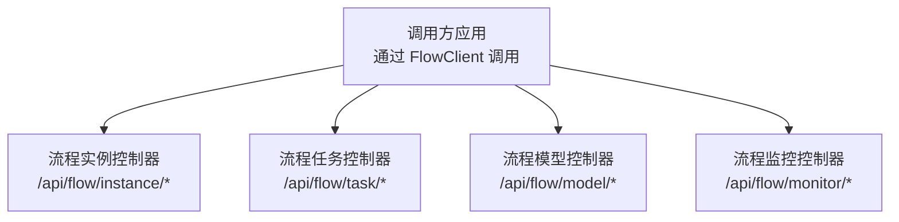
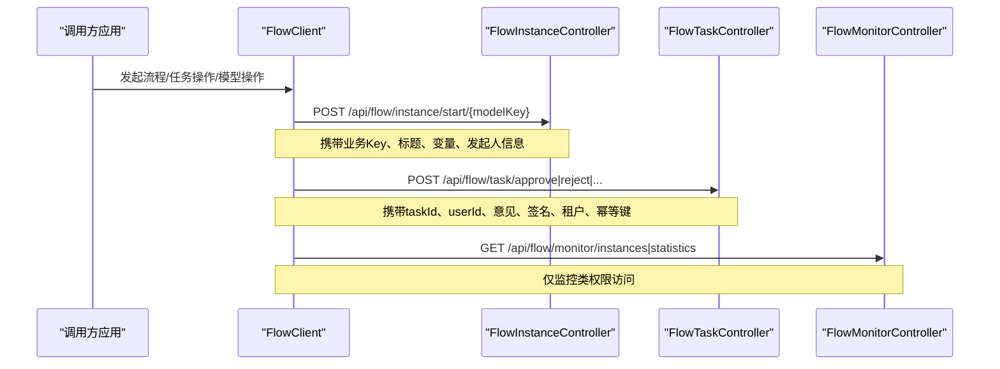
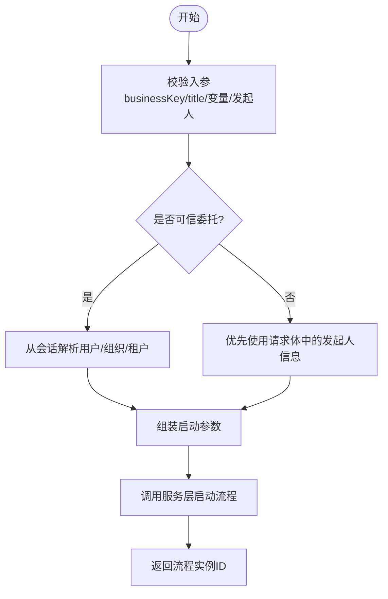
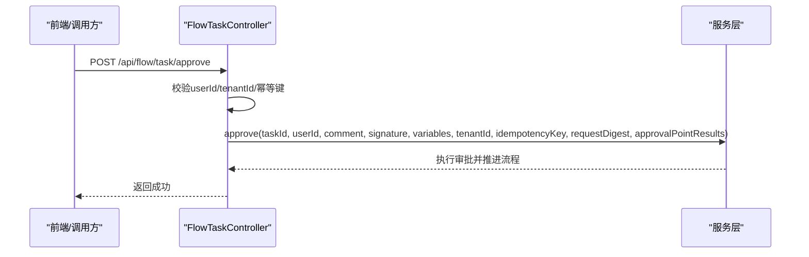
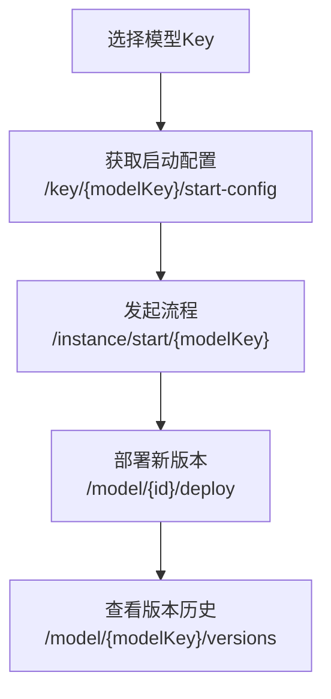
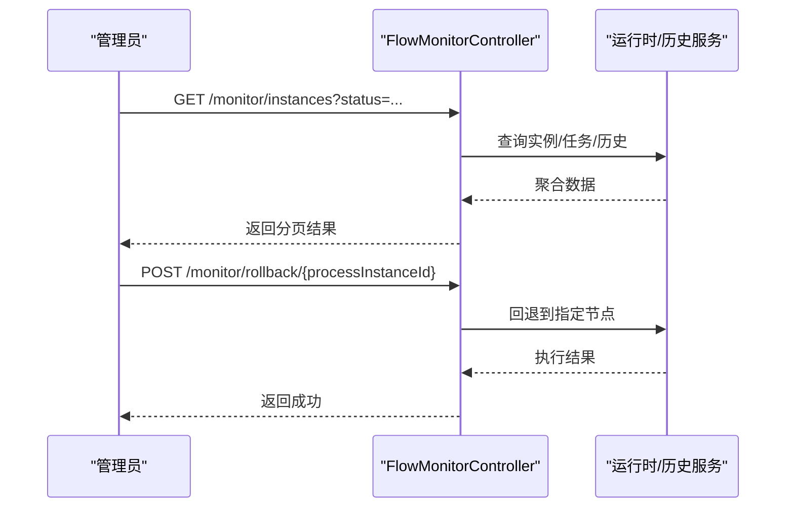
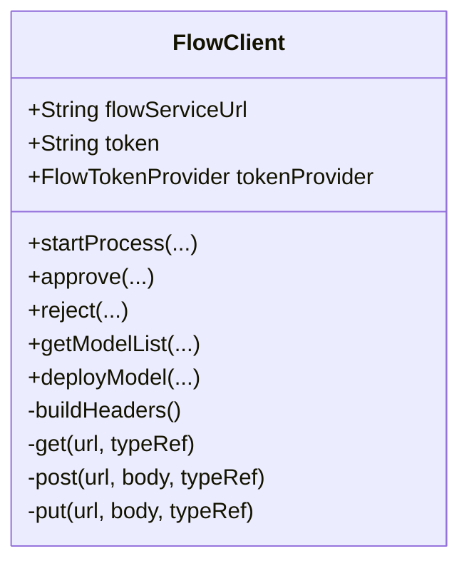
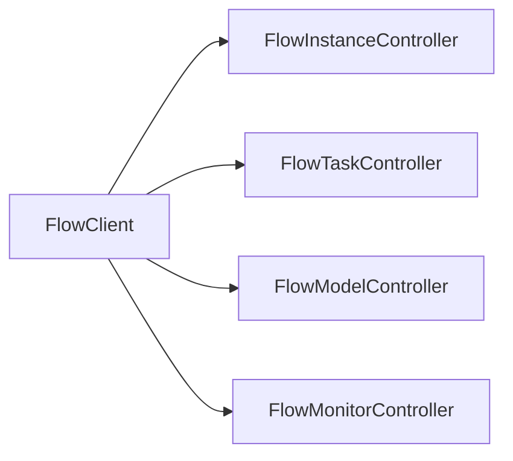

# 工作流API

<cite>
**本文引用的文件**
- [FlowClient.java](file://forge-server/forge-flow/forge-flow-client/src/main/java/com/mdframe/forge/flow/client/FlowClient.java)
- [FlowInstanceController.java](file://forge-server/forge-flow/forge-flow-server/src/main/java/com/mdframe/forge/flow/controller/FlowInstanceController.java)
- [FlowTaskController.java](file://forge-server/forge-flow/forge-flow-server/src/main/java/com/mdframe/forge/flow/controller/FlowTaskController.java)
- [FlowMonitorController.java](file://forge-server/forge-flow/forge-flow-server/src/main/java/com/mdframe/forge/flow/controller/FlowMonitorController.java)
- [FlowModelController.java](file://forge-server/forge-flow/forge-flow-server/src/main/java/com/mdframe/forge/flow/controller/FlowModelController.java)
</cite>

## 目录
1. [简介](#简介)
2. [项目结构](#项目结构)
3. [核心组件](#核心组件)
4. [架构总览](#架构总览)
5. [详细组件分析](#详细组件分析)
6. [依赖关系分析](#依赖关系分析)
7. [性能与优化](#性能与优化)
8. [故障排查指南](#故障排查指南)
9. [结论](#结论)
10. [附录：接口速查](#附录接口速查)

## 简介
本文件面向使用 Forge 工作流能力的开发者，系统化说明流程设计器、流程实例管理、任务审批与流程监控等核心接口的使用方法，覆盖 BPMN 流程定义、节点配置与流转规则、任务分配、审批流程与版本管理。文档同时给出流程优化、性能调优与异常处理的最佳实践建议，帮助你在业务系统中稳定、高效地集成工作流能力。

## 项目结构
工作流能力由“客户端 SDK”和“服务端控制器”两部分组成：
- 客户端 SDK（FlowClient）：提供发起流程、任务操作、模型管理等 HTTP 封装方法，自动注入鉴权头并统一序列化响应。
- 服务端控制器：按职责划分实例、任务、模型、监控等 REST 接口，内部委托服务层完成业务流程编排与数据持久化。

图表来源
- [FlowClient.java:73-514](file://forge-server/forge-flow/forge-flow-client/src/main/java/com/mdframe/forge/flow/client/FlowClient.java#L73-L514)
- [FlowInstanceController.java:44-239](file://forge-server/forge-flow/forge-flow-server/src/main/java/com/mdframe/forge/flow/controller/FlowInstanceController.java#L44-L239)
- [FlowTaskController.java:46-371](file://forge-server/forge-flow/forge-flow-server/src/main/java/com/mdframe/forge/flow/controller/FlowTaskController.java#L46-L371)
- [FlowModelController.java:33-231](file://forge-server/forge-flow/forge-flow-server/src/main/java/com/mdframe/forge/flow/controller/FlowModelController.java#L33-L231)
- [FlowMonitorController.java:48-382](file://forge-server/forge-flow/forge-flow-server/src/main/java/com/mdframe/forge/flow/controller/FlowMonitorController.java#L48-L382)

章节来源
- [FlowClient.java:73-514](file://forge-server/forge-flow/forge-flow-client/src/main/java/com/mdframe/forge/flow/client/FlowClient.java#L73-L514)
- [FlowInstanceController.java:44-239](file://forge-server/forge-flow/forge-flow-server/src/main/java/com/mdframe/forge/flow/controller/FlowInstanceController.java#L44-L239)
- [FlowTaskController.java:46-371](file://forge-server/forge-flow/forge-flow-server/src/main/java/com/mdframe/forge/flow/controller/FlowTaskController.java#L46-L371)
- [FlowModelController.java:33-231](file://forge-server/forge-flow/forge-flow-server/src/main/java/com/mdframe/forge/forge-flow-server/src/main/java/com/mdframe/forge/flow/controller/FlowModelController.java#L33-L231)
- [FlowMonitorController.java:48-382](file://forge-server/forge-flow/forge-flow-server/src/main/java/com/mdframe/forge/flow/controller/FlowMonitorController.java#L48-L382)

## 核心组件
- 流程实例管理（FlowInstanceController）
  - 负责流程的启动、状态查询、变量读写、终止与删除、分页列表与详情。
  - 支持普通发起与“可信委托”发起（用于平台高风险审批场景）。
- 任务审批（FlowTaskController）
  - 提供待办/已办/我发起的任务查询、签收、审批通过/驳回/退回/转办/改派/撤回/终结、流程图与表单信息获取、催办与逾期提醒扫描。
- 流程模型与版本（FlowModelController）
  - 提供模型的创建、更新、删除、启用/禁用/挂起/激活、部署、导入导出、复制、Key 唯一性检查、版本历史查询与启动参数配置。
- 流程监控（FlowMonitorController）
  - 提供统计指标、实例分页与详情、当前活动任务、历史活动节点、变量查看、管理员级终止/回退/转派/删除、挂起/激活等操作。
- 客户端 SDK（FlowClient）
  - 统一封装上述控制器的 HTTP 调用，自动设置内容类型、内网调用标识、动态或静态 Token 透传，并提供常用业务语义方法（如 startProcess、approve、reject 等）。

章节来源
- [FlowInstanceController.java:44-239](file://forge-server/forge-flow/forge-flow-server/src/main/java/com/mdframe/forge/flow/controller/FlowInstanceController.java#L44-L239)
- [FlowTaskController.java:46-371](file://forge-server/forge-flow/forge-flow-server/src/main/java/com/mdframe/forge/flow/controller/FlowTaskController.java#L46-L371)
- [FlowModelController.java:33-231](file://forge-server/forge-flow/forge-flow-server/src/main/java/com/mdframe/forge/flow/controller/FlowModelController.java#L33-L231)
- [FlowMonitorController.java:48-382](file://forge-server/forge-flow/forge-flow-server/src/main/java/com/mdframe/forge/flow/controller/FlowMonitorController.java#L48-L382)
- [FlowClient.java:73-514](file://forge-server/forge-flow/forge-flow-client/src/main/java/com/mdframe/forge/flow/client/FlowClient.java#L73-L514)

## 架构总览
下图展示了从调用方到服务端控制器的典型请求链路，以及关键职责边界。

图表来源
- [FlowClient.java:73-514](file://forge-server/forge-flow/forge-flow-client/src/main/java/com/mdframe/forge/flow/client/FlowClient.java#L73-L514)
- [FlowInstanceController.java:44-145](file://forge-server/forge-flow/forge-flow-server/src/main/java/com/mdframe/forge/flow/controller/FlowInstanceController.java#L44-L145)
- [FlowTaskController.java:123-165](file://forge-server/forge-flow/forge-flow-server/src/main/java/com/mdframe/forge/flow/controller/FlowTaskController.java#L123-L165)
- [FlowMonitorController.java:48-110](file://forge-server/forge-flow/forge-flow-server/src/main/java/com/mdframe/forge/flow/controller/FlowMonitorController.java#L48-L110)

## 详细组件分析

### 流程实例管理（FlowInstanceController）
- 启动流程
  - 普通发起：POST /api/flow/instance/start/{modelKey}
  - 可信委托发起：POST /api/flow/instance/start-delegated/{modelKey}（需具备指定权限）
  - 平台高风险审批专用委托：POST /api/flow/instance/start-delegated-approval/{modelKey}
  - 入参要点：businessKey、businessType、title、variables、userId/userName/deptId/deptName；未传入时会自动补齐默认值。
- 状态与变量
  - 获取状态：GET /api/flow/instance/status/{businessKey}
  - 获取/更新变量：GET/PUT /api/flow/instance/variables/{businessKey}
- 生命周期
  - 终止：POST /api/flow/instance/terminate/{businessKey}
  - 删除：DELETE /api/flow/instance/{businessKey}
- 列表与详情
  - 分页：GET /api/flow/instance/page
  - 详情：GET /api/flow/instance/detail/{processInstanceId}

图表来源
- [FlowInstanceController.java:44-145](file://forge-server/forge-flow/forge-flow-server/src/main/java/com/mdframe/forge/flow/controller/FlowInstanceController.java#L44-L145)

章节来源
- [FlowInstanceController.java:44-239](file://forge-server/forge-flow/forge-flow-server/src/main/java/com/mdframe/forge/flow/controller/FlowInstanceController.java#L44-L239)

### 任务审批（FlowTaskController）
- 任务查询
  - 我的待办：GET /api/flow/task/todo
  - 我的已办：GET /api/flow/task/done
  - 我发起的：GET /api/flow/task/started
  - 候选任务（未签收）：GET /api/flow/task/candidate
- 任务操作
  - 签收：POST /api/flow/task/claim
  - 审批通过：POST /api/flow/task/approve（支持签名、租户、幂等键、审批点结果）
  - 审批驳回：POST /api/flow/task/reject
  - 驳回至发起人修改路径：POST /api/flow/task/reject-to-start
  - 退回上一节点：POST /api/flow/task/return（可指定目标节点）
  - 转办：POST /api/flow/task/delegate
  - 改派：POST /api/flow/task/reassign
  - 撤回：POST /api/flow/task/withdraw
  - 终结：POST /api/flow/task/terminate
  - 催办：POST /api/flow/task/remind
- 辅助信息
  - 任务详情：GET /api/flow/task/{taskId}
  - 流程图：GET /api/flow/task/diagram/{processInstanceId}
  - 流程图详情（含节点信息）：GET /api/flow/task/diagram-info/{processInstanceId}?includeImage=true
  - 任务表单信息：GET /api/flow/task/form/{taskId}
  - 流程关联表单信息（只读场景）：GET /api/flow/task/form?processInstanceId|businessKey|processDefKey|taskId|taskDefKey
  - 审批时间轴：GET /api/flow/task/history/{processInstanceId}
  - 手动触发逾期提醒扫描：POST /api/flow/task/overdue-reminder/scan

图表来源
- [FlowTaskController.java:123-165](file://forge-server/forge-flow/forge-flow-server/src/main/java/com/mdframe/forge/flow/controller/FlowTaskController.java#L123-L165)

章节来源
- [FlowTaskController.java:46-371](file://forge-server/forge-flow/forge-flow-server/src/main/java/com/mdframe/forge/flow/controller/FlowTaskController.java#L46-L371)

### 流程模型与版本（FlowModelController）
- 模型管理
  - 分页查询：GET /api/flow/model/page
  - 启用模型列表：GET /api/flow/model/enabled
  - 状态统计：GET /api/flow/model/statistics
  - 详情/按Key获取：GET /api/flow/model/{id}、GET /api/flow/model/key/{modelKey}
  - 启动参数配置：GET /api/flow/model/key/{modelKey}/start-config
  - 创建/更新/删除：POST/PUT/DELETE /api/flow/model
  - 部署：POST /api/flow/model/{id}/deploy
  - 启用/禁用/挂起/激活：POST /api/flow/model/{id}/{action}
  - 版本历史：GET /api/flow/model/{modelKey}/versions
  - 导入/导出：POST /api/flow/model/import、GET /api/flow/model/{id}/export
  - 复制：POST /api/flow/model/{id}/copy
  - Key 唯一性检查：GET /api/flow/model/checkKey
  - 下拉列表：GET /api/flow/model/list

图表来源
- [FlowModelController.java:82-171](file://forge-server/forge-flow/forge-flow-server/src/main/java/com/mdframe/forge/flow/controller/FlowModelController.java#L82-L171)
- [FlowInstanceController.java:44-145](file://forge-server/forge-flow/forge-flow-server/src/main/java/com/mdframe/forge/flow/controller/FlowInstanceController.java#L44-L145)

章节来源
- [FlowModelController.java:33-231](file://forge-server/forge-flow/forge-flow-server/src/main/java/com/mdframe/forge/flow/controller/FlowModelController.java#L33-L231)

### 流程监控（FlowMonitorController）
- 统计与趋势
  - 统计数据：GET /api/flow/monitor/statistics
  - 任务趋势：GET /api/flow/monitor/taskTrend
  - 流程分布：GET /api/flow/monitor/processDistribution
- 实例管理
  - 分页查询：GET /api/flow/monitor/instances
  - 实例详情：GET /api/flow/monitor/instance/{processInstanceId}
  - 变量查看：GET /api/flow/monitor/variables/{processInstanceId}
  - 活动节点：GET /api/flow/monitor/activities/{processInstanceId}
  - 当前任务：GET /api/flow/monitor/current-tasks/{processInstanceId}
- 管理员操作
  - 终止：POST /api/flow/monitor/terminate/{processInstanceId}
  - 回退：POST /api/flow/monitor/rollback/{processInstanceId}
  - 转派：POST /api/flow/monitor/reassign/{taskId}
  - 删除单条：POST /api/flow/monitor/instance/{processInstanceId}/delete
  - 批量清理：POST /api/flow/monitor/instances/cleanup
  - 挂起/激活：POST /api/flow/monitor/suspend|activate/{processInstanceId}

图表来源
- [FlowMonitorController.java:48-186](file://forge-server/forge-flow/forge-flow-server/src/main/java/com/mdframe/forge/flow/controller/FlowMonitorController.java#L48-L186)

章节来源
- [FlowMonitorController.java:48-382](file://forge-server/forge-flow/forge-flow-server/src/main/java/com/mdframe/forge/flow/controller/FlowMonitorController.java#L48-L382)

### 客户端 SDK（FlowClient）
- 作用
  - 为其他微服务/模块提供统一的 HTTP 调用封装，简化发起流程、任务操作、模型管理等常见场景。
- 关键特性
  - 自动设置 Content-Type 与内网调用标识，避免重复加解密。
  - 支持静态 Token 与动态 TokenProvider 两种模式，优先使用上下文中的 Token。
  - 统一异常包装与空响应体检测，便于上层快速定位问题。
- 常用方法
  - 发起流程：startProcess(...)、startProcessForDelegatedUser(...)、startHighRiskApprovalForDelegatedUser(...)
  - 任务操作：getTodoTasks/getDoneTasks/getStartedTasks、getTaskDetail/getTaskFormInfo、claimTask、approve、reject、returnTask、delegate、remind
  - 模型操作：getModelList/getModelByKey/getModelStartConfig/createModel/updateModel/deployModel
  - 其他：getProcessStatus/getProcessVariables/updateProcessVariables、getProcessComments、getProcessDiagram

图表来源
- [FlowClient.java:33-60](file://forge-server/forge-flow/forge-flow-client/src/main/java/com/mdframe/forge/flow/client/FlowClient.java#L33-L60)
- [FlowClient.java:73-514](file://forge-server/forge-flow/forge-flow-client/src/main/java/com/mdframe/forge/flow/client/FlowClient.java#L73-L514)
- [FlowClient.java:524-599](file://forge-server/forge-flow/forge-flow-client/src/main/java/com/mdframe/forge/flow/client/FlowClient.java#L524-L599)

章节来源
- [FlowClient.java:73-514](file://forge-server/forge-flow/forge-flow-client/src/main/java/com/mdframe/forge/flow/client/FlowClient.java#L73-L514)
- [FlowClient.java:524-599](file://forge-server/forge-flow/forge-flow-client/src/main/java/com/mdframe/forge/flow/client/FlowClient.java#L524-L599)

## 依赖关系分析
- 控制器与服务层
  - FlowInstanceController 依赖 FlowInstanceService、FlowMonitorService、FlowOrgIntegrationService。
  - FlowTaskController 依赖 FlowTaskService、FlowOverdueReminderService。
  - FlowMonitorController 依赖 RuntimeService、TaskService、HistoryService、FlowInstanceService、FlowMonitorService。
  - FlowModelController 依赖 FlowModelService。
- 客户端与服务端
  - FlowClient 通过 RestTemplate 调用各 Controller 暴露的 REST 接口，统一封装 JSON 序列化与鉴权头。

图表来源
- [FlowClient.java:73-514](file://forge-server/forge-flow/forge-flow-client/src/main/java/com/mdframe/forge/flow/client/FlowClient.java#L73-L514)
- [FlowInstanceController.java:39-42](file://forge-server/forge-flow/forge-flow-server/src/main/java/com/mdframe/forge/flow/controller/FlowInstanceController.java#L39-L42)
- [FlowTaskController.java:43-44](file://forge-server/forge-flow/forge-flow-server/src/main/java/com/mdframe/forge/flow/controller/FlowTaskController.java#L43-L44)
- [FlowMonitorController.java:42-46](file://forge-server/forge-flow/forge-flow-server/src/main/java/com/mdframe/forge/flow/controller/FlowMonitorController.java#L42-L46)
- [FlowModelController.java:31-31](file://forge-server/forge-flow/forge-flow-server/src/main/java/com/mdframe/forge/flow/controller/FlowModelController.java#L31-L31)

章节来源
- [FlowInstanceController.java:39-42](file://forge-server/forge-flow/forge-flow-server/src/main/java/com/mdframe/forge/flow/controller/FlowInstanceController.java#L39-L42)
- [FlowTaskController.java:43-44](file://forge-server/forge-flow/forge-flow-server/src/main/java/com/mdframe/forge/flow/controller/FlowTaskController.java#L43-L44)
- [FlowMonitorController.java:42-46](file://forge-server/forge-flow/forge-flow-server/src/main/java/com/mdframe/forge/flow/controller/FlowMonitorController.java#L42-L46)
- [FlowModelController.java:31-31](file://forge-server/forge-flow/forge-flow-server/src/main/java/com/mdframe/forge/flow/controller/FlowModelController.java#L31-L31)

## 性能与优化
- 分页与过滤
  - 任务与实例列表均支持分页与多条件过滤，建议在调用时合理设置 pageNum、pageSize 与筛选字段，减少不必要的数据传输。
- 幂等与重试
  - 审批/驳回等写操作支持 idempotencyKey 与 requestDigest，结合客户端重试策略可避免重复提交。
- 异步与批处理
  - 对大批量任务操作（如批量清理、批量转派）建议使用监控端提供的批量接口，并在服务端侧进行分批处理。
- 缓存与只读
  - 流程图与表单信息等只读数据可通过缓存降低重复计算与 IO 压力。
- 超时与降级
  - 客户端在空响应体或网络异常时抛出统一异常，建议上层实现超时与熔断降级逻辑。

[本节为通用指导，不直接分析具体文件]

## 故障排查指南
- 启动失败
  - 检查 modelKey 是否存在且已启用；确认 businessKey/title/variables 是否完整；若使用可信委托，确保会话中用户/组织/租户信息有效。
- 任务操作失败
  - 核对 taskId、userId、tenantId 是否一致；检查幂等键是否重复；关注审批点结果与签名是否正确传递。
- 监控数据为空
  - 确认流程实例是否存在于当前租户范围；检查运行时/历史服务是否可正常查询；必要时查看日志输出。
- 客户端调用异常
  - 关注 FlowClient 抛出的统一异常信息，包含 HTTP 方法与 URL，便于快速定位服务端问题。

章节来源
- [FlowInstanceController.java:79-145](file://forge-server/forge-flow/forge-flow-server/src/main/java/com/mdframe/forge/flow/controller/FlowInstanceController.java#L79-L145)
- [FlowTaskController.java:167-176](file://forge-server/forge-flow/forge-flow-server/src/main/java/com/mdframe/forge/flow/controller/FlowTaskController.java#L167-L176)
- [FlowMonitorController.java:241-275](file://forge-server/forge-flow/forge-flow-server/src/main/java/com/mdframe/forge/flow/controller/FlowMonitorController.java#L241-L275)
- [FlowClient.java:549-599](file://forge-server/forge-flow/forge-flow-client/src/main/java/com/mdframe/forge/flow/client/FlowClient.java#L549-L599)

## 结论
本工作流 API 以清晰的职责分层与丰富的接口能力，覆盖了从流程建模、实例运行、任务审批到监控运维的全生命周期。通过客户端 SDK 的统一封装，业务系统可以便捷地集成流程能力；借助监控与管理接口，运维人员可对流程运行进行可视化管控与干预。建议在实际项目中结合分页、幂等、缓存与超时降级等策略，进一步提升稳定性与性能。

[本节为总结，不直接分析具体文件]

## 附录：接口速查
- 流程实例
  - 启动：POST /api/flow/instance/start/{modelKey}
  - 可信委托启动：POST /api/flow/instance/start-delegated/{modelKey}
  - 高风险审批委托启动：POST /api/flow/instance/start-delegated-approval/{modelKey}
  - 状态：GET /api/flow/instance/status/{businessKey}
  - 变量：GET/PUT /api/flow/instance/variables/{businessKey}
  - 终止：POST /api/flow/instance/terminate/{businessKey}
  - 删除：DELETE /api/flow/instance/{businessKey}
  - 分页：GET /api/flow/instance/page
  - 详情：GET /api/flow/instance/detail/{processInstanceId}
- 任务
  - 待办/已办/我发起：GET /api/flow/task/{todo|done|started}
  - 候选任务：GET /api/flow/task/candidate
  - 签收：POST /api/flow/task/claim
  - 审批通过：POST /api/flow/task/approve
  - 驳回：POST /api/flow/task/reject
  - 驳回至发起人：POST /api/flow/task/reject-to-start
  - 退回：POST /api/flow/task/return
  - 转办：POST /api/flow/task/delegate
  - 改派：POST /api/flow/task/reassign
  - 撤回：POST /api/flow/task/withdraw
  - 终结：POST /api/flow/task/terminate
  - 催办：POST /api/flow/task/remind
  - 详情：GET /api/flow/task/{taskId}
  - 流程图：GET /api/flow/task/diagram/{processInstanceId}
  - 流程图详情：GET /api/flow/task/diagram-info/{processInstanceId}?includeImage=true
  - 任务表单：GET /api/flow/task/form/{taskId}
  - 流程表单（只读）：GET /api/flow/task/form?...
  - 时间轴：GET /api/flow/task/history/{processInstanceId}
  - 逾期扫描：POST /api/flow/task/overdue-reminder/scan
- 模型
  - 分页/启用列表/统计：GET /api/flow/model/{page|enabled|statistics}
  - 详情/按Key：GET /api/flow/model/{id|key/{modelKey}}
  - 启动配置：GET /api/flow/model/key/{modelKey}/start-config
  - 增删改：POST/PUT/DELETE /api/flow/model
  - 部署：POST /api/flow/model/{id}/deploy
  - 启停/挂活：POST /api/flow/model/{id}/{enable|disable|suspend|activate}
  - 版本历史：GET /api/flow/model/{modelKey}/versions
  - 导入/导出：POST /api/flow/model/import、GET /api/flow/model/{id}/export
  - 复制：POST /api/flow/model/{id}/copy
  - Key 检查：GET /api/flow/model/checkKey
  - 下拉列表：GET /api/flow/model/list
- 监控
  - 统计/趋势/分布：GET /api/flow/monitor/{statistics|taskTrend|processDistribution}
  - 实例分页/详情：GET /api/flow/monitor/{instances|instance/{processInstanceId}}
  - 变量/活动/当前任务：GET /api/flow/monitor/{variables|activities|current-tasks}/{processInstanceId}
  - 管理员操作：POST /api/flow/monitor/{terminate|rollback|reassign|cleanup|suspend|activate}

[本节为接口速查，不直接分析具体文件]