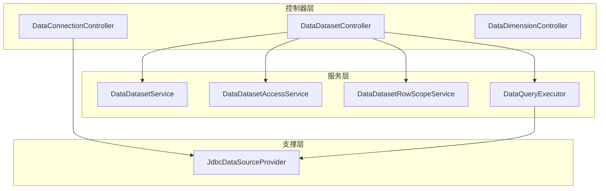
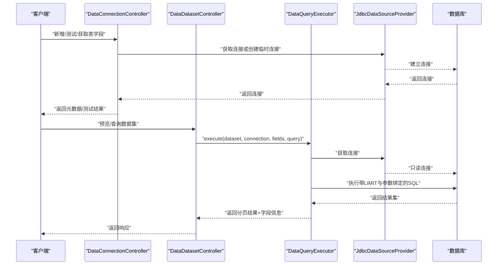
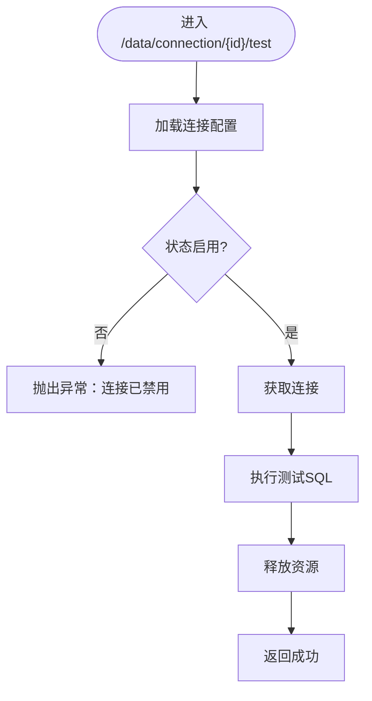
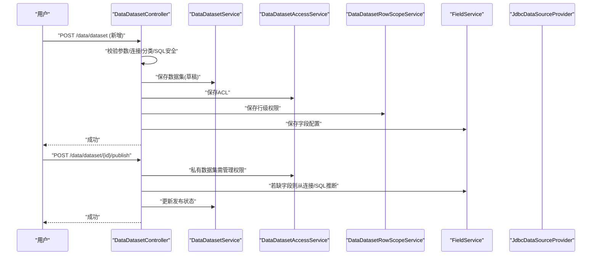
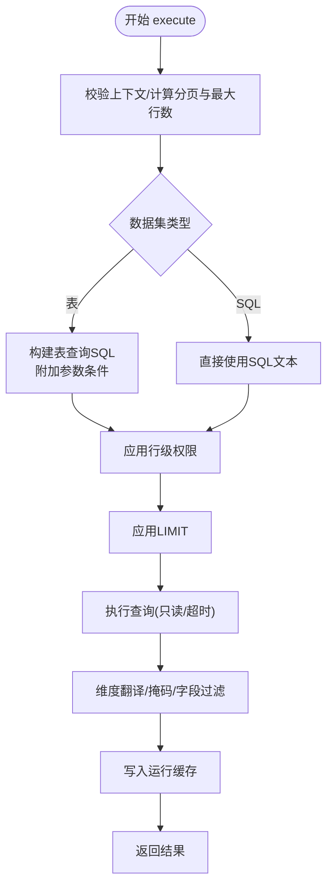
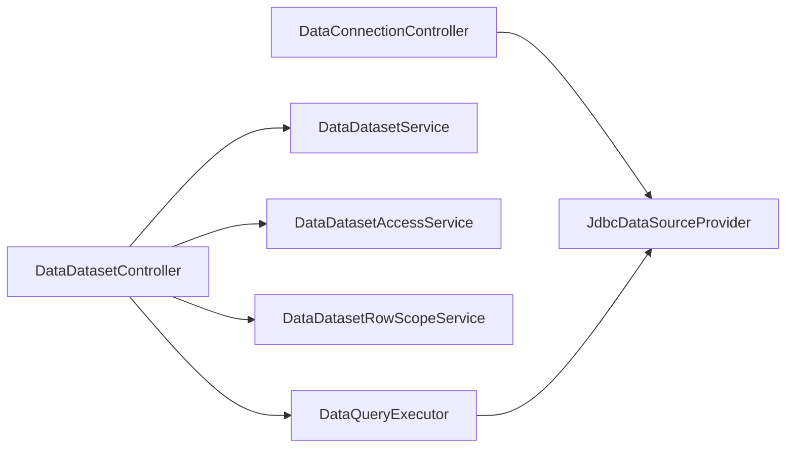

# 数据管理API

<cite>
**本文引用的文件**
- [DataDatasetController.java](file://forge-server/forge-framework/forge-plugin-parent/forge-plugin-data/src/main/java/com/mdframe/forge/plugin/data/controller/DataDatasetController.java)
- [DataConnectionController.java](file://forge-server/forge-framework/forge-plugin-parent/forge-plugin-data/src/main/java/com/mdframe/forge/plugin/data/controller/DataConnectionController.java)
- [DataDimensionController.java](file://forge-server/forge-framework/forge-plugin-parent/forge-plugin-data/src/main/java/com/mdframe/forge/plugin/data/controller/DataDimensionController.java)
- [DataQueryExecutor.java](file://forge-server/forge-framework/forge-plugin-parent/forge-plugin-data/src/main/java/com/mdframe/forge/plugin/data/service/DataQueryExecutor.java)
- [DataDatasetService.java](file://forge-server/forge-framework/forge-plugin-parent/forge-plugin-data/src/main/java/com/mdframe/forge/plugin/data/service/DataDatasetService.java)
- [DataDatasetRowScopeService.java](file://forge-server/forge-framework/forge-plugin-parent/forge-plugin-data/src/main/java/com/mdframe/forge/plugin/data/service/DataDatasetRowScopeService.java)
- [DataDatasetAccessService.java](file://forge-server/forge-framework/forge-plugin-parent/forge-plugin-data/src/main/java/com/mdframe/forge/plugin/data/service/DataDatasetAccessService.java)
- [JdbcDataSourceProvider.java](file://forge-server/forge-framework/forge-plugin-parent/forge-plugin-data/src/main/java/com/mdframe/forge/plugin/data/support/JdbcDataSourceProvider.java)
</cite>

## 目录
1. [简介](#简介)
2. [项目结构](#项目结构)
3. [核心组件](#核心组件)
4. [架构总览](#架构总览)
5. [详细组件分析](#详细组件分析)
6. [依赖关系分析](#依赖关系分析)
7. [性能考虑](#性能考虑)
8. [故障排查指南](#故障排查指南)
9. [结论](#结论)
10. [附录](#附录)

## 简介
本文件面向数据管理API，系统性说明数据集管理、数据源连接、维度建模与查询分析等能力的使用方法。重点覆盖SQL执行、数据同步、实时查询与数据分析流程；并给出数据权限控制、查询优化与结果集处理的实现要点；最后提供数据治理、质量监控与性能调优的最佳实践建议。

## 项目结构
数据管理能力集中在数据插件模块中，以控制器（Controller）暴露REST接口，服务层（Service）封装业务逻辑，支撑类（Support）负责数据库连接、方言适配与安全校验等基础设施。

图表来源
- [DataConnectionController.java:31-42](file://forge-server/forge-framework/forge-plugin-parent/forge-plugin-data/src/main/java/com/mdframe/forge/plugin/data/controller/DataConnectionController.java#L31-L42)
- [DataDatasetController.java:53-72](file://forge-server/forge-framework/forge-plugin-parent/forge-plugin-data/src/main/java/com/mdframe/forge/plugin/data/controller/DataDatasetController.java#L53-L72)
- [DataDimensionController.java:19-27](file://forge-server/forge-framework/forge-plugin-parent/forge-plugin-data/src/main/java/com/mdframe/forge/plugin/data/controller/DataDimensionController.java#L19-L27)
- [DataQueryExecutor.java:25-38](file://forge-server/forge-framework/forge-plugin-parent/forge-plugin-data/src/main/java/com/mdframe/forge/plugin/data/service/DataQueryExecutor.java#L25-L38)
- [JdbcDataSourceProvider.java:18-34](file://forge-server/forge-framework/forge-plugin-parent/forge-plugin-data/src/main/java/com/mdframe/forge/plugin/data/support/JdbcDataSourceProvider.java#L18-L34)

章节来源
- [DataConnectionController.java:31-42](file://forge-server/forge-framework/forge-plugin-parent/forge-plugin-data/src/main/java/com/mdframe/forge/plugin/data/controller/DataConnectionController.java#L31-L42)
- [DataDatasetController.java:53-72](file://forge-server/forge-framework/forge-plugin-parent/forge-plugin-data/src/main/java/com/mdframe/forge/plugin/data/controller/DataDatasetController.java#L53-L72)
- [DataDimensionController.java:19-27](file://forge-server/forge-framework/forge-plugin-parent/forge-plugin-data/src/main/java/com/mdframe/forge/plugin/data/controller/DataDimensionController.java#L19-L27)
- [DataQueryExecutor.java:25-38](file://forge-server/forge-framework/forge-plugin-parent/forge-plugin-data/src/main/java/com/mdframe/forge/plugin/data/service/DataQueryExecutor.java#L25-L38)
- [JdbcDataSourceProvider.java:18-34](file://forge-server/forge-framework/forge-plugin-parent/forge-plugin-data/src/main/java/com/mdframe/forge/plugin/data/support/JdbcDataSourceProvider.java#L18-L34)

## 核心组件
- 数据连接管理：提供连接的增删改查、测试连通性、表/字段元数据读取，并对敏感信息进行脱敏处理。
- 数据集管理：支持表型与SQL型数据集的创建、编辑、发布/下架、字段同步、预览与参数化查询。
- 维度建模：维护维度及其项值，支持同步与批量保存，用于查询结果的标签转换。
- 查询执行器：统一构建SQL、应用行级权限、分页限制、参数绑定、缓存、维度翻译与敏感字段掩码。
- 访问控制：基于数据集ACL与行级权限，实现查看、查询与管理级别访问控制。
- 数据源提供者：基于HikariCP的连接池管理与临时数据源创建，支持密码解密与连接生命周期管理。

章节来源
- [DataConnectionController.java:43-158](file://forge-server/forge-framework/forge-plugin-parent/forge-plugin-data/src/main/java/com/mdframe/forge/plugin/data/controller/DataConnectionController.java#L43-L158)
- [DataDatasetController.java:74-249](file://forge-server/forge-framework/forge-plugin-parent/forge-plugin-data/src/main/java/com/mdframe/forge/plugin/data/controller/DataDatasetController.java#L74-L249)
- [DataDimensionController.java:28-83](file://forge-server/forge-framework/forge-plugin-parent/forge-plugin-data/src/main/java/com/mdframe/forge/plugin/data/controller/DataDimensionController.java#L28-L83)
- [DataQueryExecutor.java:45-122](file://forge-server/forge-framework/forge-plugin-parent/forge-plugin-data/src/main/java/com/mdframe/forge/plugin/data/service/DataQueryExecutor.java#L45-L122)
- [DataDatasetAccessService.java:12-25](file://forge-server/forge-framework/forge-plugin-parent/forge-plugin-data/src/main/java/com/mdframe/forge/plugin/data/service/DataDatasetAccessService.java#L12-L25)
- [JdbcDataSourceProvider.java:27-61](file://forge-server/forge-framework/forge-plugin-parent/forge-plugin-data/src/main/java/com/mdframe/forge/plugin/data/support/JdbcDataSourceProvider.java#L27-L61)

## 架构总览
数据管理API采用分层架构：控制器接收请求，调用服务完成业务编排；查询执行器负责SQL构建与执行；支撑层提供连接池与方言适配；访问控制与行级权限贯穿查询链路。

图表来源
- [DataConnectionController.java:102-158](file://forge-server/forge-framework/forge-plugin-parent/forge-plugin-data/src/main/java/com/mdframe/forge/plugin/data/controller/DataConnectionController.java#L102-L158)
- [DataDatasetController.java:222-249](file://forge-server/forge-framework/forge-plugin-parent/forge-plugin-data/src/main/java/com/mdframe/forge/plugin/data/controller/DataDatasetController.java#L222-L249)
- [DataQueryExecutor.java:199-225](file://forge-server/forge-framework/forge-plugin-parent/forge-plugin-data/src/main/java/com/mdframe/forge/plugin/data/service/DataQueryExecutor.java#L199-L225)
- [JdbcDataSourceProvider.java:58-61](file://forge-server/forge-framework/forge-plugin-parent/forge-plugin-data/src/main/java/com/mdframe/forge/plugin/data/support/JdbcDataSourceProvider.java#L58-L61)

## 详细组件分析

### 数据连接管理（DataConnectionController）
- 功能要点
  - 连接CRUD：分页、列表、详情、新增、修改、删除（存在数据集引用时禁止删除）。
  - 连接测试：支持已保存连接与临时连接测试，使用连接配置中的测试SQL验证连通性。
  - 元数据读取：按关键字分页列出表，读取表的字段信息（列名、类型、注释、是否主键/可空）。
  - 安全脱敏：返回列表与详情时对密码与URL进行脱敏处理。
- 关键路径
  - 新增/修改：参数校验后持久化，修改后关闭旧数据源以刷新连接池。
  - 测试连接：通过数据源提供者获取连接，执行测试SQL并释放资源。
  - 表/字段查询：根据数据库方言生成系统表查询语句，映射为VO返回。

图表来源
- [DataConnectionController.java:102-126](file://forge-server/forge-framework/forge-plugin-parent/forge-plugin-data/src/main/java/com/mdframe/forge/plugin/data/controller/DataConnectionController.java#L102-L126)
- [DataConnectionController.java:214-267](file://forge-server/forge-framework/forge-plugin-parent/forge-plugin-data/src/main/java/com/mdframe/forge/plugin/data/controller/DataConnectionController.java#L214-L267)

章节来源
- [DataConnectionController.java:43-158](file://forge-server/forge-framework/forge-plugin-parent/forge-plugin-data/src/main/java/com/mdframe/forge/plugin/data/controller/DataConnectionController.java#L43-L158)
- [DataConnectionController.java:160-212](file://forge-server/forge-framework/forge-plugin-parent/forge-plugin-data/src/main/java/com/mdframe/forge/plugin/data/controller/DataConnectionController.java#L160-L212)
- [DataConnectionController.java:269-350](file://forge-server/forge-framework/forge-plugin-parent/forge-plugin-data/src/main/java/com/mdframe/forge/plugin/data/controller/DataConnectionController.java#L269-L350)

### 数据集管理（DataDatasetController）
- 功能要点
  - 数据集CRUD：支持表型与SQL型数据集的新增、修改、删除；发布/下架流程；字段同步与保存。
  - 预览能力：支持表预览与SQL预览，自动限制最大行数，参数化绑定与SQL安全检查。
  - 权限控制：私有数据集需管理权限才能编辑/发布；查询需具备查询权限。
  - 参数与分类：支持参数Schema定义与校验，关联分类与默认排序。
- 关键路径
  - 新增/修改：校验必填字段与连接可用性；SQL型需通过安全校验；保存ACL与行级权限；字段批量保存。
  - 发布：若未定义字段则从连接元数据或SQL首行推断字段；更新发布状态。
  - 预览：表模式直接SELECT * + LIMIT；SQL模式包裹子查询并LIMIT，参数预编译绑定。

图表来源
- [DataDatasetController.java:105-183](file://forge-server/forge-framework/forge-plugin-parent/forge-plugin-data/src/main/java/com/mdframe/forge/plugin/data/controller/DataDatasetController.java#L105-L183)
- [DataDatasetController.java:270-314](file://forge-server/forge-framework/forge-plugin-parent/forge-plugin-data/src/main/java/com/mdframe/forge/plugin/data/controller/DataDatasetController.java#L270-L314)
- [DataDatasetController.java:424-465](file://forge-server/forge-framework/forge-plugin-parent/forge-plugin-data/src/main/java/com/mdframe/forge/plugin/data/controller/DataDatasetController.java#L424-L465)

章节来源
- [DataDatasetController.java:74-249](file://forge-server/forge-framework/forge-plugin-parent/forge-plugin-data/src/main/java/com/mdframe/forge/plugin/data/controller/DataDatasetController.java#L74-L249)
- [DataDatasetController.java:251-359](file://forge-server/forge-framework/forge-plugin-parent/forge-plugin-data/src/main/java/com/mdframe/forge/plugin/data/controller/DataDatasetController.java#L251-L359)
- [DataDatasetController.java:424-515](file://forge-server/forge-framework/forge-plugin-parent/forge-plugin-data/src/main/java/com/mdframe/forge/plugin/data/controller/DataDatasetController.java#L424-L515)

### 维度建模（DataDimensionController）
- 功能要点
  - 维度CRUD：分页、列表、详情、新增、修改、删除。
  - 维度项管理：批量保存维度项值；支持从外部源同步维度项。
- 典型用法
  - 在数据集中将字段关联到维度ID，查询时将维度值转换为可读标签，便于报表展示。

章节来源
- [DataDimensionController.java:28-83](file://forge-server/forge-framework/forge-plugin-parent/forge-plugin-data/src/main/java/com/mdframe/forge/plugin/data/controller/DataDimensionController.java#L28-L83)

### 查询执行器（DataQueryExecutor）
- 功能要点
  - SQL构建：表模式动态拼接WHERE条件；SQL模式直接使用数据集SQL。
  - 行级权限：为表模式追加条件；SQL模式要求包含占位符以便注入条件。
  - 参数绑定：通过参数索引映射进行预编译绑定，避免注入风险。
  - 分页与超时：统一LIMIT限制与查询超时控制。
  - 结果处理：维度标签转换、敏感字段掩码、字段可见性过滤。
  - 运行时缓存：基于数据集、查询参数、维度集合、页码与页大小缓存结果。
- 关键流程

图表来源
- [DataQueryExecutor.java:45-122](file://forge-server/forge-framework/forge-plugin-parent/forge-plugin-data/src/main/java/com/mdframe/forge/plugin/data/service/DataQueryExecutor.java#L45-L122)
- [DataQueryExecutor.java:124-197](file://forge-server/forge-framework/forge-plugin-parent/forge-plugin-data/src/main/java/com/mdframe/forge/plugin/data/service/DataQueryExecutor.java#L124-L197)
- [DataQueryExecutor.java:199-225](file://forge-server/forge-framework/forge-plugin-parent/forge-plugin-data/src/main/java/com/mdframe/forge/plugin/data/service/DataQueryExecutor.java#L199-L225)
- [DataQueryExecutor.java:348-433](file://forge-server/forge-framework/forge-plugin-parent/forge-plugin-data/src/main/java/com/mdframe/forge/plugin/data/service/DataQueryExecutor.java#L348-L433)

章节来源
- [DataQueryExecutor.java:45-122](file://forge-server/forge-framework/forge-plugin-parent/forge-plugin-data/src/main/java/com/mdframe/forge/plugin/data/service/DataQueryExecutor.java#L45-L122)
- [DataQueryExecutor.java:124-197](file://forge-server/forge-framework/forge-plugin-parent/forge-plugin-data/src/main/java/com/mdframe/forge/plugin/data/service/DataQueryExecutor.java#L124-L197)
- [DataQueryExecutor.java:199-225](file://forge-server/forge-framework/forge-plugin-parent/forge-plugin-data/src/main/java/com/mdframe/forge/plugin/data/service/DataQueryExecutor.java#L199-L225)
- [DataQueryExecutor.java:348-433](file://forge-server/forge-framework/forge-plugin-parent/forge-plugin-data/src/main/java/com/mdframe/forge/plugin/data/service/DataQueryExecutor.java#L348-L433)

### 数据权限控制（DataDatasetAccessService）
- 能力概述
  - 构建当前用户访问查询条件，判断是否具备所需访问级别（查看、查询、管理）。
  - 管理私有数据集的ACL与行级权限。
- 集成点
  - 数据集控制器在新增/修改/发布/预览等操作前进行权限校验。
  - 查询执行器在执行前结合行级权限服务注入条件。

章节来源
- [DataDatasetAccessService.java:12-25](file://forge-server/forge-framework/forge-plugin-parent/forge-plugin-data/src/main/java/com/mdframe/forge/plugin/data/service/DataDatasetAccessService.java#L12-L25)
- [DataDatasetController.java:95-103](file://forge-server/forge-framework/forge-plugin-parent/forge-plugin-data/src/main/java/com/mdframe/forge/plugin/data/controller/DataDatasetController.java#L95-L103)
- [DataDatasetController.java:163-183](file://forge-server/forge-framework/forge-plugin-parent/forge-plugin-data/src/main/java/com/mdframe/forge/plugin/data/controller/DataDatasetController.java#L163-L183)
- [DataDatasetController.java:222-230](file://forge-server/forge-framework/forge-plugin-parent/forge-plugin-data/src/main/java/com/mdframe/forge/plugin/data/controller/DataDatasetController.java#L222-L230)

### 数据源连接（JdbcDataSourceProvider）
- 能力概述
  - 连接池管理：按连接ID缓存HikariDataSource，支持临时数据源创建。
  - 密码解密：通过加密服务解密存储的密码。
  - 连接生命周期：提供获取连接、关闭指定或全部数据源的能力。
- 注意事项
  - 修改连接配置后应关闭旧数据源以生效新连接池。
  - 临时数据源使用后需显式关闭以避免资源泄漏。

章节来源
- [JdbcDataSourceProvider.java:27-61](file://forge-server/forge-framework/forge-plugin-parent/forge-plugin-data/src/main/java/com/mdframe/forge/plugin/data/support/JdbcDataSourceProvider.java#L27-L61)
- [JdbcDataSourceProvider.java:63-78](file://forge-server/forge-framework/forge-plugin-parent/forge-plugin-data/src/main/java/com/mdframe/forge/plugin/data/support/JdbcDataSourceProvider.java#L63-L78)
- [JdbcDataSourceProvider.java:80-95](file://forge-server/forge-framework/forge-plugin-parent/forge-plugin-data/src/main/java/com/mdframe/forge/plugin/data/support/JdbcDataSourceProvider.java#L80-L95)

## 依赖关系分析
- 控制器依赖服务：数据连接与数据集控制器分别依赖各自的服务与支撑组件。
- 服务依赖支撑：查询执行器依赖数据源提供者、方言工厂、SQL安全校验与参数绑定等。
- 权限与行级权限：数据集控制器与服务协作，确保操作受控。
- 无循环依赖：各层职责清晰，耦合度低。

图表来源
- [DataConnectionController.java:31-42](file://forge-server/forge-framework/forge-plugin-parent/forge-plugin-data/src/main/java/com/mdframe/forge/plugin/data/controller/DataConnectionController.java#L31-L42)
- [DataDatasetController.java:53-72](file://forge-server/forge-framework/forge-plugin-parent/forge-plugin-data/src/main/java/com/mdframe/forge/plugin/data/controller/DataDatasetController.java#L53-L72)
- [DataQueryExecutor.java:25-38](file://forge-server/forge-framework/forge-plugin-parent/forge-plugin-data/src/main/java/com/mdframe/forge/plugin/data/service/DataQueryExecutor.java#L25-L38)
- [JdbcDataSourceProvider.java:18-34](file://forge-server/forge-framework/forge-plugin-parent/forge-plugin-data/src/main/java/com/mdframe/forge/plugin/data/support/JdbcDataSourceProvider.java#L18-L34)

章节来源
- [DataConnectionController.java:31-42](file://forge-server/forge-framework/forge-plugin-parent/forge-plugin-data/src/main/java/com/mdframe/forge/plugin/data/controller/DataConnectionController.java#L31-L42)
- [DataDatasetController.java:53-72](file://forge-server/forge-framework/forge-plugin-parent/forge-plugin-data/src/main/java/com/mdframe/forge/plugin/data/controller/DataDatasetController.java#L53-L72)
- [DataQueryExecutor.java:25-38](file://forge-server/forge-framework/forge-plugin-parent/forge-plugin-data/src/main/java/com/mdframe/forge/plugin/data/service/DataQueryExecutor.java#L25-L38)
- [JdbcDataSourceProvider.java:18-34](file://forge-server/forge-framework/forge-plugin-parent/forge-plugin-data/src/main/java/com/mdframe/forge/plugin/data/support/JdbcDataSourceProvider.java#L18-L34)

## 性能考虑
- 查询限制与超时
  - 统一限制最大返回行数与查询超时时间，防止大结果集拖垮系统。
  - 表模式与SQL模式均通过方言构建LIMIT语句。
- 参数化与只读连接
  - 所有查询使用预编译参数绑定，避免注入与重复解析。
  - 设置只读连接，降低误写风险。
- 运行时缓存
  - 对相同数据集、参数、维度集合与分页的请求进行缓存，减少重复查询。
- 连接池优化
  - 合理配置Hikari连接池大小、空闲超时与连接生命周期。
  - 修改连接配置后及时关闭旧数据源，避免连接泄露。
- 元数据查询优化
  - 表/字段查询使用方言生成的系统表SQL，并按关键字分页，减少全量扫描。

[本节为通用指导，不直接分析具体文件]

## 故障排查指南
- 连接测试失败
  - 检查驱动类名、JDBC URL、用户名与密码是否正确。
  - 确认测试SQL有效且目标库允许执行。
  - 查看日志中的错误信息与连接状态。
- 数据集预览失败
  - 确认数据集已发布且启用。
  - SQL模式需通过安全校验；表模式需确认表名与字段存在。
  - 检查参数Schema定义与传入参数是否匹配。
- 查询结果为空
  - 检查字段可见性与敏感级别设置。
  - 确认行级权限条件是否过滤了全部数据。
  - 核对分页参数与最大行数限制。
- 权限相关异常
  - 私有数据集需具备管理权限才能编辑/发布。
  - 查询需具备查询权限；查看需具备查看权限。

章节来源
- [DataConnectionController.java:102-126](file://forge-server/forge-framework/forge-plugin-parent/forge-plugin-data/src/main/java/com/mdframe/forge/plugin/data/controller/DataConnectionController.java#L102-L126)
- [DataConnectionController.java:214-267](file://forge-server/forge-framework/forge-plugin-parent/forge-plugin-data/src/main/java/com/mdframe/forge/plugin/data/controller/DataConnectionController.java#L214-L267)
- [DataDatasetController.java:163-195](file://forge-server/forge-framework/forge-plugin-parent/forge-plugin-data/src/main/java/com/mdframe/forge/plugin/data/controller/DataDatasetController.java#L163-L195)
- [DataDatasetController.java:222-249](file://forge-server/forge-framework/forge-plugin-parent/forge-plugin-data/src/main/java/com/mdframe/forge/plugin/data/controller/DataDatasetController.java#L222-L249)
- [DataQueryExecutor.java:199-225](file://forge-server/forge-framework/forge-plugin-parent/forge-plugin-data/src/main/java/com/mdframe/forge/plugin/data/service/DataQueryExecutor.java#L199-L225)

## 结论
该数据管理API围绕“连接—数据集—维度—查询”的主线，提供了完整的数据接入、建模与查询能力。通过严格的SQL安全校验、参数化绑定、行级权限与访问控制，保障了数据安全与合规；通过连接池、分页限制、运行时缓存与方言适配，提升了查询性能与稳定性。建议在生产环境中结合监控与审计，持续优化连接池与查询策略，完善数据治理与质量保障机制。

[本节为总结性内容，不直接分析具体文件]

## 附录
- 常用接口概览
  - 数据连接
    - 分页/列表/详情/新增/修改/删除
    - 测试连接（已保存/临时）
    - 获取表列表/字段信息
  - 数据集
    - 分页/列表/详情
    - 新增/修改/删除
    - 发布/下架
    - 同步字段/保存字段配置
    - 预览（表/SQL）
  - 维度
    - 分页/列表/详情
    - 新增/修改/删除
    - 保存维度项/同步维度项
- 最佳实践
  - 数据治理
    - 明确数据集分类与命名规范；发布前完成字段与权限配置。
    - 对敏感字段设置掩码规则与显示控制。
  - 质量监控
    - 记录查询SQL摘要与参数键集合，便于问题定位。
    - 对连接测试与查询失败进行告警与重试策略设计。
  - 性能调优
    - 合理设置maxRows与timeoutSeconds；利用运行时缓存减少重复查询。
    - 针对高频查询建立合适的索引；避免全表扫描与大结果集。

[本节为补充信息，不直接分析具体文件]