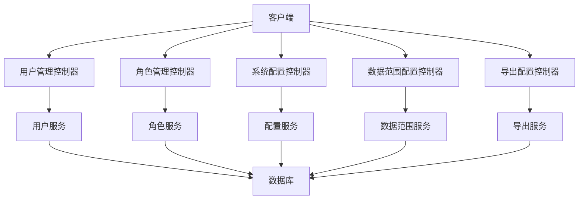
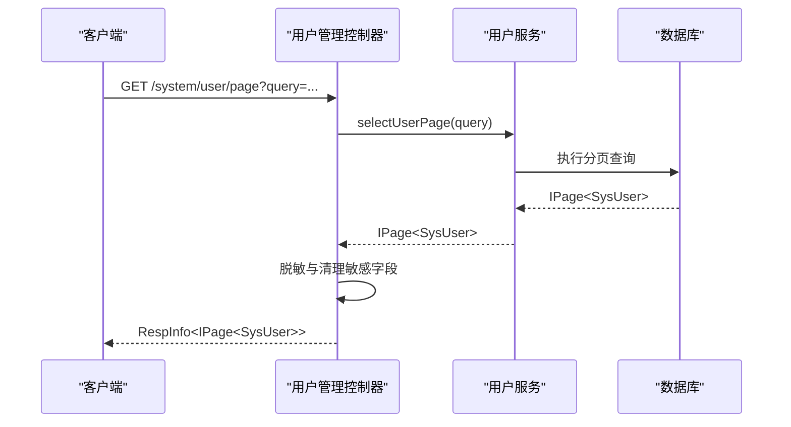
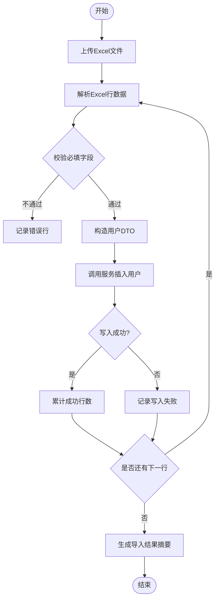
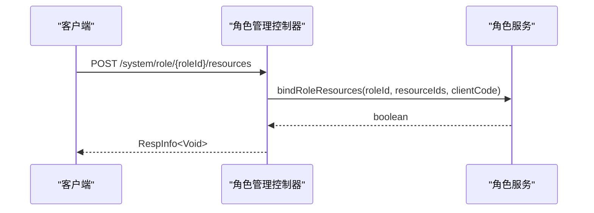
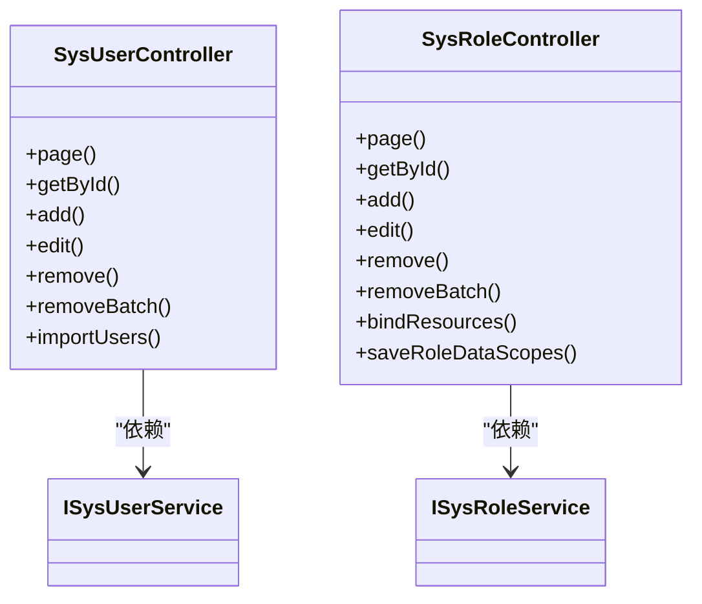

# 系统管理API

<cite>
**本文引用的文件**
- [SysUserController.java](file://forge-server/forge-framework/forge-plugin-parent/forge-plugin-system/src/main/java/com/mdframe/forge/plugin/system/controller/SysUserController.java)
- [SysRoleController.java](file://forge-server/forge-framework/forge-plugin-parent/forge-plugin-system/src/main/java/com/mdframe/forge/plugin/system/controller/SysRoleController.java)
- [SysConfigController.java](file://forge-server/forge-framework/forge-plugin-parent/forge-plugin-system/src/main/java/com/mdframe/forge/plugin/system/controller/SysConfigController.java)
- [SysDataScopeConfigController.java](file://forge-server/forge-framework/forge-plugin-parent/forge-plugin-system/src/main/java/com/mdframe/forge/plugin/system/controller/SysDataScopeConfigController.java)
- [SysExcelExportConfigController.java](file://forge-server/forge-framework/forge-plugin-parent/forge-plugin-system/src/main/java/com/mdframe/forge/plugin/system/controller/SysExcelExportConfigController.java)
- [SysOnlineUserController.java](file://forge-server/forge-framework/forge-plugin-parent/forge-plugin-system/src/main/java/com/mdframe/forge/plugin/system/controller/SysOnlineUserController.java)
</cite>

## 目录
1. [简介](#简介)
2. [项目结构](#项目结构)
3. [核心组件](#核心组件)
4. [架构总览](#架构总览)
5. [详细组件分析](#详细组件分析)
6. [依赖关系分析](#依赖关系分析)
7. [性能考虑](#性能考虑)
8. [故障排查指南](#故障排查指南)
9. [结论](#结论)
10. [附录](#附录)

## 简介
本文件面向系统管理员与后端开发者，系统化梳理 Forge Admin 的系统管理 API，覆盖用户管理、角色权限、菜单配置、部门组织、系统设置等核心能力。文档重点说明接口参数、返回值格式、错误码约定，并提供批量操作、分页查询、条件搜索、导出功能的实现示例与最佳实践（权限控制、数据范围过滤、操作审计）。

## 项目结构
系统管理相关控制器位于框架插件模块中，采用分层设计：
- 控制器层：暴露 RESTful 接口，统一返回 RespInfo，支持加密注解与操作日志
- 服务层：封装业务逻辑（用户、角色、租户、组织、岗位、资源、数据范围等）
- 数据访问层：通过 MyBatis-Plus 进行分页与条件查询
- 通用能力：导入导出、敏感信息脱敏、审计上下文、会话上下文

图表来源
- [SysUserController.java:50-70](file://forge-server/forge-framework/forge-plugin-parent/forge-plugin-system/src/main/java/com/mdframe/forge/plugin/system/controller/SysUserController.java#L50-L70)
- [SysRoleController.java:23-39](file://forge-server/forge-framework/forge-plugin-parent/forge-plugin-system/src/main/java/com/mdframe/forge/plugin/system/controller/SysRoleController.java#L23-L39)
- [SysConfigController.java:1-200](file://forge-server/forge-framework/forge-plugin-parent/forge-plugin-system/src/main/java/com/mdframe/forge/plugin/system/controller/SysConfigController.java#L1-L200)
- [SysDataScopeConfigController.java:1-200](file://forge-server/forge-framework/forge-plugin-parent/forge-plugin-system/src/main/java/com/mdframe/forge/plugin/system/controller/SysDataScopeConfigController.java#L1-L200)
- [SysExcelExportConfigController.java:1-200](file://forge-server/forge-framework/forge-plugin-parent/forge-plugin-system/src/main/java/com/mdframe/forge/plugin/system/controller/SysExcelExportConfigController.java#L1-L200)

章节来源
- [SysUserController.java:50-70](file://forge-server/forge-framework/forge-plugin-parent/forge-plugin-system/src/main/java/com/mdframe/forge/plugin/system/controller/SysUserController.java#L50-L70)
- [SysRoleController.java:23-39](file://forge-server/forge-framework/forge-plugin-parent/forge-plugin-system/src/main/java/com/mdframe/forge/plugin/system/controller/SysRoleController.java#L23-L39)

## 核心组件
- 用户管理：提供用户的增删改查、分页、批量删除、绑定角色/组织/岗位/租户、重置密码、更新状态、个人资料更新、在线用户查看、Excel 导入等能力
- 角色权限：提供角色的增删改查、分页、资源（菜单/按钮/接口）绑定与解绑、数据范围配置、适用组织绑定、角色下用户管理
- 系统设置：提供系统配置项的分组与键值管理、动态刷新能力
- 数据范围：提供数据范围规则的配置与查询
- 导出配置：提供 Excel 导出模板与列配置的管理

章节来源
- [SysUserController.java:63-193](file://forge-server/forge-framework/forge-plugin-parent/forge-plugin-system/src/main/java/com/mdframe/forge/plugin/system/controller/SysUserController.java#L63-L193)
- [SysRoleController.java:32-179](file://forge-server/forge-framework/forge-plugin-parent/forge-plugin-system/src/main/java/com/mdframe/forge/plugin/system/controller/SysRoleController.java#L32-L179)
- [SysConfigController.java:1-200](file://forge-server/forge-framework/forge-plugin-parent/forge-plugin-system/src/main/java/com/mdframe/forge/plugin/system/controller/SysConfigController.java#L1-L200)
- [SysDataScopeConfigController.java:1-200](file://forge-server/forge-framework/forge-plugin-parent/forge-plugin-system/src/main/java/com/mdframe/forge/plugin/system/controller/SysDataScopeConfigController.java#L1-L200)
- [SysExcelExportConfigController.java:1-200](file://forge-server/forge-framework/forge-plugin-parent/forge-plugin-system/src/main/java/com/mdframe/forge/plugin/system/controller/SysExcelExportConfigController.java#L1-L200)

## 架构总览
系统管理 API 遵循统一的响应体与鉴权/审计规范：
- 统一响应：RespInfo<T>，包含 code、message、data
- 传输安全：@ApiDecrypt/@ApiEncrypt 对请求/响应进行加解密
- 操作审计：@OperationLog 记录模块、类型、描述；结合 OperationAuditContext 记录前后快照与差异
- 会话上下文：SessionHelper 获取当前登录用户、租户等信息
- 分页：IPage<T>，支持 page、size、排序、条件查询

图表来源
- [SysUserController.java:63-71](file://forge-server/forge-framework/forge-plugin-parent/forge-plugin-system/src/main/java/com/mdframe/forge/plugin/system/controller/SysUserController.java#L63-L71)
- [SysUserController.java:531-549](file://forge-server/forge-framework/forge-plugin-parent/forge-plugin-system/src/main/java/com/mdframe/forge/plugin/system/controller/SysUserController.java#L531-L549)

## 详细组件分析

### 用户管理 API
- 基础 CRUD
  - 分页查询：GET /system/user/page，参数为 SysUserQuery，返回 RespInfo<IPage<SysUser>>
  - 详情查询：POST /system/user/getById，参数 id，返回 RespInfo<SysUser>
  - 新增：POST /system/user/add，请求体 SysUserDTO，返回 RespInfo<Void>
  - 修改：POST /system/user/edit，请求体 SysUserDTO，返回 RespInfo<Void>
  - 删除：POST /system/user/remove，参数 id，返回 RespInfo<Void>
  - 批量删除：POST /system/user/removeBatch，请求体 Long[] ids，返回 RespInfo<Void>
- 授权与组织
  - 绑定角色：POST /system/user/{userId}/roles，请求体 Long[] roleIds，可选 tenantId
  - 批量授权角色：POST /system/user/batch/roles，请求体 BatchUserRoleBindDTO
  - 解除角色：POST /system/user/{userId}/roles/unbind，请求体 Long[] roleIds
  - 绑定组织：POST /system/user/{userId}/org，参数 orgId, isMain(默认0)
  - 解除组织：POST /system/user/{userId}/org/unbind，参数 orgId
  - 批量绑定组织：POST /system/user/{userId}/orgs，请求体 UserOrgBindDTO
  - 绑定岗位：POST /system/user/{userId}/posts，请求体 UserPostBindDTO
  - 绑定租户：POST /system/user/{userId}/tenants，请求体 UserTenantBindDTO
  - 批量加入租户：POST /system/user/batch/tenants，请求体 BatchUserTenantBindDTO
- 查询关联
  - 角色ID列表：GET /system/user/{userId}/roles，可选 tenantId
  - 组织ID列表：GET /system/user/{userId}/orgs，可选 tenantId
  - 组织绑定详情：GET /system/user/{userId}/org-bindings，可选 tenantId
  - 租户列表：GET /system/user/{userId}/tenants
  - 指定组织下的角色ID：GET /system/user/{userId}/org-roles，必填 orgId，可选 tenantId
  - 保存组织角色：POST /system/user/{userId}/org-roles，请求体 UserOrgRoleBindDTO
  - 岗位ID列表：GET /system/user/{userId}/posts，可选 tenantId
- 账户与安全
  - 重置密码：POST /system/user/resetPwd，参数 id, password
  - 更新状态：POST /system/user/updateStatus，参数 id, status
  - 个人资料更新：POST /system/user/updateProfile，请求体 SysUserDTO（免鉴权）
  - 当前用户资料：GET /system/user/profile（免鉴权）
- 导入
  - 批量导入：POST /system/user/import，multipart file，返回 ImportResult 汇总

注意
- 所有写操作均记录操作日志，并自动构建前后快照与差异
- 分页结果会进行敏感信息脱敏（手机号、身份证、邮箱），并清除密码与盐

章节来源
- [SysUserController.java:63-193](file://forge-server/forge-framework/forge-plugin-parent/forge-plugin-system/src/main/java/com/mdframe/forge/plugin/system/controller/SysUserController.java#L63-L193)
- [SysUserController.java:195-357](file://forge-server/forge-framework/forge-plugin-parent/forge-plugin-system/src/main/java/com/mdframe/forge/plugin/system/controller/SysUserController.java#L195-L357)
- [SysUserController.java:359-419](file://forge-server/forge-framework/forge-plugin-parent/forge-plugin-system/src/main/java/com/mdframe/forge/plugin/system/controller/SysUserController.java#L359-L419)
- [SysUserController.java:551-637](file://forge-server/forge-framework/forge-plugin-parent/forge-plugin-system/src/main/java/com/mdframe/forge/plugin/system/controller/SysUserController.java#L551-L637)
- [SysUserController.java:531-549](file://forge-server/forge-framework/forge-plugin-parent/forge-plugin-system/src/main/java/com/mdframe/forge/plugin/system/controller/SysUserController.java#L531-L549)

#### 用户导入流程图

图表来源
- [SysUserController.java:551-596](file://forge-server/forge-framework/forge-plugin-parent/forge-plugin-system/src/main/java/com/mdframe/forge/plugin/system/controller/SysUserController.java#L551-L596)

### 角色权限 API
- 基础 CRUD
  - 分页查询：GET /system/role/page，参数 SysRoleQuery，返回 RespInfo<IPage<SysRole>>
  - 详情查询：POST /system/role/getById，参数 id
  - 新增：POST /system/role/add，请求体 SysRoleDTO
  - 修改：POST /system/role/edit，请求体 SysRoleDTO
  - 删除：POST /system/role/remove，参数 id
  - 批量删除：POST /system/role/removeBatch，请求体 Long[] ids
- 资源绑定
  - 绑定资源：POST /system/role/{roleId}/resources，请求体 Long[] resourceIds，可选 clientCode
  - 解除资源：POST /system/role/{roleId}/resources/unbind，请求体 Long[] resourceIds
  - 查询资源ID：GET /system/role/{roleId}/resources，可选 clientCode、includeParents
- 数据范围
  - 查询数据范围：GET /system/role/{roleId}/dataScopes
  - 保存数据范围：POST /system/role/{roleId}/dataScopes，请求体 RoleDataScopeSettingsDTO
- 组织与用户
  - 查询适用组织：GET /system/role/{roleId}/orgs
  - 绑定适用组织：POST /system/role/{roleId}/orgs，请求体 List<Long>
  - 查询角色下用户：GET /system/role/{roleId}/users，参数 RoleUserQuery
  - 移除用户：POST /system/role/removeUserRole，参数 roleId, userId
  - 批量添加用户：POST /system/role/{roleId}/addUsers，请求体 Long[] userIds

章节来源
- [SysRoleController.java:32-179](file://forge-server/forge-framework/forge-plugin-parent/forge-plugin-system/src/main/java/com/mdframe/forge/plugin/system/controller/SysRoleController.java#L32-L179)

#### 角色资源绑定序列图

图表来源
- [SysRoleController.java:86-95](file://forge-server/forge-framework/forge-plugin-parent/forge-plugin-system/src/main/java/com/mdframe/forge/plugin/system/controller/SysRoleController.java#L86-L95)

### 系统设置 API
- 配置管理
  - 配置分组与键值维护：由 SysConfigController 提供（具体端点以实际实现为准）
  - 配置刷新：通过 ConfigRefreshController 触发配置热更新
- 数据范围配置
  - 数据范围规则维护：由 SysDataScopeConfigController 提供（具体端点以实际实现为准）
- 导出配置
  - 导出模板与列配置：由 SysExcelExportConfigController 提供（具体端点以实际实现为准）

提示
- 上述控制器通常提供标准的分页、CRUD、批量操作与导出能力，建议在前端按统一风格调用

章节来源
- [SysConfigController.java:1-200](file://forge-server/forge-framework/forge-plugin-parent/forge-plugin-system/src/main/java/com/mdframe/forge/plugin/system/controller/SysConfigController.java#L1-L200)
- [SysDataScopeConfigController.java:1-200](file://forge-server/forge-framework/forge-plugin-parent/forge-plugin-system/src/main/java/com/mdframe/forge/plugin/system/controller/SysDataScopeConfigController.java#L1-L200)
- [SysExcelExportConfigController.java:1-200](file://forge-server/forge-framework/forge-plugin-parent/forge-plugin-system/src/main/java/com/mdframe/forge/plugin/system/controller/SysExcelExportConfigController.java#L1-L200)

### 在线用户管理
- 在线用户查看与管理：由 SysOnlineUserController 提供（如在线用户列表、踢出等）

章节来源
- [SysOnlineUserController.java:1-200](file://forge-server/forge-framework/forge-plugin-parent/forge-plugin-system/src/main/java/com/mdframe/forge/plugin/system/controller/SysOnlineUserController.java#L1-L200)

## 依赖关系分析
- 控制器依赖服务：用户与角色控制器分别依赖 ISysUserService 与 ISysRoleService
- 统一响应与注解：RespInfo、@ApiDecrypt/@ApiEncrypt、@OperationLog
- 会话与审计：SessionHelper、OperationAuditContext
- 导入导出：ExcelImportService、ImportResult、GenericRowData

图表来源
- [SysUserController.java:50-71](file://forge-server/forge-framework/forge-plugin-parent/forge-plugin-system/src/main/java/com/mdframe/forge/plugin/system/controller/SysUserController.java#L50-L71)
- [SysRoleController.java:23-39](file://forge-server/forge-framework/forge-plugin-parent/forge-plugin-system/src/main/java/com/mdframe/forge/plugin/system/controller/SysRoleController.java#L23-L39)

章节来源
- [SysUserController.java:50-71](file://forge-server/forge-framework/forge-plugin-parent/forge-plugin-system/src/main/java/com/mdframe/forge/plugin/system/controller/SysUserController.java#L50-L71)
- [SysRoleController.java:23-39](file://forge-server/forge-framework/forge-plugin-parent/forge-plugin-system/src/main/java/com/mdframe/forge/plugin/system/controller/SysRoleController.java#L23-L39)

## 性能考虑
- 分页查询：使用 IPage 限制单次返回量，避免全表扫描
- 敏感信息脱敏：在分页结果中集中处理，减少前端负担
- 批量操作：优先使用批量接口（批量删除、批量授权、批量加入租户）降低网络往返
- 导入优化：Excel 导入分步处理，解析与写入分离，错误行隔离，便于重试与定位
- 缓存与刷新：系统配置变更可通过配置刷新接口即时生效，避免重启

[本节为通用指导，无需特定文件引用]

## 故障排查指南
- 常见错误
  - 新增/修改/删除失败：检查请求体字段完整性与唯一性约束（如用户名重复）
  - 绑定失败：确认目标 ID 存在且具备相应权限
  - 导入失败：根据 ImportResult 的错误行与错误信息修正数据格式或必填项
- 审计定位
  - 利用 @OperationLog 与 OperationAuditContext 的前后快照与差异，快速定位变更点
- 权限问题
  - 确认当前用户具备对应资源权限；必要时检查角色资源绑定与适用组织

章节来源
- [SysUserController.java:122-193](file://forge-server/forge-framework/forge-plugin-parent/forge-plugin-system/src/main/java/com/mdframe/forge/plugin/system/controller/SysUserController.java#L122-L193)
- [SysUserController.java:551-596](file://forge-server/forge-framework/forge-plugin-parent/forge-plugin-system/src/main/java/com/mdframe/forge/plugin/system/controller/SysUserController.java#L551-L596)

## 结论
Forge Admin 的系统管理 API 提供了完善的企业级管理能力，涵盖用户、角色、组织、岗位、租户、数据范围与系统配置等。通过统一的响应体、传输加密、操作审计与导入导出能力，能够满足复杂企业场景下的权限治理与运维需求。建议在集成时严格遵循分页、批量与审计的最佳实践，确保系统的安全性与可维护性。

[本节为总结，无需特定文件引用]

## 附录

### 接口清单与用法要点
- 用户管理
  - 分页查询：GET /system/user/page，参数 SysUserQuery，返回 RespInfo<IPage<SysUser>>
  - 详情查询：POST /system/user/getById，参数 id
  - 新增/修改/删除：POST /system/user/add|edit|remove
  - 批量删除：POST /system/user/removeBatch，请求体 Long[] ids
  - 绑定/解除角色、组织、岗位、租户：见“用户管理 API”小节
  - 导入：POST /system/user/import，multipart file，返回 ImportResult
- 角色权限
  - 分页/CRUD：/system/role/*
  - 资源绑定/解绑：/system/role/{roleId}/resources*
  - 数据范围：/system/role/{roleId}/dataScopes
  - 组织与用户：/system/role/{roleId}/orgs, /users, addUsers, removeUserRole
- 系统设置
  - 配置管理：SysConfigController（具体端点以实现为准）
  - 数据范围配置：SysDataScopeConfigController
  - 导出配置：SysExcelExportConfigController
- 在线用户
  - 在线用户管理：SysOnlineUserController

### 返回值与错误码约定
- 统一响应体：RespInfo<T>
  - code：整数状态码（成功通常为 0 或 200，失败为非零）
  - message：提示信息
  - data：业务数据（对象、集合或分页对象）
- 导入结果：ImportResult
  - totalRows：总行数
  - successRows：成功行数
  - failedRows：失败行数
  - errors：错误记录列表（含行号、错误类型、错误信息、建议）
  - success：整体是否成功

### 分页、条件搜索与导出示例
- 分页查询
  - 请求：GET /system/user/page?page=1&size=20&username=xxx
  - 响应：RespInfo<IPage<SysUser>>
- 条件搜索
  - 通过 SysUserQuery/SysRoleQuery 等查询对象传递筛选条件
- 导出
  - 使用 SysExcelExportConfigController 配置的导出模板与列定义
  - 或通过用户导入反向验证导出字段映射

[本节为通用指导，无需特定文件引用]