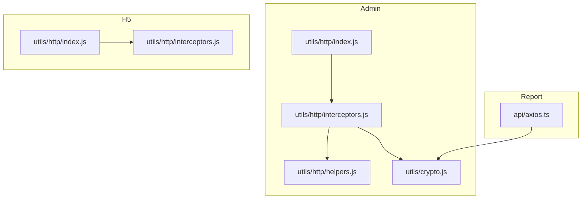
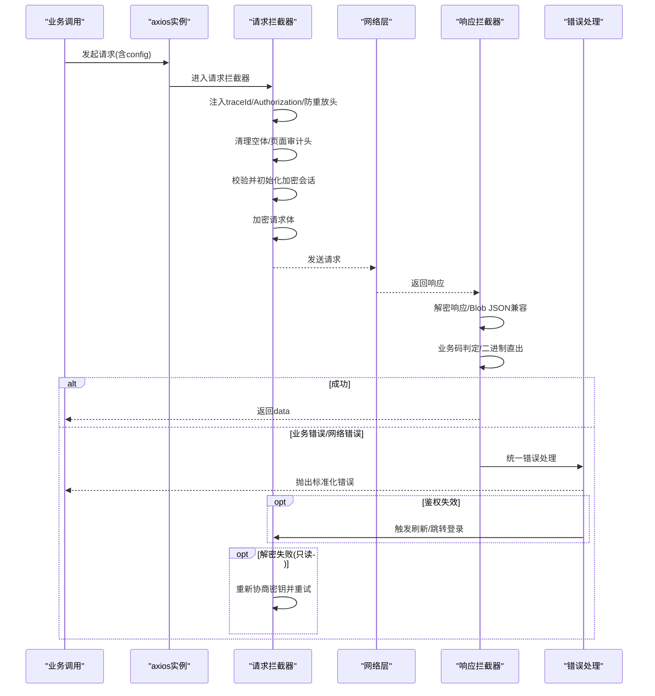
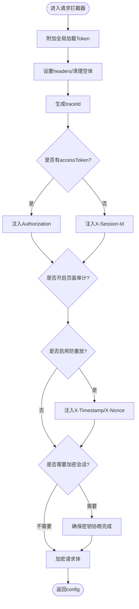
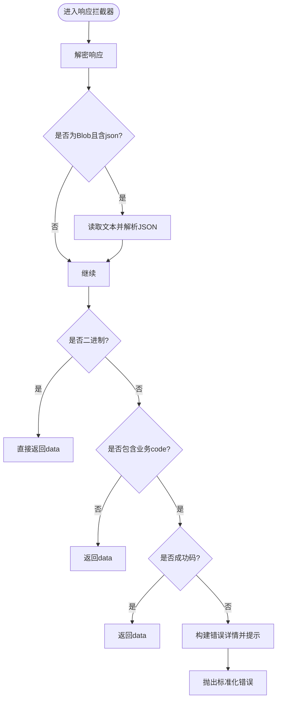
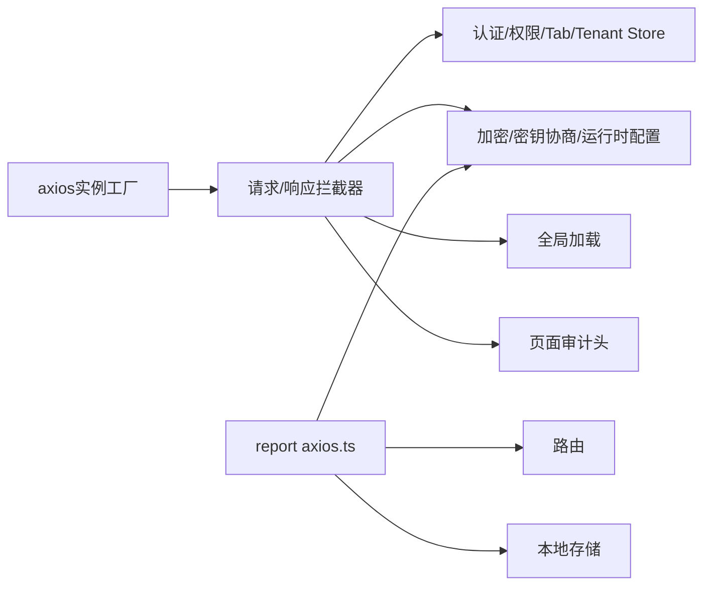

# HTTP客户端核心

<cite>
**本文引用的文件**
- [forge-admin-ui/src/utils/http/index.js](file://forge-admin-ui/src/utils/http/index.js)
- [forge-admin-ui/src/utils/http/interceptors.js](file://forge-admin-ui/src/utils/http/interceptors.js)
- [forge-admin-ui/src/utils/http/helpers.js](file://forge-admin-ui/src/utils/http/helpers.js)
- [forge-admin-ui/src/utils/crypto.js](file://forge-admin-ui/src/utils/crypto.js)
- [forge-report-ui/src/api/axios.ts](file://forge-report-ui/src/api/axios.ts)
- [forge-h5-ui/src/utils/http/index.js](file://forge-h5-ui/src/utils/http/index.js)
- [forge-h5-ui/src/utils/http/interceptors.js](file://forge-h5-ui/src/utils/http/interceptors.js)
</cite>

## 目录
1. [简介](#简介)
2. [项目结构](#项目结构)
3. [核心组件](#核心组件)
4. [架构总览](#架构总览)
5. [详细组件分析](#详细组件分析)
6. [依赖关系分析](#依赖关系分析)
7. [性能与并发优化](#性能与并发优化)
8. [故障排查指南](#故障排查指南)
9. [结论](#结论)
10. [附录](#附录)

## 简介
本文件面向前端HTTP客户端核心，系统性梳理基于axios的封装实现、请求拦截器配置、响应处理机制与错误处理策略。重点覆盖：
- 请求超时控制、重试机制、取消令牌管理、并发请求控制
- 请求/响应数据转换、参数序列化、文件上传下载与进度监控
- 自定义适配器思路、代理配置与跨域处理方案
- 性能优化技巧与调试方法

本项目在多个子应用中实现了统一的HTTP能力：
- forge-admin-ui：功能最完整的拦截器实现，包含全局加载、页面审计头、防重放、传输加密、解密失败自动重试等
- forge-report-ui：TypeScript版本，统一错误模型、401集中处理、安全会话协商
- forge-h5-ui：移动端简化版，支持刷新令牌、业务错误分类与静默鉴权错误

## 项目结构
各子应用均通过“创建axios实例 + 注册拦截器”的方式组织HTTP能力：
- 工厂函数负责默认baseURL、timeout等基础配置，并注入拦截器
- 拦截器负责鉴权、追踪、防重放、加解密、二进制响应处理、统一错误提示与重试
- 工具模块提供错误解析、鉴权状态判断、加密相关能力

图表来源
- [forge-admin-ui/src/utils/http/index.js:1-27](file://forge-admin-ui/src/utils/http/index.js#L1-L27)
- [forge-admin-ui/src/utils/http/interceptors.js:294-444](file://forge-admin-ui/src/utils/http/interceptors.js#L294-L444)
- [forge-admin-ui/src/utils/http/helpers.js:1-96](file://forge-admin-ui/src/utils/http/helpers.js#L1-L96)
- [forge-admin-ui/src/utils/crypto.js:1-124](file://forge-admin-ui/src/utils/crypto.js#L1-L124)
- [forge-report-ui/src/api/axios.ts:1-138](file://forge-report-ui/src/api/axios.ts#L1-L138)
- [forge-h5-ui/src/utils/http/index.js:1-27](file://forge-h5-ui/src/utils/http/index.js#L1-L27)
- [forge-h5-ui/src/utils/http/interceptors.js:1-233](file://forge-h5-ui/src/utils/http/interceptors.js#L1-L233)

章节来源
- [forge-admin-ui/src/utils/http/index.js:1-27](file://forge-admin-ui/src/utils/http/index.js#L1-L27)
- [forge-report-ui/src/api/axios.ts:1-138](file://forge-report-ui/src/api/axios.ts#L1-L138)
- [forge-h5-ui/src/utils/http/index.js:1-27](file://forge-h5-ui/src/utils/http/index.js#L1-L27)

## 核心组件
- axios实例工厂：统一设置baseURL、timeout，并挂载拦截器；暴露request/noPrefixRequest/mockRequest等多实例
- 请求拦截器：注入traceId、Authorization或Session-Id、防重放X-Timestamp/X-Nonce、空体清理、页面审计头、加密会话协商、请求体加密
- 响应拦截器：解密响应、Blob JSON兼容、业务码判定、二进制直出、统一错误提示、鉴权失效处理、只读加密请求自动重试
- 错误处理：统一错误分类、鉴权失效静默处理、网络错误与HTTP错误的差异化处理
- 加密与安全：运行时安全配置同步、密钥协商、解密失败自动重置会话并尝试重试

章节来源
- [forge-admin-ui/src/utils/http/interceptors.js:524-591](file://forge-admin-ui/src/utils/http/interceptors.js#L524-L591)
- [forge-admin-ui/src/utils/http/interceptors.js:294-444](file://forge-admin-ui/src/utils/http/interceptors.js#L294-L444)
- [forge-admin-ui/src/utils/http/helpers.js:1-96](file://forge-admin-ui/src/utils/http/helpers.js#L1-L96)
- [forge-admin-ui/src/utils/crypto.js:1-124](file://forge-admin-ui/src/utils/crypto.js#L1-L124)
- [forge-report-ui/src/api/axios.ts:46-138](file://forge-report-ui/src/api/axios.ts#L46-L138)
- [forge-h5-ui/src/utils/http/interceptors.js:17-233](file://forge-h5-ui/src/utils/http/interceptors.js#L17-L233)

## 架构总览
下图展示一次典型请求从发起、拦截、到响应处理的完整链路，涵盖鉴权、追踪、防重放、加解密、错误处理与重试。

图表来源
- [forge-admin-ui/src/utils/http/interceptors.js:294-444](file://forge-admin-ui/src/utils/http/interceptors.js#L294-L444)
- [forge-admin-ui/src/utils/http/interceptors.js:524-591](file://forge-admin-ui/src/utils/http/interceptors.js#L524-L591)
- [forge-report-ui/src/api/axios.ts:68-138](file://forge-report-ui/src/api/axios.ts#L68-L138)
- [forge-h5-ui/src/utils/http/interceptors.js:17-233](file://forge-h5-ui/src/utils/http/interceptors.js#L17-L233)

## 详细组件分析

### 请求拦截器（Admin）
- 全局加载：在进入请求时附加token，并在响应/错误中结束
- 追踪与审计：生成traceId，注入X-Page-Path/X-Page-Title用于页面级审计
- 鉴权：优先注入Authorization；无token时注入当前加密会话ID
- 防重放：根据运行时配置对匹配路径注入X-Timestamp/X-Nonce
- 加密会话：显式加密请求强制先完成密钥协商，禁止明文降级
- 请求体：清理空对象/数组，避免多余Content-Type
- 业务校验：对特定选择器接口进行objectCode必填校验，缺失直接拒绝

图表来源
- [forge-admin-ui/src/utils/http/interceptors.js:524-591](file://forge-admin-ui/src/utils/http/interceptors.js#L524-L591)

章节来源
- [forge-admin-ui/src/utils/http/interceptors.js:524-591](file://forge-admin-ui/src/utils/http/interceptors.js#L524-L591)

### 响应拦截器（Admin）
- 解密：优先解密响应，若为Blob且content-type含json则转JSON再解密
- 二进制直出：当响应为Blob/ArrayBuffer时直接返回，避免误判业务码
- 非RespInfo兼容：若无业务code字段，直接返回data
- 业务成功：code为200或白名单时返回data
- 业务错误：构造detail信息，统一提示，必要时静默鉴权错误
- 解密失败：重置密钥会话，仅对只读请求自动重试一次

图表来源
- [forge-admin-ui/src/utils/http/interceptors.js:294-444](file://forge-admin-ui/src/utils/http/interceptors.js#L294-L444)

章节来源
- [forge-admin-ui/src/utils/http/interceptors.js:294-444](file://forge-admin-ui/src/utils/http/interceptors.js#L294-L444)

### 错误处理（Admin）
- 鉴权错误：识别多类401/过期码，在退出流程或登录页静默处理
- 网络错误：无response时归类为NETWORK_ERROR并提示
- 业务错误：携带method/url/traceId/status/responseData便于定位
- 统一提示：可关闭needTip以抑制提示，适配批量/后台任务

章节来源
- [forge-admin-ui/src/utils/http/helpers.js:1-96](file://forge-admin-ui/src/utils/http/helpers.js#L1-L96)
- [forge-admin-ui/src/utils/http/interceptors.js:377-444](file://forge-admin-ui/src/utils/http/interceptors.js#L377-L444)

### TypeScript版本（Report）
- 统一错误模型：将响应与网络异常统一包装为带code/data/response的错误对象
- 401集中处理：响应与错误分支均会触发登出并跳转
- 安全会话：请求前确保密钥已协商，否则抛错；响应解密失败重置会话

章节来源
- [forge-report-ui/src/api/axios.ts:1-138](file://forge-report-ui/src/api/axios.ts#L1-L138)

### H5端简化实现
- 刷新令牌：检测到鉴权过期时尝试刷新，成功后重试原请求
- 业务错误：兼容respCode与旧code格式，统一提示
- 加密通道：按需初始化密钥协商，失败即拒绝

章节来源
- [forge-h5-ui/src/utils/http/interceptors.js:17-233](file://forge-h5-ui/src/utils/http/interceptors.js#L17-L233)

## 依赖关系分析
- axios实例工厂依赖环境配置（VITE_REQUEST_PREFIX/VITE_DEV_PATH/VITE_PRO_PATH）
- 拦截器依赖：
  - 认证与权限Store（注入Authorization、处理401）
  - 加密模块（密钥协商、加解密、运行时配置）
  - 全局加载（请求开始/结束）
  - 页面审计（X-Page-Path/X-Page-Title）
- Report端额外依赖路由与本地存储，集中处理401

图表来源
- [forge-admin-ui/src/utils/http/index.js:1-27](file://forge-admin-ui/src/utils/http/index.js#L1-L27)
- [forge-admin-ui/src/utils/http/interceptors.js:294-444](file://forge-admin-ui/src/utils/http/interceptors.js#L294-L444)
- [forge-report-ui/src/api/axios.ts:1-138](file://forge-report-ui/src/api/axios.ts#L1-L138)

章节来源
- [forge-admin-ui/src/utils/http/index.js:1-27](file://forge-admin-ui/src/utils/http/index.js#L1-L27)
- [forge-admin-ui/src/utils/http/interceptors.js:294-444](file://forge-admin-ui/src/utils/http/interceptors.js#L294-L444)
- [forge-report-ui/src/api/axios.ts:1-138](file://forge-report-ui/src/api/axios.ts#L1-L138)

## 性能与并发优化
- 超时控制
  - 默认timeout=12000ms，可通过createAxios(options)覆盖
  - 建议按接口类型分级设置：查询类较短、导出/报表较长
- 并发控制
  - 使用独立axios实例隔离不同场景（如mockRequest/noPrefixRequest）
  - 大文件上传/下载建议使用流式处理，避免阻塞UI线程
- 缓存与去重
  - 对GET等幂等请求可按url+params做短期内存缓存
  - 结合AbortController实现重复请求取消
- 传输优化
  - 启用gzip/压缩（服务端配置）
  - 合理设置Content-Type，避免不必要的序列化
- 调试与观测
  - traceId贯穿请求链路，配合后端日志快速定位
  - 利用X-Page-Path/X-Page-Title关联页面上下文
  - 对关键接口打印耗时与payload摘要（脱敏）

[本节为通用指导，不直接分析具体文件]

## 故障排查指南
- 401/鉴权失效
  - Admin：统一识别多类过期码，在退出流程或登录页静默处理，避免重复弹窗
  - H5：自动刷新令牌后重试原请求
  - Report：集中清理本地凭证并跳转登录
- 解密失败
  - Admin：检测DECRYPT_ERROR时重置密钥会话，仅对只读请求自动重试一次
  - Report：解密失败重置会话并拒绝
- 网络错误
  - 无response时归类为NETWORK_ERROR，提示用户检查网络
- 业务错误
  - 携带method/url/traceId/status/responseData，便于快速定位
- 防重放
  - 确认X-Timestamp/X-Nonce是否注入，路径是否在排除/包含列表中
- 加密会话
  - 显式加密请求必须完成密钥协商，否则阻止明文请求

章节来源
- [forge-admin-ui/src/utils/http/helpers.js:1-96](file://forge-admin-ui/src/utils/http/helpers.js#L1-L96)
- [forge-admin-ui/src/utils/http/interceptors.js:294-444](file://forge-admin-ui/src/utils/http/interceptors.js#L294-L444)
- [forge-admin-ui/src/utils/http/interceptors.js:461-508](file://forge-admin-ui/src/utils/http/interceptors.js#L461-L508)
- [forge-report-ui/src/api/axios.ts:108-138](file://forge-report-ui/src/api/axios.ts#L108-L138)
- [forge-h5-ui/src/utils/http/interceptors.js:17-233](file://forge-h5-ui/src/utils/http/interceptors.js#L17-L233)

## 结论
该HTTP客户端核心在多端实现了统一而稳健的请求/响应管线：
- 通过拦截器实现鉴权、追踪、防重放、加解密、二进制处理与统一错误
- 提供多实例工厂满足差异化场景
- 具备解密失败自动重试、鉴权失效静默处理等健壮性保障
- 借助traceId与页面审计头提升可观测性
建议在业务侧结合超时、缓存、取消与流式处理进一步优化体验与性能。

[本节为总结，不直接分析具体文件]

## 附录

### 请求/响应数据转换与序列化
- 请求体：空对象/数组会被清理，避免多余Content-Type
- 响应体：
  - 二进制直出（Blob/ArrayBuffer）
  - Blob内JSON自动解析后再解密
  - 非RespInfo JSON直接返回data
- 参数序列化：遵循axios默认规则，可在config.params中传递查询参数

章节来源
- [forge-admin-ui/src/utils/http/interceptors.js:294-356](file://forge-admin-ui/src/utils/http/interceptors.js#L294-L356)

### 文件上传/下载与进度监控
- 上传：组件层处理FormData与事件回调，完成后更新本地列表与URL
- 下载：二进制响应直出，组件层解析并生成预览URL
- 进度：可在组件层监听上传进度事件，结合全局加载token管理显示

章节来源
- [forge-admin-ui/src/components/file-upload/index.vue:372-506](file://forge-admin-ui/src/components/file-upload/index.vue#L372-L506)
- [forge-admin-ui/src/components/image-upload/index.vue:367-401](file://forge-admin-ui/src/components/image-upload/index.vue#L367-L401)

### 自定义适配器开发
- 可在axios.create({ adapter })处替换底层适配器，实现：
  - 自定义缓存策略
  - 请求合并/去重
  - 离线队列与重试
- 注意保持与现有拦截器的兼容性（headers、config扩展字段）

[本节为通用指导，不直接分析具体文件]

### 代理配置与跨域处理
- 开发环境：通过Vite代理转发至后端，避免跨域问题
- 生产环境：Nginx反向代理统一域名，关闭CORS限制
- 跨域：确保服务端正确设置Access-Control-Allow-*，前端无需额外配置

[本节为通用指导，不直接分析具体文件]

### 取消令牌管理与重试机制
- 取消：结合AbortController在组件卸载或切换路由时中止请求
- 重试：
  - Admin：仅对只读加密请求在解密失败时自动重试一次
  - H5：鉴权过期时刷新令牌后重试
  - 业务侧可按需实现指数退避重试

章节来源
- [forge-admin-ui/src/utils/http/interceptors.js:481-508](file://forge-admin-ui/src/utils/http/interceptors.js#L481-L508)
- [forge-h5-ui/src/utils/http/interceptors.js:25-84](file://forge-h5-ui/src/utils/http/interceptors.js#L25-L84)