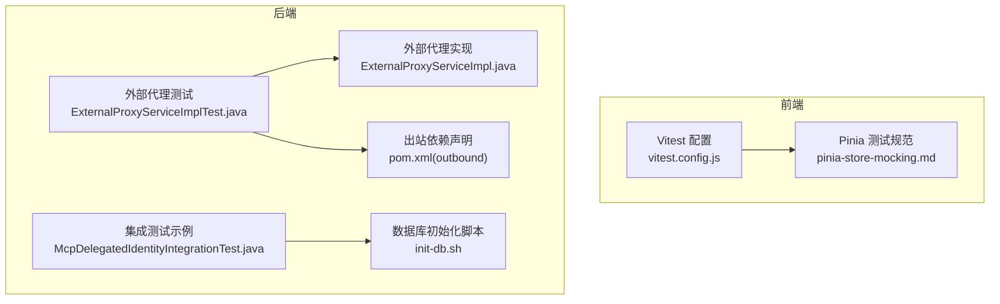
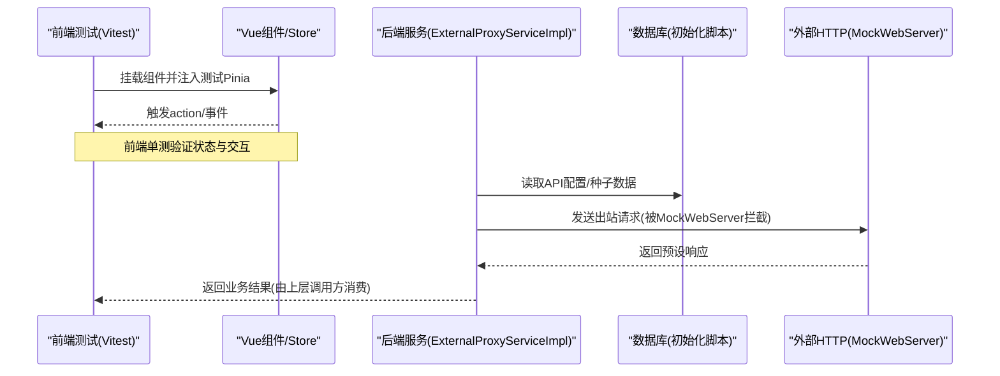
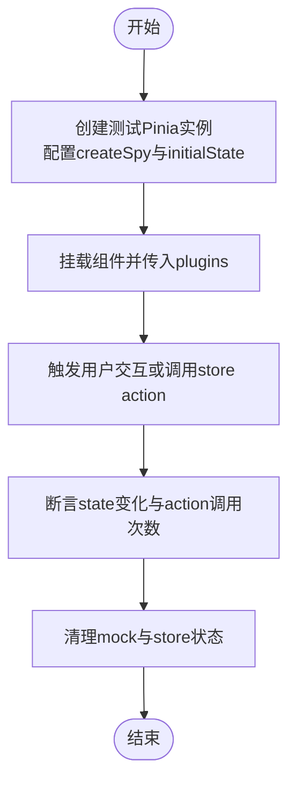
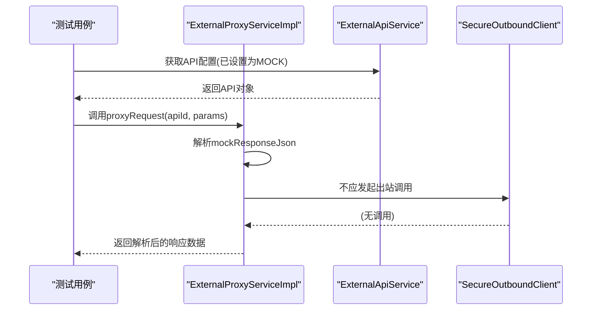
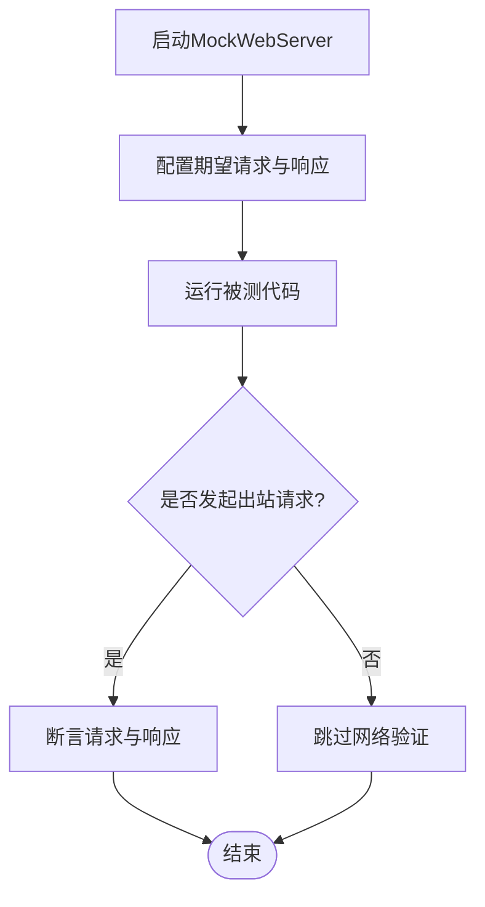
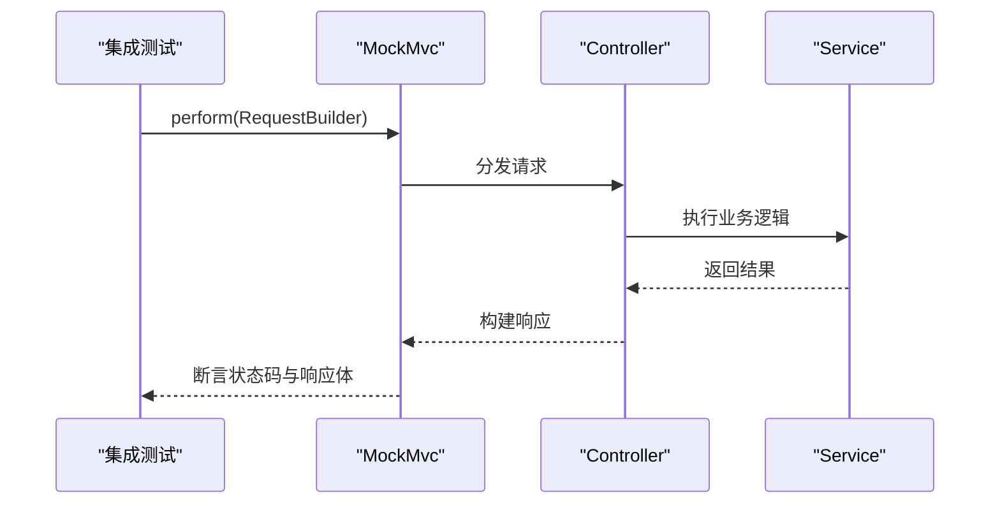
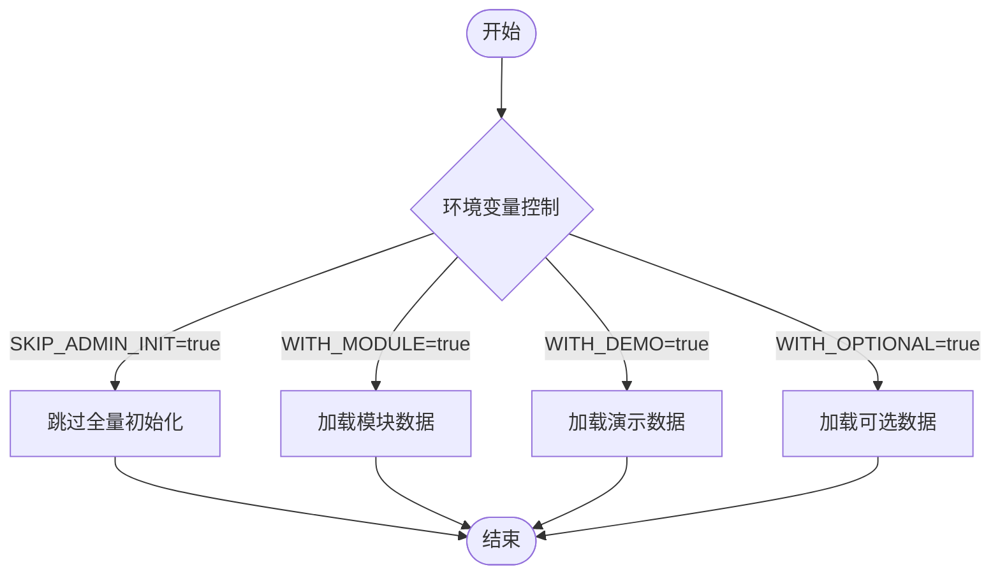
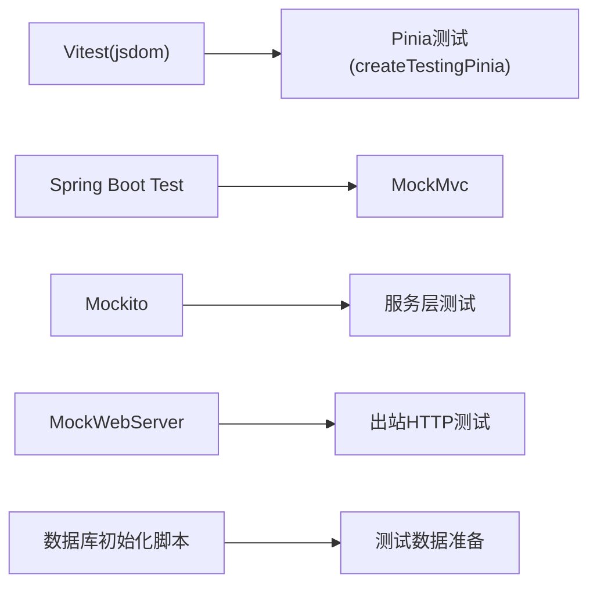

# Mock与测试

<cite>
**本文引用的文件**
- [vitest.config.js](file://forge-admin-ui/vitest.config.js)
- [pinia-store-mocking.md](file://forge-admin-ui/.turing_coder_rules/vue-best-practices/rules/pinia-store-mocking.md)
- [ExternalProxyServiceImpl.java](file://forge-server/forge-framework/forge-plugin-parent/forge-plugin-external/src/main/java/com/mdframe/forge/plugin/external/service/impl/ExternalProxyServiceImpl.java)
- [ExternalProxyServiceImplTest.java](file://forge-server/forge-framework/forge-plugin-parent/forge-plugin-external/src/test/java/com/mdframe/forge/plugin/external/service/impl/ExternalProxyServiceImplTest.java)
- [pom.xml（outbound starter）](file://forge-server/forge-framework/forge-starter-parent/forge-starter-outbound/pom.xml)
- [McpDelegatedIdentityIntegrationTest.java](file://forge-server/forge-framework/forge-plugin-parent/forge-plugin-capability-parent/forge-plugin-capability-platform/src/test/java/com/mdframe/forge/plugin/capability/identity/mcp/McpDelegatedIdentityIntegrationTest.java)
- [init-db.sh](file://forge-server/scripts/db/init-db.sh)
</cite>

## 目录
1. [简介](#简介)
2. [项目结构](#项目结构)
3. [核心组件](#核心组件)
4. [架构总览](#架构总览)
5. [详细组件分析](#详细组件分析)
6. [依赖关系分析](#依赖关系分析)
7. [性能考量](#性能考量)
8. [故障排查指南](#故障排查指南)
9. [结论](#结论)
10. [附录](#附录)

## 简介
本技术文档聚焦于 Forge Admin 的 Mock 与测试体系，覆盖前端与后端的测试环境搭建、Mock 数据生成、接口模拟、测试类型（单元、集成、端到端）、API 契约测试、性能与兼容性测试策略、测试数据管理、用例编写规范以及覆盖率统计与持续集成实践。目标是帮助开发者快速建立稳定、可维护且高效的测试流程。

## 项目结构
- 前端测试
  - 基于 Vitest + jsdom 的独立配置，避免在测试时加载过多插件，提升单测启动速度。
  - 通过别名映射简化模块导入，便于在测试中引用源码。
  - 覆盖率采集使用 v8 提供者，仅对指定范围进行统计。
- 后端测试
  - 使用 Spring Boot Test、MockMvc 进行控制器层集成测试。
  - 使用 Mockito 进行服务层单元测试。
  - 使用 OkHttp MockWebServer 对外部 HTTP 调用进行隔离与断言。
  - 数据库初始化脚本支持按需注入种子数据，便于测试环境准备。

**图表来源**
- [vitest.config.js:1-36](file://forge-admin-ui/vitest.config.js#L1-L36)
- [pinia-store-mocking.md:1-163](file://forge-admin-ui/.turing_coder_rules/vue-best-practices/rules/pinia-store-mocking.md#L1-L163)
- [ExternalProxyServiceImpl.java:190-216](file://forge-server/forge-framework/forge-plugin-parent/forge-plugin-external/src/main/java/com/mdframe/forge/plugin/external/service/impl/ExternalProxyServiceImpl.java#L190-L216)
- [ExternalProxyServiceImplTest.java:1-119](file://forge-server/forge-framework/forge-plugin-parent/forge-plugin-external/src/test/java/com/mdframe/forge/plugin/external/service/impl/ExternalProxyServiceImplTest.java#L1-L119)
- [pom.xml（outbound starter）:53-65](file://forge-server/forge-framework/forge-starter-parent/forge-starter-outbound/pom.xml#L53-L65)
- [init-db.sh:99-133](file://forge-server/scripts/db/init-db.sh#L99-L133)

**章节来源**
- [vitest.config.js:1-36](file://forge-admin-ui/vitest.config.js#L1-L36)
- [init-db.sh:99-133](file://forge-server/scripts/db/init-db.sh#L99-L133)

## 核心组件
- 前端测试框架与配置
  - Vitest：提供测试运行器、匹配器、覆盖率等能力；jsdom 环境提供浏览器 API 以支持组件测试。
  - Pinia 测试：通过 createTestingPinia 注入测试态 store，配合 vi.fn 完成 action mock 与状态断言。
- 后端测试框架与工具
  - Spring Boot Test + MockMvc：用于控制器层的请求级集成测试。
  - Mockito：用于服务层方法行为验证与交互断言。
  - OkHttp MockWebServer：用于外部 HTTP 调用的本地化模拟与响应断言。
  - 数据库初始化脚本：按条件执行 SQL 与 seed 数据，确保测试环境一致性与可重复性。

**章节来源**
- [vitest.config.js:1-36](file://forge-admin-ui/vitest.config.js#L1-L36)
- [pinia-store-mocking.md:1-163](file://forge-admin-ui/.turing_coder_rules/vue-best-practices/rules/pinia-store-mocking.md#L1-L163)
- [ExternalProxyServiceImplTest.java:1-119](file://forge-server/forge-framework/forge-plugin-parent/forge-plugin-external/src/test/java/com/mdframe/forge/plugin/external/service/impl/ExternalProxyServiceImplTest.java#L1-L119)
- [pom.xml（outbound starter）:53-65](file://forge-server/forge-framework/forge-starter-parent/forge-starter-outbound/pom.xml#L53-L65)
- [init-db.sh:99-133](file://forge-server/scripts/db/init-db.sh#L99-L133)

## 架构总览
下图展示了前后端测试与 Mock 的整体协作关系：前端通过 Vitest 与 Pinia 测试工具进行组件与状态测试；后端通过 Spring Boot Test、Mockito、MockWebServer 完成服务与外部依赖的隔离测试；数据库初始化脚本保证测试数据的稳定性与一致性。

**图表来源**
- [vitest.config.js:1-36](file://forge-admin-ui/vitest.config.js#L1-L36)
- [pinia-store-mocking.md:1-163](file://forge-admin-ui/.turing_coder_rules/vue-best-practices/rules/pinia-store-mocking.md#L1-L163)
- [ExternalProxyServiceImpl.java:190-216](file://forge-server/forge-framework/forge-plugin-parent/forge-plugin-external/src/main/java/com/mdframe/forge/plugin/external/service/impl/ExternalProxyServiceImpl.java#L190-L216)
- [ExternalProxyServiceImplTest.java:1-119](file://forge-server/forge-framework/forge-plugin-parent/forge-plugin-external/src/test/java/com/mdframe/forge/plugin/external/service/impl/ExternalProxyServiceImplTest.java#L1-L119)
- [pom.xml（outbound starter）:53-65](file://forge-server/forge-framework/forge-starter-parent/forge-starter-outbound/pom.xml#L53-L65)
- [init-db.sh:99-133](file://forge-server/scripts/db/init-db.sh#L99-L133)

## 详细组件分析

### 前端：Vitest 与 Pinia 测试
- 测试环境
  - 使用 jsdom 提供 DOM API，便于组件测试。
  - 通过别名映射简化 import，减少路径复杂度。
  - 覆盖率采集限定到特定目录，避免全量扫描带来的性能损耗。
- Pinia Store 测试
  - 使用 createTestingPinia 注入测试态 store，并通过 vi.fn 完成 action 的 spy 与 stub。
  - 建议在 beforeEach 中重置 store 状态，避免测试间污染。
  - 可直接对 store 进行独立测试，验证状态与计算属性。

**图表来源**
- [vitest.config.js:1-36](file://forge-admin-ui/vitest.config.js#L1-L36)
- [pinia-store-mocking.md:1-163](file://forge-admin-ui/.turing_coder_rules/vue-best-practices/rules/pinia-store-mocking.md#L1-L163)

**章节来源**
- [vitest.config.js:1-36](file://forge-admin-ui/vitest.config.js#L1-L36)
- [pinia-store-mocking.md:1-163](file://forge-admin-ui/.turing_coder_rules/vue-best-practices/rules/pinia-store-mocking.md#L1-L163)

### 后端：外部代理服务的 Mock 与测试
- 服务逻辑
  - 当外部 API 配置为 MOCK 模式时，直接解析并返回预设的 JSON 响应，不发起真实出站请求。
  - 调试模式下会记录请求参数、响应体、耗时等元信息，并对敏感数据进行脱敏。
- 测试要点
  - 使用 Mockito 对依赖服务进行 mock，验证未发生真实出站调用。
  - 断言返回结构与字段值符合预期。
  - 通过 ExecutionIdentity 上下文模拟登录用户与租户信息。

**图表来源**
- [ExternalProxyServiceImpl.java:190-216](file://forge-server/forge-framework/forge-plugin-parent/forge-plugin-external/src/main/java/com/mdframe/forge/plugin/external/service/impl/ExternalProxyServiceImpl.java#L190-L216)
- [ExternalProxyServiceImplTest.java:1-119](file://forge-server/forge-framework/forge-plugin-parent/forge-plugin-external/src/test/java/com/mdframe/forge/plugin/external/service/impl/ExternalProxyServiceImplTest.java#L1-L119)

**章节来源**
- [ExternalProxyServiceImpl.java:190-216](file://forge-server/forge-framework/forge-plugin-parent/forge-plugin-external/src/main/java/com/mdframe/forge/plugin/external/service/impl/ExternalProxyServiceImpl.java#L190-L216)
- [ExternalProxyServiceImplTest.java:1-119](file://forge-server/forge-framework/forge-plugin-parent/forge-plugin-external/src/test/java/com/mdframe/forge/plugin/external/service/impl/ExternalProxyServiceImplTest.java#L1-L119)

### 后端：出站 HTTP 的 MockWebServer 集成
- 依赖声明
  - 在出站模块的 pom.xml 中引入 okhttp3 mockwebserver，作为测试依赖。
- 使用方式
  - 在测试中启动 MockWebServer，配置期望的请求与响应。
  - 将客户端指向该服务器地址，拦截并验证出站调用。
  - 适用于需要验证网络协议、重试、超时等行为的场景。

**图表来源**
- [pom.xml（outbound starter）:53-65](file://forge-server/forge-framework/forge-starter-parent/forge-starter-outbound/pom.xml#L53-L65)

**章节来源**
- [pom.xml（outbound starter）:53-65](file://forge-server/forge-framework/forge-starter-parent/forge-starter-outbound/pom.xml#L53-L65)

### 后端：控制器集成测试（MockMvc）
- 使用 Spring Boot Test 的 @SpringBootTest 与 @AutoConfigureMockMvc 启动 Web 上下文。
- 通过 MockMvc 发送 HTTP 请求，断言响应状态码、JSON 结构与业务语义。
- 适合用于权限校验、路由绑定、序列化/反序列化等边界场景的契约测试。

**图表来源**
- [McpDelegatedIdentityIntegrationTest.java:41-56](file://forge-server/forge-framework/forge-plugin-parent/forge-plugin-capability-parent/forge-plugin-capability-platform/src/test/java/com/mdframe/forge/plugin/capability/identity/mcp/McpDelegatedIdentityIntegrationTest.java#L41-L56)

**章节来源**
- [McpDelegatedIdentityIntegrationTest.java:41-56](file://forge-server/forge-framework/forge-plugin-parent/forge-plugin-capability-parent/forge-plugin-capability-platform/src/test/java/com/mdframe/forge/plugin/capability/identity/mcp/McpDelegatedIdentityIntegrationTest.java#L41-L56)

### 测试数据管理：数据库初始化与种子数据
- 初始化脚本
  - 根据环境变量决定是否执行全量初始化 SQL、模块数据、演示数据与可选数据。
  - 通过脚本统一执行 SQL 与 seed 目录下的数据，确保测试环境一致。
- 最佳实践
  - 将测试所需的最小数据集放入 seed 目录，按需启用。
  - 在 CI 中固定执行顺序，保证幂等与可重复性。

**图表来源**
- [init-db.sh:99-133](file://forge-server/scripts/db/init-db.sh#L99-L133)

**章节来源**
- [init-db.sh:99-133](file://forge-server/scripts/db/init-db.sh#L99-L133)

## 依赖关系分析
- 前端
  - Vitest 与 jsdom 提供测试环境与运行器。
  - Pinia 测试工具链（createTestingPinia、vi.fn）支撑组件与状态测试。
- 后端
  - Spring Boot Test + MockMvc 用于控制器集成测试。
  - Mockito 用于服务层 mock 与交互断言。
  - OkHttp MockWebServer 用于出站 HTTP 的本地化模拟。
  - 数据库初始化脚本保障测试数据的一致性与可重复性。

**图表来源**
- [vitest.config.js:1-36](file://forge-admin-ui/vitest.config.js#L1-L36)
- [pinia-store-mocking.md:1-163](file://forge-admin-ui/.turing_coder_rules/vue-best-practices/rules/pinia-store-mocking.md#L1-L163)
- [ExternalProxyServiceImplTest.java:1-119](file://forge-server/forge-framework/forge-plugin-parent/forge-plugin-external/src/test/java/com/mdframe/forge/plugin/external/service/impl/ExternalProxyServiceImplTest.java#L1-L119)
- [pom.xml（outbound starter）:53-65](file://forge-server/forge-framework/forge-starter-parent/forge-starter-outbound/pom.xml#L53-L65)
- [init-db.sh:99-133](file://forge-server/scripts/db/init-db.sh#L99-L133)

**章节来源**
- [vitest.config.js:1-36](file://forge-admin-ui/vitest.config.js#L1-L36)
- [pinia-store-mocking.md:1-163](file://forge-admin-ui/.turing_coder_rules/vue-best-practices/rules/pinia-store-mocking.md#L1-L163)
- [ExternalProxyServiceImplTest.java:1-119](file://forge-server/forge-framework/forge-plugin-parent/forge-plugin-external/src/test/java/com/mdframe/forge/plugin/external/service/impl/ExternalProxyServiceImplTest.java#L1-L119)
- [pom.xml（outbound starter）:53-65](file://forge-server/forge-framework/forge-starter-parent/forge-starter-outbound/pom.xml#L53-L65)
- [init-db.sh:99-133](file://forge-server/scripts/db/init-db.sh#L99-L133)

## 性能考量
- 前端
  - 使用独立的 Vitest 配置，避免加载不必要的插件，缩短启动时间。
  - 限制覆盖率采集范围，减少扫描开销。
- 后端
  - 使用 MockWebServer 替代真实网络调用，降低 I/O 延迟与不确定性。
  - 通过 Mockito 隔离外部依赖，提高测试执行速度与稳定性。
  - 数据库初始化脚本按需加载种子数据，减少不必要的数据写入。

[本节为通用指导，无需具体文件来源]

## 故障排查指南
- 前端
  - 若出现“injection Symbol(pinia) not found”错误，检查是否在测试中正确注入 createTestingPinia。
  - 若出现“必须配置 createSpy 选项”，确保在 createTestingPinia 中传入 vi.fn。
  - 若组件渲染失败，确认 jsdom 环境可用，并在 vitest.config.js 中启用 globals。
- 后端
  - 若 MockWebServer 未生效，检查客户端是否指向了测试服务器的地址。
  - 若 MockMvc 断言失败，核对请求路径、参数与响应结构是否与控制器实现一致。
  - 若数据库初始化异常，检查环境变量与 SQL 文件是否存在、是否可执行。

**章节来源**
- [pinia-store-mocking.md:1-163](file://forge-admin-ui/.turing_coder_rules/vue-best-practices/rules/pinia-store-mocking.md#L1-L163)
- [vitest.config.js:1-36](file://forge-admin-ui/vitest.config.js#L1-L36)
- [pom.xml（outbound starter）:53-65](file://forge-server/forge-framework/forge-starter-parent/forge-starter-outbound/pom.xml#L53-L65)
- [init-db.sh:99-133](file://forge-server/scripts/db/init-db.sh#L99-L133)

## 结论
本项目在前端与后端均建立了完善的测试与 Mock 体系：前端基于 Vitest 与 Pinia 测试工具链，提供稳定的组件与状态测试；后端通过 Spring Boot Test、Mockito、MockWebServer 与数据库初始化脚本，实现了服务层与外部依赖的隔离测试与数据一致性保障。建议在此基础上继续完善 API 契约测试、性能基准测试与兼容性矩阵，并将覆盖率与质量门禁纳入持续集成流程，以提升交付质量与效率。

[本节为总结性内容，无需具体文件来源]

## 附录
- 测试类型建议
  - 单元测试：针对纯函数、工具类与服务层方法，使用 Mockito 与 JUnit 5。
  - 集成测试：针对控制器与关键业务流程，使用 MockMvc 与内存/测试数据库。
  - 端到端测试：结合前端 E2E 工具（如 Playwright/Cypress）与后端测试环境，验证完整链路。
- API 契约测试
  - 基于 OpenAPI/Swagger 生成契约测试，校验请求/响应结构与字段约束。
- 性能测试
  - 使用 JMeter/Gatling 对关键接口进行压测，关注吞吐、延迟与资源占用。
- 兼容性测试
  - 多浏览器/多版本矩阵，结合自动化脚本批量执行回归用例。
- 覆盖率统计
  - 前端：Vitest + v8 提供者，输出 HTML 报告。
  - 后端：JaCoCo 集成，设置最低覆盖率阈值。
- 持续集成
  - 在 CI 中并行执行前后端测试，收集覆盖率与报告，失败即阻断合并。

[本节为通用指导，无需具体文件来源]