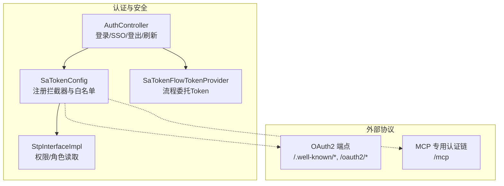
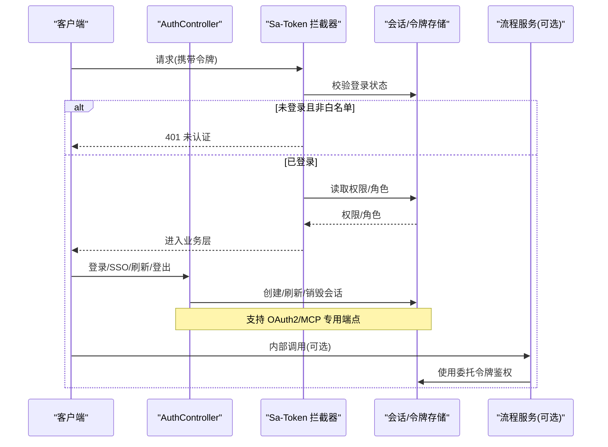
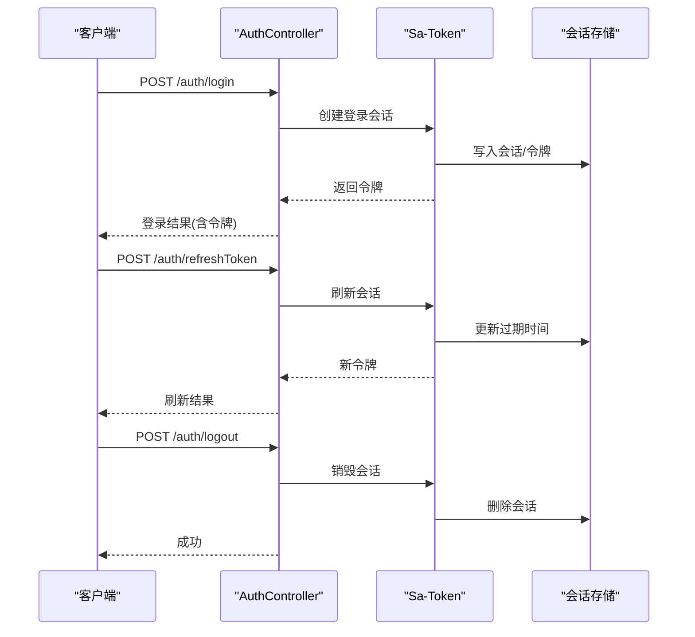
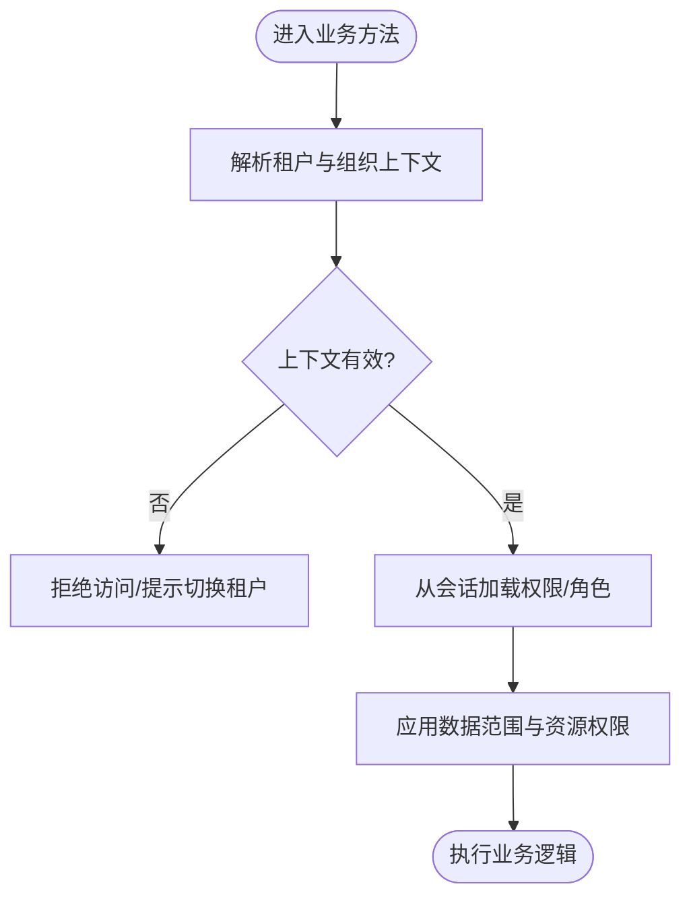
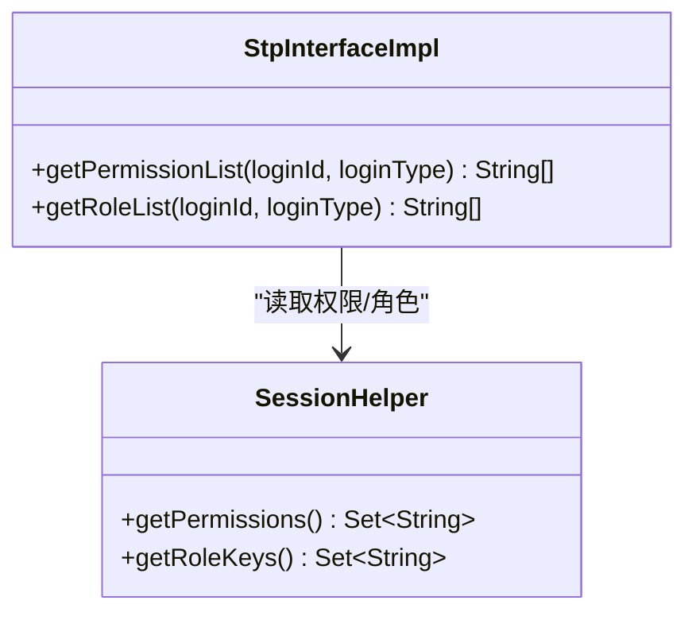
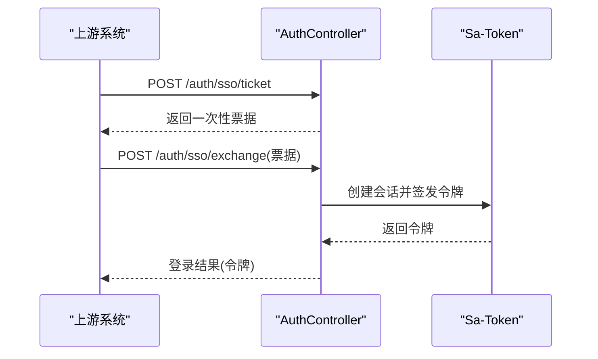
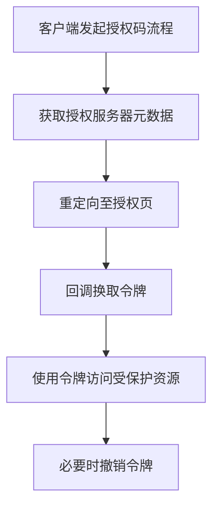
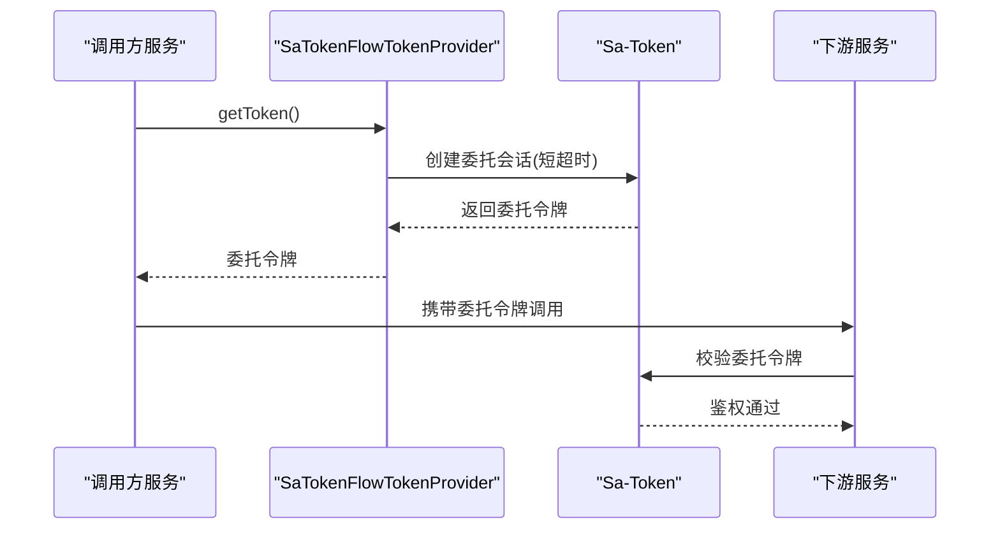
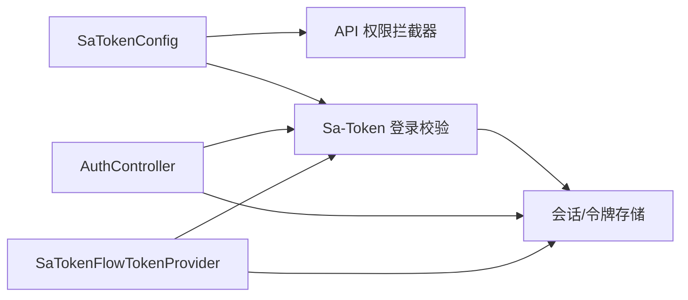

# 认证令牌管理

<cite>
**本文引用的文件**
- [SaTokenConfig.java](file://forge-server/forge-framework/forge-starter-parent/forge-starter-auth/src/main/java/com/mdframe/forge/starter/auth/config/SaTokenConfig.java)
- [StpInterfaceImpl.java](file://forge-server/forge-framework/forge-starter-parent/forge-starter-auth/src/main/java/com/mdframe/forge/starter/auth/config/StpInterfaceImpl.java)
- [SaTokenFlowTokenProvider.java](file://forge-server/forge-framework/forge-starter-parent/forge-starter-auth/src/main/java/com/mdframe/forge/starter/auth/config/SaTokenFlowTokenProvider.java)
- [AuthController.java](file://forge-server/forge-framework/forge-starter-parent/forge-starter-auth/src/main/java/com/mdframe/forge/starter/auth/controller/AuthController.java)
</cite>

## 目录
1. [简介](#简介)
2. [项目结构](#项目结构)
3. [核心组件](#核心组件)
4. [架构总览](#架构总览)
5. [详细组件分析](#详细组件分析)
6. [依赖关系分析](#依赖关系分析)
7. [性能考虑](#性能考虑)
8. [故障排查指南](#故障排查指南)
9. [结论](#结论)
10. [附录](#附录)

## 简介
本技术文档聚焦于 Forge Admin 的认证令牌管理机制，围绕 JWT（通过 Sa-Token 实现）令牌的生成、存储、刷新与失效处理展开。文档同时覆盖多租户环境下的令牌隔离、会话管理与权限验证流程；说明 SSO 票据交换、OAuth2 授权码模式端点暴露以及第三方登录集成方式；并给出令牌安全存储、防篡改校验、自动续期策略、泄露防护、并发登录控制与登出清理等实践建议。

## 项目结构
认证相关能力集中在 forge-starter-auth 模块中，采用拦截器 + 自定义权限接口扩展的方式，将 Sa-Token 与业务会话、权限体系解耦：
- 配置与拦截器：统一注册登录校验与 API 权限校验，排除无需鉴权的公开路径。
- 权限扩展：从会话中读取角色与权限集合，供 Sa-Token 进行细粒度鉴权。
- 流程委托 Token：为内部服务调用提供基于当前用户上下文的短期委托令牌，避免“未登录”问题。
- 认证控制器：提供登录、SSO 票据交换、登出、刷新、用户信息重建、验证码与密码重置等入口。

图表来源
- [SaTokenConfig.java:29-100](file://forge-server/forge-framework/forge-starter-parent/forge-starter-auth/src/main/java/com/mdframe/forge/starter/auth/config/SaTokenConfig.java#L29-L100)
- [StpInterfaceImpl.java:20-33](file://forge-server/forge-framework/forge-starter-parent/forge-starter-auth/src/main/java/com/mdframe/forge/starter/auth/config/StpInterfaceImpl.java#L20-L33)
- [AuthController.java:40-68](file://forge-server/forge-framework/forge-starter-parent/forge-starter-auth/src/main/java/com/mdframe/forge/starter/auth/controller/AuthController.java#L40-L68)
- [SaTokenFlowTokenProvider.java:57-89](file://forge-server/forge-framework/forge-starter-parent/forge-starter-auth/src/main/java/com/mdframe/forge/starter/auth/config/SaTokenFlowTokenProvider.java#L57-L89)

章节来源
- [SaTokenConfig.java:29-100](file://forge-server/forge-framework/forge-starter-parent/forge-starter-auth/src/main/java/com/mdframe/forge/starter/auth/config/SaTokenConfig.java#L29-L100)
- [StpInterfaceImpl.java:20-33](file://forge-server/forge-framework/forge-starter-parent/forge-starter-auth/src/main/java/com/mdframe/forge/starter/auth/config/StpInterfaceImpl.java#L20-L33)
- [AuthController.java:40-68](file://forge-server/forge-framework/forge-starter-parent/forge-starter-auth/src/main/java/com/mdframe/forge/starter/auth/controller/AuthController.java#L40-L68)
- [SaTokenFlowTokenProvider.java:57-89](file://forge-server/forge-framework/forge-starter-parent/forge-starter-auth/src/main/java/com/mdframe/forge/starter/auth/config/SaTokenFlowTokenProvider.java#L57-L89)

## 核心组件
- 登录校验与路由白名单：通过 Sa-Token 拦截器对全局请求进行登录校验，并对登录、SSO、加密协商、OAuth2、MCP、静态资源与健康检查等路径放行。
- 权限与角色：从会话中获取当前用户的权限与角色集合，注入到 Sa-Token 的权限模型中，支撑注解式鉴权。
- 流程委托令牌：在服务间调用时，根据当前执行上下文或会话中的用户信息，创建短时效的委托令牌，用于下游流程服务鉴权。
- 认证控制器：集中对外暴露登录、SSO 票据交换、登出、刷新、用户信息重建、验证码与密码重置等能力。

章节来源
- [SaTokenConfig.java:29-100](file://forge-server/forge-framework/forge-starter-parent/forge-starter-auth/src/main/java/com/mdframe/forge/starter/auth/config/SaTokenConfig.java#L29-L100)
- [StpInterfaceImpl.java:20-33](file://forge-server/forge-framework/forge-starter-parent/forge-starter-auth/src/main/java/com/mdframe/forge/starter/auth/config/StpInterfaceImpl.java#L20-L33)
- [SaTokenFlowTokenProvider.java:57-89](file://forge-server/forge-framework/forge-starter-parent/forge-starter-auth/src/main/java/com/mdframe/forge/starter/auth/config/SaTokenFlowTokenProvider.java#L57-L89)
- [AuthController.java:40-68](file://forge-server/forge-framework/forge-starter-parent/forge-starter-auth/src/main/java/com/mdframe/forge/starter/auth/controller/AuthController.java#L40-L68)

## 架构总览
下图展示了认证令牌的端到端流转：客户端发起请求，经过 Sa-Token 登录校验与 API 权限校验；登录成功后建立会话，后续请求携带令牌访问受保护资源；在需要跨服务调用时，使用委托令牌保证下游鉴权；OAuth2 与 MCP 等专用通道由各自认证链处理。

图表来源
- [SaTokenConfig.java:29-100](file://forge-server/forge-framework/forge-starter-parent/forge-starter-auth/src/main/java/com/mdframe/forge/starter/auth/config/SaTokenConfig.java#L29-L100)
- [AuthController.java:40-68](file://forge-server/forge-framework/forge-starter-parent/forge-starter-auth/src/main/java/com/mdframe/forge/starter/auth/controller/AuthController.java#L40-L68)
- [SaTokenFlowTokenProvider.java:57-89](file://forge-server/forge-framework/forge-starter-parent/forge-starter-auth/src/main/java/com/mdframe/forge/starter/auth/config/SaTokenFlowTokenProvider.java#L57-L89)

## 详细组件分析

### 登录与令牌生命周期
- 登录入口：统一登录接口根据 authType 选择认证方式，认证成功后建立会话并返回令牌。
- 刷新令牌：提供刷新接口以延长会话有效期，避免频繁重新登录。
- 登出清理：登出接口清除会话，使旧令牌立即失效。
- 用户信息重建：每次获取用户信息时按当前用户ID重建，确保权限与组织上下文最新。

图表来源
- [AuthController.java:40-78](file://forge-server/forge-framework/forge-starter-parent/forge-starter-auth/src/main/java/com/mdframe/forge/starter/auth/controller/AuthController.java#L40-L78)
- [AuthController.java:192-198](file://forge-server/forge-framework/forge-starter-parent/forge-starter-auth/src/main/java/com/mdframe/forge/starter/auth/controller/AuthController.java#L192-L198)

章节来源
- [AuthController.java:40-78](file://forge-server/forge-framework/forge-starter-parent/forge-starter-auth/src/main/java/com/mdframe/forge/starter/auth/controller/AuthController.java#L40-L78)
- [AuthController.java:192-198](file://forge-server/forge-framework/forge-starter-parent/forge-starter-auth/src/main/java/com/mdframe/forge/starter/auth/controller/AuthController.java#L192-L198)

### 多租户令牌隔离与会话管理
- 租户隔离：登录用户对象包含租户 ID 与活跃组织 ID，委托令牌创建时会绑定设备标识与组织维度，确保不同租户/组织的会话互不干扰。
- 会话键设计：委托令牌会话使用设备标识前缀与组织 ID 组合，便于定位与清理。
- 权限加载：权限与角色从会话中读取，结合数据库资源树实现细粒度控制。

图表来源
- [SaTokenFlowTokenProvider.java:91-116](file://forge-server/forge-framework/forge-starter-parent/forge-starter-auth/src/main/java/com/mdframe/forge/starter/auth/config/SaTokenFlowTokenProvider.java#L91-L116)
- [StpInterfaceImpl.java:20-33](file://forge-server/forge-framework/forge-starter-parent/forge-starter-auth/src/main/java/com/mdframe/forge/starter/auth/config/StpInterfaceImpl.java#L20-L33)

章节来源
- [SaTokenFlowTokenProvider.java:91-116](file://forge-server/forge-framework/forge-starter-parent/forge-starter-auth/src/main/java/com/mdframe/forge/starter/auth/config/SaTokenFlowTokenProvider.java#L91-L116)
- [StpInterfaceImpl.java:20-33](file://forge-server/forge-framework/forge-starter-parent/forge-starter-auth/src/main/java/com/mdframe/forge/starter/auth/config/StpInterfaceImpl.java#L20-L33)

### 权限验证流程
- 权限来源：从会话中读取权限与角色集合，供 Sa-Token 进行注解级鉴权。
- 资源树：提供查询当前用户菜单与按钮权限的能力，前端据此渲染导航与操作按钮。
- 白名单：登录、SSO、加密协商、OAuth2、MCP、静态资源与健康检查等路径不参与权限校验。

图表来源
- [StpInterfaceImpl.java:20-33](file://forge-server/forge-framework/forge-starter-parent/forge-starter-auth/src/main/java/com/mdframe/forge/starter/auth/config/StpInterfaceImpl.java#L20-L33)

章节来源
- [StpInterfaceImpl.java:20-33](file://forge-server/forge-framework/forge-starter-parent/forge-starter-auth/src/main/java/com/mdframe/forge/starter/auth/config/StpInterfaceImpl.java#L20-L33)
- [AuthController.java:200-222](file://forge-server/forge-framework/forge-starter-parent/forge-starter-auth/src/main/java/com/mdframe/forge/starter/auth/controller/AuthController.java#L200-L222)

### SSO 集成与票据交换
- 票据申请：提供一次性 SSO 票据接口，用于跨系统信任传递。
- 票据交换：通过票据换发目标客户端令牌，完成跨域/跨系统登录。
- 白名单放行：/auth/sso/exchange 等路径不参与通用登录校验，由专用逻辑处理。

图表来源
- [AuthController.java:48-68](file://forge-server/forge-framework/forge-starter-parent/forge-starter-auth/src/main/java/com/mdframe/forge/starter/auth/controller/AuthController.java#L48-L68)
- [SaTokenConfig.java:50-51](file://forge-server/forge-framework/forge-starter-parent/forge-starter-auth/src/main/java/com/mdframe/forge/starter/auth/config/SaTokenConfig.java#L50-L51)

章节来源
- [AuthController.java:48-68](file://forge-server/forge-framework/forge-starter-parent/forge-starter-auth/src/main/java/com/mdframe/forge/starter/auth/controller/AuthController.java#L48-L68)
- [SaTokenConfig.java:50-51](file://forge-server/forge-framework/forge-starter-parent/forge-starter-auth/src/main/java/com/mdframe/forge/starter/auth/config/SaTokenConfig.java#L50-L51)

### OAuth2 授权码模式与第三方登录
- 端点暴露：/.well-known/oauth-protected-resource、/.well-known/oauth-authorization-server、/oauth2/token、/oauth2/revoke、/oauth2/userinfo 等端点由专用认证链处理，不在通用 Sa-Token 拦截器中校验。
- 第三方登录：可通过 SSO 票据交换或 OAuth2 回调流程接入第三方身份源，具体实现位于上层业务或服务中。

图表来源
- [SaTokenConfig.java:56-61](file://forge-server/forge-framework/forge-starter-parent/forge-starter-auth/src/main/java/com/mdframe/forge/starter/auth/config/SaTokenConfig.java#L56-L61)

章节来源
- [SaTokenConfig.java:56-61](file://forge-server/forge-framework/forge-starter-parent/forge-starter-auth/src/main/java/com/mdframe/forge/starter/auth/config/SaTokenConfig.java#L56-L61)

### 服务间调用与委托令牌
- 委托令牌创建：当存在执行上下文或会话用户信息时，创建短时效的委托令牌，绑定设备与组织维度，避免下游服务出现“未登录”。
- 回退机制：无法构建委托身份时，回退透传当前 Sa-Token，保障兼容性。
- 安全性：委托令牌设置较短超时且不写 Cookie，降低泄露风险。

图表来源
- [SaTokenFlowTokenProvider.java:57-89](file://forge-server/forge-framework/forge-starter-parent/forge-starter-auth/src/main/java/com/mdframe/forge/starter/auth/config/SaTokenFlowTokenProvider.java#L57-L89)
- [SaTokenFlowTokenProvider.java:118-157](file://forge-server/forge-framework/forge-starter-parent/forge-starter-auth/src/main/java/com/mdframe/forge/starter/auth/config/SaTokenFlowTokenProvider.java#L118-L157)

章节来源
- [SaTokenFlowTokenProvider.java:57-89](file://forge-server/forge-framework/forge-starter-parent/forge-starter-auth/src/main/java/com/mdframe/forge/starter/auth/config/SaTokenFlowTokenProvider.java#L57-L89)
- [SaTokenFlowTokenProvider.java:118-157](file://forge-server/forge-framework/forge-starter-parent/forge-starter-auth/src/main/java/com/mdframe/forge/starter/auth/config/SaTokenFlowTokenProvider.java#L118-L157)

## 依赖关系分析
- 拦截器依赖：Sa-Token 登录校验拦截器与 API 权限拦截器共同构成请求链路的安全边界。
- 会话依赖：权限与角色从会话中读取，委托令牌依赖会话上下文与执行身份。
- 外部依赖：OAuth2 与 MCP 专用端点由各自认证链处理，避免与通用鉴权耦合。

图表来源
- [SaTokenConfig.java:29-100](file://forge-server/forge-framework/forge-starter-parent/forge-starter-auth/src/main/java/com/mdframe/forge/starter/auth/config/SaTokenConfig.java#L29-L100)
- [AuthController.java:40-78](file://forge-server/forge-framework/forge-starter-parent/forge-starter-auth/src/main/java/com/mdframe/forge/starter/auth/controller/AuthController.java#L40-L78)
- [SaTokenFlowTokenProvider.java:57-89](file://forge-server/forge-framework/forge-starter-parent/forge-starter-auth/src/main/java/com/mdframe/forge/starter/auth/config/SaTokenFlowTokenProvider.java#L57-L89)

章节来源
- [SaTokenConfig.java:29-100](file://forge-server/forge-framework/forge-starter-parent/forge-starter-auth/src/main/java/com/mdframe/forge/starter/auth/config/SaTokenConfig.java#L29-L100)
- [AuthController.java:40-78](file://forge-server/forge-framework/forge-starter-parent/forge-starter-auth/src/main/java/com/mdframe/forge/starter/auth/controller/AuthController.java#L40-L78)
- [SaTokenFlowTokenProvider.java:57-89](file://forge-server/forge-framework/forge-starter-parent/forge-starter-auth/src/main/java/com/mdframe/forge/starter/auth/config/SaTokenFlowTokenProvider.java#L57-L89)

## 性能考虑
- 拦截器优先级：登录校验优先于 API 权限校验，减少不必要的权限计算。
- 会话读取：权限与角色从会话直接读取，避免每次请求重复查库。
- 委托令牌短超时：降低令牌驻留内存与存储的压力，提高回收效率。
- 白名单优化：对静态资源、健康检查与专用端点进行放行，减少无效鉴权开销。

[本节为通用指导，不直接分析具体文件]

## 故障排查指南
- 登录失败：检查登录接口是否被白名单放行，确认认证方式与参数是否正确。
- 权限不足：确认会话中是否包含正确的权限与角色集合，核对资源树配置。
- 委托令牌不可用：检查执行上下文或会话用户信息是否完整，关注设备与组织维度绑定。
- OAuth2/MCP 异常：确认专用端点未被通用拦截器误拦截，检查元数据与回调配置。
- 登出后仍可用：确认登出接口是否调用成功，检查会话是否被正确销毁。

章节来源
- [SaTokenConfig.java:29-100](file://forge-server/forge-framework/forge-starter-parent/forge-starter-auth/src/main/java/com/mdframe/forge/starter/auth/config/SaTokenConfig.java#L29-L100)
- [AuthController.java:40-78](file://forge-server/forge-framework/forge-starter-parent/forge-starter-auth/src/main/java/com/mdframe/forge/starter/auth/controller/AuthController.java#L40-L78)
- [SaTokenFlowTokenProvider.java:118-157](file://forge-server/forge-framework/forge-starter-parent/forge-starter-auth/src/main/java/com/mdframe/forge/starter/auth/config/SaTokenFlowTokenProvider.java#L118-L157)

## 结论
本项目通过 Sa-Token 实现了统一的认证令牌管理，结合拦截器与权限扩展，提供了灵活的鉴权能力。多租户隔离与会话管理确保了不同租户/组织间的令牌独立性与安全性。SSO 与 OAuth2 端点的专用处理使得跨系统与第三方登录集成更加清晰。委托令牌机制有效解决了服务间调用的鉴权问题。建议在部署与运维中配合密钥轮换、会话清理与审计日志，进一步提升令牌安全与可观测性。

[本节为总结性内容，不直接分析具体文件]

## 附录
- 最佳实践建议
  - 令牌安全存储：服务端使用安全的会话存储，客户端避免明文持久化敏感令牌。
  - 防篡改校验：启用签名与加密传输，定期轮换密钥。
  - 自动续期：结合刷新接口与滑动窗口策略，平衡用户体验与安全。
  - 泄露防护：限制令牌传播范围，使用短超时委托令牌，及时撤销可疑令牌。
  - 并发登录控制：基于设备与组织维度区分会话，必要时限制同一用户并发数。
  - 登出清理：确保登出接口幂等，清理所有相关会话与缓存。

[本节为通用指导，不直接分析具体文件]