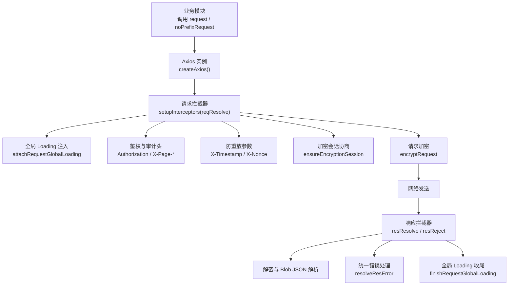
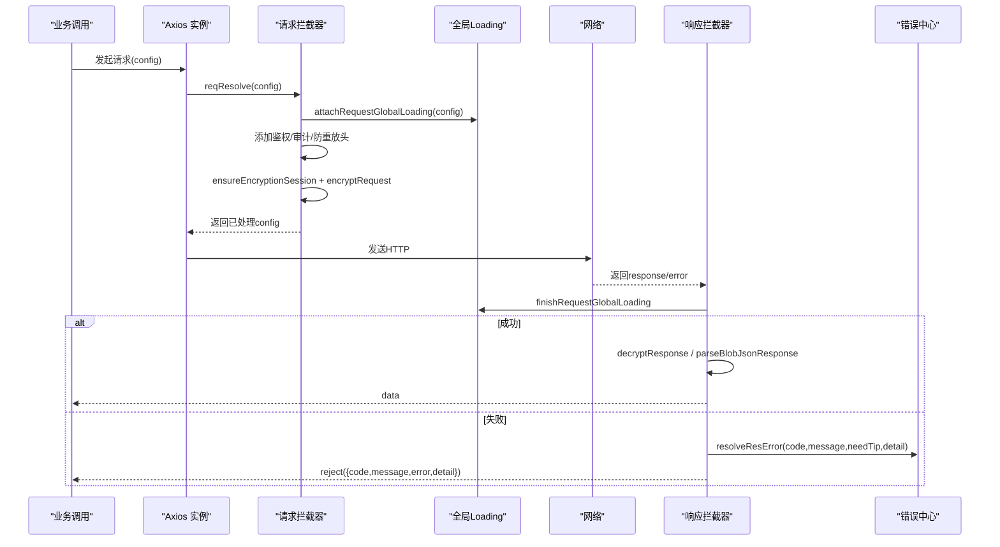
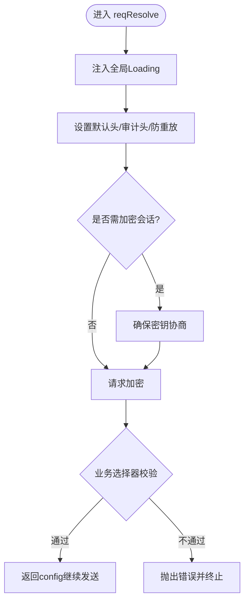
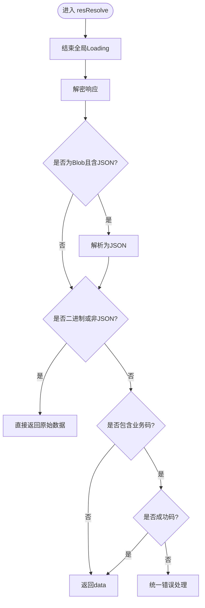
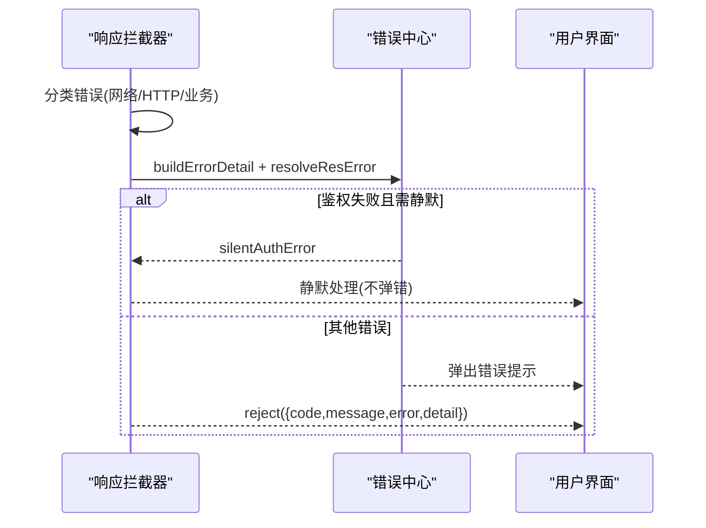
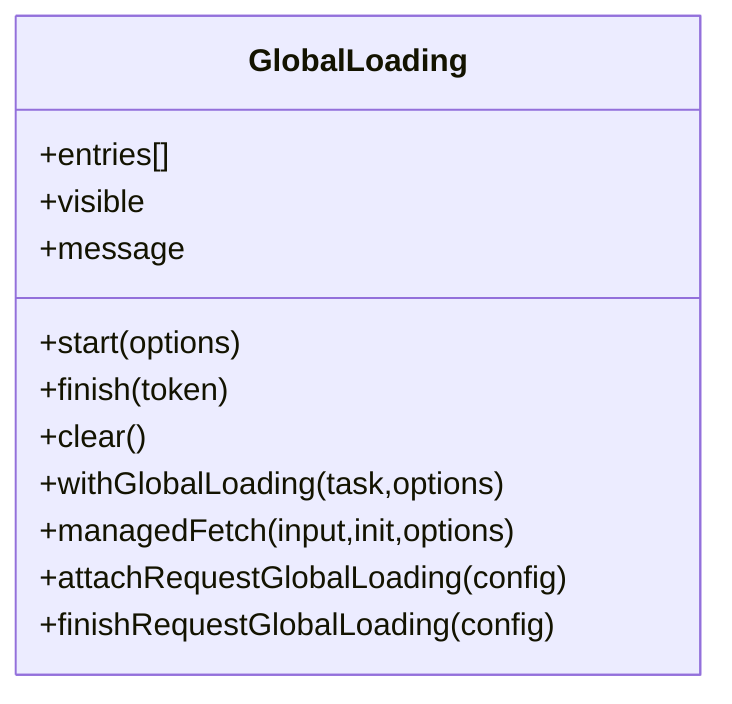
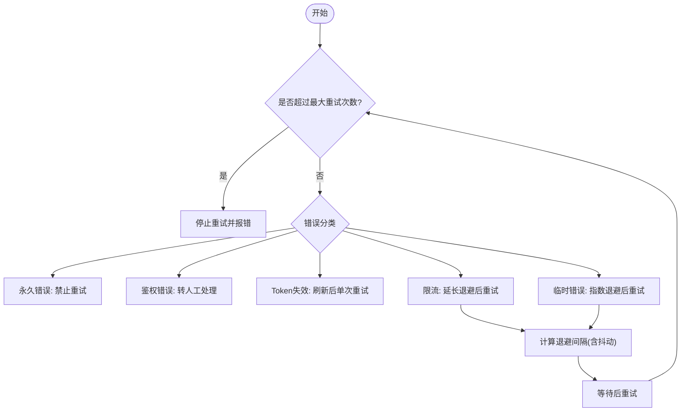
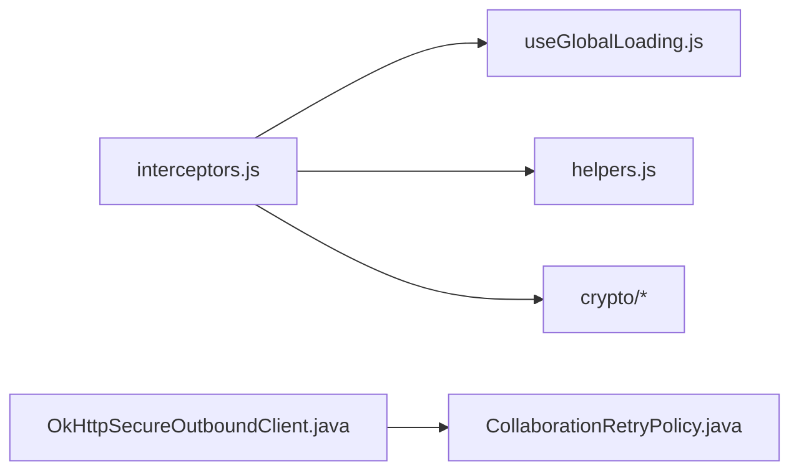

# 请求拦截器

<cite>
**本文引用的文件**
- [interceptors.js](file://forge-admin-ui/src/utils/http/interceptors.js)
- [index.js](file://forge-admin-ui/src/utils/http/index.js)
- [helpers.js](file://forge-admin-ui/src/utils/http/helpers.js)
- [useGlobalLoading.js](file://forge-admin-ui/src/composables/useGlobalLoading.js)
- [flow-generator.js](file://forge-admin-ui/src/api/flow-generator.js)
- [OkHttpSecureOutboundClient.java](file://forge-server/forge-framework/forge-starter-parent/forge-starter-outbound/src/main/java/com/mdframe/forge/starter/outbound/client/OkHttpSecureOutboundClient.java)
- [CollaborationRetryPolicy.java](file://forge-server/forge-framework/forge-plugin-parent/forge-plugin-collaboration/src/main/java/com/mdframe/forge/plugin/collaboration/service/CollaborationRetryPolicy.java)
</cite>

## 目录
1. [简介](#简介)
2. [项目结构](#项目结构)
3. [核心组件](#核心组件)
4. [架构总览](#架构总览)
5. [详细组件分析](#详细组件分析)
6. [依赖关系分析](#依赖关系分析)
7. [性能考虑](#性能考虑)
8. [故障排查指南](#故障排查指南)
9. [结论](#结论)
10. [附录](#附录)

## 简介
本技术文档围绕前端请求拦截器的实现与扩展，系统阐述请求前处理、响应后处理与错误拦截机制。重点覆盖全局 loading 状态管理、请求去重、缓存策略、重试逻辑、网络异常处理、超时重试、离线支持与断点续传、日志记录、性能监控与调试工具集成，以及自定义拦截器开发与错误恢复策略。内容基于仓库中实际代码进行分析与归纳，确保可追溯与可落地。

## 项目结构
前端以 Axios 实例为中心，通过统一的拦截器装配完成鉴权、加密、防重放、页面审计、全局 loading、统一错误处理等横切能力；同时提供原生 fetch 的增强封装用于流式或二进制场景。后端在出站客户端层面配置连接/读取/写入/调用超时，并关闭自动重试，由上层策略控制重试行为。

**图表来源**
- [index.js:4-14](file://forge-admin-ui/src/utils/http/index.js#L4-L14)
- [interceptors.js:294-444](file://forge-admin-ui/src/utils/http/interceptors.js#L294-L444)
- [useGlobalLoading.js:313-339](file://forge-admin-ui/src/composables/useGlobalLoading.js#L313-L339)

**章节来源**
- [index.js:1-27](file://forge-admin-ui/src/utils/http/index.js#L1-L27)
- [interceptors.js:1-597](file://forge-admin-ui/src/utils/http/interceptors.js#L1-L597)

## 核心组件
- Axios 实例工厂：创建带 baseURL 与默认超时的服务实例，并挂载拦截器。
- 请求拦截器：注入全局 loading、鉴权、审计头、防重放、加密会话协商与请求加密。
- 响应拦截器：解密响应、Blob JSON 兼容、业务码判定、统一错误提示与静默鉴权失败处理。
- 全局 Loading：按请求上下文智能显示/隐藏，支持延迟、最小可见时长、类型化文案与跳过策略。
- 错误处理助手：鉴权失效识别、统一错误提示、登录页/登出流程静默处理。
- 流式重试：针对 SSE/流式生成场景的重试与进度上报。
- 后端超时与重试策略：出站客户端超时配置与协作层指数退避重试策略。

**章节来源**
- [index.js:4-14](file://forge-admin-ui/src/utils/http/index.js#L4-L14)
- [interceptors.js:294-597](file://forge-admin-ui/src/utils/http/interceptors.js#L294-L597)
- [useGlobalLoading.js:1-352](file://forge-admin-ui/src/composables/useGlobalLoading.js#L1-L352)
- [helpers.js:1-96](file://forge-admin-ui/src/utils/http/helpers.js#L1-L96)
- [flow-generator.js:125-148](file://forge-admin-ui/src/api/flow-generator.js#L125-L148)
- [OkHttpSecureOutboundClient.java:108-128](file://forge-server/forge-framework/forge-starter-parent/forge-starter-outbound/src/main/java/com/mdframe/forge/starter/outbound/client/OkHttpSecureOutboundClient.java#L108-L128)
- [CollaborationRetryPolicy.java:56-93](file://forge-server/forge-framework/forge-plugin-parent/forge-plugin-collaboration/src/main/java/com/mdframe/forge/plugin/collaboration/service/CollaborationRetryPolicy.java#L56-L93)

## 架构总览
下图展示一次典型请求从发起、拦截、加密、发送到响应、解密、错误处理的完整链路，以及与全局 loading 和错误中心的交互。

**图表来源**
- [interceptors.js:294-444](file://forge-admin-ui/src/utils/http/interceptors.js#L294-L444)
- [useGlobalLoading.js:313-339](file://forge-admin-ui/src/composables/useGlobalLoading.js#L313-L339)
- [helpers.js:52-96](file://forge-admin-ui/src/utils/http/helpers.js#L52-L96)

## 详细组件分析

### 请求前处理（请求拦截器）
- 全局 loading 注入：根据 URL、方法、数据类型与显式配置决定是否开启，并生成 token 绑定到 config，便于后续收尾。
- 鉴权与审计：注入 Authorization 与页面路径/标题审计头，便于服务端追踪。
- 防重放：为需要保护的接口注入时间戳与随机数，避免重复提交。
- 加密会话协商：对敏感接口进行密钥协商，无密钥时阻止明文请求。
- 请求加密：统一对请求体进行加密，减少明文传输风险。
- 业务选择器校验：拦截缺少对象编码的选择器请求，防止无效调用。

**图表来源**
- [interceptors.js:524-591](file://forge-admin-ui/src/utils/http/interceptors.js#L524-L591)

**章节来源**
- [interceptors.js:524-591](file://forge-admin-ui/src/utils/http/interceptors.js#L524-L591)

### 响应后处理（响应拦截器）
- 全局 loading 收尾：无论成功或失败均确保 loading 结束。
- 解密与兼容：先解密响应，再尝试将 Blob 中的 JSON 文本解析为对象，保证下载/附件等场景仍可走业务码判断。
- 二进制与非 JSON：直接透传，不走业务码判断。
- 业务码判定：成功码放行，否则构造 detail 并交由统一错误处理。
- 鉴权失败静默：在登录页或登出流程中静默处理 401 类错误，避免重复弹窗。

**图表来源**
- [interceptors.js:300-375](file://forge-admin-ui/src/utils/http/interceptors.js#L300-L375)

**章节来源**
- [interceptors.js:300-375](file://forge-admin-ui/src/utils/http/interceptors.js#L300-L375)

### 错误拦截机制
- 网络错误：无 response 时归类为网络错误，构造 detail 并提示。
- HTTP 错误：提取 code/message/status/responseData，统一提示。
- 鉴权错误：在特定场景下静默处理并触发登出/跳转。
- 解密错误：检测密钥过期，重置会话并尝试只读重试，必要时提示用户。

**图表来源**
- [interceptors.js:377-444](file://forge-admin-ui/src/utils/http/interceptors.js#L377-L444)
- [helpers.js:52-96](file://forge-admin-ui/src/utils/http/helpers.js#L52-L96)

**章节来源**
- [interceptors.js:377-444](file://forge-admin-ui/src/utils/http/interceptors.js#L377-L444)
- [helpers.js:1-96](file://forge-admin-ui/src/utils/http/helpers.js#L1-L96)

### 全局 Loading 状态管理
- 多入口：Axios 请求通过 attachRequestGlobalLoading 注入；原生 fetch 通过 managedFetch 包装；通用任务通过 withGlobalLoading 包裹。
- 智能显示：支持延迟显示、最小可见时长、类型化文案（上传/导出/下载/提交/路由）。
- 跳过策略：可通过 header 或配置跳过全局 loading。
- 响应体监听：对带 body 的响应使用 Proxy 拦截读取方法，确保在读取完成后结束 loading；并提供最大等待兜底。

**图表来源**
- [useGlobalLoading.js:209-351](file://forge-admin-ui/src/composables/useGlobalLoading.js#L209-L351)

**章节来源**
- [useGlobalLoading.js:1-352](file://forge-admin-ui/src/composables/useGlobalLoading.js#L1-L352)

### 请求去重
当前仓库未在前端拦截器层实现通用的请求去重机制。建议结合以下方案按需扩展：
- 基于 URL+序列化参数的唯一键，维护 Promise 缓存，相同请求复用结果。
- 对幂等 GET 请求启用去重，写操作不建议去重。
- 注意与全局 loading、重试、缓存策略的协调，避免掩盖真实并发问题。

[本节为概念性建议，不直接引用具体文件]

### 缓存策略
前端拦截器未内置通用缓存策略。可结合业务需求引入：
- 内存缓存：对短生命周期、低更新频率的数据做短期缓存。
- 浏览器缓存：利用 Cache-Control/ETag 等头部配合 fetch/axios 缓存。
- 与服务端多级缓存协同：后端提供 Redis/本地多级缓存与失效策略，前端仅负责合理请求与必要刷新。

[本节为概念性建议，不直接引用具体文件]

### 重试逻辑
- 流式重试：SSE/流式生成场景支持中断后的有限次数重试，并通过 progress 事件上报阶段信息。
- 后端重试策略：协作层采用指数退避与抖动，限制最大尝试次数，区分永久/临时/限流/鉴权等错误类别。
- 出站客户端超时：连接/读取/写入/调用超时严格受控，关闭自动重试，由上层策略决定重试时机。

**图表来源**
- [CollaborationRetryPolicy.java:56-93](file://forge-server/forge-framework/forge-plugin-parent/forge-plugin-collaboration/src/main/java/com/mdframe/forge/plugin/collaboration/service/CollaborationRetryPolicy.java#L56-L93)
- [flow-generator.js:125-148](file://forge-admin-ui/src/api/flow-generator.js#L125-L148)
- [OkHttpSecureOutboundClient.java:108-128](file://forge-server/forge-framework/forge-starter-parent/forge-starter-outbound/src/main/java/com/mdframe/forge/starter/outbound/client/OkHttpSecureOutboundClient.java#L108-L128)

**章节来源**
- [flow-generator.js:125-148](file://forge-admin-ui/src/api/flow-generator.js#L125-L148)
- [CollaborationRetryPolicy.java:56-93](file://forge-server/forge-framework/forge-plugin-parent/forge-plugin-collaboration/src/main/java/com/mdframe/forge/plugin/collaboration/service/CollaborationRetryPolicy.java#L56-L93)
- [OkHttpSecureOutboundClient.java:108-128](file://forge-server/forge-framework/forge-starter-parent/forge-starter-outbound/src/main/java/com/mdframe/forge/starter/outbound/client/OkHttpSecureOutboundClient.java#L108-L128)

### 网络异常处理
- 网络不可达/超时：归类为网络错误，统一提示并可携带 traceId 便于定位。
- 业务错误：按 code 映射为用户友好消息，支持 needTip 控制是否提示。
- 鉴权失效：在登录页或登出流程中静默处理，避免干扰用户体验。

**章节来源**
- [interceptors.js:377-444](file://forge-admin-ui/src/utils/http/interceptors.js#L377-L444)
- [helpers.js:52-96](file://forge-admin-ui/src/utils/http/helpers.js#L52-L96)

### 超时重试
- 前端默认超时：Axios 实例默认超时时间为固定值，可按需覆盖。
- 后端超时：出站客户端分别设置连接/读取/写入/调用超时，并关闭自动重试，由上层策略控制。
- 建议：对长耗时任务使用流式输出与分片重试，避免长时间阻塞。

**章节来源**
- [index.js:4-14](file://forge-admin-ui/src/utils/http/index.js#L4-L14)
- [OkHttpSecureOutboundClient.java:108-128](file://forge-server/forge-framework/forge-starter-parent/forge-starter-outbound/src/main/java/com/mdframe/forge/starter/outbound/client/OkHttpSecureOutboundClient.java#L108-L128)

### 离线支持与断点续传
- 离线支持：可在应用层结合 Service Worker 或本地存储实现离线队列与重试，拦截器层未内置。
- 断点续传：对大文件上传/下载建议使用分块与断点续传协议，前端可基于 Range/ETag 实现；拦截器层未内置。

[本节为概念性建议，不直接引用具体文件]

### 日志记录、性能监控与调试工具
- 日志记录：请求头注入 traceId，错误详情包含 method/url/traceId/status/responseData，便于全链路追踪。
- 性能监控：可基于请求耗时、成功率、错误率埋点，结合全局 loading 的最小可见时长优化感知性能。
- 调试工具：开发环境可借助 mockRequest 进行接口模拟；错误弹窗支持携带详细信息以便快速定位。

**章节来源**
- [interceptors.js:254-266](file://forge-admin-ui/src/utils/http/interceptors.js#L254-L266)
- [index.js:24-27](file://forge-admin-ui/src/utils/http/index.js#L24-L27)

### 自定义拦截器开发与错误恢复策略
- 扩展点：在 setupInterceptors 中新增请求/响应拦截器，遵循现有约定（如 needTip、detail、skipErrorHandler）。
- 错误恢复：对只读加密请求在密钥过期时自动重试；对鉴权失败在特定场景静默处理；对网络错误提供统一提示。
- 最佳实践：保持幂等性、避免副作用、谨慎修改全局状态、做好异常兜底。

**章节来源**
- [interceptors.js:294-597](file://forge-admin-ui/src/utils/http/interceptors.js#L294-L597)
- [helpers.js:1-96](file://forge-admin-ui/src/utils/http/helpers.js#L1-L96)

## 依赖关系分析
- 前端拦截器依赖全局 loading、加密工具、错误处理助手与存储（鉴权态）。
- 后端出站客户端依赖超时配置与重试策略，形成前后端一致的可靠性保障。

**图表来源**
- [interceptors.js:1-10](file://forge-admin-ui/src/utils/http/interceptors.js#L1-L10)
- [useGlobalLoading.js:1-16](file://forge-admin-ui/src/composables/useGlobalLoading.js#L1-L16)
- [helpers.js:1-13](file://forge-admin-ui/src/utils/http/helpers.js#L1-L13)
- [OkHttpSecureOutboundClient.java:108-128](file://forge-server/forge-framework/forge-starter-parent/forge-starter-outbound/src/main/java/com/mdframe/forge/starter/outbound/client/OkHttpSecureOutboundClient.java#L108-L128)
- [CollaborationRetryPolicy.java:56-93](file://forge-server/forge-framework/forge-plugin-parent/forge-plugin-collaboration/src/main/java/com/mdframe/forge/plugin/collaboration/service/CollaborationRetryPolicy.java#L56-L93)

**章节来源**
- [interceptors.js:1-597](file://forge-admin-ui/src/utils/http/interceptors.js#L1-L597)
- [useGlobalLoading.js:1-352](file://forge-admin-ui/src/composables/useGlobalLoading.js#L1-L352)
- [helpers.js:1-96](file://forge-admin-ui/src/utils/http/helpers.js#L1-L96)
- [OkHttpSecureOutboundClient.java:108-128](file://forge-server/forge-framework/forge-starter-parent/forge-starter-outbound/src/main/java/com/mdframe/forge/starter/outbound/client/OkHttpSecureOutboundClient.java#L108-L128)
- [CollaborationRetryPolicy.java:56-93](file://forge-server/forge-framework/forge-plugin-parent/forge-plugin-collaboration/src/main/java/com/mdframe/forge/plugin/collaboration/service/CollaborationRetryPolicy.java#L56-L93)

## 性能考虑
- 全局 loading 最小可见时长与延迟显示，避免闪烁与频繁切换。
- 二进制响应与流式响应尽早结束 loading，减少 UI 阻塞。
- 防重放与加密仅在必要时启用，降低额外开销。
- 后端超时严格控制，避免资源长期占用。

[本节提供通用指导，不直接引用具体文件]

## 故障排查指南
- 常见问题：
  - 401/令牌失效：检查鉴权流程与静默处理逻辑，确认是否在登录页或登出流程。
  - 解密失败：检查密钥协商与会话状态，必要时重置会话并重试只读请求。
  - 网络错误：核对网络连通性与代理配置，查看 traceId 定位服务端日志。
- 定位步骤：
  - 查看错误详情中的 method/url/traceId/status/responseData。
  - 检查请求头是否包含审计与防重放参数。
  - 确认全局 loading 是否正确注入与收尾。

**章节来源**
- [interceptors.js:377-444](file://forge-admin-ui/src/utils/http/interceptors.js#L377-L444)
- [helpers.js:52-96](file://forge-admin-ui/src/utils/http/helpers.js#L52-L96)

## 结论
该请求拦截器体系通过统一的请求前处理、响应后处理与错误拦截，实现了鉴权、审计、防重放、加密、全局 loading 与统一错误提示等关键能力。结合后端的超时与重试策略，形成了端到端的可靠性保障。建议在业务层按需扩展请求去重、缓存与离线/断点续传能力，并持续完善日志与监控，以提升可观测性与用户体验。

[本节为总结性内容，不直接引用具体文件]

## 附录
- 相关 API 与工具：
  - Axios 实例：request/noPrefixRequest/mockRequest
  - 全局 loading：start/finish/clear/withGlobalLoading/managedFetch
  - 错误处理：resolveResError/isAuthErrorCode/shouldSilenceAuthError
  - 流式重试：flow-generator 中的重试与进度上报

**章节来源**
- [index.js:4-27](file://forge-admin-ui/src/utils/http/index.js#L4-L27)
- [useGlobalLoading.js:209-351](file://forge-admin-ui/src/composables/useGlobalLoading.js#L209-L351)
- [helpers.js:1-96](file://forge-admin-ui/src/utils/http/helpers.js#L1-L96)
- [flow-generator.js:125-148](file://forge-admin-ui/src/api/flow-generator.js#L125-L148)