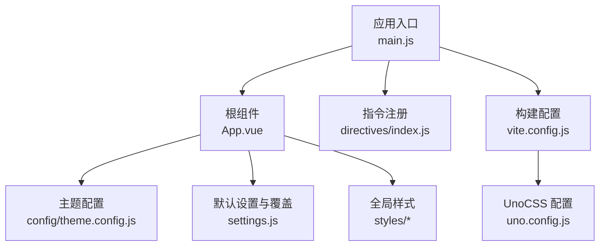
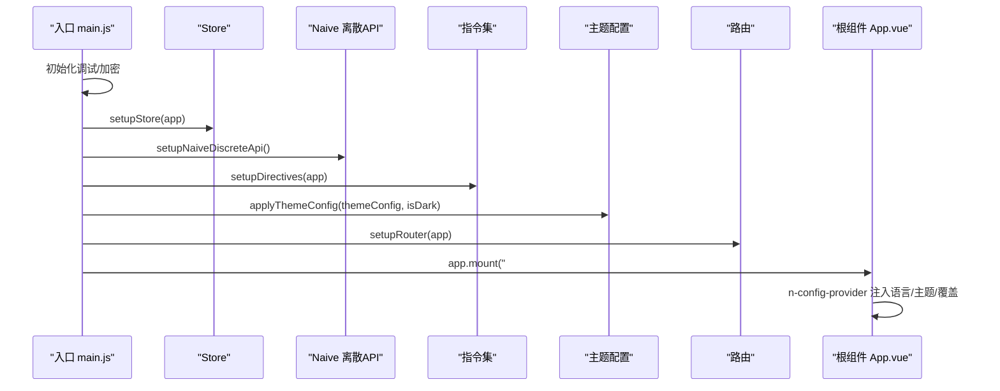
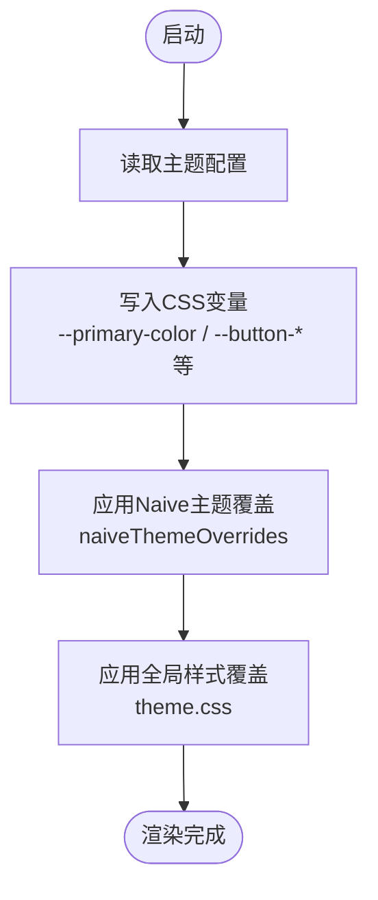
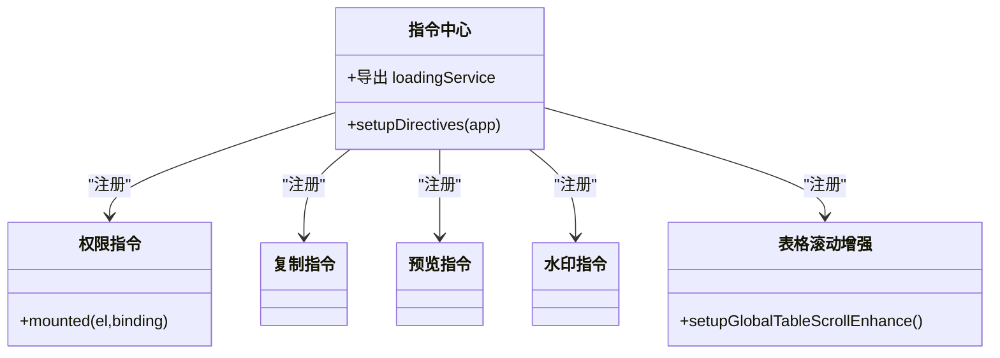
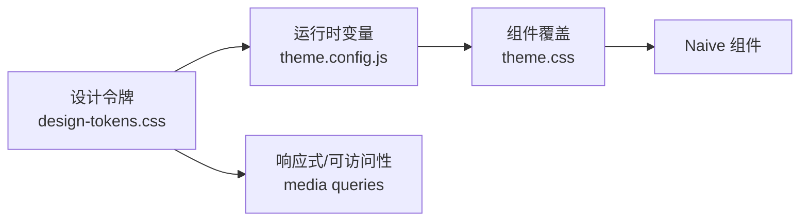
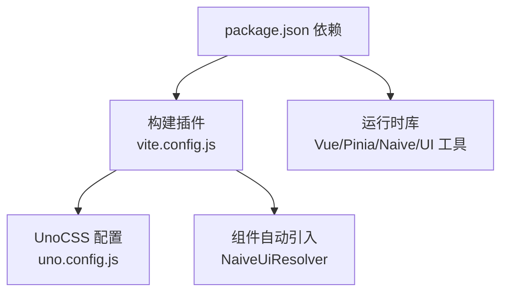

# UI框架集成

<cite>
**本文引用的文件**
- [package.json](file://forge-admin-ui/package.json)
- [vite.config.js](file://forge-admin-ui/vite.config.js)
- [uno.config.js](file://forge-admin-ui/uno.config.js)
- [main.js](file://forge-admin-ui/src/main.js)
- [App.vue](file://forge-admin-ui/src/App.vue)
- [theme.config.js](file://forge-admin-ui/src/config/theme.config.js)
- [settings.js](file://forge-admin-ui/src/settings.js)
- [design-tokens.css](file://forge-admin-ui/src/styles/design-tokens.css)
- [theme.css](file://forge-admin-ui/src/styles/theme.css)
- [index.js（指令）](file://forge-admin-ui/src/directives/index.js)
</cite>

## 目录
1. [简介](#简介)
2. [项目结构](#项目结构)
3. [核心组件](#核心组件)
4. [架构总览](#架构总览)
5. [详细组件分析](#详细组件分析)
6. [依赖关系分析](#依赖关系分析)
7. [性能考量](#性能考量)
8. [故障排查指南](#故障排查指南)
9. [结论](#结论)
10. [附录](#附录)

## 简介
本技术文档聚焦于 Forge Admin 前端中 Naive UI 的集成与定制，覆盖主题配置、样式覆盖策略、自定义指令、全局样式与 CSS 变量系统、响应式设计与动画、无障碍访问支持、主题切换机制与国际化、以及扩展开发与最佳实践。目标是帮助开发者快速理解并高效扩展 UI 层能力。

## 项目结构
- 构建与插件：Vite + Vue3 + UnoCSS + 自动导入 + Naive UI 自动解析
- 应用入口：初始化调试、加密配置、Store、Naive 离散 API、指令、路由、挂载
- 根组件：Naive ConfigProvider 包裹全局主题、语言、覆盖；布局动态加载；水印与全局加载
- 主题系统：设计令牌（tokens）、运行时主题变量注入、组件级覆盖
- 指令体系：权限、复制、预览、水印、表格滚动增强等
- 样式体系：重置、全局、主题、动画、响应式变量

**图表来源**
- [main.js:20-50](file://forge-admin-ui/src/main.js#L20-L50)
- [App.vue:2-40](file://forge-admin-ui/src/App.vue#L2-L40)
- [vite.config.js:21-46](file://forge-admin-ui/vite.config.js#L21-L46)
- [uno.config.js:9-29](file://forge-admin-ui/uno.config.js#L9-L29)
- [theme.config.js:145-229](file://forge-admin-ui/src/config/theme.config.js#L145-L229)
- [settings.js:24-39](file://forge-admin-ui/src/settings.js#L24-L39)

**章节来源**
- [main.js:20-50](file://forge-admin-ui/src/main.js#L20-L50)
- [vite.config.js:21-46](file://forge-admin-ui/vite.config.js#L21-L46)
- [uno.config.js:9-29](file://forge-admin-ui/uno.config.js#L9-L29)

## 核心组件
- Naive UI 集成方式
  - 通过 Vite 插件 unplugin-vue-components 配合 NaiveUiResolver 实现按需自动引入
  - 在根组件使用 n-config-provider 提供全局语言、暗色主题与主题覆盖
- 主题与样式
  - 设计令牌集中定义颜色、间距、圆角、阴影、字体、断点等
  - 运行时将主题配置写入 CSS 变量，驱动 Header/菜单/按钮等样式
  - 通过 theme.css 对 Naive 组件进行统一风格覆盖
- 指令与工具
  - 指令中心注册权限控制、复制、图片预览、水印、表格滚动增强等
  - 暴露 loading 服务供全局调用

**章节来源**
- [vite.config.js:43-46](file://forge-admin-ui/vite.config.js#L43-L46)
- [App.vue:2-40](file://forge-admin-ui/src/App.vue#L2-L40)
- [design-tokens.css:1-260](file://forge-admin-ui/src/styles/design-tokens.css#L1-L260)
- [theme.css:6-54](file://forge-admin-ui/src/styles/theme.css#L6-L54)
- [index.js（指令）:20-38](file://forge-admin-ui/src/directives/index.js#L20-L38)

## 架构总览
下图展示了从应用启动到主题渲染的关键流程：入口初始化 → Store 与 Naive 离散 API → 指令注册 → 主题应用 → 路由与挂载。

**图表来源**
- [main.js:20-50](file://forge-admin-ui/src/main.js#L20-L50)
- [App.vue:2-40](file://forge-admin-ui/src/App.vue#L2-L40)
- [theme.config.js:145-229](file://forge-admin-ui/src/config/theme.config.js#L145-L229)

## 详细组件分析

### Naive UI 集成与主题覆盖
- 自动引入：通过 unplugin-vue-components 的 NaiveUiResolver 启用按需引入，减少打包体积
- 全局提供者：n-config-provider 绑定中文本地化、日期本地化、暗色主题与主题覆盖
- 主题覆盖：
  - settings.js 中的 naiveThemeOverrides 提供基础覆盖（主色、圆角、按钮字重等）
  - theme.config.js 运行时将主题色、渐变、按钮阴影等写入 CSS 变量
  - theme.css 对按钮、表格、对话框、通知等进行统一风格覆盖
- 语言与国际化：
  - 根组件直接绑定 zhCN/dateZhCN，完成中文本地化
  - 如需扩展多语言，可在 store 或配置中维护 locale 映射并在运行时切换

**图表来源**
- [App.vue:2-40](file://forge-admin-ui/src/App.vue#L2-L40)
- [settings.js:24-39](file://forge-admin-ui/src/settings.js#L24-L39)
- [theme.config.js:145-229](file://forge-admin-ui/src/config/theme.config.js#L145-L229)
- [theme.css:440-726](file://forge-admin-ui/src/styles/theme.css#L440-L726)

**章节来源**
- [vite.config.js:43-46](file://forge-admin-ui/vite.config.js#L43-L46)
- [App.vue:2-40](file://forge-admin-ui/src/App.vue#L2-L40)
- [settings.js:24-39](file://forge-admin-ui/src/settings.js#L24-L39)
- [theme.config.js:145-229](file://forge-admin-ui/src/config/theme.config.js#L145-L229)
- [theme.css:440-726](file://forge-admin-ui/src/styles/theme.css#L440-L726)

### 自定义指令体系
- 指令注册：集中注册权限、复制、预览、水印、表格滚动增强等
- 权限指令：基于当前路由元信息控制按钮可见性
- Loading 指令与服务：提供页面级/元素级加载态，同时暴露 $loading 全局服务
- 表格滚动增强：提升横向滚动体验，支持拖拽排序与固定列优化

**图表来源**
- [index.js（指令）:20-38](file://forge-admin-ui/src/directives/index.js#L20-L38)

**章节来源**
- [index.js（指令）:20-38](file://forge-admin-ui/src/directives/index.js#L20-L38)

### 全局样式与 CSS 变量系统
- 设计令牌：集中定义颜色、间距、圆角、阴影、字体、断点、层级等
- 运行时变量：主题配置将业务主色、按钮状态、菜单配色等写入 CSS 变量
- 组件覆盖：针对 Naive 组件进行统一风格覆盖，确保一致的视觉语言
- 响应式与可访问性：
  - 响应式断点变量与媒体查询适配不同屏幕
  - 高对比度模式与减少动画模式支持

**图表来源**
- [design-tokens.css:1-260](file://forge-admin-ui/src/styles/design-tokens.css#L1-L260)
- [theme.config.js:145-229](file://forge-admin-ui/src/config/theme.config.js#L145-L229)
- [theme.css:6-54](file://forge-admin-ui/src/styles/theme.css#L6-L54)

**章节来源**
- [design-tokens.css:1-260](file://forge-admin-ui/src/styles/design-tokens.css#L1-L260)
- [theme.config.js:145-229](file://forge-admin-ui/src/config/theme.config.js#L145-L229)
- [theme.css:6-54](file://forge-admin-ui/src/styles/theme.css#L6-L54)

### 响应式设计、动画与无障碍
- 响应式：
  - 通过 design-tokens.css 定义断点与尺寸变量，结合 UnoCSS 快捷类与媒体查询
  - 分页器等组件在不同宽度下自适应布局与字号
- 动画：
  - 统一的过渡时长与缓动曲线变量
  - 减少动画模式通过 prefers-reduced-motion 关闭动画
- 无障碍：
  - 高对比度模式通过 prefers-contrast 调整边框与文字
  - 关键交互元素具备合适的焦点环与可读性

**章节来源**
- [design-tokens.css:216-316](file://forge-admin-ui/src/styles/design-tokens.css#L216-L316)
- [theme.css:382-434](file://forge-admin-ui/src/styles/theme.css#L382-L434)

### 主题切换机制与国际化
- 主题切换：
  - 根组件根据 appStore.isDark 切换暗色主题
  - applyThemeConfig 根据 isDark 选择对应头部/菜单配置并写入 CSS 变量
  - 主题变化时触发 applyCurrentTheme 更新组件覆盖
- 国际化：
  - 根组件绑定 zhCN 与 dateZhCN，完成中文本地化
  - 可通过 store 或配置扩展多语言并在运行时切换

**章节来源**
- [App.vue:2-40](file://forge-admin-ui/src/App.vue#L2-L40)
- [theme.config.js:145-229](file://forge-admin-ui/src/config/theme.config.js#L145-L229)

### 组件样式定制与最佳实践
- 优先使用设计令牌与 CSS 变量，避免硬编码颜色与尺寸
- 使用 settings.js 中的 naiveThemeOverrides 做轻量覆盖，必要时在 theme.css 中补充
- 按钮统一扁平风格，去除多余阴影与浮起效果，保持操作区一致性
- 表格表头粘性定位与固定列行为通过变量与样式统一控制
- 使用 UnoCSS 快捷类与规则，减少重复样式

**章节来源**
- [settings.js:24-39](file://forge-admin-ui/src/settings.js#L24-L39)
- [theme.css:440-726](file://forge-admin-ui/src/styles/theme.css#L440-L726)
- [uno.config.js:30-45](file://forge-admin-ui/uno.config.js#L30-L45)

## 依赖关系分析
- 包依赖：Naive UI、Vue3、Pinia、UnoCSS、Vite 生态、ECharts、BPMN 等
- 构建依赖：unplugin-vue-components（NaiveUiResolver）、unplugin-auto-import、unocss、vite-plugin-router-warn、vite-plugin-vue-devtools
- 运行时依赖：store、router、指令、样式资源

**图表来源**
- [package.json:19-74](file://forge-admin-ui/package.json#L19-L74)
- [vite.config.js:21-46](file://forge-admin-ui/vite.config.js#L21-L46)
- [uno.config.js:9-29](file://forge-admin-ui/uno.config.js#L9-L29)

**章节来源**
- [package.json:19-74](file://forge-admin-ui/package.json#L19-L74)
- [vite.config.js:21-46](file://forge-admin-ui/vite.config.js#L21-L46)
- [uno.config.js:9-29](file://forge-admin-ui/uno.config.js#L9-L29)

## 性能考量
- 构建优化：
  - 按需引入 Naive UI 组件，减少打包体积
  - 预构建常用依赖，避免首次加载二次优化
  - 关闭 sourcemap、压缩器选择 oxc/esbuild，降低内存占用
- 运行时优化：
  - 主题变量与覆盖集中管理，减少重复计算
  - 表格与分页等组件采用响应式与最小必要样式，避免过度重排

**章节来源**
- [vite.config.js:66-108](file://forge-admin-ui/vite.config.js#L66-L108)
- [vite.config.js:160-173](file://forge-admin-ui/vite.config.js#L160-L173)

## 故障排查指南
- 主题未生效
  - 检查 applyThemeConfig 是否被调用，确认 isDark 与 themeConfig 是否正确传入
  - 检查 CSS 变量是否已写入 documentElement
- 组件样式异常
  - 确认 theme.css 覆盖优先级与 !important 的使用场景
  - 检查是否在特定布局类下存在冲突样式
- 指令无效
  - 确认 setupDirectives 已在应用启动阶段执行
  - 权限指令需确保路由 meta.btns 正确配置
- 构建报错
  - 检查依赖版本与插件兼容性
  - 查看 vite 代理与端口配置是否与后端一致

**章节来源**
- [theme.config.js:145-229](file://forge-admin-ui/src/config/theme.config.js#L145-L229)
- [theme.css:440-726](file://forge-admin-ui/src/styles/theme.css#L440-L726)
- [index.js（指令）:20-38](file://forge-admin-ui/src/directives/index.js#L20-L38)
- [vite.config.js:120-158](file://forge-admin-ui/vite.config.js#L120-L158)

## 结论
本项目以 Naive UI 为核心，结合设计令牌、运行时主题变量与全局样式覆盖，构建了稳定、可扩展且风格统一的后台界面体系。通过指令体系与 UnoCSS 原子化样式，提升了开发效率与可维护性。建议在后续迭代中继续遵循“变量优先、覆盖收敛、按需引入”的原则，持续优化主题与样式治理。

## 附录
- 扩展开发建议
  - 新增主题色：在 theme.config.js 中扩展 primaryColor 派生变量，并在 theme.css 中引用
  - 新增指令：在 directives/index.js 中注册，并在模块中实现生命周期逻辑
  - 新增组件覆盖：在 theme.css 中按组件命名空间追加样式，避免污染全局
- 最佳实践清单
  - 使用设计令牌与 CSS 变量，禁止硬编码颜色/尺寸
  - 优先使用 settings.js 的 naiveThemeOverrides 做轻量覆盖
  - 合理使用 UnoCSS 快捷类与规则，减少冗余 CSS
  - 关注响应式与可访问性，适配高对比度与减少动画模式