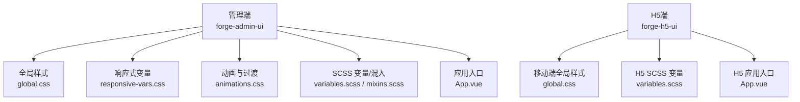
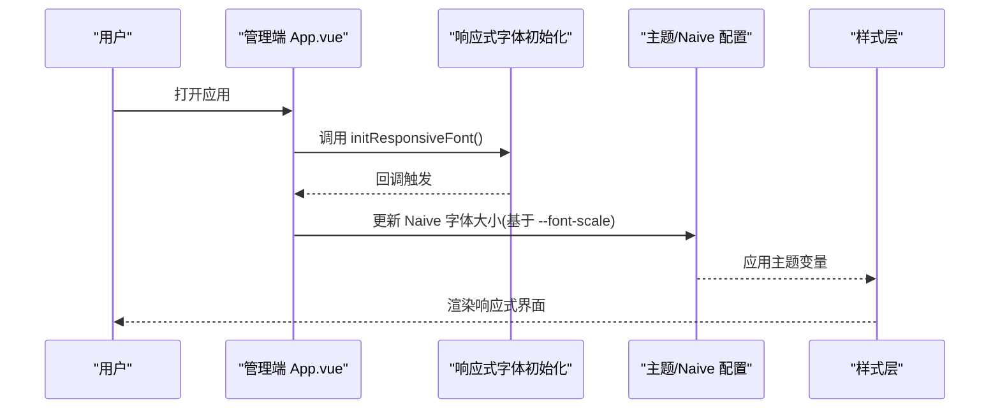
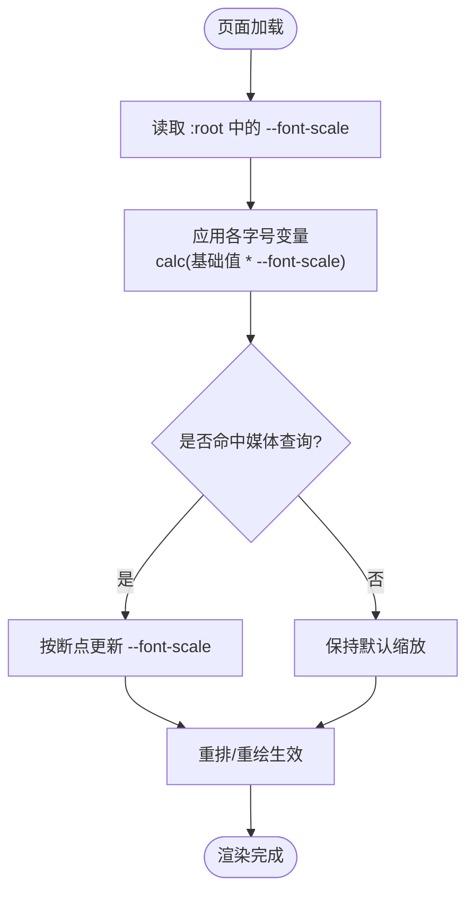
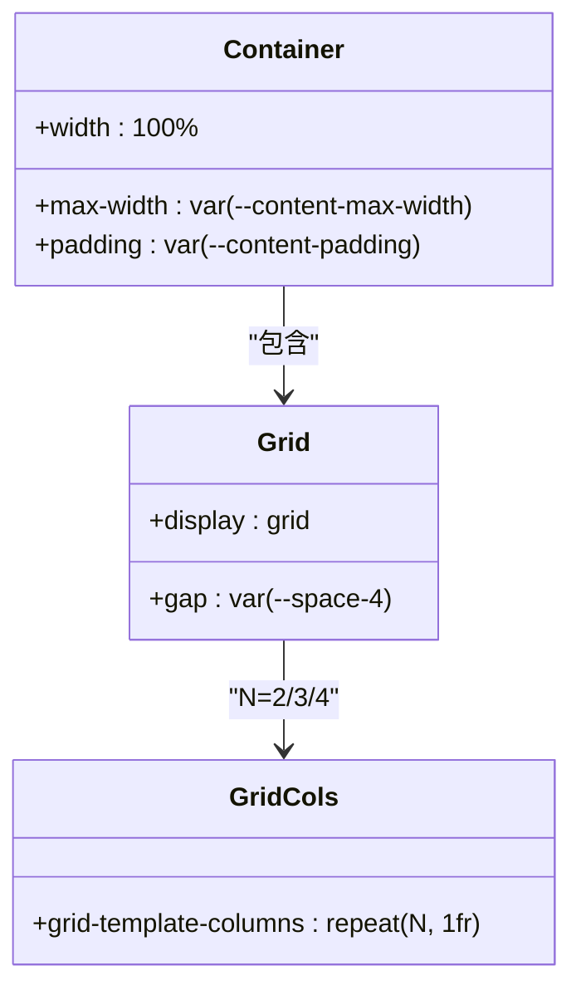
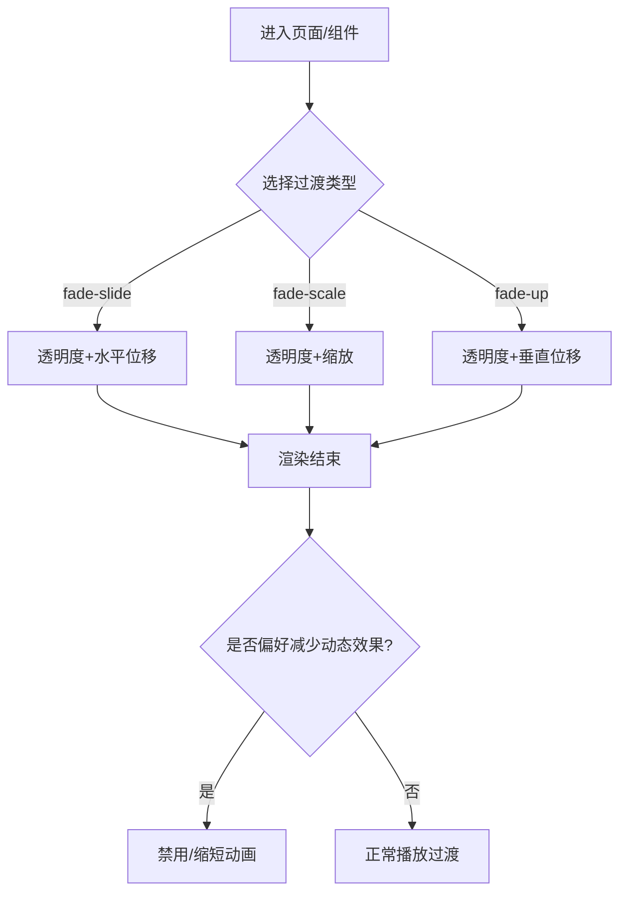
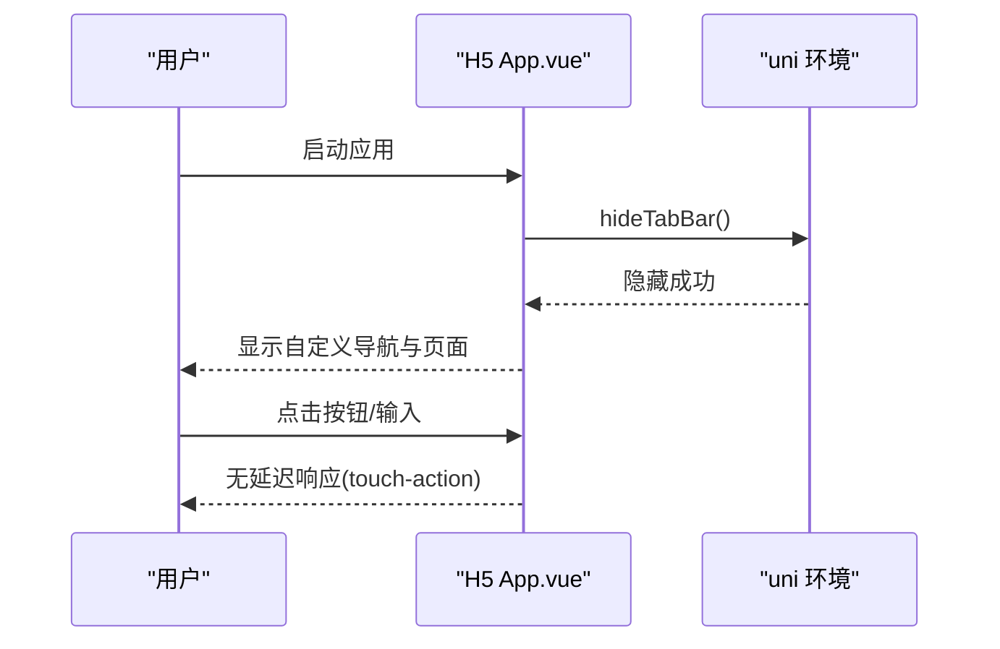
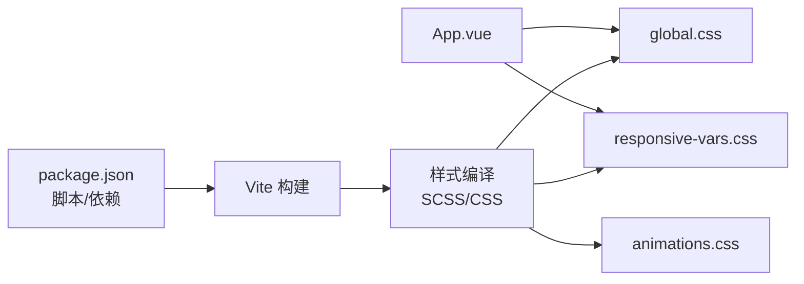

# 响应式设计

<cite>
**本文引用的文件**
- [responsive-vars.css](file://forge-admin-ui/src/styles/responsive-vars.css)
- [global.css](file://forge-admin-ui/src/styles/global.css)
- [animations.css](file://forge-admin-ui/src/styles/animations.css)
- [variables.scss](file://forge-admin-ui/src/styles/variables.scss)
- [mixins.scss](file://forge-admin-ui/src/styles/mixins.scss)
- [App.vue](file://forge-admin-ui/src/App.vue)
- [package.json](file://forge-admin-ui/package.json)
- [h5 global.css](file://forge-h5-ui/src/styles/global.css)
- [h5 variables.scss](file://forge-h5-ui/src/styles/variables.scss)
- [h5 App.vue](file://forge-h5-ui/src/App.vue)
</cite>

## 目录
1. [简介](#简介)
2. [项目结构](#项目结构)
3. [核心组件](#核心组件)
4. [架构总览](#架构总览)
5. [详细组件分析](#详细组件分析)
6. [依赖关系分析](#依赖关系分析)
7. [性能考量](#性能考量)
8. [故障排查指南](#故障排查指南)
9. [结论](#结论)
10. [附录](#附录)

## 简介
本技术文档聚焦 Forge Admin 的响应式设计实现，覆盖移动端适配方案、断点系统、弹性布局、CSS 媒体查询与容器级适配思路、动画与过渡效果集成、触摸交互处理、屏幕尺寸检测与浏览器兼容性策略，并提供最佳实践与调试技巧。内容基于仓库中前端工程（管理端 forge-admin-ui 与 H5 端 forge-h5-ui）的实际样式与入口文件进行分析总结。

## 项目结构
- 管理端（forge-admin-ui）
  - 通过 CSS 变量与媒体查询实现全局字体缩放与响应式断点
  - 提供通用工具类（栅格、页面容器、状态标签、描述列表等）
  - 集中动画与过渡类，支持可访问性“减少动态效果”
  - 在应用启动时初始化响应式字体并联动主题配置
- H5 端（forge-h5-ui）
  - 针对移动端的全局样式与基础动画
  - 隐藏原生底部导航以避免首屏闪烁
  - 小屏下统一字号与触摸优化

图表来源
- [global.css:252-284](file://forge-admin-ui/src/styles/global.css#L252-L284)
- [responsive-vars.css:6-63](file://forge-admin-ui/src/styles/responsive-vars.css#L6-L63)
- [animations.css:368-442](file://forge-admin-ui/src/styles/animations.css#L368-L442)
- [variables.scss:40-46](file://forge-admin-ui/src/styles/variables.scss#L40-L46)
- [mixins.scss:46-83](file://forge-admin-ui/src/styles/mixins.scss#L46-L83)
- [App.vue:135-142](file://forge-admin-ui/src/App.vue#L135-L142)
- [h5 global.css:34-55](file://forge-h5-ui/src/styles/global.css#L34-L55)
- [h5 variables.scss:1-26](file://forge-h5-ui/src/styles/variables.scss#L1-L26)
- [h5 App.vue:8-16](file://forge-h5-ui/src/App.vue#L8-L16)

章节来源
- [global.css:252-284](file://forge-admin-ui/src/styles/global.css#L252-L284)
- [responsive-vars.css:6-63](file://forge-admin-ui/src/styles/responsive-vars.css#L6-L63)
- [animations.css:368-442](file://forge-admin-ui/src/styles/animations.css#L368-L442)
- [variables.scss:40-46](file://forge-admin-ui/src/styles/variables.scss#L40-L46)
- [mixins.scss:46-83](file://forge-admin-ui/src/styles/mixins.scss#L46-L83)
- [App.vue:135-142](file://forge-admin-ui/src/App.vue#L135-L142)
- [h5 global.css:34-55](file://forge-h5-ui/src/styles/global.css#L34-L55)
- [h5 variables.scss:1-26](file://forge-h5-ui/src/styles/variables.scss#L1-L26)
- [h5 App.vue:8-16](file://forge-h5-ui/src/App.vue#L8-L16)

## 核心组件
- 响应式字体与断点系统
  - 通过 CSS 变量 --font-scale 配合多档媒体查询，实现全站点字体按比例缩放
  - 断点覆盖常见设备宽度区间，保证在不同屏幕下的可读性与密度
- 弹性布局与栅格
  - 使用 CSS Grid 构建 2/3/4 列栅格，并在小屏自动切换为单列
  - 提供常用 Flex 工具类与间距、对齐、文本截断等实用类
- 动画与过渡
  - 统一的 keyframes 与 transition 类，支持淡入、滑动、缩放、弹跳等
  - 遵循 prefers-reduced-motion 的可访问性规范，自动禁用或弱化动画
- H5 移动端适配
  - 小屏下统一字号，按钮与输入启用 touch-action 优化点击延迟
  - 隐藏原生 TabBar 避免首屏闪烁，确保自定义导航体验一致

章节来源
- [responsive-vars.css:6-63](file://forge-admin-ui/src/styles/responsive-vars.css#L6-L63)
- [global.css:252-284](file://forge-admin-ui/src/styles/global.css#L252-L284)
- [animations.css:233-442](file://forge-admin-ui/src/styles/animations.css#L233-L442)
- [h5 global.css:29-55](file://forge-h5-ui/src/styles/global.css#L29-L55)

## 架构总览
管理端采用“CSS 变量 + 媒体查询 + 工具类”的轻量响应式体系；H5 端在此基础上补充移动端专属样式与交互优化。两者均通过应用入口在启动阶段完成关键初始化（如响应式字体、主题、导航隐藏）。

图表来源
- [App.vue:135-142](file://forge-admin-ui/src/App.vue#L135-L142)
- [responsive-vars.css:6-63](file://forge-admin-ui/src/styles/responsive-vars.css#L6-L63)

章节来源
- [App.vue:135-142](file://forge-admin-ui/src/App.vue#L135-L142)
- [responsive-vars.css:6-63](file://forge-admin-ui/src/styles/responsive-vars.css#L6-L63)

## 详细组件分析

### 响应式字体与断点系统
- 设计要点
  - 以 :root 中的 --font-scale 为核心，所有字号通过 calc(基础值 * var(--font-scale)) 计算
  - 通过多个 @media (max-width: ...) 设置不同断点下的缩放比例，形成平滑缩放曲线
- 断点覆盖
  - 覆盖从超大屏到小屏的多档阈值，确保字体密度与可读性平衡
- 扩展建议
  - 可在更细粒度场景引入容器查询（container query）控制局部组件字号，但当前仓库未直接使用该特性

图表来源
- [responsive-vars.css:6-63](file://forge-admin-ui/src/styles/responsive-vars.css#L6-L63)

章节来源
- [responsive-vars.css:6-63](file://forge-admin-ui/src/styles/responsive-vars.css#L6-L63)

### 弹性布局与栅格系统
- 栅格实现
  - 使用 .grid 配合 .grid-2/.grid-3/.grid-4 定义列数
  - 在小屏（<=768px）强制单列，提升移动端阅读效率
- 页面容器与间距
  - .container 限制最大宽度并居中，结合 padding 控制边距
  - 提供 flex 工具类与 gap 系列，快速组合布局
- 描述列表自适应
  - 使用 grid-template-columns: repeat(auto-fill, minmax(260px, 1fr)) 实现自适应多列

图表来源
- [global.css:252-284](file://forge-admin-ui/src/styles/global.css#L252-L284)

章节来源
- [global.css:252-284](file://forge-admin-ui/src/styles/global.css#L252-L284)

### 动画与过渡效果
- 动画库
  - 集中定义 fadeIn/fadeOut/slideIn*/scaleIn*/bounceIn 等 keyframes
  - 提供 animate-* 快捷类与延迟类，便于组合使用
- 过渡类
  - transition-all/colors/opacity/transform 等通用过渡
  - Vue 路由过渡类 fade-slide/fade-scale/fade-up 用于页面切换
- 可访问性
  - 通过 @media (prefers-reduced-motion: reduce) 自动禁用或缩短动画时长

图表来源
- [animations.css:233-442](file://forge-admin-ui/src/styles/animations.css#L233-L442)

章节来源
- [animations.css:233-442](file://forge-admin-ui/src/styles/animations.css#L233-L442)

### H5 移动端适配与触摸交互
- 基础适配
  - 小屏下统一 body 字号，提升可读性
  - 对 button/input 设置 touch-action: manipulation，消除点击延迟
- 导航与首屏
  - 隐藏 uni 原生 TabBar，避免首屏闪烁，统一自定义导航体验
- 过渡与加载
  - 提供 fade-slide 过渡与加载点动画，增强反馈

图表来源
- [h5 App.vue:8-16](file://forge-h5-ui/src/App.vue#L8-L16)
- [h5 global.css:29-55](file://forge-h5-ui/src/styles/global.css#L29-L55)

章节来源
- [h5 App.vue:8-16](file://forge-h5-ui/src/App.vue#L8-L16)
- [h5 global.css:29-55](file://forge-h5-ui/src/styles/global.css#L29-L55)

### 屏幕尺寸检测与主题联动
- 管理端在挂载时初始化响应式字体，并根据 --font-scale 动态更新 Naive UI 主题字体大小，使组件库字体也跟随响应式变化
- 主题切换时应用当前主题配置，确保暗色模式下的对比度与一致性

章节来源
- [App.vue:135-142](file://forge-admin-ui/src/App.vue#L135-L142)

### 容器查询技术与响应式组件开发模式
- 现状说明
  - 当前仓库主要依赖媒体查询与 CSS 变量进行响应式控制，未发现直接使用容器查询（container query）的代码
- 推荐实践
  - 在复杂卡片/表格等组件内，可使用容器查询实现“随容器宽度自适应”的布局与排版
  - 将组件内部断点封装为 CSS 变量或 SCSS mixin，便于复用与维护

[本节为概念性指导，不直接分析具体文件]

## 依赖关系分析
- 构建与工具链
  - Vite 作为构建工具，配合 UnoCSS、ESLint、Vitest 等工具链
  - 使用 SCSS 与 CSS 变量混合开发，便于主题与响应式维护
- 样式依赖
  - 全局样式由 global.css 聚合，响应式变量由 responsive-vars.css 提供
  - 动画与过渡集中在 animations.css，便于统一管理
- 运行时依赖
  - App.vue 在启动阶段调用响应式字体初始化，并联动主题配置

图表来源
- [package.json:6-17](file://forge-admin-ui/package.json#L6-L17)
- [App.vue:135-142](file://forge-admin-ui/src/App.vue#L135-L142)

章节来源
- [package.json:6-17](file://forge-admin-ui/package.json#L6-L17)
- [App.vue:135-142](file://forge-admin-ui/src/App.vue#L135-L142)

## 性能考量
- 动画性能
  - 优先使用 transform 与 opacity 的过渡，避免触发重排
  - 合理使用 transition-duration，避免过长导致卡顿
- 可访问性
  - 尊重 prefers-reduced-motion，自动降级动画
- 移动端交互
  - 使用 touch-action 优化点击延迟，提升触控体验
- 构建与资源
  - 利用 Vite 按需与缓存机制，减少打包体积与冷启动时间

[本节提供通用指导，不直接分析具体文件]

## 故障排查指南
- 字体未按预期缩放
  - 检查媒体查询断点是否正确命中，确认 --font-scale 是否被覆盖
  - 验证应用启动时是否调用了响应式字体初始化并更新了主题字体
- 栅格在小屏异常
  - 确认是否误覆盖了 .grid-*/.container 的样式
  - 检查是否存在固定宽度导致无法换行
- 动画不生效或被禁用
  - 检查是否启用了减少动态效果偏好
  - 确认过渡类名与 transition 属性是否正确
- H5 首屏闪烁
  - 确认已隐藏原生 TabBar，且自定义导航已正确渲染
  - 检查是否有第三方样式覆盖了隐藏规则

章节来源
- [responsive-vars.css:6-63](file://forge-admin-ui/src/styles/responsive-vars.css#L6-L63)
- [App.vue:135-142](file://forge-admin-ui/src/App.vue#L135-L142)
- [global.css:252-284](file://forge-admin-ui/src/styles/global.css#L252-L284)
- [animations.css:427-442](file://forge-admin-ui/src/styles/animations.css#L427-L442)
- [h5 global.css:15-27](file://forge-h5-ui/src/styles/global.css#L15-L27)

## 结论
Forge Admin 的响应式设计以 CSS 变量与媒体查询为核心，辅以工具化栅格与统一的动画过渡体系，兼顾了可维护性与可访问性。H5 端在此基础上强化了移动端触控体验与首屏表现。建议在复杂组件中逐步引入容器查询，进一步实现“按容器宽度自适应”的精细化布局。

## 附录
- 最佳实践清单
  - 使用 CSS 变量管理断点与字号缩放，避免硬编码像素
  - 栅格布局优先使用 Grid，小屏自动回退单列
  - 动画与过渡统一收口，遵循可访问性规范
  - H5 端务必隐藏原生导航并优化触控延迟
- 调试技巧
  - 使用浏览器开发者工具的“设备模拟”切换断点，观察字体与栅格变化
  - 在控制台打印 --font-scale 的值，验证媒体查询生效
  - 对 H5 端开启页内调试面板，定位首屏与导航问题

[本节为通用指导，不直接分析具体文件]