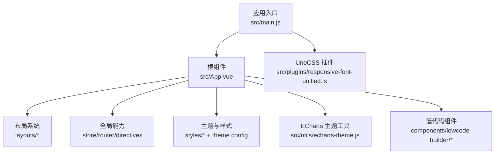
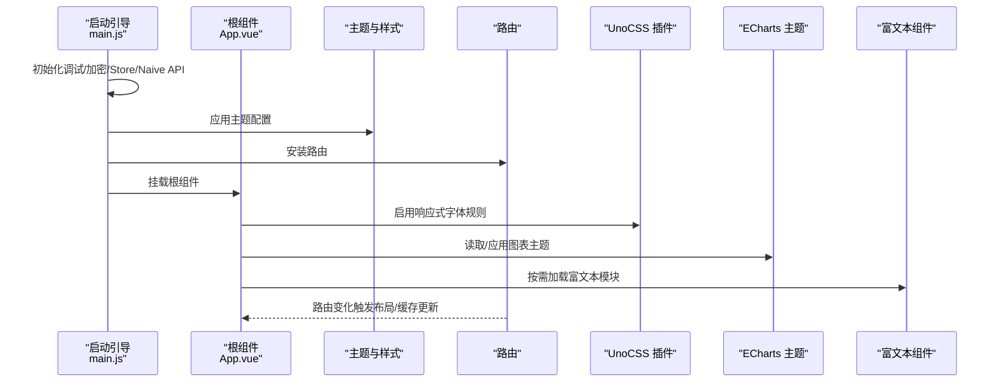
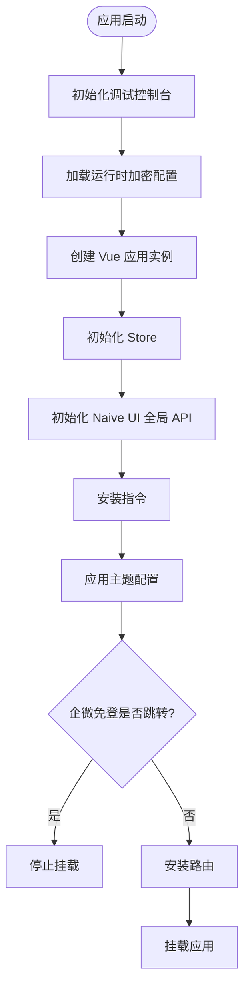
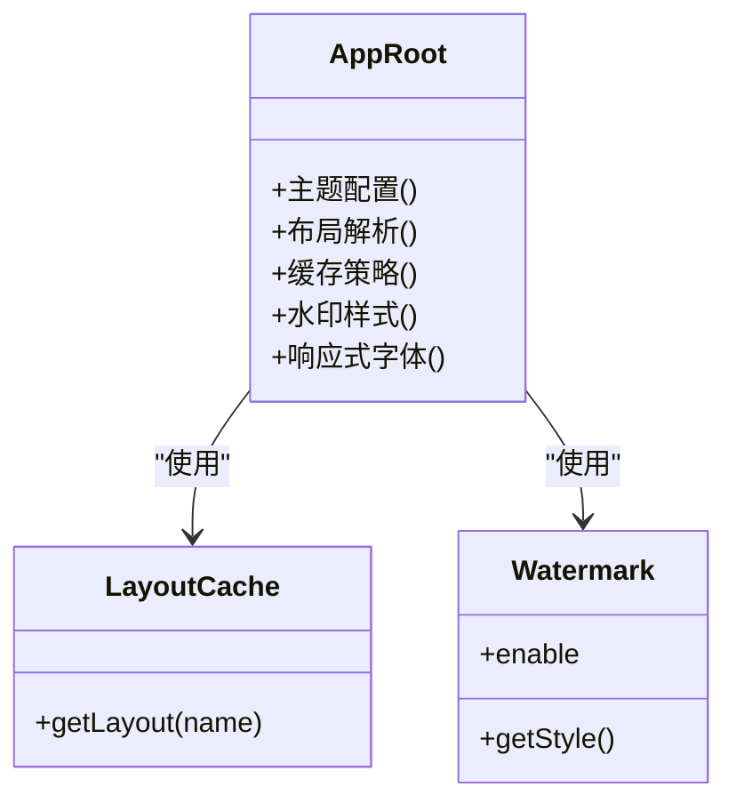
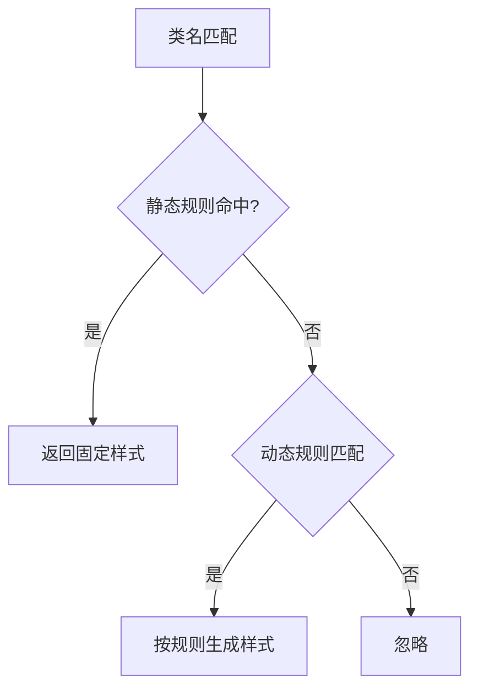
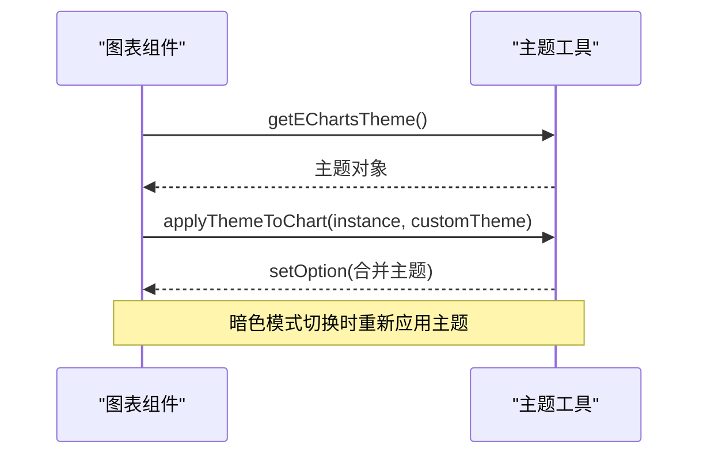
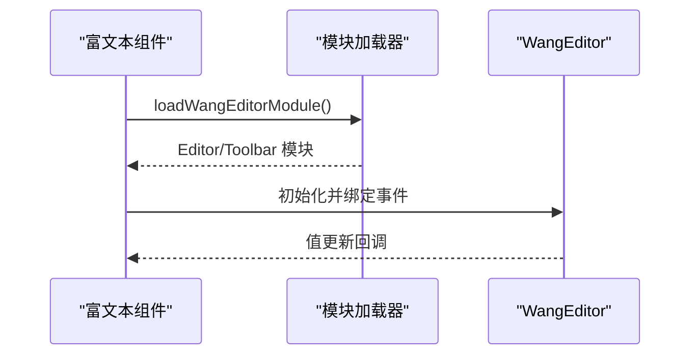
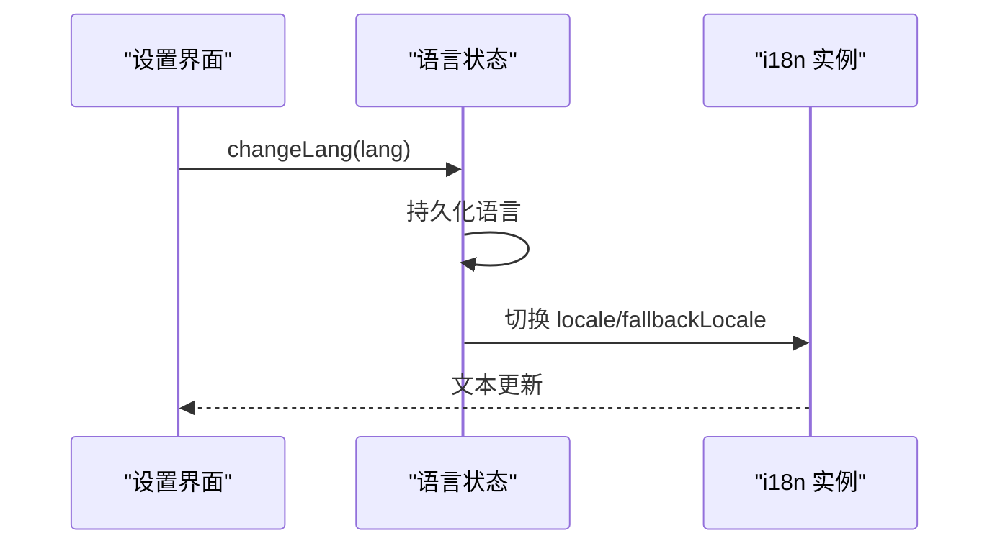
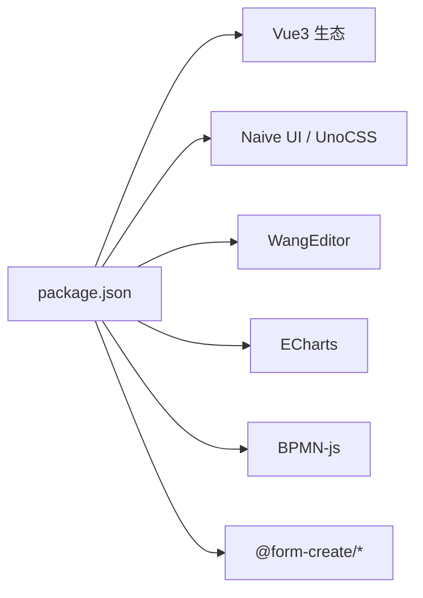

# 插件集成

<cite>
**本文引用的文件**
- [package.json](file://forge-admin-ui/package.json)
- [main.js](file://forge-admin-ui/src/main.js)
- [App.vue](file://forge-admin-ui/src/App.vue)
- [responsive-font-unified.js](file://forge-admin-ui/src/plugins/responsive-font-unified.js)
- [echarts-theme.js](file://forge-admin-ui/src/utils/echarts-theme.js)
- [PageWidgetRenderer.vue](file://forge-admin-ui/src/components/lowcode-builder/shared/PageWidgetRenderer.vue)
- [InlineRichText.vue](file://forge-admin-ui/src/components/lowcode-builder/shared/InlineRichText.vue)
- [ListPageGridDesigner.vue](file://forge-admin-ui/src/components/lowcode-builder/page/ListPageGridDesigner.vue)
- [AppSettingsGlobalization.vue](file://forge-admin-ui/src/views/app-center/components/settings/AppSettingsGlobalization.vue)
- [useLang.hook.ts](file://forge-report-ui/src/hooks/useLang.hook.ts)
- [i18n/index.ts](file://forge-report-ui/src/i18n/index.ts)
- [langStore.ts](file://forge-report-ui/src/store/modules/langStore/langStore.ts)
- [duplicate-plugin-detection.md](file://forge-admin-ui/.turing_coder_rules/vue-best-practices/rules/duplicate-plugin-detection.md)
</cite>

## 目录
1. [简介](#简介)
2. [项目结构](#项目结构)
3. [核心组件](#核心组件)
4. [架构总览](#架构总览)
5. [详细组件分析](#详细组件分析)
6. [依赖分析](#依赖分析)
7. [性能考虑](#性能考虑)
8. [故障排查指南](#故障排查指南)
9. [结论](#结论)
10. [附录](#附录)

## 简介
本文件面向 Forge Admin 前端工程，系统性阐述“插件集成”的技术方案与落地实践。内容覆盖：
- 前端插件架构设计、插件注册机制与生命周期管理
- 第三方库集成方案（国际化、图表、富文本编辑器等）
- 全局服务注入与依赖管理策略
- 插件开发规范、版本兼容性处理与冲突解决方案
- 插件发布流程与最佳实践

目标读者包括平台开发者、业务应用开发者与插件作者。

## 项目结构
Forge Admin 前端采用 Vite + Vue 3 的工程化方案，通过统一的启动入口装配全局能力，并以“功能域+工具集”的方式组织代码。关键目录与职责：
- src/main.js：应用启动引导，负责调试控制台、加密配置、Store、Naive UI 全局 API、指令、路由、挂载等
- src/App.vue：根组件，提供主题、布局、水印、KeepAlive 缓存、加载态等全局能力
- src/plugins：自定义 UnoCSS 插件（响应式字体统一规则）
- src/utils：通用工具集（如 ECharts 主题、HTTP 拦截、存储、水印等）
- src/components/lowcode-builder：低代码构建器相关组件（含富文本渲染与配置）
- forge-report-ui：报表端 i18n 与语言切换实现示例（可作为多语言插件参考）

**图示来源**
- [main.js:20-50](file://forge-admin-ui/src/main.js#L20-L50)
- [App.vue:1-40](file://forge-admin-ui/src/App.vue#L1-L40)
- [responsive-font-unified.js:8-145](file://forge-admin-ui/src/plugins/responsive-font-unified.js#L8-L145)
- [echarts-theme.js:19-267](file://forge-admin-ui/src/utils/echarts-theme.js#L19-L267)

**章节来源**
- [main.js:20-50](file://forge-admin-ui/src/main.js#L20-L50)
- [App.vue:1-40](file://forge-admin-ui/src/App.vue#L1-L40)

## 核心组件
- 应用引导与装配
  - 启动顺序：调试控制台初始化 → 运行时加密配置 → 创建应用实例 → Store → Naive UI 全局 API → 指令 → 主题配置 → 企微免登 → 路由 → 挂载
  - 该顺序确保后续模块可安全使用全局能力（消息、主题、路由守卫等）
- 根组件与全局能力
  - 主题提供者、对话框/消息容器、布局动态解析、KeepAlive 缓存、水印层、全局加载遮罩
  - 响应式字体与主题联动：在挂载后初始化响应式字体并更新 Naive 主题字体大小
- 插件体系
  - UnoCSS 插件：统一响应式字体与行高规则，提供静态与动态规则及快捷方式
  - ECharts 主题工具：基于 CSS 变量与暗色模式生成主题，支持渐变、预设、响应式与主题切换
  - 低代码富文本：按需异步加载 WangEditor，支持内联与页面级两种渲染形态，并提供可视化配置

**章节来源**
- [main.js:20-50](file://forge-admin-ui/src/main.js#L20-L50)
- [App.vue:43-149](file://forge-admin-ui/src/App.vue#L43-L149)
- [responsive-font-unified.js:8-145](file://forge-admin-ui/src/plugins/responsive-font-unified.js#L8-L145)
- [echarts-theme.js:19-267](file://forge-admin-ui/src/utils/echarts-theme.js#L19-L267)
- [PageWidgetRenderer.vue:3-30](file://forge-admin-ui/src/components/lowcode-builder/shared/PageWidgetRenderer.vue#L3-L30)
- [InlineRichText.vue:42-74](file://forge-admin-ui/src/components/lowcode-builder/shared/InlineRichText.vue#L42-L74)

## 架构总览
下图展示从应用启动到各插件能力生效的调用链与数据流。

**图示来源**
- [main.js:20-50](file://forge-admin-ui/src/main.js#L20-L50)
- [App.vue:43-149](file://forge-admin-ui/src/App.vue#L43-L149)
- [responsive-font-unified.js:8-145](file://forge-admin-ui/src/plugins/responsive-font-unified.js#L8-L145)
- [echarts-theme.js:19-267](file://forge-admin-ui/src/utils/echarts-theme.js#L19-L267)
- [InlineRichText.vue:62-74](file://forge-admin-ui/src/components/lowcode-builder/shared/InlineRichText.vue#L62-L74)

## 详细组件分析

### 应用引导与全局服务注入
- 启动阶段
  - 优先开启页内调试面板，确保后续 console 可见
  - 加载运行时加密配置，保证后续请求/通信安全
  - 先初始化 Store，再初始化 Naive UI 的全局 API，避免消息等能力不可用
  - 应用主题配置，支持明暗模式与主题色
  - 企微 PC 客户端免登：若处于跳转授权状态则中止后续挂载
  - 最后安装路由并挂载应用
- 全局服务注入策略
  - 通过 Store 集中管理应用状态（主题、布局、权限、用户信息等）
  - 通过 Naive UI 的离散 API 提供全局消息、对话框等服务
  - 通过指令与工具函数扩展 DOM 与行为能力

**图示来源**
- [main.js:20-50](file://forge-admin-ui/src/main.js#L20-L50)

**章节来源**
- [main.js:20-50](file://forge-admin-ui/src/main.js#L20-L50)

### 根组件与布局/缓存/水印
- 主题与国际化
  - 使用 Naive UI 的配置提供者设置语言与日期本地化，并根据暗色模式切换主题
- 布局与视图
  - 根据路由 meta 或应用配置动态选择布局组件，并使用 Map 缓存已加载布局，避免重复加载导致闪烁
  - 系统页面与普通页面分别使用不同的 KeepAlive 策略，结合 tab 缓存控制
- 水印与加载态
  - 全局水印层与全局加载遮罩，提升用户体验
- 响应式字体
  - 挂载后初始化响应式字体，并同步更新 Naive 主题字体大小，使组件库字体也跟随缩放

**图示来源**
- [App.vue:57-99](file://forge-admin-ui/src/App.vue#L57-L99)
- [App.vue:124-149](file://forge-admin-ui/src/App.vue#L124-L149)

**章节来源**
- [App.vue:1-40](file://forge-admin-ui/src/App.vue#L1-L40)
- [App.vue:57-99](file://forge-admin-ui/src/App.vue#L57-L99)
- [App.vue:124-149](file://forge-admin-ui/src/App.vue#L124-L149)

### 插件体系：UnoCSS 响应式字体插件
- 设计目标
  - 统一字体与行高的响应式缩放，兼容静态类名与动态数值
  - 提供常用快捷方式，降低使用成本
- 实现要点
  - 静态规则：预定义常用字号与行高，直接映射到 CSS 变量计算
  - 动态规则：正则匹配 text-xs/sm/base/lg/xl 与 leading-*，生成对应样式
  - 快捷方式：标题、正文、辅助文本等组合类名
- 使用方式
  - 作为 UnoCSS preset 引入，参与构建期规则生成

**图示来源**
- [responsive-font-unified.js:8-145](file://forge-admin-ui/src/plugins/responsive-font-unified.js#L8-L145)

**章节来源**
- [responsive-font-unified.js:8-145](file://forge-admin-ui/src/plugins/responsive-font-unified.js#L8-L145)

### 图表库集成：ECharts 主题与工具
- 主题来源
  - 从 CSS 变量与文档暗色模式推导主题色、文字色、背景色与边框色
- 能力清单
  - 获取主题对象、生成渐变色、预设系列样式、响应式布局、主题切换与应用
- 使用建议
  - 在图表初始化前应用主题；在主题切换时调用切换方法；对大数据量场景启用懒更新

**图示来源**
- [echarts-theme.js:19-267](file://forge-admin-ui/src/utils/echarts-theme.js#L19-L267)
- [echarts-theme.js:476-508](file://forge-admin-ui/src/utils/echarts-theme.js#L476-L508)

**章节来源**
- [echarts-theme.js:19-267](file://forge-admin-ui/src/utils/echarts-theme.js#L19-L267)
- [echarts-theme.js:476-508](file://forge-admin-ui/src/utils/echarts-theme.js#L476-L508)

### 富文本编辑器集成：WangEditor
- 集成方式
  - 页面级渲染：在低代码页面中渲染完整编辑器与工具栏，支持源码/可视化模式切换
  - 内联编辑：在表格单元格或行内嵌入编辑器，弹出浮动工具栏
- 按需加载
  - 通过异步组件与 Promise 缓存，首次使用时才加载样式与模块，减少首屏体积
- 配置项
  - 占位符、只读、最大长度、菜单配置、工具栏模式等均可通过属性传入

**图示来源**
- [InlineRichText.vue:62-74](file://forge-admin-ui/src/components/lowcode-builder/shared/InlineRichText.vue#L62-L74)
- [PageWidgetRenderer.vue:3-30](file://forge-admin-ui/src/components/lowcode-builder/shared/PageWidgetRenderer.vue#L3-L30)
- [ListPageGridDesigner.vue:3211-3229](file://forge-admin-ui/src/components/lowcode-builder/page/ListPageGridDesigner.vue#L3211-L3229)

**章节来源**
- [InlineRichText.vue:42-74](file://forge-admin-ui/src/components/lowcode-builder/shared/InlineRichText.vue#L42-L74)
- [PageWidgetRenderer.vue:3-30](file://forge-admin-ui/src/components/lowcode-builder/shared/PageWidgetRenderer.vue#L3-L30)
- [ListPageGridDesigner.vue:3211-3229](file://forge-admin-ui/src/components/lowcode-builder/page/ListPageGridDesigner.vue#L3211-L3229)

### 国际化插件：多语言与语言切换
- 报表端示例
  - 使用 vue-i18n 创建实例，维护中英文资源，并通过 Pinia 持久化当前语言
  - 提供 useLang hook 将语言映射为 Naive UI 的 locale/dateLocale
  - 暴露 $t 到 window，便于脚本环境调用
- 门户端配置
  - 提供全球化设置界面，支持默认语言、时区与日期格式配置

**图示来源**
- [i18n/index.ts:25-34](file://forge-report-ui/src/i18n/index.ts#L25-L34)
- [langStore.ts:24-34](file://forge-report-ui/src/store/modules/langStore/langStore.ts#L24-L34)
- [useLang.hook.ts:9-23](file://forge-report-ui/src/hooks/useLang.hook.ts#L9-L23)
- [AppSettingsGlobalization.vue:1-60](file://forge-admin-ui/src/views/app-center/components/settings/AppSettingsGlobalization.vue#L1-L60)

**章节来源**
- [i18n/index.ts:25-34](file://forge-report-ui/src/i18n/index.ts#L25-L34)
- [langStore.ts:24-34](file://forge-report-ui/src/store/modules/langStore/langStore.ts#L24-L34)
- [useLang.hook.ts:9-23](file://forge-report-ui/src/hooks/useLang.hook.ts#L9-L23)
- [AppSettingsGlobalization.vue:1-60](file://forge-admin-ui/src/views/app-center/components/settings/AppSettingsGlobalization.vue#L1-L60)

## 依赖分析
- 第三方库概览
  - 表单与设计器：@form-create/designer、@form-create/element-ui
  - 富文本：@wangeditor/editor、@wangeditor/editor-for-vue
  - 流程图：bpmn-js、diagram-js
  - 图表：echarts、vue-echarts
  - 工具与交互：lodash-es、dayjs、pinia、vue-router、naive-ui、unocss 等
- 依赖管理策略
  - 通过 package.json 统一管理版本，配合 pnpm 工作区与锁定文件保障一致性
  - 大体积库采用按需导入与异步加载（如富文本），降低首包体积
  - 通过主题与样式隔离（UnoCSS、CSS 变量）避免样式冲突

**图示来源**
- [package.json:19-73](file://forge-admin-ui/package.json#L19-L73)

**章节来源**
- [package.json:19-73](file://forge-admin-ui/package.json#L19-L73)

## 性能考虑
- 首屏优化
  - 富文本编辑器按需异步加载，仅在需要时引入样式与模块
  - 布局组件缓存，避免重复加载导致的闪烁
- 渲染优化
  - 使用 KeepAlive 控制页面缓存粒度，结合 tab 状态减少重渲染
  - ECharts 主题切换使用 notMerge/lazyUpdate，减少不必要的重绘
- 样式与主题
  - 通过 CSS 变量与 UnoCSS 规则集中管理，避免重复计算与样式冗余
  - 响应式字体统一缩放，减少多套尺寸维护成本

[本节为通用指导，不直接分析具体文件]

## 故障排查指南
- 插件重复注册问题
  - 现象：构建输出异常、静默失败、组件渲染异常
  - 原因：Vite 在合并配置时未去重同名插件，导致内部状态损坏
  - 解决：避免在 inlineConfig 与配置文件同时声明同一插件；或使用过滤/禁用策略
- 富文本编辑器加载失败
  - 现象：内联编辑器无法显示或工具栏空白
  - 排查：确认异步加载路径正确、样式与模块均成功加载；检查浏览器网络与 CSP
- 图表主题不生效
  - 现象：暗色模式下图表颜色异常
  - 排查：确认在主题切换后调用主题应用方法；检查 CSS 变量是否正确设置
- 国际化切换无效
  - 现象：切换语言后界面未更新
  - 排查：确认 i18n 实例 locale 已更新；Pinia 状态持久化正常；Naive UI 的 locale 已同步

**章节来源**
- [duplicate-plugin-detection.md:1-107](file://forge-admin-ui/.turing_coder_rules/vue-best-practices/rules/duplicate-plugin-detection.md#L1-L107)
- [InlineRichText.vue:62-74](file://forge-admin-ui/src/components/lowcode-builder/shared/InlineRichText.vue#L62-L74)
- [echarts-theme.js:476-508](file://forge-admin-ui/src/utils/echarts-theme.js#L476-L508)
- [i18n/index.ts:25-34](file://forge-report-ui/src/i18n/index.ts#L25-L34)
- [langStore.ts:24-34](file://forge-report-ui/src/store/modules/langStore/langStore.ts#L24-L34)

## 结论
Forge Admin 的前端插件体系以“启动引导 + 根组件 + 工具集 + 插件”的分层架构为基础，通过 UnoCSS 插件、ECharts 主题工具与富文本按需加载等实践，实现了可扩展、高性能且易维护的插件生态。结合国际化与主题切换能力，平台能够灵活适配多语言与多主题场景。建议在新增插件时遵循以下原则：
- 明确插件边界与生命周期，避免全局污染
- 大体积能力按需加载，减少首屏压力
- 通过 CSS 变量与主题工具统一视觉风格
- 严格管理依赖版本，避免重复注册与冲突

[本节为总结性内容，不直接分析具体文件]

## 附录
- 插件开发规范
  - 命名与导出：插件应提供清晰的名称与导出接口，避免与内置能力冲突
  - 生命周期：在应用启动早期完成必要初始化，在卸载时清理副作用
  - 配置化：通过配置对象暴露可选项，便于不同环境定制
- 版本兼容性处理
  - 使用语义化版本约束，定期升级并回归测试
  - 对破坏性变更提供迁移指南与兼容层
- 插件冲突解决方案
  - 通过命名空间隔离全局变量与方法
  - 对重复注册的插件进行去重检测与告警
- 插件发布流程与最佳实践
  - 编写 README 与使用示例，明确依赖与版本要求
  - 提供最小可用示例与单元测试，确保稳定性
  - 在 CI 中进行构建与兼容性验证，发布前进行打包体积分析

[本节为通用指导，不直接分析具体文件]