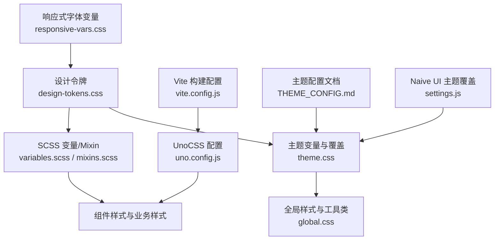
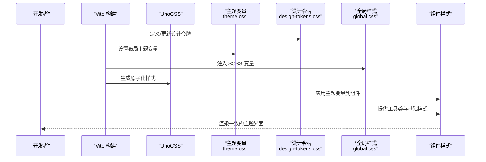
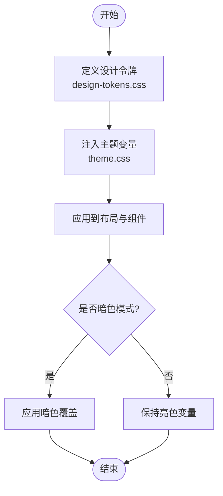
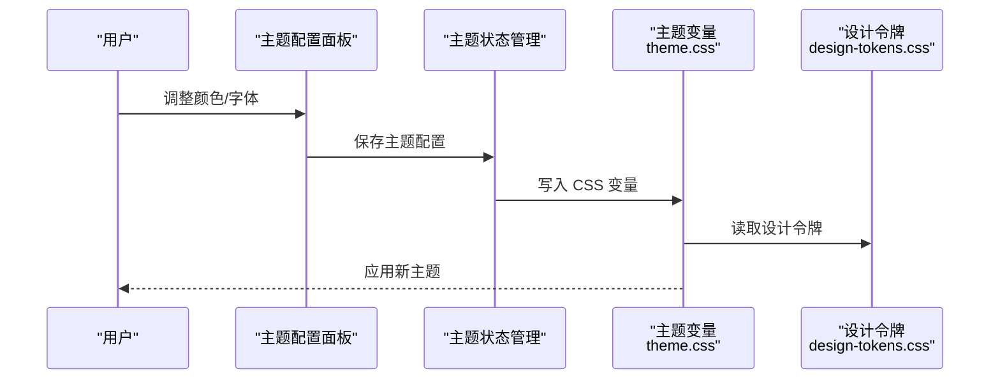
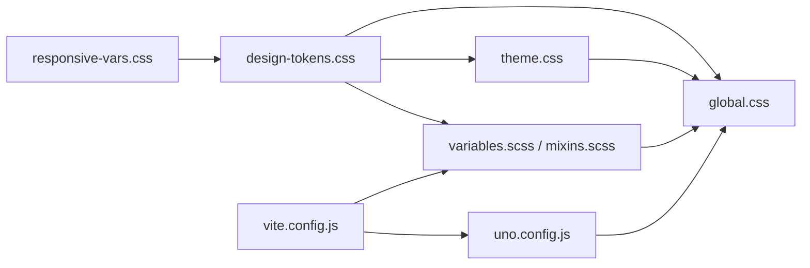

# 样式系统

<cite>
**本文引用的文件**
- [forge-admin-ui/src/styles/design-tokens.css](file://forge-admin-ui/src/styles/design-tokens.css)
- [forge-admin-ui/src/styles/theme.css](file://forge-admin-ui/src/styles/theme.css)
- [forge-admin-ui/src/styles/global.css](file://forge-admin-ui/src/styles/global.css)
- [forge-admin-ui/src/styles/responsive-vars.css](file://forge-admin-ui/src/styles/responsive-vars.css)
- [forge-admin-ui/src/styles/variables.scss](file://forge-admin-ui/src/styles/variables.scss)
- [forge-admin-ui/src/styles/mixins.scss](file://forge-admin-ui/src/styles/mixins.scss)
- [forge-admin-ui/src/styles/animations.css](file://forge-admin-ui/src/styles/animations.css)
- [forge-admin-ui/src/styles/reset.css](file://forge-admin-ui/src/styles/reset.css)
- [forge-admin-ui/vite.config.js](file://forge-admin-ui/vite.config.js)
- [forge-admin-ui/uno.config.js](file://forge-admin-ui/uno.config.js)
- [forge-admin-ui/docs/THEME_CONFIG.md](file://forge-admin-ui/docs/THEME_CONFIG.md)
- [forge-admin-ui/src/settings.js](file://forge-admin-ui/src/settings.js)
- [forge-admin-ui/DESIGN.md](file://forge-admin-ui/DESIGN.md)
</cite>

## 目录
1. [简介](#简介)
2. [项目结构](#项目结构)
3. [核心组件](#核心组件)
4. [架构总览](#架构总览)
5. [详细组件分析](#详细组件分析)
6. [依赖关系分析](#依赖关系分析)
7. [性能考量](#性能考量)
8. [故障排查指南](#故障排查指南)
9. [结论](#结论)
10. [附录](#附录)

## 简介
本技术文档系统性梳理 Forge Admin 的样式系统，围绕 CSS 变量设计、主题定制机制、SCSS 预处理器配置、响应式实现、CSS 模块化组织与性能优化展开。文档同时覆盖设计令牌（Design Tokens）定义与使用、全局样式覆盖策略、主题切换与暗色模式支持、品牌定制指南，以及样式开发最佳实践与常见问题解决方案。目标是帮助开发者在不深入源码细节的情况下，也能准确理解并高效扩展样式体系。

## 项目结构
Forge Admin 前端样式采用“设计令牌 + 运行时主题变量 + 组件级覆盖”的分层组织方式：
- 设计令牌集中定义在 CSS 变量中，提供颜色、间距、圆角、阴影、字体、动画、层级等基础语义化值。
- 运行时主题变量通过主题样式文件注入到布局相关区域（Header、顶部菜单、侧边菜单），并暴露为可被业务样式直接使用的 CSS 变量。
- 全局样式负责重置、通用工具类、滚动条、分页器、树控件精品化等跨页面能力。
- SCSS 变量与 Mixin 作为编译期增强，桥接设计令牌与组件样式。
- UnoCSS 提供原子化样式、图标与快捷类，配合 Vite 构建时自动导入与按需生成。
- 响应式字体缩放通过媒体查询动态调整根级字体缩放比例，从而驱动全量字号联动。

图表来源
- [forge-admin-ui/src/styles/design-tokens.css:1-317](file://forge-admin-ui/src/styles/design-tokens.css#L1-L317)
- [forge-admin-ui/src/styles/theme.css:1-200](file://forge-admin-ui/src/styles/theme.css#L1-L200)
- [forge-admin-ui/src/styles/global.css:1-120](file://forge-admin-ui/src/styles/global.css#L1-L120)
- [forge-admin-ui/src/styles/variables.scss:1-47](file://forge-admin-ui/src/styles/variables.scss#L1-L47)
- [forge-admin-ui/src/styles/mixins.scss:1-84](file://forge-admin-ui/src/styles/mixins.scss#L1-L84)
- [forge-admin-ui/uno.config.js:1-60](file://forge-admin-ui/uno.config.js#L1-L60)
- [forge-admin-ui/vite.config.js:110-118](file://forge-admin-ui/vite.config.js#L110-L118)
- [forge-admin-ui/src/styles/responsive-vars.css:1-64](file://forge-admin-ui/src/styles/responsive-vars.css#L1-L64)
- [forge-admin-ui/docs/THEME_CONFIG.md:1-272](file://forge-admin-ui/docs/THEME_CONFIG.md#L1-L272)
- [forge-admin-ui/src/settings.js:21-39](file://forge-admin-ui/src/settings.js#L21-L39)

章节来源
- [forge-admin-ui/src/styles/design-tokens.css:1-317](file://forge-admin-ui/src/styles/design-tokens.css#L1-L317)
- [forge-admin-ui/src/styles/theme.css:1-200](file://forge-admin-ui/src/styles/theme.css#L1-L200)
- [forge-admin-ui/src/styles/global.css:1-120](file://forge-admin-ui/src/styles/global.css#L1-L120)
- [forge-admin-ui/src/styles/variables.scss:1-47](file://forge-admin-ui/src/styles/variables.scss#L1-L47)
- [forge-admin-ui/src/styles/mixins.scss:1-84](file://forge-admin-ui/src/styles/mixins.scss#L1-L84)
- [forge-admin-ui/uno.config.js:1-60](file://forge-admin-ui/uno.config.js#L1-L60)
- [forge-admin-ui/vite.config.js:110-118](file://forge-admin-ui/vite.config.js#L110-L118)
- [forge-admin-ui/src/styles/responsive-vars.css:1-64](file://forge-admin-ui/src/styles/responsive-vars.css#L1-L64)
- [forge-admin-ui/docs/THEME_CONFIG.md:1-272](file://forge-admin-ui/docs/THEME_CONFIG.md#L1-L272)
- [forge-admin-ui/src/settings.js:21-39](file://forge-admin-ui/src/settings.js#L21-L39)

## 核心组件
- 设计令牌（Design Tokens）
  - 统一的颜色体系（主色、成功、警告、错误、信息、中性灰阶）、文字颜色、边框、背景、间距、圆角、阴影、字体、行高、动画时长、层级、布局尺寸与响应式断点。
  - 暗色模式与高对比度、减少动效等无障碍适配。
- 主题变量与覆盖
  - 将 Header、顶部菜单、侧边菜单的视觉属性抽象为 CSS 变量，并通过主题样式文件应用到具体组件节点。
  - 对 Naive UI 组件进行全局风格收敛（按钮、表格、标签、通知、消息、工具提示、分页器等）。
- 全局样式与工具类
  - 浏览器默认样式重置、自定义滚动条、通用工具类（玻璃态、卡片增强、输入框增强、文本截断、加载遮罩、悬浮提示、网格系统等）。
  - 页面级布局工具类（page-wrapper、page-header、page-card、page-content）。
  - 状态标签、表格操作列、表单区域、空状态、描述列表、Flex 辅助类等。
  - n-tree 精品化样式与暗色适配。
- SCSS 变量与 Mixin
  - 将设计令牌映射为 SCSS 变量，便于在 SCSS 中使用；提供常用 Mixin（清除浮动、文本省略、Flex 居中、绝对定位居中、响应式媒体查询）。
- UnoCSS 集成
  - 预设 Wind3、Attributify、Icons、RemToPx，统一图标前缀与尺寸，提供快捷类与主题色映射。
- 响应式字体缩放
  - 通过根级 --font-scale 随视口变化调整所有基于该比例的字号，实现全局字体缩放。
- 构建与预处理
  - Vite 配置中将 SCSS additionalData 注入全局变量文件，确保无需手动引入即可使用设计令牌。
  - 构建阶段关闭 sourcemap、使用 oxc 压缩 JS、esbuild 压缩 CSS，提升构建性能。

章节来源
- [forge-admin-ui/src/styles/design-tokens.css:1-317](file://forge-admin-ui/src/styles/design-tokens.css#L1-L317)
- [forge-admin-ui/src/styles/theme.css:1-200](file://forge-admin-ui/src/styles/theme.css#L1-L200)
- [forge-admin-ui/src/styles/global.css:1-120](file://forge-admin-ui/src/styles/global.css#L1-L120)
- [forge-admin-ui/src/styles/variables.scss:1-47](file://forge-admin-ui/src/styles/variables.scss#L1-L47)
- [forge-admin-ui/src/styles/mixins.scss:1-84](file://forge-admin-ui/src/styles/mixins.scss#L1-L84)
- [forge-admin-ui/uno.config.js:1-60](file://forge-admin-ui/uno.config.js#L1-L60)
- [forge-admin-ui/src/styles/responsive-vars.css:1-64](file://forge-admin-ui/src/styles/responsive-vars.css#L1-L64)
- [forge-admin-ui/vite.config.js:110-118](file://forge-admin-ui/vite.config.js#L110-L118)

## 架构总览
样式系统以“设计令牌”为单一事实源，通过 CSS 变量贯穿运行时主题、组件样式与全局样式。主题变量由主题样式文件注入，覆盖布局与第三方组件；全局样式提供基础能力与工具类；SCSS 变量与 Mixin 在编译期增强样式表达；UnoCSS 提供原子化能力与图标；Vite 构建配置保证预处理与性能。

图表来源
- [forge-admin-ui/src/styles/design-tokens.css:1-317](file://forge-admin-ui/src/styles/design-tokens.css#L1-L317)
- [forge-admin-ui/src/styles/theme.css:1-200](file://forge-admin-ui/src/styles/theme.css#L1-L200)
- [forge-admin-ui/src/styles/global.css:1-120](file://forge-admin-ui/src/styles/global.css#L1-L120)
- [forge-admin-ui/vite.config.js:110-118](file://forge-admin-ui/vite.config.js#L110-L118)
- [forge-admin-ui/uno.config.js:1-60](file://forge-admin-ui/uno.config.js#L1-L60)

## 详细组件分析

### 设计令牌与主题变量
- 设计令牌
  - 颜色系统：主色、成功、警告、错误、信息、中性灰阶，提供从 50 到 950 的完整色板。
  - 文字与边框：主/次/三级文字、禁用态、轻/默认/强调边框。
  - 背景：内容区、次要背景、页面背景、悬停背景。
  - 间距系统：基于 8px 网格，提供 space 系列与 spacing 别名。
  - 圆角：组件专用圆角（按钮、输入、卡片、模态、标签）。
  - 阴影：轻量阴影集合，组件专用阴影。
  - 字体：无衬线/等宽字体族、字号、字重、行高。
  - 动画：过渡时长、缓动曲线、页面过渡时长。
  - 层级：下拉、固定、模态、弹出、工具提示、通知等 z-index。
  - 布局：头部高度、侧边栏宽度、内容最大宽度、内容内边距、响应式断点。
  - 暗色模式：覆盖文字、边框、背景、阴影，保持可读性与层次。
  - 无障碍：高对比度模式、减少动效模式。
- 主题变量
  - 将 Header、顶部菜单、侧边菜单的视觉属性抽象为 CSS 变量，并在对应节点上应用。
  - 对 Naive UI 组件进行全局风格收敛，包括按钮、表格、标签、通知、消息、工具提示、分页器等。
  - 提供字体缩放因子 --font-scale，结合主题变量实现多端一致的排版。

图表来源
- [forge-admin-ui/src/styles/design-tokens.css:1-317](file://forge-admin-ui/src/styles/design-tokens.css#L1-L317)
- [forge-admin-ui/src/styles/theme.css:1-200](file://forge-admin-ui/src/styles/theme.css#L1-L200)

章节来源
- [forge-admin-ui/src/styles/design-tokens.css:1-317](file://forge-admin-ui/src/styles/design-tokens.css#L1-L317)
- [forge-admin-ui/src/styles/theme.css:1-200](file://forge-admin-ui/src/styles/theme.css#L1-L200)

### 全局样式与工具类
- 重置与基础
  - 浏览器默认样式重置，统一 box-sizing、border、line-height、字体族等。
- 滚动条
  - 自定义滚动条样式，区分水平/垂直滚动，暗色模式下适配。
- 工具类
  - 玻璃态、卡片增强、按钮增强、输入框增强、文本截断、加载遮罩、悬浮提示、网格系统、分隔线、徽章等。
- 页面级布局工具类
  - page-wrapper、page-header、page-card、page-content，提供标准页面骨架。
- 状态标签与表格操作列
  - 状态标签（success/warning/error/info/default）与表格操作链接（含危险/警告变体）。
- 表单区域与空状态
  - 表单分组标题、必填标记、空状态容器与文案。
- 描述列表与 Flex 辅助类
  - 描述列表网格、Flex 对齐与间距工具类。
- n-tree 精品化
  - 选中态、悬停态、缩进线、滚动条、暗色模式适配。

章节来源
- [forge-admin-ui/src/styles/reset.css:1-390](file://forge-admin-ui/src/styles/reset.css#L1-L390)
- [forge-admin-ui/src/styles/global.css:1-800](file://forge-admin-ui/src/styles/global.css#L1-L800)

### SCSS 预处理器与变量
- SCSS 变量
  - 将设计令牌映射为 SCSS 变量（主色、成功、警告、错误、文字、边框、背景、字号、圆角、阴影、间距、响应式断点）。
- SCSS Mixin
  - 提供清除浮动、文本省略、多行省略、Flex 居中、绝对定位居中、响应式媒体查询等常用 Mixin。
- Vite 注入
  - 通过 additionalData 将 variables.scss 注入所有 SCSS，避免重复 import。

章节来源
- [forge-admin-ui/src/styles/variables.scss:1-47](file://forge-admin-ui/src/styles/variables.scss#L1-L47)
- [forge-admin-ui/src/styles/mixins.scss:1-84](file://forge-admin-ui/src/styles/mixins.scss#L1-L84)
- [forge-admin-ui/vite.config.js:110-118](file://forge-admin-ui/vite.config.js#L110-L118)

### UnoCSS 与图标
- 预设与插件
  - Wind3、Attributify、Icons、RemToPx，统一图标前缀与尺寸。
- 快捷类与规则
  - 提供 wh-full、f-c-c、card-border、auto-bg、text-highlight 等快捷类，以及 card-shadow 规则。
- 主题色映射
  - primary 映射到 --primary-color，dark/light_border/dark_border 等用于暗色适配。

章节来源
- [forge-admin-ui/uno.config.js:1-60](file://forge-admin-ui/uno.config.js#L1-L60)

### 响应式设计
- 响应式字体缩放
  - 通过 --font-scale 在不同断点下调整基础字号，驱动全量字号联动。
- 响应式断点
  - 设计令牌中定义 sm/md/lg/xl/2xl 断点；SCSS 变量中也提供 xs~xxl 断点；Mixins 提供便捷媒体查询封装。
- 组件响应式
  - 分页器在小屏下自适应布局与字号；n-tree 在小屏下保持可用交互。

章节来源
- [forge-admin-ui/src/styles/responsive-vars.css:1-64](file://forge-admin-ui/src/styles/responsive-vars.css#L1-L64)
- [forge-admin-ui/src/styles/design-tokens.css:254-259](file://forge-admin-ui/src/styles/design-tokens.css#L254-L259)
- [forge-admin-ui/src/styles/variables.scss:40-47](file://forge-admin-ui/src/styles/variables.scss#L40-L47)
- [forge-admin-ui/src/styles/mixins.scss:46-84](file://forge-admin-ui/src/styles/mixins.scss#L46-L84)
- [forge-admin-ui/src/styles/theme.css:382-434](file://forge-admin-ui/src/styles/theme.css#L382-L434)

### 主题切换与暗色模式
- 主题配置系统
  - 提供可视化配置面板与代码配置两种方式，支持 Header、顶部菜单、侧边菜单的颜色与字体大小调整。
  - 预设主题与导出 JSON 配置，便于团队共享与版本控制。
  - 程序化 API 获取与更新主题配置。
- 暗色模式
  - 自动根据暗色模式切换相应主题配置；未定义暗色配置时回退到浅色配置。
  - 设计令牌中提供 .dark 覆盖，统一文字、边框、背景与阴影。
- Naive UI 主题覆盖
  - 通过 settings.js 中的 naiveThemeOverrides 覆盖主色、圆角、按钮样式等。

图表来源
- [forge-admin-ui/docs/THEME_CONFIG.md:1-272](file://forge-admin-ui/docs/THEME_CONFIG.md#L1-L272)
- [forge-admin-ui/src/styles/theme.css:1-200](file://forge-admin-ui/src/styles/theme.css#L1-L200)
- [forge-admin-ui/src/styles/design-tokens.css:1-317](file://forge-admin-ui/src/styles/design-tokens.css#L1-L317)
- [forge-admin-ui/src/settings.js:21-39](file://forge-admin-ui/src/settings.js#L21-L39)

章节来源
- [forge-admin-ui/docs/THEME_CONFIG.md:1-272](file://forge-admin-ui/docs/THEME_CONFIG.md#L1-L272)
- [forge-admin-ui/src/styles/theme.css:1-200](file://forge-admin-ui/src/styles/theme.css#L1-L200)
- [forge-admin-ui/src/styles/design-tokens.css:262-317](file://forge-admin-ui/src/styles/design-tokens.css#L262-L317)
- [forge-admin-ui/src/settings.js:21-39](file://forge-admin-ui/src/settings.js#L21-L39)

### 品牌定制指南
- 修改主色
  - 在设计令牌中调整主色系列（--primary-50..950），或通过主题变量覆盖 --primary-color。
- 调整圆角与阴影
  - 在设计令牌中调整圆角与阴影集合，或在主题样式中覆盖组件专用圆角与阴影。
- 调整字体与行高
  - 在设计令牌中调整字体族、字号、行高；通过 --font-scale 实现全局缩放。
- 调整布局尺寸
  - 在设计令牌中调整头部高度、侧边栏宽度、内容最大宽度与内边距。
- 品牌色与主题预设
  - 在主题配置中添加自定义预设，导出 JSON 供团队复用。

章节来源
- [forge-admin-ui/src/styles/design-tokens.css:1-317](file://forge-admin-ui/src/styles/design-tokens.css#L1-L317)
- [forge-admin-ui/src/styles/theme.css:1-200](file://forge-admin-ui/src/styles/theme.css#L1-L200)
- [forge-admin-ui/docs/THEME_CONFIG.md:213-272](file://forge-admin-ui/docs/THEME_CONFIG.md#L213-L272)

### 样式开发最佳实践
- 优先使用设计令牌与主题变量，避免硬编码颜色与尺寸。
- 使用 UnoCSS 快捷类与工具类，减少重复样式。
- 遵循设计规范中的颜色、文字与表面约束，保持信息密度与可读性。
- 合理使用响应式断点与字体缩放，确保多端一致性。
- 对第三方组件（如 Naive UI）进行全局风格收敛，避免局部样式破坏整体视觉。
- 使用 SCSS Mixin 简化常见样式逻辑，提高可维护性。
- 构建阶段关闭不必要的 sourcemap，使用高性能压缩器，提升构建效率。

章节来源
- [forge-admin-ui/DESIGN.md:16-32](file://forge-admin-ui/DESIGN.md#L16-L32)
- [forge-admin-ui/DESIGN.md:148-155](file://forge-admin-ui/DESIGN.md#L148-L155)
- [forge-admin-ui/vite.config.js:160-173](file://forge-admin-ui/vite.config.js#L160-L173)

### 常见问题与解决方案
- 主题变量未生效
  - 检查主题样式是否正确注入到对应节点；确认设计令牌已定义且未被覆盖。
- 暗色模式异常
  - 检查 .dark 覆盖是否正确；确认组件样式是否使用了设计令牌而非硬编码颜色。
- 响应式字体不缩放
  - 检查 responsive-vars.css 是否引入；确认 --font-scale 是否在媒体查询中正确设置。
- 第三方组件样式冲突
  - 使用全局主题覆盖；避免在组件内部使用 !important 覆盖。
- 构建体积过大
  - 检查 UnoCSS safelist 是否过大；优化图标集合；关闭不必要的插件。

章节来源
- [forge-admin-ui/src/styles/theme.css:1-200](file://forge-admin-ui/src/styles/theme.css#L1-L200)
- [forge-admin-ui/src/styles/design-tokens.css:262-317](file://forge-admin-ui/src/styles/design-tokens.css#L262-L317)
- [forge-admin-ui/src/styles/responsive-vars.css:1-64](file://forge-admin-ui/src/styles/responsive-vars.css#L1-L64)
- [forge-admin-ui/uno.config.js:1-60](file://forge-admin-ui/uno.config.js#L1-L60)

## 依赖关系分析
样式系统的依赖关系如下：
- design-tokens.css 是所有样式的基石，提供设计令牌。
- theme.css 依赖 design-tokens.css，注入主题变量并覆盖布局与组件。
- global.css 依赖 design-tokens.css 与 theme.css，提供全局样式与工具类。
- variables.scss 与 mixins.scss 依赖 design-tokens.css，提供编译期增强。
- uno.config.js 依赖设计令牌中的主题色，提供原子化样式与图标。
- vite.config.js 通过 additionalData 注入 SCSS 变量，并配置构建优化。
- responsive-vars.css 通过媒体查询调整 --font-scale，影响所有基于该变量的样式。

图表来源
- [forge-admin-ui/src/styles/design-tokens.css:1-317](file://forge-admin-ui/src/styles/design-tokens.css#L1-L317)
- [forge-admin-ui/src/styles/theme.css:1-200](file://forge-admin-ui/src/styles/theme.css#L1-L200)
- [forge-admin-ui/src/styles/global.css:1-120](file://forge-admin-ui/src/styles/global.css#L1-L120)
- [forge-admin-ui/src/styles/variables.scss:1-47](file://forge-admin-ui/src/styles/variables.scss#L1-L47)
- [forge-admin-ui/src/styles/mixins.scss:1-84](file://forge-admin-ui/src/styles/mixins.scss#L1-L84)
- [forge-admin-ui/uno.config.js:1-60](file://forge-admin-ui/uno.config.js#L1-L60)
- [forge-admin-ui/vite.config.js:110-118](file://forge-admin-ui/vite.config.js#L110-L118)
- [forge-admin-ui/src/styles/responsive-vars.css:1-64](file://forge-admin-ui/src/styles/responsive-vars.css#L1-L64)

章节来源
- [forge-admin-ui/src/styles/design-tokens.css:1-317](file://forge-admin-ui/src/styles/design-tokens.css#L1-L317)
- [forge-admin-ui/src/styles/theme.css:1-200](file://forge-admin-ui/src/styles/theme.css#L1-L200)
- [forge-admin-ui/src/styles/global.css:1-120](file://forge-admin-ui/src/styles/global.css#L1-L120)
- [forge-admin-ui/src/styles/variables.scss:1-47](file://forge-admin-ui/src/styles/variables.scss#L1-L47)
- [forge-admin-ui/src/styles/mixins.scss:1-84](file://forge-admin-ui/src/styles/mixins.scss#L1-L84)
- [forge-admin-ui/uno.config.js:1-60](file://forge-admin-ui/uno.config.js#L1-L60)
- [forge-admin-ui/vite.config.js:110-118](file://forge-admin-ui/vite.config.js#L110-L118)
- [forge-admin-ui/src/styles/responsive-vars.css:1-64](file://forge-admin-ui/src/styles/responsive-vars.css#L1-L64)

## 性能考量
- 构建优化
  - 关闭 sourcemap，降低内存占用。
  - 使用 oxc 压缩 JS，esbuild 压缩 CSS，提升构建速度。
  - 关闭 gzip 体积上报，进一步降低构建内存。
- 样式优化
  - 使用 UnoCSS 按需生成样式，减少冗余。
  - 避免过度使用 !important，优先通过作用域与优先级控制。
  - 合理使用动画与过渡，遵循减少动效模式。
- 运行时优化
  - 使用 CSS 变量替代 JavaScript 计算样式，减少重排重绘。
  - 避免在高频交互路径中进行复杂样式计算。

章节来源
- [forge-admin-ui/vite.config.js:160-173](file://forge-admin-ui/vite.config.js#L160-L173)
- [forge-admin-ui/uno.config.js:1-60](file://forge-admin-ui/uno.config.js#L1-L60)
- [forge-admin-ui/src/styles/animations.css:427-443](file://forge-admin-ui/src/styles/animations.css#L427-L443)

## 故障排查指南
- 主题变量未生效
  - 检查主题样式是否正确注入到对应节点；确认设计令牌已定义且未被覆盖。
- 暗色模式异常
  - 检查 .dark 覆盖是否正确；确认组件样式是否使用了设计令牌而非硬编码颜色。
- 响应式字体不缩放
  - 检查 responsive-vars.css 是否引入；确认 --font-scale 是否在媒体查询中正确设置。
- 第三方组件样式冲突
  - 使用全局主题覆盖；避免在组件内部使用 !important 覆盖。
- 构建体积过大
  - 检查 UnoCSS safelist 是否过大；优化图标集合；关闭不必要的插件。

章节来源
- [forge-admin-ui/src/styles/theme.css:1-200](file://forge-admin-ui/src/styles/theme.css#L1-L200)
- [forge-admin-ui/src/styles/design-tokens.css:262-317](file://forge-admin-ui/src/styles/design-tokens.css#L262-L317)
- [forge-admin-ui/src/styles/responsive-vars.css:1-64](file://forge-admin-ui/src/styles/responsive-vars.css#L1-L64)
- [forge-admin-ui/uno.config.js:1-60](file://forge-admin-ui/uno.config.js#L1-L60)

## 结论
Forge Admin 的样式系统以设计令牌为核心，通过 CSS 变量实现主题定制与运行时切换，结合 SCSS 预处理器与 UnoCSS 原子化能力，提供了高效、可维护、可扩展的样式架构。全局样式与工具类确保了基础能力的一致性，响应式设计与无障碍适配提升了用户体验。通过合理的构建优化与样式优化，系统在性能与可维护性之间取得了良好平衡。建议在实际开发中严格遵循设计规范与最佳实践，持续迭代与完善样式体系。

## 附录
- 设计规范参考
  - 颜色、文字与表面约束，页面边界与工作台规范，公共组件约束，CRUD 列规范，工具栏与操作规范，树与菜单性能要求，加载/空态/错误/动效规范，系统页面约束，流程/资产卡片列表规范，禁止项与交付检查。
- 主题配置使用
  - 可视化配置、代码配置、预设主题、程序化使用、暗色模式支持、CSS 变量使用、最佳实践与示例。

章节来源
- [forge-admin-ui/DESIGN.md:1-277](file://forge-admin-ui/DESIGN.md#L1-L277)
- [forge-admin-ui/docs/THEME_CONFIG.md:1-272](file://forge-admin-ui/docs/THEME_CONFIG.md#L1-L272)