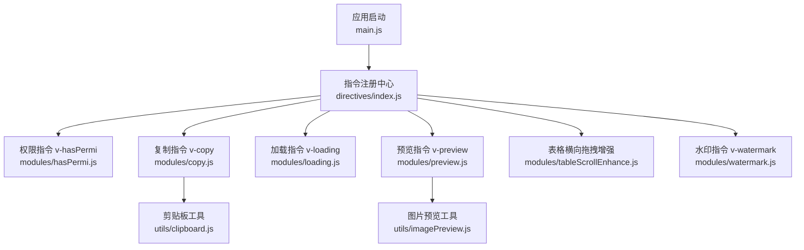
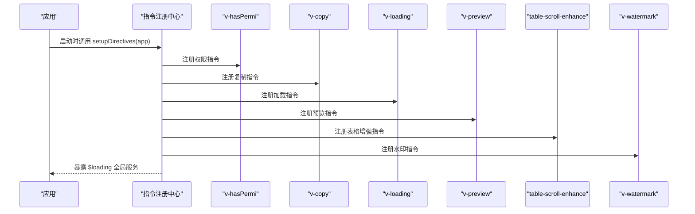
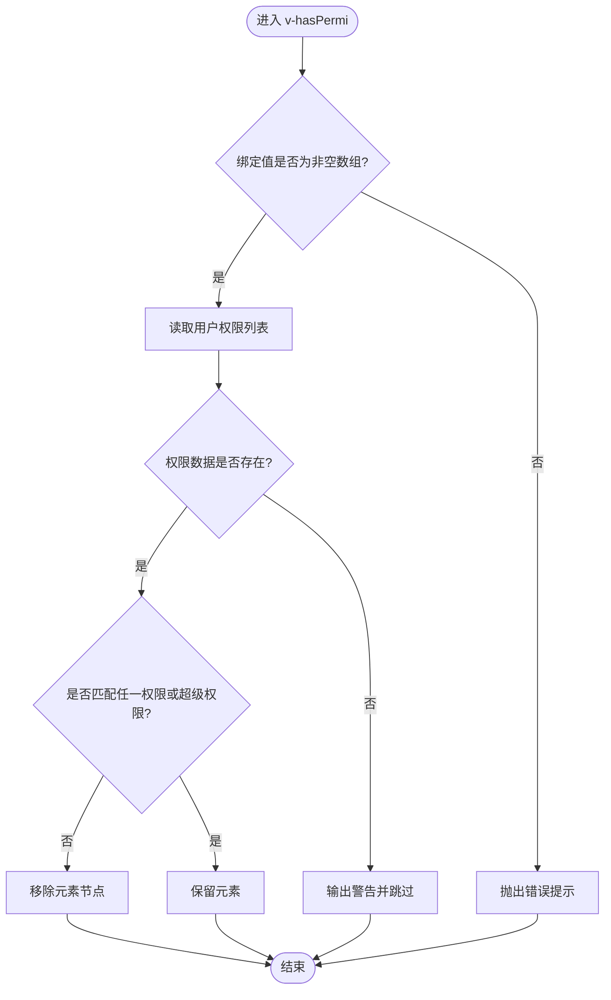
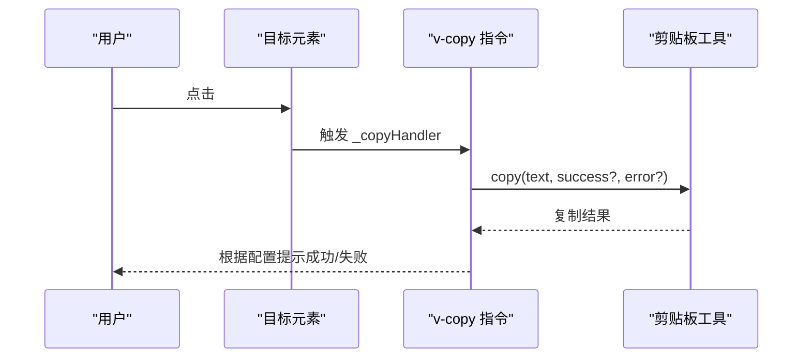
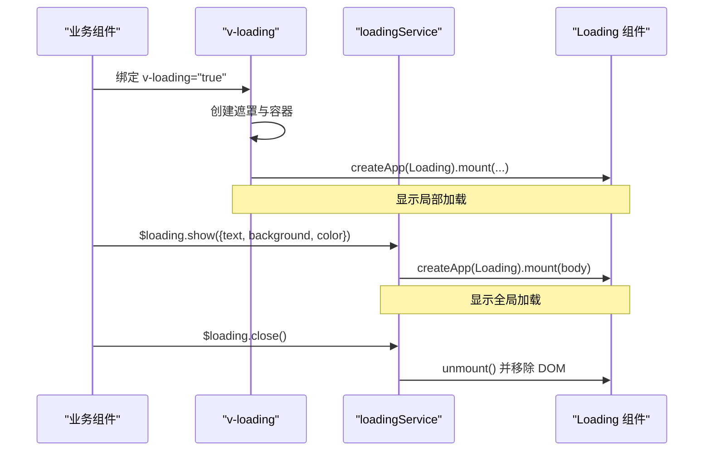
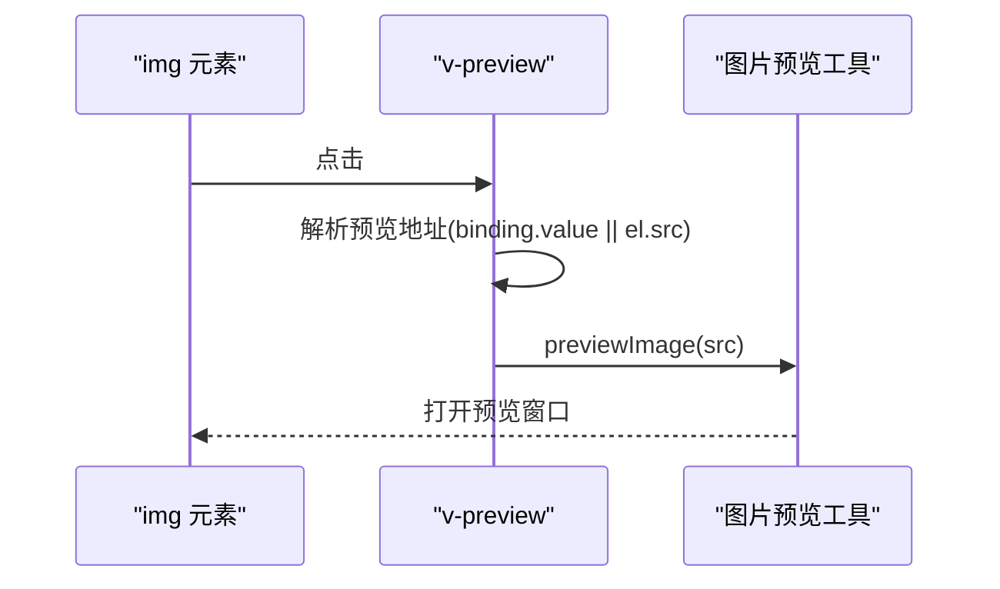
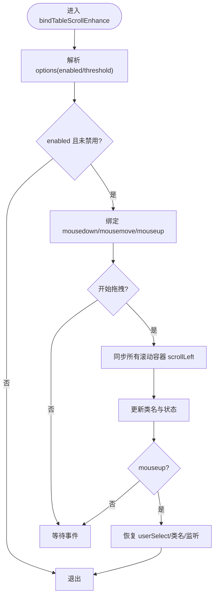
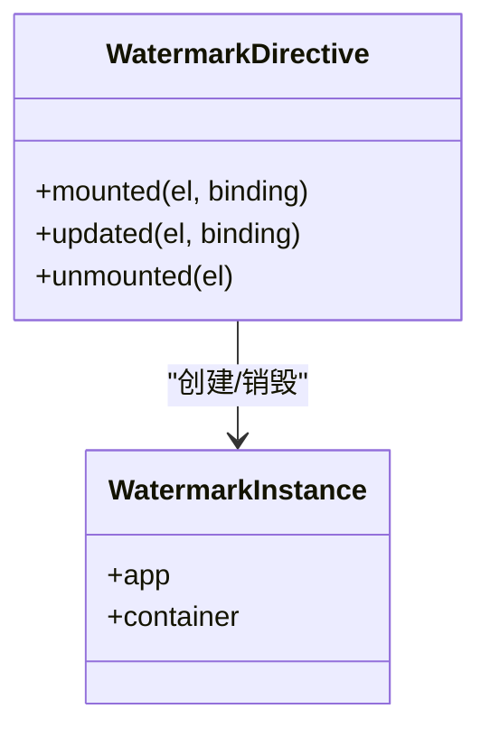
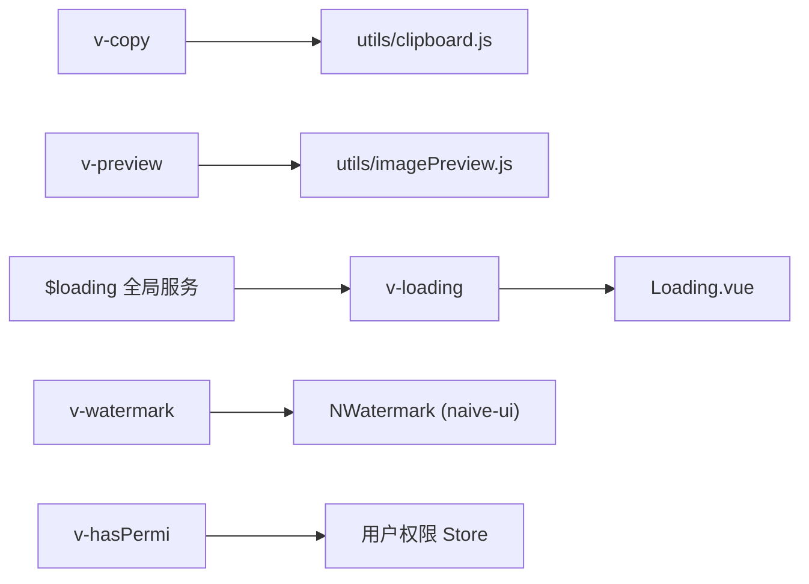

# 自定义指令

<cite>
**本文引用的文件**
- [main.js](file://forge-admin-ui/src/main.js)
- [index.js](file://forge-admin-ui/src/directives/index.js)
- [hasPermi.js](file://forge-admin-ui/src/directives/modules/hasPermi.js)
- [copy.js](file://forge-admin-ui/src/directives/modules/copy.js)
- [loading.js](file://forge-admin-ui/src/directives/modules/loading.js)
- [preview.js](file://forge-admin-ui/src/directives/modules/preview.js)
- [tableScrollEnhance.js](file://forge-admin-ui/src/directives/modules/tableScrollEnhance.js)
- [watermark.js](file://forge-admin-ui/src/directives/modules/watermark.js)
- [clipboard.js](file://forge-admin-ui/src/utils/clipboard.js)
- [imagePreview.js](file://forge-admin-ui/src/utils/imagePreview.js)
</cite>

## 目录
1. [简介](#简介)
2. [项目结构](#项目结构)
3. [核心组件](#核心组件)
4. [架构总览](#架构总览)
5. [详细组件分析](#详细组件分析)
6. [依赖关系分析](#依赖关系分析)
7. [性能考量](#性能考量)
8. [故障排查指南](#故障排查指南)
9. [结论](#结论)
10. [附录](#附录)

## 简介
本技术文档聚焦于 Forge Admin 前端（Vue 3）中的自定义指令体系，围绕权限控制、表单与交互增强、全局加载与水印等能力，系统阐述在组合式 API 环境下的指令实现模式、生命周期管理、参数绑定、事件处理与 DOM 操作最佳实践。同时提供指令注册机制、全局配置方式、测试方法与开发规范、性能优化与调试技巧，帮助开发者高效扩展与维护指令集。

## 项目结构
Forge Admin 的指令集中在 forge-admin-ui/src/directives 目录下，采用“集中注册 + 模块化实现”的组织方式：
- 入口注册：通过 setupDirectives 统一挂载到 Vue 应用实例，并暴露 loading 服务至全局属性。
- 模块划分：每个指令独立为 modules 下的一个文件，职责单一、易于测试与维护。
- 工具依赖：复制与图片预览分别依赖 clipboard 与 imagePreview 工具模块。
- 应用启动：在 main.js 中初始化 Store、Naive UI 离散 API、主题后调用 setupDirectives，确保指令可用时机正确。

图表来源
- [main.js:20-50](file://forge-admin-ui/src/main.js#L20-L50)
- [index.js:20-38](file://forge-admin-ui/src/directives/index.js#L20-L38)

章节来源
- [main.js:20-50](file://forge-admin-ui/src/main.js#L20-L50)
- [index.js:1-42](file://forge-admin-ui/src/directives/index.js#L1-L42)

## 核心组件
- 指令注册中心（setupDirectives）
  - 负责将各指令以 app.directive 形式挂载到应用实例。
  - 将 loadingService 注入到 app.config.globalProperties.$loading，供任意位置调用。
  - 触发表格横向拖拽增强的全局扫描，自动增强页面中的表格容器。
- 权限指令 v-hasPermi
  - 基于用户 store 的权限数据判断元素是否显示或移除。
  - 支持数组形式的权限码集合，包含超级权限标记时直接放行。
- 复制指令 v-copy
  - 点击触发复制，支持字符串或对象配置（文本、成功/失败提示）。
  - 在 updated 中更新处理器，在 unmounted 中清理事件监听。
- 加载指令 v-loading
  - 局部遮罩：为指定元素创建绝对定位遮罩层，挂载 Loading 组件。
  - 全局加载：通过 loadingService.show/close 在全局 body 上挂载全屏 Loading。
- 预览指令 v-preview
  - 为 img 元素添加点击预览能力，优先使用指令绑定的大图地址。
- 表格横向拖拽增强 table-scroll-enhance
  - 在表格区域按住鼠标拖动实现横向滚动，避免误触交互元素。
  - 同步表头与多滚动容器的 scrollLeft，保持视觉一致。
  - 提供全局自动增强能力，动态插入的表格也能被扫描并增强。
- 水印指令 v-watermark
  - 为任意容器叠加 Naive UI 的水印组件，支持文本/图片、样式与布局配置。
  - 使用 WeakMap 管理实例，updated 时按需重建，unmounted 时销毁。

章节来源
- [index.js:9-38](file://forge-admin-ui/src/directives/index.js#L9-L38)
- [hasPermi.js:1-43](file://forge-admin-ui/src/directives/modules/hasPermi.js#L1-L43)
- [copy.js:1-73](file://forge-admin-ui/src/directives/modules/copy.js#L1-L73)
- [loading.js:1-136](file://forge-admin-ui/src/directives/modules/loading.js#L1-L136)
- [preview.js:1-69](file://forge-admin-ui/src/directives/modules/preview.js#L1-L69)
- [tableScrollEnhance.js:1-415](file://forge-admin-ui/src/directives/modules/tableScrollEnhance.js#L1-L415)
- [watermark.js:1-130](file://forge-admin-ui/src/directives/modules/watermark.js#L1-L130)

## 架构总览
指令体系遵循“低耦合、高内聚”的设计原则：
- 指令与业务逻辑解耦：仅关注 DOM 行为与轻量状态，复杂逻辑下沉到工具函数或组件。
- 统一的注册入口：便于集中管理与扩展，避免分散引入导致遗漏。
- 全局能力可插拔：如 loading 服务与表格增强，既可作为指令使用，也可作为全局 API 调用。
- 生命周期严谨：mounted/updated/unmounted 三阶段清晰分工，确保资源及时释放。

图表来源
- [index.js:20-38](file://forge-admin-ui/src/directives/index.js#L20-L38)
- [main.js:28-35](file://forge-admin-ui/src/main.js#L28-L35)

## 详细组件分析

### 权限控制指令 v-hasPermi
- 实现要点
  - 从用户 store 获取权限列表，若为空则跳过检查以避免初始化误删。
  - 支持数组形式的权限码集合，包含超级权限标记时直接放行。
  - 无权限时移除元素节点；updated 时重新校验，保证动态权限变化生效。
- 生命周期
  - mounted：首次渲染时执行权限判定。
  - updated：当绑定值变化时再次判定。
- 最佳实践
  - 建议在路由或页面级预加载权限数据，减少未就绪时的警告。
  - 对按钮等关键操作元素使用此指令，避免越权展示。

图表来源
- [hasPermi.js:7-42](file://forge-admin-ui/src/directives/modules/hasPermi.js#L7-L42)

章节来源
- [hasPermi.js:1-43](file://forge-admin-ui/src/directives/modules/hasPermi.js#L1-L43)

### 复制指令 v-copy
- 实现要点
  - 支持字符串或对象配置，内部调用剪贴板工具完成复制。
  - 在 updated 中替换事件处理器，避免重复绑定。
  - 在 unmounted 中移除事件监听，防止内存泄漏。
- 事件处理
  - 点击触发复制，必要时可传入成功/失败回调文案。
- 最佳实践
  - 对于频繁更新的绑定值，建议合并更新或使用防抖策略减少重绑。
  - 在非可点击元素上使用需自行设置 cursor:pointer 提升体验。

图表来源
- [copy.js:9-69](file://forge-admin-ui/src/directives/modules/copy.js#L9-L69)
- [clipboard.js](file://forge-admin-ui/src/utils/clipboard.js)

章节来源
- [copy.js:1-73](file://forge-admin-ui/src/directives/modules/copy.js#L1-L73)

### 加载指令 v-loading
- 实现要点
  - 局部加载：为目标元素创建遮罩层，挂载 Loading 组件，支持文本、背景色、字体大小等配置。
  - 全局加载：通过 loadingService.show/close 在 body 上挂载全屏 Loading，并锁定页面滚动。
  - 生命周期：mounted 创建遮罩与实例，updated 根据布尔值切换显示，unmounted 清理实例与 DOM。
- 最佳实践
  - 异步请求前后成对调用 show/close，避免遮挡残留。
  - 对频繁开关的场景，注意复用实例以减少开销。

图表来源
- [loading.js:8-49](file://forge-admin-ui/src/directives/modules/loading.js#L8-L49)
- [loading.js:52-136](file://forge-admin-ui/src/directives/modules/loading.js#L52-L136)

章节来源
- [loading.js:1-136](file://forge-admin-ui/src/directives/modules/loading.js#L1-L136)

### 预览指令 v-preview
- 实现要点
  - 仅作用于 img 元素，点击后调用图片预览工具打开大图。
  - 优先使用指令绑定的大图地址，否则回退到元素的 src。
  - 在 updated 中更新处理器，在 unmounted 中清理事件。
- 最佳实践
  - 缩略图与大图分离时，务必提供大图地址以获得更好体验。
  - 对懒加载图片，确保预览前已加载完成或提供占位。

图表来源
- [preview.js:11-66](file://forge-admin-ui/src/directives/modules/preview.js#L11-L66)
- [imagePreview.js](file://forge-admin-ui/src/utils/imagePreview.js)

章节来源
- [preview.js:1-69](file://forge-admin-ui/src/directives/modules/preview.js#L1-L69)

### 表格横向拖拽增强 table-scroll-enhance
- 实现要点
  - 选择器过滤：排除交互元素与可选内容区域，避免误拦截。
  - 滚动容器识别：优先查找表格主体与滚动容器，支持多容器同步。
  - 拖拽逻辑：mousedown/mousemove/mouseup 捕获拖拽，阈值控制移动起始，阻止默认选择与点击。
  - 同步策略：收集所有相关容器，同步 scrollLeft 并派发 scroll 事件，保证表头与内容一致。
  - 全局增强：MutationObserver 监听 DOM 变化，自动扫描新增表格并增强。
- 配置项
  - enabled：是否启用增强。
  - threshold：触发拖拽的最小移动像素。
- 最佳实践
  - 对需要禁用增强的表格，可通过 data-table-drag-scroll="disabled" 关闭。
  - 在复杂嵌套表格场景中，确保容器选择器覆盖实际滚动节点。

图表来源
- [tableScrollEnhance.js:54-65](file://forge-admin-ui/src/directives/modules/tableScrollEnhance.js#L54-L65)
- [tableScrollEnhance.js:256-355](file://forge-admin-ui/src/directives/modules/tableScrollEnhance.js#L256-L355)
- [tableScrollEnhance.js:380-395](file://forge-admin-ui/src/directives/modules/tableScrollEnhance.js#L380-L395)

章节来源
- [tableScrollEnhance.js:1-415](file://forge-admin-ui/src/directives/modules/tableScrollEnhance.js#L1-L415)

### 水印指令 v-watermark
- 实现要点
  - 使用 Naive UI 的 NWatermark 组件，通过 createApp 挂载到目标元素内的容器。
  - 支持字符串或对象配置，包括内容、图片、字号、颜色、间距、旋转角度、zIndex 等。
  - 使用 WeakMap 存储实例，updated 时对比旧值决定是否重建，unmounted 时卸载并移除 DOM。
- 最佳实践
  - 对大段长内容，合理设置宽高与间距，避免性能抖动。
  - 如需禁止选中水印文字，设置 selectable=false。

图表来源
- [watermark.js:16-97](file://forge-admin-ui/src/directives/modules/watermark.js#L16-L97)
- [watermark.js:114-129](file://forge-admin-ui/src/directives/modules/watermark.js#L114-L129)

章节来源
- [watermark.js:1-130](file://forge-admin-ui/src/directives/modules/watermark.js#L1-L130)

## 依赖关系分析
- 指令与工具
  - v-copy 依赖剪贴板工具进行跨浏览器复制。
  - v-preview 依赖图片预览工具打开大图。
  - v-loading 与 v-watermark 均通过 createApp 挂载子应用，体现指令与组件的协作。
- 指令与全局
  - loadingService 通过全局属性暴露，可在任意组件/指令中调用。
  - 表格增强提供全局扫描能力，减少对显式绑定的依赖。
- 指令与 Store
  - v-hasPermi 依赖用户权限 store，需在页面初始化时确保数据就绪。

图表来源
- [copy.js:1-73](file://forge-admin-ui/src/directives/modules/copy.js#L1-L73)
- [preview.js:1-69](file://forge-admin-ui/src/directives/modules/preview.js#L1-L69)
- [loading.js:1-136](file://forge-admin-ui/src/directives/modules/loading.js#L1-L136)
- [watermark.js:1-130](file://forge-admin-ui/src/directives/modules/watermark.js#L1-L130)
- [hasPermi.js:1-43](file://forge-admin-ui/src/directives/modules/hasPermi.js#L1-L43)

章节来源
- [index.js:20-38](file://forge-admin-ui/src/directives/index.js#L20-L38)

## 性能考量
- 事件监听与内存管理
  - 所有指令在 unmounted 中移除事件监听与 DOM 引用，避免内存泄漏。
  - 使用 WeakMap/WeakSet 存储实例与增强标记，降低强引用带来的垃圾回收压力。
- 渲染与更新
  - v-loading 与 v-watermark 仅在值变化时重建实例，减少不必要的卸载与挂载。
  - 表格增强通过阈值与防抖刷新，避免高频 scroll 导致的抖动。
- 全局扫描
  - 表格增强使用 MutationObserver 与定时器合并扫描，降低 DOM 查询成本。
- 建议
  - 对大量元素使用 v-copy/v-preview 时，考虑批量绑定与事件委托。
  - 对频繁开关的 v-loading，尽量复用实例或合并请求。

[本节为通用性能指导，不直接分析具体文件]

## 故障排查指南
- 权限指令无效
  - 现象：元素未被移除或一直隐藏。
  - 排查：确认用户权限数据已加载；检查权限码是否与后端返回一致；留意控制台关于权限数据未加载的警告。
  - 参考路径：[hasPermi.js:17-23](file://forge-admin-ui/src/directives/modules/hasPermi.js#L17-L23)
- 复制失败
  - 现象：点击无响应或提示失败。
  - 排查：确认绑定值存在；检查剪贴板权限与安全策略；核对 success/error 文案是否正确传递。
  - 参考路径：[copy.js:12-28](file://forge-admin-ui/src/directives/modules/copy.js#L12-L28)
- 加载遮罩异常
  - 现象：遮罩未显示或无法关闭。
  - 排查：确认元素定位上下文（relative/absolute/fixed）；检查 loadingService 的 show/close 是否成对调用；查看 unmounted 是否清理实例。
  - 参考路径：[loading.js:52-104](file://forge-admin-ui/src/directives/modules/loading.js#L52-L104)
- 图片预览无效果
  - 现象：点击图片不弹出预览。
  - 排查：确认元素为 img；检查绑定值或 src 是否为有效 URL；确认预览工具可用。
  - 参考路径：[preview.js:12-30](file://forge-admin-ui/src/directives/modules/preview.js#L12-L30)
- 表格拖拽不生效
  - 现象：无法拖拽滚动或误触交互。
  - 排查：确认目标为表格容器；检查是否被 data-table-drag-scroll="disabled" 禁用；验证滚动容器选择器是否命中。
  - 参考路径：[tableScrollEnhance.js:120-137](file://forge-admin-ui/src/directives/modules/tableScrollEnhance.js#L120-L137)
- 水印不显示或遮挡
  - 现象：水印未出现或层级不当。
  - 排查：确认元素有定位上下文；检查 zIndex 与 pointer-events；核对配置项是否正确。
  - 参考路径：[watermark.js:50-68](file://forge-admin-ui/src/directives/modules/watermark.js#L50-L68)

章节来源
- [hasPermi.js:17-23](file://forge-admin-ui/src/directives/modules/hasPermi.js#L17-L23)
- [copy.js:12-28](file://forge-admin-ui/src/directives/modules/copy.js#L12-L28)
- [loading.js:52-104](file://forge-admin-ui/src/directives/modules/loading.js#L52-L104)
- [preview.js:12-30](file://forge-admin-ui/src/directives/modules/preview.js#L12-L30)
- [tableScrollEnhance.js:120-137](file://forge-admin-ui/src/directives/modules/tableScrollEnhance.js#L120-L137)
- [watermark.js:50-68](file://forge-admin-ui/src/directives/modules/watermark.js#L50-L68)

## 结论
Forge Admin 的自定义指令体系以清晰的职责划分与严格的生命周期管理为基础，提供了权限控制、交互增强与全局加载等常用能力。通过集中注册、工具解耦与全局 API 暴露，实现了高内聚、低耦合的可维护架构。结合本文提供的开发规范、性能优化与调试方法，团队可快速扩展新指令并保持整体质量与一致性。

[本节为总结性内容，不直接分析具体文件]

## 附录

### 指令开发规范
- 命名与组织
  - 指令文件按功能拆分至 modules，统一由 index.js 注册。
  - 指令名称使用短横线分隔（如 table-scroll-enhance），避免冲突。
- 生命周期
  - mounted：初始化 DOM、绑定事件、创建实例。
  - updated：比较 oldValue 与 value，增量更新。
  - unmounted：移除事件监听、卸载实例、清理 DOM。
- 参数绑定
  - 支持字符串与对象两种形式，统一在指令内部解析。
  - 对布尔开关型指令，提供 enabled 等明确选项。
- 事件处理
  - 使用 addEventListener/removeEventListener 成对管理。
  - 对高频事件（scroll/mousemove）使用 passive 或节流/防抖。
- DOM 操作
  - 避免直接修改框架管理的节点；必要时使用 createApp 挂载子应用。
  - 对遮罩/水印等覆盖层，确保正确的定位上下文与 z-index。
- 错误处理
  - 对缺失参数、非法类型进行防御性检查并给出警告。
  - 对异步操作（如复制、预览）提供成功/失败回调或提示。

[本节为通用规范，不直接分析具体文件]

### 指令测试方法
- 单元测试
  - 针对指令内部纯函数（如 resolveOptions、isInteractiveTarget）编写用例，断言输入输出。
  - 使用虚拟 DOM 或 jsdom 模拟 DOM 环境，验证事件绑定与移除。
- 集成测试
  - 在组件中使用指令，断言渲染结果与行为（如元素移除、遮罩显示）。
  - 模拟用户交互（点击、拖拽），验证副作用（如 scrollLeft 同步）。
- 回归测试
  - 对表格增强等复杂场景，录制关键用例，确保后续改动不影响行为。
- 建议
  - 为每个指令建立独立的测试文件，覆盖正常路径与边界条件。
  - 对全局能力（如 loadingService、全局表格增强）提供隔离测试。

[本节为通用测试指导，不直接分析具体文件]

### 性能优化技巧
- 减少重排重绘
  - 批量更新样式与 DOM，避免逐条修改。
  - 对高频更新使用 requestAnimationFrame 或节流。
- 事件优化
  - 使用事件委托减少监听器数量。
  - 对滚动与鼠标事件使用 passive 提升滚动性能。
- 实例管理
  - 使用 WeakMap/WeakSet 存储实例与标记，避免强引用。
  - 在 updated 中对比 oldValue，避免重复创建。
- 全局扫描
  - 合并多次 DOM 变更，使用 MutationObserver 与定时器调度。

[本节为通用优化指导，不直接分析具体文件]

### 调试技巧
- 控制台日志
  - 在指令的关键分支输出必要信息（如参数、状态），便于定位问题。
  - 对权限未就绪、复制失败等场景输出友好提示。
- 断点调试
  - 在 mounted/updated/unmounted 中设置断点，观察生命周期顺序与参数变化。
  - 对事件处理器（click/mousemove）设置断点，验证触发时机。
- 可视化辅助
  - 对表格增强，临时打印滚动容器列表与 scrollLeft，验证同步逻辑。
  - 对水印与加载遮罩，检查 computedStyle 与 DOM 树结构。
- 工具链
  - 使用浏览器开发者工具的 Performance 面板分析卡顿与重排。
  - 使用 Memory 面板检测内存泄漏（事件监听器、实例未清理）。

[本节为通用调试指导，不直接分析具体文件]