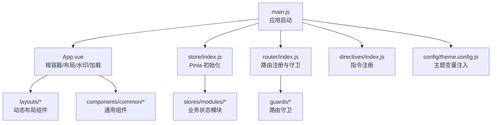
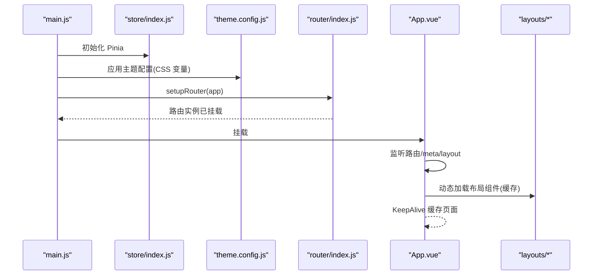
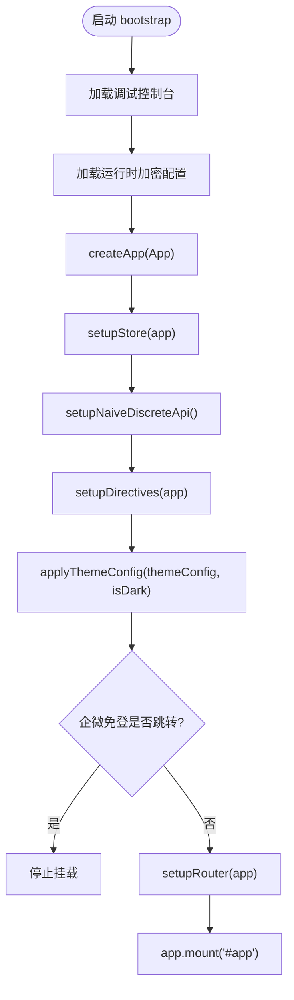
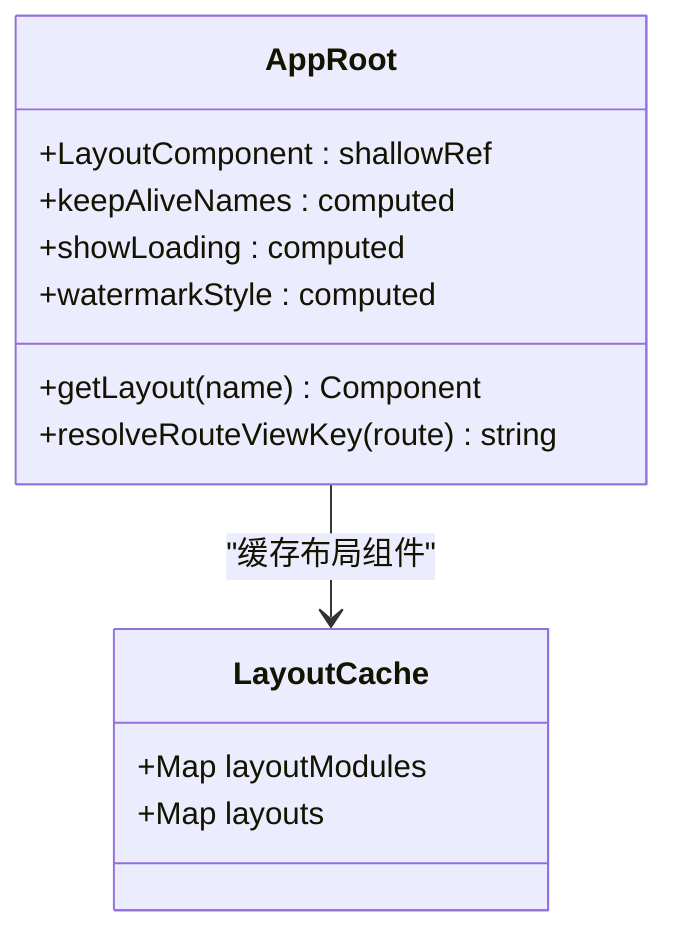
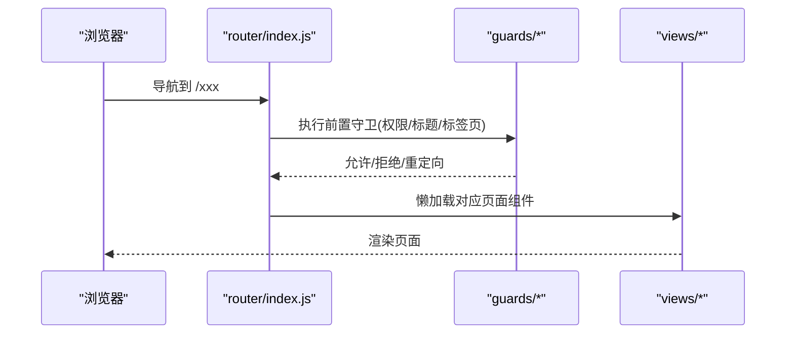
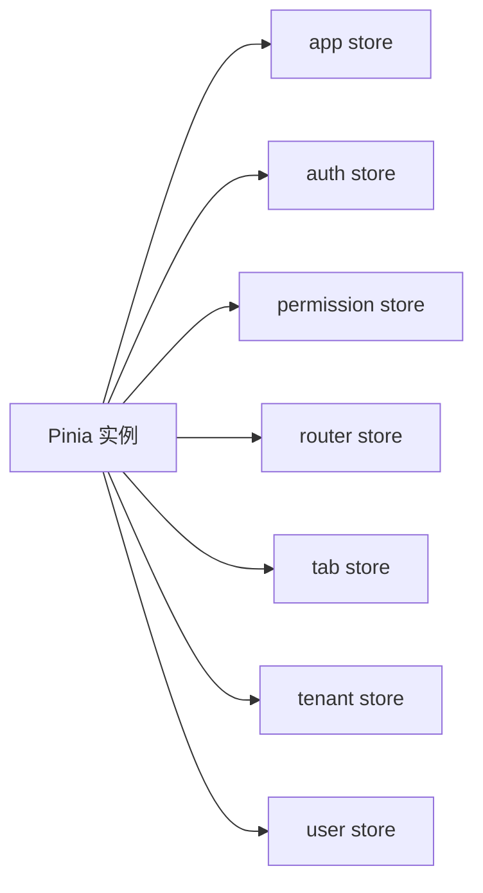
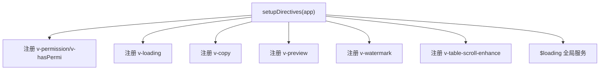
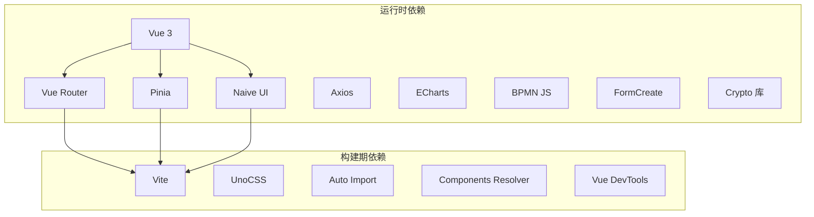

# 前端架构

<cite>
**本文引用的文件**
- [main.js](file://forge-admin-ui/src/main.js)
- [App.vue](file://forge-admin-ui/src/App.vue)
- [package.json](file://forge-admin-ui/package.json)
- [vite.config.js](file://forge-admin-ui/vite.config.js)
- [router/index.js](file://forge-admin-ui/src/router/index.js)
- [store/index.js](file://forge-admin-ui/src/store/index.js)
- [settings.js](file://forge-admin-ui/src/settings.js)
- [theme.config.js](file://forge-admin-ui/src/config/theme.config.js)
- [directives/index.js](file://forge-admin-ui/src/directives/index.js)
- [composables/index.js](file://forge-admin-ui/src/composables/index.js)
</cite>

## 目录
1. [简介](#简介)
2. [项目结构](#项目结构)
3. [核心组件](#核心组件)
4. [架构总览](#架构总览)
5. [详细组件分析](#详细组件分析)
6. [依赖分析](#依赖分析)
7. [性能考虑](#性能考虑)
8. [故障排查指南](#故障排查指南)
9. [结论](#结论)
10. [附录](#附录)

## 简介
本技术文档面向 Forge Admin 前端（Vue 3 + Vite + Pinia + Naive UI）的架构与实现，覆盖应用初始化、路由系统、状态管理、组合式函数、自定义指令、API 客户端封装、HTTP 请求处理、响应式设计、主题定制、国际化与性能优化等。文档以代码级为依据，提供可视化图表与最佳实践建议，帮助开发者快速理解并高效扩展系统。

## 项目结构
Forge Admin 前端采用模块化组织：
- 入口与装配：main.js 负责创建应用、安装插件、初始化 Store、主题、路由与全局能力；App.vue 作为根容器，统一布局、水印、加载态与主题切换。
- 构建与工具链：vite.config.js 集成 Vue Router 自动路由、UnoCSS、按需导入、组件自动注册、代理与构建优化。
- 路由：src/router/index.js 定义手动路由与自动路由合并策略，并提供 setupRouter 挂载到应用。
- 状态管理：src/store/index.js 使用 Pinia 并启用持久化插件，模块按功能拆分导出。
- 主题与设置：src/config/theme.config.js 集中管理主题变量与应用逻辑；src/settings.js 提供默认布局、主题色与 Naive UI 覆盖配置。
- 指令与组合式函数：src/directives/index.js 集中注册权限、加载、复制、预览、水印、表格滚动增强等指令；src/composables/index.js 聚合常用组合式函数。

**图示来源**
- [main.js:20-50](file://forge-admin-ui/src/main.js#L20-L50)
- [App.vue:1-40](file://forge-admin-ui/src/App.vue#L1-L40)
- [store/index.js:4-8](file://forge-admin-ui/src/store/index.js#L4-L8)
- [router/index.js:274-286](file://forge-admin-ui/src/router/index.js#L274-L286)
- [directives/index.js:20-38](file://forge-admin-ui/src/directives/index.js#L20-L38)
- [theme.config.js:145-229](file://forge-admin-ui/src/config/theme.config.js#L145-L229)

**章节来源**
- [main.js:20-50](file://forge-admin-ui/src/main.js#L20-L50)
- [App.vue:1-40](file://forge-admin-ui/src/App.vue#L1-L40)
- [vite.config.js:21-53](file://forge-admin-ui/vite.config.js#L21-L53)
- [router/index.js:263-286](file://forge-admin-ui/src/router/index.js#L263-L286)
- [store/index.js:4-8](file://forge-admin-ui/src/store/index.js#L4-L8)
- [settings.js:21-39](file://forge-admin-ui/src/settings.js#L21-L39)
- [theme.config.js:145-229](file://forge-admin-ui/src/config/theme.config.js#L145-L229)
- [directives/index.js:20-38](file://forge-admin-ui/src/directives/index.js#L20-L38)
- [composables/index.js:1-10](file://forge-admin-ui/src/composables/index.js#L1-L10)

## 核心组件
- 应用启动流程（main.js）
  - 顺序：调试控制台 -> 运行时加密配置 -> 创建应用实例 -> 初始化 Store -> 初始化 Naive UI 离散 API -> 注册指令 -> 应用主题 -> 企微免登 -> 注册路由 -> 挂载 DOM。
  - 关键点：Store 先于 Naive UI 离散 API 初始化，确保消息等全局能力可用；主题在挂载前应用，避免闪烁。
- 根容器（App.vue）
  - 统一包裹 Naive UI 配置提供者，支持语言、日期、暗色模式与主题覆盖。
  - 动态布局：根据路由 meta 或应用 store 选择布局组件，并使用 Map 缓存已加载布局，避免重复加载导致闪烁。
  - 页面缓存：通过 KeepAlive 与 tabStore 控制缓存视图列表。
  - 水印：基于 useWatermark 计算样式并渲染水印层。
  - 响应式字体：onMounted 中初始化响应式字体，并联动更新 Naive UI 字体大小。
- 路由系统（router/index.js）
  - 自动路由：基于 views 目录生成路由，排除特定目录。
  - 手动路由：登录、回调、错误页、工作台、应用门户、业务设计器等。
  - 兜底路由：未匹配重定向至 404。
  - 历史模式：根据环境变量决定 hash/history。
  - 挂载：setupRouter 将 router 安装到应用并注册守卫。
- 状态管理（store/index.js）
  - 使用 Pinia 并启用 pinia-plugin-persistedstate 进行持久化。
  - 模块按功能导出，便于按需引入。
- 主题与设置（theme.config.js, settings.js）
  - theme.config.js：集中定义默认主题与亮/暗模式下的 Header、顶部菜单、侧边菜单样式，并通过 applyThemeConfig 写入 CSS 变量。
  - settings.js：提供默认布局、主色调、Naive UI 主题覆盖、布局开关与布局枚举校验。

**章节来源**
- [main.js:20-50](file://forge-admin-ui/src/main.js#L20-L50)
- [App.vue:43-149](file://forge-admin-ui/src/App.vue#L43-L149)
- [router/index.js:24-286](file://forge-admin-ui/src/router/index.js#L24-L286)
- [store/index.js:4-8](file://forge-admin-ui/src/store/index.js#L4-L8)
- [theme.config.js:9-229](file://forge-admin-ui/src/config/theme.config.js#L9-L229)
- [settings.js:21-115](file://forge-admin-ui/src/settings.js#L21-L115)

## 架构总览
下图展示从应用启动到页面渲染的关键路径，包括主题、路由、布局与状态管理的协作关系。

**图示来源**
- [main.js:20-50](file://forge-admin-ui/src/main.js#L20-L50)
- [store/index.js:4-8](file://forge-admin-ui/src/store/index.js#L4-L8)
- [theme.config.js:145-229](file://forge-admin-ui/src/config/theme.config.js#L145-L229)
- [router/index.js:274-286](file://forge-admin-ui/src/router/index.js#L274-L286)
- [App.vue:57-99](file://forge-admin-ui/src/App.vue#L57-L99)

## 详细组件分析

### 应用初始化与装配（main.js）
- 职责：创建应用、安装插件、初始化 Store、主题、指令、路由，处理企微免登与挂载。
- 关键流程：
  - 调试面板与加密配置优先加载，保证后续 console 可见与安全能力就绪。
  - 先初始化 Store，再初始化 Naive UI 离散 API，确保 $message 等可用。
  - 主题在路由之前应用，避免首屏闪烁。
  - 企微免登若处于跳转状态则中止后续挂载。
  - 最后注册路由并挂载应用。

**图示来源**
- [main.js:20-50](file://forge-admin-ui/src/main.js#L20-L50)

**章节来源**
- [main.js:20-50](file://forge-admin-ui/src/main.js#L20-L50)

### 根容器与布局系统（App.vue）
- 职责：统一主题、语言、暗色模式、布局选择、页面缓存、水印与加载态。
- 关键点：
  - 动态布局：通过 import.meta.glob 收集 layouts 模块，使用 Map 缓存 markRaw 的异步组件，避免重复加载。
  - 路由视图键：根据 meta.preserveOnQuery 决定是否包含 query 变化触发重新渲染。
  - 加载态：结合 appStore.routeGuardCompleted、userStore.userInfo、permissionStore.menuDataLoaded 综合判断。
  - 水印：useWatermark 返回配置与样式计算函数，渲染全屏透明层。
  - 响应式字体：initResponsiveFont 回调中更新 Naive UI 字体覆盖，保持组件库一致缩放。

**图示来源**
- [App.vue:57-99](file://forge-admin-ui/src/App.vue#L57-L99)
- [App.vue:101-149](file://forge-admin-ui/src/App.vue#L101-L149)

**章节来源**
- [App.vue:1-40](file://forge-admin-ui/src/App.vue#L1-L40)
- [App.vue:57-149](file://forge-admin-ui/src/App.vue#L57-L149)

### 路由系统与守卫（router/index.js 与 guards）
- 自动路由：基于 src/views 目录生成，排除 components/api/workspace 等目录。
- 手动路由：登录、回调、错误页、工作台、应用门户、业务设计器、报表桥接等。
- 兜底路由：未匹配重定向至 404。
- 历史模式：根据环境变量选择 hash 或 history。
- 挂载：setupRouter 安装路由并注册守卫。

**图示来源**
- [router/index.js:24-286](file://forge-admin-ui/src/router/index.js#L24-L286)

**章节来源**
- [router/index.js:24-286](file://forge-admin-ui/src/router/index.js#L24-L286)

### 状态管理方案（Pinia）
- 初始化：createPinia 并启用 pinia-plugin-persistedstate，通过 app.use(pinia) 安装。
- 模块组织：按功能划分模块（app/auth/permission/router/tab/tenant/user），统一从 modules 索引导出。
- 使用方式：在组件内通过 useXxxStore 获取状态与方法，配合 KeepAlive 与路由守卫协同工作。

**图示来源**
- [store/index.js:4-8](file://forge-admin-ui/src/store/index.js#L4-L8)
- [store/modules/index.js:1-8](file://forge-admin-ui/src/store/modules/index.js#L1-L8)

**章节来源**
- [store/index.js:4-8](file://forge-admin-ui/src/store/index.js#L4-L8)
- [store/modules/index.js:1-8](file://forge-admin-ui/src/store/modules/index.js#L1-L8)

### 组合式函数（Composables）设计模式
- 聚合导出：composables/index.js 统一导出常用组合式函数，便于按需引入。
- 典型用途：
  - useDict：字典数据与选项转换。
  - useMenu：菜单数据与权限映射。
  - useForm/useModal：表单与弹窗生命周期管理。
  - useUser：用户信息与会话相关逻辑。
  - useWatermark：水印配置与样式计算。
  - useFlow：流程相关能力封装。
- 设计原则：单一职责、可测试、无副作用（尽量）、对外暴露稳定接口。

**章节来源**
- [composables/index.js:1-10](file://forge-admin-ui/src/composables/index.js#L1-L10)

### 自定义指令的实现
- 集中注册：directives/index.js 注册权限、加载、复制、预览、水印、表格滚动增强等指令，并将 loading 服务挂载到全局属性。
- 常见指令：
  - v-permission/v-hasPermi：基于当前路由元信息与权限集合控制元素显示。
  - v-loading：全局/局部加载遮罩。
  - v-copy：一键复制文本。
  - v-preview：图片预览。
  - v-watermark：元素级水印。
  - v-table-scroll-enhance：表格横向拖拽增强。
- 全局能力：loadingService 可通过 app.config.globalProperties.$loading 访问。

**图示来源**
- [directives/index.js:20-38](file://forge-admin-ui/src/directives/index.js#L20-L38)

**章节来源**
- [directives/index.js:20-38](file://forge-admin-ui/src/directives/index.js#L20-L38)

### API 客户端封装与 HTTP 请求处理
- 说明：仓库中包含 http 与 crypto 子目录用于封装请求与加密拦截，但本文档聚焦于已确认的核心文件。如需深入，可在后续迭代中补充具体实现细节。
- 建议模式：
  - 统一封装 axios 实例，配置 baseURL、超时、重试、错误提示。
  - 请求/响应拦截器：统一鉴权头、错误码处理、敏感字段脱敏。
  - 加密通道：结合 sm-crypto/crypto-js 对敏感数据进行加解密。
  - 错误处理：区分网络错误、业务错误与未知错误，提供用户友好提示。

[本节为概念性说明，不直接分析具体文件]

### 响应式设计策略
- 基础：通过 UnoCSS 原子类与 CSS 变量实现响应式布局与字体缩放。
- 字体：initResponsiveFont 动态计算字体缩放比例，并同步更新 Naive UI 主题覆盖，保证组件库一致性。
- 布局：多布局支持（normal/top-menu/top-side-menu/dropdown/full/simple/immersive/bento/nexus/empty/app-portal），通过 settings.js 管理与校验。

**章节来源**
- [App.vue:135-149](file://forge-admin-ui/src/App.vue#L135-L149)
- [settings.js:44-115](file://forge-admin-ui/src/settings.js#L44-L115)

### 主题定制方案
- 集中配置：theme.config.js 定义默认主题与亮/暗模式下的 Header、顶部菜单、侧边菜单样式。
- 变量注入：applyThemeConfig 将主题色、渐变、按钮样式、菜单颜色等写入 CSS 变量，供全局样式与组件使用。
- 运行时切换：App.vue 监听主题变化并调用 setThemeColor/applyCurrentTheme，确保实时生效。

**章节来源**
- [theme.config.js:9-229](file://forge-admin-ui/src/config/theme.config.js#L9-L229)
- [App.vue:144-149](file://forge-admin-ui/src/App.vue#L144-L149)

### 国际化支持
- 语言包：App.vue 使用 naive-ui 的 zhCN 与 dateZhCN，统一中文界面与日期格式。
- 扩展：可在主题与设置中扩展多语言配置，结合 i18n 插件实现文案切换。

**章节来源**
- [App.vue:2-8](file://forge-admin-ui/src/App.vue#L2-L8)

### 性能优化技巧
- 构建优化：
  - 关闭 sourcemap、关闭压缩体积上报、使用 oxc 压缩器与 esbuild CSS 压缩，降低内存占用与构建时间。
  - 预构建 optimizeDeps 中的重型依赖，减少首次加载耗时。
- 运行期优化：
  - 路由懒加载与动态布局缓存，避免重复加载。
  - KeepAlive 控制页面缓存，减少重复渲染。
  - 响应式字体与主题变量，减少样式重绘。

**章节来源**
- [vite.config.js:160-173](file://forge-admin-ui/vite.config.js#L160-L173)
- [vite.config.js:66-109](file://forge-admin-ui/vite.config.js#L66-L109)
- [App.vue:57-99](file://forge-admin-ui/src/App.vue#L57-L99)

## 依赖分析
- 核心依赖：Vue 3、Vue Router、Pinia、Naive UI、Vite、UnoCSS、Axios、ECharts、BPMN JS、FormCreate、Crypto 库等。
- 插件与工具：unplugin-vue-router、unplugin-auto-import、unplugin-vue-components、vite-plugin-vue-devtools、vite-plugin-router-warn。
- 开发脚本：dev/build/preview/lint/test 等命令，支持生产构建与预览。

**图示来源**
- [package.json:19-73](file://forge-admin-ui/package.json#L19-L73)
- [package.json:75-105](file://forge-admin-ui/package.json#L75-L105)

**章节来源**
- [package.json:19-105](file://forge-admin-ui/package.json#L19-L105)

## 性能考虑
- 构建阶段
  - 关闭源码映射与压缩体积上报，显著降低内存占用。
  - 使用 oxc 压缩器与 esbuild CSS 压缩，提升构建速度与稳定性。
  - 预构建关键依赖，避免首次进入时的二次优化与缓存失效问题。
- 运行阶段
  - 路由懒加载与动态布局缓存，减少初始包体与渲染开销。
  - KeepAlive 控制页面缓存，避免频繁销毁重建。
  - 响应式字体与主题变量，减少样式重绘与重排。
- 网络阶段
  - 代理配置分离流程与服务端接口，避免跨域与路径冲突。
  - WebSocket 代理到后端同一服务，保障实时通信。

[本节为通用指导，不直接分析具体文件]

## 故障排查指南
- 启动后白屏或加载卡住
  - 检查路由守卫是否完成（appStore.routeGuardCompleted）。
  - 检查菜单数据是否加载完成（permissionStore.menuDataLoaded）。
  - 查看控制台调试面板是否开启（?vdebug=1）。
- 主题不生效或闪烁
  - 确认 applyThemeConfig 在挂载前执行。
  - 检查 CSS 变量是否正确写入 document.documentElement。
- 布局切换异常
  - 确认 normalizeLayout 返回值在有效布局列表中。
  - 检查 layouts 模块是否存在且命名正确。
- 指令无效
  - 确认 setupDirectives 已调用且指令名称正确。
  - 权限指令需确保当前路由 meta.btns 或权限集合正确。

**章节来源**
- [App.vue:101-122](file://forge-admin-ui/src/App.vue#L101-L122)
- [theme.config.js:145-229](file://forge-admin-ui/src/config/theme.config.js#L145-L229)
- [settings.js:111-115](file://forge-admin-ui/src/settings.js#L111-L115)
- [directives/index.js:20-38](file://forge-admin-ui/src/directives/index.js#L20-L38)

## 结论
Forge Admin 前端以 Vue 3 + Vite 为核心，结合 Pinia 状态管理、Naive UI 组件库与 UnoCSS 原子样式，构建了高内聚、低耦合的前端架构。通过动态布局、主题变量、KeepAlive 缓存与构建优化，实现了良好的用户体验与可维护性。建议在后续迭代中完善 API 客户端封装与错误处理规范，持续优化性能与可观测性。

## 附录
- 开发环境
  - 启动：pnpm dev
  - 构建：pnpm build / pnpm build:prod
  - 预览：pnpm preview
  - 测试：pnpm test / pnpm test:ui
- 环境变量
  - VITE_HTTP_PORT、VITE_REQUEST_PREFIX、VITE_PUBLIC_PATH、VITE_HTTP_PROXY_TARGET、VITE_FLOW_PROXY_TARGET、VITE_OUT_DIR、VITE_USE_HASH

**章节来源**
- [package.json:6-18](file://forge-admin-ui/package.json#L6-L18)
- [vite.config.js:14-19](file://forge-admin-ui/vite.config.js#L14-L19)
- [vite.config.js:120-158](file://forge-admin-ui/vite.config.js#L120-L158)
- [vite.config.js:160-173](file://forge-admin-ui/vite.config.js#L160-L173)