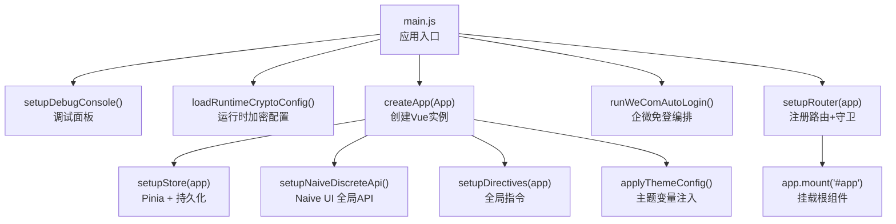
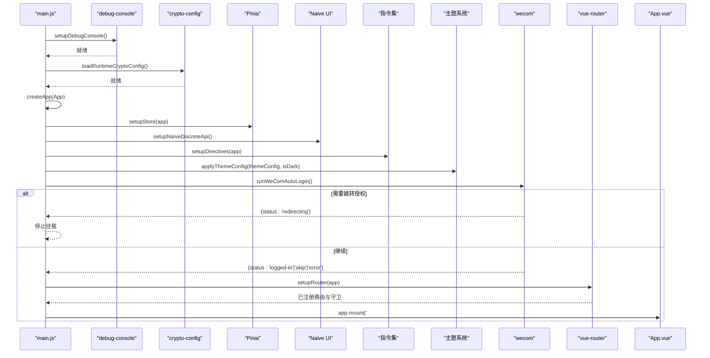
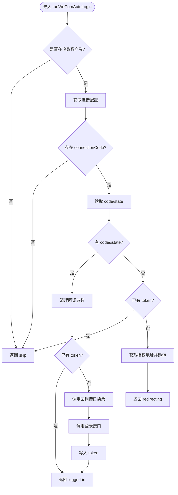
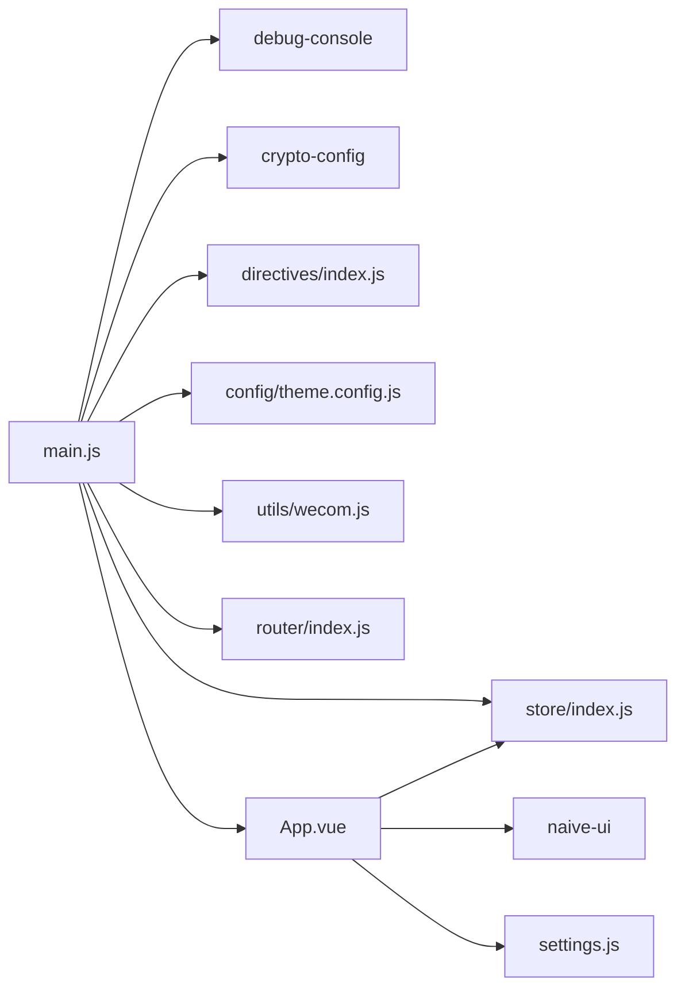

# 应用初始化

<cite>
**本文引用的文件**
- [main.js](file://forge-admin-ui/src/main.js)
- [App.vue](file://forge-admin-ui/src/App.vue)
- [settings.js](file://forge-admin-ui/src/settings.js)
- [store/index.js](file://forge-admin-ui/src/store/index.js)
- [router/index.js](file://forge-admin-ui/src/router/index.js)
- [config/theme.config.js](file://forge-admin-ui/src/config/theme.config.js)
- [utils/wecom.js](file://forge-admin-ui/src/utils/wecom.js)
- [utils/debug-console.js](file://forge-admin-ui/src/utils/debug-console.js)
- [directives/index.js](file://forge-admin-ui/src/directives/index.js)
</cite>

## 目录
1. [简介](#简介)
2. [项目结构](#项目结构)
3. [核心组件](#核心组件)
4. [架构总览](#架构总览)
5. [详细组件分析](#详细组件分析)
6. [依赖关系分析](#依赖关系分析)
7. [性能考虑](#性能考虑)
8. [故障排查指南](#故障排查指南)
9. [结论](#结论)
10. [附录](#附录)

## 简介
本文面向 Forge Admin 前端应用的启动与初始化流程，聚焦 Vue 3 应用从 createApp 实例创建到路由挂载的完整链路。内容涵盖：插件注册顺序、Store 初始化、Naive UI 全局 API 配置、主题系统初始化、路由设置、组件挂载；并深入解析调试控制台设置、运行时加密配置加载、企业微信自动登录处理等关键步骤。同时提供错误处理机制、性能优化策略与启动流程监控方案，以及自定义初始化逻辑的扩展点与最佳实践示例。

## 项目结构
Forge Admin 的前端入口位于 forge-admin-ui 工程，启动主流程集中在 main.js，配合 App.vue 完成根级布局与主题容器装配，Store、Router、指令、主题与工具模块在启动阶段按序初始化。

图表来源
- [main.js:20-53](file://forge-admin-ui/src/main.js#L20-L53)
- [router/index.js:274-286](file://forge-admin-ui/src/router/index.js#L274-L286)
- [store/index.js:4-8](file://forge-admin-ui/src/store/index.js#L4-L8)
- [directives/index.js:20-38](file://forge-admin-ui/src/directives/index.js#L20-L38)
- [config/theme.config.js:145-229](file://forge-admin-ui/src/config/theme.config.js#L145-L229)
- [utils/wecom.js:67-139](file://forge-admin-ui/src/utils/wecom.js#L67-L139)

章节来源
- [main.js:20-53](file://forge-admin-ui/src/main.js#L20-L53)
- [App.vue:1-41](file://forge-admin-ui/src/App.vue#L1-L41)
- [router/index.js:263-286](file://forge-admin-ui/src/router/index.js#L263-L286)
- [store/index.js:4-8](file://forge-admin-ui/src/store/index.js#L4-L8)
- [directives/index.js:20-38](file://forge-admin-ui/src/directives/index.js#L20-L38)
- [config/theme.config.js:145-229](file://forge-admin-ui/src/config/theme.config.js#L145-L229)
- [utils/wecom.js:67-139](file://forge-admin-ui/src/utils/wecom.js#L67-L139)

## 核心组件
- 应用入口 bootstrap：负责调试面板、加密配置、实例创建、Store、Naive UI 全局 API、指令、主题、企微免登、路由与挂载的顺序编排。
- 根组件 App.vue：提供 Naive UI 的 ConfigProvider/DialogProvider/MessageProvider，动态布局选择、KeepAlive 缓存、水印与响应式字体。
- Store：基于 Pinia，启用持久化插件，导出各业务模块（用户、权限、路由、标签页、租户、应用等）。
- Router：合并手动路由与自动生成路由，统一历史模式，安装并注册路由守卫。
- 主题系统：通过 CSS 变量集中管理主题色、菜单、头部等样式，支持明暗模式切换。
- 企微免登：在企业微信客户端内检测环境、获取连接配置、执行 OAuth2 授权或回调换票登录，仅写入 token，后续由路由守卫补齐数据。
- 调试控制台：按需从 CDN 加载 vConsole，支持 URL 参数开关与本地存储持久化。

章节来源
- [main.js:20-53](file://forge-admin-ui/src/main.js#L20-L53)
- [App.vue:1-150](file://forge-admin-ui/src/App.vue#L1-L150)
- [store/index.js:4-8](file://forge-admin-ui/src/store/index.js#L4-L8)
- [router/index.js:263-286](file://forge-admin-ui/src/router/index.js#L263-L286)
- [config/theme.config.js:9-104](file://forge-admin-ui/src/config/theme.config.js#L9-L104)
- [utils/wecom.js:67-139](file://forge-admin-ui/src/utils/wecom.js#L67-L139)
- [utils/debug-console.js:8-45](file://forge-admin-ui/src/utils/debug-console.js#L8-L45)

## 架构总览
下图展示了应用启动阶段的时序与关键交互，包括调试面板、加密配置、Store、Naive UI、指令、主题、企微免登、路由与挂载。

图表来源
- [main.js:20-53](file://forge-admin-ui/src/main.js#L20-L53)
- [utils/debug-console.js:8-45](file://forge-admin-ui/src/utils/debug-console.js#L8-L45)
- [store/index.js:4-8](file://forge-admin-ui/src/store/index.js#L4-L8)
- [directives/index.js:20-38](file://forge-admin-ui/src/directives/index.js#L20-L38)
- [config/theme.config.js:145-229](file://forge-admin-ui/src/config/theme.config.js#L145-L229)
- [utils/wecom.js:67-139](file://forge-admin-ui/src/utils/wecom.js#L67-L139)
- [router/index.js:274-286](file://forge-admin-ui/src/router/index.js#L274-L286)

## 详细组件分析

### 应用入口与启动序列（main.js）
- 调试控制台优先加载：确保后续 console 可见，支持 ?vdebug=1 开启与本地存储持久化。
- 运行时加密配置加载：在应用早期加载，为后续请求加密等能力做准备。
- 创建应用实例：createApp(App)。
- Store 初始化：先于 Naive UI 全局 API，保证后续可用。
- Naive UI 全局 API：确保 $message 等全局方法可用。
- 指令注册：权限、loading、复制、预览、水印、表格滚动增强等。
- 主题初始化：读取 store 中的 themeConfig 或默认配置，应用至 CSS 变量。
- 企微免登：仅在企微客户端内触发，必要时跳转授权；成功后仅写 token，由路由守卫补全用户信息、菜单与密钥交换。
- 路由与挂载：安装路由并注册守卫后挂载根组件。

章节来源
- [main.js:20-53](file://forge-admin-ui/src/main.js#L20-L53)

### 根组件与主题容器（App.vue）
- 使用 n-config-provider 提供语言、日期语言、主题与覆盖配置。
- 使用 n-dialog-provider 与 n-message-provider 提供全局弹窗与消息能力。
- 动态布局：根据路由 meta 或应用状态选择布局组件，支持懒加载与缓存。
- KeepAlive：根据 tabStore.cacheViews 控制页面缓存。
- 水印：通过 useWatermark 计算样式并渲染水印层。
- 响应式字体：onMounted 中初始化并更新 Naive UI 字体覆盖。
- 主题监听：watchEffect 中根据主题色与暗色模式应用当前主题。

章节来源
- [App.vue:1-150](file://forge-admin-ui/src/App.vue#L1-L150)

### Store 初始化（Pinia）
- 创建 Pinia 实例并启用持久化插件 pinia-plugin-persistedstate。
- 将 Pinia 安装到 Vue 应用，导出各模块供全局使用。

章节来源
- [store/index.js:4-8](file://forge-admin-ui/src/store/index.js#L4-L8)

### 路由设置（vue-router）
- 合并手动路由与自动生成路由，并提供兜底 404。
- 根据环境变量选择 History 或 Hash 模式。
- setupRouter 中安装路由并注册守卫，守卫负责登录后补拉用户信息、菜单与密钥交换。

章节来源
- [router/index.js:263-286](file://forge-admin-ui/src/router/index.js#L263-L286)

### 指令注册（directives）
- 注册权限、loading、复制、预览、水印、表格滚动增强等指令。
- 将 loading 服务挂载到全局属性，便于全局调用。

章节来源
- [directives/index.js:20-38](file://forge-admin-ui/src/directives/index.js#L20-L38)

### 主题系统（theme.config.js）
- 默认主题配置包含主色、头部、顶部菜单、侧边菜单及对应的暗色模式。
- applyThemeConfig 将配置映射为 CSS 变量，覆盖按钮、阴影、焦点环、菜单颜色与尺寸等。
- 支持明暗模式切换时重新应用主题变量。

章节来源
- [config/theme.config.js:9-104](file://forge-admin-ui/src/config/theme.config.js#L9-L104)
- [config/theme.config.js:145-229](file://forge-admin-ui/src/config/theme.config.js#L145-L229)

### 企业微信自动登录（wecom.js）
- 环境检测：UA 含 wxwork 视为企微客户端。
- 连接配置：后端下发是否启用工作台免登与 connectionCode。
- 流程：
  - 回跳阶段：携带 code&state 时清理 URL 参数，换票并登录，仅写入 token。
  - 已登录：直接跳过。
  - 授权阶段：获取授权地址并跳转，返回 redirecting 阻止后续挂载。
- 异常处理：失败或异常时回退常规登录流程。

图表来源
- [utils/wecom.js:67-139](file://forge-admin-ui/src/utils/wecom.js#L67-L139)

章节来源
- [utils/wecom.js:67-139](file://forge-admin-ui/src/utils/wecom.js#L67-L139)

### 调试控制台（debug-console.js）
- 支持 URL 参数 ?vdebug=1 开启与 ?vdebug=0 关闭，并通过 localStorage 持久化。
- 仅在显式开启时从 CDN 按需加载 vConsole，避免影响正常访问。
- 加载失败时降级提示，不影响应用启动。

章节来源
- [utils/debug-console.js:8-45](file://forge-admin-ui/src/utils/debug-console.js#L8-L45)

### 默认设置与布局（settings.js）
- 定义基础权限路由、默认布局、主色与 Naive UI 主题覆盖。
- 提供布局配置列表与归一化函数，用于动态布局选择。

章节来源
- [settings.js:1-115](file://forge-admin-ui/src/settings.js#L1-L115)

## 依赖关系分析
- main.js 依赖：
  - debug-console：调试面板
  - crypto-config：运行时加密配置
  - store：Pinia 与模块
  - directives：全局指令
  - theme.config：主题变量注入
  - wecom：企微免登
  - router：路由与守卫
  - App.vue：根组件与主题容器
- App.vue 依赖：
  - naive-ui：主题与全局组件
  - store：应用状态与主题覆盖
  - composables：水印、响应式字体
  - settings：布局配置

图表来源
- [main.js:20-53](file://forge-admin-ui/src/main.js#L20-L53)
- [App.vue:1-150](file://forge-admin-ui/src/App.vue#L1-L150)
- [store/index.js:4-8](file://forge-admin-ui/src/store/index.js#L4-L8)
- [directives/index.js:20-38](file://forge-admin-ui/src/directives/index.js#L20-L38)
- [config/theme.config.js:145-229](file://forge-admin-ui/src/config/theme.config.js#L145-L229)
- [utils/wecom.js:67-139](file://forge-admin-ui/src/utils/wecom.js#L67-L139)
- [router/index.js:274-286](file://forge-admin-ui/src/router/index.js#L274-L286)
- [settings.js:1-115](file://forge-admin-ui/src/settings.js#L1-L115)

章节来源
- [main.js:20-53](file://forge-admin-ui/src/main.js#L20-L53)
- [App.vue:1-150](file://forge-admin-ui/src/App.vue#L1-L150)
- [store/index.js:4-8](file://forge-admin-ui/src/store/index.js#L4-L8)
- [directives/index.js:20-38](file://forge-admin-ui/src/directives/index.js#L20-L38)
- [config/theme.config.js:145-229](file://forge-admin-ui/src/config/theme.config.js#L145-L229)
- [utils/wecom.js:67-139](file://forge-admin-ui/src/utils/wecom.js#L67-L139)
- [router/index.js:274-286](file://forge-admin-ui/src/router/index.js#L274-L286)
- [settings.js:1-115](file://forge-admin-ui/src/settings.js#L1-L115)

## 性能考虑
- 按需加载调试面板：仅在显式开启时从 CDN 加载 vConsole，避免首屏开销。
- 路由懒加载：手动路由与自动生成路由均采用异步组件，减少初始包体积。
- 布局组件缓存：使用 Map 缓存已加载布局，防止重复加载导致闪烁。
- KeepAlive 缓存：根据 tabStore.cacheViews 控制页面缓存，提升导航体验。
- 主题变量一次性注入：应用启动时集中写入 CSS 变量，减少运行时样式计算。
- 响应式字体：在 onMounted 中初始化并更新主题覆盖，避免重复计算。

[本节为通用性能建议，不直接分析具体文件]

## 故障排查指南
- 调试控制台不可用：
  - 检查 URL 是否包含 ?vdebug=1 或本地存储是否设置为 1。
  - 若 CDN 加载失败，查看控制台警告并改用远程调试。
- 企微免登失败：
  - 确认 UA 是否包含 wxwork。
  - 检查后端连接配置是否启用工作台免登与 connectionCode。
  - 观察回调参数是否被正确清理，避免重复使用失效 code。
  - 关注换票与登录接口返回码与消息，定位失败原因。
- 主题未生效：
  - 确认 applyThemeConfig 是否被调用，且传入正确的 themeConfig 与 isDark。
  - 检查 CSS 变量是否正确写入 document.documentElement。
- 路由守卫阻塞：
  - 若路由守卫未完成，App.vue 会显示加载状态；检查用户信息、菜单与密钥交换是否成功。
  - 若接口异常，确保不再永久 loading，允许页面渲染并展示错误提示。

章节来源
- [utils/debug-console.js:8-45](file://forge-admin-ui/src/utils/debug-console.js#L8-L45)
- [utils/wecom.js:67-139](file://forge-admin-ui/src/utils/wecom.js#L67-L139)
- [config/theme.config.js:145-229](file://forge-admin-ui/src/config/theme.config.js#L145-L229)
- [App.vue:101-122](file://forge-admin-ui/src/App.vue#L101-L122)

## 结论
Forge Admin 的初始化流程以 main.js 为核心，严格遵循“调试面板 → 加密配置 → 实例创建 → Store → Naive UI 全局 API → 指令 → 主题 → 企微免登 → 路由 → 挂载”的顺序，确保各子系统在依赖就绪后再参与运行。App.vue 提供统一的主题容器与布局能力，结合 Store 与路由守卫实现状态驱动与权限控制。该设计具备良好的可扩展性：可在入口增加新的初始化步骤，或在路由守卫中补充业务数据加载逻辑。

[本节为总结性内容，不直接分析具体文件]

## 附录
- 自定义初始化扩展点：
  - 在 main.js 的 bootstrap 中插入新的异步初始化步骤（如埋点、国际化、第三方 SDK 初始化），注意依赖顺序与错误处理。
  - 在路由守卫中补充登录后数据加载（用户信息、菜单、密钥交换），确保用户体验与安全性。
  - 在 App.vue 的 watchEffect 中监听主题变化，动态更新组件库覆盖或全局样式。
- 最佳实践：
  - 所有外部资源按需加载，避免影响首屏性能。
  - 对网络请求进行统一错误处理与降级策略。
  - 使用 CSS 变量统一管理主题，便于明暗模式与多主题切换。
  - 对敏感流程（如企微免登）进行日志记录与异常捕获，便于问题定位。

[本节为通用指导，不直接分析具体文件]