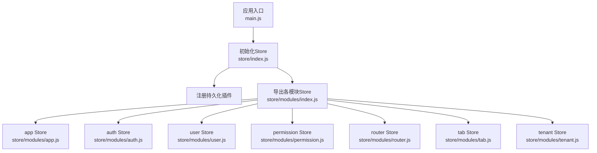
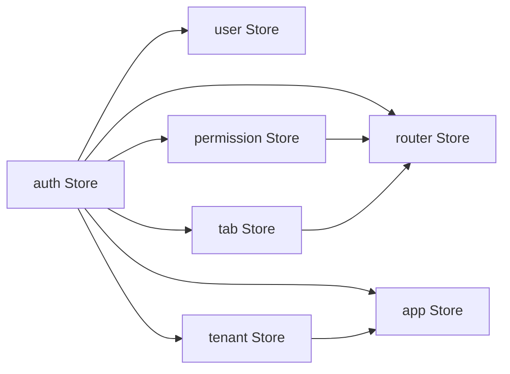
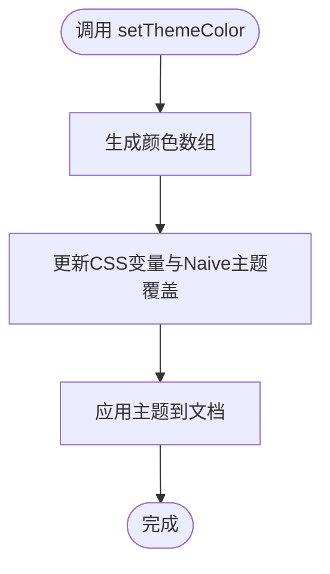
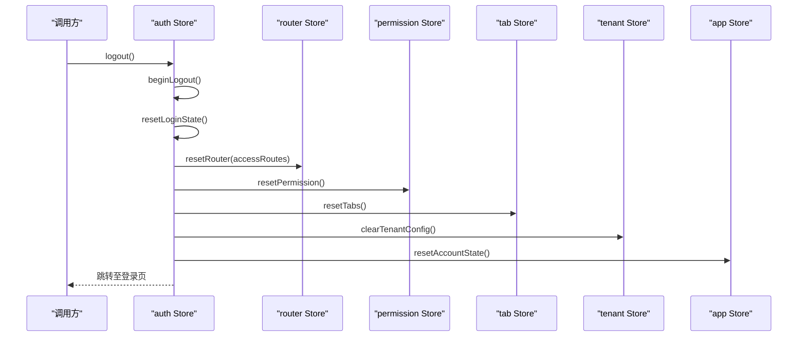
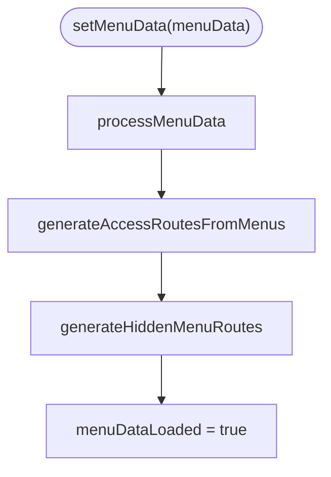
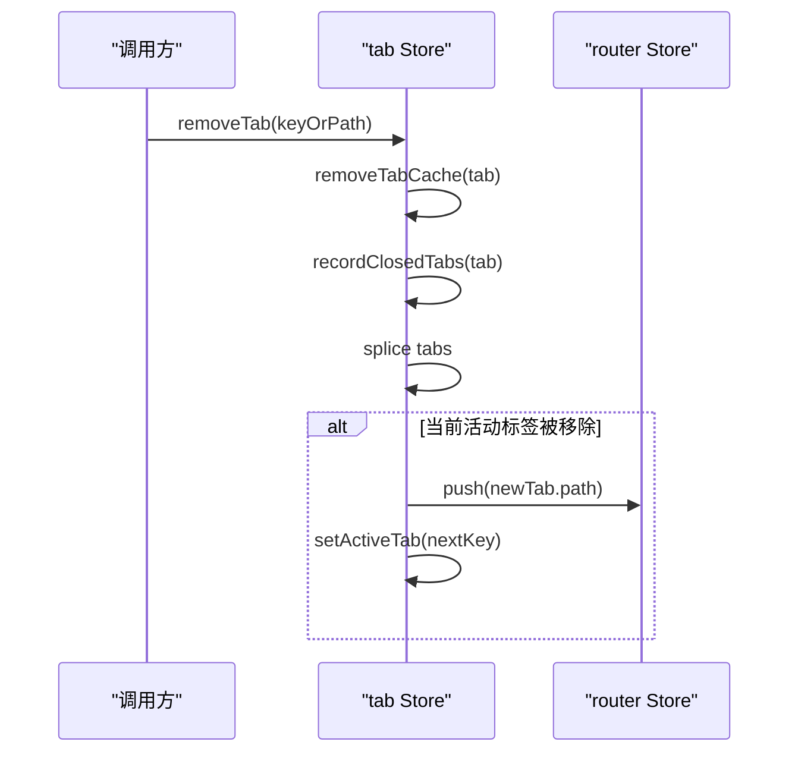
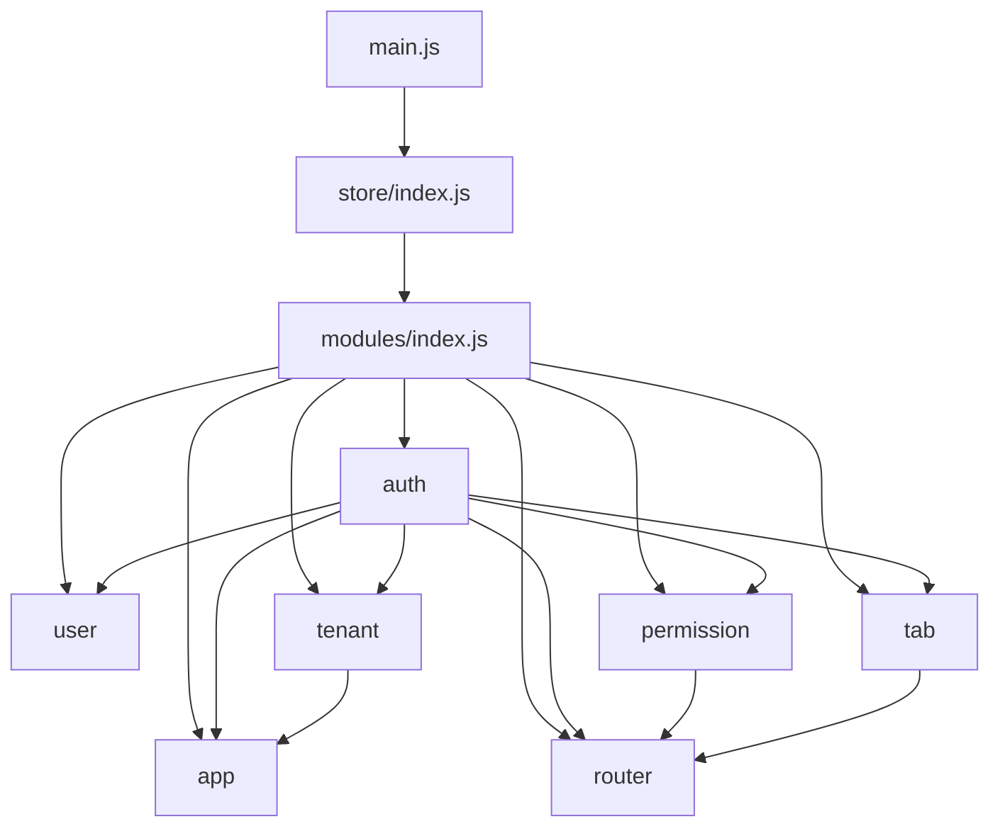

# Pinia Store架构设计

<cite>
**本文引用的文件**
- [main.js](file://forge-admin-ui/src/main.js)
- [store/index.js](file://forge-admin-ui/src/store/index.js)
- [store/modules/index.js](file://forge-admin-ui/src/store/modules/index.js)
- [store/modules/app.js](file://forge-admin-ui/src/store/modules/app.js)
- [store/modules/auth.js](file://forge-admin-ui/src/store/modules/auth.js)
- [store/modules/user.js](file://forge-admin-ui/src/store/modules/user.js)
- [store/modules/permission.js](file://forge-admin-ui/src/store/modules/permission.js)
- [store/modules/router.js](file://forge-admin-ui/src/store/modules/router.js)
- [store/modules/tab.js](file://forge-admin-ui/src/store/modules/tab.js)
- [store/modules/tenant.js](file://forge-admin-ui/src/store/modules/tenant.js)
- [stores/demo.js](file://forge-admin-ui/src/stores/demo.js)
- [store/helper.js](file://forge-admin-ui/src/store/helper.js)
</cite>

## 目录
1. [简介](#简介)
2. [项目结构](#项目结构)
3. [核心组件](#核心组件)
4. [架构总览](#架构总览)
5. [详细组件分析](#详细组件分析)
6. [依赖关系分析](#依赖关系分析)
7. [性能考量](#性能考量)
8. [故障排查指南](#故障排查指南)
9. [结论](#结论)
10. [附录](#附录)

## 简介
本技术文档围绕 Forge Admin 前端中的 Pinia Store 架构展开，系统性解析初始化配置、模块化组织、Store 间依赖与数据流向、命名空间管理、状态持久化策略与性能优化方案。同时对比传统 Vuex Store 与 Pinia Store 的迁移差异，提供自定义 Store 开发规范、测试策略与调试技巧，并通过实际代码路径展示最佳实践模式。

## 项目结构
Forge Admin 的前端应用入口在 main.js 中完成应用启动流程，优先初始化 Store，再初始化主题、路由等模块。Pinia 实例在 store/index.js 中创建并挂载插件（持久化），所有业务 Store 通过 store/modules 进行模块化组织，统一从 modules/index.js 导出，便于按需引入。

图表来源
- [main.js:20-50](file://forge-admin-ui/src/main.js#L20-L50)
- [store/index.js:1-11](file://forge-admin-ui/src/store/index.js#L1-L11)
- [store/modules/index.js:1-8](file://forge-admin-ui/src/store/modules/index.js#L1-L8)

章节来源
- [main.js:20-50](file://forge-admin-ui/src/main.js#L20-L50)
- [store/index.js:1-11](file://forge-admin-ui/src/store/index.js#L1-L11)
- [store/modules/index.js:1-8](file://forge-admin-ui/src/store/modules/index.js#L1-L8)

## 核心组件
- 应用 Store（app）：负责布局、主题、颜色、Naive UI 覆盖样式、顶部菜单选中项、路由守卫完成标记等全局 UI 状态，并提供重置与动态主题更新能力。
- 认证 Store（auth）：集中管理访问令牌、登录态、登出流程、跳转登录页、跨 Store 联动重置（用户、权限、路由、标签页、租户配置）。
- 用户 Store（user）：维护用户信息、员工信息、数据权限，提供丰富的只读 Getter 以屏蔽后端字段差异。
- 权限 Store（permission）：处理菜单与路由生成、隐藏菜单路由注入、首页路径推导、菜单数据处理与排序。
- 路由 Store（router）：封装 Vue Router 实例与当前路由，提供动态移除路由的能力。
- 标签页 Store（tab）：管理多标签页、钉选、重排、关闭历史、脏标记、缓存视图列表、刷新与恢复逻辑。
- 租户 Store（tenant）：加载与缓存租户配置，提供系统名称、Logo、标题、主题等派生 Getter。
- 示例 Store（demo）：演示如何定义 state/getters/actions 以及错误处理与幂等加载。

章节来源
- [store/modules/app.js:12-106](file://forge-admin-ui/src/store/modules/app.js#L12-L106)
- [store/modules/auth.js:7-111](file://forge-admin-ui/src/store/modules/auth.js#L7-L111)
- [store/modules/user.js:26-136](file://forge-admin-ui/src/store/modules/user.js#L26-L136)
- [store/modules/permission.js:14-367](file://forge-admin-ui/src/store/modules/permission.js#L14-L367)
- [store/modules/router.js:3-18](file://forge-admin-ui/src/store/modules/router.js#L3-L18)
- [store/modules/tab.js:26-408](file://forge-admin-ui/src/store/modules/tab.js#L26-L408)
- [store/modules/tenant.js:4-85](file://forge-admin-ui/src/store/modules/tenant.js#L4-L85)
- [stores/demo.js:1-41](file://forge-admin-ui/src/stores/demo.js#L1-L41)

## 架构总览
下图展示了 Store 之间的协作关系与数据流：认证流程触发 auth 重置，联动 user、permission、router、tab、tenant 与 app；权限 Store 根据菜单数据生成可访问路由；标签页 Store 与路由 Store 协同控制页面切换与缓存；租户 Store 提供系统级配置供其他 Store 消费。

图表来源
- [store/modules/auth.js:61-98](file://forge-admin-ui/src/store/modules/auth.js#L61-L98)
- [store/modules/permission.js:93-146](file://forge-admin-ui/src/store/modules/permission.js#L93-L146)
- [store/modules/router.js:7-11](file://forge-admin-ui/src/store/modules/router.js#L7-L11)
- [store/modules/tab.js:201-221](file://forge-admin-ui/src/store/modules/tab.js#L201-L221)
- [store/modules/tenant.js:52-72](file://forge-admin-ui/src/store/modules/tenant.js#L52-L72)
- [store/modules/app.js:56-74](file://forge-admin-ui/src/store/modules/app.js#L56-L74)

## 详细组件分析

### 应用 Store（app）
- 职责：管理折叠侧边栏、暗色模式、布局、主色调、Naive UI 主题覆盖、顶部菜单选中项、主题配置、路由守卫完成标记。
- 关键行为：
  - 切换折叠、设置布局、设置主色并同步 Naive 主题。
  - 重置账户状态时恢复默认主题与布局，并重置文档标题。
  - 支持增量更新 header/topMenu/sideMenu 配置并实时应用。
  - 持久化 key 基于租户隔离，仅持久化必要字段。
- 复杂度：主题生成与覆盖为 O(1)，重置与更新均为浅合并，整体开销低。

图表来源
- [store/modules/app.js:36-52](file://forge-admin-ui/src/store/modules/app.js#L36-L52)
- [store/modules/app.js:66-74](file://forge-admin-ui/src/store/modules/app.js#L66-L74)

章节来源
- [store/modules/app.js:12-106](file://forge-admin-ui/src/store/modules/app.js#L12-L106)

### 认证 Store（auth）
- 职责：管理 accessToken、userInfo、staffInfo、登出状态；提供登录态重置、跳转登录、角色切换、退出登录等能力。
- 关键行为：
  - resetLoginState 联动多个 Store 进行全量清理：路由、用户、权限、标签页、租户配置、WebSocket、密钥交换、本地存储。
  - logout 流程包含 beginLogout -> resetLoginState -> toLogin -> finishLogoutSilence 的状态机式流转。
  - 持久化 key 基于租户隔离。
- 复杂度：resetLoginState 涉及多次副作用操作，注意顺序与异常隔离。

图表来源
- [store/modules/auth.js:43-106](file://forge-admin-ui/src/store/modules/auth.js#L43-L106)
- [store/modules/router.js:7-11](file://forge-admin-ui/src/store/modules/router.js#L7-L11)
- [store/modules/permission.js:363-365](file://forge-admin-ui/src/store/modules/permission.js#L363-L365)
- [store/modules/tab.js:392-401](file://forge-admin-ui/src/store/modules/tab.js#L392-L401)
- [store/modules/tenant.js:74-77](file://forge-admin-ui/src/store/modules/tenant.js#L74-L77)
- [store/modules/app.js:56-65](file://forge-admin-ui/src/store/modules/app.js#L56-L65)

章节来源
- [store/modules/auth.js:7-111](file://forge-admin-ui/src/store/modules/auth.js#L7-L111)

### 用户 Store（user）
- 职责：维护用户信息与员工信息，提供大量只读 Getter 兼容不同后端返回结构。
- 关键行为：
  - setUser 兼容新旧结构，自动填充 staffInfo 与 dataPermission。
  - resetUser 使用 $reset 清空状态。
- 复杂度：Getter 多为 O(1) 属性访问，setUser 含条件分支但常量级。

章节来源
- [store/modules/user.js:26-136](file://forge-admin-ui/src/store/modules/user.js#L26-L136)

### 权限 Store（permission）
- 职责：处理菜单数据转换、可见菜单生成路由、隐藏菜单路由注入、首页路径推导、菜单排序与过滤。
- 关键行为：
  - processMenuData 将后端资源树转换为前端菜单格式，收集 allMenus 用于标题查找。
  - generateAccessRoutesFromMenus 遍历菜单生成 accessRoutes（仅可见菜单）。
  - generateHiddenMenuRoutes 提取隐藏菜单并追加到 accessRoutes，确保 meta.title 存在。
  - setMenuData 完成后设置 menuDataLoaded 标志，便于上层等待菜单就绪。
- 复杂度：菜单遍历为 O(N)，排序为 O(N log N)。

图表来源
- [store/modules/permission.js:34-85](file://forge-admin-ui/src/store/modules/permission.js#L34-L85)
- [store/modules/permission.js:93-146](file://forge-admin-ui/src/store/modules/permission.js#L93-L146)
- [store/modules/permission.js:258-303](file://forge-admin-ui/src/store/modules/permission.js#L258-L303)

章节来源
- [store/modules/permission.js:14-367](file://forge-admin-ui/src/store/modules/permission.js#L14-L367)

### 路由 Store（router）
- 职责：暴露 router 与 route 实例，提供 resetRouter 方法按 name 移除动态路由。
- 关键行为：
  - resetRouter 遍历传入的路由表，若存在则 removeRoute，用于登出或切换角色后重建路由。
- 复杂度：O(M) 移除操作，M 为路由数量。

章节来源
- [store/modules/router.js:3-18](file://forge-admin-ui/src/store/modules/router.js#L3-L18)

### 标签页 Store（tab）
- 职责：管理多标签页、钉选、重排、关闭历史、脏标记、缓存视图列表、刷新与恢复。
- 关键行为：
  - addTab/removeTab/updateTabTitle/updateTabMeta 等操作均同步 sessionStorage。
  - removeOther/removeLeft/removeRight 会同步更新 cacheViews 列表。
  - refreshOtherTabs/reloadTab 通过 nextTick 与 requestAnimationFrame 保证卸载与重新挂载时序。
  - persist 仅持久化 tabs，closedTabs 单独存储。
- 复杂度：多数操作为 O(N) 数组扫描，N 为标签数量。

图表来源
- [store/modules/tab.js:201-221](file://forge-admin-ui/src/store/modules/tab.js#L201-L221)
- [store/modules/tab.js:340-391](file://forge-admin-ui/src/store/modules/tab.js#L340-L391)

章节来源
- [store/modules/tab.js:26-408](file://forge-admin-ui/src/store/modules/tab.js#L26-L408)

### 租户 Store（tenant）
- 职责：加载与缓存租户配置，提供系统名称、Logo、标题、主题等派生 Getter。
- 关键行为：
  - loadTenantConfig 支持传入 tenantId 或从 user Store 获取。
  - themeConfig Getter 安全解析 JSON 字符串。
  - persist 仅持久化 config。
- 复杂度：网络请求为异步，Getter 为 O(1)。

章节来源
- [store/modules/tenant.js:4-85](file://forge-admin-ui/src/store/modules/tenant.js#L4-L85)

### 示例 Store（demo）
- 职责：演示 defineStore 的基本用法，包括 state、getters、actions、错误处理与幂等加载。
- 关键行为：
  - loadDemoStatus 仅在未加载时发起请求，失败时降级并标记 loaded。
  - clearStatus 重置状态以便重试。

章节来源
- [stores/demo.js:1-41](file://forge-admin-ui/src/stores/demo.js#L1-L41)

## 依赖关系分析
- 初始化阶段：main.js 先 setupStore，再读取 app Store 的主题配置应用主题，随后 setupRouter。
- 运行时依赖：
  - auth 依赖 router、user、permission、tab、tenant、app 进行状态重置。
  - permission 依赖工具函数与配置，生成路由并影响 router。
  - tab 依赖 router 进行导航与缓存视图管理。
  - tenant 提供系统级配置，app 消费主题相关字段。
- 外部依赖：pinia-plugin-persistedstate 实现状态持久化；VueUse 的 useDark 提供暗色模式；@arco-design/color 生成主题色阶。

图表来源
- [main.js:20-50](file://forge-admin-ui/src/main.js#L20-L50)
- [store/index.js:1-11](file://forge-admin-ui/src/store/index.js#L1-L11)
- [store/modules/index.js:1-8](file://forge-admin-ui/src/store/modules/index.js#L1-L8)
- [store/modules/auth.js:61-98](file://forge-admin-ui/src/store/modules/auth.js#L61-L98)
- [store/modules/permission.js:93-146](file://forge-admin-ui/src/store/modules/permission.js#L93-L146)
- [store/modules/tab.js:201-221](file://forge-admin-ui/src/store/modules/tab.js#L201-L221)
- [store/modules/tenant.js:52-72](file://forge-admin-ui/src/store/modules/tenant.js#L52-L72)
- [store/modules/app.js:56-74](file://forge-admin-ui/src/store/modules/app.js#L56-L74)

章节来源
- [main.js:20-50](file://forge-admin-ui/src/main.js#L20-L50)
- [store/index.js:1-11](file://forge-admin-ui/src/store/index.js#L1-L11)
- [store/modules/index.js:1-8](file://forge-admin-ui/src/store/modules/index.js#L1-L8)

## 性能考量
- 最小化持久化字段：app 与 tab、tenant 等 Store 通过 pick 仅持久化必要字段，减少序列化开销。
- 避免重复计算：permission 的菜单处理在 setMenuData 中集中执行，避免多处重复转换。
- 渲染时序控制：tab 的 reloadTab 使用 nextTick 与 requestAnimationFrame 确保卸载与挂载顺序正确，避免闪烁。
- 路由批量操作：resetRouter 按 name 移除路由，避免逐条判断带来的额外开销。
- 主题生成：app 使用 @arco-design/color 生成色板，仅更新必要的 CSS 变量与主题覆盖对象。

[本节为通用性能建议，不直接分析具体文件]

## 故障排查指南
- 菜单未显示或路由缺失：
  - 检查 permission.setMenuData 是否成功设置 menuDataLoaded。
  - 确认 generateAccessRoutesFromMenus 与 generateHiddenMenuRoutes 是否正确生成路由。
- 登录后仍停留在登录页：
  - 检查 auth.resetLoginState 是否调用了 router.resetRouter 与 app.resetAccountState。
  - 确认路由守卫是否已放行。
- 标签页刷新无效：
  - 检查 tab.reloadTab 是否设置了 keepAlive 并触发了 nextTick 与 waitFrame。
- 主题不生效：
  - 检查 app.setThemeColor 与 applyThemeConfig 是否被调用。
  - 确认 VITE_DEFAULT_LAYOUT 与 defaultLayout 一致。

章节来源
- [store/modules/permission.js:34-85](file://forge-admin-ui/src/store/modules/permission.js#L34-L85)
- [store/modules/permission.js:93-146](file://forge-admin-ui/src/store/modules/permission.js#L93-L146)
- [store/modules/permission.js:258-303](file://forge-admin-ui/src/store/modules/permission.js#L258-L303)
- [store/modules/auth.js:61-106](file://forge-admin-ui/src/store/modules/auth.js#L61-L106)
- [store/modules/tab.js:367-391](file://forge-admin-ui/src/store/modules/tab.js#L367-L391)
- [store/modules/app.js:36-74](file://forge-admin-ui/src/store/modules/app.js#L36-L74)

## 结论
Forge Admin 的 Pinia Store 采用清晰的模块化设计，职责边界明确，Store 之间通过显式依赖协作，数据流向可控。通过 pinia-plugin-persistedstate 实现租户隔离的持久化，结合合理的字段裁剪与渲染时序控制，兼顾了可维护性与性能。相比传统 Vuex，Pinia 提供了更简洁的 API、更好的类型推断与开发体验，降低了状态管理的复杂度。

[本节为总结性内容，不直接分析具体文件]

## 附录

### 初始化与注册机制
- 应用入口 main.js 调用 setupStore 创建 Pinia 实例并安装持久化插件，随后导出各模块 Store。
- modules/index.js 统一 re-export 所有业务 Store，便于按需导入。

章节来源
- [main.js:20-50](file://forge-admin-ui/src/main.js#L20-L50)
- [store/index.js:1-11](file://forge-admin-ui/src/store/index.js#L1-L11)
- [store/modules/index.js:1-8](file://forge-admin-ui/src/store/modules/index.js#L1-L8)

### 命名空间管理
- 持久化 key 统一采用 `${VITE_TENANT || 'default'}_xxx` 形式，实现多租户隔离。
- 各 Store 的 persist.key 分别对应 app、auth、user、tab、tenant 等命名空间。

章节来源
- [store/modules/app.js:101-105](file://forge-admin-ui/src/store/modules/app.js#L101-L105)
- [store/modules/auth.js:108-110](file://forge-admin-ui/src/store/modules/auth.js#L108-L110)
- [store/modules/user.js:133-135](file://forge-admin-ui/src/store/modules/user.js#L133-L135)
- [store/modules/tab.js:403-407](file://forge-admin-ui/src/store/modules/tab.js#L403-L407)
- [store/modules/tenant.js:80-84](file://forge-admin-ui/src/store/modules/tenant.js#L80-L84)

### 状态持久化策略
- 使用 pinia-plugin-persistedstate，选择 sessionStorage 作为存储介质。
- 通过 pick 精确控制持久化字段，避免冗余数据。
- 租户隔离的 key 设计确保多租户环境下的状态互不干扰。

章节来源
- [store/index.js:1-8](file://forge-admin-ui/src/store/index.js#L1-L8)
- [store/modules/app.js:101-105](file://forge-admin-ui/src/store/modules/app.js#L101-L105)
- [store/modules/tab.js:403-407](file://forge-admin-ui/src/store/modules/tab.js#L403-L407)
- [store/modules/tenant.js:80-84](file://forge-admin-ui/src/store/modules/tenant.js#L80-L84)

### 性能优化方案
- 菜单处理集中化：permission.setMenuData 内聚菜单转换与路由生成，减少重复计算。
- 渲染时序控制：tab.reloadTab 使用 nextTick 与 requestAnimationFrame 确保正确的卸载与挂载顺序。
- 路由批量移除：auth.resetLoginState 调用 router.resetRouter 批量移除动态路由。
- 主题更新局部化：app.setThemeColor 仅更新必要的 CSS 变量与主题覆盖对象。

章节来源
- [store/modules/permission.js:34-85](file://forge-admin-ui/src/store/modules/permission.js#L34-L85)
- [store/modules/tab.js:367-391](file://forge-admin-ui/src/store/modules/tab.js#L367-L391)
- [store/modules/router.js:7-11](file://forge-admin-ui/src/store/modules/router.js#L7-L11)
- [store/modules/app.js:36-52](file://forge-admin-ui/src/store/modules/app.js#L36-L52)

### 与传统 Vuex 的迁移要点
- API 差异：
  - 使用 defineStore 替代 Vuex 的 createStore，state 为函数返回对象。
  - getters 与 actions 直接在 Store 定义，无需 mapGetters/mapActions。
- 数据流改进：
  - 更直观的响应式状态与组合式风格，减少样板代码。
  - 天然支持 TypeScript 与更好的类型推断。
- 开发体验提升：
  - 更简单的模块组织与导入方式。
  - 插件生态（如持久化）集成更便捷。

[本节为概念性说明，不直接分析具体文件]

### 自定义 Store 开发规范
- 单一职责：每个 Store 聚焦一个业务域（如用户、权限、标签页）。
- 命名规范：Store 名称使用小写英文，key 遵循租户隔离约定。
- 状态设计：state 保持扁平化，复杂对象通过 getters 派生。
- 动作设计：actions 封装副作用（网络请求、路由跳转、状态重置）。
- 持久化：谨慎使用 persist，pick 仅包含必要字段。
- 错误处理：actions 内部捕获异常并降级状态，避免崩溃。

章节来源
- [stores/demo.js:1-41](file://forge-admin-ui/src/stores/demo.js#L1-L41)
- [store/modules/app.js:12-106](file://forge-admin-ui/src/store/modules/app.js#L12-L106)
- [store/modules/auth.js:7-111](file://forge-admin-ui/src/store/modules/auth.js#L7-L111)

### 测试策略
- 单元测试：
  - 针对 getters 与 actions 编写用例，验证状态变更与副作用。
  - 模拟网络请求与路由跳转，确保边界条件正确处理。
- 集成测试：
  - 验证 Store 之间的协作流程（如登出时的多 Store 重置）。
  - 检查持久化键与字段是否符合预期。
- 快照测试：
  - 对复杂菜单数据结构进行快照比对，防止意外变更。

[本节为通用测试建议，不直接分析具体文件]

### 调试技巧
- 启用浏览器 DevTools 的 Pinia 面板，观察状态变化与 Actions 调用栈。
- 在关键 Action 中添加日志输出，记录输入参数与结果。
- 利用 nextTick 与 requestAnimationFrame 调试渲染时序问题。
- 通过 sessionStorage 检查持久化数据是否符合预期。

章节来源
- [store/modules/tab.js:367-391](file://forge-admin-ui/src/store/modules/tab.js#L367-L391)
- [store/index.js:1-8](file://forge-admin-ui/src/store/index.js#L1-L8)

### 最佳实践示例（代码路径）
- 基础 Store 定义与错误处理：[stores/demo.js:1-41](file://forge-admin-ui/src/stores/demo.js#L1-L41)
- 主题与布局管理：[store/modules/app.js:12-106](file://forge-admin-ui/src/store/modules/app.js#L12-L106)
- 认证与登出流程：[store/modules/auth.js:43-106](file://forge-admin-ui/src/store/modules/auth.js#L43-L106)
- 菜单与路由生成：[store/modules/permission.js:34-146](file://forge-admin-ui/src/store/modules/permission.js#L34-L146)
- 标签页管理与缓存：[store/modules/tab.js:56-221](file://forge-admin-ui/src/store/modules/tab.js#L56-L221)
- 租户配置加载：[store/modules/tenant.js:52-72](file://forge-admin-ui/src/store/modules/tenant.js#L52-L72)
- 用户信息适配：[store/modules/user.js:109-131](file://forge-admin-ui/src/store/modules/user.js#L109-L131)
- 辅助函数（用户信息/权限）：[store/helper.js:5-61](file://forge-admin-ui/src/store/helper.js#L5-L61)