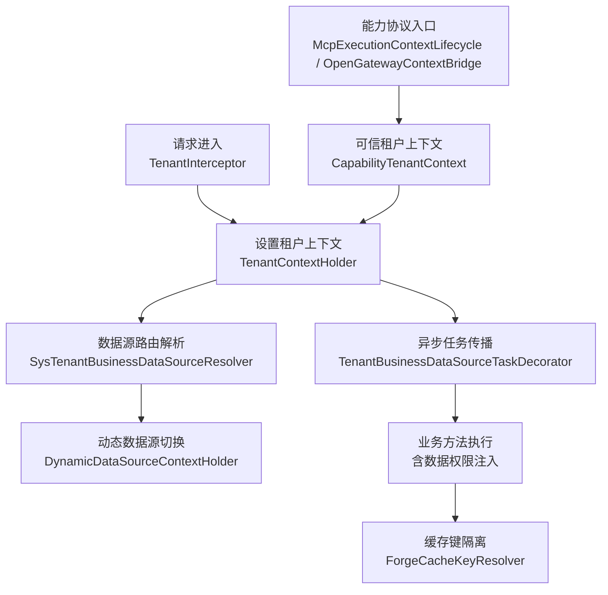
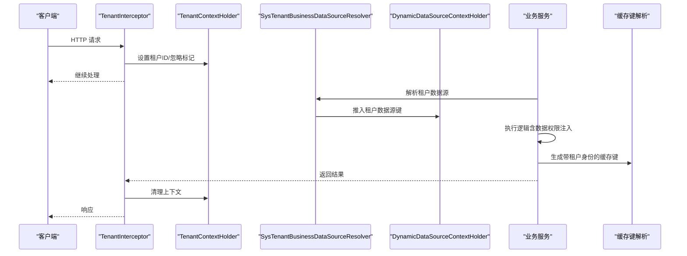
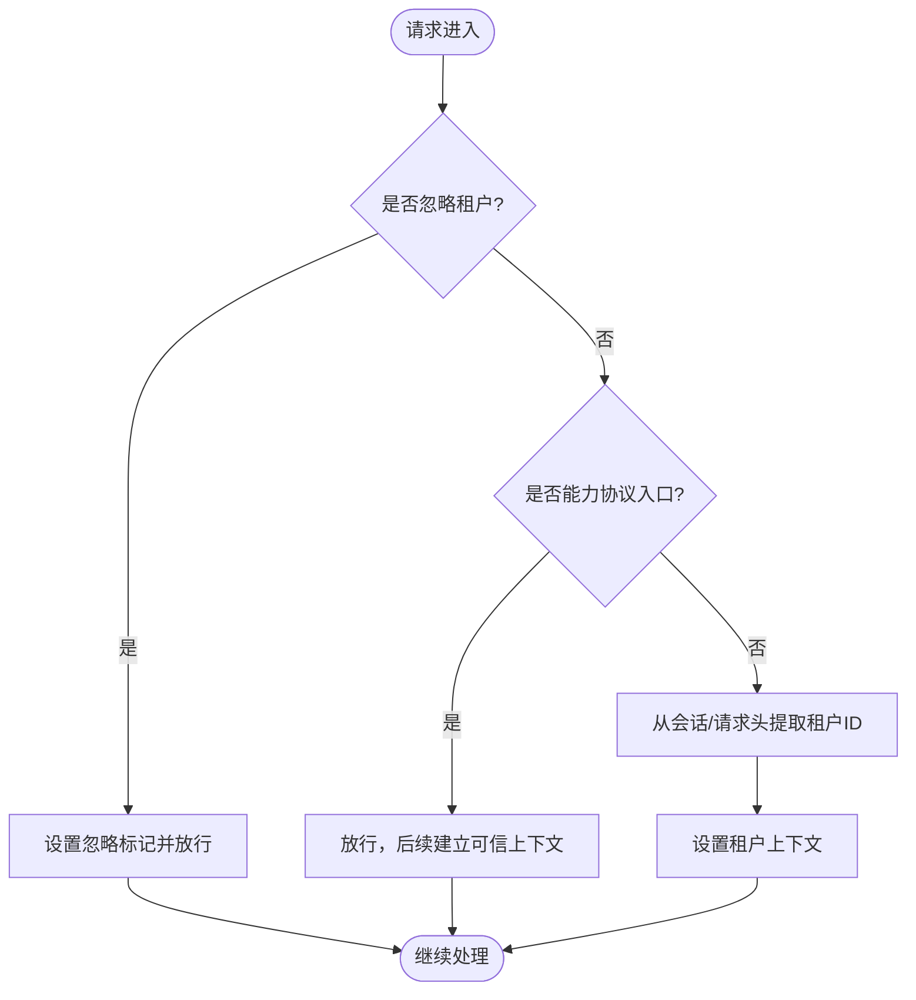
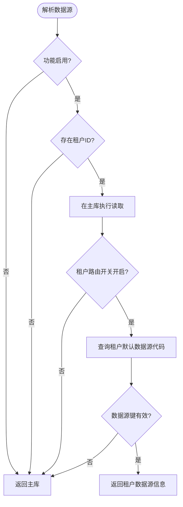
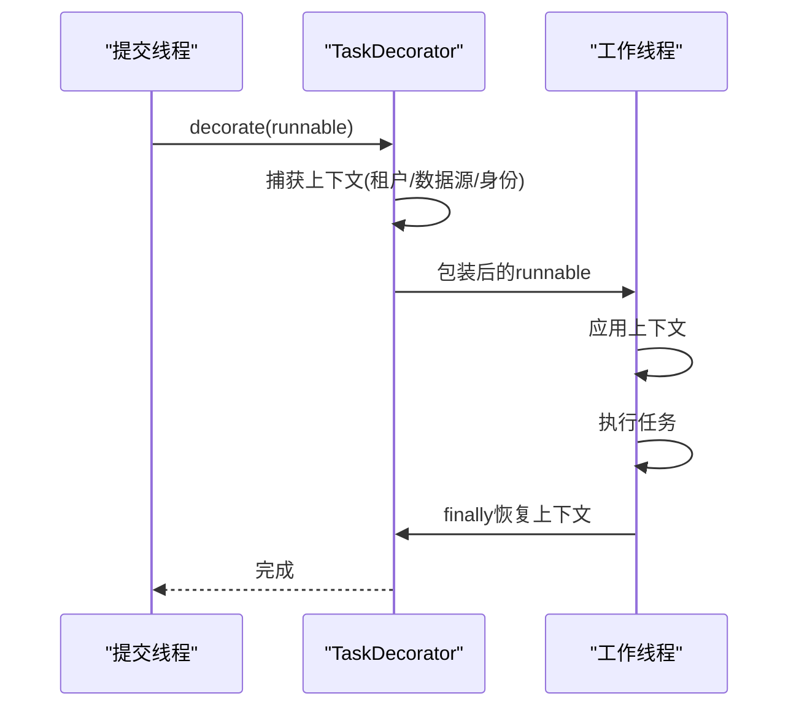
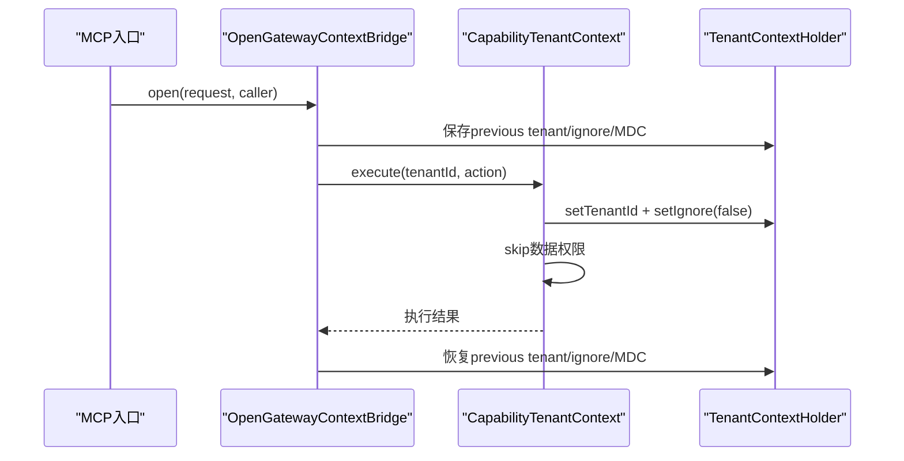
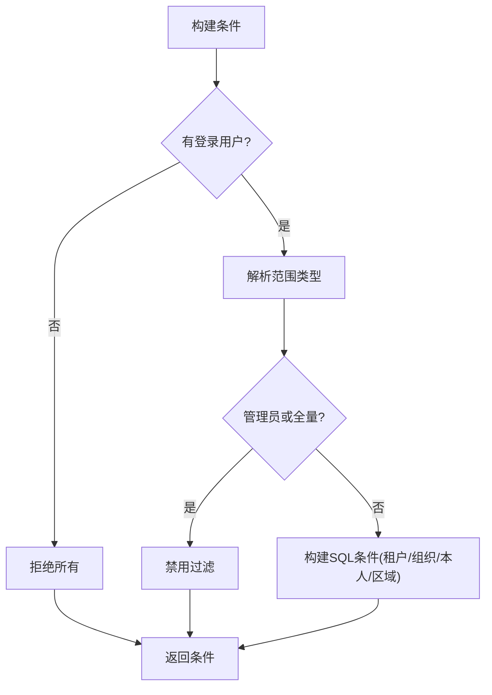
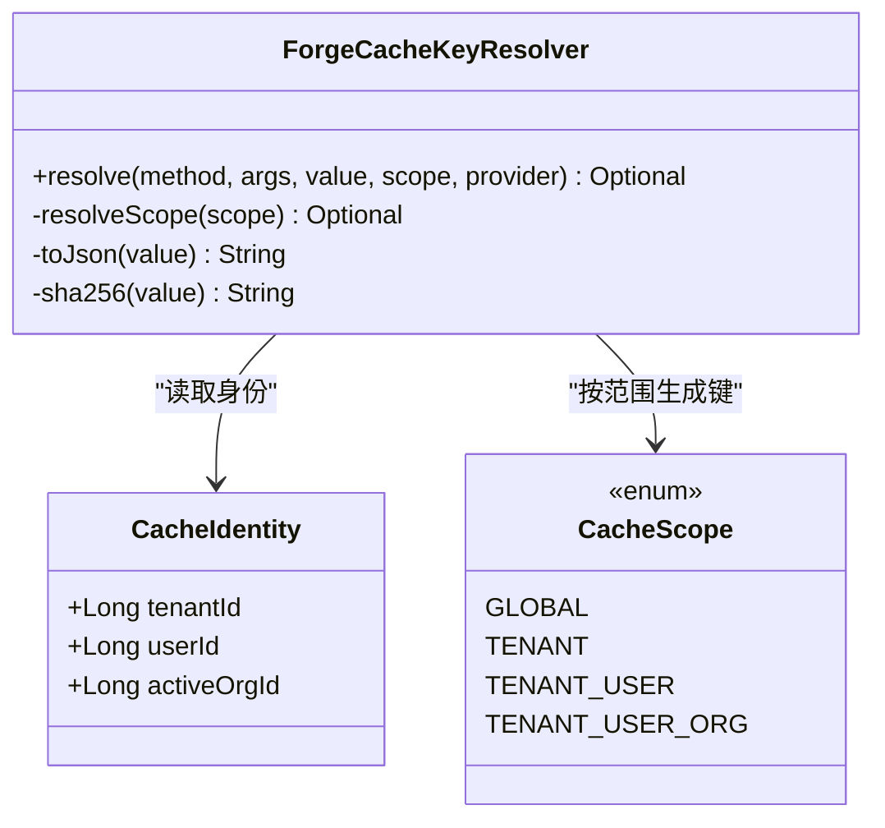
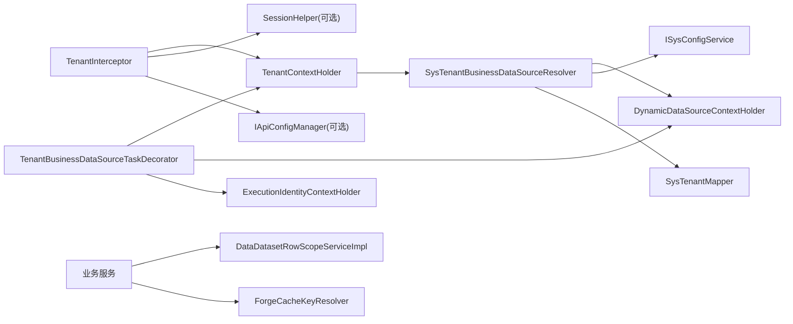

# 多租户上下文状态管理

<cite>
**本文引用的文件**
- [TenantContextHolder.java](file://forge-server/forge-framework/forge-starter-parent/forge-starter-tenant/src/main/java/com/mdframe/forge/starter/tenant/context/TenantContextHolder.java)
- [TenantInterceptor.java](file://forge-server/forge-framework/forge-starter-parent/forge-starter-tenant/src/main/java/com/mdframe/forge/starter/tenant/interceptor/TenantInterceptor.java)
- [SysTenantBusinessDataSourceResolver.java](file://forge-server/forge-framework/forge-plugin-parent/forge-plugin-system/src/main/java/com/mdframe/forge/plugin/system/datasource/SysTenantBusinessDataSourceResolver.java)
- [TenantBusinessDataSourceTaskDecorator.java](file://forge-server/forge-framework/forge-starter-parent/forge-starter-tenant/src/main/java/com/mdframe/forge/starter/tenant/datasource/TenantBusinessDataSourceTaskDecorator.java)
- [CapabilityTenantContext.java](file://forge-server/forge-framework/forge-plugin-parent/forge-plugin-capability-parent/forge-plugin-capability-platform/src/main/java/com/mdframe/forge/plugin/capability/identity/security/CapabilityTenantContext.java)
- [McpExecutionContextLifecycle.java](file://forge-server/forge-framework/forge-plugin-parent/forge-plugin-capability-parent/forge-plugin-capability-platform/src/main/java/com/mdframe/forge/plugin/capability/identity/mcp/McpExecutionContextLifecycle.java)
- [OpenGatewayContextBridge.java](file://forge-server/forge-framework/forge-plugin-parent/forge-plugin-capability-parent/forge-plugin-capability-platform/src/main/java/com/mdframe/forge/plugin/capability/opengateway/service/OpenGatewayContextBridge.java)
- [DataDatasetRowScopeServiceImpl.java](file://forge-server/forge-business/forge-business-core/src/main/java/com/mdframe/forge/business/core/datasource/DataDatasetRowScopeServiceImpl.java)
- [ForgeCacheKeyResolver.java](file://forge-server/forge-framework/forge-starter-parent/forge-starter-cache/src/main/java/com/mdframe/forge/starter/cache/managed/key/ForgeCacheKeyResolver.java)
- [CacheIdentity.java](file://forge-server/forge-framework/forge-starter-parent/forge-starter-cache/src/main/java/com/mdframe/forge/starter/cache/managed/context/CacheIdentity.java)
- [CacheScope.java](file://forge-server/forge-framework/forge-starter-parent/forge-starter-cache/src/main/java/com/mdframe/forge/starter/cache/managed/enums/CacheScope.java)
- [ManagedCachePolicyBootstrap.java](file://forge-server/forge-framework/forge-plugin-parent/forge-plugin-system/src/main/java/com/mdframe/forge/plugin/system/listener/ManagedCachePolicyBootstrap.java)
- [SaTokenFlowTokenProvider.java](file://forge-server/forge-framework/forge-starter-parent/forge-starter-auth/src/main/java/com/mdframe/forge/starter/auth/config/SaTokenFlowTokenProvider.java)
</cite>

## 目录
1. [简介](#简介)
2. [项目结构](#项目结构)
3. [核心组件](#核心组件)
4. [架构总览](#架构总览)
5. [详细组件分析](#详细组件分析)
6. [依赖关系分析](#依赖关系分析)
7. [性能考虑](#性能考虑)
8. [故障排查指南](#故障排查指南)
9. [结论](#结论)
10. [附录](#附录)

## 简介
本技术文档聚焦于多租户上下文状态管理，围绕以下目标展开：
- 多租户切换与隔离：请求级租户上下文的建立、传播与清理。
- 配置加载策略：租户业务数据源路由开关、默认数据源解析与校验。
- 数据权限控制：行级数据范围（数据集）在租户维度下的注入与生效。
- 全局状态管理：租户信息、权限范围、数据源路由、异步线程传递、缓存键隔离。
- 高级特性：租户隔离、数据同步、性能优化、扩展点与最佳实践、故障排查。

## 项目结构
多租户能力横跨框架层、插件层与业务层，关键模块如下：
- 框架层（starter-tenant）：提供租户上下文持有者、拦截器、异步任务装饰器。
- 系统插件（plugin-system）：实现基于系统配置的租户数据源解析、受管缓存策略初始化。
- 能力协议（capability-platform）：在可信凭据校验后以可信租户身份执行操作，并桥接外部网关上下文。
- 业务层（business-core）：数据集行级数据范围在服务端构建条件，结合登录用户与角色计算最小数据范围。
- 缓存层（starter-cache）：按租户/用户/组织粒度生成缓存键，支持运行时策略同步。

图表来源
- [TenantInterceptor.java:27-109](file://forge-server/forge-framework/forge-starter-parent/forge-starter-tenant/src/main/java/com/mdframe/forge/starter/tenant/interceptor/TenantInterceptor.java#L27-L109)
- [SysTenantBusinessDataSourceResolver.java:38-88](file://forge-server/forge-framework/forge-plugin-parent/forge-plugin-system/src/main/java/com/mdframe/forge/plugin/system/datasource/SysTenantBusinessDataSourceResolver.java#L38-L88)
- [TenantBusinessDataSourceTaskDecorator.java:19-51](file://forge-server/forge-framework/forge-starter-parent/forge-starter-tenant/src/main/java/com/mdframe/forge/starter/tenant/datasource/TenantBusinessDataSourceTaskDecorator.java#L19-L51)
- [CapabilityTenantContext.java:17-33](file://forge-server/forge-framework/forge-plugin-parent/forge-plugin-capability-parent/forge-plugin-capability-platform/src/main/java/com/mdframe/forge/plugin/capability/identity/security/CapabilityTenantContext.java#L17-L33)
- [McpExecutionContextLifecycle.java:53-92](file://forge-server/forge-framework/forge-plugin-parent/forge-plugin-capability-parent/forge-plugin-capability-platform/src/main/java/com/mdframe/forge/plugin/capability/identity/mcp/McpExecutionContextLifecycle.java#L53-L92)
- [OpenGatewayContextBridge.java:59-78](file://forge-server/forge-framework/forge-plugin-parent/forge-plugin-capability-parent/forge-plugin-capability-platform/src/main/java/com/mdframe/forge/plugin/capability/opengateway/service/OpenGatewayContextBridge.java#L59-L78)

章节来源
- [TenantInterceptor.java:27-145](file://forge-server/forge-framework/forge-starter-parent/forge-starter-tenant/src/main/java/com/mdframe/forge/starter/tenant/interceptor/TenantInterceptor.java#L27-L145)
- [SysTenantBusinessDataSourceResolver.java:38-125](file://forge-server/forge-framework/forge-plugin-parent/forge-plugin-system/src/main/java/com/mdframe/forge/plugin/system/datasource/SysTenantBusinessDataSourceResolver.java#L38-L125)
- [TenantBusinessDataSourceTaskDecorator.java:19-63](file://forge-server/forge-framework/forge-starter-parent/forge-starter-tenant/src/main/java/com/mdframe/forge/starter/tenant/datasource/TenantBusinessDataSourceTaskDecorator.java#L19-L63)

## 核心组件
- 租户上下文持有者：提供线程安全的租户ID与忽略标记，支持嵌套恢复与异步传递。
- 请求级拦截器：从会话或请求头提取租户，处理注解与协议白名单，统一设置上下文并在完成后清理。
- 数据源路由解析器：根据租户配置与系统开关，解析并切换到租户业务数据源，同时保证读取主库的可靠性。
- 异步任务装饰器：捕获提交线程的租户与数据源上下文，在子线程中应用并还原，避免跨线程污染。
- 能力协议可信上下文：在完成凭据校验后，以可信租户身份执行租户表访问，并跳过数据权限以避免自引用死锁。
- 数据集行级范围服务：根据登录用户、角色与数据集配置，构建最小数据范围条件，支持租户、组织、本人等范围。
- 缓存键隔离：按租户/用户/组织粒度生成缓存键，确保不同身份隔离；启动时从数据库同步策略到运行时缓存。

章节来源
- [TenantContextHolder.java:1-161](file://forge-server/forge-framework/forge-starter-parent/forge-starter-tenant/src/main/java/com/mdframe/forge/starter/tenant/context/TenantContextHolder.java#L1-L161)
- [TenantInterceptor.java:27-145](file://forge-server/forge-framework/forge-starter-parent/forge-starter-tenant/src/main/java/com/mdframe/forge/starter/tenant/interceptor/TenantInterceptor.java#L27-L145)
- [SysTenantBusinessDataSourceResolver.java:38-125](file://forge-server/forge-framework/forge-plugin-parent/forge-plugin-system/src/main/java/com/mdframe/forge/plugin/system/datasource/SysTenantBusinessDataSourceResolver.java#L38-L125)
- [TenantBusinessDataSourceTaskDecorator.java:19-63](file://forge-server/forge-framework/forge-starter-parent/forge-starter-tenant/src/main/java/com/mdframe/forge/starter/tenant/datasource/TenantBusinessDataSourceTaskDecorator.java#L19-L63)
- [CapabilityTenantContext.java:17-79](file://forge-server/forge-framework/forge-plugin-parent/forge-plugin-capability-parent/forge-plugin-capability-platform/src/main/java/com/mdframe/forge/plugin/capability/identity/security/CapabilityTenantContext.java#L17-L79)
- [DataDatasetRowScopeServiceImpl.java:58-125](file://forge-server/forge-business/forge-business-core/src/main/java/com/mdframe/forge/business/core/datasource/DataDatasetRowScopeServiceImpl.java#L58-L125)
- [ForgeCacheKeyResolver.java:59-97](file://forge-server/forge-framework/forge-starter-parent/forge-starter-cache/src/main/java/com/mdframe/forge/starter/cache/managed/key/ForgeCacheKeyResolver.java#L59-L97)
- [ManagedCachePolicyBootstrap.java:17-32](file://forge-server/forge-framework/forge-plugin-parent/forge-plugin-system/src/main/java/com/mdframe/forge/plugin/system/listener/ManagedCachePolicyBootstrap.java#L17-L32)

## 架构总览
下图展示一次典型请求的多租户上下文生命周期：从请求进入、租户识别、数据源路由、异步传播、数据权限注入到缓存隔离与清理。

图表来源
- [TenantInterceptor.java:27-145](file://forge-server/forge-framework/forge-starter-parent/forge-starter-tenant/src/main/java/com/mdframe/forge/starter/tenant/interceptor/TenantInterceptor.java#L27-L145)
- [SysTenantBusinessDataSourceResolver.java:38-88](file://forge-server/forge-framework/forge-plugin-parent/forge-plugin-system/src/main/java/com/mdframe/forge/plugin/system/datasource/SysTenantBusinessDataSourceResolver.java#L38-L88)
- [ForgeCacheKeyResolver.java:59-97](file://forge-server/forge-framework/forge-starter-parent/forge-starter-cache/src/main/java/com/mdframe/forge/starter/cache/managed/key/ForgeCacheKeyResolver.java#L59-L97)

## 详细组件分析

### 租户上下文持有者与拦截器
- 上下文持有者使用可传输线程本地变量，提供设置/获取/清除租户ID与忽略标记的能力，并提供executeWithTenant与executeIgnore等安全封装，确保嵌套调用时的正确恢复。
- 拦截器在preHandle阶段：
  - 检查API配置与方法/类注解是否忽略租户。
  - 对能力协议入口（OAuth/OpenAPI）放行，由后续流程建立可信租户上下文。
  - 从会话或请求头提取租户ID并设置上下文；afterCompletion阶段清理上下文，防止内存泄漏。

图表来源
- [TenantInterceptor.java:27-109](file://forge-server/forge-framework/forge-starter-parent/forge-starter-tenant/src/main/java/com/mdframe/forge/starter/tenant/interceptor/TenantInterceptor.java#L27-L109)
- [TenantContextHolder.java:22-161](file://forge-server/forge-framework/forge-starter-parent/forge-starter-tenant/src/main/java/com/mdframe/forge/starter/tenant/context/TenantContextHolder.java#L22-L161)

章节来源
- [TenantContextHolder.java:1-161](file://forge-server/forge-framework/forge-starter-parent/forge-starter-tenant/src/main/java/com/mdframe/forge/starter/tenant/context/TenantContextHolder.java#L1-L161)
- [TenantInterceptor.java:27-145](file://forge-server/forge-framework/forge-starter-parent/forge-starter-tenant/src/main/java/com/mdframe/forge/starter/tenant/interceptor/TenantInterceptor.java#L27-L145)

### 租户业务数据源路由
- 解析器根据配置开关、租户ID与租户默认数据源代码，决定路由到租户业务数据源或回退到主库。
- 通过executeOnMaster强制在主库上读取租户配置，避免读偏。
- use方法将数据源键推入动态数据源上下文，并在作用域结束后弹出，确保线程安全。

图表来源
- [SysTenantBusinessDataSourceResolver.java:38-88](file://forge-server/forge-framework/forge-plugin-parent/forge-plugin-system/src/main/java/com/mdframe/forge/plugin/system/datasource/SysTenantBusinessDataSourceResolver.java#L38-L88)
- [SysTenantBusinessDataSourceResolver.java:90-125](file://forge-server/forge-framework/forge-plugin-parent/forge-plugin-system/src/main/java/com/mdframe/forge/plugin/system/datasource/SysTenantBusinessDataSourceResolver.java#L90-L125)

章节来源
- [SysTenantBusinessDataSourceResolver.java:38-125](file://forge-server/forge-framework/forge-plugin-parent/forge-plugin-system/src/main/java/com/mdframe/forge/plugin/system/datasource/SysTenantBusinessDataSourceResolver.java#L38-L125)

### 异步任务中的上下文传播
- 装饰器在decorate阶段捕获当前线程的租户ID、忽略标记、数据源键与执行身份。
- 在子线程中应用这些上下文，并在finally中恢复提交线程的原始状态，避免跨线程污染。
- 当提交线程无数据源上下文而工作线程存在残留时，会主动清理，确保一致性。

图表来源
- [TenantBusinessDataSourceTaskDecorator.java:19-63](file://forge-server/forge-framework/forge-starter-parent/forge-starter-tenant/src/main/java/com/mdframe/forge/starter/tenant/datasource/TenantBusinessDataSourceTaskDecorator.java#L19-L63)

章节来源
- [TenantBusinessDataSourceTaskDecorator.java:19-63](file://forge-server/forge-framework/forge-starter-parent/forge-starter-tenant/src/main/java/com/mdframe/forge/starter/tenant/datasource/TenantBusinessDataSourceTaskDecorator.java#L19-L63)

### 能力协议可信租户上下文
- 在完成凭据校验后，以可信租户身份执行租户表访问，临时设置租户ID并关闭忽略标记，同时跳过数据权限以避免自引用死锁。
- McpExecutionContextLifecycle与OpenGatewayContextBridge在打开/关闭作用域时保存并恢复之前的租户上下文与MDC，确保外层上下文不被污染。

图表来源
- [McpExecutionContextLifecycle.java:53-92](file://forge-server/forge-framework/forge-plugin-parent/forge-plugin-capability-parent/forge-plugin-capability-platform/src/main/java/com/mdframe/forge/plugin/capability/identity/mcp/McpExecutionContextLifecycle.java#L53-L92)
- [OpenGatewayContextBridge.java:59-78](file://forge-server/forge-framework/forge-plugin-parent/forge-plugin-capability-parent/forge-plugin-capability-platform/src/main/java/com/mdframe/forge/plugin/capability/opengateway/service/OpenGatewayContextBridge.java#L59-L78)
- [CapabilityTenantContext.java:17-79](file://forge-server/forge-framework/forge-plugin-parent/forge-plugin-capability-parent/forge-plugin-capability-platform/src/main/java/com/mdframe/forge/plugin/capability/identity/security/CapabilityTenantContext.java#L17-L79)

章节来源
- [CapabilityTenantContext.java:17-79](file://forge-server/forge-framework/forge-plugin-parent/forge-plugin-capability-parent/forge-plugin-capability-platform/src/main/java/com/mdframe/forge/plugin/capability/identity/security/CapabilityTenantContext.java#L17-L79)
- [McpExecutionContextLifecycle.java:53-92](file://forge-server/forge-framework/forge-plugin-parent/forge-plugin-capability-parent/forge-plugin-capability-platform/src/main/java/com/mdframe/forge/plugin/capability/identity/mcp/McpExecutionContextLifecycle.java#L53-L92)
- [OpenGatewayContextBridge.java:59-78](file://forge-server/forge-framework/forge-plugin-parent/forge-plugin-capability-parent/forge-plugin-capability-platform/src/main/java/com/mdframe/forge/plugin/capability/opengateway/service/OpenGatewayContextBridge.java#L59-L78)

### 数据集行级数据范围
- 根据登录用户、角色与数据集配置，计算最小数据范围类型（租户全部、组织、组织及子组织、本人、区域等）。
- 管理员或特定范围会禁用过滤；否则构造SQL条件，注入租户列或组织列进行行级限制。

图表来源
- [DataDatasetRowScopeServiceImpl.java:58-125](file://forge-server/forge-business/forge-business-core/src/main/java/com/mdframe/forge/business/core/datasource/DataDatasetRowScopeServiceImpl.java#L58-L125)

章节来源
- [DataDatasetRowScopeServiceImpl.java:58-125](file://forge-server/forge-business/forge-business-core/src/main/java/com/mdframe/forge/business/core/datasource/DataDatasetRowScopeServiceImpl.java#L58-L125)

### 缓存键隔离与策略同步
- 缓存键解析器依据CacheScope与当前CacheIdentity生成隔离键，支持全局、租户、租户+用户、租户+用户+组织。
- 若缺少必需租户上下文则跳过缓存键生成，避免误命中。
- 应用就绪后，以平台租户身份从数据库同步受管缓存策略到运行时控制面，保证缓存行为与配置一致。

图表来源
- [CacheIdentity.java:1-4](file://forge-server/forge-framework/forge-starter-parent/forge-starter-cache/src/main/java/com/mdframe/forge/starter/cache/managed/context/CacheIdentity.java#L1-L4)
- [CacheScope.java:1-11](file://forge-server/forge-framework/forge-starter-parent/forge-starter-cache/src/main/java/com/mdframe/forge/starter/cache/managed/enums/CacheScope.java#L1-L11)
- [ForgeCacheKeyResolver.java:59-97](file://forge-server/forge-framework/forge-starter-parent/forge-starter-cache/src/main/java/com/mdframe/forge/starter/cache/managed/key/ForgeCacheKeyResolver.java#L59-L97)
- [ManagedCachePolicyBootstrap.java:17-32](file://forge-server/forge-framework/forge-plugin-parent/forge-plugin-system/src/main/java/com/mdframe/forge/plugin/system/listener/ManagedCachePolicyBootstrap.java#L17-L32)

章节来源
- [ForgeCacheKeyResolver.java:59-97](file://forge-server/forge-framework/forge-starter-parent/forge-starter-cache/src/main/java/com/mdframe/forge/starter/cache/managed/key/ForgeCacheKeyResolver.java#L59-L97)
- [ManagedCachePolicyBootstrap.java:17-32](file://forge-server/forge-framework/forge-plugin-parent/forge-plugin-system/src/main/java/com/mdframe/forge/plugin/system/listener/ManagedCachePolicyBootstrap.java#L17-L32)

### 执行身份与会话绑定
- 认证流将登录用户转换为执行身份，包含租户、用户、组织、客户端与令牌标识，便于跨组件传播与审计。
- 在执行身份缺失或无效时，不会建立可信上下文，避免错误路由。

章节来源
- [SaTokenFlowTokenProvider.java:91-116](file://forge-server/forge-framework/forge-starter-parent/forge-starter-auth/src/main/java/com/mdframe/forge/starter/auth/config/SaTokenFlowTokenProvider.java#L91-L116)

## 依赖关系分析
- 低耦合：拦截器仅负责上下文设置与清理；数据源路由解析器独立处理配置与校验；业务服务专注数据权限与领域逻辑。
- 明确边界：能力协议入口通过可信上下文桥接，避免与常规会话流程混淆；异步装饰器保障线程间上下文一致性。
- 外部依赖：动态数据源、会话辅助、配置服务、缓存策略服务。

图表来源
- [TenantInterceptor.java:27-109](file://forge-server/forge-framework/forge-starter-parent/forge-starter-tenant/src/main/java/com/mdframe/forge/starter/tenant/interceptor/TenantInterceptor.java#L27-L109)
- [SysTenantBusinessDataSourceResolver.java:38-125](file://forge-server/forge-framework/forge-plugin-parent/forge-plugin-system/src/main/java/com/mdframe/forge/plugin/system/datasource/SysTenantBusinessDataSourceResolver.java#L38-L125)
- [TenantBusinessDataSourceTaskDecorator.java:19-63](file://forge-server/forge-framework/forge-starter-parent/forge-starter-tenant/src/main/java/com/mdframe/forge/starter/tenant/datasource/TenantBusinessDataSourceTaskDecorator.java#L19-L63)
- [DataDatasetRowScopeServiceImpl.java:58-125](file://forge-server/forge-business/forge-business-core/src/main/java/com/mdframe/forge/business/core/datasource/DataDatasetRowScopeServiceImpl.java#L58-L125)
- [ForgeCacheKeyResolver.java:59-97](file://forge-server/forge-framework/forge-starter-parent/forge-starter-cache/src/main/java/com/mdframe/forge/starter/cache/managed/key/ForgeCacheKeyResolver.java#L59-L97)

章节来源
- [TenantInterceptor.java:27-145](file://forge-server/forge-framework/forge-starter-parent/forge-starter-tenant/src/main/java/com/mdframe/forge/starter/tenant/interceptor/TenantInterceptor.java#L27-L145)
- [SysTenantBusinessDataSourceResolver.java:38-125](file://forge-server/forge-framework/forge-plugin-parent/forge-plugin-system/src/main/java/com/mdframe/forge/plugin/system/datasource/SysTenantBusinessDataSourceResolver.java#L38-L125)
- [TenantBusinessDataSourceTaskDecorator.java:19-63](file://forge-server/forge-framework/forge-starter-parent/forge-starter-tenant/src/main/java/com/mdframe/forge/starter/tenant/datasource/TenantBusinessDataSourceTaskDecorator.java#L19-L63)
- [DataDatasetRowScopeServiceImpl.java:58-125](file://forge-server/forge-business/forge-business-core/src/main/java/com/mdframe/forge/business/core/datasource/DataDatasetRowScopeServiceImpl.java#L58-L125)
- [ForgeCacheKeyResolver.java:59-97](file://forge-server/forge-framework/forge-starter-parent/forge-starter-cache/src/main/java/com/mdframe/forge/starter/cache/managed/key/ForgeCacheKeyResolver.java#L59-L97)

## 性能考虑
- 减少上下文切换成本：尽量在入口处设置租户上下文，避免在热点路径重复解析。
- 数据源路由缓存：对于频繁访问的租户数据源解析，可在上层引入轻量缓存（注意失效策略），降低数据库查询压力。
- 异步任务批量化：合并小任务以减少上下文复制与线程切换开销。
- 缓存键设计：合理选择CacheScope，避免过细粒度的键导致缓存命中率下降；必要时采用分层缓存。
- 忽略标记使用：仅在必要场景（如系统级操作、能力协议可信上下文）设置忽略标记，避免大范围绕过隔离。

[本节为通用指导，不直接分析具体文件]

## 故障排查指南
- 租户上下文未生效
  - 检查拦截器是否正确注册且顺序在认证之后。
  - 确认API配置或注解是否标记了忽略租户。
  - 查看请求头是否携带X-Tenant-Id且格式正确。
- 数据源路由失败
  - 检查租户业务数据源路由开关是否启用。
  - 验证租户默认数据源代码是否在dynamic-datasource中配置。
  - 确认解析过程是否在主库执行读取。
- 异步任务上下文丢失
  - 确认已启用任务装饰器并正确包裹异步任务。
  - 检查工作线程是否存在残留数据源上下文，装饰器应自动清理。
- 能力协议上下文异常
  - 核对可信租户上下文是否正确设置与恢复。
  - 检查MDC与执行身份作用域的打开与关闭是否成对出现。
- 缓存命中异常
  - 确认CacheIdentity是否包含必需的租户/用户/组织信息。
  - 检查CacheScope是否与业务需求匹配。
  - 验证应用启动后是否成功同步受管缓存策略。

章节来源
- [TenantInterceptor.java:27-145](file://forge-server/forge-framework/forge-starter-parent/forge-starter-tenant/src/main/java/com/mdframe/forge/starter/tenant/interceptor/TenantInterceptor.java#L27-L145)
- [SysTenantBusinessDataSourceResolver.java:90-125](file://forge-server/forge-framework/forge-plugin-parent/forge-plugin-system/src/main/java/com/mdframe/forge/plugin/system/datasource/SysTenantBusinessDataSourceResolver.java#L90-L125)
- [TenantBusinessDataSourceTaskDecorator.java:19-63](file://forge-server/forge-framework/forge-starter-parent/forge-starter-tenant/src/main/java/com/mdframe/forge/starter/tenant/datasource/TenantBusinessDataSourceTaskDecorator.java#L19-L63)
- [CapabilityTenantContext.java:17-79](file://forge-server/forge-framework/forge-plugin-parent/forge-plugin-capability-parent/forge-plugin-capability-platform/src/main/java/com/mdframe/forge/plugin/capability/identity/security/CapabilityTenantContext.java#L17-L79)
- [ForgeCacheKeyResolver.java:59-97](file://forge-server/forge-framework/forge-starter-parent/forge-starter-cache/src/main/java/com/mdframe/forge/starter/cache/managed/key/ForgeCacheKeyResolver.java#L59-L97)
- [ManagedCachePolicyBootstrap.java:17-32](file://forge-server/forge-framework/forge-plugin-parent/forge-plugin-system/src/main/java/com/mdframe/forge/plugin/system/listener/ManagedCachePolicyBootstrap.java#L17-L32)

## 结论
该多租户上下文状态管理方案通过清晰的职责划分与严格的上下文生命周期管理，实现了：
- 可靠的租户切换与隔离：请求级设置、异步传播与作用域恢复。
- 灵活的数据源路由：基于配置与租户信息的动态切换，具备主库读取保障与校验机制。
- 严谨的数据权限控制：行级范围在服务端构建条件，结合用户与角色计算最小范围。
- 一致的缓存隔离：按租户/用户/组织粒度生成键，支持运行时策略同步。
- 可扩展与可维护：能力协议可信上下文、拦截器白名单、注解与配置组合，便于扩展新入口与新策略。

[本节为总结性内容，不直接分析具体文件]

## 附录
- 最佳实践
  - 始终在请求入口设置租户上下文，并在出口清理。
  - 谨慎使用忽略标记，仅在系统级或可信上下文场景启用。
  - 对异步任务使用装饰器包裹，确保上下文传播与恢复。
  - 合理设计缓存键范围，平衡命中率与隔离性。
  - 在能力协议入口使用可信上下文，避免与常规会话流程冲突。
- 扩展建议
  - 新增数据源路由策略：实现TenantBusinessDataSourceResolver接口，接入配置中心或外部存储。
  - 新增数据权限范围：扩展数据集行级范围构建逻辑，支持新的组织或区域维度。
  - 新增缓存策略：定义新的CacheScope或增强CacheIdentity字段，调整键生成规则。

[本节为通用指导，不直接分析具体文件]