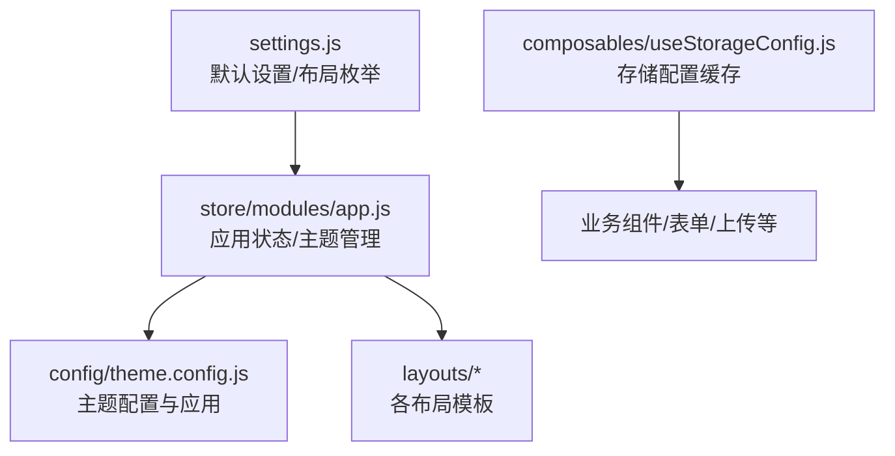
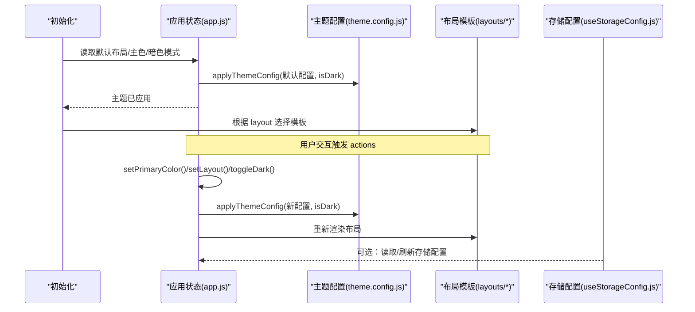
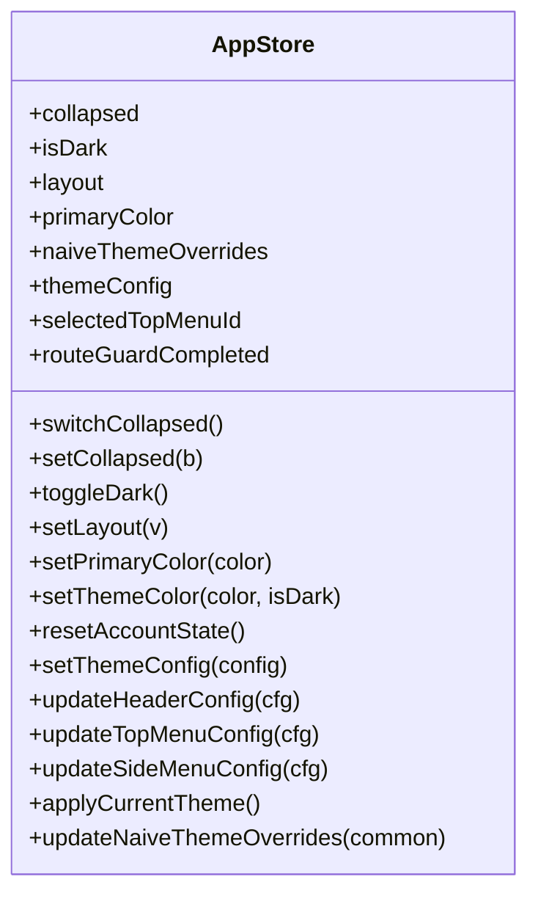
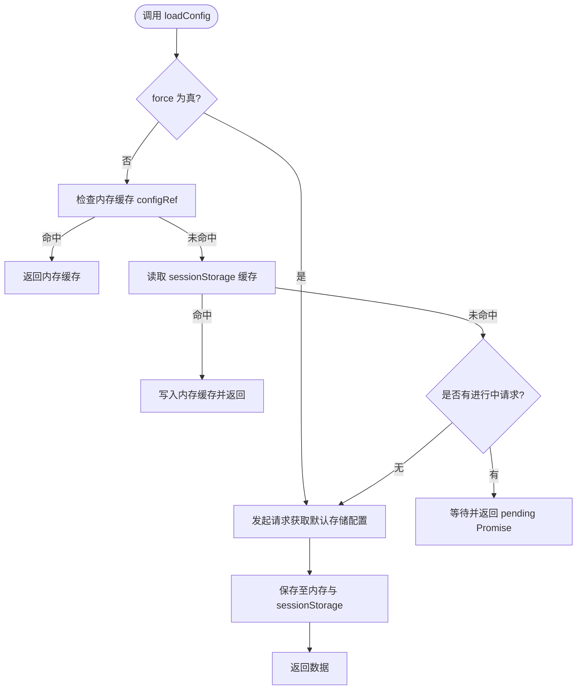
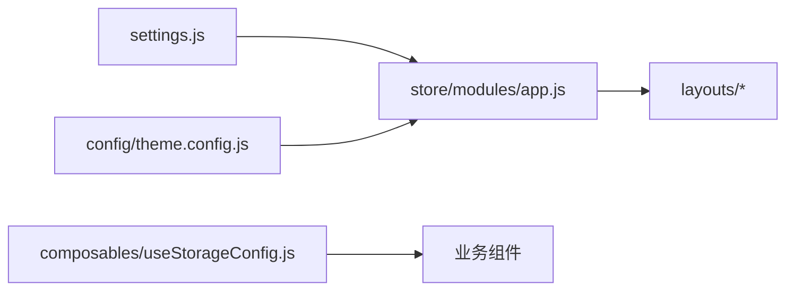

# 应用配置状态管理

<cite>
**本文引用的文件**
- [settings.js](file://forge-admin-ui/src/settings.js)
- [app.js](file://forge-admin-ui/src/store/modules/app.js)
- [theme.config.js](file://forge-admin-ui/src/config/theme.config.js)
- [useStorageConfig.js](file://forge-admin-ui/src/composables/useStorageConfig.js)
- [index.js](file://forge-admin-ui/src/store/index.js)
- [index.vue（normal 布局）](file://forge-admin-ui/src/layouts/normal/index.vue)
- [index.vue（top-menu 布局）](file://forge-admin-ui/src/layouts/top-menu/index.vue)
- [index.vue（full 布局）](file://forge-admin-ui/src/layouts/full/index.vue)
- [index.vue（immersive 布局）](file://forge-admin-ui/src/layouts/immersive/index.vue)
- [index.vue（bento 布局）](file://forge-admin-ui/src/layouts/bento/index.vue)
- [index.vue（nexus 布局）](file://forge-admin-ui/src/layouts/nexus/index.vue)
- [index.vue（simple 布局）](file://forge-admin-ui/src/layouts/simple/index.vue)
- [index.vue（empty 布局）](file://forge-admin-ui/src/layouts/empty/index.vue)
- [index.vue（app-portal 布局）](file://forge-admin-ui/src/layouts/app-portal/index.vue)
</cite>

## 目录
1. [简介](#简介)
2. [项目结构](#项目结构)
3. [核心组件](#核心组件)
4. [架构总览](#架构总览)
5. [详细组件分析](#详细组件分析)
6. [依赖关系分析](#依赖关系分析)
7. [性能考量](#性能考量)
8. [故障排查指南](#故障排查指南)
9. [结论](#结论)
10. [附录](#附录)

## 简介
本技术文档聚焦于 Forge Admin 前端的应用配置与状态管理，覆盖全局配置、主题系统、语言切换、布局模式、响应式适配、功能开关等。重点解析：
- 主题系统的实现原理：颜色变量、组件样式、动态主题切换
- 配置的加载策略、缓存机制与热更新支持
- 多布局模式的统一管理与切换
- 可持久化与跨会话的状态同步
- 扩展自定义主题与最佳实践

## 项目结构
围绕“配置与主题”的核心代码主要分布在以下位置：
- 默认设置与布局枚举：src/settings.js
- 应用状态与主题管理：src/store/modules/app.js
- 主题配置与应用：src/config/theme.config.js
- 存储配置缓存：src/composables/useStorageConfig.js
- 布局模板：src/layouts/*（按布局名称组织）

图表来源
- [settings.js:21-115](file://forge-admin-ui/src/settings.js#L21-L115)
- [app.js:1-107](file://forge-admin-ui/src/store/modules/app.js#L1-L107)
- [theme.config.js](file://forge-admin-ui/src/config/theme.config.js)
- [useStorageConfig.js:1-69](file://forge-admin-ui/src/composables/useStorageConfig.js#L1-L69)

章节来源
- [settings.js:21-115](file://forge-admin-ui/src/settings.js#L21-L115)
- [app.js:1-107](file://forge-admin-ui/src/store/modules/app.js#L1-L107)
- [useStorageConfig.js:1-69](file://forge-admin-ui/src/composables/useStorageConfig.js#L1-L69)

## 核心组件
- 应用状态 store（Pinia）：集中管理折叠态、暗色模式、布局、主色、Naive UI 主题覆盖、主题配置对象、顶部菜单选中项、路由守卫完成标记等，并提供持久化能力。
- 主题配置模块：提供默认主题配置与将主题配置应用到 DOM/CSS 变量的方法。
- 默认设置与布局：定义默认布局、可用布局列表及规范化函数，确保布局值合法。
- 存储配置 Composable：提供默认存储配置的全局缓存与懒加载，避免重复请求。

章节来源
- [app.js:12-107](file://forge-admin-ui/src/store/modules/app.js#L12-L107)
- [theme.config.js](file://forge-admin-ui/src/config/theme.config.js)
- [settings.js:21-115](file://forge-admin-ui/src/settings.js#L21-L115)
- [useStorageConfig.js:1-69](file://forge-admin-ui/src/composables/useStorageConfig.js#L1-L69)

## 架构总览
应用配置与主题的整体流程如下：
- 初始化阶段：从环境变量或默认设置读取初始布局；创建 Pinia store；应用默认主题配置。
- 运行时：用户操作触发 store actions（如切换布局、修改主色、切换暗亮模式），store 调用主题应用逻辑并更新 CSS 变量与组件主题覆盖。
- 持久化：通过 Pinia persist 将关键状态写入 sessionStorage，键名包含租户标识，保证多租户隔离。
- 布局渲染：根据当前 layout 选择对应 layouts/* 下的布局模板进行渲染。
- 存储配置：按需加载默认存储配置，缓存到内存与 sessionStorage，供组件使用。

图表来源
- [app.js:12-107](file://forge-admin-ui/src/store/modules/app.js#L12-L107)
- [theme.config.js](file://forge-admin-ui/src/config/theme.config.js)
- [settings.js:21-115](file://forge-admin-ui/src/settings.js#L21-L115)
- [useStorageConfig.js:1-69](file://forge-admin-ui/src/composables/useStorageConfig.js#L1-L69)

## 详细组件分析

### 应用状态与主题管理（store/modules/app.js）
- 状态字段
  - collapsed：侧边栏折叠状态
  - isDark：是否暗色模式（基于 @vueuse/core 的 useDark）
  - layout：当前布局，经 normalizeLayout 规范化
  - primaryColor：主色
  - naiveThemeOverrides：Naive UI 主题覆盖对象
  - themeConfig：主题配置对象（header/sideMenu/topMenu 等）
  - selectedTopMenuId：顶部菜单选中项
  - routeGuardCompleted：路由守卫完成标记
- Actions
  - switchCollapsed/setCollapsed：切换/设置折叠
  - toggleDark：切换暗色模式
  - setLayout：设置布局并规范化
  - setPrimaryColor：设置主色
  - setThemeColor：设置 CSS 变量 --primary-color，并生成明暗调色板，更新 Naive UI 主题覆盖
  - resetAccountState：重置账号相关状态为默认值，并应用默认主题
  - setThemeConfig/updateHeaderConfig/updateTopMenuConfig/updateSideMenuConfig：增量更新主题配置并应用
  - applyCurrentTheme：重新应用当前主题配置
  - updateNaiveThemeOverrides：合并更新通用主题覆盖
- 持久化
  - 使用 Pinia persist，key 包含租户标识，持久化 collapsed/layout/primaryColor/naiveThemeOverrides/themeConfig，存储介质为 sessionStorage

图表来源
- [app.js:12-107](file://forge-admin-ui/src/store/modules/app.js#L12-L107)

章节来源
- [app.js:12-107](file://forge-admin-ui/src/store/modules/app.js#L12-L107)

### 主题系统与颜色变量（config/theme.config.js）
- 职责
  - 提供默认主题配置 defaultThemeConfig
  - 提供 applyThemeConfig(themeConfig, isDark) 将主题配置应用到 DOM/CSS 变量与页面样式
- 与 store 协作
  - app store 在设置主色、切换暗亮模式、更新局部主题时调用 applyThemeConfig，确保主题即时生效
- 建议
  - 新增主题属性应在 defaultThemeConfig 中声明，并在 applyThemeConfig 中映射到 CSS 变量或类名

章节来源
- [theme.config.js](file://forge-admin-ui/src/config/theme.config.js)

### 默认设置与布局规范（settings.js）
- 默认权限与默认布局
  - basePermissions：默认错误页路由
  - defaultLayout：默认布局名称
  - defaultPrimaryColor：默认主色
  - naiveThemeOverrides：Naive UI 默认主题覆盖
- 布局配置
  - layoutSettings.layouts：可用布局列表（normal/top-menu/top-side-menu/dropdown-menu/full/simple/immersive/bento/nexus/empty/app-portal）
  - validLayoutNames：用于校验布局名称
  - normalizeLayout：将传入布局规范化为合法值，否则回退到默认布局
- 控制项
  - layoutSettingVisible：控制是否显示布局设置按钮

章节来源
- [settings.js:21-115](file://forge-admin-ui/src/settings.js#L21-L115)

### 存储配置缓存（composables/useStorageConfig.js）
- 目标
  - 提供默认存储配置的全局缓存，减少重复请求
- 机制
  - 内存缓存：configRef 作为响应式引用
  - 进程级缓存：cached/pending 避免并发重复请求
  - 会话缓存：sessionStorage 持久化至当前会话
  - 懒加载：首次访问或强制刷新时拉取后端默认配置
- 暴露接口
  - loadConfig(force)：加载配置
  - storageType/fileSize/allowedTypes：computed 获取默认值

图表来源
- [useStorageConfig.js:1-69](file://forge-admin-ui/src/composables/useStorageConfig.js#L1-L69)

章节来源
- [useStorageConfig.js:1-69](file://forge-admin-ui/src/composables/useStorageConfig.js#L1-L69)

### 布局模板与响应式适配（layouts/*）
- 布局模板
  - normal：经典侧边栏+头部布局
  - top-menu：顶部一级菜单，左侧二级及以下菜单
  - top-side-menu：顶部一级菜单，左侧侧边栏承载二级及以下菜单
  - dropdown-menu：顶部下拉菜单选择子级
  - full：全屏无边框布局
  - simple：简洁基础布局
  - immersive：沉浸式，抽屉式菜单，最大化内容区
  - bento：超窄图标导航+右侧抽屉菜单
  - nexus：浮岛卡片式侧边栏与内容区
  - empty：空布局
  - app-portal：低代码应用独立运行布局
- 响应式适配
  - 结合 store 中的 collapsed/isDark/layout 状态，在不同断点下调整侧边栏宽度、菜单展开方式与内容区域占比
  - 通过主题配置与 CSS 变量统一控制间距、圆角、阴影等视觉细节

章节来源
- [index.vue（normal 布局）](file://forge-admin-ui/src/layouts/normal/index.vue)
- [index.vue（top-menu 布局）](file://forge-admin-ui/src/layouts/top-menu/index.vue)
- [index.vue（full 布局）](file://forge-admin-ui/src/layouts/full/index.vue)
- [index.vue（immersive 布局）](file://forge-admin-ui/src/layouts/immersive/index.vue)
- [index.vue（bento 布局）](file://forge-admin-ui/src/layouts/bento/index.vue)
- [index.vue（nexus 布局）](file://forge-admin-ui/src/layouts/nexus/index.vue)
- [index.vue（simple 布局）](file://forge-admin-ui/src/layouts/simple/index.vue)
- [index.vue（empty 布局）](file://forge-admin-ui/src/layouts/empty/index.vue)
- [index.vue（app-portal 布局）](file://forge-admin-ui/src/layouts/app-portal/index.vue)

## 依赖关系分析
- 模块耦合
  - app store 依赖 settings.js 的默认值与布局规范化
  - app store 依赖 theme.config.js 的主题应用逻辑
  - 布局模板依赖 app store 的 layout/collapsed/isDark 等状态
  - useStorageConfig 与业务组件解耦，通过 computed 提供默认值
- 外部依赖
  - @arco-design/color：生成主色明暗调色板
  - @vueuse/core/useDark：检测系统暗色模式
  - pinia：状态管理与持久化

图表来源
- [settings.js:21-115](file://forge-admin-ui/src/settings.js#L21-L115)
- [app.js:12-107](file://forge-admin-ui/src/store/modules/app.js#L12-L107)
- [theme.config.js](file://forge-admin-ui/src/config/theme.config.js)
- [useStorageConfig.js:1-69](file://forge-admin-ui/src/composables/useStorageConfig.js#L1-L69)

章节来源
- [settings.js:21-115](file://forge-admin-ui/src/settings.js#L21-L115)
- [app.js:12-107](file://forge-admin-ui/src/store/modules/app.js#L12-L107)
- [theme.config.js](file://forge-admin-ui/src/config/theme.config.js)
- [useStorageConfig.js:1-69](file://forge-admin-ui/src/composables/useStorageConfig.js#L1-L69)

## 性能考量
- 主题切换
  - 使用 CSS 变量与批量更新 Naive UI 主题覆盖，避免全量重绘
  - 主色变化通过调色板生成器一次性计算，减少多次计算开销
- 布局切换
  - 仅切换布局模板与少量状态，避免整页重建
- 存储配置
  - 内存缓存+会话缓存+去重请求，降低网络压力
  - 仅在必要时强制刷新配置
- 持久化
  - 仅持久化必要字段，减小序列化体积
  - 使用 sessionStorage 而非 localStorage，避免跨会话污染

[本节为通用性能建议，不直接分析具体文件]

## 故障排查指南
- 主题不生效
  - 检查是否正确调用 setThemeColor/setThemeConfig 并传入 isDark
  - 确认 applyThemeConfig 已将 CSS 变量注入到 body
  - 验证 Naive UI 主题覆盖是否被正确合并
- 布局异常
  - 检查 normalizeLayout 返回值是否为合法布局名
  - 确认 layouts/* 中存在对应布局模板
- 暗色模式异常
  - 检查 useDark 是否正常工作，系统偏好是否与预期一致
  - 确认 toggleDark 后主题应用逻辑被触发
- 存储配置加载失败
  - 检查网络请求与后端接口返回码
  - 查看 sessionStorage 中缓存是否损坏
  - 使用 force=true 强制刷新配置

章节来源
- [app.js:30-89](file://forge-admin-ui/src/store/modules/app.js#L30-L89)
- [useStorageConfig.js:30-69](file://forge-admin-ui/src/composables/useStorageConfig.js#L30-L69)

## 结论
本项目通过 Pinia 集中管理应用配置与主题状态，结合 settings.js 的默认值与布局规范、theme.config.js 的主题应用逻辑，实现了灵活、可扩展且高性能的主题与布局体系。配合 useStorageConfig 的缓存策略，有效降低了重复请求与渲染成本。推荐在扩展主题与布局时遵循现有模式，保持配置的可维护性与一致性。

[本节为总结性内容，不直接分析具体文件]

## 附录

### 主题系统实现要点
- 颜色变量
  - 通过 CSS 变量 --primary-color 暴露主色，便于全局引用
  - 使用调色板生成器输出明暗两套色系，提升可读性与对比度
- 组件样式
  - 通过 Naive UI 主题覆盖统一按钮、输入框等组件风格
  - 主题配置对象支持 header/sideMenu/topMenu 等局部定制
- 动态切换
  - 切换主色/暗亮模式/布局时，立即应用主题配置，无需刷新页面

章节来源
- [app.js:36-89](file://forge-admin-ui/src/store/modules/app.js#L36-L89)
- [theme.config.js](file://forge-admin-ui/src/config/theme.config.js)

### 配置加载策略与缓存机制
- 加载顺序
  - 环境变量优先，其次默认设置
  - 首次访问拉取后端默认存储配置，后续使用内存与会话缓存
- 缓存策略
  - 内存缓存：当前会话内快速读取
  - 会话缓存：跨组件共享，关闭标签页失效
  - 去重请求：pending 标志防止并发重复请求

章节来源
- [useStorageConfig.js:1-69](file://forge-admin-ui/src/composables/useStorageConfig.js#L1-L69)

### 国际化与功能开关
- 国际化
  - 当前仓库未直接展示 i18n 配置，建议在组件与文案处统一接入 i18n 插件，并通过 store 或配置中心管理语言包
- 功能开关
  - 可通过 themeConfig 或独立的 feature flags 配置对象管理功能开关，结合路由守卫与条件渲染实现

[本节为概念性说明，不直接分析具体文件]

### 最佳实践
- 扩展自定义主题
  - 在 defaultThemeConfig 中新增字段，并在 applyThemeConfig 中映射到 CSS 变量或类名
  - 通过 setThemeConfig 增量更新，避免覆盖其他配置
- 扩展布局
  - 在 settings.js 的 layouts 中添加新布局描述，并确保 layouts/* 中有对应模板
  - 使用 normalizeLayout 保证布局值合法性
- 性能优化
  - 避免在高频操作中频繁读写 sessionStorage
  - 合理使用 computed 与 watch，减少不必要的重渲染
  - 对大对象（如主题覆盖）采用浅合并策略

[本节为通用最佳实践，不直接分析具体文件]