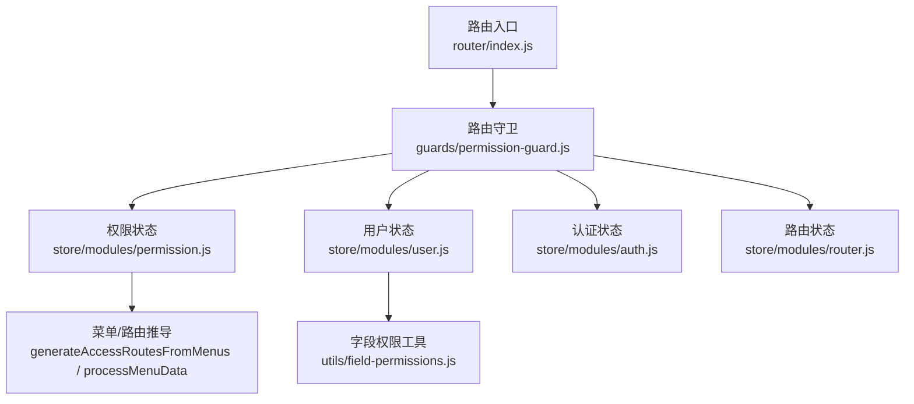
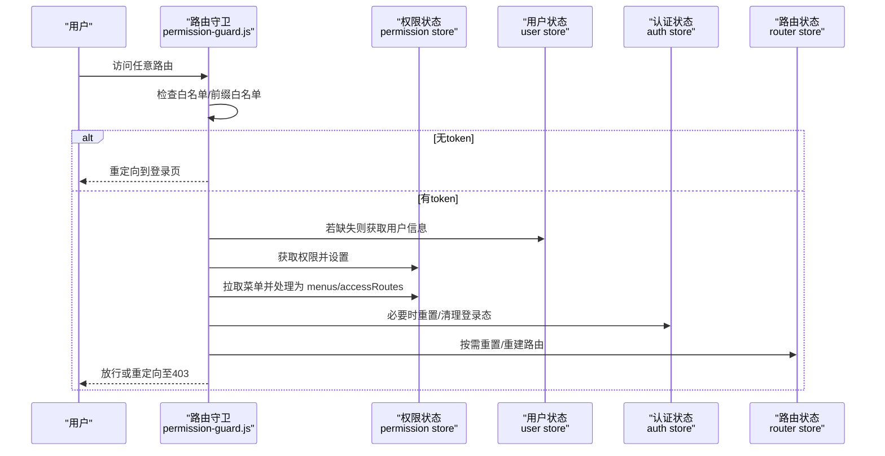
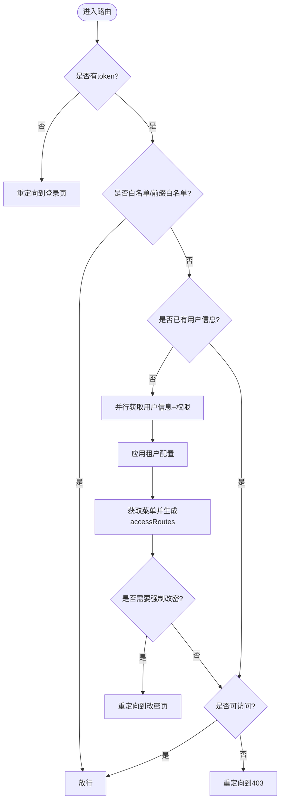
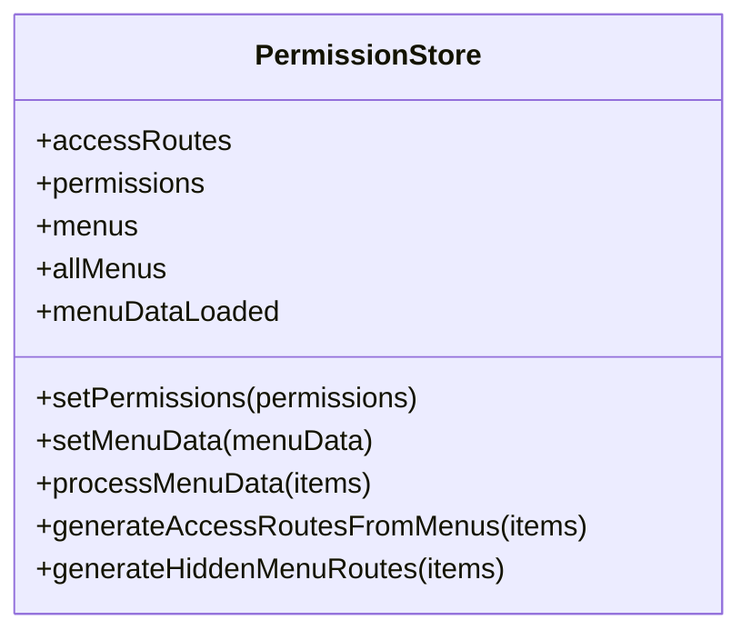
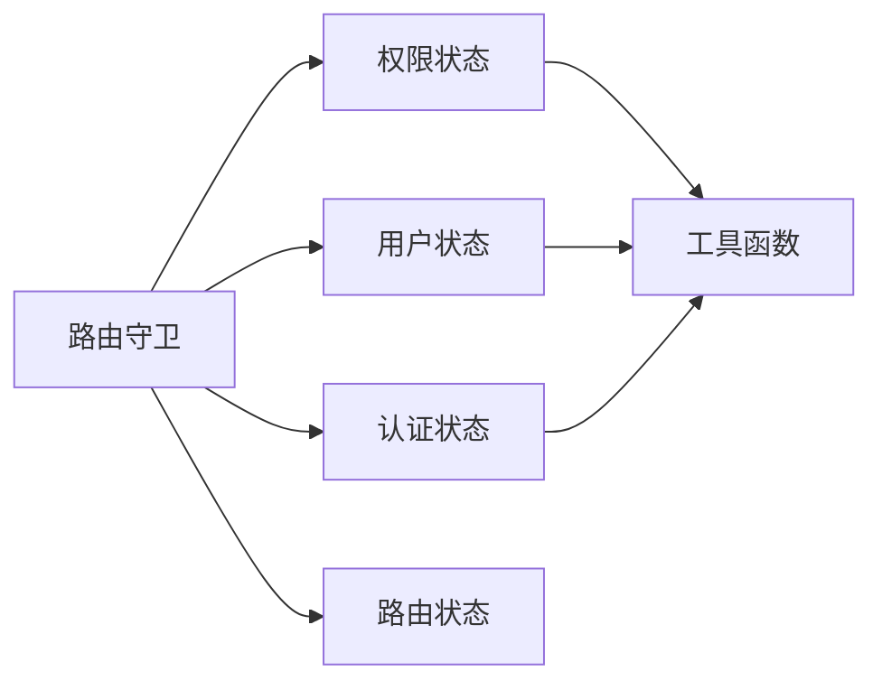

# 权限路由状态管理

<cite>
**本文引用的文件**
- [src/router/index.js](file://forge-admin-ui/src/router/index.js)
- [src/router/guards/permission-guard.js](file://forge-admin-ui/src/router/guards/permission-guard.js)
- [src/store/modules/permission.js](file://forge-admin-ui/src/store/modules/permission.js)
- [src/store/modules/auth.js](file://forge-admin-ui/src/store/modules/auth.js)
- [src/store/modules/user.js](file://forge-admin-ui/src/store/modules/user.js)
- [src/store/modules/router.js](file://forge-admin-ui/src/store/modules/router.js)
- [src/utils/field-permissions.js](file://forge-admin-ui/src/utils/field-permissions.js)
</cite>

## 目录
1. [简介](#简介)
2. [项目结构](#项目结构)
3. [核心组件](#核心组件)
4. [架构总览](#架构总览)
5. [详细组件分析](#详细组件分析)
6. [依赖关系分析](#依赖关系分析)
7. [性能考虑](#性能考虑)
8. [故障排查指南](#故障排查指南)
9. [结论](#结论)
10. [附录](#附录)

## 简介
本技术文档聚焦于前端权限与路由状态管理，围绕动态路由生成、菜单权限控制、页面访问权限的状态机制展开。重点说明 RBAC 在前端的落地方式（角色/权限映射、按钮级权限、路由守卫），并深入解析 useMenu 组合式函数在菜单数据获取、权限过滤、动态渲染中的工作原理。同时覆盖多级菜单、面包屑导航、路由缓存等高级能力的实现思路，并提供扩展、优化与安全加固的最佳实践建议。

## 项目结构
本项目采用模块化组织：
- 路由层：集中定义手动路由与自动路由合并策略，并通过守卫进行鉴权与初始化。
- 状态层：使用 Pinia 模块化管理认证、用户、权限、路由、标签页等状态。
- 工具层：提供字段权限归一化、租户配置应用、加密密钥交换等能力。

图表来源
- [src/router/index.js:263-286](file://forge-admin-ui/src/router/index.js#L263-L286)
- [src/router/guards/permission-guard.js:87-275](file://forge-admin-ui/src/router/guards/permission-guard.js#L87-L275)
- [src/store/modules/permission.js:14-368](file://forge-admin-ui/src/store/modules/permission.js#L14-L368)
- [src/store/modules/user.js:26-137](file://forge-admin-ui/src/store/modules/user.js#L26-L137)
- [src/store/modules/auth.js:7-112](file://forge-admin-ui/src/store/modules/auth.js#L7-L112)
- [src/store/modules/router.js:1-19](file://forge-admin-ui/src/store/modules/router.js#L1-L19)
- [src/utils/field-permissions.js:1-146](file://forge-admin-ui/src/utils/field-permissions.js#L1-L146)

章节来源
- [src/router/index.js:24-286](file://forge-admin-ui/src/router/index.js#L24-L286)

## 核心组件
- 路由守卫（permission-guard）：负责无 token 跳转登录、token 校验、用户信息与权限拉取、菜单数据加载、租户配置应用、强制改密拦截、未授权重定向等。
- 权限状态（permission store）：维护 accessRoutes、permissions、menus、allMenus、menuDataLoaded；提供 setPermissions、setMenuData、processMenuData、generateAccessRoutesFromMenus、generateHiddenMenuRoutes 等方法，完成从后端菜单到前端可访问路由的转换。
- 用户状态（user store）：保存 userInfo/staffInfo/dataPermission，暴露 roles、permissions、apiPermissions 等 getter，用于角色/权限判断。
- 认证状态（auth store）：管理 accessToken、退出登录流程、重置登录态时清理路由/用户/权限/Tabs/租户配置等。
- 路由状态（router store）：封装 resetRouter，支持按 accessRoutes 移除已注册路由，配合权限切换或登出后重建。
- 字段权限工具（field-permissions）：将多种格式的字段权限统一为 { field, readable, writable, required } 列表，便于表单/表格的细粒度权限控制。

章节来源
- [src/router/guards/permission-guard.js:87-275](file://forge-admin-ui/src/router/guards/permission-guard.js#L87-L275)
- [src/store/modules/permission.js:14-368](file://forge-admin-ui/src/store/modules/permission.js#L14-L368)
- [src/store/modules/user.js:26-137](file://forge-admin-ui/src/store/modules/user.js#L26-L137)
- [src/store/modules/auth.js:7-112](file://forge-admin-ui/src/store/modules/auth.js#L7-L112)
- [src/store/modules/router.js:1-19](file://forge-admin-ui/src/store/modules/router.js#L1-L19)
- [src/utils/field-permissions.js:1-146](file://forge-admin-ui/src/utils/field-permissions.js#L1-L146)

## 架构总览
下图展示了从路由进入、守卫鉴权、拉取用户信息/权限/菜单、构建可访问路由，再到页面渲染与缓存的全链路。

图表来源
- [src/router/guards/permission-guard.js:87-275](file://forge-admin-ui/src/router/guards/permission-guard.js#L87-L275)
- [src/store/modules/permission.js:14-368](file://forge-admin-ui/src/store/modules/permission.js#L14-L368)
- [src/store/modules/user.js:26-137](file://forge-admin-ui/src/store/modules/user.js#L26-L137)
- [src/store/modules/auth.js:7-112](file://forge-admin-ui/src/store/modules/auth.js#L7-L112)
- [src/store/modules/router.js:1-19](file://forge-admin-ui/src/store/modules/router.js#L1-L19)

## 详细组件分析

### 路由守卫与RBAC权限模型
- 白名单与路径匹配：对根路径、首页、个人中心、MCP授权、错误页以及 workspace 前缀进行放行；其余路径需通过 accessRoutes 匹配。
- 无 token 处理：直接跳转登录页，携带 redirect 参数以便登录后回跳。
- 登录页特殊逻辑：尝试验证 token，有效则跳转首页，无效则允许继续登录。
- 首次加载：并行获取用户信息与权限，持久化本地存储，加载租户配置，拉取菜单并转换为 menus/accessRoutes，初始化 WebSocket。
- 强制改密：当用户需要强制修改密码时，除目标改密页外均重定向至改密页。
- 未授权处理：无法访问的目标路由将被重定向到 403，并附带来源信息。

图表来源
- [src/router/guards/permission-guard.js:87-275](file://forge-admin-ui/src/router/guards/permission-guard.js#L87-L275)

章节来源
- [src/router/guards/permission-guard.js:10-275](file://forge-admin-ui/src/router/guards/permission-guard.js#L10-L275)

### 权限状态与动态路由生成
- 权限与菜单：setPermissions 仅保留 MENU 类型项并排序；setMenuData 基于后端菜单树生成 menus，并同步生成 accessRoutes（可见菜单对应的路由）。
- 隐藏菜单路由：generateHiddenMenuRoutes 从原始菜单中抽取 hidden 的菜单项，补充 meta.title 等元信息，确保内部跳转与标题正确。
- 外链与组件路径：对外链资源使用 iframe 组件承载；组件路径统一规范化为 /src/views/*.vue。
- 首页默认：若无配置的 homePath，则取第一个叶子节点作为首页。

图表来源
- [src/store/modules/permission.js:14-368](file://forge-admin-ui/src/store/modules/permission.js#L14-L368)

章节来源
- [src/store/modules/permission.js:24-303](file://forge-admin-ui/src/store/modules/permission.js#L24-L303)

### 用户与认证状态
- 用户状态：保存用户基本信息、员工信息、数据权限，并提供 roles/permissions/apiPermissions 等 getter 供权限判断使用。
- 认证状态：管理 token、退出流程、重置登录态时清理路由/用户/权限/Tabs/租户配置，并断开 WebSocket、重置密钥交换状态。

章节来源
- [src/store/modules/user.js:26-137](file://forge-admin-ui/src/store/modules/user.js#L26-L137)
- [src/store/modules/auth.js:7-112](file://forge-admin-ui/src/store/modules/auth.js#L7-L112)

### 路由状态与路由重建
- 路由状态：提供 resetRouter，根据传入的 accessRoutes 逐个移除已注册路由，配合权限切换或登出后重建路由表。

章节来源
- [src/store/modules/router.js:1-19](file://forge-admin-ui/src/store/modules/router.js#L1-L19)

### 字段级权限控制
- 字段权限归一化：支持多种输入格式（数组、对象、字符串），统一输出 { field, readable, writable, required } 列表，便于表单/表格的显示与编辑控制。
- 别名兼容：支持 snake_case/camelCase 字段名别名映射，提升兼容性。

章节来源
- [src/utils/field-permissions.js:1-146](file://forge-admin-ui/src/utils/field-permissions.js#L1-L146)

### useMenu 组合式函数的工作原理
- 职责边界：useMenu 通常负责消费 permission store 中的菜单数据，结合当前用户权限进行过滤，并将结果提供给侧边栏/顶部菜单/面包屑等组件渲染。
- 典型流程：
  - 读取 menus/allMenus 与 permissions/accessRoutes。
  - 根据 visible/menuStatus/type 等字段过滤展示项。
  - 将后端菜单树转换为前端菜单树（含 icon、order、children 等）。
  - 为面包屑提供 allMenus 查找能力，保证隐藏菜单也能正确显示标题。
  - 与路由联动：点击菜单项触发路由跳转，由守卫再次校验访问权限。
- 注意：具体实现位于 composables/useMenu.js（本仓库中存在该文件），其调用上述 store 方法完成数据准备与权限过滤。

章节来源
- [src/store/modules/permission.js:14-368](file://forge-admin-ui/src/store/modules/permission.js#L14-L368)

### 多级菜单、面包屑与路由缓存
- 多级菜单：processMenuData 递归处理 children，保持层级结构并按 order 排序。
- 面包屑：allMenus 扁平化所有菜单（含隐藏），便于根据 path 快速定位标题，形成面包屑路径。
- 路由缓存：菜单 meta.keepAlive 控制页面组件是否启用 keep-alive，减少重复渲染开销。

章节来源
- [src/store/modules/permission.js:148-303](file://forge-admin-ui/src/store/modules/permission.js#L148-L303)

## 依赖关系分析
- 路由守卫依赖：
  - 用户状态：获取/设置用户信息。
  - 权限状态：设置权限与菜单，生成可访问路由。
  - 认证状态：处理 token、退出、重置登录态。
  - 路由状态：重置/重建路由。
  - 工具：密钥交换、WebSocket、租户配置应用。
- 权限状态依赖：
  - 工具：isExternal、路径规范化等。
- 字段权限工具：被表单/表格等组件复用，提供统一的字段权限数据结构。

图表来源
- [src/router/guards/permission-guard.js:87-275](file://forge-admin-ui/src/router/guards/permission-guard.js#L87-L275)
- [src/store/modules/permission.js:14-368](file://forge-admin-ui/src/store/modules/permission.js#L14-L368)
- [src/store/modules/user.js:26-137](file://forge-admin-ui/src/store/modules/user.js#L26-L137)
- [src/store/modules/auth.js:7-112](file://forge-admin-ui/src/store/modules/auth.js#L7-L112)
- [src/store/modules/router.js:1-19](file://forge-admin-ui/src/store/modules/router.js#L1-L19)
- [src/utils/field-permissions.js:1-146](file://forge-admin-ui/src/utils/field-permissions.js#L1-L146)

章节来源
- [src/router/guards/permission-guard.js:87-275](file://forge-admin-ui/src/router/guards/permission-guard.js#L87-L275)
- [src/store/modules/permission.js:14-368](file://forge-admin-ui/src/store/modules/permission.js#L14-L368)

## 性能考虑
- 并发请求：在首次加载时并行获取用户信息与权限，减少首屏等待时间。
- 菜单处理优化：
  - 仅在必要阶段生成 accessRoutes，避免重复计算。
  - 使用扁平 allMenus 加速面包屑查找。
- 路由重建：在切换角色或登出时，通过 resetRouter 精确移除旧路由，再按需重新注册，避免全量重建带来的抖动。
- 缓存策略：利用 keepAlive 控制页面缓存，减少重复渲染；合理设置 skipTab 与 preserveOnQuery 减少不必要的标签页创建。
- 网络与加密：在进入任何加密接口前完成密钥交换，避免后续请求失败重试造成的延迟。

[本节为通用性能建议，不直接分析具体文件]

## 故障排查指南
- 无法访问页面：
  - 检查是否在白名单或前缀白名单内。
  - 确认 accessRoutes 是否包含目标路径（注意路径规范化与查询串剥离）。
  - 查看是否命中强制改密逻辑。
- 菜单不显示：
  - 检查菜单 resourceType 是否为目录/菜单，visible/menuStatus 是否被隐藏。
  - 确认 component 路径是否规范为 /src/views/*.vue。
- 路由守卫异常：
  - 关注密钥交换是否成功、WebSocket 初始化是否完成。
  - 检查用户信息/权限/菜单获取是否失败，必要时走恢复流程。
- 字段权限不生效：
  - 确认字段权限数据格式是否被正确归一化。
  - 检查组件是否正确消费 readable/writable/required 字段。

章节来源
- [src/router/guards/permission-guard.js:87-275](file://forge-admin-ui/src/router/guards/permission-guard.js#L87-L275)
- [src/store/modules/permission.js:148-303](file://forge-admin-ui/src/store/modules/permission.js#L148-L303)
- [src/utils/field-permissions.js:1-146](file://forge-admin-ui/src/utils/field-permissions.js#L1-L146)

## 结论
本项目通过“路由守卫 + Pinia 状态 + 菜单驱动”的组合，实现了完善的 RBAC 权限体系与动态路由能力。权限状态负责将后端菜单与权限转化为前端可访问路由，路由守卫保障访问安全，用户与认证状态支撑登录态与会话生命周期，字段权限工具提供细粒度 UI 控制。整体架构清晰、可扩展性强，适合企业级后台系统的权限与路由管理需求。

[本节为总结性内容，不直接分析具体文件]

## 附录
- 最佳实践
  - 权限扩展：在后端菜单中新增 perms 标识，前端通过 accessRoutes 与按钮级指令/组件进行控制。
  - 安全防护：始终在守卫中进行最终权限判定；对敏感操作增加二次确认与服务端校验。
  - 性能优化：合理使用 keepAlive、skipTab、懒加载组件；避免在守卫中进行重型计算。
  - 可维护性：统一菜单数据结构与路径规范；对隐藏菜单补充 meta.title 以支持面包屑。
- 常见问题
  - 路径不一致导致无法匹配：确保路径规范化与查询串剥离。
  - 外链与内嵌混合：外链通过 iframe 承载，内联组件路径统一规范。
  - 多租户场景：在获取用户信息后及时加载并应用租户配置。

[本节为通用指导，不直接分析具体文件]