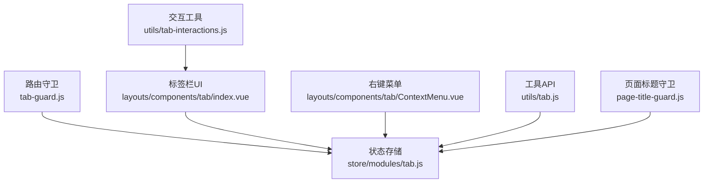
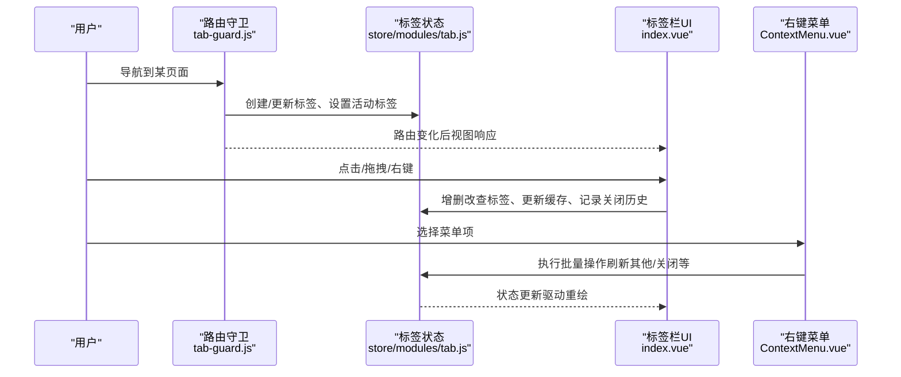
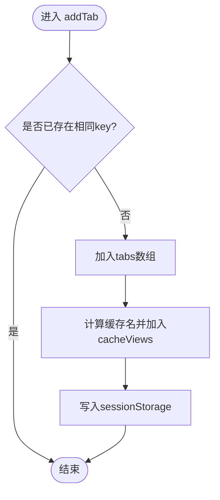
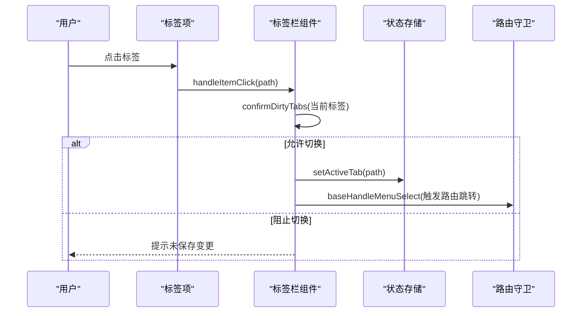
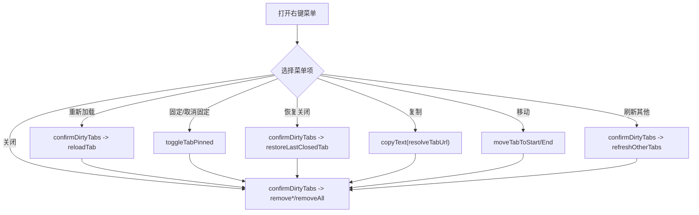
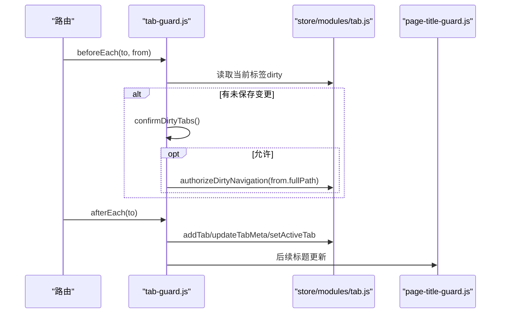
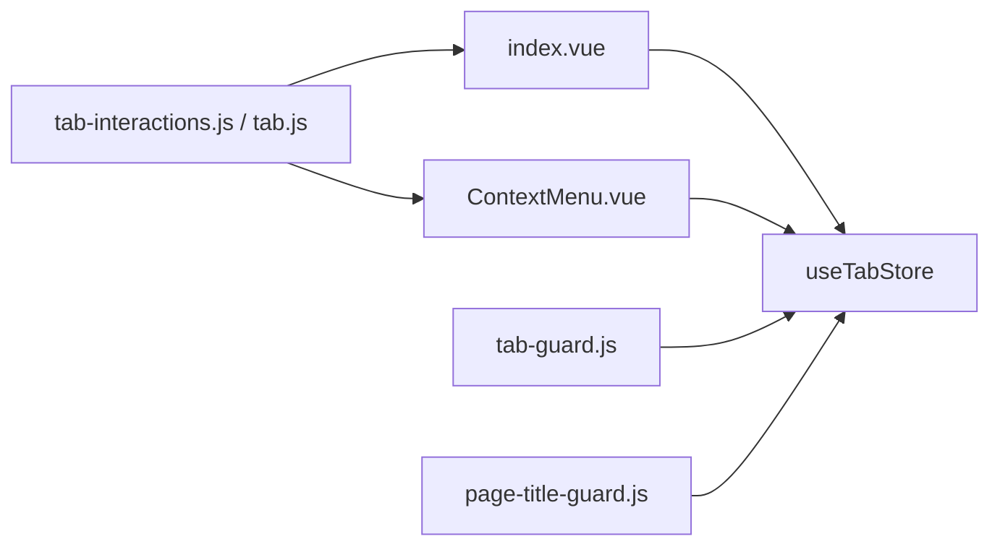

# 标签页工作区状态管理

<cite>
**本文引用的文件**
- [tab.js](file://forge-admin-ui/src/store/modules/tab.js)
- [index.vue](file://forge-admin-ui/src/layouts/components/tab/index.vue)
- [ContextMenu.vue](file://forge-admin-ui/src/layouts/components/tab/ContextMenu.vue)
- [tab-interactions.js](file://forge-admin-ui/src/utils/tab-interactions.js)
- [tab.js](file://forge-admin-ui/src/utils/tab.js)
- [tab-guard.js](file://forge-admin-ui/src/router/guards/tab-guard.js)
- [page-title-guard.js](file://forge-admin-ui/src/router/guards/page-title-guard.js)
</cite>

## 目录
1. [简介](#简介)
2. [项目结构](#项目结构)
3. [核心组件](#核心组件)
4. [架构总览](#架构总览)
5. [详细组件分析](#详细组件分析)
6. [依赖关系分析](#依赖关系分析)
7. [性能与内存优化](#性能与内存优化)
8. [故障排查指南](#故障排查指南)
9. [结论](#结论)
10. [附录：最佳实践与扩展指南](#附录最佳实践与扩展指南)

## 简介
本技术文档围绕“标签页工作区状态管理”展开，系统解析多标签页的打开、关闭、刷新、锁定（固定）、分组、拖拽排序、右键菜单等交互的状态管理机制；深入说明页面缓存策略、内存管理与性能优化方案；并给出标签页扩展、自定义缓存策略与用户体验优化的最佳实践。

## 项目结构
前端采用 Pinia 作为状态中心，Vue 组件负责 UI 交互，路由守卫在导航时维护标签页状态，工具函数提供统一的交互能力。关键文件职责如下：
- 状态层：store/modules/tab.js 集中管理标签列表、活动标签、缓存视图、关闭历史、脏标记等
- 视图层：layouts/components/tab/index.vue 渲染标签栏、处理拖拽、滚动、搜索、键盘快捷键、右键菜单触发
- 菜单层：layouts/components/tab/ContextMenu.vue 实现右键菜单及批量操作
- 工具层：utils/tab-interactions.js 提供未保存变更确认、复制 URL 等通用交互；utils/tab.js 封装常用标签页操作 API
- 路由层：router/guards/tab-guard.js 在路由切换时维护标签页、标题、是否跳过标签等

图表来源
- [tab-guard.js:71-107](file://forge-admin-ui/src/router/guards/tab-guard.js#L71-L107)
- [tab.js:26-409](file://forge-admin-ui/src/store/modules/tab.js#L26-L409)
- [index.vue:169-540](file://forge-admin-ui/src/layouts/components/tab/index.vue#L169-L540)
- [ContextMenu.vue:13-306](file://forge-admin-ui/src/layouts/components/tab/ContextMenu.vue#L13-L306)
- [tab-interactions.js:1-54](file://forge-admin-ui/src/utils/tab-interactions.js#L1-L54)
- [tab.js:1-229](file://forge-admin-ui/src/utils/tab.js#L1-L229)
- [page-title-guard.js:1-60](file://forge-admin-ui/src/router/guards/page-title-guard.js#L1-L60)

章节来源
- [tab.js:26-409](file://forge-admin-ui/src/store/modules/tab.js#L26-L409)
- [index.vue:169-540](file://forge-admin-ui/src/layouts/components/tab/index.vue#L169-L540)
- [ContextMenu.vue:13-306](file://forge-admin-ui/src/layouts/components/tab/ContextMenu.vue#L13-L306)
- [tab-interactions.js:1-54](file://forge-admin-ui/src/utils/tab-interactions.js#L1-L54)
- [tab.js:1-229](file://forge-admin-ui/src/utils/tab.js#L1-L229)
- [tab-guard.js:71-107](file://forge-admin-ui/src/router/guards/tab-guard.js#L71-L107)
- [page-title-guard.js:1-60](file://forge-admin-ui/src/router/guards/page-title-guard.js#L1-L60)

## 核心组件
- 标签状态存储（Pinia）：维护 tabs、activeTab、closedTabs、cacheViews、reloading、dirtyNavigationBypassPath 等状态，并提供 add/remove/update/pin/unpin/reorder/move/close/refresh/reset 等操作
- 标签栏 UI：基于 vuedraggable 实现拖拽排序，支持滚动、搜索、键盘快捷键、未保存变更提示、分组标识、固定/关闭按钮
- 右键菜单：提供重新加载、固定/取消固定、恢复刚关闭、复制地址、移动位置、批量关闭、刷新其他等
- 路由守卫：在进入/离开页面时校验未保存变更、创建或更新标签、设置标题、支持 skipTab 静默模式
- 工具函数：统一未保存变更确认、URL 生成与复制、常用标签页操作的封装

章节来源
- [tab.js:26-409](file://forge-admin-ui/src/store/modules/tab.js#L26-L409)
- [index.vue:169-540](file://forge-admin-ui/src/layouts/components/tab/index.vue#L169-L540)
- [ContextMenu.vue:13-306](file://forge-admin-ui/src/layouts/components/tab/ContextMenu.vue#L13-L306)
- [tab-guard.js:71-107](file://forge-admin-ui/src/router/guards/tab-guard.js#L71-L107)
- [tab-interactions.js:1-54](file://forge-admin-ui/src/utils/tab-interactions.js#L1-L54)
- [tab.js:1-229](file://forge-admin-ui/src/utils/tab.js#L1-L229)

## 架构总览
标签页工作区的核心流程由“路由 → 状态 → 视图”构成：
- 路由进入时，守卫根据目标路由决定是否创建/更新标签、是否跳过标签、是否更新标题
- 视图层通过 store 读写标签状态，驱动 UI 渲染与交互
- 右键菜单与工具函数调用 store 方法完成复杂操作（如批量关闭、刷新其他）
- 页面缓存通过 cacheViews 控制 keep-alive 行为，结合 reloadTab 实现精准刷新

图表来源
- [tab-guard.js:71-107](file://forge-admin-ui/src/router/guards/tab-guard.js#L71-L107)
- [tab.js:26-409](file://forge-admin-ui/src/store/modules/tab.js#L26-L409)
- [index.vue:169-540](file://forge-admin-ui/src/layouts/components/tab/index.vue#L169-L540)
- [ContextMenu.vue:13-306](file://forge-admin-ui/src/layouts/components/tab/ContextMenu.vue#L13-L306)

## 详细组件分析

### 标签状态存储（store/modules/tab.js）
- 数据模型
  - tabs：标签数组，包含 path/key/title/icon/pinned/dirty/dirtyMessage/keepAlive/closable/forceClosable 等字段
  - activeTab：当前活动标签 key
  - closedTabs：最近关闭的标签历史（最多保留 N 条）
  - cacheViews：用于 keep-alive 的视图缓存名列表
  - reloading：刷新时的过渡状态
  - dirtyNavigationBypassPath：允许绕过未保存变更检查的路径白名单
- 持久化
  - 使用 sessionStorage 持久化 tabs 与 closedTabs，按租户隔离键名
- 核心动作
  - 打开/添加：addTab 去重添加，同时加入 cacheViews
  - 关闭：removeTab/removeTabSilently 删除标签、记录关闭历史、清理缓存、必要时跳转
  - 固定/解锁：pin/unpin/toggle 以及批量 pinAll/unpinAll
  - 排序与移动：reorder/moveToStart/moveToEnd，保持 pinned 组与非 pinned 组的相对顺序
  - 脏标记：setTabDirty + authorizeDirtyNavigation/consumeDirtyNavigation 配合路由守卫
  - 批量关闭：removeOther/removeLeft/removeRight/removeAll/closeUnpinnedTabs
  - 刷新：reloadTab（针对 keepAlive 页面临时移除再恢复 keepAlive，触发卸载/挂载），refreshOtherTabs（清理非当前标签缓存并重置脏标记）
  - 重置：resetTabs 清空所有状态与持久化

图表来源
- [tab.js:56-69](file://forge-admin-ui/src/store/modules/tab.js#L56-L69)

章节来源
- [tab.js:26-409](file://forge-admin-ui/src/store/modules/tab.js#L26-L409)

### 标签栏 UI（layouts/components/tab/index.vue）
- 功能要点
  - 拖拽排序：vuedraggable 绑定 model-value，限制只能在同组（pinned/non-pinned）内移动
  - 滚动与可视：监听 scroll、ResizeObserver，动态显示左右滚动箭头
  - 搜索面板：按 title/path 过滤，支持快速定位与激活
  - 键盘快捷键：Ctrl+W 关闭当前、Ctrl+Tab 切换、Alt+数字 直接切到对应标签
  - 未保存变更：监听 forge:tab-dirty 事件，beforeunload 拦截
  - 分组标识：根据路径前缀为标签添加分组色点（system/flow/app/data/develop/message）
  - 右键菜单触发：contextmenu 事件传递坐标与当前路径
- 交互逻辑
  - 点击：若当前标签有未保存变更，先弹出确认；通过后授权导航并切换
  - 双击：非固定标签双击关闭
  - 中键：中键点击关闭标签
  - 关闭：isTabClosable 判断是否可关闭（考虑 pinned/closable/forceClosable/数量）

图表来源
- [index.vue:233-242](file://forge-admin-ui/src/layouts/components/tab/index.vue#L233-L242)
- [tab-interactions.js:1-26](file://forge-admin-ui/src/utils/tab-interactions.js#L1-L26)
- [tab-guard.js:71-84](file://forge-admin-ui/src/router/guards/tab-guard.js#L71-L84)

章节来源
- [index.vue:169-540](file://forge-admin-ui/src/layouts/components/tab/index.vue#L169-L540)
- [tab-interactions.js:1-54](file://forge-admin-ui/src/utils/tab-interactions.js#L1-L54)
- [tab-guard.js:71-84](file://forge-admin-ui/src/router/guards/tab-guard.js#L71-L84)

### 右键菜单（layouts/components/tab/ContextMenu.vue）
- 菜单项
  - 重新加载：仅对当前活动标签可用
  - 固定/取消固定：切换 pinned 标志
  - 恢复刚关闭的标签：从 closedTabs 恢复并跳转
  - 页面操作：复制地址、复制名称和地址、新窗口打开
  - 标签整理：移动到最左/最右、固定全部/取消全部、刷新其他
  - 关闭：关闭当前/其他/左侧/右侧/未固定/全部
- 交互保护
  - 所有可能丢失数据的操作均通过 confirmDirtyTabs 进行二次确认
  - 涉及导航的操作会调用 authorizeDirtyNavigation 放行

图表来源
- [ContextMenu.vue:68-293](file://forge-admin-ui/src/layouts/components/tab/ContextMenu.vue#L68-L293)
- [tab-interactions.js:1-54](file://forge-admin-ui/src/utils/tab-interactions.js#L1-L54)
- [tab.js:26-409](file://forge-admin-ui/src/store/modules/tab.js#L26-L409)

章节来源
- [ContextMenu.vue:13-306](file://forge-admin-ui/src/layouts/components/tab/ContextMenu.vue#L13-L306)
- [tab-interactions.js:1-54](file://forge-admin-ui/src/utils/tab-interactions.js#L1-L54)
- [tab.js:26-409](file://forge-admin-ui/src/store/modules/tab.js#L26-L409)

### 路由守卫（router/guards/tab-guard.js）
- beforeEnter
  - 若上一个标签存在未保存变更且不在白名单，则弹窗确认；确认后授权一次导航
- afterEnter
  - 排除 skipTab 的页面（静默移除标签）
  - 创建或更新标签：以 fullPath 作为 key，path 保存完整路径，title 优先 meta.title，兼容业务运行时 title
  - 设置活动标签

图表来源
- [tab-guard.js:71-107](file://forge-admin-ui/src/router/guards/tab-guard.js#L71-L107)
- [page-title-guard.js:54-60](file://forge-admin-ui/src/router/guards/page-title-guard.js#L54-L60)
- [tab.js:26-409](file://forge-admin-ui/src/store/modules/tab.js#L26-L409)

章节来源
- [tab-guard.js:71-107](file://forge-admin-ui/src/router/guards/tab-guard.js#L71-L107)
- [page-title-guard.js:1-60](file://forge-admin-ui/src/router/guards/page-title-guard.js#L1-L60)

### 工具函数（utils/tab.js 与 utils/tab-interactions.js）
- tab-interactions.js
  - confirmDirtyTabs：统一未保存变更确认，支持降级到原生 confirm
  - resolveTabUrl/copyText：生成 URL 并安全复制到剪贴板
- tab.js
  - closePage/closePages/closeAndOpen：关闭指定/多个标签，支持关闭后跳转
  - reloadPage：刷新指定标签（含 keepAlive 场景）
  - closeOtherPages/closeLeftPages/closeRightPages/closeAllPages：批量关闭封装

章节来源
- [tab-interactions.js:1-54](file://forge-admin-ui/src/utils/tab-interactions.js#L1-L54)
- [tab.js:1-229](file://forge-admin-ui/src/utils/tab.js#L1-L229)

## 依赖关系分析
- 松耦合设计
  - UI 组件仅依赖 store 暴露的方法，不直接操作路由
  - 路由守卫只负责状态同步与权限/标题相关逻辑
  - 工具函数解耦具体实现，便于复用与测试
- 关键依赖链
  - index.vue → useTabStore → actions（增删改查、缓存、持久化）
  - ContextMenu.vue → useTabStore + tab-interactions（交互确认、URL 复制）
  - tab-guard.js → useTabStore（创建/更新/活动标签）
  - page-title-guard.js → useTabStore（读取标签标题）

图表来源
- [index.vue:169-540](file://forge-admin-ui/src/layouts/components/tab/index.vue#L169-L540)
- [ContextMenu.vue:13-306](file://forge-admin-ui/src/layouts/components/tab/ContextMenu.vue#L13-L306)
- [tab-guard.js:71-107](file://forge-admin-ui/src/router/guards/tab-guard.js#L71-L107)
- [page-title-guard.js:1-60](file://forge-admin-ui/src/router/guards/page-title-guard.js#L1-L60)
- [tab-interactions.js:1-54](file://forge-admin-ui/src/utils/tab-interactions.js#L1-L54)
- [tab.js:1-229](file://forge-admin-ui/src/utils/tab.js#L1-L229)

章节来源
- [index.vue:169-540](file://forge-admin-ui/src/layouts/components/tab/index.vue#L169-L540)
- [ContextMenu.vue:13-306](file://forge-admin-ui/src/layouts/components/tab/ContextMenu.vue#L13-L306)
- [tab-guard.js:71-107](file://forge-admin-ui/src/router/guards/tab-guard.js#L71-L107)
- [page-title-guard.js:1-60](file://forge-admin-ui/src/router/guards/page-title-guard.js#L1-L60)
- [tab-interactions.js:1-54](file://forge-admin-ui/src/utils/tab-interactions.js#L1-L54)
- [tab.js:1-229](file://forge-admin-ui/src/utils/tab.js#L1-L229)

## 性能与内存优化
- 页面缓存策略
  - 使用 cacheViews 维护 keep-alive 列表，避免重复缓存与无效缓存
  - 关闭/批量关闭/刷新其他时同步清理 cacheViews，减少无用实例驻留
- 刷新机制
  - reloadTab 对 keepAlive 页面采用“临时移除 keepAlive → nextTick → 恢复 keepAlive”的方式，确保卸载后再挂载，达到精确刷新
  - refreshOtherTabs 清理非当前标签的缓存并重置脏标记，降低整体内存占用
- 持久化与序列化
  - tabs/closedTabs 使用 sessionStorage 持久化，避免刷新丢失；键名按租户隔离
- 渲染优化
  - 标签滚动区域使用 ResizeObserver 与被动监听减少重排
  - 拖拽排序限制在同组内移动，减少不必要的 DOM 重排
- 建议
  - 对大数据量页面启用懒加载与虚拟滚动
  - 合理设置 keepAlive，避免长生命周期组件常驻内存
  - 对高频操作（如批量关闭）合并状态更新，减少多次持久化

[本节为通用性能指导，不直接引用具体代码]

## 故障排查指南
- 无法关闭标签
  - 检查 isTabClosable 条件：pinned、closable=false、forceClosable、标签数量
  - 参考：[index.vue:214-222](file://forge-admin-ui/src/layouts/components/tab/index.vue#L214-L222)
- 切换页面被阻止
  - 检查当前标签是否 dirty 且未在白名单；确认 authorizeDirtyNavigation 是否生效
  - 参考：[tab-guard.js:71-84](file://forge-admin-ui/src/router/guards/tab-guard.js#L71-L84)、[tab.js:164-177](file://forge-admin-ui/src/store/modules/tab.js#L164-L177)
- 刷新无效
  - 确认 keepAlive 配置与 reloadTab 调用；检查是否在刷新过程中触发了其他状态变更
  - 参考：[tab.js:367-391](file://forge-admin-ui/src/store/modules/tab.js#L367-L391)
- 关闭后未跳转
  - removeTab 会在关闭活动标签时自动跳转到相邻标签或根路径；检查路由是否存在
  - 参考：[tab.js:201-221](file://forge-admin-ui/src/store/modules/tab.js#L201-L221)
- 右键菜单不可用
  - 检查 currentTab 是否为空、菜单项 disabled 条件；确认 confirmDirtyTabs 是否返回 false
  - 参考：[ContextMenu.vue:44-53](file://forge-admin-ui/src/layouts/components/tab/ContextMenu.vue#L44-L53)、[tab-interactions.js:1-26](file://forge-admin-ui/src/utils/tab-interactions.js#L1-L26)

章节来源
- [index.vue:214-222](file://forge-admin-ui/src/layouts/components/tab/index.vue#L214-L222)
- [tab-guard.js:71-84](file://forge-admin-ui/src/router/guards/tab-guard.js#L71-L84)
- [tab.js:164-177](file://forge-admin-ui/src/store/modules/tab.js#L164-L177)
- [tab.js:367-391](file://forge-admin-ui/src/store/modules/tab.js#L367-L391)
- [tab.js:201-221](file://forge-admin-ui/src/store/modules/tab.js#L201-L221)
- [ContextMenu.vue:44-53](file://forge-admin-ui/src/layouts/components/tab/ContextMenu.vue#L44-L53)
- [tab-interactions.js:1-26](file://forge-admin-ui/src/utils/tab-interactions.js#L1-L26)

## 结论
该标签页工作区状态管理方案通过清晰的分层（路由守卫、状态存储、UI 组件、工具函数）实现了多标签页的全生命周期管理，兼顾了未保存变更保护、页面缓存与内存优化、丰富的交互体验（拖拽、搜索、快捷键、右键菜单）。其可扩展性良好，便于接入新的标签类型、缓存策略与业务定制。

[本节为总结性内容，不直接引用具体代码]

## 附录：最佳实践与扩展指南
- 标签页扩展
  - 新增标签类型：在路由 meta 中配置 skipTab/title/keepAlive 等属性，或在业务运行时注入 title
  - 自定义分组：扩展 resolveTabGroup 逻辑，增加路径前缀匹配规则
  - 参考：[index.vue:287-301](file://forge-admin-ui/src/layouts/components/tab/index.vue#L287-L301)、[tab-guard.js:95-107](file://forge-admin-ui/src/router/guards/tab-guard.js#L95-L107)
- 自定义缓存策略
  - 在 addTab/removeTab/removeOther 等方法中调整 cacheViews 的增减逻辑
  - 对大体积页面按需禁用 keepAlive，或实现 LRU 淘汰策略
  - 参考：[tab.js:46-69](file://forge-admin-ui/src/store/modules/tab.js#L46-L69)、[tab.js:243-325](file://forge-admin-ui/src/store/modules/tab.js#L243-L325)
- 用户体验优化
  - 合理使用快捷键与搜索面板，提升多标签切换效率
  - 对频繁操作（批量关闭/刷新）提供明确的反馈与撤销能力（如恢复刚关闭）
  - 在未保存变更场景下提供“暂存草稿”的能力，减少用户损失
  - 参考：[index.vue:327-349](file://forge-admin-ui/src/layouts/components/tab/index.vue#L327-L349)、[ContextMenu.vue:235-243](file://forge-admin-ui/src/layouts/components/tab/ContextMenu.vue#L235-L243)

章节来源
- [index.vue:287-301](file://forge-admin-ui/src/layouts/components/tab/index.vue#L287-L301)
- [tab-guard.js:95-107](file://forge-admin-ui/src/router/guards/tab-guard.js#L95-L107)
- [tab.js:46-69](file://forge-admin-ui/src/store/modules/tab.js#L46-L69)
- [tab.js:243-325](file://forge-admin-ui/src/store/modules/tab.js#L243-L325)
- [index.vue:327-349](file://forge-admin-ui/src/layouts/components/tab/index.vue#L327-L349)
- [ContextMenu.vue:235-243](file://forge-admin-ui/src/layouts/components/tab/ContextMenu.vue#L235-L243)