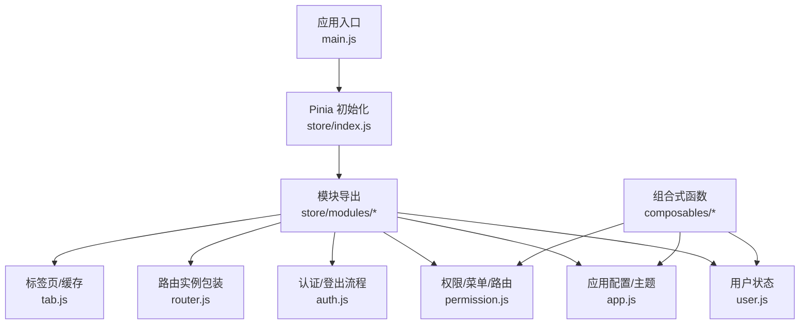
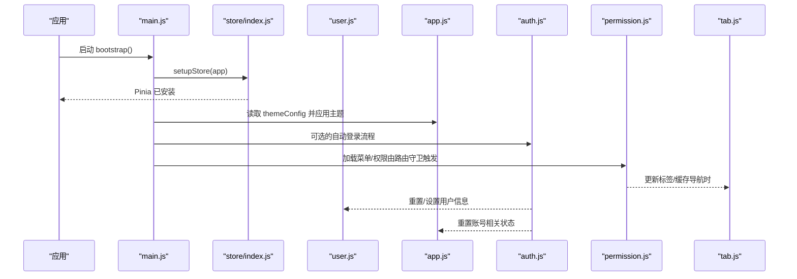
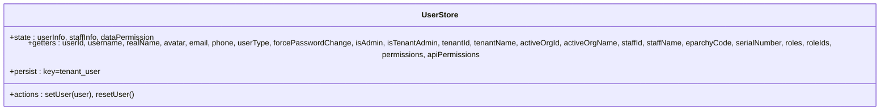
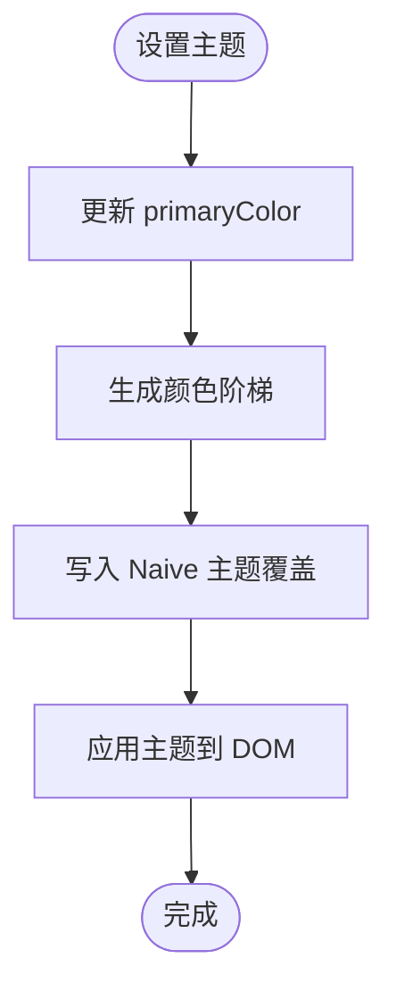
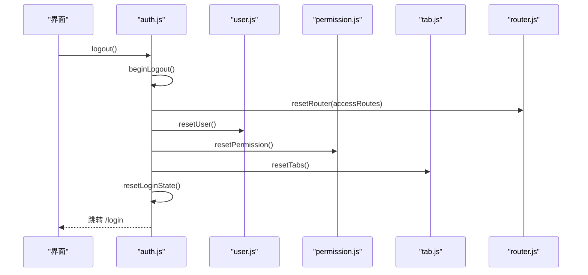
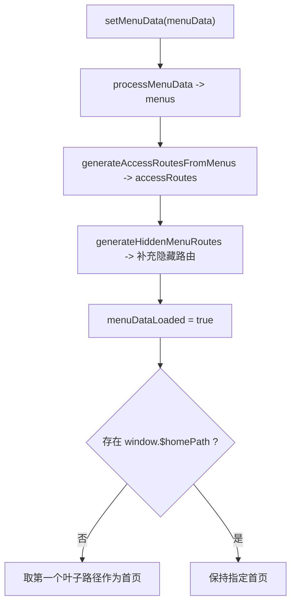
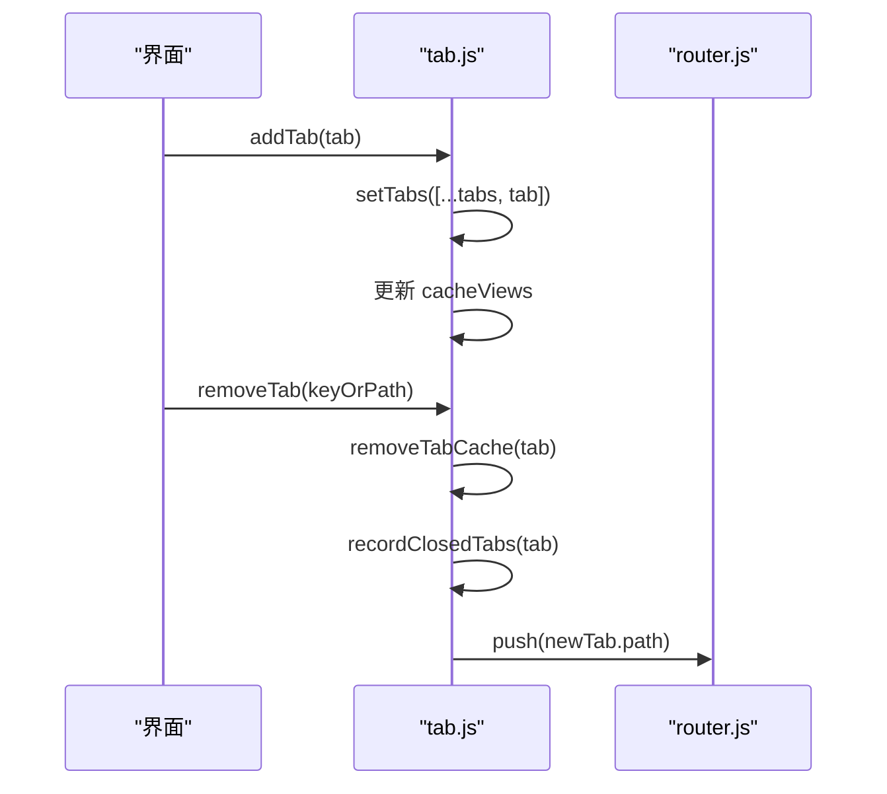
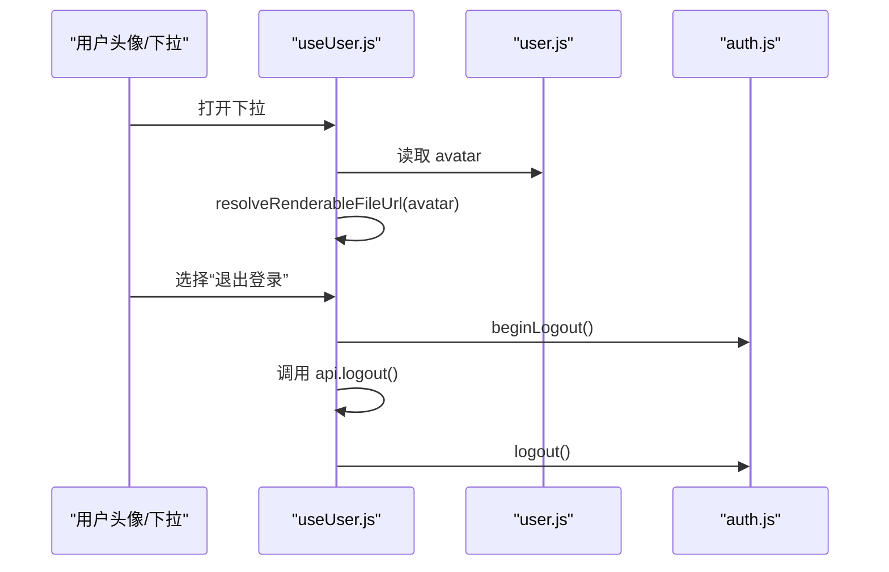
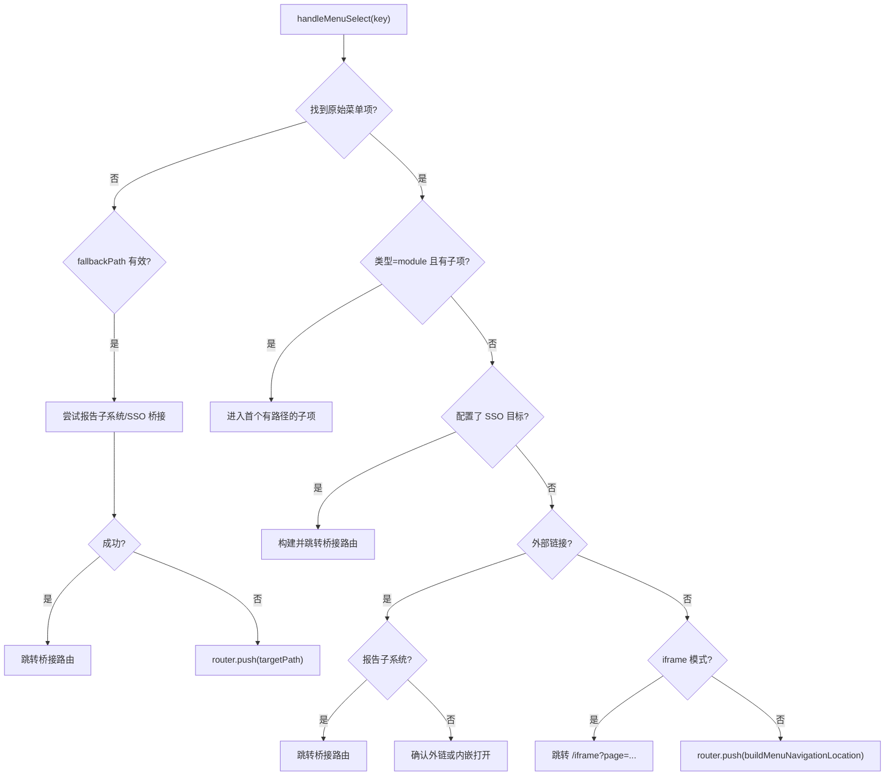
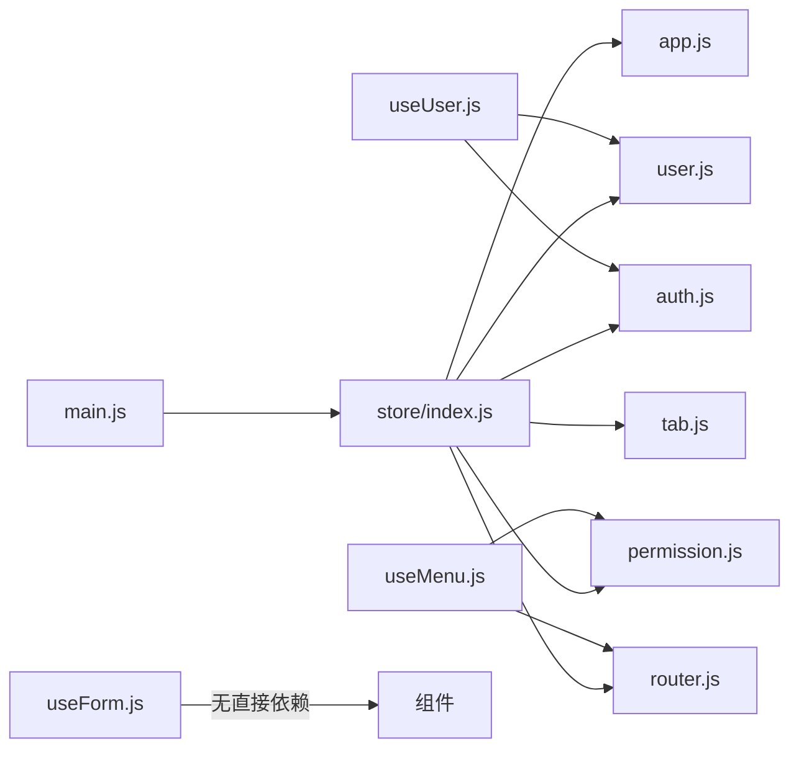

# 状态管理

<cite>
**本文引用的文件**
- [main.js](file://forge-admin-ui/src/main.js)
- [store/index.js](file://forge-admin-ui/src/store/index.js)
- [store/modules/user.js](file://forge-admin-ui/src/store/modules/user.js)
- [store/modules/app.js](file://forge-admin-ui/src/store/modules/app.js)
- [store/modules/auth.js](file://forge-admin-ui/src/store/modules/auth.js)
- [store/modules/permission.js](file://forge-admin-ui/src/store/modules/permission.js)
- [store/modules/router.js](file://forge-admin-ui/src/store/modules/router.js)
- [store/modules/tab.js](file://forge-admin-ui/src/store/modules/tab.js)
- [composables/useUser.js](file://forge-admin-ui/src/composables/useUser.js)
- [composables/useMenu.js](file://forge-admin-ui/src/composables/useMenu.js)
- [composables/useForm.js](file://forge-admin-ui/src/composables/useForm.js)
</cite>

## 目录
1. [简介](#简介)
2. [项目结构](#项目结构)
3. [核心组件](#核心组件)
4. [架构总览](#架构总览)
5. [详细组件分析](#详细组件分析)
6. [依赖关系分析](#依赖关系分析)
7. [性能考虑](#性能考虑)
8. [故障排查指南](#故障排查指南)
9. [结论](#结论)
10. [附录](#附录)

## 简介
本技术文档聚焦 Forge Admin 前端的状态管理体系，围绕 Pinia 模块化 Store、响应式数据流与组合式函数（Composables）展开。重点覆盖用户状态、应用配置、主题设置、菜单数据等核心 Store 的实现方式；解析 useUser、useMenu、useForm 等常用组合函数的设计模式与复用策略；并给出状态持久化、数据同步、性能优化与调试技巧，以及自定义 Store 开发规范与最佳实践示例。

## 项目结构
Forge Admin 使用 Pinia 作为全局状态管理方案，通过插件实现持久化，并在应用启动时完成初始化。Store 按领域拆分到 modules 目录，组合式函数集中在 composables 目录，提供跨组件复用的业务逻辑封装。

图表来源
- [main.js:20-50](file://forge-admin-ui/src/main.js#L20-L50)
- [store/index.js:4-10](file://forge-admin-ui/src/store/index.js#L4-L10)

章节来源
- [main.js:20-50](file://forge-admin-ui/src/main.js#L20-L50)
- [store/index.js:4-10](file://forge-admin-ui/src/store/index.js#L4-L10)

## 核心组件
- 用户状态 Store（user）：维护登录用户信息、员工信息、数据权限及派生属性（如角色、权限集合），支持重置与兼容旧数据结构。
- 应用配置 Store（app）：管理布局折叠、深色模式、主题色、Naive UI 主题覆盖、顶部菜单选中项、主题配置与应用标题等。
- 认证 Store（auth）：维护访问令牌、登出流程、统一重置登录态（路由、用户、权限、标签、租户配置、WebSocket 连接等）。
- 权限与菜单 Store（permission）：处理后端菜单数据，生成可见路由与隐藏路由，计算首页路径，提供菜单转换与查找能力。
- 路由 Store（router）：封装 Vue Router 实例，提供动态移除路由的能力，配合权限系统实现按需注册。
- 标签页 Store（tab）：管理多标签页、关闭历史、活跃标签、脏标记、视图缓存列表、重排与恢复等功能，并持久化到 sessionStorage。

章节来源
- [store/modules/user.js:26-137](file://forge-admin-ui/src/store/modules/user.js#L26-L137)
- [store/modules/app.js:12-107](file://forge-admin-ui/src/store/modules/app.js#L12-L107)
- [store/modules/auth.js:7-112](file://forge-admin-ui/src/store/modules/auth.js#L7-L112)
- [store/modules/permission.js:14-368](file://forge-admin-ui/src/store/modules/permission.js#L14-L368)
- [store/modules/router.js:3-18](file://forge-admin-ui/src/store/modules/router.js#L3-L18)
- [store/modules/tab.js:26-409](file://forge-admin-ui/src/store/modules/tab.js#L26-L409)

## 架构总览
Pinia 在应用启动时被创建并挂载，启用持久化插件后，各模块 Store 可独立维护自身状态并通过 actions/getters 暴露能力。组合式函数通过调用这些 Store，将复杂交互逻辑下沉为可复用的 API。

图表来源
- [main.js:20-50](file://forge-admin-ui/src/main.js#L20-L50)
- [store/index.js:4-10](file://forge-admin-ui/src/store/index.js#L4-L10)
- [store/modules/app.js:36-74](file://forge-admin-ui/src/store/modules/app.js#L36-L74)
- [store/modules/auth.js:61-98](file://forge-admin-ui/src/store/modules/auth.js#L61-L98)
- [store/modules/permission.js:34-85](file://forge-admin-ui/src/store/modules/permission.js#L34-L85)
- [store/modules/tab.js:56-69](file://forge-admin-ui/src/store/modules/tab.js#L56-L69)

## 详细组件分析

### 用户状态 Store（user）
- 职责：集中管理用户基本信息、员工信息、数据权限，并提供丰富的 getters（如用户名、头像、角色、权限集合、是否管理员等）。
- 关键行为：
  - setUser：兼容新旧用户数据结构，合并 userInfo/staffInfo/dataPermission。
  - resetUser：重置状态以支持登出或切换账号。
  - persist：基于租户键持久化用户状态。

图表来源
- [store/modules/user.js:26-137](file://forge-admin-ui/src/store/modules/user.js#L26-L137)

章节来源
- [store/modules/user.js:26-137](file://forge-admin-ui/src/store/modules/user.js#L26-L137)

### 应用配置与主题 Store（app）
- 职责：管理布局折叠、深色模式、主题色、Naive UI 主题覆盖、顶部菜单选中项、主题配置与应用标题等。
- 关键行为：
  - setThemeColor/setThemeConfig/updateHeaderConfig/updateTopMenuConfig/updateSideMenuConfig：统一应用主题与布局配置。
  - resetAccountState：退出登录时恢复默认主题与布局。
  - persist：仅持久化部分字段，存储于 sessionStorage。

图表来源
- [store/modules/app.js:36-74](file://forge-admin-ui/src/store/modules/app.js#L36-L74)

章节来源
- [store/modules/app.js:12-107](file://forge-admin-ui/src/store/modules/app.js#L12-L107)

### 认证 Store（auth）
- 职责：维护访问令牌、登出流程、统一重置登录态。
- 关键行为：
  - setToken/resetToken：安全地设置与清理令牌。
  - resetLoginState：联动重置路由、用户、权限、标签、租户配置、WebSocket 连接，并清理本地缓存。
  - logout：开始登出、执行重置、跳转登录页。

图表来源
- [store/modules/auth.js:43-105](file://forge-admin-ui/src/store/modules/auth.js#L43-L105)
- [store/modules/router.js:7-11](file://forge-admin-ui/src/store/modules/router.js#L7-L11)

章节来源
- [store/modules/auth.js:7-112](file://forge-admin-ui/src/store/modules/auth.js#L7-L112)
- [store/modules/router.js:3-18](file://forge-admin-ui/src/store/modules/router.js#L3-L18)

### 权限与菜单 Store（permission）
- 职责：处理后端菜单数据，生成可见路由与隐藏路由，计算首页路径，提供菜单转换与查找能力。
- 关键行为：
  - setMenuData：处理菜单数据、生成 accessRoutes、提取隐藏菜单路由、设置 menuDataLoaded。
  - generateAccessRoutesFromMenus：从菜单数据生成路由数组。
  - processMenuData：适配 UserResourceTreeVO，规范化路径与组件路径，排序与过滤。
  - generateHiddenMenuRoutes：为隐藏菜单补充路由元信息。

图表来源
- [store/modules/permission.js:34-85](file://forge-admin-ui/src/store/modules/permission.js#L34-L85)
- [store/modules/permission.js:93-146](file://forge-admin-ui/src/store/modules/permission.js#L93-L146)
- [store/modules/permission.js:149-256](file://forge-admin-ui/src/store/modules/permission.js#L149-L256)
- [store/modules/permission.js:258-303](file://forge-admin-ui/src/store/modules/permission.js#L258-L303)

章节来源
- [store/modules/permission.js:14-368](file://forge-admin-ui/src/store/modules/permission.js#L14-L368)

### 标签页 Store（tab）
- 职责：管理多标签页、关闭历史、活跃标签、脏标记、视图缓存列表、重排与恢复等功能，并持久化到 sessionStorage。
- 关键行为：
  - addTab/removeTab/updateTabTitle/updateTabMeta：增删改标签及其元信息。
  - pin/unpin/reorder/move：固定、排序与移动标签。
  - removeLeft/removeRight/removeAll/closeUnpinnedTabs：批量删除与清理。
  - refreshOtherTabs/reloadTab：刷新其他标签或当前标签，处理 keepAlive 页面。
  - persist：持久化 tabs 到 sessionStorage。

图表来源
- [store/modules/tab.js:56-69](file://forge-admin-ui/src/store/modules/tab.js#L56-L69)
- [store/modules/tab.js:201-221](file://forge-admin-ui/src/store/modules/tab.js#L201-L221)
- [store/modules/tab.js:340-391](file://forge-admin-ui/src/store/modules/tab.js#L340-L391)

章节来源
- [store/modules/tab.js:26-409](file://forge-admin-ui/src/store/modules/tab.js#L26-L409)

### 组合式函数（Composables）

#### useUser
- 职责：封装用户显示名称、头像加载、下拉菜单选项与退出登录逻辑。
- 关键点：
  - 监听用户头像变化并异步解析为可渲染 URL。
  - 退出登录前调用 authStore.beginLogout，调用后端接口后执行 authStore.logout。

图表来源
- [composables/useUser.js:62-78](file://forge-admin-ui/src/composables/useUser.js#L62-L78)
- [composables/useUser.js:109-131](file://forge-admin-ui/src/composables/useUser.js#L109-L131)
- [store/modules/auth.js:43-105](file://forge-admin-ui/src/store/modules/auth.js#L43-L105)

章节来源
- [composables/useUser.js:37-164](file://forge-admin-ui/src/composables/useUser.js#L37-L164)

#### useMenu
- 职责：封装菜单数据处理、活跃项计算和导航跳转逻辑，支持外链、内嵌 iframe、SSO 桥接与报告子系统跳转。
- 关键点：
  - processedMenus：对 permissionStore.menus 进行标准化处理。
  - activeKey：根据 route.meta.parentKey、精确匹配、前缀匹配等方式确定活跃菜单。
  - handleMenuSelect：优先走 SSO 桥接或报告子系统，否则内嵌或外链打开。

图表来源
- [composables/useMenu.js:461-560](file://forge-admin-ui/src/composables/useMenu.js#L461-L560)
- [composables/useMenu.js:314-376](file://forge-admin-ui/src/composables/useMenu.js#L314-L376)

章节来源
- [composables/useMenu.js:309-577](file://forge-admin-ui/src/composables/useMenu.js#L309-L577)

#### useForm
- 职责：提供表单引用、模型与校验的统一封装，简化表单初始化与验证流程。
- 关键点：
  - 返回 formRef、formModel、validation、rules，便于模板绑定与提交前校验。

章节来源
- [composables/useForm.js:3-17](file://forge-admin-ui/src/composables/useForm.js#L3-L17)

## 依赖关系分析
- main.js 负责应用引导，先初始化 Pinia，再应用主题，最后初始化路由与挂载应用。
- store/index.js 创建 Pinia 实例并启用持久化插件，同时导出所有模块供组合式函数与组件使用。
- 各 Store 之间通过 actions 相互协作：auth 在登出时联动 user、permission、router、tab、app 等模块进行统一重置。
- 组合式函数通过调用 Store 暴露的方法，将复杂交互逻辑下沉为可复用的 API。

图表来源
- [main.js:20-50](file://forge-admin-ui/src/main.js#L20-L50)
- [store/index.js:4-10](file://forge-admin-ui/src/store/index.js#L4-L10)
- [composables/useUser.js:37-164](file://forge-admin-ui/src/composables/useUser.js#L37-L164)
- [composables/useMenu.js:309-577](file://forge-admin-ui/src/composables/useMenu.js#L309-L577)

章节来源
- [main.js:20-50](file://forge-admin-ui/src/main.js#L20-L50)
- [store/index.js:4-10](file://forge-admin-ui/src/store/index.js#L4-L10)

## 性能考虑
- 菜单与路由生成：permission 模块在处理菜单数据时进行过滤、排序与路径规范化，避免重复计算；建议仅在菜单数据变更时触发，减少不必要的重新生成。
- 标签页缓存：tab 模块维护 cacheViews 列表，结合 keepAlive 提升页面切换性能；在删除或刷新操作时及时清理缓存，避免内存泄漏。
- 主题应用：app 模块通过一次性生成颜色阶梯并写入 CSS 变量与主题覆盖，减少频繁样式计算；建议在主题切换时使用防抖或节流策略。
- 持久化：pinia-plugin-persistedstate 用于持久化敏感或重要状态，注意合理选择 storage（localStorage/sessionStorage）与 pick 字段，避免过大体积影响性能。

[本节为通用性能指导，不直接分析具体文件]

## 故障排查指南
- 主题未生效：检查 app 模块的 setThemeConfig 与 applyThemeConfig 调用链，确认主题配置是否正确合并与应用到 DOM。
- 菜单高亮异常：检查 useMenu 的 activeKey 计算逻辑，确认 route.meta.parentKey、路径匹配与前缀匹配是否符合预期。
- 标签页丢失或缓存不一致：检查 tab 模块的 addTab/removeTab 与 cacheViews 更新逻辑，确保在删除标签时同步清理缓存。
- 登出后状态残留：确认 auth.resetLoginState 是否完整调用 user、permission、router、tab、app 的重置方法，并清理本地缓存与 WebSocket 连接。

章节来源
- [store/modules/app.js:66-74](file://forge-admin-ui/src/store/modules/app.js#L66-L74)
- [composables/useMenu.js:429-455](file://forge-admin-ui/src/composables/useMenu.js#L429-L455)
- [store/modules/tab.js:56-69](file://forge-admin-ui/src/store/modules/tab.js#L56-L69)
- [store/modules/auth.js:61-98](file://forge-admin-ui/src/store/modules/auth.js#L61-L98)

## 结论
Forge Admin 采用 Pinia 模块化 Store 与组合式函数相结合的状态管理模式，实现了清晰的数据流与良好的可维护性。通过权限与菜单 Store 的动态路由生成、标签页 Store 的多标签管理与缓存机制、应用配置 Store 的主题与布局控制，以及认证 Store 的统一登出流程，整体架构具备较强的扩展性与稳定性。遵循本文档提供的开发规范与最佳实践，可进一步提升代码质量与用户体验。

[本节为总结性内容，不直接分析具体文件]

## 附录

### 自定义 Store 开发规范与最佳实践
- 命名与组织：每个 Store 对应一个模块文件，命名以领域为中心（如 user、app、auth、permission、router、tab），并在 store/index.js 中统一导出。
- 状态设计：state 仅保存必要的最小状态，复杂派生值通过 getters 计算；避免在 state 中存放冗余数据。
- Actions 设计：action 应聚焦单一职责，必要时拆分为多个 action；涉及副作用（如网络请求、路由跳转）应在 action 中处理。
- 持久化：合理使用 pinia-plugin-persistedstate，明确 pick 字段与 storage 类型；避免持久化敏感或临时状态。
- 组合式函数：将跨组件复用的逻辑封装为 composables，优先通过 Store 暴露的 getters/actions 获取与修改状态，避免直接操作 DOM 或全局变量。
- 错误处理：在 action 中捕获并处理异常，提供友好的用户提示；对于认证相关错误，区分静默错误与需提示的错误。
- 性能优化：避免在高频触发的场景中进行昂贵计算；使用 computed 缓存派生数据；在菜单与路由生成时进行必要的去重与排序。

[本节为通用规范指导，不直接分析具体文件]