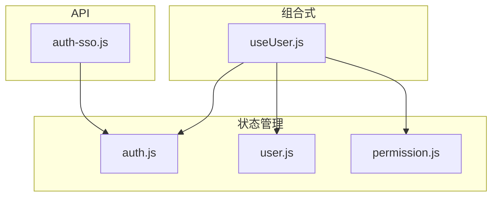
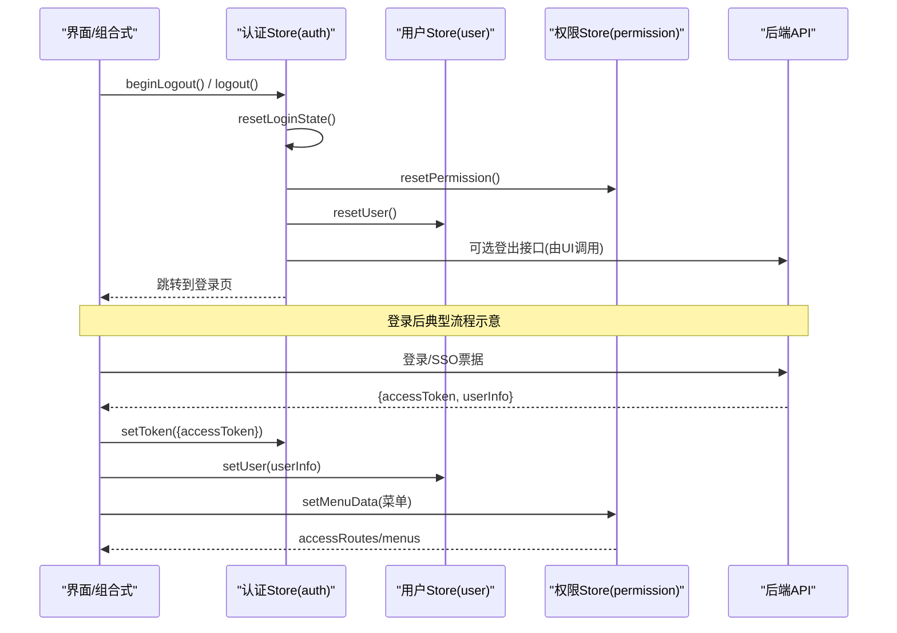
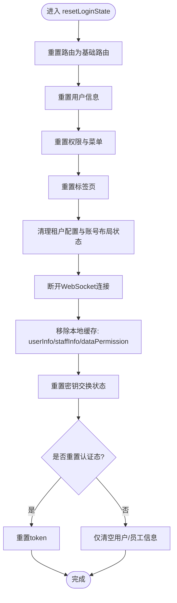
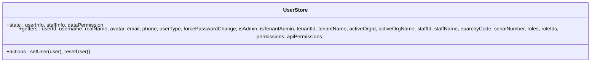
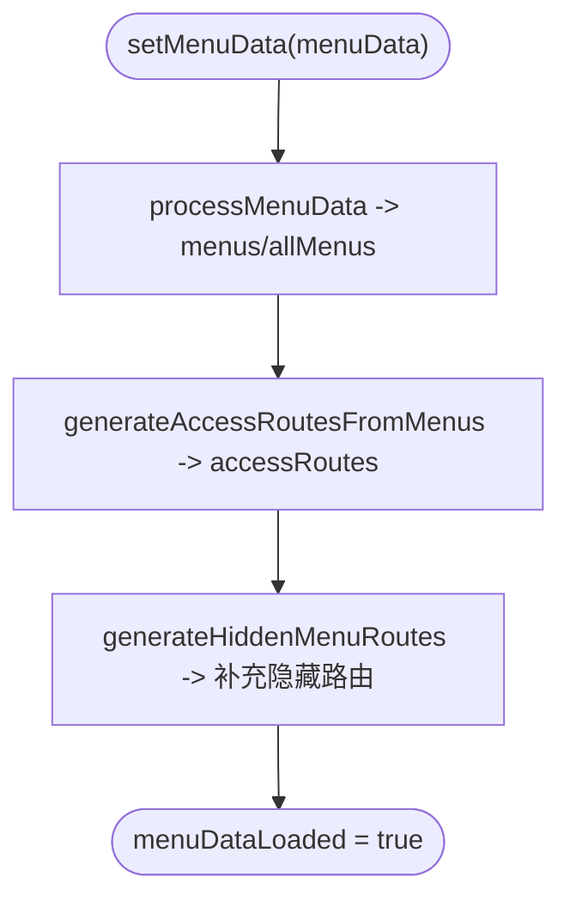
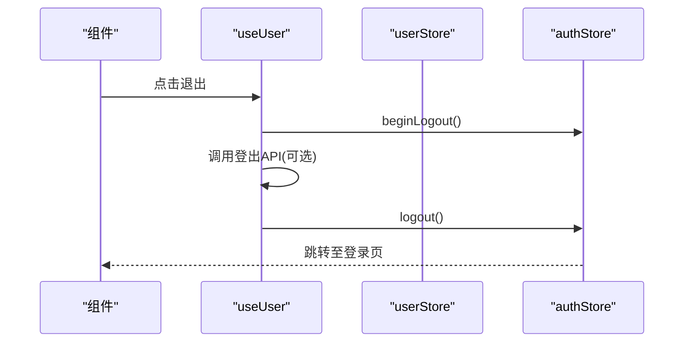
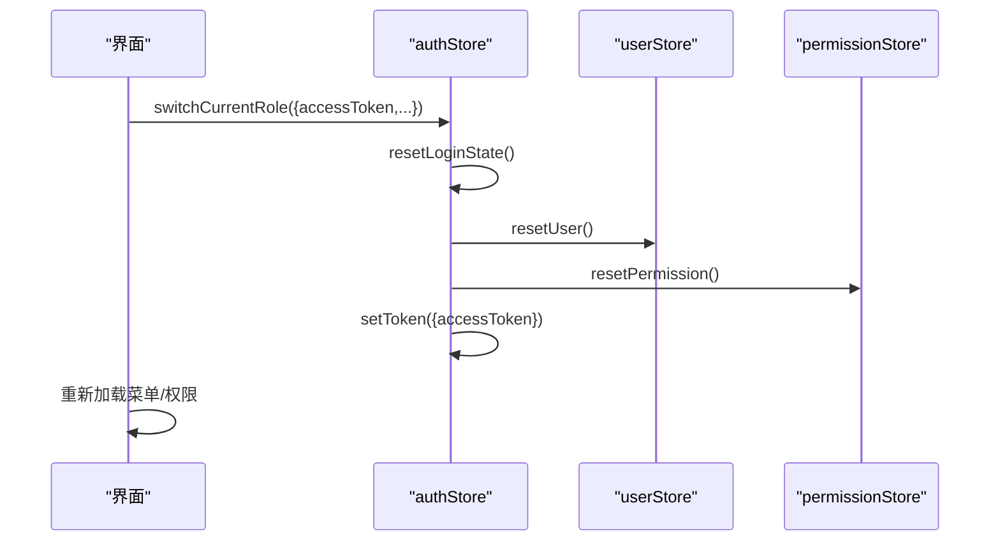
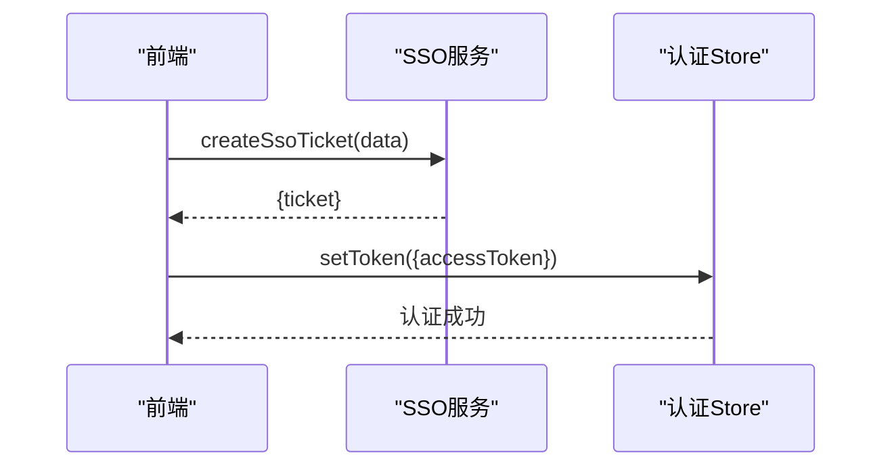
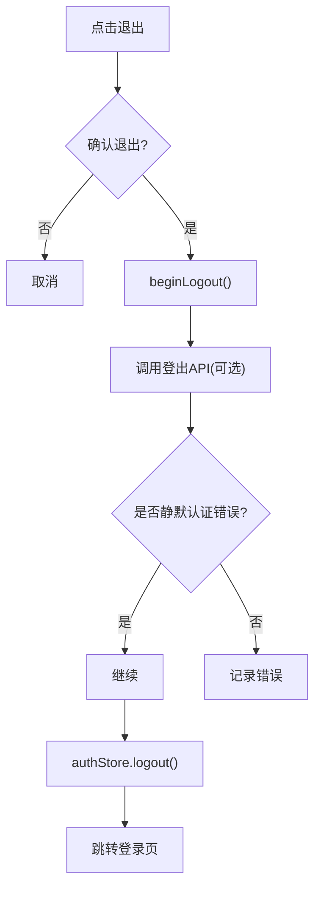
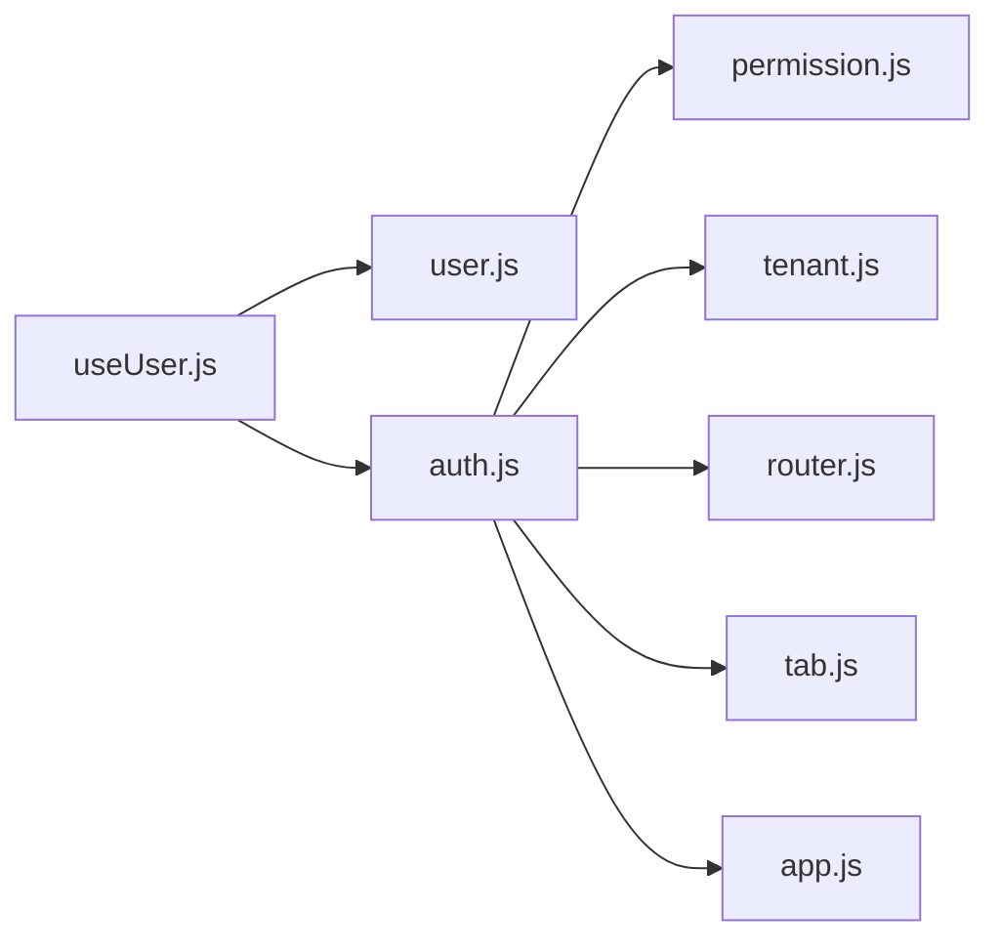

# 用户认证状态管理

<cite>
**本文引用的文件**
- [useUser.js](file://forge-admin-ui/src/composables/useUser.js)
- [auth.js](file://forge-admin-ui/src/store/modules/auth.js)
- [user.js](file://forge-admin-ui/src/store/modules/user.js)
- [permission.js](file://forge-admin-ui/src/store/modules/permission.js)
- [auth-sso.js](file://forge-admin-ui/src/api/auth-sso.js)
</cite>

## 目录
1. [简介](#简介)
2. [项目结构](#项目结构)
3. [核心组件](#核心组件)
4. [架构总览](#架构总览)
5. [详细组件分析](#详细组件分析)
6. [依赖关系分析](#依赖关系分析)
7. [性能考虑](#性能考虑)
8. [故障排查指南](#故障排查指南)
9. [结论](#结论)
10. [附录](#附录)

## 简介
本技术文档聚焦于前端用户认证与状态管理，围绕用户信息、权限数据、会话状态的存储与管理机制展开。重点解析：
- 登录流程与 Token 管理
- 权限验证与角色切换的状态更新逻辑
- useUser 组合式函数的实现原理（用户数据获取、头像渲染、下拉菜单、退出登录）
- 多租户用户切换、SSO 集成与安全退出的实现方式
- 用户状态同步、错误处理与性能优化最佳实践

## 项目结构
认证相关的前端代码主要分布在以下位置：
- 组合式函数：composables/useUser.js，封装用户展示、头像加载、退出登录等交互
- Pinia Store：store/modules/auth.js、store/modules/user.js、store/modules/permission.js，分别负责认证态、用户信息与权限/菜单路由
- SSO API：api/auth-sso.js，提供创建 SSO 票据的接口封装

图表来源
- [useUser.js:37-163](file://forge-admin-ui/src/composables/useUser.js#L37-L163)
- [auth.js:7-112](file://forge-admin-ui/src/store/modules/auth.js#L7-L112)
- [user.js:26-137](file://forge-admin-ui/src/store/modules/user.js#L26-L137)
- [permission.js:14-368](file://forge-admin-ui/src/store/modules/permission.js#L14-L368)
- [auth-sso.js:1-6](file://forge-admin-ui/src/api/auth-sso.js#L1-L6)

章节来源
- [useUser.js:37-163](file://forge-admin-ui/src/composables/useUser.js#L37-L163)
- [auth.js:7-112](file://forge-admin-ui/src/store/modules/auth.js#L7-L112)
- [user.js:26-137](file://forge-admin-ui/src/store/modules/user.js#L26-L137)
- [permission.js:14-368](file://forge-admin-ui/src/store/modules/permission.js#L14-L368)
- [auth-sso.js:1-6](file://forge-admin-ui/src/api/auth-sso.js#L1-L6)

## 核心组件
- 认证状态 store（auth.js）
  - 维护 accessToken、userInfo、staffInfo、isLoggingOut
  - 提供 setToken、resetToken、beginLogout、logout、switchCurrentRole、resetLoginState 等方法
  - 通过 getAuthHeaders 生成 Authorization 请求头
  - 持久化键基于租户环境前缀，避免跨租户污染
- 用户信息 store（user.js）
  - 维护 userInfo、staffInfo、dataPermission
  - 提供丰富的 getters（userId、roles、permissions、isAdmin、tenantId 等）
  - setUser 兼容新旧数据结构；resetUser 重置状态
- 权限与菜单 store（permission.js）
  - 维护 accessRoutes、menus、allMenus、menuDataLoaded
  - setMenuData/processMenuData/generateAccessRoutesFromMenus/generateHiddenMenuRoutes 将后端菜单转换为前端路由与菜单树
  - resetPermission 重置权限与路由
- 组合式函数（useUser.js）
  - 计算用户名、头像文字、头像 URL（支持懒加载与回退）
  - 提供个人资料跳转、密码修改跳转、退出登录确认与调用
  - 通过 authStore.beginLogout/logout 完成安全退出流程

章节来源
- [auth.js:7-112](file://forge-admin-ui/src/store/modules/auth.js#L7-L112)
- [user.js:26-137](file://forge-admin-ui/src/store/modules/user.js#L26-L137)
- [permission.js:14-368](file://forge-admin-ui/src/store/modules/permission.js#L14-L368)
- [useUser.js:37-163](file://forge-admin-ui/src/composables/useUser.js#L37-L163)

## 架构总览
下图展示了认证状态在 UI 层、状态层与 API 层的交互关系，以及 Token、用户信息、权限/菜单的流转路径。

图表来源
- [useUser.js:109-131](file://forge-admin-ui/src/composables/useUser.js#L109-L131)
- [auth.js:28-106](file://forge-admin-ui/src/store/modules/auth.js#L28-L106)
- [user.js:108-131](file://forge-admin-ui/src/store/modules/user.js#L108-L131)
- [permission.js:24-85](file://forge-admin-ui/src/store/modules/permission.js#L24-L85)

## 详细组件分析

### 认证状态管理（auth.js）
- Token 管理
  - setToken：从返回对象中取 accessToken/token 并写入 state
  - resetToken：重置所有认证态，保留 isLoggingOut 标志用于静默退出过渡
  - getAuthHeaders：根据 accessToken 构造 Authorization 请求头
- 会话生命周期
  - beginLogout：标记开始退出，避免重复操作
  - logout：触发 resetLoginState 并跳转登录页，延迟结束“静默退出”状态
  - switchCurrentRole：用于角色切换时重置登录态并设置新 token
- 全局清理
  - resetLoginState：重置路由、用户、权限、Tabs、租户配置、WebSocket 连接、密钥交换状态，并清理本地缓存的用户/员工/数据权限

图表来源
- [auth.js:61-98](file://forge-admin-ui/src/store/modules/auth.js#L61-L98)

章节来源
- [auth.js:7-112](file://forge-admin-ui/src/store/modules/auth.js#L7-L112)

### 用户信息管理（user.js）
- 数据结构
  - userInfo：当前登录用户主信息
  - staffInfo：员工/组织维度信息（兼容多种来源）
  - dataPermission：数据权限范围
- 关键 Getter
  - userId、username、realName、avatar、email、phone、userType、forcePasswordChange
  - isAdmin、isTenantAdmin、tenantId、tenantName、activeOrgId、activeOrgName
  - roles、roleIds、permissions、apiPermissions
- 动作
  - setUser：兼容新旧结构，设置 userInfo/staffInfo/dataPermission
  - resetUser：重置用户状态

图表来源
- [user.js:26-137](file://forge-admin-ui/src/store/modules/user.js#L26-L137)

章节来源
- [user.js:26-137](file://forge-admin-ui/src/store/modules/user.js#L26-L137)

### 权限与菜单管理（permission.js）
- 职责
  - 将后端菜单数据转换为用户可见的菜单树与动态路由
  - 同时生成隐藏菜单路由，确保 meta.title 等元信息完整
- 关键流程
  - setMenuData：处理菜单数据、生成访问路由、收集隐藏菜单路由、设置加载完成标志
  - processMenuData：过滤目录/菜单类型、规范化路径与组件路径、映射 meta 字段、排序
  - generateAccessRoutesFromMenus：从菜单项提取可访问路由
  - generateHiddenMenuRoutes：从原始数据提取隐藏菜单的路由并合并到 accessRoutes
  - resetPermission：重置权限与路由

图表来源
- [permission.js:24-85](file://forge-admin-ui/src/store/modules/permission.js#L24-L85)
- [permission.js:92-146](file://forge-admin-ui/src/store/modules/permission.js#L92-L146)
- [permission.js:148-256](file://forge-admin-ui/src/store/modules/permission.js#L148-L256)
- [permission.js:258-303](file://forge-admin-ui/src/store/modules/permission.js#L258-L303)

章节来源
- [permission.js:14-368](file://forge-admin-ui/src/store/modules/permission.js#L14-L368)

### 组合式函数 useUser（useUser.js）
- 功能点
  - 用户名与头像文字：优先使用真实姓名或用户名，头像回退为首字母
  - 头像加载：监听 userStore.avatar 变化，异步解析可渲染文件 URL，失败回退为空
  - 下拉菜单：默认包含“个人资料”、“修改密码”、“退出登录”
  - 退出登录：弹出确认框，调用 authStore.beginLogout，尝试调用登出接口，捕获非静默认证错误，最终执行 authStore.logout
- 与 Store 的协作
  - 读取 userStore 中的用户信息
  - 通过 authStore 控制认证态与跳转

图表来源
- [useUser.js:109-131](file://forge-admin-ui/src/composables/useUser.js#L109-L131)
- [auth.js:43-106](file://forge-admin-ui/src/store/modules/auth.js#L43-L106)

章节来源
- [useUser.js:37-163](file://forge-admin-ui/src/composables/useUser.js#L37-L163)

### 多租户用户切换
- 场景：在同一浏览器内切换不同租户或角色的用户上下文
- 实现要点
  - 使用 authStore.switchCurrentRole(data) 重置登录态并设置新 token
  - resetLoginState 会清理路由、用户、权限、Tabs、租户配置、WebSocket 等，保证切换后状态干净
  - 注意：切换后需重新拉取菜单与权限，以反映新租户/角色的资源

图表来源
- [auth.js:56-98](file://forge-admin-ui/src/store/modules/auth.js#L56-L98)

章节来源
- [auth.js:56-98](file://forge-admin-ui/src/store/modules/auth.js#L56-L98)

### SSO 集成
- 能力：提供 createSsoTicket 接口，用于创建 SSO 票据
- 建议流程（概念性）
  - 前端调用 createSsoTicket 获取票据
  - 将票据提交给统一认证服务换取 accessToken
  - 使用 authStore.setToken 保存 token，并继续后续的用户/权限初始化

图表来源
- [auth-sso.js:3-5](file://forge-admin-ui/src/api/auth-sso.js#L3-L5)
- [auth.js:28-37](file://forge-admin-ui/src/store/modules/auth.js#L28-L37)

章节来源
- [auth-sso.js:1-6](file://forge-admin-ui/src/api/auth-sso.js#L1-L6)
- [auth.js:28-37](file://forge-admin-ui/src/store/modules/auth.js#L28-L37)

### 安全退出
- 行为
  - 弹出确认对话框
  - 调用 authStore.beginLogout 标记退出中
  - 尝试调用后端登出接口（如可用），忽略静默认证错误
  - 调用 authStore.logout 完成状态重置与跳转
- 优势
  - 通过 beginLogout/finishLogoutSilence 避免退出过程中的重复操作与误报
  - 统一清理 WebSocket、本地缓存、密钥交换等敏感状态

图表来源
- [useUser.js:109-131](file://forge-admin-ui/src/composables/useUser.js#L109-L131)
- [auth.js:43-106](file://forge-admin-ui/src/store/modules/auth.js#L43-L106)

章节来源
- [useUser.js:109-131](file://forge-admin-ui/src/composables/useUser.js#L109-L131)
- [auth.js:43-106](file://forge-admin-ui/src/store/modules/auth.js#L43-L106)

## 依赖关系分析
- 组件耦合
  - useUser 依赖 userStore、authStore，并通过 router 进行导航
  - authStore 依赖其他 store（app、permission、router、tab、tenant）进行全局状态重置
  - permissionStore 独立处理菜单与路由生成，不直接依赖用户信息
- 外部依赖
  - 网络请求：通过统一的 request 工具发起（含鉴权头注入）
  - 本地存储：Pinia persist 插件按租户隔离 key
  - WebSocket：退出时主动断开连接，避免残留会话

图表来源
- [useUser.js:37-163](file://forge-admin-ui/src/composables/useUser.js#L37-L163)
- [auth.js:2-112](file://forge-admin-ui/src/store/modules/auth.js#L2-L112)

章节来源
- [auth.js:2-112](file://forge-admin-ui/src/store/modules/auth.js#L2-L112)
- [useUser.js:37-163](file://forge-admin-ui/src/composables/useUser.js#L37-L163)

## 性能考虑
- 头像懒加载与回退
  - 仅在 avatar 存在时发起请求，失败时回退为空，避免无效网络开销
- 菜单与路由生成
  - 一次性处理菜单数据并生成访问路由与隐藏路由，减少重复计算
  - 对菜单项进行排序与过滤，降低渲染压力
- 退出流程优化
  - 使用 beginLogout 防止重复点击导致的多次重置
  - 延迟 finishLogoutSilence，避免短暂状态抖动影响用户体验
- 本地存储隔离
  - 基于租户前缀的持久化 key，避免跨租户数据污染与额外清理成本

[本节为通用性能建议，无需特定文件引用]

## 故障排查指南
- 退出无响应或重复提示
  - 检查是否已调用 beginLogout，避免重复触发
  - 确认登出接口是否被正确调用且未抛出异常
- 登录后菜单/权限不生效
  - 确认是否调用了 setMenuData 并等待 menuDataLoaded 完成
  - 检查权限 store 是否正确生成 accessRoutes
- 头像不显示
  - 检查 userStore.avatar 是否存在
  - 查看 resolveRenderableFileUrl 是否返回有效 URL
- SSO 票据问题
  - 确认 createSsoTicket 返回票据格式正确
  - 票据换取 token 成功后，务必调用 setToken 并刷新用户/权限

章节来源
- [useUser.js:109-131](file://forge-admin-ui/src/composables/useUser.js#L109-L131)
- [permission.js:24-85](file://forge-admin-ui/src/store/modules/permission.js#L24-L85)
- [auth.js:43-106](file://forge-admin-ui/src/store/modules/auth.js#L43-L106)

## 结论
该方案通过清晰的职责划分与状态管理，实现了用户认证、权限控制与多租户切换的完整闭环：
- auth.js 负责 Token 与会话生命周期管理
- user.js 集中管理用户与员工信息，并提供丰富的查询 getter
- permission.js 将后端菜单转化为前端路由与菜单树，兼顾可见与隐藏页面
- useUser.js 提供易用的组合式 API，简化界面层认证相关逻辑
结合 SSO 与多租户切换能力，满足企业级应用的安全与扩展需求。

## 附录
- 常用操作速查
  - 设置 Token：authStore.setToken({accessToken})
  - 设置用户：userStore.setUser(userInfo)
  - 加载菜单：permissionStore.setMenuData(menus)
  - 安全退出：useUser.handleLogout() 或 authStore.logout()
  - 角色切换：authStore.switchCurrentRole({accessToken,...})
  - SSO 票据：api.createSsoTicket(data)

[本节为操作参考，无需特定文件引用]