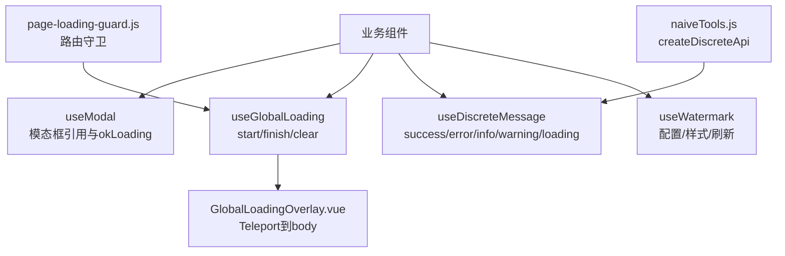
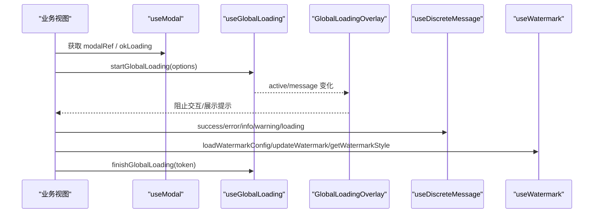
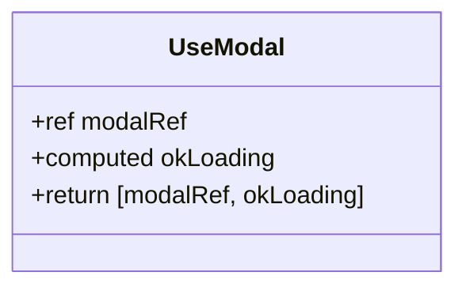
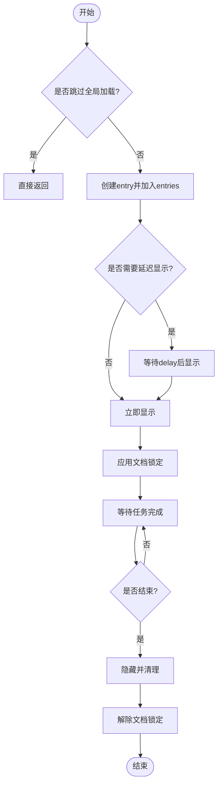
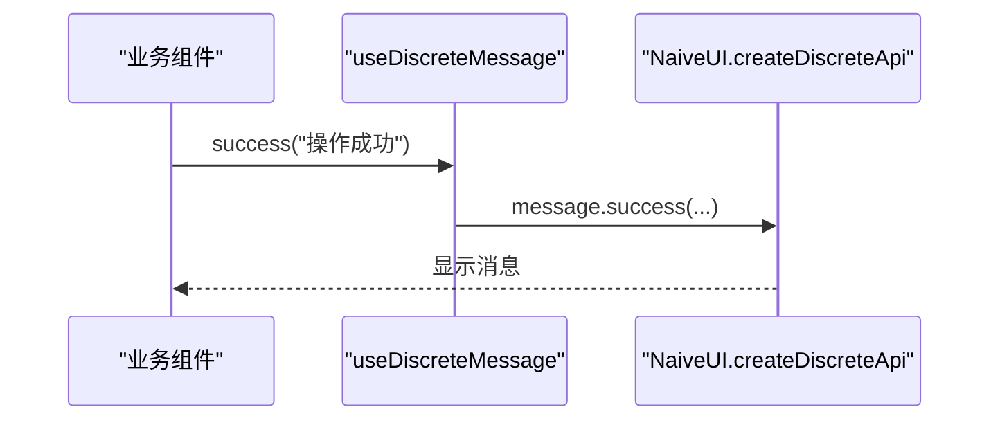
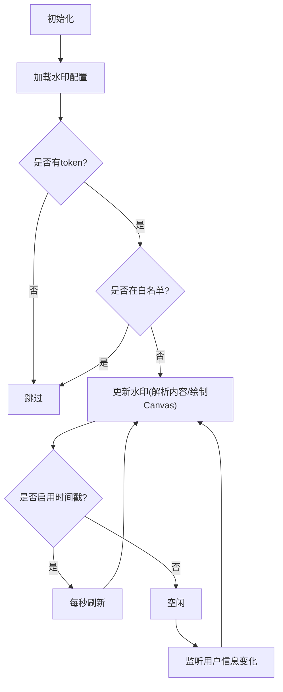
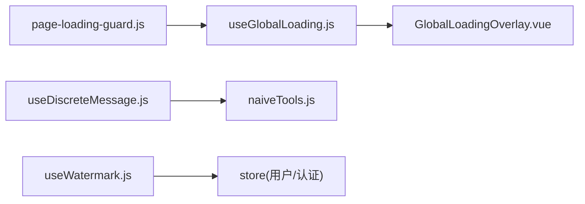

# UI交互组合式函数

<cite>
**本文引用的文件**
- [useModal.js](file://forge-admin-ui/src/composables/useModal.js)
- [useGlobalLoading.js](file://forge-admin-ui/src/composables/useGlobalLoading.js)
- [GlobalLoadingOverlay.vue](file://forge-admin-ui/src/components/common/GlobalLoadingOverlay.vue)
- [useDiscreteMessage.js](file://forge-admin-ui/src/composables/useDiscreteMessage.js)
- [useWatermark.js](file://forge-admin-ui/src/composables/useWatermark.js)
- [index.js](file://forge-admin-ui/src/composables/index.js)
- [page-loading-guard.js](file://forge-admin-ui/src/router/guards/page-loading-guard.js)
- [naiveTools.js](file://forge-admin-ui/src/utils/naiveTools.js)
</cite>

## 目录
1. [简介](#简介)
2. [项目结构](#项目结构)
3. [核心组件](#核心组件)
4. [架构总览](#架构总览)
5. [详细组件分析](#详细组件分析)
6. [依赖关系分析](#依赖关系分析)
7. [性能考量](#性能考量)
8. [故障排查指南](#故障排查指南)
9. [结论](#结论)
10. [附录：使用示例与集成指南](#附录使用示例与集成指南)

## 简介
本技术文档聚焦于 forge-admin-ui 前端工程中的四个 UI 交互组合式函数：useModal、useGlobalLoading、useDiscreteMessage 与 useWatermark。文档从实现原理、状态同步、生命周期管理、组件间通信、可访问性支持、用户体验优化等维度进行深度解析，并提供丰富的使用示例与集成指南，帮助开发者在项目中高效、稳定地复用这些能力。

## 项目结构
- 组合式函数集中位于 forge-admin-ui/src/composables 目录，统一通过 index.js 暴露。
- 全局加载遮罩由 GlobalLoadingOverlay.vue 渲染，并通过 Teleport 挂载到 body，确保层级与交互拦截。
- 路由守卫在 page-loading-guard.js 中集成全局加载，配合 loadingBar 提供页面级加载体验。
- 离散消息基于 Naive UI 的 createDiscreteApi 封装，便于跨组件调用。
- 水印功能通过 Canvas 生成背景图并叠加至页面，结合用户信息与配置动态更新。

图表来源
- [useModal.js:1-12](file://forge-admin-ui/src/composables/useModal.js#L1-L12)
- [useGlobalLoading.js:209-351](file://forge-admin-ui/src/composables/useGlobalLoading.js#L209-L351)
- [GlobalLoadingOverlay.vue:1-82](file://forge-admin-ui/src/components/common/GlobalLoadingOverlay.vue#L1-L82)
- [useDiscreteMessage.js:1-15](file://forge-admin-ui/src/composables/useDiscreteMessage.js#L1-L15)
- [useWatermark.js:159-311](file://forge-admin-ui/src/composables/useWatermark.js#L159-L311)
- [page-loading-guard.js:1-53](file://forge-admin-ui/src/router/guards/page-loading-guard.js#L1-L53)
- [naiveTools.js:101-121](file://forge-admin-ui/src/utils/naiveTools.js#L101-L121)

章节来源
- [index.js:1-10](file://forge-admin-ui/src/composables/index.js#L1-L10)

## 核心组件
- useModal：为模态框组件提供 ref 与 okLoading 计算属性，简化父组件对子组件控制与确认按钮加载状态的绑定。
- useGlobalLoading：提供全局加载状态机，支持延迟显示、最小可见时长、请求上下文自动识别（上传/导出/下载/提交）、文档级锁定与事件拦截。
- useDiscreteMessage：基于 Naive UI 离散 API 的消息通知封装，提供 success/error/info/warning/loading 快捷方法。
- useWatermark：根据配置与用户信息动态生成水印，支持文本/字典内容、时间戳刷新、白名单路由跳过、Canvas 绘制与样式注入。

章节来源
- [useModal.js:1-12](file://forge-admin-ui/src/composables/useModal.js#L1-L12)
- [useGlobalLoading.js:12-351](file://forge-admin-ui/src/composables/useGlobalLoading.js#L12-L351)
- [useDiscreteMessage.js:1-15](file://forge-admin-ui/src/composables/useDiscreteMessage.js#L1-L15)
- [useWatermark.js:9-311](file://forge-admin-ui/src/composables/useWatermark.js#L9-L311)

## 架构总览
下图展示了四个组合式函数之间的协作关系以及它们与视图层、工具层的交互。

图表来源
- [useModal.js:1-12](file://forge-admin-ui/src/composables/useModal.js#L1-L12)
- [useGlobalLoading.js:209-351](file://forge-admin-ui/src/composables/useGlobalLoading.js#L209-L351)
- [GlobalLoadingOverlay.vue:22-82](file://forge-admin-ui/src/components/common/GlobalLoadingOverlay.vue#L22-L82)
- [useDiscreteMessage.js:1-15](file://forge-admin-ui/src/composables/useDiscreteMessage.js#L1-L15)
- [useWatermark.js:159-311](file://forge-admin-ui/src/composables/useWatermark.js#L159-L311)

## 详细组件分析

### useModal：模态框管理与确认按钮加载状态
- 设计要点
  - 返回 [modalRef, okLoading] 元组，便于模板解构与双向绑定。
  - okLoading 通过 computed 代理到 modalRef.value.okLoading，使父组件可直接控制子组件的确认按钮加载状态。
- 典型用法
  - 在父组件中引入 useModal，将 modalRef 绑定到子模态组件，通过 modalRef.value.open(...) 打开，并在异步操作中使用 okLoading.value = true/false 控制按钮状态。
- 注意事项
  - 需确保子组件对外暴露 okLoading 属性或内部逻辑支持该字段。
  - 若子组件未实现 okLoading 响应式更新，父组件设置不会生效。

图表来源
- [useModal.js:1-12](file://forge-admin-ui/src/composables/useModal.js#L1-L12)

章节来源
- [useModal.js:1-12](file://forge-admin-ui/src/composables/useModal.js#L1-L12)

### useGlobalLoading：全局加载状态机与请求上下文感知
- 状态模型
  - entries：当前活跃的加载任务队列，每个条目包含 token、text、delay、startedAt。
  - visible：是否显示全局遮罩。
  - message：当前显示文案，取自最新 entry 的 text。
- 关键流程
  - startGlobalLoading：创建唯一 token，推入 entries，触发 show/hide 调度。
  - finishGlobalLoading：按 token 移除对应 entry，触发 show/hide 调度。
  - clearGlobalLoading：清空所有 entries，隐藏遮罩。
  - withGlobalLoading：包装异步任务，确保 finally 中结束加载。
  - managedFetch：增强 fetch，自动在读取 body 完成后结束加载；无体响应立即结束。
  - attachRequestGlobalLoading / finishRequestGlobalLoading：为请求配置附加 token，便于在请求拦截器中自动开启/结束加载。
- 显示策略
  - 延迟显示：默认 280ms，避免闪烁。
  - 最小可见时长：默认 220ms，保证视觉反馈。
  - 智能文案：根据类型（route/upload/export/download/submit）或 URL/Method/Data 推断。
  - 文档锁定：在 html/body 上切换类名以禁用滚动，配合事件捕获阻止交互。
- 可访问性与体验
  - 遮罩层使用 role="status"、aria-live="polite"、aria-busy="true" 提升无障碍体验。
  - 过渡动画与模糊背景提升观感。

图表来源
- [useGlobalLoading.js:47-207](file://forge-admin-ui/src/composables/useGlobalLoading.js#L47-L207)
- [useGlobalLoading.js:209-351](file://forge-admin-ui/src/composables/useGlobalLoading.js#L209-L351)

章节来源
- [useGlobalLoading.js:12-351](file://forge-admin-ui/src/composables/useGlobalLoading.js#L12-L351)
- [GlobalLoadingOverlay.vue:1-82](file://forge-admin-ui/src/components/common/GlobalLoadingOverlay.vue#L1-L82)
- [page-loading-guard.js:1-53](file://forge-admin-ui/src/router/guards/page-loading-guard.js#L1-L53)

### useDiscreteMessage：离散消息通知
- 设计要点
  - 基于 Naive UI 的 createDiscreteApi(['message']) 创建独立实例，避免主题/配置冲突。
  - 提供 success/error/info/warning/loading 五种消息类型。
- 集成方式
  - 在应用初始化时通过 naiveTools.js 的 setupNaiveDiscreteApi 配置主题与覆盖样式，并将 $message/$dialog/$notification/$loadingBar 挂载到 window。
- 使用建议
  - 在业务组件中直接使用 useDiscreteMessage() 返回的方法，或在需要时直接调用 window.$message。

图表来源
- [useDiscreteMessage.js:1-15](file://forge-admin-ui/src/composables/useDiscreteMessage.js#L1-L15)
- [naiveTools.js:101-121](file://forge-admin-ui/src/utils/naiveTools.js#L101-L121)

章节来源
- [useDiscreteMessage.js:1-15](file://forge-admin-ui/src/composables/useDiscreteMessage.js#L1-L15)
- [naiveTools.js:101-121](file://forge-admin-ui/src/utils/naiveTools.js#L101-L121)

### useWatermark：水印功能
- 配置与内容
  - 默认配置包含 enable、content、contentType、透明度、字号、颜色、旋转角度、间距、偏移、zIndex、时间戳开关与格式。
  - 支持固定文本与字典内容（如姓名+手机号、用户名、邮箱、用户ID等），通过 contentParsers 解析。
- 生命周期
  - onMounted：加载水印配置（需有 token 且不在白名单）。
  - watch：监听配置与用户信息变化，动态更新水印。
  - onUnmounted：清理定时器，防止内存泄漏。
- 渲染机制
  - 使用 Canvas 绘制旋转文本，生成 dataURL 作为背景图，通过 fixed 定位覆盖全屏，pointer-events: none 允许穿透点击。
  - 支持每秒刷新时间戳，保持实时性。
- 安全与体验
  - 仅在登录态且非白名单路由下启用。
  - 可自定义 zIndex 避免遮挡重要交互。

图表来源
- [useWatermark.js:9-311](file://forge-admin-ui/src/composables/useWatermark.js#L9-L311)

章节来源
- [useWatermark.js:9-311](file://forge-admin-ui/src/composables/useWatermark.js#L9-L311)

## 依赖关系分析
- useGlobalLoading 与 GlobalLoadingOverlay.vue：通过 reactive state 与 computed 驱动遮罩显示与交互拦截。
- page-loading-guard.js 与 useGlobalLoading：在路由切换期间启动/结束全局加载，配合 loadingBar 提供进度条。
- useDiscreteMessage 与 naiveTools.js：共享 Naive UI 离散 API 实例与主题配置。
- useWatermark 与 store：依赖用户信息（realName、username、phone、email、userId）与认证状态（accessToken）。

图表来源
- [useGlobalLoading.js:209-351](file://forge-admin-ui/src/composables/useGlobalLoading.js#L209-L351)
- [GlobalLoadingOverlay.vue:22-82](file://forge-admin-ui/src/components/common/GlobalLoadingOverlay.vue#L22-L82)
- [page-loading-guard.js:1-53](file://forge-admin-ui/src/router/guards/page-loading-guard.js#L1-L53)
- [useDiscreteMessage.js:1-15](file://forge-admin-ui/src/composables/useDiscreteMessage.js#L1-L15)
- [naiveTools.js:101-121](file://forge-admin-ui/src/utils/naiveTools.js#L101-L121)
- [useWatermark.js:159-311](file://forge-admin-ui/src/composables/useWatermark.js#L159-L311)

章节来源
- [useGlobalLoading.js:209-351](file://forge-admin-ui/src/composables/useGlobalLoading.js#L209-L351)
- [GlobalLoadingOverlay.vue:22-82](file://forge-admin-ui/src/components/common/GlobalLoadingOverlay.vue#L22-L82)
- [page-loading-guard.js:1-53](file://forge-admin-ui/src/router/guards/page-loading-guard.js#L1-L53)
- [useDiscreteMessage.js:1-15](file://forge-admin-ui/src/composables/useDiscreteMessage.js#L1-L15)
- [naiveTools.js:101-121](file://forge-admin-ui/src/utils/naiveTools.js#L101-L121)
- [useWatermark.js:159-311](file://forge-admin-ui/src/composables/useWatermark.js#L159-L311)

## 性能考量
- 全局加载
  - 延迟显示与最小可见时长减少频繁显隐带来的重排与抖动。
  - 通过 entries 队列与 token 精确匹配结束，避免误关。
  - 文档级锁定与事件捕获降低无效交互开销。
- 水印
  - Canvas 绘制仅在有内容时执行，避免空渲染。
  - 时间戳刷新使用 setInterval，在卸载时及时清理，防止内存泄漏。
  - 背景图使用 repeat 平铺，减少大图传输。
- 消息
  - 离散 API 隔离实例，避免全局主题切换导致的重绘。
  - 短消息默认自动消失，减少 DOM 堆积。

[本节为通用指导，不直接分析具体文件]

## 故障排查指南
- 全局加载不消失
  - 检查是否正确传入 token 并调用 finishGlobalLoading。
  - 确认 managedFetch 或 withGlobalLoading 的 try/finally 路径正常执行。
  - 查看是否有多个任务嵌套导致最后一个结束后仍被其他任务占用。
- 全局加载无法阻止交互
  - 确认 GlobalLoadingOverlay.vue 已挂载且 active 为真。
  - 检查事件捕获是否生效（capture: true, passive: false）。
- 水印不显示
  - 确认已登录且有 accessToken。
  - 检查当前路由是否在白名单中。
  - 验证配置 enable 为真且 content 解析后有值。
- 消息不出现
  - 确认已在应用初始化阶段调用 setupNaiveDiscreteApi。
  - 检查主题与覆盖样式是否影响消息容器可见性。

章节来源
- [useGlobalLoading.js:209-351](file://forge-admin-ui/src/composables/useGlobalLoading.js#L209-L351)
- [GlobalLoadingOverlay.vue:22-82](file://forge-admin-ui/src/components/common/GlobalLoadingOverlay.vue#L22-L82)
- [useWatermark.js:174-298](file://forge-admin-ui/src/composables/useWatermark.js#L174-L298)
- [naiveTools.js:101-121](file://forge-admin-ui/src/utils/naiveTools.js#L101-L121)

## 结论
这四个组合式函数构成了 forge-admin-ui 的 UI 交互基础设施：useModal 简化模态框控制，useGlobalLoading 提供健壮的全局加载状态机，useDiscreteMessage 统一消息通知入口，useWatermark 实现灵活的安全水印。它们在状态管理、生命周期、可访问性与用户体验方面均有良好实践，适合在复杂业务场景中广泛复用。

[本节为总结性内容，不直接分析具体文件]

## 附录：使用示例与集成指南
- 模态框
  - 在父组件中引入 useModal，将 modalRef 绑定到子组件，通过 modalRef.value.open(...) 打开，并使用 okLoading.value 控制确认按钮加载。
  - 参考路径：[useModal.js:1-12](file://forge-admin-ui/src/composables/useModal.js#L1-L12)
- 全局加载
  - 在异步任务前后使用 startGlobalLoading/finishGlobalLoading，或使用 withGlobalLoading 包裹任务。
  - 在请求拦截器中使用 attachRequestGlobalLoading/finishRequestGlobalLoading 自动处理。
  - 参考路径：[useGlobalLoading.js:209-351](file://forge-admin-ui/src/composables/useGlobalLoading.js#L209-L351)
- 消息通知
  - 在组件中调用 useDiscreteMessage().success(...) 等方法。
  - 参考路径：[useDiscreteMessage.js:1-15](file://forge-admin-ui/src/composables/useDiscreteMessage.js#L1-L15)
- 水印
  - 在根组件或布局中引入 useWatermark，调用 loadWatermarkConfig 与 getWatermarkStyle，将样式应用到根容器。
  - 参考路径：[useWatermark.js:159-311](file://forge-admin-ui/src/composables/useWatermark.js#L159-L311)
- 路由级加载
  - 在路由守卫中启动/结束全局加载，配合 loadingBar。
  - 参考路径：[page-loading-guard.js:1-53](file://forge-admin-ui/src/router/guards/page-loading-guard.js#L1-L53)
- 主题与离散 API
  - 在应用初始化时调用 setupNaiveDiscreteApi 配置主题与覆盖样式。
  - 参考路径：[naiveTools.js:101-121](file://forge-admin-ui/src/utils/naiveTools.js#L101-L121)

章节来源
- [useModal.js:1-12](file://forge-admin-ui/src/composables/useModal.js#L1-L12)
- [useGlobalLoading.js:209-351](file://forge-admin-ui/src/composables/useGlobalLoading.js#L209-L351)
- [useDiscreteMessage.js:1-15](file://forge-admin-ui/src/composables/useDiscreteMessage.js#L1-L15)
- [useWatermark.js:159-311](file://forge-admin-ui/src/composables/useWatermark.js#L159-L311)
- [page-loading-guard.js:1-53](file://forge-admin-ui/src/router/guards/page-loading-guard.js#L1-L53)
- [naiveTools.js:101-121](file://forge-admin-ui/src/utils/naiveTools.js#L101-L121)