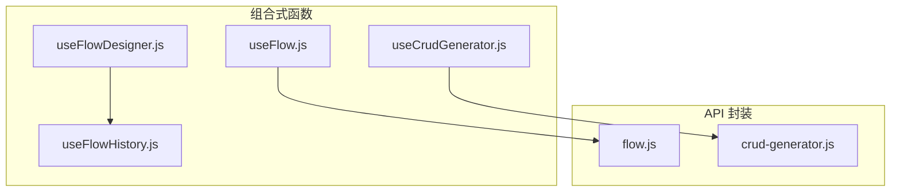
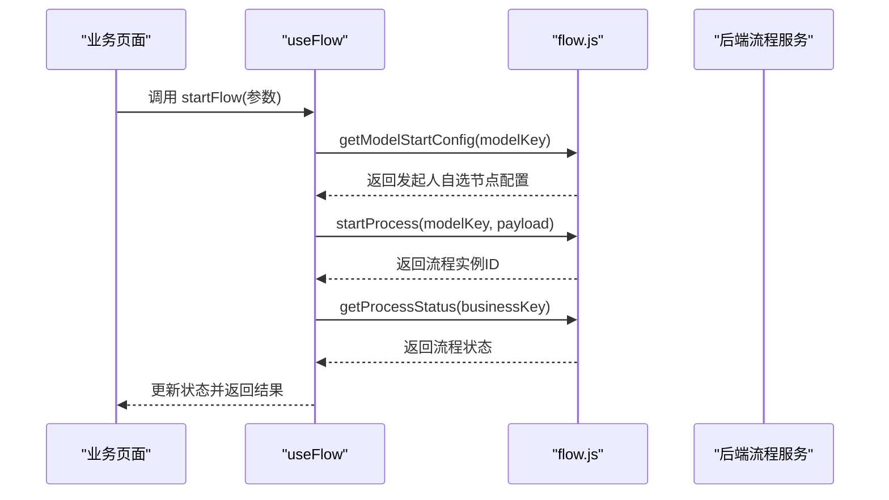
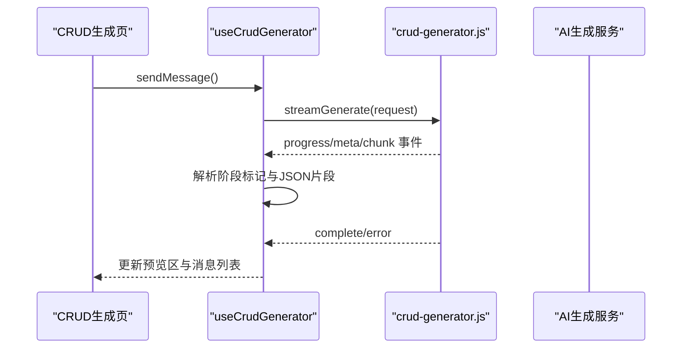
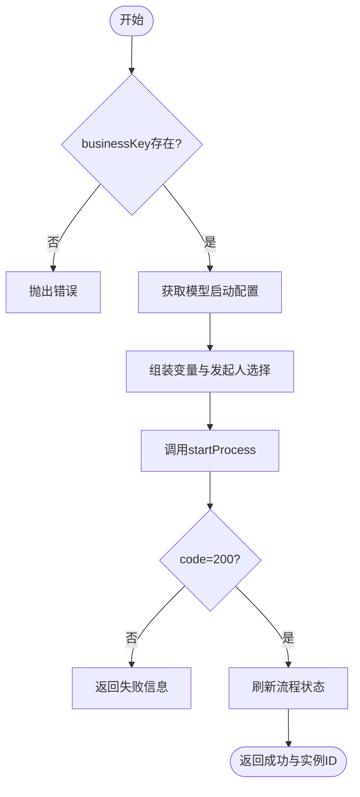
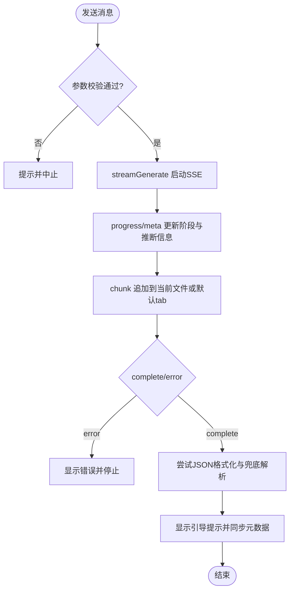
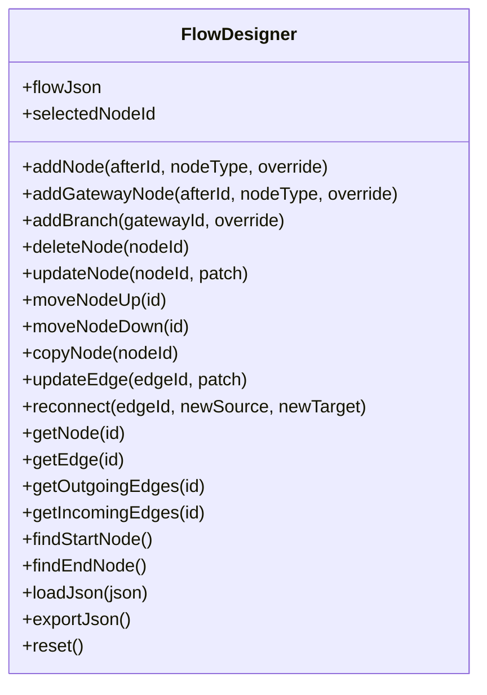
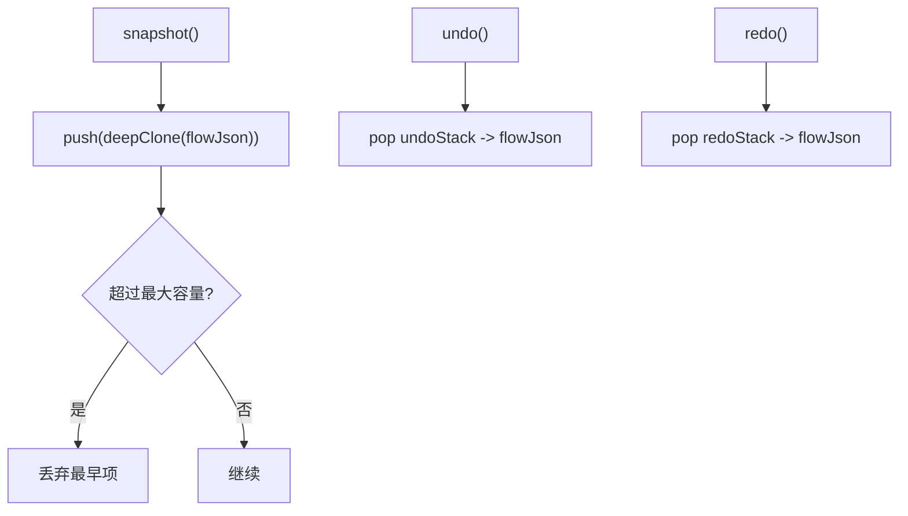
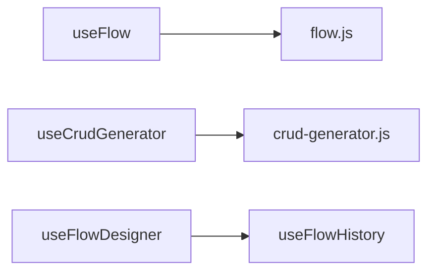

# 业务逻辑组合式函数

<cite>
**本文引用的文件**
- [useFlow.js](file://forge-admin-ui/src/composables/useFlow.js)
- [useCrudGenerator.js](file://forge-admin-ui/src/composables/useCrudGenerator.js)
- [flow.js](file://forge-admin-ui/src/api/flow.js)
- [crud-generator.js](file://forge-admin-ui/src/api/crud-generator.js)
- [useFlowDesigner.js](file://forge-admin-ui/src/components/flow-designer/composables/useFlowDesigner.js)
- [useFlowHistory.js](file://forge-admin-ui/src/components/flow-designer/composables/useFlowHistory.js)
</cite>

## 目录
1. [简介](#简介)
2. [项目结构](#项目结构)
3. [核心组件](#核心组件)
4. [架构总览](#架构总览)
5. [详细组件分析](#详细组件分析)
6. [依赖关系分析](#依赖关系分析)
7. [性能考虑](#性能考虑)
8. [故障排查指南](#故障排查指南)
9. [结论](#结论)
10. [附录](#附录)

## 简介
本技术文档聚焦于工作流与 CRUD 生成相关的组合式函数，重点解析 useFlow 与 useCrudGenerator 的业务封装能力。内容涵盖：
- 工作流状态管理、流程实例操作（发起、撤回、终止、审批等）
- 业务流程编排与任务处理视角的封装
- CRUD 代码生成的会话管理、SSE 流式生成、配置保存与预览
- 数据模型映射、API 调用封装、错误重试机制
- 复杂业务场景处理方案、事务管理与性能优化策略
- 完整业务流程示例与集成指南

## 项目结构
前端组合式函数位于 forge-admin-ui/src/composables，工作流相关 API 封装在 src/api/flow.js，CRUD 生成 SSE 客户端在 src/api/crud-generator.js，流程设计器编辑态组合式函数位于 components/flow-designer/composables。

图表来源
- [useFlow.js:1-388](file://forge-admin-ui/src/composables/useFlow.js#L1-L388)
- [useCrudGenerator.js:1-869](file://forge-admin-ui/src/composables/useCrudGenerator.js#L1-L869)
- [flow.js:1-600](file://forge-admin-ui/src/api/flow.js#L1-L600)
- [crud-generator.js:1-176](file://forge-admin-ui/src/api/crud-generator.js#L1-L176)
- [useFlowDesigner.js:1-387](file://forge-admin-ui/src/components/flow-designer/composables/useFlowDesigner.js#L1-L387)
- [useFlowHistory.js:1-117](file://forge-admin-ui/src/components/flow-designer/composables/useFlowHistory.js#L1-L117)

章节来源
- [useFlow.js:1-388](file://forge-admin-ui/src/composables/useFlow.js#L1-L388)
- [useCrudGenerator.js:1-869](file://forge-admin-ui/src/composables/useCrudGenerator.js#L1-L869)
- [flow.js:1-600](file://forge-admin-ui/src/api/flow.js#L1-L600)
- [crud-generator.js:1-176](file://forge-admin-ui/src/api/crud-generator.js#L1-L176)
- [useFlowDesigner.js:1-387](file://forge-admin-ui/src/components/flow-designer/composables/useFlowDesigner.js#L1-L387)
- [useFlowHistory.js:1-117](file://forge-admin-ui/src/components/flow-designer/composables/useFlowHistory.js#L1-L117)

## 核心组件
- useFlow：面向业务侧的流程集成 Composable，封装流程状态、发起、撤回、终止、审批历史与流程图信息获取；提供 useFlowTask 用于任务处理人视角的通过、驳回、转办、签收等操作。
- useCrudGenerator：面向 AI 驱动的 CRUD 页面生成，管理会话、消息、模板与模型选择、SSE 流式生成、分阶段内容解析、配置保存与预览。
- useFlowDesigner：流程设计器编辑态核心，维护 flowJson 状态并提供节点/边 CRUD、查询、导出与重置。
- useFlowHistory：基于 JSON 快照的撤销/重做栈，支持键盘快捷键绑定与容量控制。

章节来源
- [useFlow.js:1-388](file://forge-admin-ui/src/composables/useFlow.js#L1-L388)
- [useCrudGenerator.js:1-869](file://forge-admin-ui/src/composables/useCrudGenerator.js#L1-L869)
- [useFlowDesigner.js:1-387](file://forge-admin-ui/src/components/flow-designer/composables/useFlowDesigner.js#L1-L387)
- [useFlowHistory.js:1-117](file://forge-admin-ui/src/components/flow-designer/composables/useFlowHistory.js#L1-L117)

## 架构总览
前端组合式函数通过 API 层与后端交互，SSE 流式生成用于实时反馈与增量更新，设计器组合式函数负责流程模型的可视化编辑与版本化变更。

图表来源
- [useFlow.js:121-162](file://forge-admin-ui/src/composables/useFlow.js#L121-L162)
- [flow.js:126-139](file://forge-admin-ui/src/api/flow.js#L126-L139)

图表来源
- [useCrudGenerator.js:231-320](file://forge-admin-ui/src/composables/useCrudGenerator.js#L231-L320)
- [crud-generator.js:19-163](file://forge-admin-ui/src/api/crud-generator.js#L19-L163)

## 详细组件分析

### useFlow：业务流程集成
- 状态管理
  - 流程状态 data、loading、submitting
  - 计算属性：isRunning、isFinished、canStart、canWithdraw、statusText、statusTagType
- 核心方法
  - refreshStatus：根据 businessKey 刷新流程状态
  - startFlow：发起流程，支持发起人自选审批人、变量注入、用户上下文传递
  - withdrawFlow：发起人撤回运行中流程
  - terminateFlow：管理员强制终止流程
  - getApprovalHistory/getDiagramInfo：获取审批历史与流程图高亮信息
- 任务处理视角
  - useFlowTask：approve/reject/delegate/claim，统一封装任务操作与错误处理

图表来源
- [useFlow.js:121-162](file://forge-admin-ui/src/composables/useFlow.js#L121-L162)
- [flow.js:126-139](file://forge-admin-ui/src/api/flow.js#L126-L139)

章节来源
- [useFlow.js:1-388](file://forge-admin-ui/src/composables/useFlow.js#L1-L388)
- [flow.js:1-600](file://forge-admin-ui/src/api/flow.js#L1-L600)

### useCrudGenerator：CRUD 代码生成与会话管理
- 会话与消息
  - sessionId/messages/configKey/tableName/description/layoutType/providerId/modelId
  - loadSessionList/loadSession/deleteSession/startNewSession
- 模板与模型
  - loadTemplateList/loadProviderOptions/loadModelOptions
- SSE 流式生成
  - sendMessage：校验输入、构建请求、启动流式生成
  - handleSSEChunk：progress/meta/chunk 事件处理，阶段标记解析，思考过程与完整回复分离
  - handleSSEComplete：完成后的格式化与引导提示，异步同步会话元数据
  - parseStageMarkers/applyStageMap：兜底解析 [STAGE:xxx] 分段或整体 JSON
- 配置保存与预览
  - saveConfig：从 displayContent 读取最新内容，新增或更新配置
  - previewCrudPage：跳转到已保存配置的预览页
  - loadTableStructure：加载表结构为 Markdown 表格展示

图表来源
- [useCrudGenerator.js:231-448](file://forge-admin-ui/src/composables/useCrudGenerator.js#L231-L448)
- [crud-generator.js:19-163](file://forge-admin-ui/src/api/crud-generator.js#L19-L163)

章节来源
- [useCrudGenerator.js:1-869](file://forge-admin-ui/src/composables/useCrudGenerator.js#L1-L869)
- [crud-generator.js:1-176](file://forge-admin-ui/src/api/crud-generator.js#L1-L176)

### useFlowDesigner：流程设计器编辑态
- 状态与工具
  - flowJson 浅引用，selectedNodeId
  - createEmptyFlow：初始化起点与终点及默认边
- 节点与边操作
  - addNode/addGatewayNode：插入普通节点或网关，自动创建分支与合并目标
  - addBranch：为网关添加新分支，维护默认分支与合并节点
  - deleteNode：删除普通节点或递归删除网关分支链
  - updateNode/updateEdge/reconnect：局部更新节点与边
  - moveNodeUp/moveNodeDown：线性链内交换邻居位置
  - copyNode：复制非起止节点
- 查询与导出
  - getNode/getEdge/getOutgoingEdges/getIncomingEdges/findStartNode/findEndNode
  - loadJson/exportJson/reset

图表来源
- [useFlowDesigner.js:25-387](file://forge-admin-ui/src/components/flow-designer/composables/useFlowDesigner.js#L25-L387)

章节来源
- [useFlowDesigner.js:1-387](file://forge-admin-ui/src/components/flow-designer/composables/useFlowDesigner.js#L1-L387)

### useFlowHistory：撤销/重做
- 基于 JSON 深拷贝的命令栈
  - snapshot：压入 undoStack，清空 redoStack
  - undo/redo：在两个栈之间移动快照并恢复 flowJsonRef
  - bindKeyboard：Ctrl/Cmd+Z/Y/Shift+Z 快捷键绑定
  - clear：清空栈

图表来源
- [useFlowHistory.js:25-117](file://forge-admin-ui/src/components/flow-designer/composables/useFlowHistory.js#L25-L117)

章节来源
- [useFlowHistory.js:1-117](file://forge-admin-ui/src/components/flow-designer/composables/useFlowHistory.js#L1-L117)

## 依赖关系分析
- useFlow 依赖 flow.js 提供的流程任务、流程实例、流程模型、表单定义、抄送、审批意见等接口。
- useCrudGenerator 依赖 crud-generator.js 的 SSE 流式生成与会话管理接口，以及 AI 配置与模板接口。
- useFlowDesigner 与 useFlowHistory 共同维护流程模型的编辑态与版本化变更。

图表来源
- [useFlow.js:1-388](file://forge-admin-ui/src/composables/useFlow.js#L1-L388)
- [flow.js:1-600](file://forge-admin-ui/src/api/flow.js#L1-L600)
- [useCrudGenerator.js:1-869](file://forge-admin-ui/src/composables/useCrudGenerator.js#L1-L869)
- [crud-generator.js:1-176](file://forge-admin-ui/src/api/crud-generator.js#L1-L176)
- [useFlowDesigner.js:1-387](file://forge-admin-ui/src/components/flow-designer/composables/useFlowDesigner.js#L1-L387)
- [useFlowHistory.js:1-117](file://forge-admin-ui/src/components/flow-designer/composables/useFlowHistory.js#L1-L117)

章节来源
- [useFlow.js:1-388](file://forge-admin-ui/src/composables/useFlow.js#L1-L388)
- [flow.js:1-600](file://forge-admin-ui/src/api/flow.js#L1-L600)
- [useCrudGenerator.js:1-869](file://forge-admin-ui/src/composables/useCrudGenerator.js#L1-L869)
- [crud-generator.js:1-176](file://forge-admin-ui/src/api/crud-generator.js#L1-L176)
- [useFlowDesigner.js:1-387](file://forge-admin-ui/src/components/flow-designer/composables/useFlowDesigner.js#L1-L387)
- [useFlowHistory.js:1-117](file://forge-admin-ui/src/components/flow-designer/composables/useFlowHistory.js#L1-L117)

## 性能考虑
- 工作流状态刷新
  - 使用 computed 派生状态减少重复计算
  - 仅在 businessKey 变化时触发刷新，避免频繁请求
- CRUD 生成流式处理
  - SSE 分块接收与增量渲染，降低首屏等待时间
  - 自动重试与中断控制，提升网络不稳定时的鲁棒性
  - 对 JSON 内容进行本地格式化与兜底解析，减少服务端压力
- 设计器编辑态
  - 浅引用 flowJson 提升响应性能
  - 撤销/重做使用深拷贝快照，限制栈大小防止内存膨胀

[本节为通用指导，不直接分析具体文件]

## 故障排查指南
- 工作流发起失败
  - 检查 businessKey 与 title 是否必填
  - 确认模型启动配置中的发起人自选节点是否已正确选择
  - 查看 flowApi.startProcess 返回码与消息
- 审批任务操作失败
  - 检查 taskId、userId、comment 与 variables 是否正确
  - 捕获异常并记录错误信息
- CRUD 生成错误
  - 检查 configKey、tableName、description、providerId、modelId 是否有效
  - 关注 SSE 的 progress/meta/chunk/complete/error 事件
  - 若未收到数据，可能触发重试机制；多次失败后需检查网络与服务端状态
- 设计器操作异常
  - 确保节点类型与连接关系合法（如网关后不能直接插入新网关）
  - 撤销/重做时注意栈容量与深拷贝开销

章节来源
- [useFlow.js:121-162](file://forge-admin-ui/src/composables/useFlow.js#L121-L162)
- [useFlow.js:294-387](file://forge-admin-ui/src/composables/useFlow.js#L294-L387)
- [useCrudGenerator.js:231-448](file://forge-admin-ui/src/composables/useCrudGenerator.js#L231-L448)
- [crud-generator.js:19-163](file://forge-admin-ui/src/api/crud-generator.js#L19-L163)
- [useFlowDesigner.js:63-158](file://forge-admin-ui/src/components/flow-designer/composables/useFlowDesigner.js#L63-L158)

## 结论
useFlow 与 useCrudGenerator 分别将工作流与 CRUD 生成的复杂逻辑封装为易用的组合式函数，显著降低了业务页面的耦合度与维护成本。结合 useFlowDesigner 与 useFlowHistory，实现了流程模型的可视化编辑与版本化变更。通过 SSE 流式生成与自动重试机制，提升了用户体验与系统健壮性。建议在复杂业务场景中采用这些组合式函数进行编排，并结合事务管理与性能优化策略，确保端到端的稳定与高效。

[本节为总结性内容，不直接分析具体文件]

## 附录
- 业务流程示例
  - 发起请假申请：调用 useFlow('leave_apply', businessKeyRef).startFlow({ title, variables })，随后刷新状态并展示审批历史
  - 任务审批：在任务处理页使用 useFlowTask().approve(taskId, comment, variables) 或 reject
- CRUD 生成示例
  - 输入描述与表名，选择供应商与模型，点击发送后观察 SSE 进度与分阶段输出，完成后保存配置并预览页面
- 集成要点
  - 确保 flow.js 与 crud-generator.js 的 API 路径与认证头配置正确
  - 在设计器中使用 useFlowDesigner 与 useFlowHistory 管理流程模型与撤销/重做
  - 结合 useDiscreteMessage 提供用户友好的提示与错误反馈

[本节为补充说明，不直接分析具体文件]