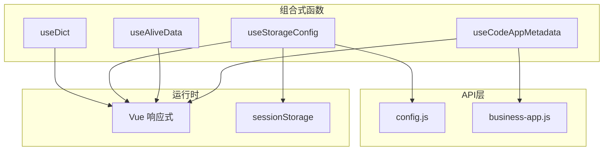
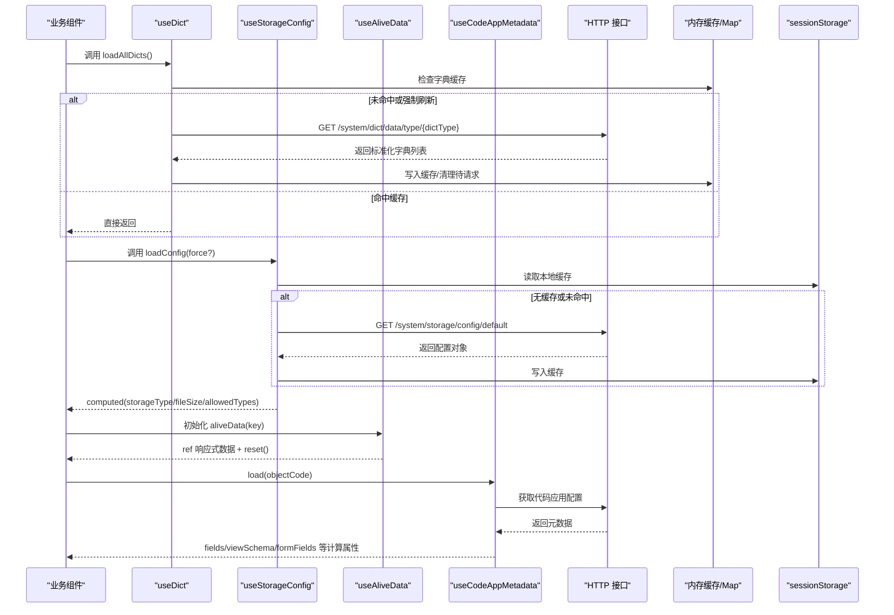
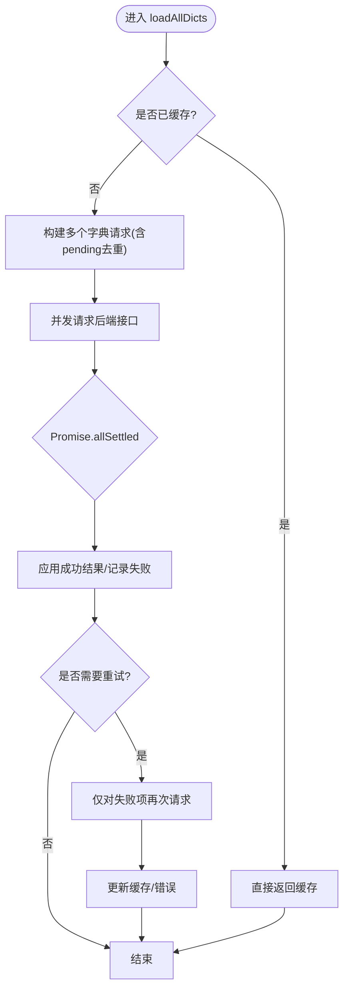
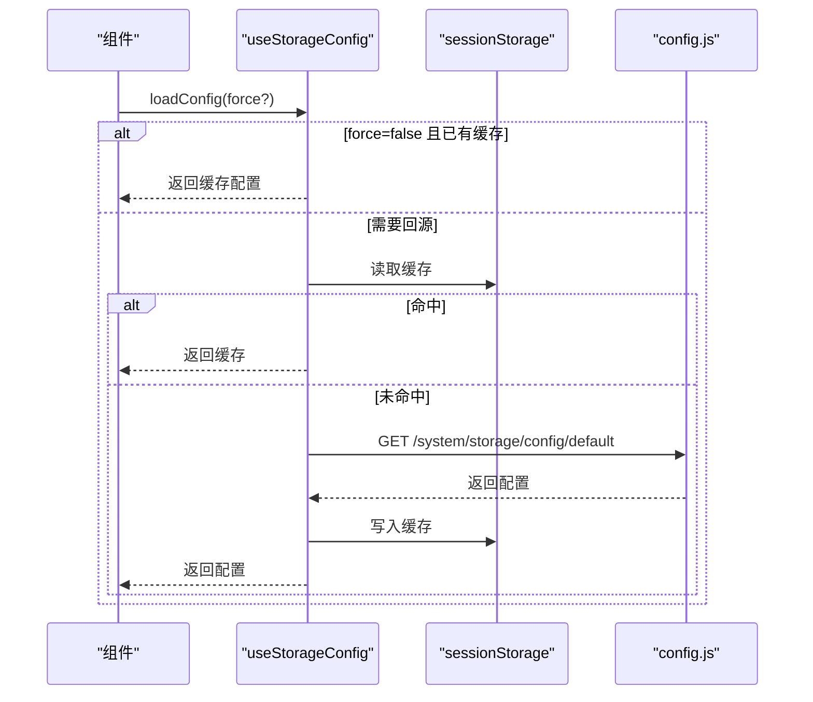
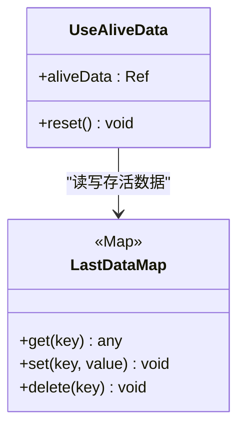
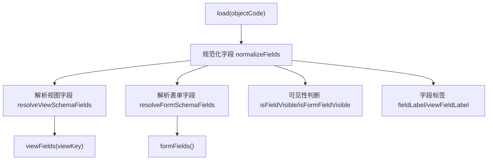
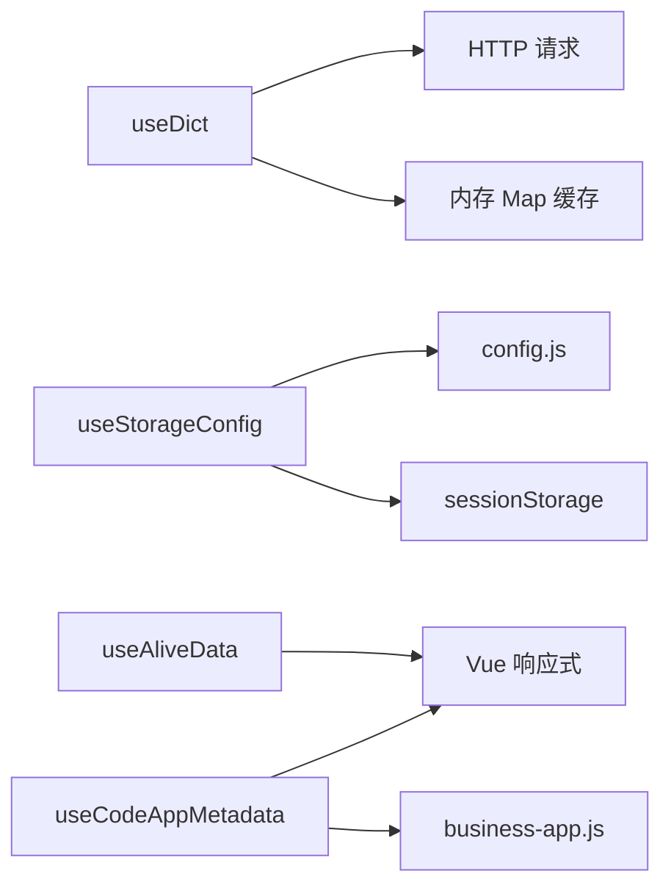

# 数据管理组合式函数

<cite>
**本文引用的文件**
- [useDict.js](file://forge-admin-ui/src/composables/useDict.js)
- [useStorageConfig.js](file://forge-admin-ui/src/composables/useStorageConfig.js)
- [useAliveData.js](file://forge-admin-ui/src/composables/useAliveData.js)
- [useCodeAppMetadata.js](file://forge-admin-ui/src/composables/useCodeAppMetadata.js)
- [config.js](file://forge-admin-ui/src/api/config.js)
- [business-app.js](file://forge-admin-ui/src/api/business-app.js)
- [index.js（composables）](file://forge-admin-ui/src/composables/index.js)
</cite>

## 目录
1. [简介](#简介)
2. [项目结构](#项目结构)
3. [核心组件](#核心组件)
4. [架构总览](#架构总览)
5. [详细组件分析](#详细组件分析)
6. [依赖关系分析](#依赖关系分析)
7. [性能与内存优化](#性能与内存优化)
8. [故障排查指南](#故障排查指南)
9. [结论](#结论)
10. [附录：数据流图与最佳实践](#附录数据流图与最佳实践)

## 简介
本技术文档聚焦前端数据管理相关的四个组合式函数：useDict、useStorageConfig、useAliveData、useCodeAppMetadata。它们分别承担字典数据缓存与并发控制、存储配置的全局缓存与持久化、页面级存活数据的跨路由共享，以及代码应用元数据的加载与视图/表单字段解析等职责。文档从设计思路、实现细节、数据流、缓存策略、持久化方案、版本管理、大数据量处理、内存优化、并发访问控制等方面展开，并配套流程图、时序图和架构图，帮助读者快速理解与高效使用。

## 项目结构
这四个组合式函数位于 forge-admin-ui/src/composables 目录下，统一通过 index.js 暴露给上层模块使用。其对外依赖主要包括：
- HTTP 请求封装：用于拉取字典、系统配置、代码应用配置等
- 浏览器存储：sessionStorage 用于临时缓存配置
- Vue 响应式：ref、computed、watch、onMounted 等

图表来源
- [useDict.js:15-254](file://forge-admin-ui/src/composables/useDict.js#L15-L254)
- [useStorageConfig.js:9-69](file://forge-admin-ui/src/composables/useStorageConfig.js#L9-L69)
- [useAliveData.js:1-23](file://forge-admin-ui/src/composables/useAliveData.js#L1-L23)
- [useCodeAppMetadata.js:1-246](file://forge-admin-ui/src/composables/useCodeAppMetadata.js#L1-L246)
- [config.js:31-37](file://forge-admin-ui/src/api/config.js#L31-L37)
- [business-app.js:1-200](file://forge-admin-ui/src/api/business-app.js#L1-L200)

章节来源
- [index.js（composables）:1-10](file://forge-admin-ui/src/composables/index.js#L1-L10)

## 核心组件
- useDict：提供字典类型的数据加载、全局缓存、并发去重、失败重试与工具方法（取值、获取标签）。
- useStorageConfig：提供默认存储配置的全局缓存、sessionStorage 持久化、computed 派生常用值。
- useAliveData：提供基于路由名称的页面级“存活数据”共享，支持重置。
- useCodeAppMetadata：加载并规范化代码应用元数据，提供视图/表单字段解析、可见性判断与别名映射。

章节来源
- [useDict.js:15-254](file://forge-admin-ui/src/composables/useDict.js#L15-L254)
- [useStorageConfig.js:9-69](file://forge-admin-ui/src/composables/useStorageConfig.js#L9-L69)
- [useAliveData.js:1-23](file://forge-admin-ui/src/composables/useAliveData.js#L1-L23)
- [useCodeAppMetadata.js:1-246](file://forge-admin-ui/src/composables/useCodeAppMetadata.js#L1-L246)

## 架构总览
下图展示了四个组合式函数的整体交互与数据流向：

图表来源
- [useDict.js:27-123](file://forge-admin-ui/src/composables/useDict.js#L27-L123)
- [useStorageConfig.js:17-57](file://forge-admin-ui/src/composables/useStorageConfig.js#L17-L57)
- [useAliveData.js:1-23](file://forge-admin-ui/src/composables/useAliveData.js#L1-L23)
- [useCodeAppMetadata.js:22-43](file://forge-admin-ui/src/composables/useCodeAppMetadata.js#L22-L43)
- [config.js:31-37](file://forge-admin-ui/src/api/config.js#L31-L37)
- [business-app.js:1-200](file://forge-admin-ui/src/api/business-app.js#L1-L200)

## 详细组件分析

### useDict：字典数据管理
- 设计目标
  - 为多字典类型提供统一的加载、缓存与错误隔离能力
  - 避免同一字典并发重复请求
  - 提供便捷的值到标签转换与单项查询
- 关键机制
  - 全局 Map 缓存 dictCache 与 pending 队列 dictPendingCache，保证并发安全与幂等
  - 标准化后端字典项为 {label, value, ...} 并排序
  - Promise.allSettled 批量加载，逐项记录错误，支持一次重试
  - onMounted 自动加载传入的字典类型
- 复杂度与性能
  - 单次加载 O(n) 遍历与排序；批量加载使用并行请求
  - 内存占用与字典数量成正比，建议按需加载与定期清理
- 并发与容错
  - 同一字典并发请求合并
  - 失败不污染缓存，外层可捕获 errors 状态
- 扩展点
  - clearDictCache 可按类型或全量清理
  - getDictData 暴露底层带缓存的获取能力

图表来源
- [useDict.js:130-207](file://forge-admin-ui/src/composables/useDict.js#L130-L207)
- [useDict.js:27-92](file://forge-admin-ui/src/composables/useDict.js#L27-L92)

章节来源
- [useDict.js:15-254](file://forge-admin-ui/src/composables/useDict.js#L15-L254)

### useStorageConfig：存储配置管理
- 设计目标
  - 全局缓存默认存储配置，并提供 computed 派生常用值（storageType、fileSize、allowedTypes）
- 关键机制
  - 首次加载优先读 session 缓存，再回源接口，成功后写回缓存
  - 并发保护：pending 变量防止重复请求
  - 异常降级：网络或解析失败时返回 null，组件侧需设置默认值
- 复杂度与性能
  - 读取/写入 sessionStorage 为 O(1)
  - computed 派生值在依赖变化时惰性计算
- 适用场景
  - 文件上传大小限制、允许的文件类型、存储后端类型等全局策略

图表来源
- [useStorageConfig.js:17-57](file://forge-admin-ui/src/composables/useStorageConfig.js#L17-L57)
- [config.js:31-37](file://forge-admin-ui/src/api/config.js#L31-L37)

章节来源
- [useStorageConfig.js:9-69](file://forge-admin-ui/src/composables/useStorageConfig.js#L9-L69)
- [config.js:31-37](file://forge-admin-ui/src/api/config.js#L31-L37)

### useAliveData：页面存活数据
- 设计目标
  - 以路由名为键，维护一份“存活数据”，在路由切换后仍可保留
- 关键机制
  - 使用 Map 保存 lastDataMap，key 默认为当前路由 name
  - 内部 ref 响应式数据，deep watch 同步到 Map
  - 提供 reset 将数据恢复初始值并从 Map 移除
- 复杂度与性能
  - 读写 Map 为 O(1)，watch 深度监听可能带来一定开销，适合轻量数据
- 注意事项
  - 大数据不建议放入 aliveData，避免不必要的深拷贝与监听成本

图表来源
- [useAliveData.js:1-23](file://forge-admin-ui/src/composables/useAliveData.js#L1-L23)

章节来源
- [useAliveData.js:1-23](file://forge-admin-ui/src/composables/useAliveData.js#L1-L23)

### useCodeAppMetadata：代码应用元数据
- 设计目标
  - 加载并规范化代码应用元数据，提供视图/表单字段解析、可见性判断与字段别名映射
- 关键机制
  - 加载：调用 businessFlowAppConfig，提取 codeAppMetadata
  - 规范化：normalizeFields 统一字段标识与可见性标记
  - 视图字段：resolveViewSchemaFields 支持 LIST/DETAIL 及旧版 views
  - 表单字段：resolveFormSchemaFields 递归扫描 schema 中的 fieldBinding
  - 可见性：isFieldVisible/isFormFieldVisible 综合 internal/systemField/visible/formVisible
  - 别名：snake_case/camelCase 互转，提升兼容性
- 复杂度与性能
  - 字段解析为 O(n) 遍历；computed 惰性求值，减少重复计算
  - 大表单/复杂视图下注意 schema 规模
- 适用场景
  - 动态渲染列表列、详情区块、表单控件，以及权限/可见性控制

图表来源
- [useCodeAppMetadata.js:22-125](file://forge-admin-ui/src/composables/useCodeAppMetadata.js#L22-L125)
- [useCodeAppMetadata.js:127-246](file://forge-admin-ui/src/composables/useCodeAppMetadata.js#L127-L246)
- [business-app.js:1-200](file://forge-admin-ui/src/api/business-app.js#L1-L200)

章节来源
- [useCodeAppMetadata.js:1-246](file://forge-admin-ui/src/composables/useCodeAppMetadata.js#L1-L246)
- [business-app.js:1-200](file://forge-admin-ui/src/api/business-app.js#L1-L200)

## 依赖关系分析
- useDict
  - 依赖 HTTP 请求封装，调用 /system/dict/data/type/{dictType}
  - 依赖 Vue 响应式 with ref/onMounted
  - 依赖内存 Map 做缓存与并发控制
- useStorageConfig
  - 依赖 config.js 的 getDefaultStorageConfig
  - 依赖 sessionStorage 做会话级持久化
  - 依赖 Vue computed 派生常用值
- useAliveData
  - 依赖 Vue ref/watch/onMounted（间接通过路由名）
  - 依赖内存 Map 做跨路由共享
- useCodeAppMetadata
  - 依赖 business-app.js 的 businessFlowAppConfig
  - 依赖 Vue computed/ref 进行数据派生与状态管理

图表来源
- [useDict.js:15-254](file://forge-admin-ui/src/composables/useDict.js#L15-L254)
- [useStorageConfig.js:9-69](file://forge-admin-ui/src/composables/useStorageConfig.js#L9-L69)
- [useAliveData.js:1-23](file://forge-admin-ui/src/composables/useAliveData.js#L1-L23)
- [useCodeAppMetadata.js:1-246](file://forge-admin-ui/src/composables/useCodeAppMetadata.js#L1-L246)
- [config.js:31-37](file://forge-admin-ui/src/api/config.js#L31-L37)
- [business-app.js:1-200](file://forge-admin-ui/src/api/business-app.js#L1-L200)

章节来源
- [index.js（composables）:1-10](file://forge-admin-ui/src/composables/index.js#L1-L10)

## 性能与内存优化
- 字典数据（useDict）
  - 并发合并：同一字典并发请求只发一次，降低服务器压力
  - 排序与标准化：一次性完成，避免重复处理
  - 内存控制：按字典类型粒度清理，避免长期持有无用数据
  - 大数据建议：分页或懒加载，结合路由/组件生命周期按需加载
- 存储配置（useStorageConfig）
  - 会话级缓存：避免重复请求，提升首屏速度
  - computed 派生：仅在依赖变化时计算，减少 CPU 消耗
  - 异常降级：失败时返回空/默认值，保障 UI 可用
- 存活数据（useAliveData）
  - 轻量数据：适合小体积、频繁读写的上下文
  - 避免深监听大对象：必要时拆分或使用浅比较
  - 及时 reset：释放 Map 引用，避免内存泄漏
- 代码应用元数据（useCodeAppMetadata）
  - 字段解析惰性：computed 延迟计算，按需触发
  - 别名兼容：减少因命名差异导致的重复查找
  - 大 schema 优化：考虑分片加载或按需解析视图/表单

[本节为通用指导，不直接分析具体文件]

## 故障排查指南
- 字典加载失败
  - 现象：errors 中对应字典类型有错误信息，loading 最终归位
  - 排查：检查后端接口 /system/dict/data/type/{dictType} 返回码与数据结构；确认字典类型是否存在
  - 处理：调用 reload(types) 重试；必要时 clearDictCache(dictType) 清理后重新加载
  - 参考路径
    - [useDict.js:130-207](file://forge-admin-ui/src/composables/useDict.js#L130-L207)
    - [useDict.js:27-92](file://forge-admin-ui/src/composables/useDict.js#L27-L92)
- 存储配置加载失败
  - 现象：storageType/fileSize/allowedTypes 使用默认值
  - 排查：检查 /system/storage/config/default 接口；确认 sessionStorage 是否可用
  - 处理：调用 loadConfig(true) 强制刷新；在组件中提供兜底默认值
  - 参考路径
    - [useStorageConfig.js:30-57](file://forge-admin-ui/src/composables/useStorageConfig.js#L30-L57)
    - [config.js:31-37](file://forge-admin-ui/src/api/config.js#L31-L37)
- 存活数据未生效
  - 现象：路由切换后数据丢失或不同路由间互相覆盖
  - 排查：确认 key（路由名）是否正确；检查 reset 是否被误调用
  - 处理：确保每个路由独立 key；必要时拆分数据域
  - 参考路径
    - [useAliveData.js:1-23](file://forge-admin-ui/src/composables/useAliveData.js#L1-L23)
- 代码应用元数据为空或字段不可见
  - 现象：fields 为空、viewFields/formFields 不符合预期
  - 排查：检查后端返回的 codeAppMetadata 结构；确认字段 visible/internal/systemField/formVisible 等标志
  - 处理：修正后端配置；使用 viewFieldLabel/fieldLabel 调试显示名称
  - 参考路径
    - [useCodeAppMetadata.js:22-43](file://forge-admin-ui/src/composables/useCodeAppMetadata.js#L22-L43)
    - [useCodeAppMetadata.js:127-246](file://forge-admin-ui/src/composables/useCodeAppMetadata.js#L127-L246)

章节来源
- [useDict.js:130-207](file://forge-admin-ui/src/composables/useDict.js#L130-L207)
- [useStorageConfig.js:30-57](file://forge-admin-ui/src/composables/useStorageConfig.js#L30-L57)
- [useAliveData.js:1-23](file://forge-admin-ui/src/composables/useAliveData.js#L1-L23)
- [useCodeAppMetadata.js:22-43](file://forge-admin-ui/src/composables/useCodeAppMetadata.js#L22-L43)
- [useCodeAppMetadata.js:127-246](file://forge-admin-ui/src/composables/useCodeAppMetadata.js#L127-L246)
- [config.js:31-37](file://forge-admin-ui/src/api/config.js#L31-L37)

## 结论
四个组合式函数围绕“数据获取—缓存—派生—复用”的主线，提供了高内聚、低耦合的前端数据管理能力。useDict 解决字典并发与缓存问题；useStorageConfig 提供配置级全局缓存与持久化；useAliveData 实现页面级数据共享；useCodeAppMetadata 负责复杂元数据的规范化与可视化字段解析。配合合理的缓存策略、错误处理与性能优化，可在复杂业务场景中稳定支撑数据驱动型界面。

[本节为总结性内容，不直接分析具体文件]

## 附录：数据流图与最佳实践
- 推荐实践
  - 字典：按路由/页面维度加载，避免全局一次性加载过多字典；必要时定时刷新
  - 存储配置：首屏优先使用缓存，后台静默刷新；UI 层始终提供默认值
  - 存活数据：仅存放轻量上下文；大数据仍走 store 或接口
  - 元数据：对大 schema 采用分片或懒加载；利用 computed 派生减少重复计算
- 监控建议
  - 字典：统计命中率、平均耗时、失败率
  - 存储配置：缓存命中率、接口调用次数
  - 存活数据：内存增长趋势、watch 触发频率
  - 元数据：字段解析耗时、schema 大小
- 版本管理
  - 字典：后端字段变更时，前端通过标准化层兼容新旧字段
  - 存储配置：新增字段时提供默认值与降级逻辑
  - 元数据：字段别名兼容 snake/camel；视图/表单 schema 演进时保持向后兼容

[本节为概念性内容，不直接分析具体文件]