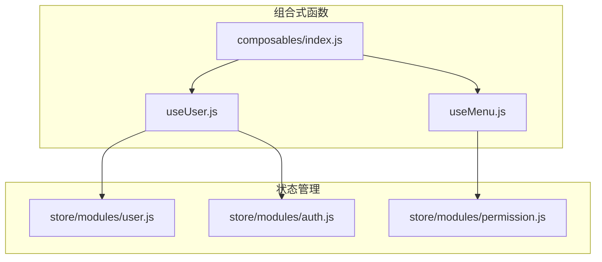
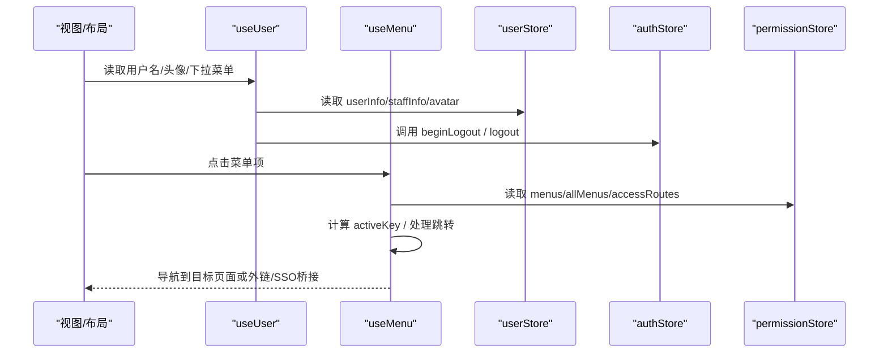
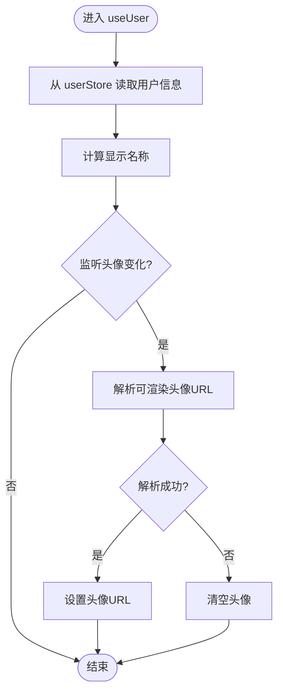
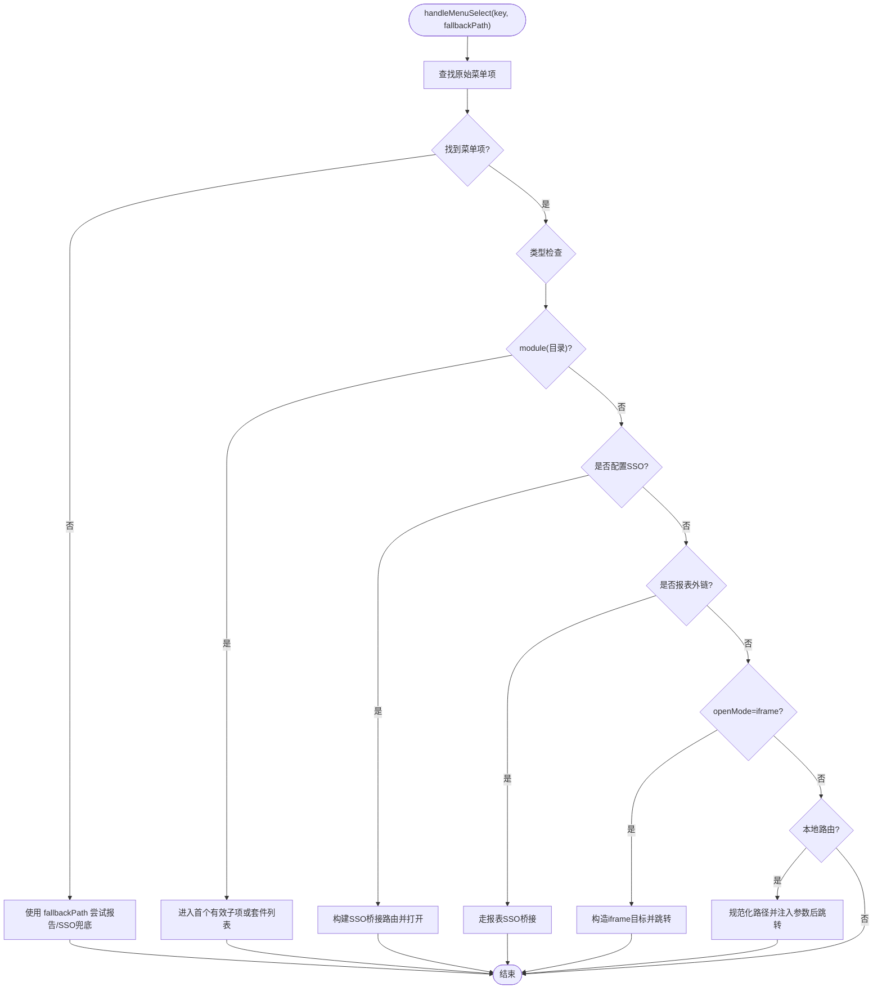
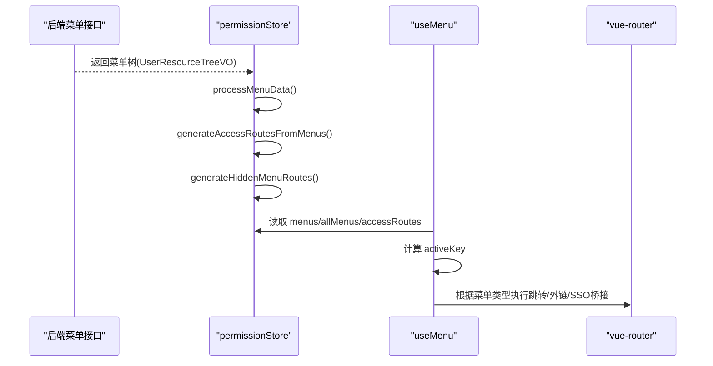
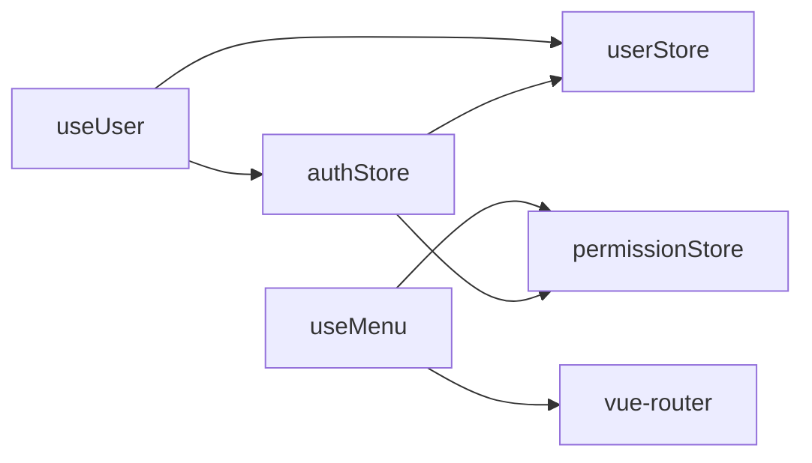

# 用户管理组合式函数

<cite>
**本文引用的文件**
- [useUser.js](file://forge-admin-ui/src/composables/useUser.js)
- [useMenu.js](file://forge-admin-ui/src/composables/useMenu.js)
- [index.js（composables）](file://forge-admin-ui/src/composables/index.js)
- [user.js（store）](file://forge-admin-ui/src/store/modules/user.js)
- [auth.js（store）](file://forge-admin-ui/src/store/modules/auth.js)
- [permission.js（store）](file://forge-admin-ui/src/store/modules/permission.js)
</cite>

## 目录
1. [简介](#简介)
2. [项目结构](#项目结构)
3. [核心组件](#核心组件)
4. [架构总览](#架构总览)
5. [详细组件分析](#详细组件分析)
6. [依赖关系分析](#依赖关系分析)
7. [性能考虑](#性能考虑)
8. [故障排查指南](#故障排查指南)
9. [结论](#结论)
10. [附录](#附录)

## 简介
本文面向前端工程中的“用户管理”能力，聚焦两个组合式函数：
- useUser：封装用户信息展示、头像加载、下拉菜单与退出登录等交互。
- useMenu：封装菜单数据处理、活跃项计算、导航跳转与外链/Sso桥接策略。

文档将深入解析其实现原理，包括：
- 用户状态管理与响应式更新策略
- 权限控制与动态菜单生成
- 认证流程、角色权限验证、外链与内嵌打开策略
- 异步数据加载与错误处理机制
- 使用示例、最佳实践与性能优化建议

## 项目结构
本仓库前端部分位于 forge-admin-ui，相关代码集中在 composables 与 store 模块：
- composables：组合式函数集中地，导出 useUser、useMenu 等能力
- store：Pinia 状态管理，包含用户、认证、权限等模块

**图表来源**
- [useUser.js:1-164](file://forge-admin-ui/src/composables/useUser.js#L1-L164)
- [useMenu.js:1-577](file://forge-admin-ui/src/composables/useMenu.js#L1-L577)
- [index.js（composables）:1-10](file://forge-admin-ui/src/composables/index.js#L1-L10)
- [user.js（store）:1-137](file://forge-admin-ui/src/store/modules/user.js#L1-L137)
- [auth.js（store）:1-112](file://forge-admin-ui/src/store/modules/auth.js#L1-L112)
- [permission.js（store）:1-368](file://forge-admin-ui/src/store/modules/permission.js#L1-L368)

**章节来源**
- [useUser.js:1-164](file://forge-admin-ui/src/composables/useUser.js#L1-L164)
- [useMenu.js:1-577](file://forge-admin-ui/src/composables/useMenu.js#L1-L577)
- [index.js（composables）:1-10](file://forge-admin-ui/src/composables/index.js#L1-L10)
- [user.js（store）:1-137](file://forge-admin-ui/src/store/modules/user.js#L1-L137)
- [auth.js（store）:1-112](file://forge-admin-ui/src/store/modules/auth.js#L1-L112)
- [permission.js（store）:1-368](file://forge-admin-ui/src/store/modules/permission.js#L1-L368)

## 核心组件
- useUser：提供用户名、头像、头像回退文本、下拉菜单选项、可见性状态、跳转个人资料/修改密码、退出登录等能力；通过监听用户头像变化自动刷新渲染地址。
- useMenu：提供已处理菜单、扁平化菜单、当前激活菜单 key、菜单选择处理（支持外链、iframe、SSO 桥接）、按路径查找顶级菜单等能力；内部对菜单数据进行规范化、过滤、排序与路由生成。

**章节来源**
- [useUser.js:1-164](file://forge-admin-ui/src/composables/useUser.js#L1-L164)
- [useMenu.js:1-577](file://forge-admin-ui/src/composables/useMenu.js#L1-L577)

## 架构总览
下图展示了用户与菜单组合式函数与 Pinia Store 的协作关系，以及菜单在权限驱动下的生成与导航流程。

**图表来源**
- [useUser.js:37-163](file://forge-admin-ui/src/composables/useUser.js#L37-L163)
- [useMenu.js:309-575](file://forge-admin-ui/src/composables/useMenu.js#L309-L575)
- [user.js（store）:26-137](file://forge-admin-ui/src/store/modules/user.js#L26-L137)
- [auth.js（store）:7-112](file://forge-admin-ui/src/store/modules/auth.js#L7-L112)
- [permission.js（store）:14-368](file://forge-admin-ui/src/store/modules/permission.js#L14-L368)

## 详细组件分析

### useUser 组合式函数
职责与能力
- 用户显示名称：优先 realName，其次 username，再 fallback 到 staffName，最后为默认值。
- 头像回退文本：取用户名首字母大写。
- 头像 URL：基于 userStore.avatar，通过工具方法解析可渲染地址；失败时清空。
- 下拉菜单：固定选项（个人资料、分隔线、退出登录），支持统一选择处理。
- 退出登录：确认弹窗后调用 authStore.beginLogout -> api.logout -> authStore.logout，并提示成功。

响应式与副作用
- 使用 computed 派生 userName、userAvatarText、userDropdownOptions。
- 使用 watch 监听 userStore.avatar 变化，立即触发 loadAvatar。
- 使用 ref 管理 dropdownVisible、userAvatar。

错误处理
- 头像解析失败时捕获异常并清空头像，避免界面闪烁。
- 退出登录接口异常时，若非静默认证错误则记录日志，不影响后续清理流程。

**图表来源**
- [useUser.js:42-78](file://forge-admin-ui/src/composables/useUser.js#L42-L78)

**章节来源**
- [useUser.js:1-164](file://forge-admin-ui/src/composables/useUser.js#L1-L164)
- [user.js（store）:26-137](file://forge-admin-ui/src/store/modules/user.js#L26-L137)
- [auth.js（store）:43-106](file://forge-admin-ui/src/store/modules/auth.js#L43-L106)

### useMenu 组合式函数
职责与能力
- 已处理菜单 processedMenus：基于 permissionStore.menus 进行标准化处理，供菜单组件直接使用。
- 扁平化菜单 flatMenuItems：用于快速查找与遍历。
- 活跃菜单 activeKey：根据 route.meta.parentKey、精确匹配、前缀匹配、route.name 等多优先级推导。
- 菜单选择 handleMenuSelect：支持多种目标类型：
  - 业务域（套件）目录：进入列表页或首个有效子项
  - 配置 SSO 外链：构建桥接路由并打开
  - 报表外链：识别并走 SSO 桥接
  - 未匹配路由：尝试 SSO 桥接兜底
  - iframe 模式：拼接子应用地址并通过 iframe 路由打开
  - 普通本地路由：规范化路径并注入 menuKey/appId/title 等查询参数

关键算法与策略
- 外链与报表识别：通过域名与路径前缀判断是否为报表目标，统一走 SSO 桥接。
- 本地路径规范化：补全前导斜杠、去除 hash/query、兼容外部链接。
- 业务运行时目标增强：为 /ai/crud-page/ 与 /app-center/app/{id} 注入必要查询参数。
- 无匹配路由兜底：当路由解析为 404 或通配符时，尝试以 SSO 桥接方式打开。

**图表来源**
- [useMenu.js:159-215](file://forge-admin-ui/src/composables/useMenu.js#L159-L215)
- [useMenu.js:314-376](file://forge-admin-ui/src/composables/useMenu.js#L314-L376)
- [useMenu.js:461-561](file://forge-admin-ui/src/composables/useMenu.js#L461-L561)

**章节来源**
- [useMenu.js:1-577](file://forge-admin-ui/src/composables/useMenu.js#L1-L577)
- [permission.js（store）:14-368](file://forge-admin-ui/src/store/modules/permission.js#L14-L368)

### 权限与菜单数据流
- 权限数据进入 permissionStore 后，会：
  - 转换为前端菜单格式（processMenuData），过滤按钮与API，仅保留目录与菜单
  - 生成访问路由（generateAccessRoutesFromMenus），并为外链注入 iframe 组件
  - 提取隐藏菜单路由（generateHiddenMenuRoutes），确保 meta.title 可用
  - 维护 allMenus 用于标题查找与高亮
- useMenu 读取 processedMenus 与 flatMenuItems，结合当前路由计算 activeKey，并在选择菜单时执行相应导航策略。

**图表来源**
- [permission.js（store）:24-146](file://forge-admin-ui/src/store/modules/permission.js#L24-L146)
- [permission.js（store）:148-303](file://forge-admin-ui/src/store/modules/permission.js#L148-L303)
- [useMenu.js:381-455](file://forge-admin-ui/src/composables/useMenu.js#L381-L455)
- [useMenu.js:461-561](file://forge-admin-ui/src/composables/useMenu.js#L461-L561)

**章节来源**
- [permission.js（store）:14-368](file://forge-admin-ui/src/store/modules/permission.js#L14-L368)
- [useMenu.js:309-575](file://forge-admin-ui/src/composables/useMenu.js#L309-L575)

## 依赖关系分析
- useUser 依赖：
  - userStore：读取用户基本信息与头像
  - authStore：发起登出流程
  - 路由：跳转到个人资料/修改密码
  - 工具：头像 URL 解析、HTTP 错误分类
- useMenu 依赖：
  - permissionStore：菜单与路由数据源
  - vue-router：解析与跳转
  - 工具：外链判断、路径规范化、SSO 桥接工具
- store 间耦合：
  - authStore 在登出时重置路由、用户、权限、Tab、租户配置等，保证状态一致性
  - permissionStore 负责菜单到路由的转换与注入，支撑 useMenu 的导航逻辑

**图表来源**
- [useUser.js:37-163](file://forge-admin-ui/src/composables/useUser.js#L37-L163)
- [useMenu.js:309-575](file://forge-admin-ui/src/composables/useMenu.js#L309-L575)
- [auth.js（store）:61-106](file://forge-admin-ui/src/store/modules/auth.js#L61-L106)
- [permission.js（store）:24-146](file://forge-admin-ui/src/store/modules/permission.js#L24-L146)

**章节来源**
- [useUser.js:1-164](file://forge-admin-ui/src/composables/useUser.js#L1-L164)
- [useMenu.js:1-577](file://forge-admin-ui/src/composables/useMenu.js#L1-L577)
- [auth.js（store）:1-112](file://forge-admin-ui/src/store/modules/auth.js#L1-L112)
- [permission.js（store）:1-368](file://forge-admin-ui/src/store/modules/permission.js#L1-L368)

## 性能考虑
- 响应式计算最小化：
  - 使用 computed 派生 userName、activeKey 等，避免重复计算
  - 扁平化菜单 flatMenuItems 仅在需要时遍历，减少深层递归开销
- 懒加载与缓存：
  - 头像 URL 解析失败时直接清空，避免无效重试
  - 菜单数据在 permissionStore 中集中处理，useMenu 只消费结果
- 路由跳转优化：
  - 对外链与报表统一走 SSO 桥接，减少分支判断
  - 对业务运行时目标注入必要参数，避免二次请求
- 状态重置成本：
  - 登出时一次性重置路由、用户、权限、Tab、租户配置等，避免多次分散操作

[本节为通用性能建议，不直接分析具体文件]

## 故障排查指南
常见问题与定位要点
- 头像不显示：
  - 检查 userStore.avatar 是否存在
  - 查看头像解析是否抛出异常并被捕获
  - 参考路径：[useUser.js:62-78](file://forge-admin-ui/src/composables/useUser.js#L62-L78)
- 菜单高亮不正确：
  - 检查 activeKey 推导优先级：meta.parentKey、精确匹配、前缀匹配、route.name
  - 确认 processedMenus 是否正确生成
  - 参考路径：[useMenu.js:429-455](file://forge-admin-ui/src/composables/useMenu.js#L429-L455)
- 外链无法打开或报 404：
  - 检查是否命中报表/SSO 桥接逻辑
  - 确认 resolveNoMatchSsoRoute 是否生效
  - 参考路径：[useMenu.js:340-363](file://forge-admin-ui/src/composables/useMenu.js#L340-L363)
- 退出登录后仍残留状态：
  - 检查 authStore.resetLoginState 是否被调用
  - 确认路由、用户、权限、Tab、租户配置是否全部重置
  - 参考路径：[auth.js（store）:61-98](file://forge-admin-ui/src/store/modules/auth.js#L61-L98)

**章节来源**
- [useUser.js:62-78](file://forge-admin-ui/src/composables/useUser.js#L62-L78)
- [useMenu.js:340-363](file://forge-admin-ui/src/composables/useMenu.js#L340-L363)
- [useMenu.js:429-455](file://forge-admin-ui/src/composables/useMenu.js#L429-L455)
- [auth.js（store）:61-98](file://forge-admin-ui/src/store/modules/auth.js#L61-L98)

## 结论
- useUser 聚焦用户态与交互，配合 userStore 与 authStore 完成头像渲染与登出流程，具备完善的错误处理与用户体验保障。
- useMenu 作为菜单与导航中枢，基于权限驱动的菜单数据，实现了多目标类型的智能跳转（本地路由、外链、iframe、SSO 桥接），并提供灵活的活跃项计算策略。
- 两者共同构成前端用户管理与导航的核心能力，具备良好的可维护性与扩展性。

[本节为总结性内容，不直接分析具体文件]

## 附录
使用示例与最佳实践
- 在布局组件中使用 useUser：
  - 获取用户名与头像：userName、userAvatar、userAvatarText
  - 处理下拉菜单：handleDropdownSelect('profile' | 'password' | 'logout')
  - 参考路径：[useUser.js:42-163](file://forge-admin-ui/src/composables/useUser.js#L42-L163)
- 在侧边栏中使用 useMenu：
  - 渲染菜单：processedMenus
  - 高亮当前项：activeKey
  - 处理点击：handleMenuSelect(key, fallbackPath?)
  - 参考路径：[useMenu.js:381-575](file://forge-admin-ui/src/composables/useMenu.js#L381-L575)
- 权限与菜单初始化：
  - 调用 permissionStore.setMenuData(menuData) 完成菜单与路由生成
  - 参考路径：[permission.js（store）:34-85](file://forge-admin-ui/src/store/modules/permission.js#L34-L85)

**章节来源**
- [useUser.js:42-163](file://forge-admin-ui/src/composables/useUser.js#L42-L163)
- [useMenu.js:381-575](file://forge-admin-ui/src/composables/useMenu.js#L381-L575)
- [permission.js（store）:34-85](file://forge-admin-ui/src/store/modules/permission.js#L34-L85)