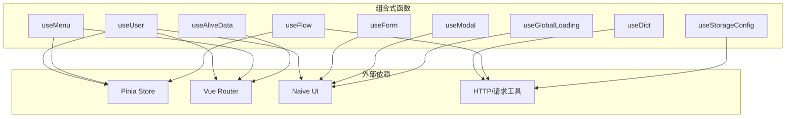
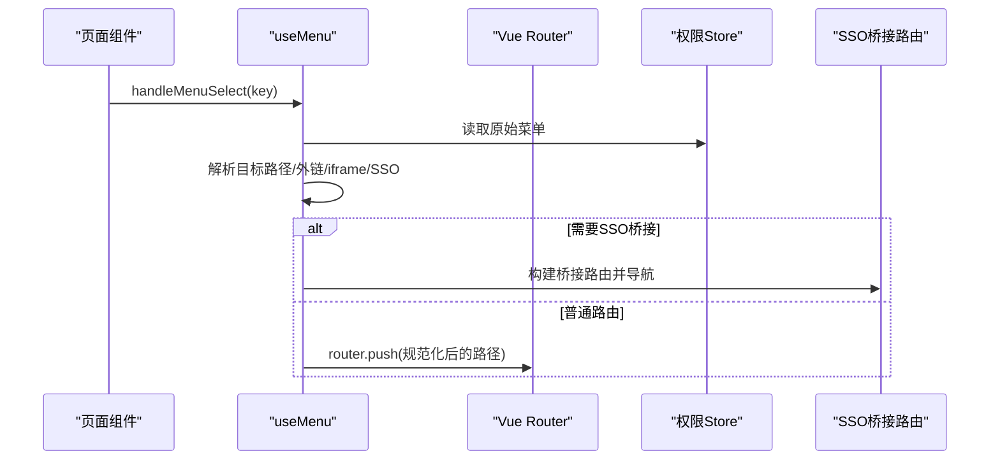
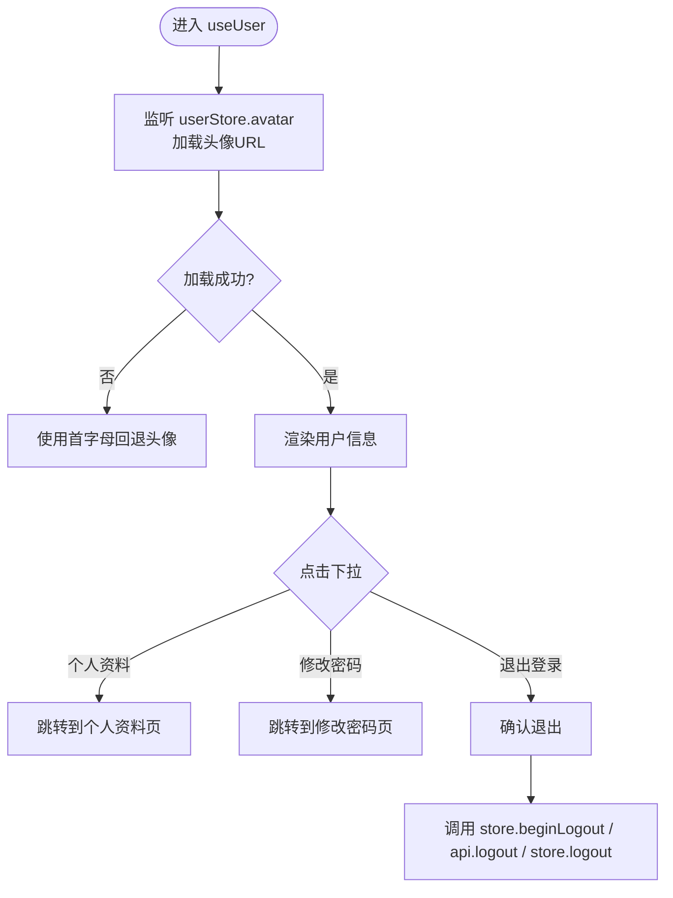
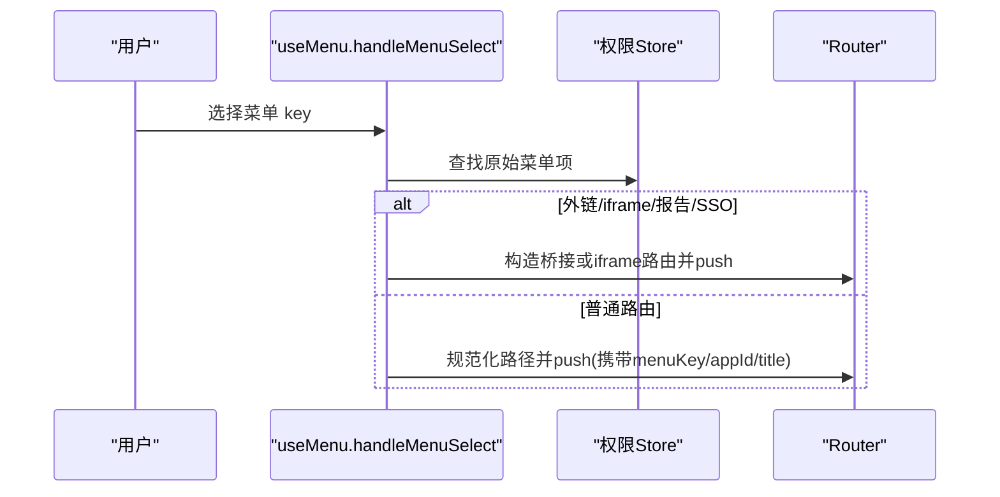
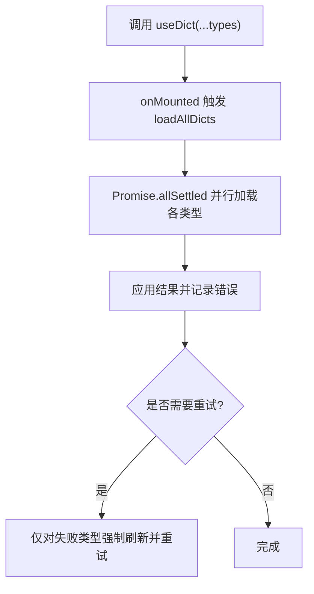
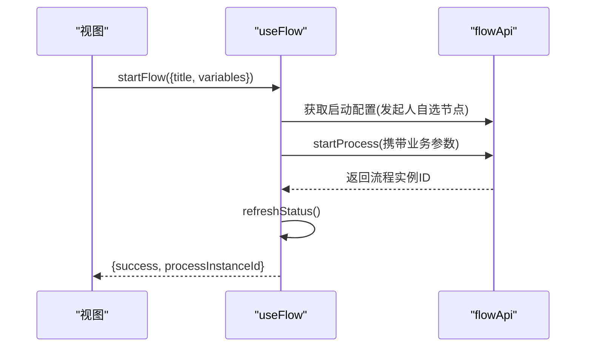
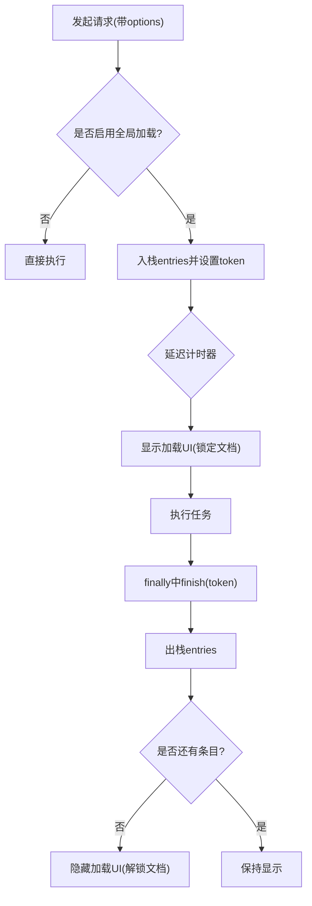
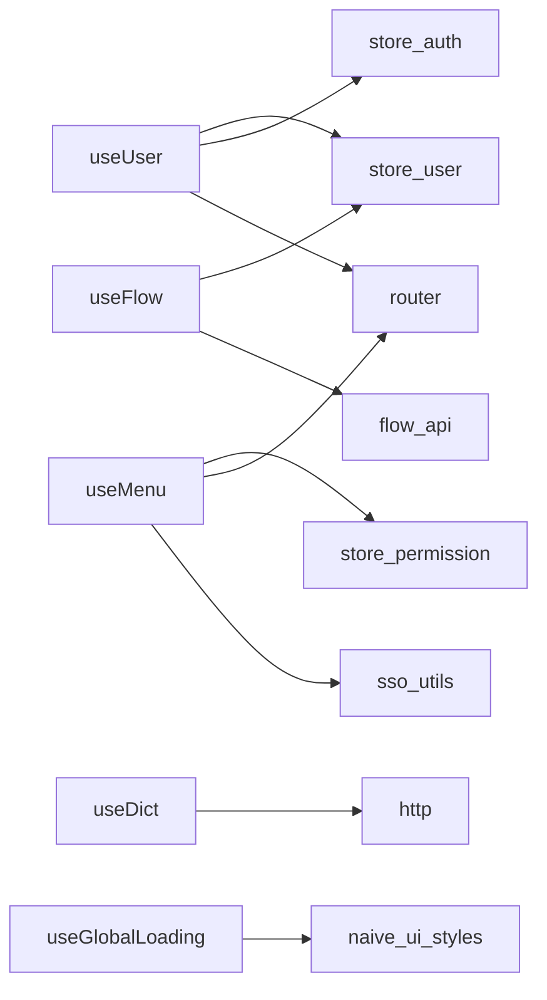

# 组合式函数模式

<cite>
**本文引用的文件**
- [useUser.js](file://forge-admin-ui/src/composables/useUser.js)
- [useMenu.js](file://forge-admin-ui/src/composables/useMenu.js)
- [useForm.js](file://forge-admin-ui/src/composables/useForm.js)
- [useModal.js](file://forge-admin-ui/src/composables/useModal.js)
- [useDict.js](file://forge-admin-ui/src/composables/useDict.js)
- [useFlow.js](file://forge-admin-ui/src/composables/useFlow.js)
- [useAliveData.js](file://forge-admin-ui/src/composables/useAliveData.js)
- [useStorageConfig.js](file://forge-admin-ui/src/composables/useStorageConfig.js)
- [useGlobalLoading.js](file://forge-admin-ui/src/composables/useGlobalLoading.js)
- [index.js](file://forge-admin-ui/src/composables/index.js)
- [package.json](file://forge-admin-ui/package.json)
</cite>

## 目录
1. [简介](#简介)
2. [项目结构](#项目结构)
3. [核心组件](#核心组件)
4. [架构总览](#架构总览)
5. [详细组件分析](#详细组件分析)
6. [依赖关系分析](#依赖关系分析)
7. [性能考量](#性能考量)
8. [故障排查指南](#故障排查指南)
9. [结论](#结论)
10. [附录](#附录)

## 简介
本技术文档围绕 Vue 3 Composition API 的组合式函数（Composable）模式，结合 forge-admin-ui 项目的实际实现，系统阐述状态封装、逻辑复用、副作用管理、响应式数据流、生命周期与错误处理机制。重点解析 useUser、useMenu、useForm、useModal、useDict、useFlow、useAliveData、useStorageConfig、useGlobalLoading 等常用组合式函数的设计思路与实现细节，并提供开发规范、测试策略与性能优化建议，帮助团队在真实项目中高效复用与演进。

## 项目结构
- 组合式函数集中位于 forge-admin-ui/src/composables，按职责拆分：用户、菜单、表单、弹窗、字典、流程、存活数据、存储配置、全局加载等。
- 通过 index.js 统一导出，便于按需引入。
- 依赖 Pinia 状态管理（store）、Vue Router、Naive UI、Axios/自定义请求工具等。

图表来源
- [index.js:1-10](file://forge-admin-ui/src/composables/index.js#L1-L10)
- [package.json:19-73](file://forge-admin-ui/package.json#L19-L73)

章节来源
- [index.js:1-10](file://forge-admin-ui/src/composables/index.js#L1-L10)
- [package.json:19-73](file://forge-admin-ui/package.json#L19-L73)

## 核心组件
- useUser：封装用户信息展示、头像加载、下拉菜单与退出登录流程，联动 store 与路由。
- useMenu：菜单数据处理、活跃项计算、导航跳转（含外链、内嵌 iframe、SSO 桥接）。
- useForm：轻量表单封装，返回 ref、模型、校验与规则。
- useModal：封装 Modal 实例与确认按钮 loading 状态。
- useDict：字典数据加载、缓存、并发控制与重试，提供 getLabel/getDict 工具。
- useFlow / useFlowTask：业务流程发起、撤回、终止、审批任务处理，屏蔽引擎细节。
- useAliveData：跨路由切换的“存活”数据缓存，支持重置。
- useStorageConfig：默认存储配置的全局缓存与 computed 暴露。
- useGlobalLoading：全局加载状态机，支持延迟显示、最小可见时间、请求级自动挂载与卸载。

章节来源
- [useUser.js:1-164](file://forge-admin-ui/src/composables/useUser.js#L1-L164)
- [useMenu.js:1-577](file://forge-admin-ui/src/composables/useMenu.js#L1-L577)
- [useForm.js:1-18](file://forge-admin-ui/src/composables/useForm.js#L1-L18)
- [useModal.js:1-13](file://forge-admin-ui/src/composables/useModal.js#L1-L13)
- [useDict.js:1-254](file://forge-admin-ui/src/composables/useDict.js#L1-L254)
- [useFlow.js:1-388](file://forge-admin-ui/src/composables/useFlow.js#L1-L388)
- [useAliveData.js:1-23](file://forge-admin-ui/src/composables/useAliveData.js#L1-L23)
- [useStorageConfig.js:1-69](file://forge-admin-ui/src/composables/useStorageConfig.js#L1-L69)
- [useGlobalLoading.js:1-352](file://forge-admin-ui/src/composables/useGlobalLoading.js#L1-L352)

## 架构总览
组合式函数作为业务逻辑单元，向上为页面提供简洁 API，向下聚合状态、副作用与第三方能力。典型交互如下：

图表来源
- [useMenu.js:461-560](file://forge-admin-ui/src/composables/useMenu.js#L461-L560)
- [useMenu.js:314-376](file://forge-admin-ui/src/composables/useMenu.js#L314-L376)

章节来源
- [useMenu.js:314-560](file://forge-admin-ui/src/composables/useMenu.js#L314-L560)

## 详细组件分析

### useUser：用户信息与认证流程
- 响应式数据：用户名、头像文字、头像 URL、下拉菜单选项、下拉可见性。
- 副作用：监听头像变化触发加载；退出登录时调用 store 与 API，处理静默鉴权错误。
- 生命周期：watch 立即执行以适配初始头像。
- 错误处理：捕获头像加载异常，降级为空头像；忽略静默鉴权错误避免干扰用户体验。

图表来源
- [useUser.js:62-78](file://forge-admin-ui/src/composables/useUser.js#L62-L78)
- [useUser.js:109-131](file://forge-admin-ui/src/composables/useUser.js#L109-L131)

章节来源
- [useUser.js:1-164](file://forge-admin-ui/src/composables/useUser.js#L1-L164)

### useMenu：菜单处理与导航
- 数据处理：对权限菜单进行标准化、扁平化、活跃键计算（支持 query 显式指定、meta.parentKey、精确匹配、前缀匹配）。
- 导航策略：外链、内嵌 iframe、报告子系统、SSO 桥接、业务应用运行时路径增强（注入 menuKey/appId/title 等）。
- 错误与边界：无匹配路由时尝试 SSO 桥接；模块类型菜单优先进入列表或首个有效子项。

图表来源
- [useMenu.js:461-560](file://forge-admin-ui/src/composables/useMenu.js#L461-L560)
- [useMenu.js:181-198](file://forge-admin-ui/src/composables/useMenu.js#L181-L198)

章节来源
- [useMenu.js:23-198](file://forge-admin-ui/src/composables/useMenu.js#L23-L198)
- [useMenu.js:309-576](file://forge-admin-ui/src/composables/useMenu.js#L309-L576)

### useForm：轻量表单封装
- 返回值：formRef、formModel（深拷贝初始值）、validation、rules。
- 适用场景：基于 Naive UI Form 的快速绑定与校验。
- 注意：需确保父组件传入的 formRef 指向对应表单实例。

章节来源
- [useForm.js:1-18](file://forge-admin-ui/src/composables/useForm.js#L1-L18)

### useModal：弹窗状态封装
- 返回值：modalRef、okLoading（双向绑定到 modalRef.okLoading）。
- 适用场景：简化弹窗确认按钮 loading 状态管理。

章节来源
- [useModal.js:1-13](file://forge-admin-ui/src/composables/useModal.js#L1-L13)

### useDict：字典数据管理
- 缓存策略：全局 Map 缓存 + 并发去重（pendingCache），失败不污染缓存。
- 并发与重试：Promise.allSettled 并行加载，支持一次重试。
- 工具方法：getLabel/getDict 快速取值。
- 生命周期：onMounted 自动加载。

图表来源
- [useDict.js:155-187](file://forge-admin-ui/src/composables/useDict.js#L155-L187)
- [useDict.js:73-92](file://forge-admin-ui/src/composables/useDict.js#L73-L92)

章节来源
- [useDict.js:1-254](file://forge-admin-ui/src/composables/useDict.js#L1-L254)

### useFlow / useFlowTask：业务流程集成
- 状态：流程状态、是否运行/结束、可操作判断（canStart/canWithdraw）。
- 方法：startFlow、withdrawFlow、terminateFlow、refreshStatus、getApprovalHistory、getDiagramInfo。
- 任务视角：useFlowTask 提供 approve/reject/delegate/claim。
- 生命周期：当 businessKeyRef 变化时自动刷新状态。

图表来源
- [useFlow.js:121-162](file://forge-admin-ui/src/composables/useFlow.js#L121-L162)
- [useFlow.js:89-109](file://forge-admin-ui/src/composables/useFlow.js#L89-L109)

章节来源
- [useFlow.js:1-388](file://forge-admin-ui/src/composables/useFlow.js#L1-L388)

### useAliveData：跨路由存活数据
- 机制：基于 Map 的 lastDataMap 持久化当前路由名对应的数据快照，组件销毁后仍保留。
- 能力：提供 aliveData 与 reset 方法，用于恢复或清空。

章节来源
- [useAliveData.js:1-23](file://forge-admin-ui/src/composables/useAliveData.js#L1-L23)

### useStorageConfig：默认存储配置
- 缓存：内存 + sessionStorage 双重缓存，避免重复请求。
- 暴露：computed 暴露 storageType/fileSize/allowedTypes，组件安全读取默认值。

章节来源
- [useStorageConfig.js:1-69](file://forge-admin-ui/src/composables/useStorageConfig.js#L1-L69)

### useGlobalLoading：全局加载状态机
- 特性：延迟显示、最小可见时间、多入口堆栈、请求级自动挂载/卸载、文档锁定样式。
- 能力：start/finish/clear、withGlobalLoading、managedFetch、attachRequestGlobalLoading/finishRequestGlobalLoading。
- 文本策略：根据类型/URL/Method 智能推断提示文案。

图表来源
- [useGlobalLoading.js:209-252](file://forge-admin-ui/src/composables/useGlobalLoading.js#L209-L252)
- [useGlobalLoading.js:254-311](file://forge-admin-ui/src/composables/useGlobalLoading.js#L254-L311)
- [useGlobalLoading.js:313-339](file://forge-admin-ui/src/composables/useGlobalLoading.js#L313-L339)

章节来源
- [useGlobalLoading.js:1-352](file://forge-admin-ui/src/composables/useGlobalLoading.js#L1-L352)

## 依赖关系分析
- 组合式函数之间低耦合，主要通过 Pinia Store、Vue Router、Naive UI、HTTP 工具协作。
- 关键依赖：
  - useUser：store(user/auth)、router、http helpers。
  - useMenu：store(permission)、router、SSO 工具、菜单工具。
  - useDict：HTTP 请求、全局缓存。
  - useFlow：store(user)、flowApi。
  - useGlobalLoading：Naive UI 样式类、DOM 操作。

图表来源
- [useUser.js:1-164](file://forge-admin-ui/src/composables/useUser.js#L1-L164)
- [useMenu.js:1-577](file://forge-admin-ui/src/composables/useMenu.js#L1-L577)
- [useDict.js:1-254](file://forge-admin-ui/src/composables/useDict.js#L1-L254)
- [useFlow.js:1-388](file://forge-admin-ui/src/composables/useFlow.js#L1-L388)
- [useGlobalLoading.js:1-352](file://forge-admin-ui/src/composables/useGlobalLoading.js#L1-L352)

章节来源
- [useUser.js:1-164](file://forge-admin-ui/src/composables/useUser.js#L1-L164)
- [useMenu.js:1-577](file://forge-admin-ui/src/composables/useMenu.js#L1-L577)
- [useDict.js:1-254](file://forge-admin-ui/src/composables/useDict.js#L1-L254)
- [useFlow.js:1-388](file://forge-admin-ui/src/composables/useFlow.js#L1-L388)
- [useGlobalLoading.js:1-352](file://forge-admin-ui/src/composables/useGlobalLoading.js#L1-L352)

## 性能考量
- 字典缓存与并发控制：useDict 使用 Map 缓存与 pending 去重，减少重复请求；Promise.allSettled 并行加载提升吞吐。
- 菜单计算属性：processedMenus/flatMenuItems 使用 computed 缓存，避免频繁遍历。
- 全局加载节流：useGlobalLoading 延迟显示与最小可见时间，避免闪烁；请求级自动挂载/卸载降低手动维护成本。
- 头像懒加载：useUser 仅在头像字段变化时加载，失败降级，减少无效请求。
- 存储配置缓存：useStorageConfig 内存+sessionStorage 双层缓存，避免重复网络开销。

[本节为通用指导，无需特定文件引用]

## 故障排查指南
- 字典加载失败：检查接口响应码与字段映射；查看 errors 对象定位具体类型；必要时调用 reload(force=true) 重试。
- 菜单导航异常：确认 path 规范化与 SSO 桥接条件；检查 resolve 结果是否为 404；核对 openTarget 与 display 模式。
- 流程状态不同步：确保 businessKeyRef 正确且变化时触发 refresh；检查 startFlow/withdrawFlow/terminateFlow 返回值与消息。
- 全局加载未关闭：确认 withGlobalLoading/managedFetch/attachRequestGlobalLoading 成对使用；检查 token 是否正确传递。
- 头像不显示：检查 resolveRenderableFileUrl 返回与异常分支；确认 userStore.avatar 更新。

章节来源
- [useDict.js:155-187](file://forge-admin-ui/src/composables/useDict.js#L155-L187)
- [useMenu.js:314-376](file://forge-admin-ui/src/composables/useMenu.js#L314-L376)
- [useFlow.js:89-109](file://forge-admin-ui/src/composables/useFlow.js#L89-L109)
- [useGlobalLoading.js:244-311](file://forge-admin-ui/src/composables/useGlobalLoading.js#L244-L311)
- [useUser.js:62-78](file://forge-admin-ui/src/composables/useUser.js#L62-L78)

## 结论
本项目通过组合式函数将用户、菜单、表单、弹窗、字典、流程、存活数据、存储配置与全局加载等横切关注点解耦为可复用的逻辑单元。其设计遵循响应式数据流、明确的生命周期管理与稳健的错误处理，配合缓存与并发控制，显著提升了可维护性与性能。建议在新增功能时优先抽象为 Composable，遵循统一的输入输出契约与错误处理约定，并结合单元测试与端到端测试保障质量。

[本节为总结性内容，无需特定文件引用]

## 附录
- 开发规范建议
  - 单一职责：每个 Composable 聚焦一个领域（如用户、菜单、字典）。
  - 明确契约：输入参数与返回值类型清晰，尽量使用 TypeScript 或 JSDoc 标注。
  - 副作用隔离：在 Composable 内部集中处理副作用，对外暴露纯函数或受控状态。
  - 错误处理：统一错误上报与降级策略，避免泄露内部细节。
  - 可测试性：将可测试逻辑抽离为纯函数（如菜单路径解析、SSO 桥接构建）。
- 测试策略
  - 单元测试：针对纯函数（如路径解析、标签映射）进行断言。
  - 集成测试：模拟 store/router/http，验证 Composable 行为（如 useFlow.startFlow）。
  - 组件测试：结合 @vue/test-utils 验证 Composable 在组件中的使用效果。
- 性能优化技巧
  - 合理使用 computed/watch，避免不必要的重算与监听。
  - 大列表/复杂树形结构采用扁平化与缓存。
  - 网络请求合并与去抖/节流，避免抖动。
  - 图片资源懒加载与降级策略。

[本节为通用指导，无需特定文件引用]