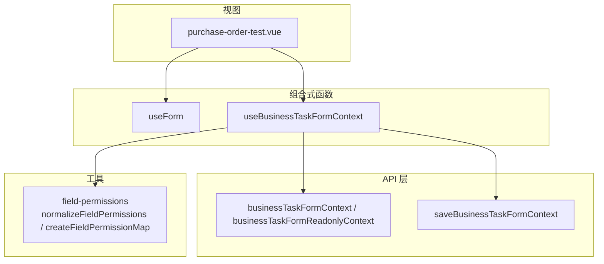
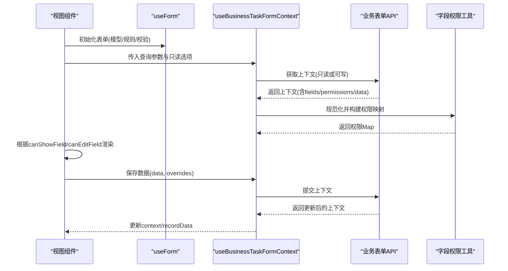
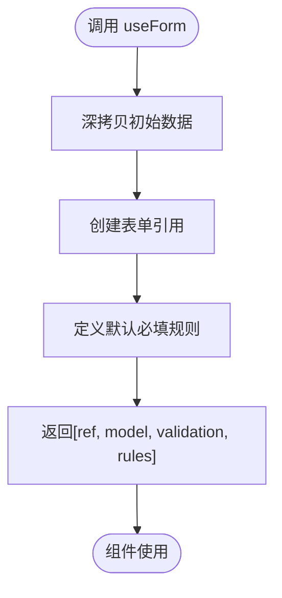
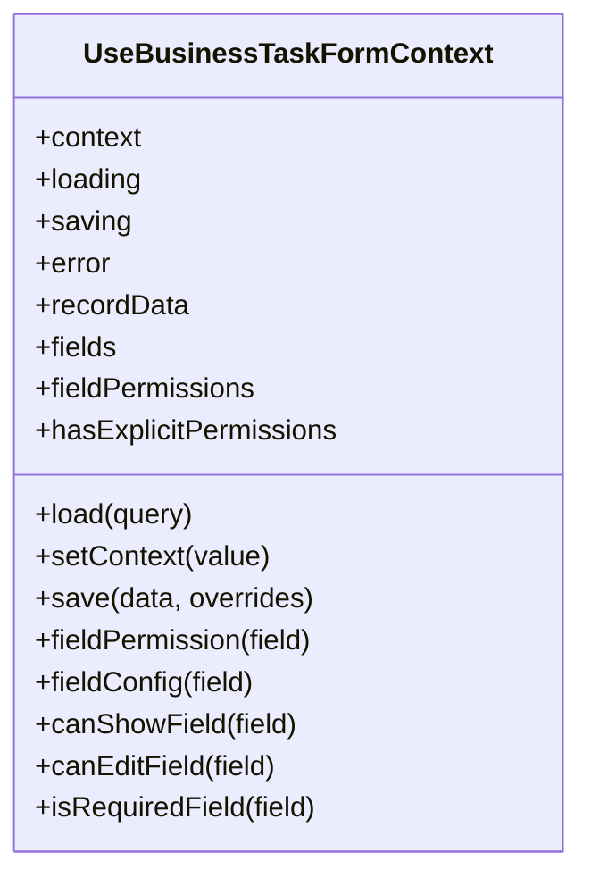
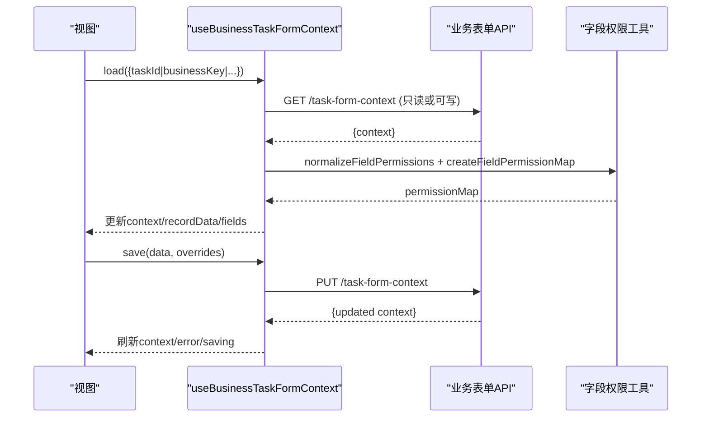
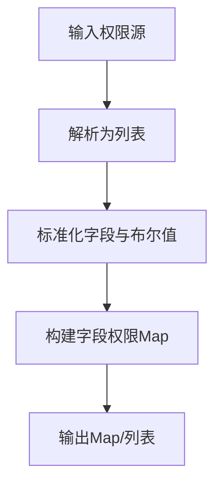
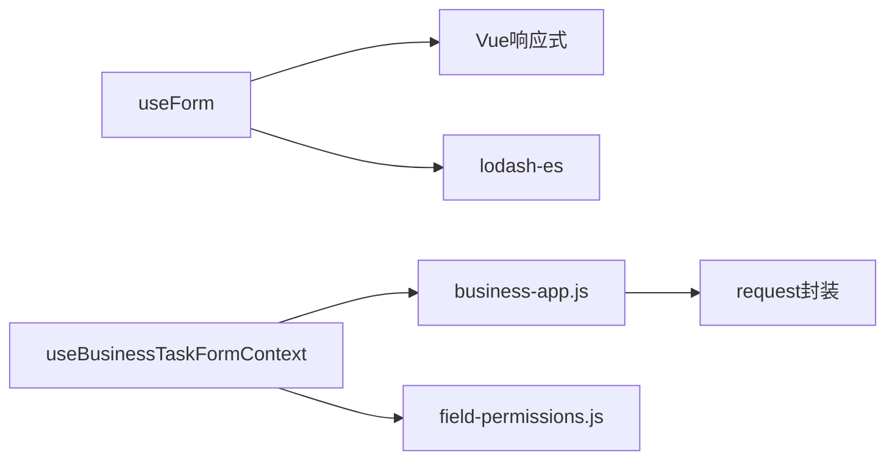

# 表单处理组合式函数

<cite>
**本文引用的文件**
- [useForm.js](file://forge-admin-ui/src/composables/useForm.js)
- [useBusinessTaskFormContext.js](file://forge-admin-ui/src/composables/useBusinessTaskFormContext.js)
- [index.js](file://forge-admin-ui/src/composables/index.js)
- [business-app.js](file://forge-admin-ui/src/api/business-app.js)
- [field-permissions.js](file://forge-admin-ui/src/utils/field-permissions.js)
- [purchase-order-test.vue](file://forge-admin-ui/src/views/business/purchase-order-test.vue)
</cite>

## 目录
1. [简介](#简介)
2. [项目结构](#项目结构)
3. [核心组件](#核心组件)
4. [架构总览](#架构总览)
5. [详细组件分析](#详细组件分析)
6. [依赖关系分析](#依赖关系分析)
7. [性能考虑](#性能考虑)
8. [故障排查指南](#故障排查指南)
9. [结论](#结论)
10. [附录：使用示例与最佳实践](#附录使用示例与最佳实践)

## 简介
本技术文档聚焦于前端表单处理相关的组合式函数，重点解析 useForm 与 useBusinessTaskFormContext 的设计模式、实现细节与使用方式。内容涵盖表单状态管理、数据绑定、验证规则、提交处理、业务任务表单上下文管理、字段权限控制、生命周期控制与事件处理流程，并提供复杂场景解决方案、性能优化技巧与调试方法。

## 项目结构
本项目采用按能力划分的组合式函数组织方式，表单相关能力集中在 composables 目录中，并通过统一入口 index.js 暴露。业务表单上下文通过 API 层与后端交互，字段权限通过工具函数进行规范化与映射。

图表来源
- [useForm.js:1-18](file://forge-admin-ui/src/composables/useForm.js#L1-L18)
- [useBusinessTaskFormContext.js:1-184](file://forge-admin-ui/src/composables/useBusinessTaskFormContext.js#L1-L184)
- [business-app.js:539-549](file://forge-admin-ui/src/api/business-app.js#L539-L549)
- [field-permissions.js:1-146](file://forge-admin-ui/src/utils/field-permissions.js#L1-L146)
- [purchase-order-test.vue:410-609](file://forge-admin-ui/src/views/business/purchase-order-test.vue#L410-L609)

章节来源
- [index.js:1-10](file://forge-admin-ui/src/composables/index.js#L1-L10)

## 核心组件
- useForm：提供轻量级表单实例、模型与校验封装，返回表单引用、表单数据模型、校验方法与默认必填规则。
- useBusinessTaskFormContext：提供业务任务表单上下文的全局管理能力，包括加载、保存、只读模式、字段可见性与可编辑性判断、必填标记等。

章节来源
- [useForm.js:1-18](file://forge-admin-ui/src/composables/useForm.js#L1-L18)
- [useBusinessTaskFormContext.js:1-184](file://forge-admin-ui/src/composables/useBusinessTaskFormContext.js#L1-L184)

## 架构总览
下图展示了从视图到组合式函数再到 API 层的调用链路与数据流。

图表来源
- [useBusinessTaskFormContext.js:34-95](file://forge-admin-ui/src/composables/useBusinessTaskFormContext.js#L34-L95)
- [business-app.js:539-549](file://forge-admin-ui/src/api/business-app.js#L539-L549)
- [field-permissions.js:1-36](file://forge-admin-ui/src/utils/field-permissions.js#L1-L36)
- [purchase-order-test.vue:450-609](file://forge-admin-ui/src/views/business/purchase-order-test.vue#L450-L609)

## 详细组件分析

### useForm 组合式函数
- 设计目标：为 UI 表单提供统一的 ref 引用、响应式数据模型与基础校验能力。
- 关键特性：
  - 表单引用：用于触发校验。
  - 表单模型：基于初始数据深拷贝，避免外部污染。
  - 默认规则：内置 required 规则，便于快速配置。
  - 校验方法：封装 validate 调用，简化上层使用。
- 复杂度与性能：
  - 深拷贝初始数据，时间复杂度 O(n)，空间复杂度 O(n)。
  - 仅维护少量响应式变量，开销低。
- 错误处理：
  - 校验失败时由底层表单组件抛出错误；上层需捕获并提示。
- 扩展建议：
  - 可增加异步校验、自定义规则注册、脏检查与重置方法。

图表来源
- [useForm.js:1-18](file://forge-admin-ui/src/composables/useForm.js#L1-L18)

章节来源
- [useForm.js:1-18](file://forge-admin-ui/src/composables/useForm.js#L1-L18)

### useBusinessTaskFormContext 组合式函数
- 设计目标：统一管理业务任务表单的上下文数据、字段配置与权限，支持加载、保存、只读模式与字段展示/编辑控制。
- 关键特性：
  - 上下文状态：context、loading、saving、error。
  - 派生状态：recordData、fields、fieldPermissions、hasExplicitPermissions、permissionMap、fieldMap。
  - 加载逻辑：根据只读模式选择不同 API，参数压缩与合法性校验。
  - 保存逻辑：合并 taskId、businessKey 等上下文信息，提交后刷新 context。
  - 字段控制：canShowField、canEditField、isRequiredField、fieldConfig、fieldPermission。
  - 工具函数：compactParams、hasContextQuery、fieldAliases（snake_case/camelCase 互转）。
- 复杂度与性能：
  - computed 缓存字段映射与权限映射，避免重复计算。
  - Map 查找 O(1)，提升字段权限与配置查询效率。
- 错误处理：
  - 加载/保存失败时设置 error 并抛出异常，供上层捕获。
- 生命周期与事件：
  - load/save 为显式生命周期钩子；组件在合适时机调用以驱动上下文变化。
  - 可通过 setContext 直接注入上下文，便于测试或预填充。

图表来源
- [useBusinessTaskFormContext.js:1-184](file://forge-admin-ui/src/composables/useBusinessTaskFormContext.js#L1-L184)

图表来源
- [useBusinessTaskFormContext.js:34-95](file://forge-admin-ui/src/composables/useBusinessTaskFormContext.js#L34-L95)
- [business-app.js:539-549](file://forge-admin-ui/src/api/business-app.js#L539-L549)
- [field-permissions.js:1-36](file://forge-admin-ui/src/utils/field-permissions.js#L1-L36)

章节来源
- [useBusinessTaskFormContext.js:1-184](file://forge-admin-ui/src/composables/useBusinessTaskFormContext.js#L1-L184)

### 字段权限与配置
- 规范化：将多种来源的权限格式统一为标准列表，包含 field、visible、editable、readable、writable、required。
- 映射：基于字段别名（snake_case/camelCase）构建 Map，提高查询效率。
- 选择策略：支持多源权限合并，优先取非空列表。

图表来源
- [field-permissions.js:1-146](file://forge-admin-ui/src/utils/field-permissions.js#L1-L146)

章节来源
- [field-permissions.js:1-146](file://forge-admin-ui/src/utils/field-permissions.js#L1-L146)

### 视图集成示例
- 视图通过 useBusinessTaskFormContext 获取上下文，结合 canShowField/canEditField 动态渲染字段。
- 表单校验规则根据字段可见性与业务要求动态生成。
- 提交动作通过 businessTaskForm.save 完成，并在成功后刷新上下文。

章节来源
- [purchase-order-test.vue:410-609](file://forge-admin-ui/src/views/business/purchase-order-test.vue#L410-L609)

## 依赖关系分析
- 组合式函数依赖：
  - useBusinessTaskFormContext 依赖 API 层与字段权限工具。
  - useForm 依赖 Vue 响应式与 lodash-es 深拷贝。
- API 层依赖：
  - 业务表单上下文接口与保存接口。
- 工具依赖：
  - 字段权限规范化与映射。

图表来源
- [useForm.js:1-18](file://forge-admin-ui/src/composables/useForm.js#L1-L18)
- [useBusinessTaskFormContext.js:1-184](file://forge-admin-ui/src/composables/useBusinessTaskFormContext.js#L1-L184)
- [business-app.js:539-549](file://forge-admin-ui/src/api/business-app.js#L539-L549)
- [field-permissions.js:1-146](file://forge-admin-ui/src/utils/field-permissions.js#L1-L146)

章节来源
- [business-app.js:539-549](file://forge-admin-ui/src/api/business-app.js#L539-L549)
- [field-permissions.js:1-146](file://forge-admin-ui/src/utils/field-permissions.js#L1-L146)

## 性能考虑
- 使用 computed 缓存字段映射与权限映射，减少重复计算。
- 使用 Map 存储字段权限，查询复杂度 O(1)。
- 参数压缩 compactParams 去除空值，降低网络负载。
- 只在必要时加载上下文，避免不必要的请求。
- 表单模型深拷贝仅在初始化时执行，避免频繁复制。

## 故障排查指南
- 加载失败：
  - 检查 hasContextQuery 是否满足条件（taskId/processInstanceId/businessKey/objectCode+recordId）。
  - 查看 error 状态与后端返回码，确认接口可用性。
- 保存失败：
  - 确保已先加载上下文，否则 save 会抛出错误。
  - 检查 payload 是否包含必要字段（taskId、businessKey、objectCode、recordId、formKey 等）。
- 字段不可见/不可编辑：
  - 使用 canShowField/canEditField 诊断，检查字段配置与权限映射。
  - 确认 readonly 模式与字段 writable/readonly/disabled 配置。
- 调试建议：
  - 打印 context、fields、fieldPermissions 与 permissionMap。
  - 在 load/save 前后记录 loading/saving 状态变化。
  - 对字段名进行 snake_case/camelCase 转换验证，确保别名匹配。

章节来源
- [useBusinessTaskFormContext.js:34-95](file://forge-admin-ui/src/composables/useBusinessTaskFormContext.js#L34-L95)
- [field-permissions.js:1-146](file://forge-admin-ui/src/utils/field-permissions.js#L1-L146)

## 结论
useForm 与 useBusinessTaskFormContext 分别承担通用表单能力与业务任务表单上下文管理的职责。前者简洁高效，后者提供完整的上下文生命周期与字段权限控制。二者配合视图层可实现高内聚、低耦合的表单处理方案，适用于复杂审批与业务单据场景。

## 附录：使用示例与最佳实践
- 基本用法
  - 在视图中引入并使用 useForm 获取表单引用、模型与校验方法。
  - 使用 useBusinessTaskFormContext 加载上下文，并根据 canShowField/canEditField 渲染字段。
- 复杂场景
  - 多节点审批：根据当前 taskDefKey 动态决定可编辑字段集合。
  - 只读模式：通过 options.readonly 切换只读上下文，禁用编辑。
  - 字段别名兼容：利用 snake_case/camelCase 别名机制，适配不同后端命名风格。
- 性能优化
  - 合理拆分表单模块，按需加载上下文。
  - 使用 computed 缓存派生数据，避免重复计算。
  - 批量操作时合并 payload，减少请求次数。
- 调试方法
  - 在开发环境打印上下文与权限映射。
  - 使用浏览器开发者工具观察响应式数据变化。
  - 针对字段显示/编辑问题，逐步缩小范围至具体字段配置与权限。

章节来源
- [purchase-order-test.vue:410-609](file://forge-admin-ui/src/views/business/purchase-order-test.vue#L410-L609)
- [useBusinessTaskFormContext.js:1-184](file://forge-admin-ui/src/composables/useBusinessTaskFormContext.js#L1-L184)
- [useForm.js:1-18](file://forge-admin-ui/src/composables/useForm.js#L1-L18)
- [business-app.js:539-549](file://forge-admin-ui/src/api/business-app.js#L539-L549)
- [field-permissions.js:1-146](file://forge-admin-ui/src/utils/field-permissions.js#L1-L146)