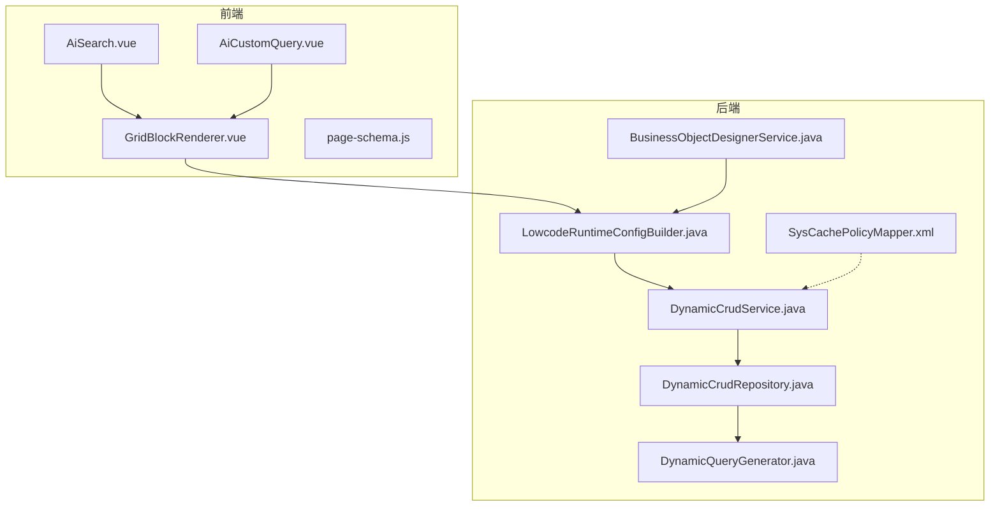
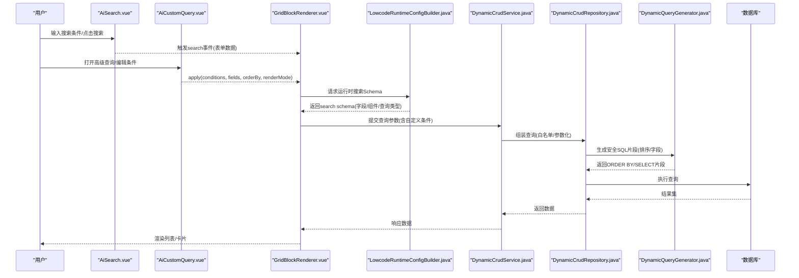
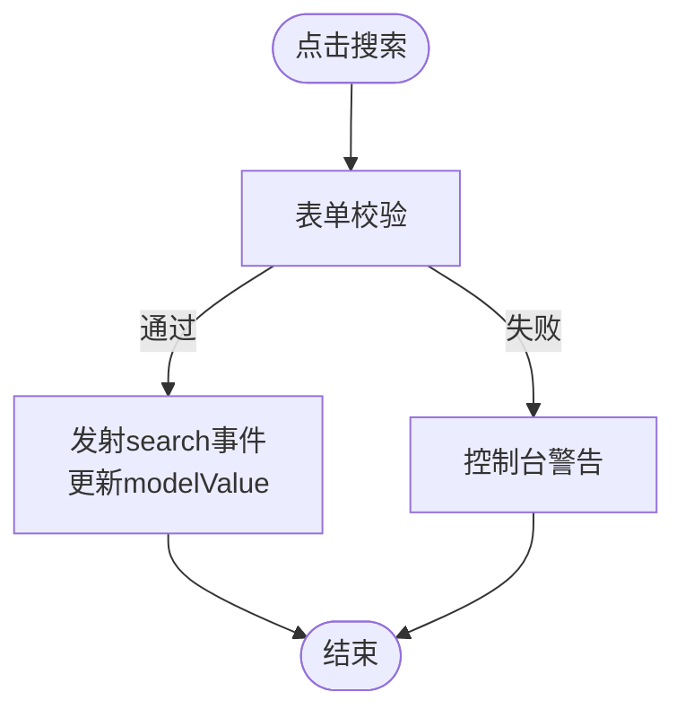
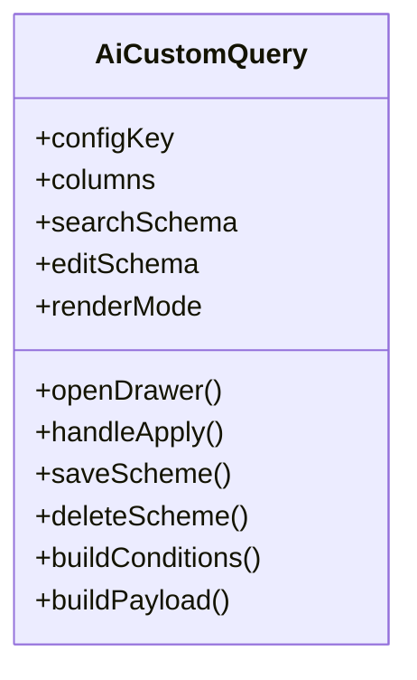
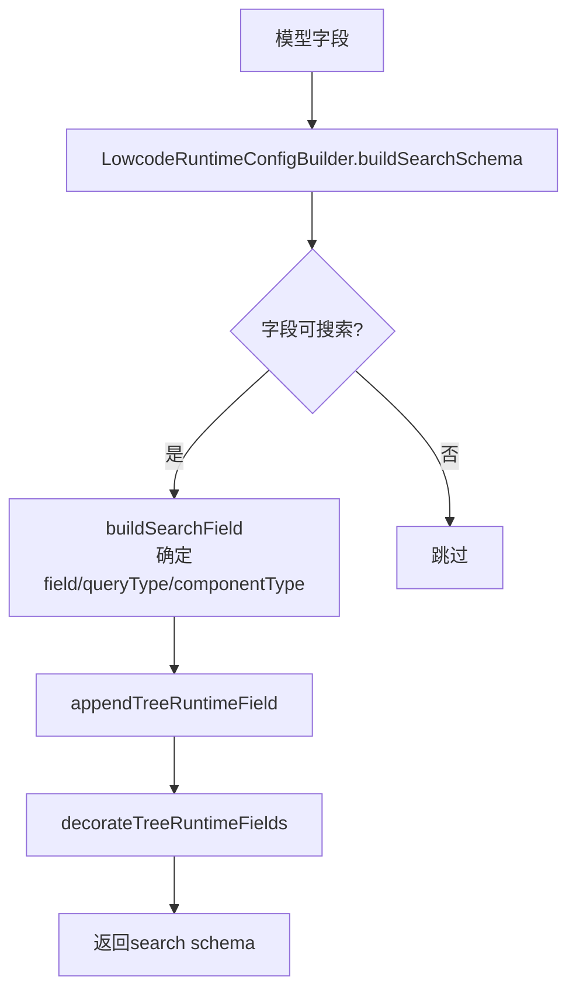
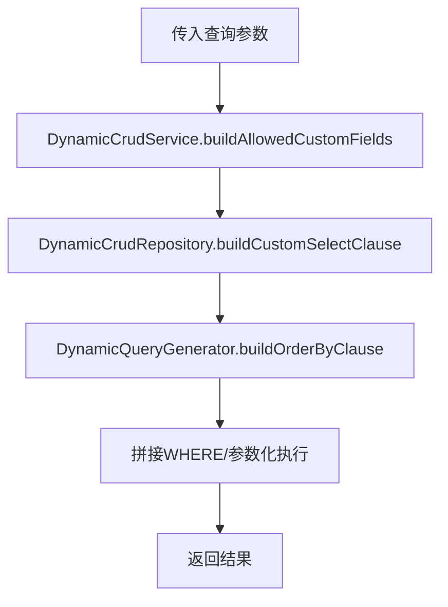
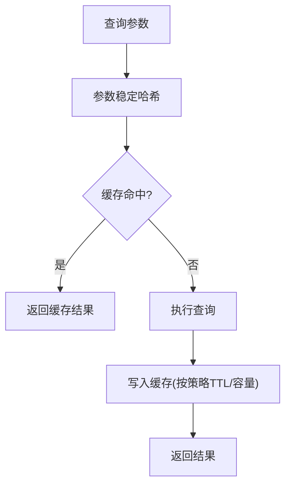
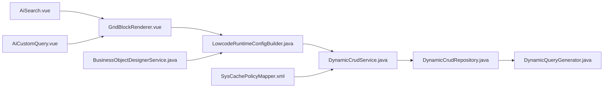

# AI搜索组件

<cite>
**本文引用的文件**
- [AiSearch.vue](file://forge-admin-ui/src/components/ai-form/AiSearch.vue)
- [AiCustomQuery.vue](file://forge-admin-ui/src/components/ai-form/AiCustomQuery.vue)
- [DynamicCrudService.java](file://forge-server/forge-framework/forge-plugin-parent/forge-plugin-generator/src/main/java/com/mdframe/forge/plugin/generator/service/DynamicCrudService.java)
- [LowcodeRuntimeConfigBuilder.java](file://forge-server/forge-framework/forge-plugin-parent/forge-plugin-generator/src/main/java/com/mdframe/forge/plugin/generator/service/lowcode/LowcodeRuntimeConfigBuilder.java)
- [DynamicQueryGenerator.java](file://forge-server/forge-framework/forge-plugin-parent/forge-plugin-generator/src/main/java/com/mdframe/forge/plugin/generator/util/DynamicQueryGenerator.java)
- [DynamicCrudRepository.java](file://forge-server/forge-framework/forge-plugin-parent/forge-plugin-generator/src/main/java/com/mdframe/forge/plugin/generator/service/DynamicCrudRepository.java)
- [BusinessObjectDesignerService.java](file://forge-server/forge-framework/forge-plugin-parent/forge-plugin-generator/src/main/java/com/mdframe/forge/plugin/generator/service/businessapp/BusinessObjectDesignerService.java)
- [DataQueryRuntimeCacheTest.java](file://forge-server/forge-framework/forge-plugin-parent/forge-plugin-data/src/test/java/com/mdframe/forge/plugin/data/support/DataQueryRuntimeCacheTest.java)
- [SysCachePolicyMapper.xml](file://forge-server/forge-framework/forge-plugin-parent/forge-plugin-system/src/main/resources/mapper/SysCachePolicyMapper.xml)
- [GridBlockRenderer.vue](file://forge-admin-ui/src/components/lowcode-builder/page/GridBlockRenderer.vue)
- [page-schema.js](file://forge-admin-ui/src/components/lowcode-builder/page/page-schema.js)
</cite>

## 目录
1. [简介](#简介)
2. [项目结构](#项目结构)
3. [核心组件](#核心组件)
4. [架构总览](#架构总览)
5. [详细组件分析](#详细组件分析)
6. [依赖关系分析](#依赖关系分析)
7. [性能与优化](#性能与优化)
8. [故障排查指南](#故障排查指南)
9. [结论](#结论)
10. [附录](#附录)

## 简介
本技术文档围绕AI搜索组件展开，聚焦动态查询构建、条件组合、高级搜索能力、查询Schema定义、字段联动、条件模板、查询缓存机制、复杂查询场景、SQL生成与优化、查询性能调优、查询历史与分享、权限控制、扩展指南与调试技巧。文档以代码级事实为依据，提供可视化图示与可操作建议，帮助开发者快速理解并高效使用AI搜索能力。

## 项目结构
AI搜索能力由前端组件与后端运行时共同构成：
- 前端
  - AiSearch：基于AiForm封装的列表页搜索表单，负责基础搜索输入、校验、事件派发。
  - AiCustomQuery：高级自定义查询面板，支持多条件组合、结果展示配置、排序、常用方案保存与复用。
  - GridBlockRenderer/page-schema：低代码页面渲染与默认配置，将搜索Schema注入到运行时。
- 后端
  - LowcodeRuntimeConfigBuilder：构建运行时搜索Schema（字段映射、组件类型、查询类型）。
  - DynamicCrudService/DynamicCrudRepository：限制允许字段、组装SELECT/ORDER BY/WHERE等SQL片段，保障安全与性能。
  - DynamicQueryGenerator：通用SQL片段生成工具（如排序子句），包含SQL注入防护。
  - BusinessObjectDesignerService：将设计期视图Schema同步到运行时页面Zone，确保搜索区字段一致性。
  - 缓存策略：数据查询运行时缓存与系统缓存策略表，支撑查询结果缓存与TTL管理。

**图表来源**
- [AiSearch.vue:1-264](file://forge-admin-ui/src/components/ai-form/AiSearch.vue#L1-L264)
- [AiCustomQuery.vue:1-1096](file://forge-admin-ui/src/components/ai-form/AiCustomQuery.vue#L1-L1096)
- [GridBlockRenderer.vue:1826-1854](file://forge-admin-ui/src/components/lowcode-builder/page/GridBlockRenderer.vue#L1826-L1854)
- [page-schema.js:1635-1675](file://forge-admin-ui/src/components/lowcode-builder/page/page-schema.js#L1635-L1675)
- [LowcodeRuntimeConfigBuilder.java:89-97](file://forge-server/forge-framework/forge-plugin-parent/forge-plugin-generator/src/main/java/com/mdframe/forge/plugin/generator/service/lowcode/LowcodeRuntimeConfigBuilder.java#L89-L97)
- [DynamicCrudService.java:4951-4969](file://forge-server/forge-framework/forge-plugin-parent/forge-plugin-generator/src/main/java/com/mdframe/forge/plugin/generator/service/DynamicCrudService.java#L4951-L4969)
- [DynamicCrudRepository.java:756-847](file://forge-server/forge-framework/forge-plugin-parent/forge-plugin-generator/src/main/java/com/mdframe/forge/plugin/generator/service/DynamicCrudRepository.java#L756-L847)
- [DynamicQueryGenerator.java:205-246](file://forge-server/forge-framework/forge-plugin-parent/forge-plugin-generator/src/main/java/com/mdframe/forge/plugin/generator/util/DynamicQueryGenerator.java#L205-L246)
- [BusinessObjectDesignerService.java:3046-3065](file://forge-server/forge-framework/forge-plugin-parent/forge-plugin-generator/src/main/java/com/mdframe/forge/plugin/generator/service/businessapp/BusinessObjectDesignerService.java#L3046-L3065)
- [SysCachePolicyMapper.xml:1-42](file://forge-server/forge-framework/forge-plugin-parent/forge-plugin-system/src/main/resources/mapper/SysCachePolicyMapper.xml#L1-L42)

**章节来源**
- [AiSearch.vue:1-264](file://forge-admin-ui/src/components/ai-form/AiSearch.vue#L1-L264)
- [AiCustomQuery.vue:1-1096](file://forge-admin-ui/src/components/ai-form/AiCustomQuery.vue#L1-L1096)
- [GridBlockRenderer.vue:1826-1854](file://forge-admin-ui/src/components/lowcode-builder/page/GridBlockRenderer.vue#L1826-L1854)
- [page-schema.js:1635-1675](file://forge-admin-ui/src/components/lowcode-builder/page/page-schema.js#L1635-L1675)
- [LowcodeRuntimeConfigBuilder.java:89-97](file://forge-server/forge-framework/forge-plugin-parent/forge-plugin-generator/src/main/java/com/mdframe/forge/plugin/generator/service/lowcode/LowcodeRuntimeConfigBuilder.java#L89-L97)
- [DynamicCrudService.java:4951-4969](file://forge-server/forge-framework/forge-plugin-parent/forge-plugin-generator/src/main/java/com/mdframe/forge/plugin/generator/service/DynamicCrudService.java#L4951-L4969)
- [DynamicCrudRepository.java:756-847](file://forge-server/forge-framework/forge-plugin-parent/forge-plugin-generator/src/main/java/com/mdframe/forge/plugin/generator/service/DynamicCrudRepository.java#L756-L847)
- [DynamicQueryGenerator.java:205-246](file://forge-server/forge-framework/forge-plugin-parent/forge-plugin-generator/src/main/java/com/mdframe/forge/plugin/generator/util/DynamicQueryGenerator.java#L205-L246)
- [BusinessObjectDesignerService.java:3046-3065](file://forge-server/forge-framework/forge-plugin-parent/forge-plugin-generator/src/main/java/com/mdframe/forge/plugin/generator/service/businessapp/BusinessObjectDesignerService.java#L3046-L3065)
- [SysCachePolicyMapper.xml:1-42](file://forge-server/forge-framework/forge-plugin-parent/forge-plugin-system/src/main/resources/mapper/SysCachePolicyMapper.xml#L1-L42)

## 核心组件
- AiSearch：轻量搜索表单，封装验证、加载态、重置与搜索事件，透传插槽与上下文，便于嵌入列表页。
- AiCustomQuery：高级查询构建器，支持：
  - 条件组合：AND/OR关系、字段选择、操作符选择、值输入（含区间）、树形节点包含子节点标记。
  - 结果展示：选择展示字段、切换列表/卡片渲染、排序字段与方向。
  - 常用方案：保存/更新/删除查询方案，设置默认方案，一键应用并执行。
  - 字段联动：通过AiFormItem上下文注入isSearch与patchFormData回调，支持条件内嵌组件联动（如树形“包含子节点”开关）。
- 运行时Schema构建：后端根据模型与页面配置生成search schema，决定字段映射、组件类型、查询类型。
- SQL生成与安全：后端对SELECT字段白名单校验、ORDER BY安全过滤、WHERE条件参数化，避免注入与全表扫描。
- 缓存机制：数据查询运行时缓存键稳定哈希；系统缓存策略表维护TTL、模式、本地/远程缓存大小等。

**章节来源**
- [AiSearch.vue:65-254](file://forge-admin-ui/src/components/ai-form/AiSearch.vue#L65-L254)
- [AiCustomQuery.vue:318-932](file://forge-admin-ui/src/components/ai-form/AiCustomQuery.vue#L318-L932)
- [LowcodeRuntimeConfigBuilder.java:1421-1438](file://forge-server/forge-framework/forge-plugin-parent/forge-plugin-generator/src/main/java/com/mdframe/forge/plugin/generator/service/lowcode/LowcodeRuntimeConfigBuilder.java#L1421-L1438)
- [DynamicCrudRepository.java:756-847](file://forge-server/forge-framework/forge-plugin-parent/forge-plugin-generator/src/main/java/com/mdframe/forge/plugin/generator/service/DynamicCrudRepository.java#L756-L847)
- [DynamicQueryGenerator.java:205-246](file://forge-server/forge-framework/forge-plugin-parent/forge-plugin-generator/src/main/java/com/mdframe/forge/plugin/generator/util/DynamicQueryGenerator.java#L205-L246)
- [DataQueryRuntimeCacheTest.java:1-36](file://forge-server/forge-framework/forge-plugin-parent/forge-plugin-data/src/test/java/com/mdframe/forge/plugin/data/support/DataQueryRuntimeCacheTest.java#L1-L36)
- [SysCachePolicyMapper.xml:1-42](file://forge-server/forge-framework/forge-plugin-parent/forge-plugin-system/src/main/resources/mapper/SysCachePolicyMapper.xml#L1-L42)

## 架构总览
AI搜索从用户交互到数据返回的整体流程如下：

**图表来源**
- [AiSearch.vue:156-180](file://forge-admin-ui/src/components/ai-form/AiSearch.vue#L156-L180)
- [AiCustomQuery.vue:826-845](file://forge-admin-ui/src/components/ai-form/AiCustomQuery.vue#L826-L845)
- [GridBlockRenderer.vue:1826-1854](file://forge-admin-ui/src/components/lowcode-builder/page/GridBlockRenderer.vue#L1826-L1854)
- [LowcodeRuntimeConfigBuilder.java:89-97](file://forge-server/forge-framework/forge-plugin-parent/forge-plugin-generator/src/main/java/com/mdframe/forge/plugin/generator/service/lowcode/LowcodeRuntimeConfigBuilder.java#L89-L97)
- [DynamicCrudService.java:4951-4969](file://forge-server/forge-framework/forge-plugin-parent/forge-plugin-generator/src/main/java/com/mdframe/forge/plugin/generator/service/DynamicCrudService.java#L4951-L4969)
- [DynamicCrudRepository.java:756-847](file://forge-server/forge-framework/forge-plugin-parent/forge-plugin-generator/src/main/java/com/mdframe/forge/plugin/generator/service/DynamicCrudRepository.java#L756-L847)
- [DynamicQueryGenerator.java:205-246](file://forge-server/forge-framework/forge-plugin-parent/forge-plugin-generator/src/main/java/com/mdframe/forge/plugin/generator/util/DynamicQueryGenerator.java#L205-L246)

## 详细组件分析

### AiSearch组件
- 职责：提供搜索表单UI、校验、加载态、重置与搜索事件；支持插槽扩展与上下文注入。
- 关键行为：
  - 搜索：校验后发射search事件并同步modelValue。
  - 重置：beforeReset钩子支持异步，重置后自动触发一次搜索。
  - 上下文：注入isSearch=true，便于子组件识别搜索场景。
- 扩展点：插槽formAction、extra-actions，以及context扩展。

**图表来源**
- [AiSearch.vue:156-180](file://forge-admin-ui/src/components/ai-form/AiSearch.vue#L156-L180)
- [AiSearch.vue:182-222](file://forge-admin-ui/src/components/ai-form/AiSearch.vue#L182-L222)

**章节来源**
- [AiSearch.vue:65-254](file://forge-admin-ui/src/components/ai-form/AiSearch.vue#L65-L254)

### AiCustomQuery组件
- 职责：高级查询构建器，支持条件组合、结果展示配置、排序、常用方案CRUD。
- 条件构建：
  - 关系：AND/OR，首行固定为AND。
  - 操作符：eq/ne/like/gt/ge/lt/le/in/between/is_null/is_not_null。
  - 值处理：between时value/valueEnd双值；树形字段支持includeChildren标记。
  - 组件类型推断：根据字段元信息（dataType/componentType/dictType）推断输入组件，区间类型自动适配daterange/datetimerange/timerange或数字区间。
- 结果展示：
  - 字段选择：从columns/searchSchema/editSchema合并去重，默认全选。
  - 渲染模式：table/card。
  - 排序：orderByColumn + isAsc。
- 常用方案：
  - 保存/更新/删除，支持设为默认；应用时回填条件、字段、排序与渲染模式。
- 上下文联动：
  - 通过AiFormItem上下文注入isSearch与patchFormData回调，用于在条件内联组件中修改includeChildren等元数据。

**图表来源**
- [AiCustomQuery.vue:318-932](file://forge-admin-ui/src/components/ai-form/AiCustomQuery.vue#L318-L932)

**章节来源**
- [AiCustomQuery.vue:318-932](file://forge-admin-ui/src/components/ai-form/AiCustomQuery.vue#L318-L932)

### 运行时搜索Schema构建
- 后端根据模型与页面配置构建search schema：
  - 解析字段是否可搜索、映射queryField、确定queryType与componentType。
  - 追加树形运行时字段并装饰。
- 设计期到运行期的同步：
  - 将视图schema中的search zone字段refs与设置写入运行时页面zone，保证前后端一致。

**图表来源**
- [LowcodeRuntimeConfigBuilder.java:89-97](file://forge-server/forge-framework/forge-plugin-parent/forge-plugin-generator/src/main/java/com/mdframe/forge/plugin/generator/service/lowcode/LowcodeRuntimeConfigBuilder.java#L89-L97)
- [LowcodeRuntimeConfigBuilder.java:1421-1438](file://forge-server/forge-framework/forge-plugin-parent/forge-plugin-generator/src/main/java/com/mdframe/forge/plugin/generator/service/lowcode/LowcodeRuntimeConfigBuilder.java#L1421-L1438)
- [BusinessObjectDesignerService.java:3046-3065](file://forge-server/forge-framework/forge-plugin-parent/forge-plugin-generator/src/main/java/com/mdframe/forge/plugin/generator/service/businessapp/BusinessObjectDesignerService.java#L3046-L3065)

**章节来源**
- [LowcodeRuntimeConfigBuilder.java:89-97](file://forge-server/forge-framework/forge-plugin-parent/forge-plugin-generator/src/main/java/com/mdframe/forge/plugin/generator/service/lowcode/LowcodeRuntimeConfigBuilder.java#L89-L97)
- [LowcodeRuntimeConfigBuilder.java:1421-1438](file://forge-server/forge-framework/forge-plugin-parent/forge-plugin-generator/src/main/java/com/mdframe/forge/plugin/generator/service/lowcode/LowcodeRuntimeConfigBuilder.java#L1421-L1438)
- [BusinessObjectDesignerService.java:3046-3065](file://forge-server/forge-framework/forge-plugin-parent/forge-plugin-generator/src/main/java/com/mdframe/forge/plugin/generator/service/businessapp/BusinessObjectDesignerService.java#L3046-L3065)

### 动态查询与SQL生成
- 字段白名单：
  - 仅允许来自searchSchema/columnsSchema/editSchema的字段参与查询，防止任意字段访问。
- SELECT优化：
  - 仅选择必要字段与主键列，减少网络传输与内存占用。
- ORDER BY安全：
  - 排序字段经白名单与SQL注入检测，非法字段被忽略，回退到主键降序。
- WHERE条件：
  - 条件参数化，避免注入；区间、空值判断按操作符生成。
- 树形查询：
  - 支持includeChildren标记，结合树形字段进行层级过滤。

**图表来源**
- [DynamicCrudService.java:4951-4969](file://forge-server/forge-framework/forge-plugin-parent/forge-plugin-generator/src/main/java/com/mdframe/forge/plugin/generator/service/DynamicCrudService.java#L4951-L4969)
- [DynamicCrudRepository.java:756-847](file://forge-server/forge-framework/forge-plugin-parent/forge-plugin-generator/src/main/java/com/mdframe/forge/plugin/generator/service/DynamicCrudRepository.java#L756-L847)
- [DynamicQueryGenerator.java:205-246](file://forge-server/forge-framework/forge-plugin-parent/forge-plugin-generator/src/main/java/com/mdframe/forge/plugin/generator/util/DynamicQueryGenerator.java#L205-L246)

**章节来源**
- [DynamicCrudService.java:4951-4969](file://forge-server/forge-framework/forge-plugin-parent/forge-plugin-generator/src/main/java/com/mdframe/forge/plugin/generator/service/DynamicCrudService.java#L4951-L4969)
- [DynamicCrudRepository.java:756-847](file://forge-server/forge-framework/forge-plugin-parent/forge-plugin-generator/src/main/java/com/mdframe/forge/plugin/generator/service/DynamicCrudRepository.java#L756-L847)
- [DynamicQueryGenerator.java:205-246](file://forge-server/forge-framework/forge-plugin-parent/forge-plugin-generator/src/main/java/com/mdframe/forge/plugin/generator/util/DynamicQueryGenerator.java#L205-L246)

### 查询缓存机制
- 运行时缓存：
  - 数据查询运行时缓存对参数进行稳定哈希，确保相同参数在不同顺序下命中同一缓存键。
- 系统缓存策略：
  - 通过sys_cache_policy表维护缓存名称、模式、本地/Redis TTL、最大容量、是否缓存null等策略。
- 使用建议：
  - 对高频且稳定的查询开启缓存；合理设置TTL与容量；注意租户与应用隔离。

**图表来源**
- [DataQueryRuntimeCacheTest.java:1-36](file://forge-server/forge-framework/forge-plugin-parent/forge-plugin-data/src/test/java/com/mdframe/forge/plugin/data/support/DataQueryRuntimeCacheTest.java#L1-L36)
- [SysCachePolicyMapper.xml:1-42](file://forge-server/forge-framework/forge-plugin-parent/forge-plugin-system/src/main/resources/mapper/SysCachePolicyMapper.xml#L1-L42)

**章节来源**
- [DataQueryRuntimeCacheTest.java:1-36](file://forge-server/forge-framework/forge-plugin-parent/forge-plugin-data/src/test/java/com/mdframe/forge/plugin/data/support/DataQueryRuntimeCacheTest.java#L1-L36)
- [SysCachePolicyMapper.xml:1-42](file://forge-server/forge-framework/forge-plugin-parent/forge-plugin-system/src/main/resources/mapper/SysCachePolicyMapper.xml#L1-L42)

### 复杂查询场景
- 多条件组合：支持AND/OR混合，首条件强制AND，后续条件可按需选择关系。
- 区间查询：数值、日期、时间均支持区间输入，后端按between处理。
- 树形查询：支持includeChildren标记，配合树形字段实现层级过滤。
- 排序与分页：支持单/多字段排序，方向可控；分页由上层列表组件控制。
- 展示字段裁剪：仅选择必要字段，降低IO与内存压力。

**章节来源**
- [AiCustomQuery.vue:505-845](file://forge-admin-ui/src/components/ai-form/AiCustomQuery.vue#L505-L845)
- [DynamicCrudRepository.java:756-847](file://forge-server/forge-framework/forge-plugin-parent/forge-plugin-generator/src/main/java/com/mdframe/forge/plugin/generator/service/DynamicCrudRepository.java#L756-L847)

### 查询历史、分享与权限
- 查询历史：
  - 当前仓库未提供统一的“查询历史”持久化组件；可通过业务层自行记录用户最近使用的条件与方案。
- 查询分享：
  - 借助“常用方案”能力，可将conditions、fields、orderBy、renderMode等打包保存，并通过configKey共享给同租户用户。
- 权限控制：
  - 字段访问受白名单限制；页面入口与对象权限在后端运行时进行校验，确保仅授权用户可见与操作。

**章节来源**
- [AiCustomQuery.vue:826-932](file://forge-admin-ui/src/components/ai-form/AiCustomQuery.vue#L826-L932)
- [DynamicCrudService.java:4951-4969](file://forge-server/forge-framework/forge-plugin-parent/forge-plugin-generator/src/main/java/com/mdframe/forge/plugin/generator/service/DynamicCrudService.java#L4951-L4969)

## 依赖关系分析
- 前端依赖：
  - AiSearch依赖AiForm与Nebula UI组件；AiCustomQuery依赖AiFormItem与Nebula Drawer/Modal/Tabs。
  - GridBlockRenderer将searchSchema与editSchema注入到运行时块，统一渲染。
- 后端依赖：
  - LowcodeRuntimeConfigBuilder依赖模型与页面配置，输出search schema。
  - DynamicCrudService聚合允许字段集合，协调查询构建。
  - DynamicCrudRepository负责SQL片段组装与参数绑定。
  - DynamicQueryGenerator提供安全的排序与字段转换工具。
  - BusinessObjectDesignerService负责设计期到运行期的Schema同步。
  - 缓存策略通过SysCachePolicyMapper读取策略配置。

**图表来源**
- [AiSearch.vue:1-264](file://forge-admin-ui/src/components/ai-form/AiSearch.vue#L1-L264)
- [AiCustomQuery.vue:1-1096](file://forge-admin-ui/src/components/ai-form/AiCustomQuery.vue#L1-L1096)
- [GridBlockRenderer.vue:1826-1854](file://forge-admin-ui/src/components/lowcode-builder/page/GridBlockRenderer.vue#L1826-L1854)
- [LowcodeRuntimeConfigBuilder.java:89-97](file://forge-server/forge-framework/forge-plugin-parent/forge-plugin-generator/src/main/java/com/mdframe/forge/plugin/generator/service/lowcode/LowcodeRuntimeConfigBuilder.java#L89-L97)
- [DynamicCrudService.java:4951-4969](file://forge-server/forge-framework/forge-plugin-parent/forge-plugin-generator/src/main/java/com/mdframe/forge/plugin/generator/service/DynamicCrudService.java#L4951-L4969)
- [DynamicCrudRepository.java:756-847](file://forge-server/forge-framework/forge-plugin-parent/forge-plugin-generator/src/main/java/com/mdframe/forge/plugin/generator/service/DynamicCrudRepository.java#L756-L847)
- [DynamicQueryGenerator.java:205-246](file://forge-server/forge-framework/forge-plugin-parent/forge-plugin-generator/src/main/java/com/mdframe/forge/plugin/generator/util/DynamicQueryGenerator.java#L205-L246)
- [BusinessObjectDesignerService.java:3046-3065](file://forge-server/forge-framework/forge-plugin-parent/forge-plugin-generator/src/main/java/com/mdframe/forge/plugin/generator/service/businessapp/BusinessObjectDesignerService.java#L3046-L3065)
- [SysCachePolicyMapper.xml:1-42](file://forge-server/forge-framework/forge-plugin-parent/forge-plugin-system/src/main/resources/mapper/SysCachePolicyMapper.xml#L1-L42)

**章节来源**
- [AiSearch.vue:1-264](file://forge-admin-ui/src/components/ai-form/AiSearch.vue#L1-L264)
- [AiCustomQuery.vue:1-1096](file://forge-admin-ui/src/components/ai-form/AiCustomQuery.vue#L1-L1096)
- [GridBlockRenderer.vue:1826-1854](file://forge-admin-ui/src/components/lowcode-builder/page/GridBlockRenderer.vue#L1826-L1854)
- [LowcodeRuntimeConfigBuilder.java:89-97](file://forge-server/forge-framework/forge-plugin-parent/forge-plugin-generator/src/main/java/com/mdframe/forge/plugin/generator/service/lowcode/LowcodeRuntimeConfigBuilder.java#L89-L97)
- [DynamicCrudService.java:4951-4969](file://forge-server/forge-framework/forge-plugin-parent/forge-plugin-generator/src/main/java/com/mdframe/forge/plugin/generator/service/DynamicCrudService.java#L4951-L4969)
- [DynamicCrudRepository.java:756-847](file://forge-server/forge-framework/forge-plugin-parent/forge-plugin-generator/src/main/java/com/mdframe/forge/plugin/generator/service/DynamicCrudRepository.java#L756-L847)
- [DynamicQueryGenerator.java:205-246](file://forge-server/forge-framework/forge-plugin-parent/forge-plugin-generator/src/main/java/com/mdframe/forge/plugin/generator/util/DynamicQueryGenerator.java#L205-L246)
- [BusinessObjectDesignerService.java:3046-3065](file://forge-server/forge-framework/forge-plugin-parent/forge-plugin-generator/src/main/java/com/mdframe/forge/plugin/generator/service/businessapp/BusinessObjectDesignerService.java#L3046-L3065)
- [SysCachePolicyMapper.xml:1-42](file://forge-server/forge-framework/forge-plugin-parent/forge-plugin-system/src/main/resources/mapper/SysCachePolicyMapper.xml#L1-L42)

## 性能与优化
- 字段裁剪：
  - 仅选择必要字段与主键，减少数据传输与内存占用。
- 排序安全与索引：
  - 排序字段经白名单与注入检测；建议为常用排序字段建立索引。
- 条件优化：
  - 优先使用eq/in/between等可索引操作符；避免无索引LIKE前缀模糊匹配。
- 缓存策略：
  - 对稳定查询启用运行时缓存；合理配置TTL与容量；区分租户与应用维度。
- 树形查询：
  - includeChildren仅在必要时启用，避免大范围层级扫描。
- 前端交互：
  - 防抖搜索、延迟加载选项、分页懒加载，提升用户体验。

[本节为通用性能建议，不直接分析具体文件]

## 故障排查指南
- 搜索无结果：
  - 检查search schema是否正确生成（字段映射、组件类型、查询类型）。
  - 确认条件值是否为空或无效（区间需两端均有值）。
- 字段不存在报错：
  - 发布检查可能引用旧随机字段码；需清理viewSchema.search.fields[].fieldCode与隐藏映射。
- SQL注入告警：
  - 排序字段或字段名包含危险字符会被丢弃；修正字段命名或使用白名单内字段。
- 缓存未命中：
  - 检查参数顺序是否影响哈希；确认缓存策略是否启用及TTL是否过期。
- 权限问题：
  - 确认页面入口与对象权限已正确配置；仅授权用户可见。

**章节来源**
- [AiCustomQuery.vue:795-845](file://forge-admin-ui/src/components/ai-form/AiCustomQuery.vue#L795-L845)
- [DynamicQueryGenerator.java:205-246](file://forge-server/forge-framework/forge-plugin-parent/forge-plugin-generator/src/main/java/com/mdframe/forge/plugin/generator/util/DynamicQueryGenerator.java#L205-L246)
- [DataQueryRuntimeCacheTest.java:1-36](file://forge-server/forge-framework/forge-plugin-parent/forge-plugin-data/src/test/java/com/mdframe/forge/plugin/data/support/DataQueryRuntimeCacheTest.java#L1-L36)

## 结论
AI搜索组件通过前端AiSearch与AiCustomQuery提供灵活的查询构建能力，后端通过运行时Schema构建、白名单字段控制、参数化SQL与安全排序保障查询的安全性与性能。结合查询方案保存与缓存策略，可实现高效、可复用的搜索体验。建议在业务中合理使用区间与排序、启用缓存、关注索引与字段裁剪，以获得最佳性能。

[本节为总结性内容，不直接分析具体文件]

## 附录
- 扩展指南：
  - 新增查询操作符：在前端operatorOptions中添加，并在后端条件解析中支持。
  - 自定义字段组件：在search schema中指定componentType，并确保后端能解析对应查询类型。
  - 字段联动：通过AiFormItem上下文注入patchFormData，实现条件内组件联动。
- 调试技巧：
  - 打印search schema与构建后的conditions/payload，核对字段映射与操作符。
  - 查看生成的SQL片段（排序/SELECT/WHERE），确认白名单与参数化生效。
  - 使用缓存策略表检查TTL与模式配置，验证缓存命中情况。

[本节为补充说明，不直接分析具体文件]