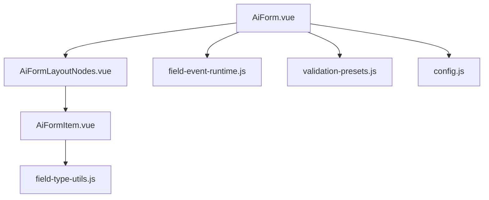
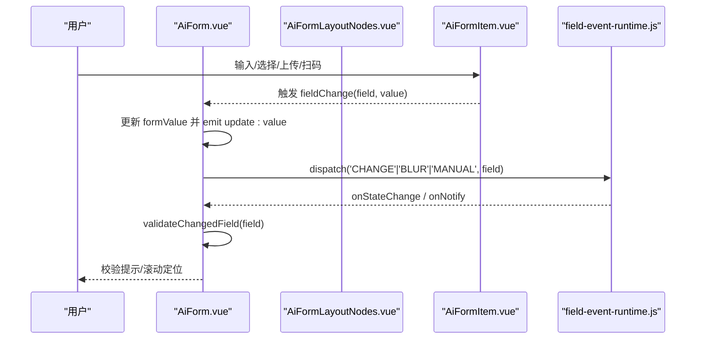
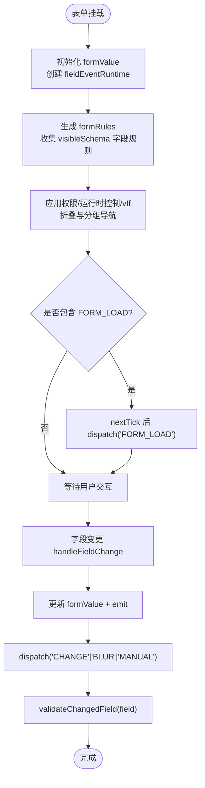
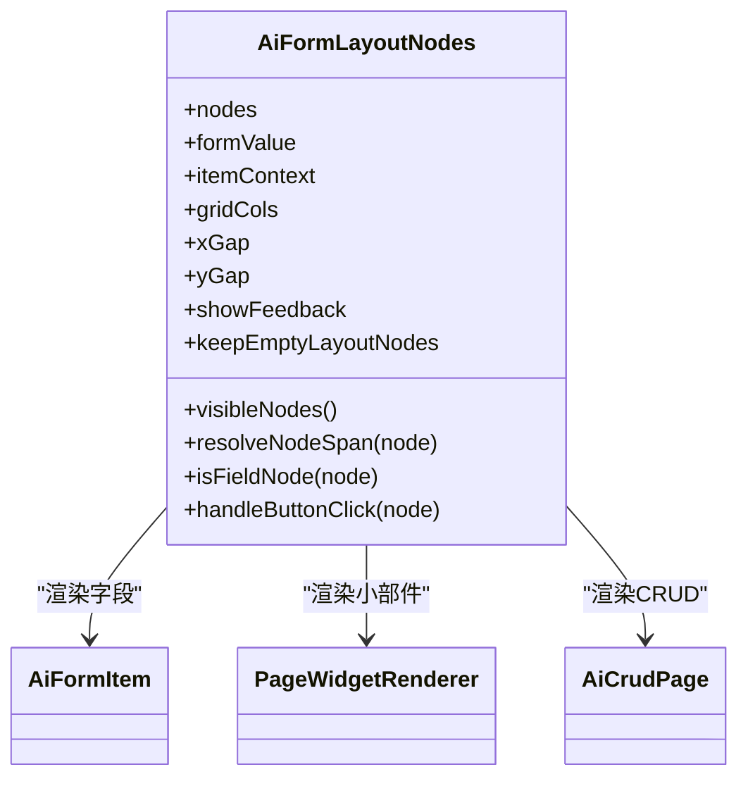
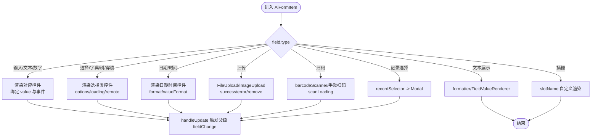
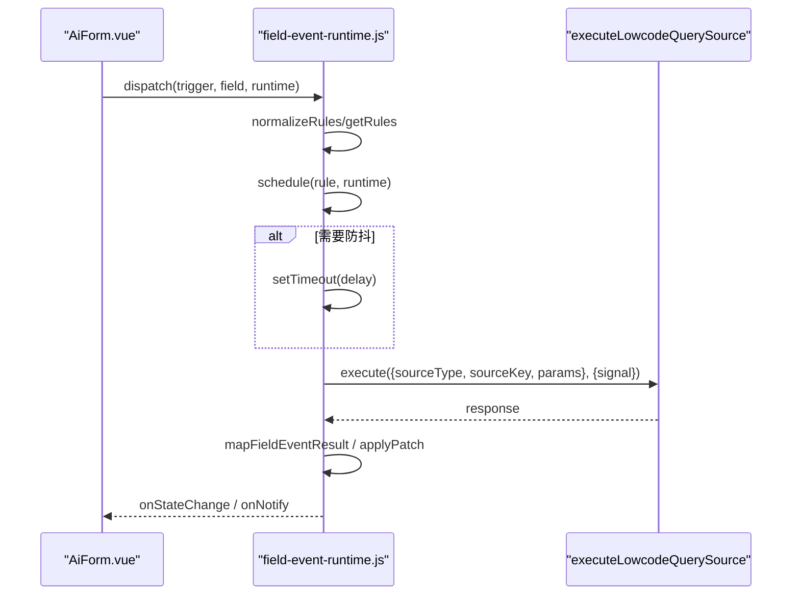
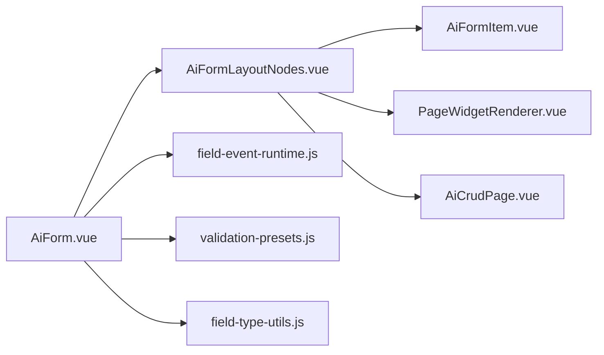

# AI表单核心组件

<cite>
**本文引用的文件**
- [AiForm.vue](file://forge-admin-ui/src/components/ai-form/AiForm.vue)
- [AiFormItem.vue](file://forge-admin-ui/src/components/ai-form/AiFormItem.vue)
- [AiFormLayoutNodes.vue](file://forge-admin-ui/src/components/ai-form/AiFormLayoutNodes.vue)
- [field-type-utils.js](file://forge-admin-ui/src/components/ai-form/field-type-utils.js)
- [validation-presets.js](file://forge-admin-ui/src/utils/validation-presets.js)
- [field-event-runtime.js](file://forge-admin-ui/src/components/ai-form/field-event-runtime.js)
- [config.js](file://forge-admin-ui/src/components/ai-form/config.js)
</cite>

## 目录
1. [简介](#简介)
2. [项目结构](#项目结构)
3. [核心组件](#核心组件)
4. [架构总览](#架构总览)
5. [详细组件分析](#详细组件分析)
6. [依赖关系分析](#依赖关系分析)
7. [性能考量](#性能考量)
8. [故障排查指南](#故障排查指南)
9. [结论](#结论)
10. [附录](#附录)

## 简介
本技术文档聚焦于 AI 表单核心组件 AiForm 与 AiFormItem，系统性解析其架构设计、渲染机制、数据绑定模式、动态生成、字段类型映射、验证规则处理、事件冒泡机制、布局系统、响应式适配、国际化与主题定制、配置选项、扩展点设计、自定义字段渲染器以及性能优化策略。同时提供最佳实践、调试技巧与常见问题解决方案，帮助开发者高效构建可维护、可扩展的 AI 表单。

## 项目结构
AI 表单由三层构成：
- 顶层容器：AiForm 负责表单整体状态、校验规则、折叠/导航、弹窗表单、字段事件运行时初始化与生命周期管理。
- 布局编排：AiFormLayoutNodes 递归遍历节点树，将字段节点与布局节点（行/列/卡片/标签页/折叠面板/表格/按钮/CRUD/小部件）进行栅格化渲染，并透传上下文与事件。
- 字段渲染：AiFormItem 根据 field.type 选择具体 UI 控件，统一处理值更新、只读展示、上传、远程选择、扫码、业务记录选择等能力，并集成字段事件反馈与描述信息。

图表来源
- [AiForm.vue:14-145](file://forge-admin-ui/src/components/ai-form/AiForm.vue#L14-L145)
- [AiFormLayoutNodes.vue:1-280](file://forge-admin-ui/src/components/ai-form/AiFormLayoutNodes.vue#L1-L280)
- [AiFormItem.vue:26-784](file://forge-admin-ui/src/components/ai-form/AiFormItem.vue#L26-L784)
- [field-event-runtime.js:99-294](file://forge-admin-ui/src/components/ai-form/field-event-runtime.js#L99-L294)
- [validation-presets.js:75-107](file://forge-admin-ui/src/utils/validation-presets.js#L75-L107)
- [field-type-utils.js:1-33](file://forge-admin-ui/src/components/ai-form/field-type-utils.js#L1-L33)
- [config.js:25-50](file://forge-admin-ui/src/components/ai-form/config.js#L25-L50)

章节来源
- [AiForm.vue:14-145](file://forge-admin-ui/src/components/ai-form/AiForm.vue#L14-L145)
- [AiFormLayoutNodes.vue:1-280](file://forge-admin-ui/src/components/ai-form/AiFormLayoutNodes.vue#L1-L280)
- [AiFormItem.vue:26-784](file://forge-admin-ui/src/components/ai-form/AiFormItem.vue#L26-L784)

## 核心组件
- AiForm：表单容器，负责 v-model 数据绑定、全局校验规则生成、可见性过滤、折叠与分组导航、操作区、弹窗表单、字段事件运行时注入与调度、初始加载触发、单字段重验等。
- AiFormLayoutNodes：布局引擎，递归渲染节点树，计算 span/gap，应用运行时控制（显示/禁用），透传 formValue/context，向上冒发 fieldChange/nodeAction。
- AiFormItem：字段渲染器，按 type 分派到 Naive UI 或业务组件（如 DictSelect、UserSelectPicker、RegionTreeSelect、FileUpload、ImageUpload、AiCustomSelect、AiRecordSelectorModal），统一值更新、只读文本、上传回调、扫码、字段事件反馈与说明文案。

章节来源
- [AiForm.vue:161-282](file://forge-admin-ui/src/components/ai-form/AiForm.vue#L161-L282)
- [AiFormLayoutNodes.vue:297-331](file://forge-admin-ui/src/components/ai-form/AiFormLayoutNodes.vue#L297-L331)
- [AiFormItem.vue:26-784](file://forge-admin-ui/src/components/ai-form/AiFormItem.vue#L26-L784)

## 架构总览

图表来源
- [AiForm.vue:589-612](file://forge-admin-ui/src/components/ai-form/AiForm.vue#L589-L612)
- [AiForm.vue:672-682](file://forge-admin-ui/src/components/ai-form/AiForm.vue#L672-L682)
- [AiFormLayoutNodes.vue:10-21](file://forge-admin-ui/src/components/ai-form/AiFormLayoutNodes.vue#L10-L21)
- [AiFormItem.vue:78-733](file://forge-admin-ui/src/components/ai-form/AiFormItem.vue#L78-L733)
- [field-event-runtime.js:123-153](file://forge-admin-ui/src/components/ai-form/field-event-runtime.js#L123-L153)

## 详细组件分析

### AiForm 组件
- 数据绑定：通过 watch 同步 props.value 到内部 formValue，并在字段变化时合并更新后 emit update:value。
- 校验规则：基于 visibleSchema 收集字段 rules，结合必填语义与类型特判（数字/日期/选择类）生成 formRules；支持 preset 与自定义 pattern 归一化。
- 可见性与权限：先应用字段权限映射，再按运行时控制与 vIf 过滤，最后应用折叠逻辑与分组导航标记。
- 事件系统：创建 fieldEventRuntime，监听 FORM_LOAD/CHANGE/BLUR/MANUAL/SCAN_COMPLETE，支持防抖、跳过空值、结果映射、错误模式、通知与状态回写。
- 交互增强：搜索表单折叠展开、分组导航滚动、弹窗表单（openModal/setValue）、操作区自适应 span。
- 生命周期：挂载后派发初始 FORM_LOAD，卸载时 dispose 清理定时器与控制器。

图表来源
- [AiForm.vue:298-335](file://forge-admin-ui/src/components/ai-form/AiForm.vue#L298-L335)
- [AiForm.vue:348-477](file://forge-admin-ui/src/components/ai-form/AiForm.vue#L348-L477)
- [AiForm.vue:479-494](file://forge-admin-ui/src/components/ai-form/AiForm.vue#L479-L494)
- [AiForm.vue:520-559](file://forge-admin-ui/src/components/ai-form/AiForm.vue#L520-L559)
- [AiForm.vue:589-612](file://forge-admin-ui/src/components/ai-form/AiForm.vue#L589-L612)
- [AiForm.vue:614-630](file://forge-admin-ui/src/components/ai-form/AiForm.vue#L614-L630)
- [AiForm.vue:672-682](file://forge-admin-ui/src/components/ai-form/AiForm.vue#L672-L682)

章节来源
- [AiForm.vue:161-282](file://forge-admin-ui/src/components/ai-form/AiForm.vue#L161-L282)
- [AiForm.vue:298-335](file://forge-admin-ui/src/components/ai-form/AiForm.vue#L298-L335)
- [AiForm.vue:348-477](file://forge-admin-ui/src/components/ai-form/AiForm.vue#L348-L477)
- [AiForm.vue:479-494](file://forge-admin-ui/src/components/ai-form/AiForm.vue#L479-L494)
- [AiForm.vue:520-559](file://forge-admin-ui/src/components/ai-form/AiForm.vue#L520-L559)
- [AiForm.vue:589-612](file://forge-admin-ui/src/components/ai-form/AiForm.vue#L589-L612)
- [AiForm.vue:614-630](file://forge-admin-ui/src/components/ai-form/AiForm.vue#L614-L630)
- [AiForm.vue:672-682](file://forge-admin-ui/src/components/ai-form/AiForm.vue#L672-L682)

### AiFormLayoutNodes 组件
- 节点分发：识别字段节点与已知布局节点（行/列/卡片/标签页/折叠/按钮/表格/CRUD/小部件），未知节点作为容器递归渲染。
- 栅格与间距：根据 gridCols/xGap/yGap 与节点 span 计算布局；对 row/card/tabs/collapse/table/crud/title 等节点强制整行占位。
- 运行时控制：为每个节点应用运行时控制（显示/禁用/只读），并构建 nodeRuleContext（含 record/formData/route）。
- 事件透传：字段变更与节点动作（点击/更新）通过 fieldChange/nodeAction 向上传递。
- 设计态兼容：keepEmptyLayoutNodes 在预览模式下渲染空容器占位，避免空白。

图表来源
- [AiFormLayoutNodes.vue:1-280](file://forge-admin-ui/src/components/ai-form/AiFormLayoutNodes.vue#L1-L280)
- [AiFormLayoutNodes.vue:339-359](file://forge-admin-ui/src/components/ai-form/AiFormLayoutNodes.vue#L339-L359)
- [AiFormLayoutNodes.vue:361-379](file://forge-admin-ui/src/components/ai-form/AiFormLayoutNodes.vue#L361-L379)
- [AiFormLayoutNodes.vue:503-517](file://forge-admin-ui/src/components/ai-form/AiFormLayoutNodes.vue#L503-L517)

章节来源
- [AiFormLayoutNodes.vue:1-280](file://forge-admin-ui/src/components/ai-form/AiFormLayoutNodes.vue#L1-L280)
- [AiFormLayoutNodes.vue:339-359](file://forge-admin-ui/src/components/ai-form/AiFormLayoutNodes.vue#L339-L359)
- [AiFormLayoutNodes.vue:361-379](file://forge-admin-ui/src/components/ai-form/AiFormLayoutNodes.vue#L361-L379)
- [AiFormLayoutNodes.vue:503-517](file://forge-admin-ui/src/components/ai-form/AiFormLayoutNodes.vue#L503-L517)

### AiFormItem 组件
- 字段类型映射：input/textarea/number/select/dictSelect/radio/radioButton/checkbox/switch/date/datetime/daterange/datetimerange/month/year/time/timerange/upload/fileUpload/imageUpload/slider/rate/color/cascader/treeSelect/regionTreeSelect/userSelect/orgTreeSelect/customSelect/objectReference/recordSelector/text/slot 等。
- 值更新与事件：统一 handleUpdate/handleRangeUpdate/handleTreeSelectUpdate/handleUserSelectLabelUpdate/handleObjectReferenceUpdate 等，并通过 getComponentEvents 透传组件级事件。
- 只读与展示：当为只读选择类型时渲染 ai-form-readonly-text；text 类型支持 formatter 与 FieldValueRenderer。
- 上传与扫码：封装 FileUpload/ImageUpload 成功/失败/移除回调；barcodeScanner 与手动扫码按钮联动 field-event-runtime。
- 业务记录选择：recordSelector 打开 AiRecordSelectorModal，回填显示文本与值。
- 样式与对齐：根据 field.align/textAlign 计算对齐类名；合并运行时控制样式与配置样式。

图表来源
- [AiFormItem.vue:26-784](file://forge-admin-ui/src/components/ai-form/AiFormItem.vue#L26-L784)
- [AiFormItem.vue:951-976](file://forge-admin-ui/src/components/ai-form/AiFormItem.vue#L951-L976)

章节来源
- [AiFormItem.vue:26-784](file://forge-admin-ui/src/components/ai-form/AiFormItem.vue#L26-L784)
- [AiFormItem.vue:951-976](file://forge-admin-ui/src/components/ai-form/AiFormItem.vue#L951-L976)

### 字段类型工具与配置
- field-type-utils：集中判断数字类型与“请输入”语义类型，用于必填校验触发时机与消息文案。
- config：定义 FIELD_TYPES 常量与 FieldFactory 工厂方法，便于快速构造常用字段配置。

章节来源
- [field-type-utils.js:1-33](file://forge-admin-ui/src/components/ai-form/field-type-utils.js#L1-L33)
- [config.js:25-50](file://forge-admin-ui/src/components/ai-form/config.js#L25-L50)
- [config.js:55-316](file://forge-admin-ui/src/components/ai-form/config.js#L55-L316)

### 验证规则与预设
- validation-presets：内置手机号、邮箱、身份证、银行卡、固话、统一社会信用代码、整数、非负数、网址等常见规则，支持 presetCodes/presets/preset/presetCode/commonRule 多键兼容。
- 归一化：normalizeValidationRules 将预设与自定义 pattern/rules 合并；normalizeRulePattern 将字符串正则转换为 RegExp；buildRequiredRule 针对数字/日期/选择类型添加空值校验以避免误判。

章节来源
- [validation-presets.js:1-115](file://forge-admin-ui/src/utils/validation-presets.js#L1-L115)
- [AiForm.vue:348-477](file://forge-admin-ui/src/components/ai-form/AiForm.vue#L348-L477)

### 字段事件运行时
- 触发器：FORM_LOAD、CHANGE、BLUR、MANUAL、SCAN_COMPLETE。
- 参数映射：支持从表单字段、上下文路径、路由查询读取参数，安全路径校验与危险键过滤。
- 结果映射：ROOT/FIRST_ROW 两种结果模式，whenMissing 支持 CLEAR/KEEP。
- 执行与取消：AbortController 取消旧请求，序列号保证最新结果覆盖，防抖默认 300ms（CHANGE）。
- 状态与通知：onStateChange 上报 loading/message/status；onNotify 调用 window.$message 提示。

图表来源
- [field-event-runtime.js:99-294](file://forge-admin-ui/src/components/ai-form/field-event-runtime.js#L99-L294)
- [field-event-runtime.js:306-362](file://forge-admin-ui/src/components/ai-form/field-event-runtime.js#L306-L362)
- [field-event-runtime.js:474-503](file://forge-admin-ui/src/components/ai-form/field-event-runtime.js#L474-L503)

章节来源
- [field-event-runtime.js:99-294](file://forge-admin-ui/src/components/ai-form/field-event-runtime.js#L99-L294)
- [field-event-runtime.js:306-362](file://forge-admin-ui/src/components/ai-form/field-event-runtime.js#L306-L362)
- [field-event-runtime.js:474-503](file://forge-admin-ui/src/components/ai-form/field-event-runtime.js#L474-L503)

## 依赖关系分析
- AiForm 依赖：
  - AiFormLayoutNodes：布局渲染与事件冒泡。
  - field-event-runtime：字段事件调度与状态管理。
  - validation-presets：验证规则归一化。
  - field-type-utils：类型判断辅助。
  - 低代码查询源：executeLowcodeQuerySource（通过 context 注入）。
- AiFormLayoutNodes 依赖：
  - AiFormItem：字段渲染。
  - PageWidgetRenderer：小部件渲染。
  - AiCrudPage：CRUD 区块渲染（异步加载）。
- AiFormItem 依赖：
  - Naive UI 基础组件：NInput/NSelect/NDatePicker/NTimePicker/NUpload/NTransfer/NRate/NColorPicker/NSlider/NCheckboxGroup/NRadioGroup/NInputGroup 等。
  - 业务组件：DictSelect、UserSelectPicker、RegionTreeSelect、FileUpload、ImageUpload、AiCustomSelect、AiRecordSelectorModal。
  - 运行时控制：resolveRuntimeControl/applyRuntimeControl。

图表来源
- [AiForm.vue:148-159](file://forge-admin-ui/src/components/ai-form/AiForm.vue#L148-L159)
- [AiFormLayoutNodes.vue:283-336](file://forge-admin-ui/src/components/ai-form/AiFormLayoutNodes.vue#L283-L336)
- [AiFormItem.vue:68-733](file://forge-admin-ui/src/components/ai-form/AiFormItem.vue#L68-L733)

章节来源
- [AiForm.vue:148-159](file://forge-admin-ui/src/components/ai-form/AiForm.vue#L148-L159)
- [AiFormLayoutNodes.vue:283-336](file://forge-admin-ui/src/components/ai-form/AiFormLayoutNodes.vue#L283-L336)
- [AiFormItem.vue:68-733](file://forge-admin-ui/src/components/ai-form/AiFormItem.vue#L68-L733)

## 性能考量
- 懒加载与按需渲染：
  - 布局节点仅在 visibleNodes 中渲染，减少无效 DOM。
  - AiCrudPage 使用 defineAsyncComponent 延迟加载。
- 防抖与取消：
  - CHANGE 事件默认 300ms 防抖，避免频繁请求。
  - 使用 AbortController 取消过期请求，防止竞态。
- 校验优化：
  - 仅对当前变更字段进行局部 validate，避免全表重验。
  - 数字/日期/选择类型使用自定义 validator 避免误判空值。
- 样式与计算：
  - 运行时控制样式与配置样式合并，减少重复计算。
  - 栅格 span/gap 计算缓存于 computed，降低重排。

[本节为通用性能建议，不直接分析具体文件]

## 故障排查指南
- 字段未显示：
  - 检查运行时控制 visible 是否为 false，或 vIf 条件不满足。
  - 确认字段权限映射未隐藏该字段。
- 校验不生效：
  - 确认字段已纳入 visibleSchema，且存在对应 rules。
  - 对于数字/日期/选择类型，确保使用了正确的 trigger 与自定义 validator。
- 事件未触发：
  - 检查 fieldEvents 是否正确传入，sourceField 是否在 allFieldNames 中。
  - 查看 field-event-runtime 的状态 with skipWhenEmpty/clearTargetsOnTrigger 配置。
- 上传异常：
  - 核对 FileUpload/ImageUpload 的 action/businessType/storageType 等参数。
  - 关注 success/error/remove 回调中的错误信息。
- 扫码无响应：
  - 确认 barcodeScanner 或手动扫码按钮未被 disabled。
  - 检查 field-event-runtime 的 SCAN_COMPLETE 规则与 execute 实现。

章节来源
- [AiForm.vue:303-329](file://forge-admin-ui/src/components/ai-form/AiForm.vue#L303-L329)
- [AiForm.vue:348-477](file://forge-admin-ui/src/components/ai-form/AiForm.vue#L348-L477)
- [AiForm.vue:589-612](file://forge-admin-ui/src/components/ai-form/AiForm.vue#L589-L612)
- [AiForm.vue:614-630](file://forge-admin-ui/src/components/ai-form/AiForm.vue#L614-L630)
- [AiFormItem.vue:94-115](file://forge-admin-ui/src/components/ai-form/AiFormItem.vue#L94-L115)
- [AiFormItem.vue:430-493](file://forge-admin-ui/src/components/ai-form/AiFormItem.vue#L430-L493)
- [field-event-runtime.js:123-153](file://forge-admin-ui/src/components/ai-form/field-event-runtime.js#L123-L153)

## 结论
AiForm 与 AiFormItem 构成了高内聚、低耦合的动态表单体系：AiForm 负责数据、校验与事件总线，AiFormLayoutNodes 负责布局编排与运行时控制，AiFormItem 专注字段渲染与交互。通过统一的类型映射、验证预设、事件运行时与扩展点（插槽/小部件/CRUD），实现了强大的可配置性与可定制性。配合防抖、取消、局部校验与懒加载等优化手段，可在复杂场景下保持良好性能与用户体验。

[本节为总结性内容，不直接分析具体文件]

## 附录
- 表单配置选项（节选）
  - 布局：labelPlacement、labelWidth、labelAlign、size、gridCols、xGap、yGap、enableCollapse、maxVisibleFields、showFeedback、keepEmptyLayoutNodes。
  - 行为：showActions、showSubmit、showReset、showCancel、submitText/resetText/cancelText、submitLoading。
  - 数据：schema、value、context、fieldPermissions、fieldEvents、fieldEventLoadToken、formAssets。
- 扩展点设计
  - 插槽：任意 slotName 透传到 AiFormItem，支持自定义字段渲染。
  - 小部件：PageWidgetRenderer 支持低代码页面组件嵌入。
  - CRUD：AiCrudPage 作为布局节点嵌入，支持 searchSchema/columns/schema。
- 国际化与主题
  - 通过 NForm 的 labelPlacement/size 与组件 props 控制文案与尺寸。
  - 主题定制可通过 CSS 类名（如 ai-form-item--readonly、af-layout-card 等）与运行时 style/class 覆盖。
- 最佳实践
  - 使用 FieldFactory 快速生成字段配置，保持一致性。
  - 合理使用 presetCodes 与自定义 pattern 组合，避免重复规则。
  - 对远程选择/上传/扫码等耗时操作启用防抖与取消。
  - 在复杂表单中使用 keepEmptyLayoutNodes 提升设计态体验，发布时关闭。
- 调试技巧
  - 利用 formRef.validate 指定 key 进行单字段重验。
  - 通过 field-event-runtime 的 onStateChange 观察 loading/message/status。
  - 在浏览器控制台打印 visibleSchema/allFieldSchema 以确认渲染范围。

[本节为补充信息，不直接分析具体文件]