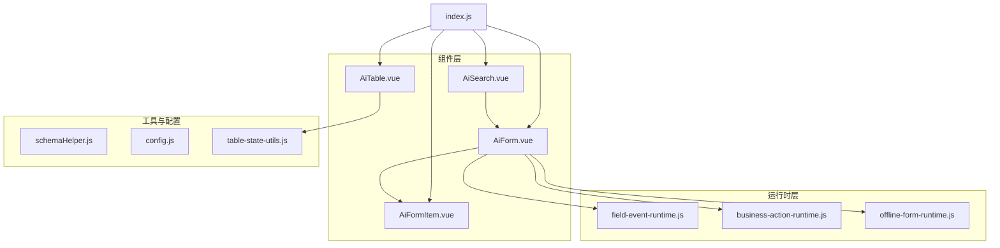
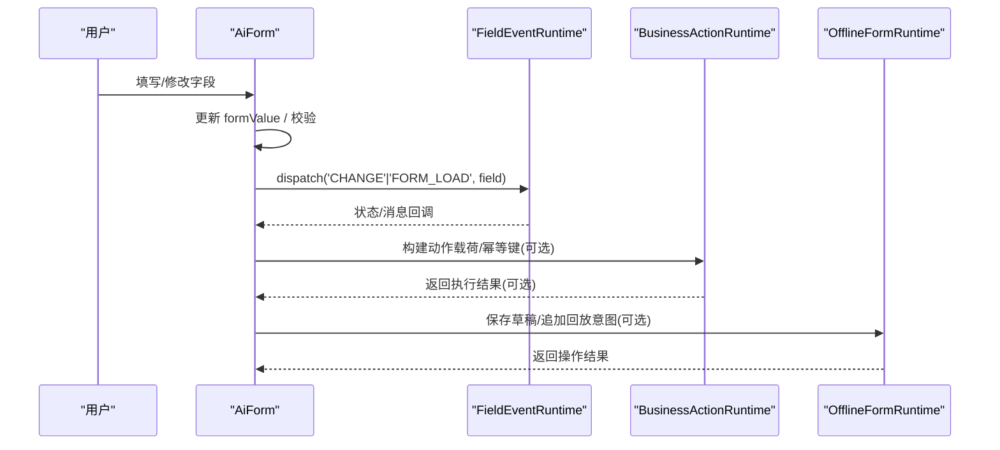
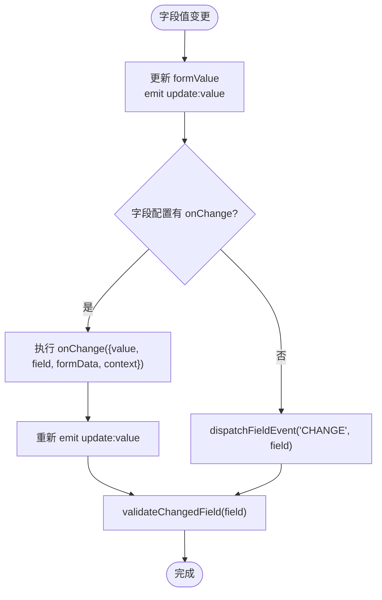
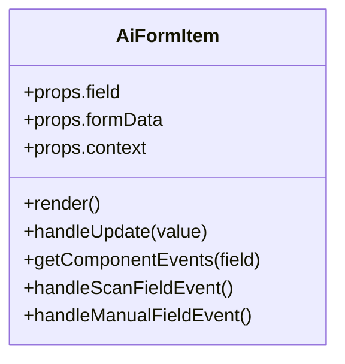
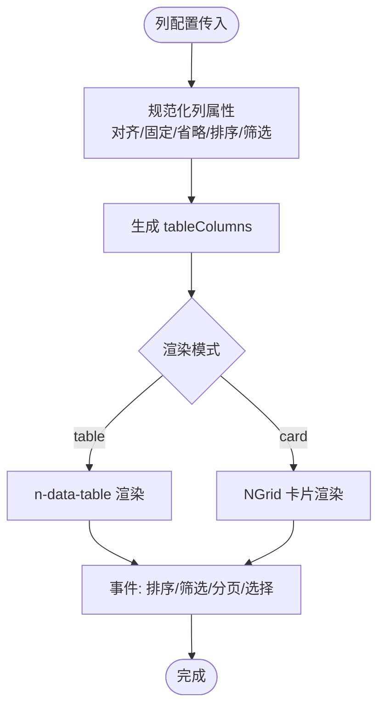
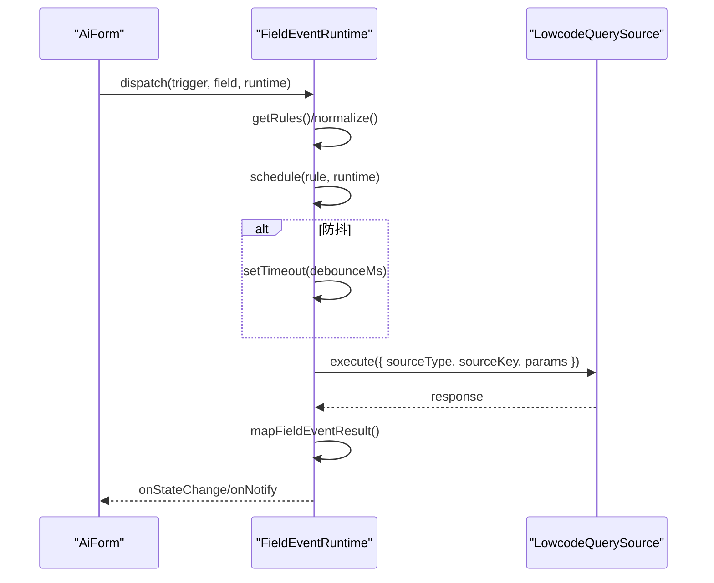
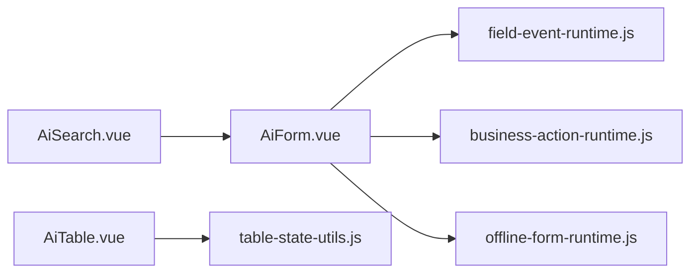

# AI表单组件

<cite>
**本文引用的文件**
- [AiForm.vue](file://forge-admin-ui/src/components/ai-form/AiForm.vue)
- [AiTable.vue](file://forge-admin-ui/src/components/ai-form/AiTable.vue)
- [AiSearch.vue](file://forge-admin-ui/src/components/ai-form/AiSearch.vue)
- [AiFormItem.vue](file://forge-admin-ui/src/components/ai-form/AiFormItem.vue)
- [field-event-runtime.js](file://forge-admin-ui/src/components/ai-form/field-event-runtime.js)
- [business-action-runtime.js](file://forge-admin-ui/src/components/ai-form/business-action-runtime.js)
- [offline-form-runtime.js](file://forge-admin-ui/src/components/ai-form/offline-form-runtime.js)
- [index.js](file://forge-admin-ui/src/components/ai-form/index.js)
</cite>

## 目录
1. [简介](#简介)
2. [项目结构](#项目结构)
3. [核心组件](#核心组件)
4. [架构总览](#架构总览)
5. [详细组件分析](#详细组件分析)
6. [依赖关系分析](#依赖关系分析)
7. [性能考虑](#性能考虑)
8. [故障排查指南](#故障排查指南)
9. [结论](#结论)
10. [附录](#附录)

## 简介
本技术文档围绕 Forge Admin 的 AI 驱动表单体系，系统性解析 AiForm、AiTable、AiSearch 等核心组件的设计模式与实现机制。重点说明：
- 动态生成与字段渲染：基于 JSON Schema 的动态布局、条件可见性、权限控制与校验规则。
- 事件处理与数据绑定：字段变更、表单提交、弹窗动作、字段事件运行时（Field Event Runtime）与业务动作运行时（Business Action Runtime）。
- 高级能力：离线表单草稿与回放、查询源参数映射与结果回填、防抖与取消、安全白名单校验。
- 扩展点与自定义渲染：插槽、扩展面板、列渲染器、工具栏扩展。
- 性能优化：虚拟滚动、懒加载、去抖、分页、卡片/表格双模式切换。
- 开发指南、调试技巧与常见问题定位。

## 项目结构
AI 表单相关代码集中在 forge-admin-ui 的 ai-form 目录下，采用“组件 + 运行时 + 工具”的分层组织：
- 组件层：AiForm、AiFormItem、AiTable、AiSearch 等 UI 组件。
- 运行时层：field-event-runtime、business-action-runtime、offline-form-runtime。
- 工具与配置：schemaHelper、config、table-state-utils、expand-utils 等。
- 导出入口：index.js 统一对外暴露组件与工厂方法。

图表来源
- [AiForm.vue:1-120](file://forge-admin-ui/src/components/ai-form/AiForm.vue#L1-L120)
- [AiTable.vue:1-80](file://forge-admin-ui/src/components/ai-form/AiTable.vue#L1-L80)
- [AiSearch.vue:1-60](file://forge-admin-ui/src/components/ai-form/AiSearch.vue#L1-L60)
- [field-event-runtime.js:1-120](file://forge-admin-ui/src/components/ai-form/field-event-runtime.js#L1-L120)
- [business-action-runtime.js:1-120](file://forge-admin-ui/src/components/ai-form/business-action-runtime.js#L1-L120)
- [offline-form-runtime.js:1-60](file://forge-admin-ui/src/components/ai-form/offline-form-runtime.js#L1-L60)
- [index.js:1-44](file://forge-admin-ui/src/components/ai-form/index.js#L1-L44)

章节来源
- [index.js:1-44](file://forge-admin-ui/src/components/ai-form/index.js#L1-L44)

## 核心组件
- AiForm：JSON Schema 驱动的表单容器，负责布局、校验、事件分发、弹窗动作、折叠导航、字段权限与可见性控制。
- AiFormItem：按类型动态渲染表单项（输入、选择、日期、上传、树选择、用户选择、文本展示、插槽等），并集成字段事件反馈与扫码交互。
- AiTable：数据表格与卡片视图双模式，支持列配置、排序、筛选、密度切换、全屏、工具栏扩展、行选择与展开。
- AiSearch：基于 AiForm 的搜索表单封装，提供搜索/重置按钮、折叠、验证与上下文注入。

章节来源
- [AiForm.vue:147-275](file://forge-admin-ui/src/components/ai-form/AiForm.vue#L147-L275)
- [AiFormItem.vue:1-120](file://forge-admin-ui/src/components/ai-form/AiFormItem.vue#L1-L120)
- [AiTable.vue:176-392](file://forge-admin-ui/src/components/ai-form/AiTable.vue#L176-L392)
- [AiSearch.vue:65-154](file://forge-admin-ui/src/components/ai-form/AiSearch.vue#L65-L154)

## 架构总览
AI 表单体系以“Schema -> 渲染 -> 事件 -> 运行时”为主线：
- Schema 驱动：通过 schema 定义字段、布局、校验、可见性与权限。
- 渲染管线：AiForm 将 schema 转换为节点树，交由 AiFormLayoutNodes 与 AiFormItem 渲染。
- 事件总线：字段变化触发 CHANGE/BLUR/MANUAL/SCAN_COMPLETE 等事件，由 field-event-runtime 调度执行。
- 业务动作：business-action-runtime 负责构建输入表单、幂等键、执行载荷与结果解包。
- 离线能力：offline-form-runtime 管理草稿保存、回放意图与发布快照。

图表来源
- [AiForm.vue:583-617](file://forge-admin-ui/src/components/ai-form/AiForm.vue#L583-L617)
- [field-event-runtime.js:123-227](file://forge-admin-ui/src/components/ai-form/field-event-runtime.js#L123-L227)
- [business-action-runtime.js:115-154](file://forge-admin-ui/src/components/ai-form/business-action-runtime.js#L115-L154)
- [offline-form-runtime.js:63-98](file://forge-admin-ui/src/components/ai-form/offline-form-runtime.js#L63-L98)

## 详细组件分析

### AiForm 组件分析
职责与特性
- 接收 schema、v-model value、context、布局与行为配置。
- 计算可见字段、应用权限、折叠逻辑与分组导航。
- 生成校验规则，支持必填、自定义规则与类型特判。
- 管理字段事件运行时，支持 FORM_LOAD、CHANGE、BLUR、MANUAL、SCAN_COMPLETE。
- 处理节点动作：setValue、openModal 等；内置弹窗表单渲染。
- 提供 patchFormData、scanField、dispatchFieldEvent 等扩展能力。

关键流程
- 初始化：监听 props.value 同步到内部 formValue；挂载时派发 FORM_LOAD。
- 字段变更：handleFieldChange 更新值、触发 onChange、派发字段事件、单字段重验。
- 规则生成：collectRuntimeFieldRules + normalizeFieldRules + withRequiredRule。
- 可见性：resolveRuntimeControl + vIf 函数/布尔判断。
- 弹窗动作：handleNodeAction 解析 modalFormKey，构建 actionModalSchema 并显示。

图表来源
- [AiForm.vue:583-605](file://forge-admin-ui/src/components/ai-form/AiForm.vue#L583-L605)
- [AiForm.vue:665-675](file://forge-admin-ui/src/components/ai-form/AiForm.vue#L665-L675)

章节来源
- [AiForm.vue:147-800](file://forge-admin-ui/src/components/ai-form/AiForm.vue#L147-L800)

### AiFormItem 组件分析
职责与特性
- 根据 field.type 动态渲染多种控件：input、textarea、number、select、dictSelect、radio、checkbox、switch、date/datetime/range、time/timerange、upload/fileUpload/imageUpload、slider、rate、color、cascader、treeSelect、orgTreeSelect、userSelect、regionTreeSelect、transfer、customSelect、objectReference、recordSelector、text、slot 等。
- 统一处理禁用/只读、占位符、提示、描述、徽章、复制、扫码、字段事件反馈。
- 支持低代码页面组件 PageWidgetRenderer 与记录选择器 AiRecordSelectorModal。

扩展点
- 插槽：field.type === 'slot' 时透传 slotName 与 update-value。
- 自定义事件：getComponentEvents 透传原生事件。
- 远程/级联：支持 remote、onSearch、cascade、虚拟滚动等。

图表来源
- [AiFormItem.vue:1-120](file://forge-admin-ui/src/components/ai-form/AiFormItem.vue#L1-L120)

章节来源
- [AiFormItem.vue:1-800](file://forge-admin-ui/src/components/ai-form/AiFormItem.vue#L1-L800)

### AiTable 组件分析
职责与特性
- 基于 n-data-table 封装，支持 table/card 双渲染模式。
- 工具栏：刷新、密度、列设置、搜索切换、全屏、渲染模式切换、额外插槽。
- 列配置：自动推断对齐、固定、省略、排序、筛选、展开列、操作列。
- 数据流：本地过滤/排序、分页、选中/展开状态、拖拽滚动增强。
- 空态与样式：可定制标题与描述，支持行类名与间距变量。

关键算法
- 列转换：合并 className、默认右固定操作列、自动筛选选项上限。
- 排序比较：数值优先，字符串 localeCompare 中文数字友好。
- 筛选：default 或自定义 filter，支持 and/or 模式。

图表来源
- [AiTable.vue:528-638](file://forge-admin-ui/src/components/ai-form/AiTable.vue#L528-L638)
- [AiTable.vue:660-793](file://forge-admin-ui/src/components/ai-form/AiTable.vue#L660-L793)

章节来源
- [AiTable.vue:176-800](file://forge-admin-ui/src/components/ai-form/AiTable.vue#L176-L800)

### AiSearch 组件分析
职责与特性
- 基于 AiForm 封装，注入 isSearch 上下文，隐藏默认提交/重置按钮，提供搜索/重置按钮与额外操作插槽。
- 支持折叠、栅格、标签位置/宽度、尺寸、yGap 等。
- 提供 handleSearch/handleReset/updateField/getFormData/setFormData 等方法暴露。

使用建议
- 在列表页顶部作为查询条件区，结合 AiTable 的 refresh/page-change 事件联动。
- 通过 beforeReset 钩子实现重置前清理或二次确认。

章节来源
- [AiSearch.vue:1-264](file://forge-admin-ui/src/components/ai-form/AiSearch.vue#L1-L264)

### 字段事件运行时（Field Event Runtime）
职责
- 规范化与校验字段事件规则（id、trigger、sourceType/sourceKey、paramMappings/resultMappings 等）。
- 调度执行：支持防抖、跳过空值、清除目标、AbortController 取消、序列号避免竞态。
- 参数构建：从表单字段、上下文路径、路由查询读取参数。
- 结果映射：ROOT/FIRST_ROW 模式，whenMissing=CLEAR/KEEP。
- 状态与通知：loading/success/error/not_found，错误模式 MESSAGE/SILENT。

关键流程
- setRules/dispatch：过滤规则、并行执行、状态更新。
- schedule/run：防抖、skipWhenEmpty、clearTargetsOnTrigger、execute 调用、unwrapQuerySourceData。
- 安全：危险键白名单、路径段校验、参数命名规范。

图表来源
- [field-event-runtime.js:123-227](file://forge-admin-ui/src/components/ai-form/field-event-runtime.js#L123-L227)
- [field-event-runtime.js:59-97](file://forge-admin-ui/src/components/ai-form/field-event-runtime.js#L59-L97)

章节来源
- [field-event-runtime.js:1-524](file://forge-admin-ui/src/components/ai-form/field-event-runtime.js#L1-L524)

### 业务动作运行时（Business Action Runtime）
职责
- 构建动作输入表单 schema（text/number/integer/money/boolean/date/datetime/select）。
- 初始数据填充：支持 row.* 路径取值与 defaultValues 覆盖。
- 幂等键：基于 crypto.randomUUID 或 fallback 生成，负载稳定序列化。
- 执行载荷：组装 suiteCode/objectCode/recordId/actionCode/formData/context/idempotencyKey 等。
- 结果解包：统一 unwrapBusinessActionResult，失败抛错。
- 显示条件：matchesRuntimeDisplayCondition 支持 AND/OR、IN/NOT IN、比较运算符。

章节来源
- [business-action-runtime.js:26-154](file://forge-admin-ui/src/components/ai-form/business-action-runtime.js#L26-L154)
- [business-action-runtime.js:205-310](file://forge-admin-ui/src/components/ai-form/business-action-runtime.js#L205-L310)

### 离线表单运行时（Offline Form Runtime）
职责
- 规范化配置：applicationCode/objectCode/formCode/configKey/suiteCode/publishedVersion/schemaHash/replayActionCode 等。
- 草稿存储：createOfflineDraftStore，限制最大草稿数与字节数。
- 回放意图：appendSubmitIntent 记录待回放的动作与参数。
- 发布快照：createOfflinePublishedSnapshot 基于 modelSchema/pageSchema/formCode 生成哈希。

章节来源
- [offline-form-runtime.js:14-98](file://forge-admin-ui/src/components/ai-form/offline-form-runtime.js#L14-L98)
- [offline-form-runtime.js:111-133](file://forge-admin-ui/src/components/ai-form/offline-form-runtime.js#L111-L133)

## 依赖关系分析
- AiForm 依赖：
  - AiFormLayoutNodes（布局节点渲染）、AiFormItem（字段渲染）、field-event-runtime（字段事件）、validation-presets（规则归一化）、collaboration-runtime（扫描）、field-permissions（权限）。
- AiTable 依赖：
  - AiToolbarAction（工具栏）、table-state-utils（行类名）、Naive UI 表格与网格。
- AiSearch 依赖：
  - AiForm（复用表单能力）。
- 运行时依赖：
  - field-event-runtime 依赖 lowcode-query-source 执行查询。
  - business-action-runtime 与 offline-form-runtime 为纯函数式工具，无外部 UI 依赖。

图表来源
- [AiForm.vue:147-158](file://forge-admin-ui/src/components/ai-form/AiForm.vue#L147-L158)
- [AiTable.vue:176-182](file://forge-admin-ui/src/components/ai-form/AiTable.vue#L176-L182)
- [AiSearch.vue:65-69](file://forge-admin-ui/src/components/ai-form/AiSearch.vue#L65-L69)

章节来源
- [AiForm.vue:147-158](file://forge-admin-ui/src/components/ai-form/AiForm.vue#L147-L158)
- [AiTable.vue:176-182](file://forge-admin-ui/src/components/ai-form/AiTable.vue#L176-L182)
- [AiSearch.vue:65-69](file://forge-admin-ui/src/components/ai-form/AiSearch.vue#L65-L69)

## 性能考虑
- 防抖与取消：字段事件 CHANGE 默认防抖，支持 debounceMs；run 阶段使用 AbortController 取消旧请求，避免竞态。
- 懒加载与分页：字段事件 DATASET 支持 pageNum/pageSize/maxRows；表格支持分页与虚拟滚动（通过 NGrid/NDataTable）。
- 渲染优化：AiTable 卡片模式使用 NGrid 响应式布局；列内容 wrapTableCellContent 减少多余 DOM。
- 规则计算缓存：computed 派生 visibleSchema/formRules/sectionNavItems，减少重复计算。
- 折叠与导航：enableCollapse + maxVisibleFields 控制首屏字段数量，提升大表单体验。
- 资源隔离：field-event-runtime 对危险键与路径进行严格校验，降低异常开销。

[本节为通用性能指导，不直接分析具体文件]

## 故障排查指南
常见问题与定位
- 字段事件未触发
  - 检查 rule.enabled、trigger、sourceField 是否在已知字段集合中。
  - 查看 normalizeFieldEventRules 是否因非法 key/path 被丢弃。
  - 确认 AiForm 已挂载且 initialFormLoadDispatched 未被阻止。
- 字段事件结果未回填
  - 检查 resultMappings 的 to 是否为有效字段，whenMissing 策略是否符合预期。
  - 确认 unwrapQuerySourceData 能正确解包后端响应。
- 表单校验误报
  - 数字/日期/选择类型会注入自定义 validator，确保 hasFormValue 判定符合业务语义。
  - 若 rules 已包含 required，不会重复添加。
- 表格筛选/排序异常
  - 确认列 key/proptype 一致；filterMode 为 and/or 时注意多值匹配逻辑。
  - 自定义 sorter/compare 需保证返回值类型一致。
- 离线草稿丢失
  - 检查 normalized config.enabled 与 namespace 是否正确；maxDrafts/maxBytes 是否超限。
  - 回放意图需要 replayActionCode 配置。

章节来源
- [field-event-runtime.js:306-421](file://forge-admin-ui/src/components/ai-form/field-event-runtime.js#L306-L421)
- [AiForm.vue:341-470](file://forge-admin-ui/src/components/ai-form/AiForm.vue#L341-L470)
- [AiTable.vue:660-793](file://forge-admin-ui/src/components/ai-form/AiTable.vue#L660-L793)
- [offline-form-runtime.js:14-98](file://forge-admin-ui/src/components/ai-form/offline-form-runtime.js#L14-L98)

## 结论
Forge Admin 的 AI 表单组件体系以 Schema 为核心，结合强大的运行时能力，实现了高内聚、可扩展、易维护的动态表单解决方案。通过字段事件运行时与业务动作运行时，开发者可以以声明式方式编排复杂交互；离线表单能力保障了弱网与断网场景下的用户体验。建议在复杂场景中充分利用防抖、分页、折叠与卡片/表格模式切换，以获得最佳性能与可用性。

[本节为总结性内容，不直接分析具体文件]

## 附录
- 组件导出与使用
  - 通过 index.js 统一导入 AiForm、AiTable、AiSearch、AiFormItem 等组件。
  - 使用 createField/FieldFactory 创建字段实例，SchemaHelper 辅助构建 schema。
- 推荐实践
  - 使用 context 传递路由、当前行、表单数据与扩展能力。
  - 合理使用 enableCollapse/maxVisibleFields 控制首屏复杂度。
  - 为大数据量列表启用分页与虚拟滚动，避免长列表卡顿。
  - 字段事件规则务必遵循白名单与安全路径校验，避免注入风险。

章节来源
- [index.js:1-44](file://forge-admin-ui/src/components/ai-form/index.js#L1-L44)