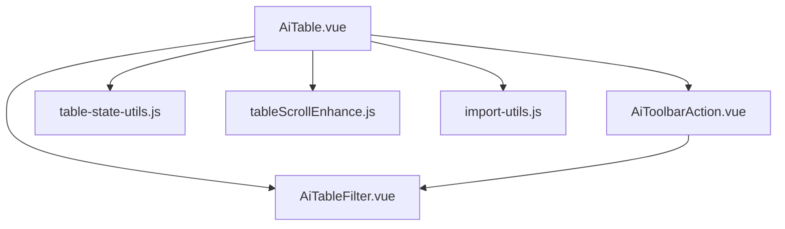
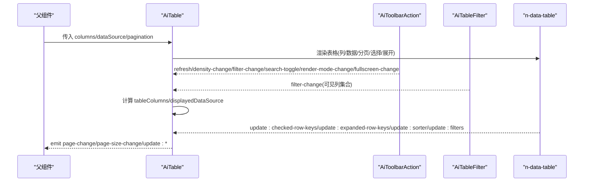
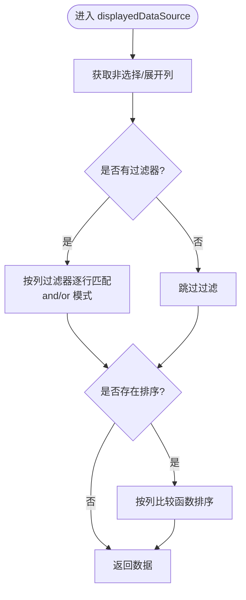
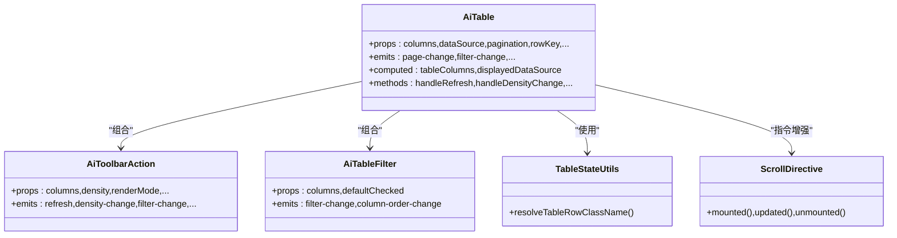
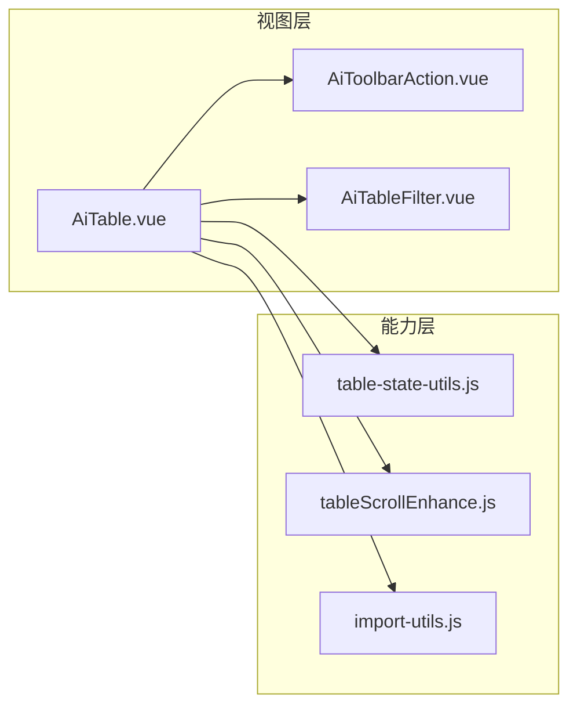

# AI表格组件

<cite>
**本文引用的文件**
- [AiTable.vue](file://forge-admin-ui/src/components/ai-form/AiTable.vue)
- [AiToolbarAction.vue](file://forge-admin-ui/src/components/ai-form/AiToolbarAction.vue)
- [AiTableFilter.vue](file://forge-admin-ui/src/components/ai-form/AiTableFilter.vue)
- [table-state-utils.js](file://forge-admin-ui/src/components/ai-form/table-state-utils.js)
- [tableScrollEnhance.js](file://forge-admin-ui/src/directives/modules/tableScrollEnhance.js)
- [import-utils.js](file://forge-admin-ui/src/components/ai-form/import-utils.js)
- [single-table-crud.md](file://.agents/skills/forge-codegen-crud/references/single-table-crud.md)
</cite>

## 目录
1. [简介](#简介)
2. [项目结构](#项目结构)
3. [核心组件](#核心组件)
4. [架构总览](#架构总览)
5. [详细组件分析](#详细组件分析)
6. [依赖关系分析](#依赖关系分析)
7. [性能与大数据处理](#性能与大数据处理)
8. [故障排查指南](#故障排查指南)
9. [结论](#结论)
10. [附录：导入导出与打印](#附录导入导出与打印)

## 简介
本技术文档围绕 AiTable 组件，系统性解析其数据展示、分页、排序筛选、批量操作、列配置系统、自定义渲染、行选择机制、树形展开、工具栏交互、滚动增强等能力；并给出状态管理、虚拟滚动策略、大数据量处理、内存管理与性能优化建议，以及导入、导出、打印的集成方式与排错方法。

## 项目结构
AiTable 位于前端 UI 工程，采用 Vue 3 + Naive UI 封装，配合工具栏与列设置子组件，形成“表格主体 + 工具栏 + 列设置”的组合式结构；同时通过指令增强横向拖拽滚动体验。

图表来源
- [AiTable.vue:1-174](file://forge-admin-ui/src/components/ai-form/AiTable.vue#L1-L174)
- [AiToolbarAction.vue:1-124](file://forge-admin-ui/src/components/ai-form/AiToolbarAction.vue#L1-L124)
- [AiTableFilter.vue:1-71](file://forge-admin-ui/src/components/ai-form/AiTableFilter.vue#L1-L71)
- [tableScrollEnhance.js:1-47](file://forge-admin-ui/src/directives/modules/tableScrollEnhance.js#L1-L47)
- [import-utils.js:1-91](file://forge-admin-ui/src/components/ai-form/import-utils.js#L1-L91)

章节来源
- [AiTable.vue:1-174](file://forge-admin-ui/src/components/ai-form/AiTable.vue#L1-L174)
- [AiToolbarAction.vue:1-124](file://forge-admin-ui/src/components/ai-form/AiToolbarAction.vue#L1-L124)
- [AiTableFilter.vue:1-71](file://forge-admin-ui/src/components/ai-form/AiTableFilter.vue#L1-L71)
- [tableScrollEnhance.js:1-47](file://forge-admin-ui/src/directives/modules/tableScrollEnhance.js#L1-L47)
- [import-utils.js:1-91](file://forge-admin-ui/src/components/ai-form/import-utils.js#L1-L91)

## 核心组件
- AiTable：表格主体，负责列转换、数据过滤/排序、分页绑定、行选择、展开、渲染模式切换（列表/卡片）、空态、工具栏集成。
- AiToolbarAction：工具栏按钮集合（刷新、密度、列设置、搜索显隐、渲染模式切换、全屏）。
- AiTableFilter：列显示/隐藏与顺序拖拽，输出可见列集合。
- table-state-utils：合并用户自定义行类名与选中态类名。
- tableScrollEnhance：表格横向拖拽滚动指令，同步多容器滚动位置。
- import-utils：导入预览构建与结果归一化。

章节来源
- [AiTable.vue:176-800](file://forge-admin-ui/src/components/ai-form/AiTable.vue#L176-L800)
- [AiToolbarAction.vue:126-346](file://forge-admin-ui/src/components/ai-form/AiToolbarAction.vue#L126-L346)
- [AiTableFilter.vue:73-323](file://forge-admin-ui/src/components/ai-form/AiTableFilter.vue#L73-L323)
- [table-state-utils.js:1-26](file://forge-admin-ui/src/components/ai-form/table-state-utils.js#L1-L26)
- [tableScrollEnhance.js:256-355](file://forge-admin-ui/src/directives/modules/tableScrollEnhance.js#L256-L355)
- [import-utils.js:1-91](file://forge-admin-ui/src/components/ai-form/import-utils.js#L1-L91)

## 架构总览
AiTable 以 props/emits 驱动，内部维护本地状态（当前密度、渲染模式、可见列、排序/过滤状态），将列配置转换为 Naive UI 可识别的 columns，并通过 computed 派生 displayedDataSource 完成前端过滤与排序。工具栏与列设置通过事件与父级双向联动。

图表来源
- [AiTable.vue:48-84](file://forge-admin-ui/src/components/ai-form/AiTable.vue#L48-L84)
- [AiTable.vue:394-407](file://forge-admin-ui/src/components/ai-form/AiTable.vue#L394-L407)
- [AiToolbarAction.vue:255-330](file://forge-admin-ui/src/components/ai-form/AiToolbarAction.vue#L255-L330)
- [AiTableFilter.vue:246-288](file://forge-admin-ui/src/components/ai-form/AiTableFilter.vue#L246-L288)

## 详细组件分析

### AiTable 组件
- 列配置系统
  - 自动推断对齐方式、固定列、省略策略、排序与筛选器生成。
  - 支持 render/formatter/slot/_slot 多种自定义渲染路径，统一包裹为带对齐的单元格内容。
  - 自动根据列键/标题推断数值/金额/数量等列的对齐与居中策略。
- 数据展示与过滤/排序
  - 基于 activeFilters/activeSorter 在 displayedDataSource 中执行前端过滤与排序，支持 and/or 模式。
  - 提供 createColumnSorter/createColumnFilter 默认实现，兼容 default 与自定义 compare。
- 分页与远程数据
  - 使用 remote 模式，分页由父组件控制，组件触发 page-change/page-size-change。
- 行选择与展开
  - 受控 checkedRowKeys/expandedRowKeys，内部维护 innerCheckedRowKeys 并同步更新。
  - 支持 expand 类型列，用于树形或详情展开。
- 渲染模式
  - 支持 table 与 card 两种模式，卡片模式内置网格布局、选择、标题与动作列插槽。
- 工具栏集成
  - 通过 AiToolbarAction 暴露刷新、密度、列设置、搜索显隐、渲染模式切换、全屏等能力。
- 滚动增强
  - 通过 v-table-scroll-enhance 指令启用横向拖拽滚动，并同步表头/表体滚动位置。

图表来源
- [AiTable.vue:660-693](file://forge-admin-ui/src/components/ai-form/AiTable.vue#L660-L693)
- [AiTable.vue:695-755](file://forge-admin-ui/src/components/ai-form/AiTable.vue#L695-L755)

章节来源
- [AiTable.vue:176-800](file://forge-admin-ui/src/components/ai-form/AiTable.vue#L176-L800)

#### 类图（组件关系）

图表来源
- [AiTable.vue:176-800](file://forge-admin-ui/src/components/ai-form/AiTable.vue#L176-L800)
- [AiToolbarAction.vue:126-346](file://forge-admin-ui/src/components/ai-form/AiToolbarAction.vue#L126-L346)
- [AiTableFilter.vue:73-323](file://forge-admin-ui/src/components/ai-form/AiTableFilter.vue#L73-L323)
- [table-state-utils.js:1-26](file://forge-admin-ui/src/components/ai-form/table-state-utils.js#L1-L26)
- [tableScrollEnhance.js:397-414](file://forge-admin-ui/src/directives/modules/tableScrollEnhance.js#L397-L414)

### AiToolbarAction 组件
- 提供刷新、密度调整、列设置、搜索显隐、渲染模式切换、全屏等功能按钮。
- 通过 emits 将用户操作透传给父级（通常是 AiTable 所在页面），由父级决定具体行为。

章节来源
- [AiToolbarAction.vue:1-124](file://forge-admin-ui/src/components/ai-form/AiToolbarAction.vue#L1-L124)
- [AiToolbarAction.vue:126-346](file://forge-admin-ui/src/components/ai-form/AiToolbarAction.vue#L126-L346)

### AiTableFilter 组件
- 列显示/隐藏与顺序拖拽，排除选择列与操作列。
- 输出最终可见列顺序（选择列在最前，其他列按拖拽顺序，操作列在最后）。
- 暴露 reset/getCheckedColumns/setCheckedColumns 方法供外部调用。

章节来源
- [AiTableFilter.vue:73-323](file://forge-admin-ui/src/components/ai-form/AiTableFilter.vue#L73-L323)

### 表格滚动增强指令
- 支持鼠标拖拽横向滚动，自动识别可滚动容器并同步表头/表体滚动位置。
- 避免与交互元素冲突，支持阈值与禁用属性。
- 全局扫描并增强动态插入的表格节点。

章节来源
- [tableScrollEnhance.js:1-415](file://forge-admin-ui/src/directives/modules/tableScrollEnhance.js#L1-L415)

### 导入预览与结果归一化
- buildImportPreview：从二维数组构建导入预览，限制渲染行数，保留总行数信息。
- normalizeImportResult：统一后端导入结果结构，提取成功/失败行数、错误明细与摘要。

章节来源
- [import-utils.js:1-91](file://forge-admin-ui/src/components/ai-form/import-utils.js#L1-L91)

## 依赖关系分析
- AiTable 依赖：
  - Naive UI 基础组件（n-data-table、NEmpty、NPagination、NGrid 等）。
  - 工具栏与列设置子组件。
  - 滚动增强指令与行类名工具。
- 事件流：
  - 工具栏 → 父级 → 触发数据刷新/模式切换/密度变化。
  - 列设置 → 更新 visibleColumns → 重新计算 tableColumns。
  - 表格事件 → 更新 checked/expanded/sorter/filters → 触发父级回调。

图表来源
- [AiTable.vue:176-800](file://forge-admin-ui/src/components/ai-form/AiTable.vue#L176-L800)
- [AiToolbarAction.vue:126-346](file://forge-admin-ui/src/components/ai-form/AiToolbarAction.vue#L126-L346)
- [AiTableFilter.vue:73-323](file://forge-admin-ui/src/components/ai-form/AiTableFilter.vue#L73-L323)
- [table-state-utils.js:1-26](file://forge-admin-ui/src/components/ai-form/table-state-utils.js#L1-L26)
- [tableScrollEnhance.js:256-355](file://forge-admin-ui/src/directives/modules/tableScrollEnhance.js#L256-L355)
- [import-utils.js:1-91](file://forge-admin-ui/src/components/ai-form/import-utils.js#L1-L91)

## 性能与大数据处理
- 前端过滤与排序
  - 适用于中小数据集；当数据量较大时，建议开启服务端分页与排序，减少 displayedDataSource 的计算开销。
- 虚拟滚动
  - 组件未内置虚拟滚动；若需处理超大数据集，建议在父级使用分页加载，或在 n-data-table 上结合虚拟化方案（如按需引入虚拟化库）以降低 DOM 压力。
- 渲染模式
  - 卡片模式适合少量数据浏览；大数据场景优先使用表格模式。
- 滚动增强
  - 横向拖拽滚动提升长表格体验，但大量列仍会增大布局成本，建议合理设置列宽与最小宽度。
- 内存管理
  - 避免在列 render/formatter 中创建闭包引用大对象；尽量使用稳定函数或 memoization。
  - 及时解绑指令监听（指令已内置 unmounted 清理逻辑）。
- 性能优化建议
  - 使用分页+远端排序/过滤，减少前端计算。
  - 对复杂单元格渲染使用懒加载或虚拟列表。
  - 控制列数与列宽，避免过多固定列导致重排。
  - 合理使用 ellipsis 与 tooltip，减少文本测量成本。

[本节为通用指导，不直接分析具体文件]

## 故障排查指南
- 列未显示
  - 检查 AiTableFilter 是否将该列勾选；确认列配置中 visible/hidden 字段。
- 排序无效
  - 确认列 key 正确且 sorter 未被禁用；检查 activeSorter 是否包含 order。
- 过滤无效
  - 确认列 filterOptions 是否正确生成；检查 filterMode 是否为 and/or。
- 行选择不同步
  - 确保父组件受控 checkedRowKeys 与组件内 innerCheckedRowKeys 保持一致。
- 横向滚动异常
  - 检查是否启用了拖拽滚动指令；确认表格容器可滚动；查看是否命中交互元素导致中断。
- 导入预览为空
  - 检查数据源是否为二维数组；确认首行是否为有效表头；参考导入工具函数的行过滤逻辑。

章节来源
- [AiTable.vue:528-638](file://forge-admin-ui/src/components/ai-form/AiTable.vue#L528-L638)
- [AiTable.vue:660-793](file://forge-admin-ui/src/components/ai-form/AiTable.vue#L660-L793)
- [tableScrollEnhance.js:256-355](file://forge-admin-ui/src/directives/modules/tableScrollEnhance.js#L256-L355)
- [import-utils.js:29-61](file://forge-admin-ui/src/components/ai-form/import-utils.js#L29-L61)

## 结论
AiTable 提供了开箱即用的表格能力：灵活的列配置、前端过滤与排序、行选择与展开、工具栏与列设置、卡片/列表双模式、横向拖拽滚动增强。对于大数据场景，推荐结合分页与远端处理能力，必要时引入虚拟化方案以获得更佳性能。导入导出可通过统一 Excel 接口与导入工具函数快速集成。

[本节为总结性内容，不直接分析具体文件]

## 附录：导入导出与打印
- 导入
  - 使用 import-utils 的 buildImportPreview 构建预览，normalizeImportResult 统一结果结构，便于展示错误与统计。
- 导出
  - 推荐使用后端提供的统一 Excel 导出接口，遵循单表 CRUD 参考中的约定路径与参数。
- 打印
  - 可在父级页面中复制表格数据到打印窗口或使用浏览器打印功能；注意控制列宽与分页以避免跨页断裂。

章节来源
- [import-utils.js:1-91](file://forge-admin-ui/src/components/ai-form/import-utils.js#L1-L91)
- [single-table-crud.md:196-209](file://.agents/skills/forge-codegen-crud/references/single-table-crud.md#L196-L209)