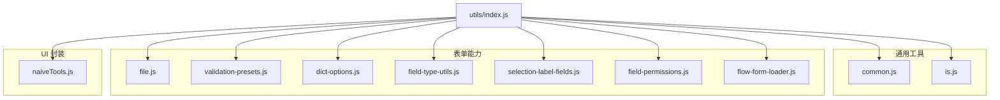
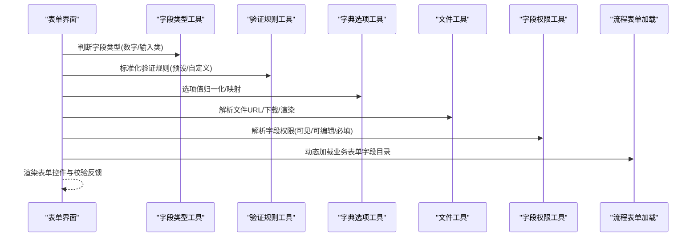
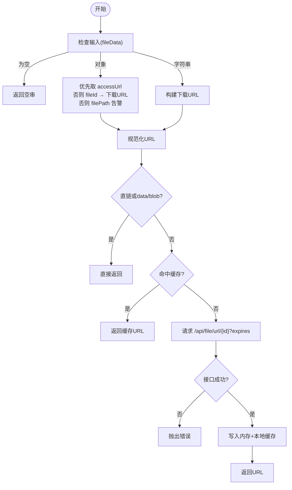
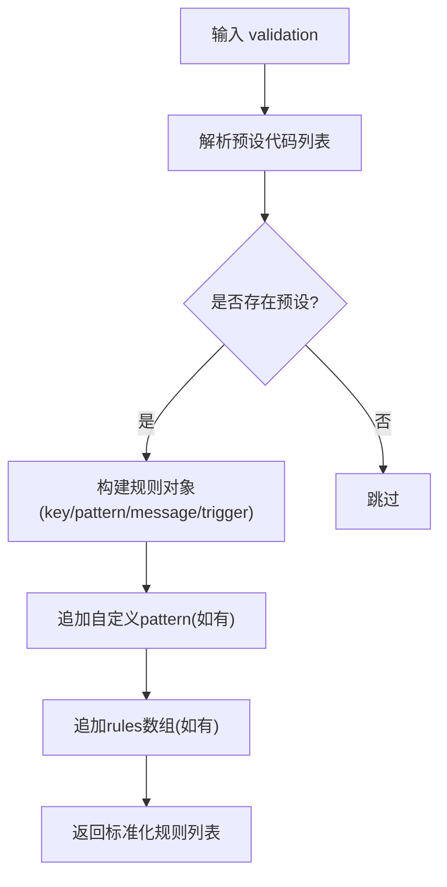
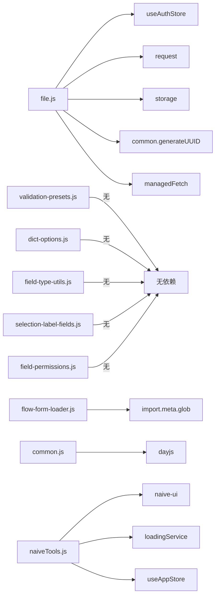

# 表单工具函数

<cite>
**本文引用的文件**
- [file.js](file://forge-admin-ui/src/utils/file.js)
- [validation-presets.js](file://forge-admin-ui/src/utils/validation-presets.js)
- [dict-options.js](file://forge-admin-ui/src/utils/dict-options.js)
- [field-type-utils.js](file://forge-admin-ui/src/components/ai-form/field-type-utils.js)
- [selection-label-fields.js](file://forge-admin-ui/src/components/ai-form/selection-label-fields.js)
- [flow-form-loader.js](file://forge-admin-ui/src/utils/flow-form-loader.js)
- [field-permissions.js](file://forge-admin-ui/src/utils/field-permissions.js)
- [common.js](file://forge-admin-ui/src/utils/common.js)
- [is.js](file://forge-admin-ui/src/utils/is.js)
- [naiveTools.js](file://forge-admin-ui/src/utils/naiveTools.js)
- [index.js](file://forge-admin-ui/src/utils/index.js)
</cite>

## 目录
1. [简介](#简介)
2. [项目结构](#项目结构)
3. [核心组件](#核心组件)
4. [架构总览](#架构总览)
5. [详细组件分析](#详细组件分析)
6. [依赖关系分析](#依赖关系分析)
7. [性能考虑](#性能考虑)
8. [故障排查指南](#故障排查指南)
9. [结论](#结论)
10. [附录](#附录)

## 简介
本技术文档聚焦于前端表单工具函数，覆盖字段类型检测与转换、文件渲染与下载、数据导入导出、记录选择器配置解析、表单验证规则标准化、权限控制等关键能力。文档从系统架构、数据流、处理逻辑、错误处理、性能优化、兼容性处理到扩展指南进行系统化说明，帮助读者快速理解并正确使用这些工具函数，同时提供测试与排障建议。

## 项目结构
表单相关工具主要分布在以下模块：
- 通用工具：时间格式化、节流防抖、UUID、JSON 校验等
- 类型判断：对象、数组、字符串、数字、布尔、日期、Promise、元素、窗口等
- 文件工具：文件访问 URL 解析、缓存、下载、图片预览、直链识别
- 表单验证：内置正则预设、规则标准化、模式编译
- 字典选项：数值化、布尔化、值映射、值归一化
- 字段类型：数字输入类型判定、输入类字段判定
- 选择器标签字段：多来源字段合并、智能候选字段推导
- 流程表单加载：动态加载业务表单字段目录
- 字段权限：多源权限解析、可见/可编辑/必填计算、别名映射
- UI 交互封装：消息、对话框、全局 Loading、复制、水印、图片预览等

图表来源
- [index.js:1-15](file://forge-admin-ui/src/utils/index.js#L1-L15)

章节来源
- [index.js:1-15](file://forge-admin-ui/src/utils/index.js#L1-L15)

## 核心组件
- 文件工具（file.js）
  - 统一文件访问 URL 构建与规范化
  - 内存+本地存储的临时访问地址缓存
  - 内部文件通过 fetch 获取 Blob 后生成可渲染 URL
  - 下载流程兼容直链与后端接口，自动解析文件名
  - 图片缩略图参数拼接
- 表单验证（validation-presets.js）
  - 内置常用正则预设（手机号、邮箱、身份证、银行卡、固话、统一社会信用代码、整数、非负数、网址）
  - 将预设或自定义规则标准化为统一结构
  - 支持字符串正则编译为 RegExp 并容错
- 字典选项（dict-options.js）
  - 数值化、布尔化、值映射、值归一化
  - 空值安全处理
- 字段类型（field-type-utils.js）
  - 数字输入类型判定（兼容历史写法）
  - 输入类字段判定（文本/数字输入）
- 选择器标签字段（selection-label-fields.js）
  - 多来源字段合并与去重
  - 基于字段名后缀的智能候选字段推导（用户、组织等）
- 流程表单加载（flow-form-loader.js）
  - 动态加载业务表单模块并提取字段目录
  - 字段目录标准化（字段名、标签、分组、组件类型、数据类型、是否必填、来源）
- 字段权限（field-permissions.js）
  - 多源权限解析（数组、对象、字符串 JSON）
  - 可见/可编辑/必填计算，读写联动
  - 字段名别名映射（蛇形/驼峰）
- 通用工具（common.js, is.js）
  - 时间格式化、节流/防抖、sleep、ResizeObserver 监听、JSON 可解析判断、UUID
  - 类型判断集合（对象、数组、字符串、数字、布尔、日期、Promise、元素、窗口、URL、外部链接、服务端/客户端）
- UI 封装（naiveTools.js）
  - 消息、对话框、通知、进度条、全局 Loading、复制、水印、图片预览的统一入口

章节来源
- [file.js:1-360](file://forge-admin-ui/src/utils/file.js#L1-L360)
- [validation-presets.js:1-115](file://forge-admin-ui/src/utils/validation-presets.js#L1-L115)
- [dict-options.js:1-38](file://forge-admin-ui/src/utils/dict-options.js#L1-L38)
- [field-type-utils.js:1-33](file://forge-admin-ui/src/components/ai-form/field-type-utils.js#L1-L33)
- [selection-label-fields.js:1-43](file://forge-admin-ui/src/components/ai-form/selection-label-fields.js#L1-L43)
- [flow-form-loader.js:1-78](file://forge-admin-ui/src/utils/flow-form-loader.js#L1-L78)
- [field-permissions.js:1-146](file://forge-admin-ui/src/utils/field-permissions.js#L1-L146)
- [common.js:1-117](file://forge-admin-ui/src/utils/common.js#L1-L117)
- [is.js:1-119](file://forge-admin-ui/src/utils/is.js#L1-L119)
- [naiveTools.js:1-156](file://forge-admin-ui/src/utils/naiveTools.js#L1-L156)

## 架构总览
表单工具以“输入→标准化→输出”为主线，贯穿类型检测、文件处理、验证规则、权限控制与运行时加载。下图展示典型的数据流与调用关系。

图表来源
- [field-type-utils.js:1-33](file://forge-admin-ui/src/components/ai-form/field-type-utils.js#L1-L33)
- [validation-presets.js:1-115](file://forge-admin-ui/src/utils/validation-presets.js#L1-L115)
- [dict-options.js:1-38](file://forge-admin-ui/src/utils/dict-options.js#L1-L38)
- [file.js:1-360](file://forge-admin-ui/src/utils/file.js#L1-L360)
- [field-permissions.js:1-146](file://forge-admin-ui/src/utils/field-permissions.js#L1-L146)
- [flow-form-loader.js:1-78](file://forge-admin-ui/src/utils/flow-form-loader.js#L1-L78)

## 详细组件分析

### 文件工具（file.js）
- 功能要点
  - 统一构建文件访问 URL：支持 fileId、filePath、accessUrl、直链、data/blob、内部接口路径
  - 规范化 URL：根据请求前缀补齐相对路径，确保浏览器可直接渲染
  - 缓存策略：内存 Map + 本地存储，带过期时间；支持强制刷新
  - 渲染 URL：内部文件通过 fetch 获取 Blob 并转为 blob URL，避免跨域与鉴权问题
  - 下载：直链直接触发下载；内部接口下载时解析 Content-Disposition 文件名
  - 图片预览：支持 width/height/mode 参数拼接
- 关键 API
  - getFileUrl(fileData)
  - getFileDownloadUrl(fileId)
  - getCachedFileAccessUrl(fileId)
  - removeCachedFileAccessUrl(fileId)
  - resolveFileAccessUrl(fileData, expires, forceRefresh)
  - resolveRenderableFileUrl(fileData, expires, forceRefresh)
  - downloadFile(fileData, filename, expires, forceRefresh)
  - getImageUrl(filePath, options)
- 错误处理
  - 无 fileId/accessUrl 返回空串
  - 接口失败抛错（包含 msg/message）
  - 下载失败抛出错误信息
- 性能优化
  - 两级缓存减少重复请求
  - 清理过期缓存项
  - 使用 managedFetch 控制全局加载提示
- 兼容性
  - 兼容 http/https/data/blob 直链
  - 兼容 /api/file/ 前后缀（含请求前缀）

图表来源
- [file.js:84-132](file://forge-admin-ui/src/utils/file.js#L84-L132)
- [file.js:170-244](file://forge-admin-ui/src/utils/file.js#L170-L244)

章节来源
- [file.js:1-360](file://forge-admin-ui/src/utils/file.js#L1-L360)

### 表单验证规则（validation-presets.js）
- 功能要点
  - 内置常见格式的正则预设（手机号、邮箱、身份证、银行卡、固话、统一社会信用代码、整数、非负数、网址）
  - 将预设或自定义规则标准化为统一结构（key/pattern/message/trigger）
  - 支持字符串正则编译为 RegExp，异常时丢弃该规则
  - 支持多种预设键名兼容（presetCodes/presets/preset/presetCode/commonRule）
- 关键 API
  - getValidationPreset(value)
  - buildValidationRuleFromPreset(value, patch)
  - normalizeValidationRules(validation)
  - normalizeRulePattern(rule)
- 使用场景
  - 表单字段校验规则配置
  - 设计器中可视化配置验证规则
- 错误处理
  - 正则编译失败时忽略该规则，避免阻断表单初始化

图表来源
- [validation-presets.js:58-94](file://forge-admin-ui/src/utils/validation-presets.js#L58-L94)
- [validation-presets.js:96-107](file://forge-admin-ui/src/utils/validation-presets.js#L96-L107)

章节来源
- [validation-presets.js:1-115](file://forge-admin-ui/src/utils/validation-presets.js#L1-L115)

### 字典选项（dict-options.js）
- 功能要点
  - toNumberDictOptions：将选项 value 转换为 Number
  - toBooleanDictOptions：将选项 value 转换为 Boolean（兼容 '1'/'true'）
  - mapDictOptionValues：按映射表替换 value
  - normalizeDictOptionValue：在选项中查找匹配值，不存在返回 fallback
- 关键 API
  - toNumberDictOptions(options)
  - toBooleanDictOptions(options)
  - mapDictOptionValues(options, valueMap)
  - normalizeDictOptionValue(options, value, fallback)
- 使用场景
  - 下拉框、单选、复选等选项的值类型统一
  - 表单提交前对选项值做归一化处理

章节来源
- [dict-options.js:1-38](file://forge-admin-ui/src/utils/dict-options.js#L1-L38)

### 字段类型工具（field-type-utils.js）
- 功能要点
  - isNumberFieldType：判断是否为数字输入类型（兼容 number/inputnumber/input-number/integer/money）
  - isInputLikeFieldType：判断是否为输入类字段（input/textarea/数字输入）
- 关键 API
  - isNumberFieldType(type)
  - isInputLikeFieldType(type)
- 使用场景
  - 表单渲染时决定控件行为（如数字键盘、输入限制）
  - 事件处理与校验策略区分

章节来源
- [field-type-utils.js:1-33](file://forge-admin-ui/src/components/ai-form/field-type-utils.js#L1-L33)

### 选择器标签字段（selection-label-fields.js）
- 功能要点
  - 多来源字段合并：props.referenceDisplayField、displayField、labelField、targetLabelField 等
  - 智能候选字段推导：基于字段名后缀（UserId/DeptId/OrgId/Id）推导 Name/UserName/DeptName/OrgName 等
  - 特定选择类型补充：user/org 类型附加常用字段
  - 去重与过滤空值
- 关键 API
  - resolveSelectionLabelFields(field, selectionType)
- 使用场景
  - 记录选择器、关联选择器等显示名称字段的自动推导
  - 降低配置复杂度，提升用户体验

章节来源
- [selection-label-fields.js:1-43](file://forge-admin-ui/src/components/ai-form/selection-label-fields.js#L1-L43)

### 流程表单加载（flow-form-loader.js）
- 功能要点
  - 动态加载业务表单模块（Vue 文件），提取 flowFieldCatalog
  - 字段目录标准化：字段名、标签、分组、组件类型、数据类型、是否必填、来源
  - 模块加载缓存：同一 URL 仅加载一次
  - 路径规范化：去除查询参数、补全前导斜杠、大小写不敏感匹配
- 关键 API
  - loadFlowBusinessFormFieldCatalog(formUrl)
  - normalizeFlowFieldCatalog(catalog)
- 使用场景
  - 流程表单运行时动态注入字段目录
  - 设计器/运行期共享字段元数据

章节来源
- [flow-form-loader.js:1-78](file://forge-admin-ui/src/utils/flow-form-loader.js#L1-L78)

### 字段权限（field-permissions.js）
- 功能要点
  - 多源权限解析：支持数组、对象、字符串 JSON；兼容 formFieldPermissions/fieldPermissions/fields 等键
  - 可见/可编辑/必填计算：readable/writable/readOnly 联动；required 仅在 writable 时生效
  - 字段名别名映射：snake_case/camelCase 互转，提高兼容性
  - 布尔值解析：支持 true/false/1/0/yes/no/y/n 等
- 关键 API
  - normalizeFieldPermissions(source, options)
  - createFieldPermissionMap(source, options)
  - pickFirstNonEmptyFieldPermissions(sources, options)
- 使用场景
  - 表单字段级权限控制（只读、隐藏、必填）
  - 多来源权限合并与优先级选择

章节来源
- [field-permissions.js:1-146](file://forge-admin-ui/src/utils/field-permissions.js#L1-L146)

### 通用工具（common.js, is.js）
- common.js
  - formatDateTime/formatDate：时间格式化
  - throttle/debounce：节流/防抖
  - sleep：异步等待
  - useResize：ResizeObserver 封装
  - canParseToJson：JSON 可解析判断
  - generateUUID：唯一标识生成
- is.js
  - 类型判断集合：is/isDef/isUndef/isNull/isWhitespace/isObject/isArray/isString/isNumber/isBoolean/isDate/isRegExp/isFunction/isPromise/isElement/isWindow/isNullOrUndef/isNullOrWhitespace/isEmpty/ifNull/isUrl/isExternal/isServer/isClient
- 使用场景
  - 表单输入处理、事件优化、环境判断、数据清洗

章节来源
- [common.js:1-117](file://forge-admin-ui/src/utils/common.js#L1-L117)
- [is.js:1-119](file://forge-admin-ui/src/utils/is.js#L1-L119)

### UI 封装（naiveTools.js）
- 功能要点
  - setupMessage：消息单例、支持 key 复用与定时销毁
  - setupDialog：统一确认对话框默认文案与回调
  - setupNaiveDiscreteApi：创建离散 API 并挂载到 window（$loadingBar/$notification/$message/$dialog/$loading/$copy/$imagePreview/$watermark）
  - setupLoading：全屏 Loading 服务封装
- 使用场景
  - 统一用户反馈与全局加载体验
  - 简化表单操作中的交互提示

章节来源
- [naiveTools.js:1-156](file://forge-admin-ui/src/utils/naiveTools.js#L1-L156)

## 依赖关系分析
- 文件工具依赖
  - 认证状态：useAuthStore（用于 Authorization 头）
  - HTTP 请求：request（获取临时访问地址）
  - 存储：getLocalStorage/setLocalStorage（持久化缓存）
  - 通用：generateUUID（nonce）、managedFetch（下载进度）
- 验证规则依赖
  - 无外部依赖，纯函数式
- 字典选项依赖
  - 无外部依赖，纯函数式
- 字段类型依赖
  - 无外部依赖，纯函数式
- 选择器标签字段依赖
  - 无外部依赖，纯函数式
- 流程表单加载依赖
  - 模块懒加载：import.meta.glob（视图模块）
  - 缓存：modulePromiseCache
- 字段权限依赖
  - 无外部依赖，纯函数式
- 通用工具依赖
  - dayjs（时间格式化）
- UI 封装依赖
  - naive-ui（消息/对话框/通知/进度条）
  - 指令 loadingService（全屏加载）
  - 应用状态：useAppStore（主题）
  - 工具：clipboard/imagePreview/watermark

图表来源
- [file.js:5-9](file://forge-admin-ui/src/utils/file.js#L5-L9)
- [flow-form-loader.js:1-2](file://forge-admin-ui/src/utils/flow-form-loader.js#L1-L2)
- [common.js:1-1](file://forge-admin-ui/src/utils/common.js#L1-L1)
- [naiveTools.js:1-7](file://forge-admin-ui/src/utils/naiveTools.js#L1-L7)

章节来源
- [file.js:1-360](file://forge-admin-ui/src/utils/file.js#L1-L360)
- [flow-form-loader.js:1-78](file://forge-admin-ui/src/utils/flow-form-loader.js#L1-L78)
- [common.js:1-117](file://forge-admin-ui/src/utils/common.js#L1-L117)
- [naiveTools.js:1-156](file://forge-admin-ui/src/utils/naiveTools.js#L1-L156)

## 性能考虑
- 文件访问 URL 缓存
  - 内存 Map 与本地存储双级缓存，减少重复请求
  - 过期时间管理，定期清理无效条目
- 大文件下载
  - 使用 fetch + Blob，避免一次性加载到内存过大
  - 通过 managedFetch 控制全局加载提示，提升用户体验
- 表单验证
  - 正则预编译为 RegExp，避免重复构造
  - 规则标准化减少运行时分支判断
- 字段权限
  - 多源解析一次性完成，生成 Map 便于 O(1) 查找
- 模块加载
  - 动态加载并缓存模块 Promise，避免重复加载
- 通用优化
  - 节流/防抖减少高频事件开销
  - ResizeObserver 精确监听尺寸变化，避免频繁计算

[本节为通用性能指导，无需具体文件引用]

## 故障排查指南
- 文件无法渲染
  - 检查是否直链或 data/blob；内部接口需通过 resolveRenderableFileUrl 获取 blob URL
  - 检查请求前缀是否正确，normalizeFileAccessUrl 会补齐相对路径
  - 查看缓存是否过期，必要时使用 forceRefresh 强制刷新
- 下载失败
  - 检查接口返回码与响应体；downloadFile 会抛出错误信息
  - 检查 Content-Disposition 是否包含文件名
- 验证规则不生效
  - 检查 presetCodes/presets/preset/presetCode/commonRule 是否正确传入
  - 检查 pattern 是否为合法正则；非法将被忽略
- 字段权限未生效
  - 检查 source 结构是否包含 formFieldPermissions/fieldPermissions/fields
  - 检查 readOnly 选项是否影响 writable 计算
- 流程表单字段目录为空
  - 检查 formUrl 是否规范（去除查询参数、补全前导斜杠）
  - 检查模块是否导出 flowFieldCatalog 或组件上存在对应属性

章节来源
- [file.js:194-244](file://forge-admin-ui/src/utils/file.js#L194-L244)
- [file.js:307-331](file://forge-admin-ui/src/utils/file.js#L307-L331)
- [validation-presets.js:75-107](file://forge-admin-ui/src/utils/validation-presets.js#L75-L107)
- [field-permissions.js:1-46](file://forge-admin-ui/src/utils/field-permissions.js#L1-L46)
- [flow-form-loader.js:37-78](file://forge-admin-ui/src/utils/flow-form-loader.js#L37-L78)

## 结论
本套表单工具函数围绕“类型、文件、验证、权限、加载”五大维度提供了完整的前端支撑能力。通过统一的 API 与严格的错误处理，既保证了易用性，又兼顾了性能与兼容性。建议在表单开发中优先采用这些工具函数，以获得一致的行为与更好的维护性。

[本节为总结性内容，无需具体文件引用]

## 附录
- 扩展指南
  - 新增验证预设：在 COMMON_VALIDATION_PRESETS 中添加新条目，并提供 message
  - 新增字段类型：在 NUMBER_FIELD_TYPES 中补充兼容类型
  - 新增选择器字段推导：在 resolveSelectionLabelFields 中增加候选字段规则
  - 新增权限字段别名：在 permissionFieldAliases 中扩展映射
- 自定义工具开发方法
  - 保持纯函数风格，避免副作用
  - 提供明确的输入输出契约与错误处理
  - 编写单元测试覆盖边界情况（空值、非法输入、异常路径）
  - 在 utils/index.js 中统一导出，便于全局使用

[本节为通用指导，无需具体文件引用]