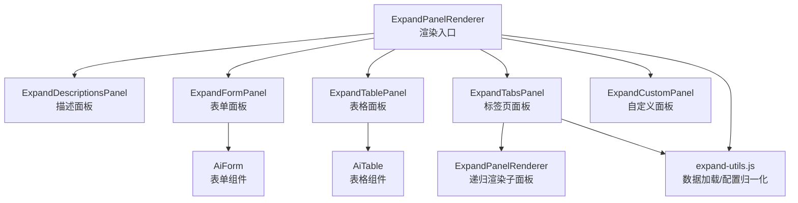
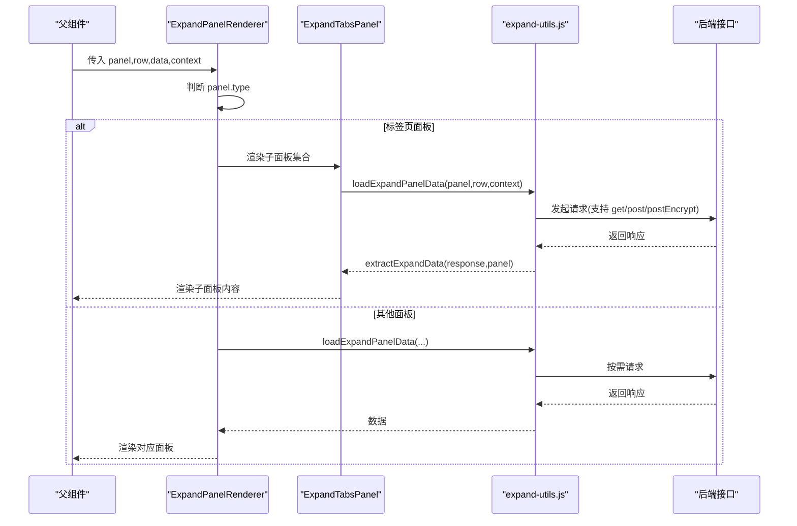
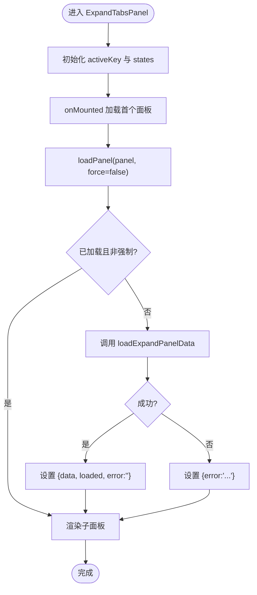
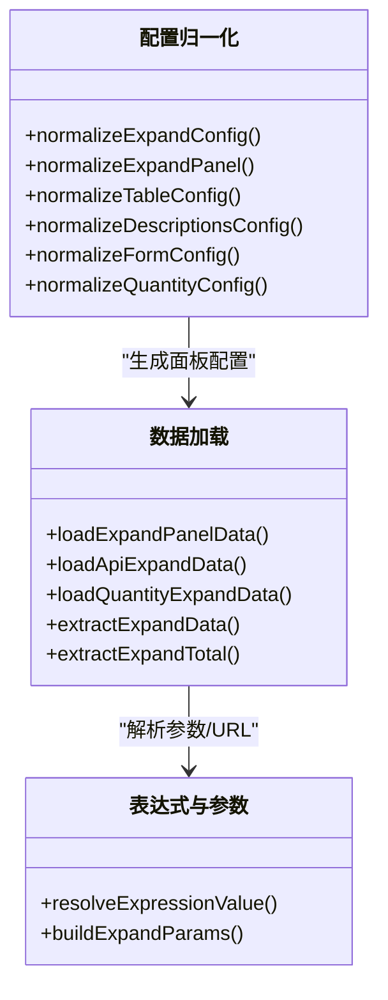
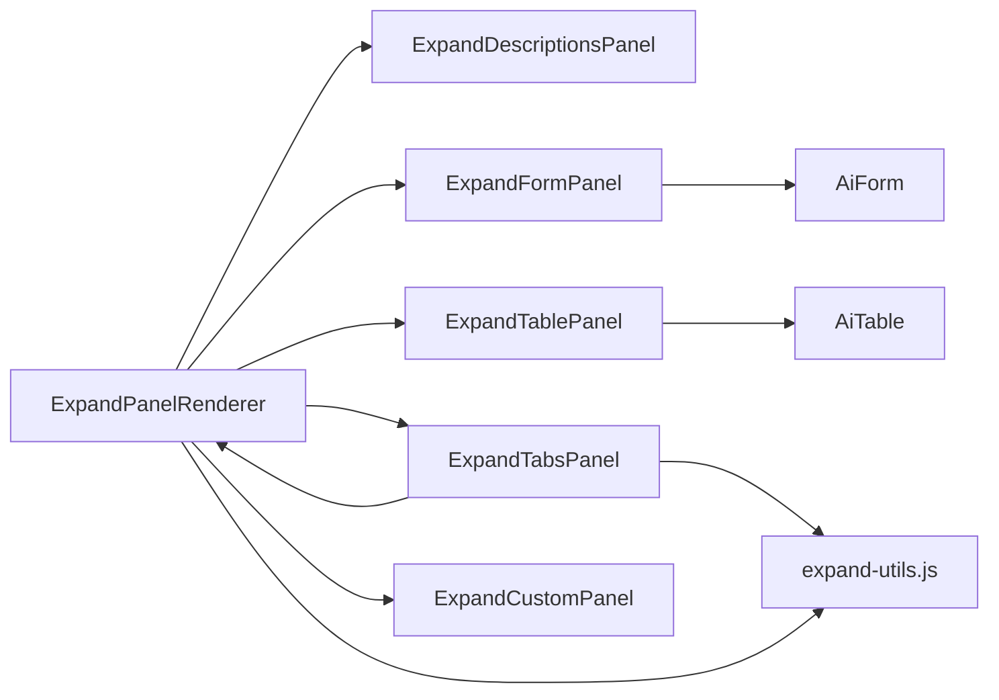

# 表单扩展面板

<cite>
**本文引用的文件**
- [ExpandPanelRenderer.vue](file://forge-admin-ui/src/components/ai-form/ExpandPanelRenderer.vue)
- [ExpandDescriptionsPanel.vue](file://forge-admin-ui/src/components/ai-form/expand-renderers/ExpandDescriptionsPanel.vue)
- [ExpandFormPanel.vue](file://forge-admin-ui/src/components/ai-form/expand-renderers/ExpandFormPanel.vue)
- [ExpandTablePanel.vue](file://forge-admin-ui/src/components/ai-form/expand-renderers/ExpandTablePanel.vue)
- [ExpandTabsPanel.vue](file://forge-admin-ui/src/components/ai-form/expand-renderers/ExpandTabsPanel.vue)
- [ExpandCustomPanel.vue](file://forge-admin-ui/src/components/ai-form/expand-renderers/ExpandCustomPanel.vue)
- [expand-utils.js](file://forge-admin-ui/src/components/ai-form/expand-utils.js)
- [AiForm.vue](file://forge-admin-ui/src/components/ai-form/AiForm.vue)
- [AiTable.vue](file://forge-admin-ui/src/components/ai-form/AiTable.vue)
</cite>

## 目录
1. [简介](#简介)
2. [项目结构](#项目结构)
3. [核心组件](#核心组件)
4. [架构总览](#架构总览)
5. [详细组件分析](#详细组件分析)
6. [依赖关系分析](#依赖关系分析)
7. [性能考虑](#性能考虑)
8. [故障排查指南](#故障排查指南)
9. [结论](#结论)
10. [附录](#附录)

## 简介
本技术文档聚焦于“表单扩展面板”系统，围绕展开面板的架构设计、渲染机制与扩展点进行深入解析。系统支持多种面板类型：描述面板、表单面板、表格面板、标签页面板以及自定义面板，并提供统一的数据加载、状态管理与错误处理机制。文档同时给出自定义面板开发指南、样式定制建议、性能优化策略与调试排错方法，帮助开发者快速集成与扩展。

## 项目结构
扩展面板位于 ai-form 模块下，采用“渲染器 + 工具函数”的分层组织方式：
- 渲染入口：根据面板类型分发到对应渲染器
- 渲染器：每种面板类型一个独立组件，负责 UI 呈现与局部交互
- 工具函数：统一配置归一化、数据源解析、API/数量查询、表达式求值等

图表来源
- [ExpandPanelRenderer.vue:1-78](file://forge-admin-ui/src/components/ai-form/ExpandPanelRenderer.vue#L1-L78)
- [ExpandDescriptionsPanel.vue:1-75](file://forge-admin-ui/src/components/ai-form/expand-renderers/ExpandDescriptionsPanel.vue#L1-L75)
- [ExpandFormPanel.vue:1-45](file://forge-admin-ui/src/components/ai-form/expand-renderers/ExpandFormPanel.vue#L1-L45)
- [ExpandTablePanel.vue:1-51](file://forge-admin-ui/src/components/ai-form/expand-renderers/ExpandTablePanel.vue#L1-L51)
- [ExpandTabsPanel.vue:1-123](file://forge-admin-ui/src/components/ai-form/expand-renderers/ExpandTabsPanel.vue#L1-L123)
- [ExpandCustomPanel.vue:1-33](file://forge-admin-ui/src/components/ai-form/expand-renderers/ExpandCustomPanel.vue#L1-L33)
- [expand-utils.js:1-349](file://forge-admin-ui/src/components/ai-form/expand-utils.js#L1-L349)
- [AiTable.vue](file://forge-admin-ui/src/components/ai-form/AiTable.vue)
- [AiForm.vue](file://forge-admin-ui/src/components/ai-form/AiForm.vue)

章节来源
- [ExpandPanelRenderer.vue:1-78](file://forge-admin-ui/src/components/ai-form/ExpandPanelRenderer.vue#L1-L78)
- [expand-utils.js:13-40](file://forge-admin-ui/src/components/ai-form/expand-utils.js#L13-L40)

## 核心组件
- 渲染入口 ExpandPanelRenderer：根据 panel.type 选择具体渲染器；对 table 类面板（含 quantity-balance/quantity-ledger/quantity-lock）进行识别并走表格渲染路径；提供兜底描述面板。
- 描述面板 ExpandDescriptionsPanel：基于 n-descriptions 展示字段值，支持字典标签、Tag、图片上传预览等渲染类型。
- 表单面板 ExpandFormPanel：复用 AiForm 以只读模式渲染表单 schema，禁用编辑能力。
- 表格面板 ExpandTablePanel：封装 AiTable，支持列定义、分页、行键、边框、斑马纹、最大高度、横向滚动等配置。
- 标签页面板 ExpandTabsPanel：管理多个子面板的懒加载、缓存、错误重试与状态隔离，内部递归使用 ExpandPanelRenderer。
- 自定义面板 ExpandCustomPanel：通过 slot 注入自定义内容，slotName 由 panel.slot/slotName/key 推导。

章节来源
- [ExpandPanelRenderer.vue:1-78](file://forge-admin-ui/src/components/ai-form/ExpandPanelRenderer.vue#L1-L78)
- [ExpandDescriptionsPanel.vue:1-75](file://forge-admin-ui/src/components/ai-form/expand-renderers/ExpandDescriptionsPanel.vue#L1-L75)
- [ExpandFormPanel.vue:1-45](file://forge-admin-ui/src/components/ai-form/expand-renderers/ExpandFormPanel.vue#L1-L45)
- [ExpandTablePanel.vue:1-51](file://forge-admin-ui/src/components/ai-form/expand-renderers/ExpandTablePanel.vue#L1-L51)
- [ExpandTabsPanel.vue:1-123](file://forge-admin-ui/src/components/ai-form/expand-renderers/ExpandTabsPanel.vue#L1-L123)
- [ExpandCustomPanel.vue:1-33](file://forge-admin-ui/src/components/ai-form/expand-renderers/ExpandCustomPanel.vue#L1-L33)

## 架构总览
扩展面板采用“配置驱动 + 渲染器分发”的架构：
- 配置归一化：normalizeExpandConfig 将原始配置标准化为统一的 panels 列表与布局信息，自动推断单/多面板布局模式。
- 数据源抽象：dataSource 支持 row/static/api/quantity 等多种类型，统一通过 loadExpandPanelData 获取数据。
- 表达式与参数构建：buildExpandParams/resolveExpressionValue 支持模板字符串与对象路径访问，用于动态构造请求参数与 URL。
- 响应提取：extractExpandData/extractExpandTotal 兼容不同后端返回结构，抽取列表与总数。
- 数量业务面板：针对 quantity-balance/quantity-ledger/quantity-lock 提供专用查询与默认列定义。

图表来源
- [ExpandPanelRenderer.vue:1-78](file://forge-admin-ui/src/components/ai-form/ExpandPanelRenderer.vue#L1-L78)
- [ExpandTabsPanel.vue:48-115](file://forge-admin-ui/src/components/ai-form/expand-renderers/ExpandTabsPanel.vue#L48-L115)
- [expand-utils.js:241-319](file://forge-admin-ui/src/components/ai-form/expand-utils.js#L241-L319)

## 详细组件分析

### 渲染入口：ExpandPanelRenderer
- 职责：按 panel.type 分发到具体渲染器；识别 table-like 面板；提供 fallback 描述面板。
- 关键逻辑：
  - isTableLikePanel：包含 table、quantity-balance、quantity-ledger、quantity-lock。
  - fallbackPanel：当未匹配到已知类型时，回退到 descriptions 面板，确保可渲染。
- 扩展点：新增面板类型只需在条件分支中注册，并在 expand-utils 中补充配置归一化与数据加载逻辑。

章节来源
- [ExpandPanelRenderer.vue:1-78](file://forge-admin-ui/src/components/ai-form/ExpandPanelRenderer.vue#L1-L78)

### 描述面板：ExpandDescriptionsPanel
- 职责：以 n-descriptions 形式展示字段值，支持列数、标签位置等配置。
- 渲染能力：
  - 字典标签：render.type === 'dictTag'
  - Tag：render.type === 'tag'
  - 图片上传：render.type === 'imageUpload'，支持多图展示
- 数据来源：优先使用 data，否则回退到 row。

章节来源
- [ExpandDescriptionsPanel.vue:1-75](file://forge-admin-ui/src/components/ai-form/expand-renderers/ExpandDescriptionsPanel.vue#L1-L75)

### 表单面板：ExpandFormPanel
- 职责：以只读模式渲染表单 schema，禁用编辑与反馈。
- 行为：
  - 将 schema 中的每个字段强制设为 readonly/disabled，并透传 props。
  - 网格列数、标签宽度、对齐方式、尺寸均可配置。

章节来源
- [ExpandFormPanel.vue:1-45](file://forge-admin-ui/src/components/ai-form/expand-renderers/ExpandFormPanel.vue#L1-L45)

### 表格面板：ExpandTablePanel
- 职责：封装 AiTable，提供统一的表格展示能力。
- 配置项：rowKey、pagination、hideSelection、bordered、striped、size、maxHeight、scrollX、showToolbar 等。
- 数据适配：支持直接数组或包含 records/rows/list 的对象结构。

章节来源
- [ExpandTablePanel.vue:1-51](file://forge-admin-ui/src/components/ai-form/expand-renderers/ExpandTablePanel.vue#L1-L51)

### 标签页面板：ExpandTabsPanel
- 职责：管理多个子面板的懒加载、缓存、错误提示与重试。
- 状态模型：每个子面板维护 loading/loaded/data/error 状态，避免重复请求。
- 事件通信：通过 v-model:value 控制激活 tab，并在切换时触发 loadActivePanel。
- 递归渲染：子面板再次交由 ExpandPanelRenderer 处理，形成树形结构。

图表来源
- [ExpandTabsPanel.vue:48-115](file://forge-admin-ui/src/components/ai-form/expand-renderers/ExpandTabsPanel.vue#L48-L115)
- [expand-utils.js:241-319](file://forge-admin-ui/src/components/ai-form/expand-utils.js#L241-L319)

章节来源
- [ExpandTabsPanel.vue:1-123](file://forge-admin-ui/src/components/ai-form/expand-renderers/ExpandTabsPanel.vue#L1-L123)

### 自定义面板：ExpandCustomPanel
- 职责：通过插槽注入自定义内容，slotName 由 panel.slot/slotName/key 推导。
- 使用场景：需要完全自定义 UI 或复杂交互时，可在父级以具名插槽方式注入。

章节来源
- [ExpandCustomPanel.vue:1-33](file://forge-admin-ui/src/components/ai-form/expand-renderers/ExpandCustomPanel.vue#L1-L33)

### 配置与数据加载：expand-utils.js
- 配置归一化：
  - normalizeExpandConfig：统一 enabled、trigger、lazy、cache、defaultExpanded、layout、panels。
  - normalizeExpandPanel：补齐 key、title、dataSource、table/descriptions/form/panels 等。
  - defaultQuantityColumns：为数量相关面板提供默认列定义。
- 数据加载：
  - loadExpandPanelData：根据 dataSource.type 路由到 row/static/api/quantity。
  - loadApiExpandData：支持 GET/POST/POST_ENCRYPT，URL 模板替换与参数映射。
  - extractExpandData/extractExpandTotal：兼容多种响应结构。
- 表达式与参数：
  - resolveExpressionValue：支持字面量、模板字符串、对象路径访问。
  - buildExpandParams：将 paramsMap 中的表达式解析为最终参数。
- 数量面板：
  - loadQuantityExpandData：调用业务接口查询余额/流水/锁定，并提取数据。

图表来源
- [expand-utils.js:13-189](file://forge-admin-ui/src/components/ai-form/expand-utils.js#L13-L189)
- [expand-utils.js:207-349](file://forge-admin-ui/src/components/ai-form/expand-utils.js#L207-L349)

章节来源
- [expand-utils.js:1-349](file://forge-admin-ui/src/components/ai-form/expand-utils.js#L1-L349)

## 依赖关系分析
- 组件耦合：
  - ExpandPanelRenderer 仅依赖各渲染器与工具函数，低耦合高内聚。
  - ExpandTabsPanel 通过异步组件引入 ExpandPanelRenderer，避免循环依赖。
- 外部依赖：
  - AiForm/AiTable 作为基础 UI 组件被表单/表格面板复用。
  - 网络请求通过 request/postEncrypt 与业务 API 交互。
- 潜在风险：
  - 若新增面板类型未在渲染入口注册，将回退到描述面板，需检查面板类型配置。
  - 数据源配置不当可能导致空数据或结构不匹配，建议使用 extractExpandData 的兼容逻辑。

图表来源
- [ExpandPanelRenderer.vue:1-78](file://forge-admin-ui/src/components/ai-form/ExpandPanelRenderer.vue#L1-L78)
- [ExpandTabsPanel.vue:48-115](file://forge-admin-ui/src/components/ai-form/expand-renderers/ExpandTabsPanel.vue#L48-L115)
- [expand-utils.js:1-349](file://forge-admin-ui/src/components/ai-form/expand-utils.js#L1-L349)

章节来源
- [ExpandPanelRenderer.vue:1-78](file://forge-admin-ui/src/components/ai-form/ExpandPanelRenderer.vue#L1-L78)
- [ExpandTabsPanel.vue:1-123](file://forge-admin-ui/src/components/ai-form/expand-renderers/ExpandTabsPanel.vue#L1-L123)
- [expand-utils.js:1-349](file://forge-admin-ui/src/components/ai-form/expand-utils.js#L1-L349)

## 性能考虑
- 懒加载与缓存：
  - 标签页面板默认启用 lazy 与 cache，仅在首次激活时加载数据，后续切换不再重复请求。
  - 可通过配置关闭缓存以强制刷新。
- 表格性能：
  - 合理设置 maxHeight 与 scrollX，避免超大 DOM 渲染。
  - 使用 pagination 减少首屏数据量。
- 网络请求：
  - 使用 postEncrypt 保护敏感参数，减少明文传输风险。
  - 利用 paramsMap 与表达式最小化请求参数。
- 渲染优化：
  - 描述面板的图片列表采用小图尺寸，降低带宽占用。
  - 表单面板以只读模式渲染，避免不必要的交互开销。

[本节为通用性能建议，无需特定文件引用]

## 故障排查指南
- 常见问题与定位：
  - 面板未显示：检查 panel.enabled 与 visible；确认 panel.type 已在渲染入口注册。
  - 数据为空：核对 dataSource.type 与 api/url；验证 extractExpandData 的数据字段映射。
  - 标签页报错：查看 panelState.error，点击“重试”重新加载；检查后端返回结构与接口权限。
  - 自定义面板未生效：确认 slotName 与父级插槽名称一致。
- 调试建议：
  - 在浏览器控制台查看日志输出，尤其是标签页面板的错误堆栈。
  - 使用网络面板检查请求参数与响应体，确认 URL 模板替换是否正确。
  - 临时关闭缓存以复现问题，便于定位数据加载链路。

章节来源
- [ExpandTabsPanel.vue:98-115](file://forge-admin-ui/src/components/ai-form/expand-renderers/ExpandTabsPanel.vue#L98-L115)
- [expand-utils.js:258-319](file://forge-admin-ui/src/components/ai-form/expand-utils.js#L258-L319)

## 结论
表单扩展面板系统通过配置驱动的渲染器分发与统一的数据加载机制，实现了描述、表单、表格、标签页与自定义面板的灵活组合。其清晰的职责划分、可扩展的协议与完善的错误处理，使得开发者能够快速构建复杂的行内展开场景。结合懒加载、缓存与表格优化策略，系统在易用性与性能之间取得了良好平衡。

[本节为总结性内容，无需特定文件引用]

## 附录

### 面板类型与使用场景
- 描述面板：适用于只读概览，如订单详情、审批意见等。
- 表单面板：适用于只读表单展示，如关联对象的详细信息。
- 表格面板：适用于明细列表，如订单行项目、库存流水等。
- 标签页面板：适用于多区域内容聚合，如基本信息+附件+操作日志。
- 自定义面板：适用于特殊业务 UI 或复杂交互。

[本节为概念性说明，无需特定文件引用]

### 自定义面板开发指南
- 步骤：
  - 在父级以具名插槽方式注入自定义内容，slotName 由 panel.slot/slotName/key 推导。
  - 如需数据加载，可在插槽组件内调用 expand-utils 提供的 loadExpandPanelData 或自行发起请求。
  - 遵循现有样式规范，保持与系统一致的视觉体验。
- 注意事项：
  - 避免在插槽中进行重型计算，必要时使用 computed 或防抖。
  - 注意上下文传递（row/context），确保数据一致性。

章节来源
- [ExpandCustomPanel.vue:1-33](file://forge-admin-ui/src/components/ai-form/expand-renderers/ExpandCustomPanel.vue#L1-L33)
- [expand-utils.js:241-319](file://forge-admin-ui/src/components/ai-form/expand-utils.js#L241-L319)

### 面板样式定制
- 描述面板：可通过 CSS 调整 .expand-descriptions-panel 与 .expand-image-list。
- 表格面板：通过 AiTable 的配置项控制边框、斑马纹、尺寸与滚动。
- 表单面板：通过 AiForm 的配置项控制网格列数、标签宽度与对齐方式。
- 标签页面板：通过 n-tabs 的属性与 scoped 样式微调外观。

章节来源
- [ExpandDescriptionsPanel.vue:64-75](file://forge-admin-ui/src/components/ai-form/expand-renderers/ExpandDescriptionsPanel.vue#L64-L75)
- [ExpandTablePanel.vue:46-51](file://forge-admin-ui/src/components/ai-form/expand-renderers/ExpandTablePanel.vue#L46-L51)
- [ExpandFormPanel.vue:40-45](file://forge-admin-ui/src/components/ai-form/expand-renderers/ExpandFormPanel.vue#L40-L45)
- [ExpandTabsPanel.vue:118-123](file://forge-admin-ui/src/components/ai-form/expand-renderers/ExpandTabsPanel.vue#L118-L123)

### 数据共享与事件通信
- 数据共享：
  - 通过 props 传递 row/data/context，子面板读取后本地缓存。
  - 标签页面板为每个子面板维护独立 state，避免相互干扰。
- 事件通信：
  - 标签页通过 v-model:value 同步激活态。
  - 自定义面板可通过插槽暴露回调，供父级监听与处理。

章节来源
- [ExpandTabsPanel.vue:48-115](file://forge-admin-ui/src/components/ai-form/expand-renderers/ExpandTabsPanel.vue#L48-L115)
- [ExpandCustomPanel.vue:1-33](file://forge-admin-ui/src/components/ai-form/expand-renderers/ExpandCustomPanel.vue#L1-L33)

### 配置参考（节选）
- 面板配置关键字段：
  - type：面板类型（descriptions/form/table/tabs/custom）
  - key：唯一标识，用于状态管理与插槽命名
  - title：面板标题
  - dataSource：数据源配置（type/paramsMap/api/url）
  - table/descriptions/form：各自的面板配置对象
  - panels：标签页的子面板数组
- 布局与行为：
  - layout.mode：single/tabs
  - lazy/cache/defaultExpanded：懒加载、缓存、默认展开

章节来源
- [expand-utils.js:13-40](file://forge-admin-ui/src/components/ai-form/expand-utils.js#L13-L40)
- [expand-utils.js:86-109](file://forge-admin-ui/src/components/ai-form/expand-utils.js#L86-L109)
- [expand-utils.js:159-175](file://forge-admin-ui/src/components/ai-form/expand-utils.js#L159-L175)