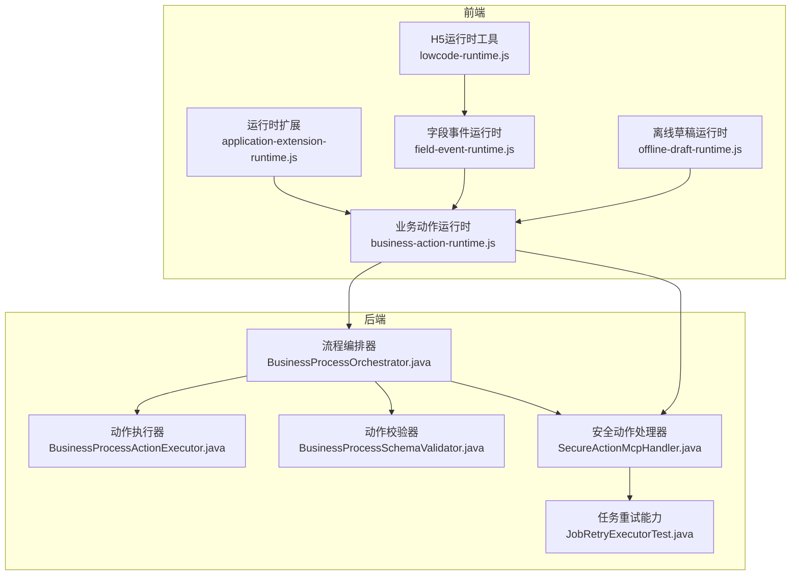
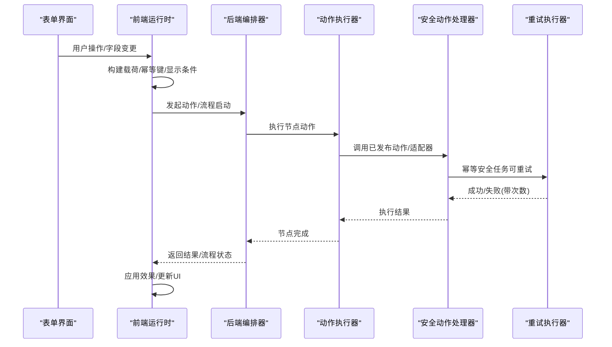
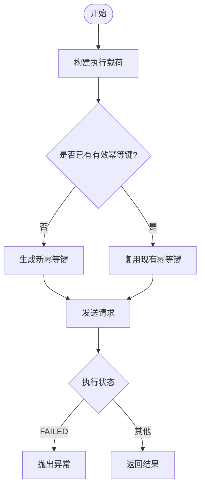
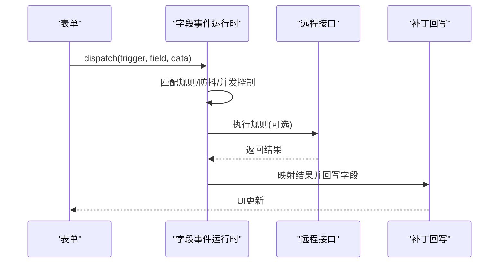
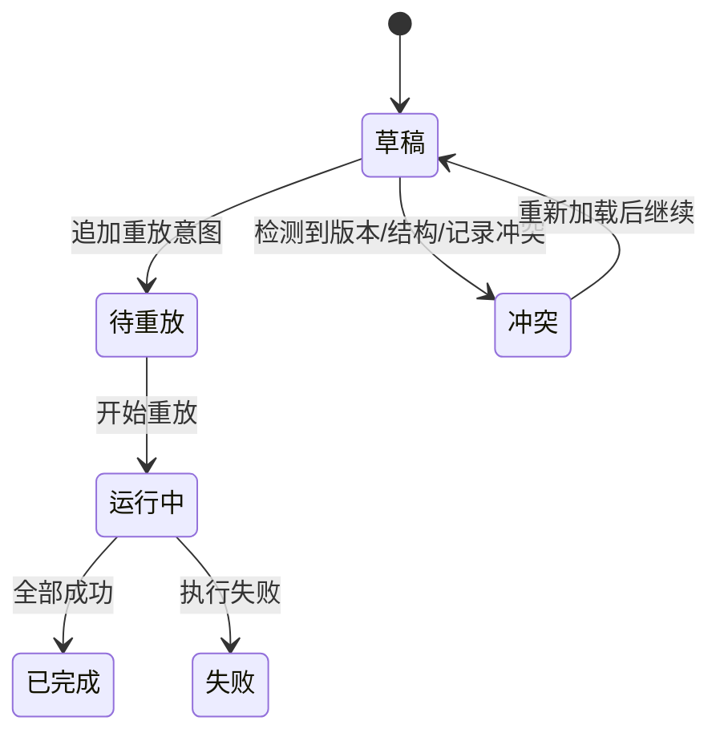
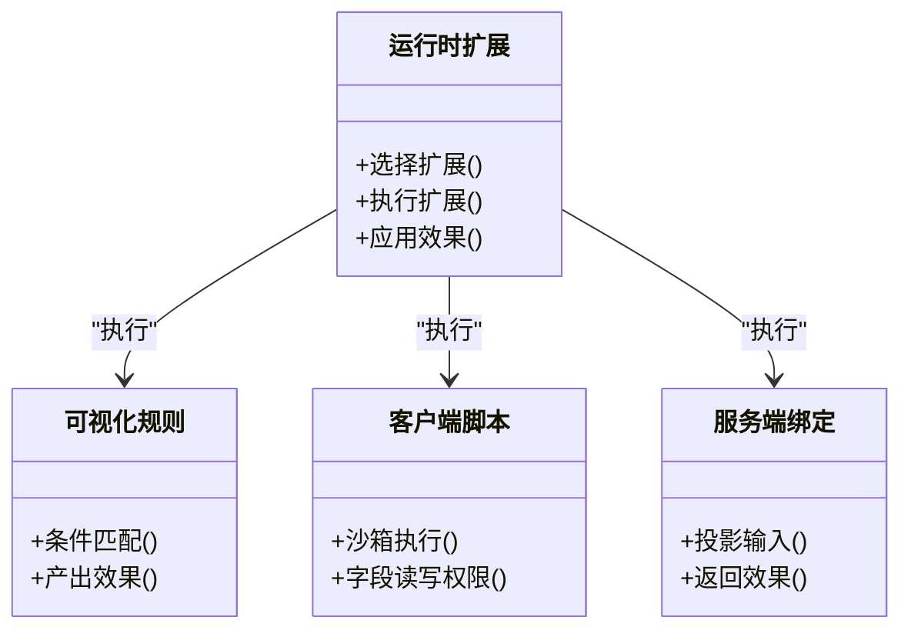
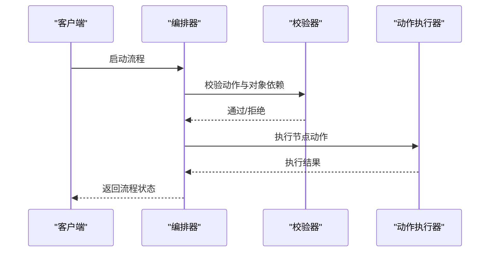
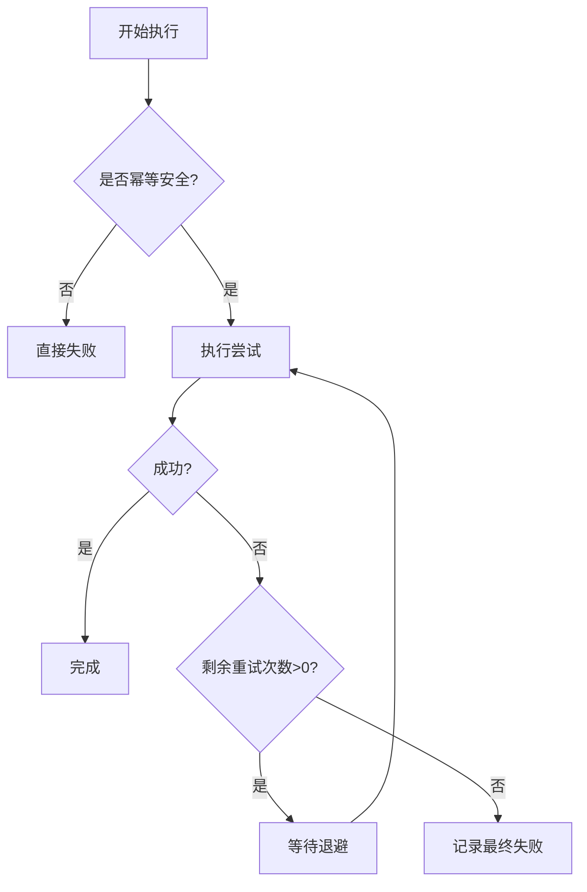
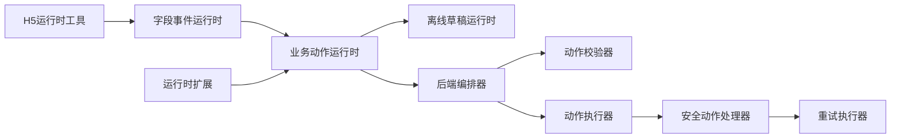

# 表单运行时引擎

<cite>
**本文引用的文件**
- [business-action-runtime.js](file://forge-admin-ui/src/components/ai-form/business-action-runtime.js)
- [offline-draft-runtime.js](file://forge-admin-ui/src/utils/offline-draft-runtime.js)
- [application-extension-runtime.js](file://forge-admin-ui/src/components/lowcode-extension/runtime/application-extension-runtime.js)
- [BusinessProcessOrchestrator.java](file://forge-server/forge-framework/forge-plugin-parent/forge-plugin-generator/src/main/java/com/mdframe/forge/plugin/generator/service/businessprocess/BusinessProcessOrchestrator.java)
- [BusinessProcessActionExecutor.java](file://forge-server/forge-framework/forge-plugin-parent/forge-plugin-generator/src/main/java/com/mdframe/forge/plugin/generator/service/businessprocess/BusinessProcessActionExecutor.java)
- [BusinessProcessSchemaValidator.java](file://forge-server/forge-framework/forge-plugin-parent/forge-plugin-generator/src/main/java/com/mdframe/forge/plugin/generator/businessprocess/validation/BusinessProcessSchemaValidator.java)
- [SecureActionMcpHandler.java](file://forge-server/forge-framework/forge-plugin-parent/forge-plugin-capability-parent/forge-plugin-capability-actions/src/main/java/com/mdframe/forge/plugin/capability/secureaction/mcp/SecureActionMcpHandler.java)
- [JobRetryExecutorTest.java](file://forge-server/forge-framework/forge-plugin-parent/forge-plugin-job/src/test/java/com/mdframe/forge/plugin/job/service/JobRetryExecutorTest.java)
- [lowcode-runtime.js](file://forge-h5-ui/src/utils/lowcode-runtime.js)
- [lowcode-runtime.vue](file://forge-h5-ui/src/pages/lowcode-runtime.vue)
- [field-event-runtime.js](file://forge-admin-ui/src/components/ai-form/field-event-runtime.js)
- [ServerBindingExecutor.java](file://forge-server/forge-framework/forge-plugin-parent/forge-plugin-generator/src/main/java/com/mdframe/forge/plugin/generator/service/businessapp/extension/ServerBindingExecutor.java)
</cite>

## 目录
1. [简介](#简介)
2. [项目结构](#项目结构)
3. [核心组件](#核心组件)
4. [架构总览](#架构总览)
5. [详细组件分析](#详细组件分析)
6. [依赖关系分析](#依赖关系分析)
7. [性能考量](#性能考量)
8. [故障诊断指南](#故障诊断指南)
9. [结论](#结论)
10. [附录](#附录)

## 简介
本技术文档围绕“表单运行时引擎”展开，聚焦以下关键机制：
- 业务动作运行时：前端将用户操作转换为幂等、可追踪的动作执行请求，后端编排并执行。
- 字段事件运行时：基于规则的事件调度、防抖与结果回写，支持主表、子表与运行时区域。
- 离线表单处理：草稿持久化、重放意图管理、冲突检测与重试恢复。
- 事件驱动与异步任务：以钩子和扩展点为核心的可扩展执行模型，配合有限重试与退避策略。
- 状态同步与冲突解决：发布版本、表单结构与记录版本的三方校验，保证一致性。
- 运行时扩展点与自定义处理器：客户端沙箱与服务端绑定处理器，统一效果应用。
- 配置、监控与调试：运行期显示条件计算、公式调试、错误归一化与日志追踪。

## 项目结构
系统由前端运行时与后端编排器共同构成：
- 前端运行时负责：
  - 构建业务动作执行载荷、生成幂等键、解析显示条件。
  - 维护离线草稿、重放意图、冲突检测与本地存储限制。
  - 调度字段事件、防抖执行、结果补丁回写。
  - 选择并执行运行时扩展（可视化规则、客户端脚本、服务端绑定）。
- 后端编排器负责：
  - 启动业务流程、校验动作与对象依赖、执行节点动作。
  - 通过安全动作处理器调用已发布动作或适配器。
  - 提供任务重试能力（受幂等保护）与失败收敛。

**图表来源**
- [business-action-runtime.js:103-145](file://forge-admin-ui/src/components/ai-form/business-action-runtime.js#L103-L145)
- [offline-draft-runtime.js:121-215](file://forge-admin-ui/src/utils/offline-draft-runtime.js#L121-L215)
- [field-event-runtime.js:99-127](file://forge-admin-ui/src/components/ai-form/field-event-runtime.js#L99-L127)
- [application-extension-runtime.js:49-94](file://forge-admin-ui/src/components/lowcode-extension/runtime/application-extension-runtime.js#L49-L94)
- [lowcode-runtime.js:19-90](file://forge-h5-ui/src/utils/lowcode-runtime.js#L19-L90)
- [BusinessProcessOrchestrator.java:115-140](file://forge-server/forge-framework/forge-plugin-parent/forge-plugin-generator/src/main/java/com/mdframe/forge/plugin/generator/service/businessprocess/BusinessProcessOrchestrator.java#L115-L140)
- [BusinessProcessActionExecutor.java:73-98](file://forge-server/forge-framework/forge-plugin-parent/forge-plugin-generator/src/main/java/com/mdframe/forge/plugin/generator/service/businessprocess/BusinessProcessActionExecutor.java#L73-L98)
- [BusinessProcessSchemaValidator.java:606-625](file://forge-server/forge-framework/forge-plugin-parent/forge-plugin-generator/src/main/java/com/mdframe/forge/plugin/generator/businessprocess/validation/BusinessProcessSchemaValidator.java#L606-L625)
- [SecureActionMcpHandler.java:176-198](file://forge-server/forge-framework/forge-plugin-parent/forge-plugin-capability-parent/forge-plugin-capability-actions/src/main/java/com/mdframe/forge/plugin/capability/secureaction/mcp/SecureActionMcpHandler.java#L176-L198)
- [JobRetryExecutorTest.java:41-80](file://forge-server/forge-framework/forge-plugin-parent/forge-plugin-job/src/test/java/com/mdframe/forge/plugin/job/service/JobRetryExecutorTest.java#L41-L80)

**章节来源**
- [business-action-runtime.js:1-405](file://forge-admin-ui/src/components/ai-form/business-action-runtime.js#L1-L405)
- [offline-draft-runtime.js:1-517](file://forge-admin-ui/src/utils/offline-draft-runtime.js#L1-L517)
- [application-extension-runtime.js:1-296](file://forge-admin-ui/src/components/lowcode-extension/runtime/application-extension-runtime.js#L1-L296)
- [BusinessProcessOrchestrator.java:19-140](file://forge-server/forge-framework/forge-plugin-parent/forge-plugin-generator/src/main/java/com/mdframe/forge/plugin/generator/service/businessprocess/BusinessProcessOrchestrator.java#L19-L140)
- [BusinessProcessActionExecutor.java:73-98](file://forge-server/forge-framework/forge-plugin-parent/forge-plugin-generator/src/main/java/com/mdframe/forge/plugin/generator/service/businessprocess/BusinessProcessActionExecutor.java#L73-L98)
- [BusinessProcessSchemaValidator.java:606-625](file://forge-server/forge-framework/forge-plugin-parent/forge-plugin-generator/src/main/java/com/mdframe/forge/plugin/generator/businessprocess/validation/BusinessProcessSchemaValidator.java#L606-L625)
- [SecureActionMcpHandler.java:176-198](file://forge-server/forge-framework/forge-plugin-parent/forge-plugin-capability-parent/forge-plugin-capability-actions/src/main/java/com/mdframe/forge/plugin/capability/secureaction/mcp/SecureActionMcpHandler.java#L176-L198)
- [JobRetryExecutorTest.java:41-80](file://forge-server/forge-framework/forge-plugin-parent/forge-plugin-job/src/test/java/com/mdframe/forge/plugin/job/service/JobRetryExecutorTest.java#L41-L80)

## 核心组件
- 业务动作运行时
  - 职责：构建执行载荷、生成幂等键、解析显示条件、包装父子行上下文、解包执行结果。
  - 关键点：幂等键稳定生成、载荷字段白名单、显示条件表达式解析、结果状态统一。
- 离线表单处理
  - 职责：草稿保存/读取/列表、重放意图追加与去重、冲突检测、重放执行与失败标记、本地存储容量控制。
  - 关键点：发布版本/表单结构/记录版本三方校验；重放状态机；敏感数据清洗。
- 字段事件运行时
  - 职责：按触发器与源字段匹配规则、防抖调度、并发控制器、结果映射与补丁回写。
  - 关键点：CHANGE 防抖、FORM_LOAD 一次性执行、顺序与并行控制、作用域隔离。
- 运行时扩展
  - 职责：按钩子筛选扩展、执行可视化规则/客户端脚本/服务端绑定、应用效果（设置字段、消息、触发动作）。
  - 关键点：作用域过滤、沙箱输入投影、失败策略（阻断/警告）、效果白名单。
- 后端编排器与动作执行
  - 职责：启动流程、校验动作与对象依赖、执行节点动作、回调恢复流程。
  - 关键点：对象代码校验、动作类型约束、动态更新字段、审批回调续跑。
- 安全动作处理器与重试
  - 职责：调用已发布动作或适配器，封装执行结果，支持幂等命中标识。
  - 关键点：同步/异步分支、幂等键透传、执行状态标准化。
  - 重试：有限次数、固定退避、仅对幂等安全任务开启。

**章节来源**
- [business-action-runtime.js:26-154](file://forge-admin-ui/src/components/ai-form/business-action-runtime.js#L26-L154)
- [offline-draft-runtime.js:44-215](file://forge-admin-ui/src/utils/offline-draft-runtime.js#L44-L215)
- [field-event-runtime.js:99-127](file://forge-admin-ui/src/components/ai-form/field-event-runtime.js#L99-L127)
- [application-extension-runtime.js:49-160](file://forge-admin-ui/src/components/lowcode-extension/runtime/application-extension-runtime.js#L49-L160)
- [BusinessProcessOrchestrator.java:115-140](file://forge-server/forge-framework/forge-plugin-parent/forge-plugin-generator/src/main/java/com/mdframe/forge/plugin/generator/service/businessprocess/BusinessProcessOrchestrator.java#L115-L140)
- [BusinessProcessActionExecutor.java:73-98](file://forge-server/forge-framework/forge-plugin-parent/forge-plugin-generator/src/main/java/com/mdframe/forge/plugin/generator/service/businessprocess/BusinessProcessActionExecutor.java#L73-L98)
- [SecureActionMcpHandler.java:176-198](file://forge-server/forge-framework/forge-plugin-parent/forge-plugin-capability-parent/forge-plugin-capability-actions/src/main/java/com/mdframe/forge/plugin/capability/secureaction/mcp/SecureActionMcpHandler.java#L176-L198)
- [JobRetryExecutorTest.java:41-80](file://forge-server/forge-framework/forge-plugin-parent/forge-plugin-job/src/test/java/com/mdframe/forge/plugin/job/service/JobRetryExecutorTest.java#L41-L80)

## 架构总览
表单运行时采用“前端事件驱动 + 后端编排执行”的协同模式：
- 前端捕获用户交互，生成动作或事件，必要时进入离线草稿与重放队列。
- 后端编排器根据流程定义与动作配置，校验并执行节点动作，必要时与外部服务交互。
- 所有跨进程调用均携带幂等键，确保重复提交不产生副作用。
- 扩展点允许在前后端注入自定义逻辑，统一通过效果模型落地。

**图表来源**
- [business-action-runtime.js:115-154](file://forge-admin-ui/src/components/ai-form/business-action-runtime.js#L115-L154)
- [BusinessProcessOrchestrator.java:115-140](file://forge-server/forge-framework/forge-plugin-parent/forge-plugin-generator/src/main/java/com/mdframe/forge/plugin/generator/service/businessprocess/BusinessProcessOrchestrator.java#L115-L140)
- [BusinessProcessActionExecutor.java:73-98](file://forge-server/forge-framework/forge-plugin-parent/forge-plugin-generator/src/main/java/com/mdframe/forge/plugin/generator/service/businessprocess/BusinessProcessActionExecutor.java#L73-L98)
- [SecureActionMcpHandler.java:176-198](file://forge-server/forge-framework/forge-plugin-parent/forge-plugin-capability-parent/forge-plugin-capability-actions/src/main/java/com/mdframe/forge/plugin/capability/secureaction/mcp/SecureActionMcpHandler.java#L176-L198)
- [JobRetryExecutorTest.java:41-80](file://forge-server/forge-framework/forge-plugin-parent/forge-plugin-job/src/test/java/com/mdframe/forge/plugin/job/service/JobRetryExecutorTest.java#L41-L80)

## 详细组件分析

### 业务动作运行时
- 载荷构建：组装 suiteCode、objectCode、recordId、actionCode、formData、context、idempotencyKey，以及父子行关联信息。
- 幂等键策略：优先使用浏览器原生随机ID，回退到时间戳+随机串；当表单数据变化时自动轮换。
- 显示条件：支持结构化规则与文本表达式，包含比较、IN/NOT IN、AND/OR 组合。
- 结果解包：统一识别 executeStatus 为 FAILED 的情况并抛出异常，便于上层处理。

**图表来源**
- [business-action-runtime.js:103-154](file://forge-admin-ui/src/components/ai-form/business-action-runtime.js#L103-L154)

**章节来源**
- [business-action-runtime.js:103-154](file://forge-admin-ui/src/components/ai-form/business-action-runtime.js#L103-L154)

### 字段事件运行时
- 规则匹配：按触发器与源字段过滤启用中的规则，支持 FORM_LOAD 与 CHANGE。
- 调度与防抖：CHANGE 事件支持可配置的防抖延迟，同一 key 的多次触发合并为最后一次。
- 并发控制：每个规则拥有独立控制器与序列号，避免竞态与重复执行。
- 结果映射：根据 resultMappings 从查询结果提取值并写入目标字段，支持缺失时清空。

**图表来源**
- [field-event-runtime.js:99-127](file://forge-admin-ui/src/components/ai-form/field-event-runtime.js#L99-L127)
- [lowcode-runtime.vue:702-737](file://forge-h5-ui/src/pages/lowcode-runtime.vue#L702-L737)

**章节来源**
- [field-event-runtime.js:99-127](file://forge-admin-ui/src/components/ai-form/field-event-runtime.js#L99-L127)
- [lowcode-runtime.vue:702-737](file://forge-h5-ui/src/pages/lowcode-runtime.vue#L702-L737)

### 离线表单处理
- 草稿生命周期：创建、保存、读取、删除、列表排序与索引清理。
- 重放意图：追加前进行有效性校验与幂等键去重，状态机推进至 REPLAY_PENDING。
- 冲突检测：对比发布版本、表单结构哈希、记录版本，任一不一致即标记冲突。
- 重放执行：逐项执行 PENDING/RUNNING 条目，失败立即停止并标记，成功则推进至 COMPLETED。
- 存储治理：限制草稿数量与字节大小，超出则淘汰最旧草稿。

**图表来源**
- [offline-draft-runtime.js:121-215](file://forge-admin-ui/src/utils/offline-draft-runtime.js#L121-L215)
- [offline-draft-runtime.js:315-331](file://forge-admin-ui/src/utils/offline-draft-runtime.js#L315-L331)

**章节来源**
- [offline-draft-runtime.js:44-215](file://forge-admin-ui/src/utils/offline-draft-runtime.js#L44-L215)
- [offline-draft-runtime.js:315-331](file://forge-admin-ui/src/utils/offline-draft-runtime.js#L315-L331)

### 运行时扩展与自定义处理器
- 扩展选择：按钩子、作用域、状态筛选并按优先级排序。
- 执行类型：
  - 可视化规则：条件匹配后产出效果集合。
  - 客户端脚本：在沙箱中执行，仅暴露只读/可写字段与作用域内动作。
  - 服务端绑定：服务端处理器接收投影后的输入，返回效果或失败。
- 效果应用：SET_FIELD、SHOW_MESSAGE、TRIGGER_ACTION，严格白名单校验。
- 失败策略：BLOCK 中断流程，WARN 记录告警并继续。

**图表来源**
- [application-extension-runtime.js:49-160](file://forge-admin-ui/src/components/lowcode-extension/runtime/application-extension-runtime.js#L49-L160)
- [ServerBindingExecutor.java:73-98](file://forge-server/forge-framework/forge-plugin-parent/forge-plugin-generator/src/main/java/com/mdframe/forge/plugin/generator/service/businessapp/extension/ServerBindingExecutor.java#L73-L98)

**章节来源**
- [application-extension-runtime.js:49-160](file://forge-admin-ui/src/components/lowcode-extension/runtime/application-extension-runtime.js#L49-L160)
- [ServerBindingExecutor.java:73-98](file://forge-server/forge-framework/forge-plugin-parent/forge-plugin-generator/src/main/java/com/mdframe/forge/plugin/generator/service/businessapp/extension/ServerBindingExecutor.java#L73-L98)

### 后端编排与动作执行
- 流程启动：校验对象代码与流程定义，创建运行实例并遍历节点。
- 动作执行：根据节点配置执行 UPDATE_RECORD 等操作，映射字段并调用动态 CRUD。
- 审批回调：收到审批通过后恢复外层流程并执行下一个动作一次。
- 动作校验：限制 actionType 范围，校验对象依赖可用性。

**图表来源**
- [BusinessProcessOrchestrator.java:115-140](file://forge-server/forge-framework/forge-plugin-parent/forge-plugin-generator/src/main/java/com/mdframe/forge/plugin/generator/service/businessprocess/BusinessProcessOrchestrator.java#L115-L140)
- [BusinessProcessActionExecutor.java:73-98](file://forge-server/forge-framework/forge-plugin-parent/forge-plugin-generator/src/main/java/com/mdframe/forge/plugin/generator/service/businessprocess/BusinessProcessActionExecutor.java#L73-L98)
- [BusinessProcessSchemaValidator.java:606-625](file://forge-server/forge-framework/forge-plugin-parent/forge-plugin-generator/src/main/java/com/mdframe/forge/plugin/generator/businessprocess/validation/BusinessProcessSchemaValidator.java#L606-L625)

**章节来源**
- [BusinessProcessOrchestrator.java:115-140](file://forge-server/forge-framework/forge-plugin-parent/forge-plugin-generator/src/main/java/com/mdframe/forge/plugin/generator/service/businessprocess/BusinessProcessOrchestrator.java#L115-L140)
- [BusinessProcessActionExecutor.java:73-98](file://forge-server/forge-framework/forge-plugin-parent/forge-plugin-generator/src/main/java/com/mdframe/forge/plugin/generator/service/businessprocess/BusinessProcessActionExecutor.java#L73-L98)
- [BusinessProcessSchemaValidator.java:606-625](file://forge-server/forge-framework/forge-plugin-parent/forge-plugin-generator/src/main/java/com/mdframe/forge/plugin/generator/businessprocess/validation/BusinessProcessSchemaValidator.java#L606-L625)

### 异步任务与错误重试
- 重试策略：仅对明确声明幂等安全的任务开启重试，采用有限次数与固定退避。
- 执行记录：每次尝试在同一执行记录中保留次数与最终结果，便于审计。
- 非幂等任务：直接失败且不重试，避免重复副作用。

**图表来源**
- [JobRetryExecutorTest.java:41-80](file://forge-server/forge-framework/forge-plugin-parent/forge-plugin-job/src/test/java/com/mdframe/forge/plugin/job/service/JobRetryExecutorTest.java#L41-L80)

**章节来源**
- [JobRetryExecutorTest.java:41-80](file://forge-server/forge-framework/forge-plugin-parent/forge-plugin-job/src/test/java/com/mdframe/forge/plugin/job/service/JobRetryExecutorTest.java#L41-L80)

## 依赖关系分析
- 前端模块耦合：
  - 业务动作运行时依赖离线草稿运行时（用于重放与幂等键），并与字段事件运行时协作（事件触发动作）。
  - 运行时扩展与 H5 运行时工具共同决定页面渲染与行为。
- 前后端契约：
  - 动作执行载荷与结果结构需保持一致，幂等键贯穿前后端。
  - 流程编排器依赖动作执行器与校验器，确保安全与一致性。
- 外部依赖：
  - 安全动作处理器对接已发布动作或适配器，可能引入第三方服务。
  - 重试执行器依赖底层任务框架与存储（如 Redis 分布式锁）。

**图表来源**
- [business-action-runtime.js:103-154](file://forge-admin-ui/src/components/ai-form/business-action-runtime.js#L103-L154)
- [offline-draft-runtime.js:121-215](file://forge-admin-ui/src/utils/offline-draft-runtime.js#L121-L215)
- [field-event-runtime.js:99-127](file://forge-admin-ui/src/components/ai-form/field-event-runtime.js#L99-L127)
- [application-extension-runtime.js:49-160](file://forge-admin-ui/src/components/lowcode-extension/runtime/application-extension-runtime.js#L49-L160)
- [lowcode-runtime.js:19-90](file://forge-h5-ui/src/utils/lowcode-runtime.js#L19-L90)
- [BusinessProcessOrchestrator.java:115-140](file://forge-server/forge-framework/forge-plugin-parent/forge-plugin-generator/src/main/java/com/mdframe/forge/plugin/generator/service/businessprocess/BusinessProcessOrchestrator.java#L115-L140)
- [BusinessProcessSchemaValidator.java:606-625](file://forge-server/forge-framework/forge-plugin-parent/forge-plugin-generator/src/main/java/com/mdframe/forge/plugin/generator/businessprocess/validation/BusinessProcessSchemaValidator.java#L606-L625)
- [BusinessProcessActionExecutor.java:73-98](file://forge-server/forge-framework/forge-plugin-parent/forge-plugin-generator/src/main/java/com/mdframe/forge/plugin/generator/service/businessprocess/BusinessProcessActionExecutor.java#L73-L98)
- [SecureActionMcpHandler.java:176-198](file://forge-server/forge-framework/forge-plugin-parent/forge-plugin-capability-parent/forge-plugin-capability-actions/src/main/java/com/mdframe/forge/plugin/capability/secureaction/mcp/SecureActionMcpHandler.java#L176-L198)
- [JobRetryExecutorTest.java:41-80](file://forge-server/forge-framework/forge-plugin-parent/forge-plugin-job/src/test/java/com/mdframe/forge/plugin/job/service/JobRetryExecutorTest.java#L41-L80)

**章节来源**
- [business-action-runtime.js:103-154](file://forge-admin-ui/src/components/ai-form/business-action-runtime.js#L103-L154)
- [offline-draft-runtime.js:121-215](file://forge-admin-ui/src/utils/offline-draft-runtime.js#L121-L215)
- [field-event-runtime.js:99-127](file://forge-admin-ui/src/components/ai-form/field-event-runtime.js#L99-L127)
- [application-extension-runtime.js:49-160](file://forge-admin-ui/src/components/lowcode-extension/runtime/application-extension-runtime.js#L49-L160)
- [lowcode-runtime.js:19-90](file://forge-h5-ui/src/utils/lowcode-runtime.js#L19-L90)
- [BusinessProcessOrchestrator.java:115-140](file://forge-server/forge-framework/forge-plugin-parent/forge-plugin-generator/src/main/java/com/mdframe/forge/plugin/generator/service/businessprocess/BusinessProcessOrchestrator.java#L115-L140)
- [BusinessProcessSchemaValidator.java:606-625](file://forge-server/forge-framework/forge-plugin-parent/forge-plugin-generator/src/main/java/com/mdframe/forge/plugin/generator/businessprocess/validation/BusinessProcessSchemaValidator.java#L606-L625)
- [BusinessProcessActionExecutor.java:73-98](file://forge-server/forge-framework/forge-plugin-parent/forge-plugin-generator/src/main/java/com/mdframe/forge/plugin/generator/service/businessprocess/BusinessProcessActionExecutor.java#L73-L98)
- [SecureActionMcpHandler.java:176-198](file://forge-server/forge-framework/forge-plugin-parent/forge-plugin-capability-parent/forge-plugin-capability-actions/src/main/java/com/mdframe/forge/plugin/capability/secureaction/mcp/SecureActionMcpHandler.java#L176-L198)
- [JobRetryExecutorTest.java:41-80](file://forge-server/forge-framework/forge-plugin-parent/forge-plugin-job/src/test/java/com/mdframe/forge/plugin/job/service/JobRetryExecutorTest.java#L41-L80)

## 性能考量
- 前端
  - 字段事件 CHANGE 防抖减少无效请求，合并最近一次表单值。
  - 离线草稿本地存储限制防止内存膨胀，自动淘汰最旧草稿。
  - 运行时扩展按优先级执行，避免不必要的全量计算。
- 后端
  - 动作执行器按需投影字段，减少数据库写入面。
  - 重试执行器限定次数与退避，避免雪崩。
  - 流程编排器在审批回调中仅执行下一个动作一次，避免重复。

[本节为通用指导，不直接分析具体文件]

## 故障诊断指南
- 常见错误定位
  - 动作执行失败：检查 executeStatus 是否为 FAILED，查看 message 与 correlationId。
  - 离线重放失败：查看 replayLog 中失败条目与 failureMessage，确认 loadCurrent 与 execute 是否正确注入。
  - 冲突提示：根据冲突类型（发布版本/表单结构/记录版本）引导用户重新加载。
- 调试工具
  - 公式调试：获取执行计划、步骤日志与中间变量，辅助定位计算问题。
  - 扩展执行：通过失败策略与日志输出定位扩展脚本或服务端绑定问题。
- 建议排查步骤
  - 确认幂等键是否稳定且唯一，避免重复提交被误判。
  - 检查字段事件规则是否启用、触发器与源字段是否匹配。
  - 验证后端动作校验是否通过，对象依赖是否存在。

**章节来源**
- [SecureActionMcpHandler.java:176-198](file://forge-server/forge-framework/forge-plugin-parent/forge-plugin-capability-parent/forge-plugin-capability-actions/src/main/java/com/mdframe/forge/plugin/capability/secureaction/mcp/SecureActionMcpHandler.java#L176-L198)
- [offline-draft-runtime.js:146-215](file://forge-admin-ui/src/utils/offline-draft-runtime.js#L146-L215)
- [offline-draft-runtime.js:315-331](file://forge-admin-ui/src/utils/offline-draft-runtime.js#L315-L331)

## 结论
该表单运行时引擎以前端事件驱动与后端编排执行为核心，结合离线草稿与重放机制，提供了高可用、可追溯、可扩展的表单处理能力。通过严格的幂等设计、冲突检测与有限重试策略，系统在复杂业务场景下仍能保持稳定性与一致性。运行时扩展点与自定义处理器进一步增强了灵活性，满足多样化业务需求。

[本节为总结性内容，不直接分析具体文件]

## 附录
- 运行时配置要点
  - 业务动作：确保 actionCode、objectCode、recordId 正确传递，合理设置 idempotencyKey。
  - 字段事件：配置 debounceMs 与 resultMappings，避免过度请求与无效回写。
  - 离线草稿：设置 maxDrafts 与 maxBytes，保障本地存储健康。
  - 扩展点：明确 hookCode、scopeType、failurePolicy，确保执行边界清晰。
- 最佳实践
  - 所有跨进程调用必须携带幂等键。
  - 对非幂等业务禁止开启重试。
  - 使用冲突检测提示用户刷新，避免覆盖他人修改。
  - 在前端与后端分别进行输入投影与校验，减少不可信数据影响。

[本节为通用指导，不直接分析具体文件]