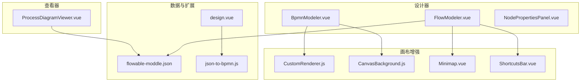
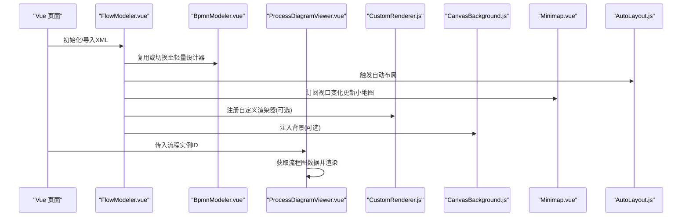
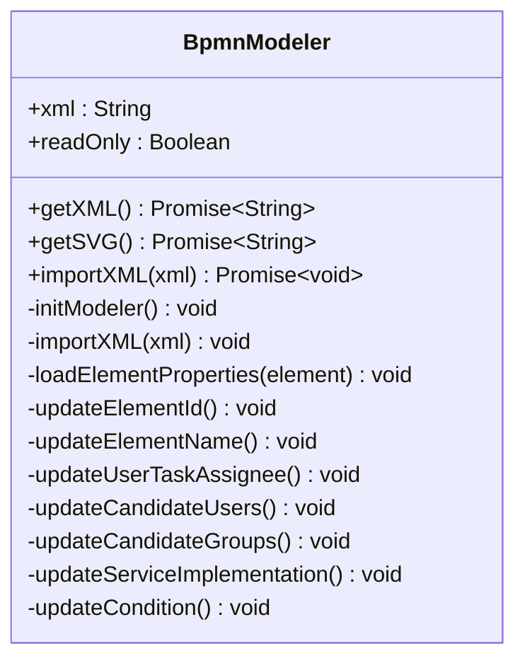
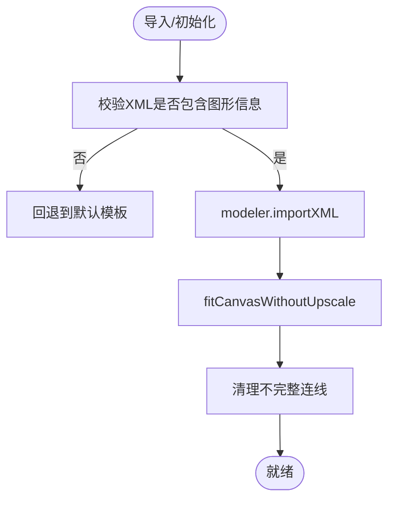
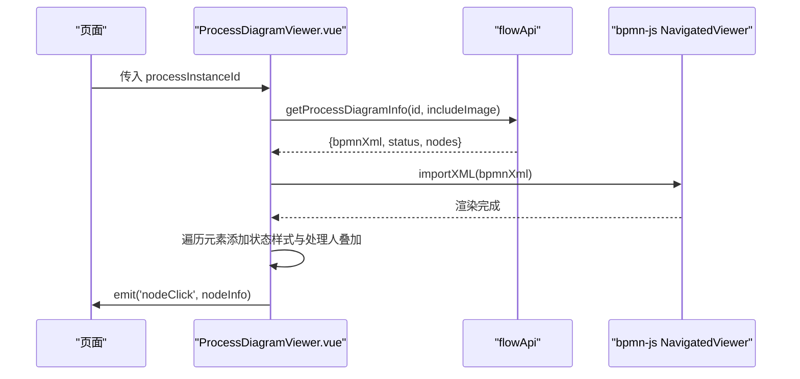
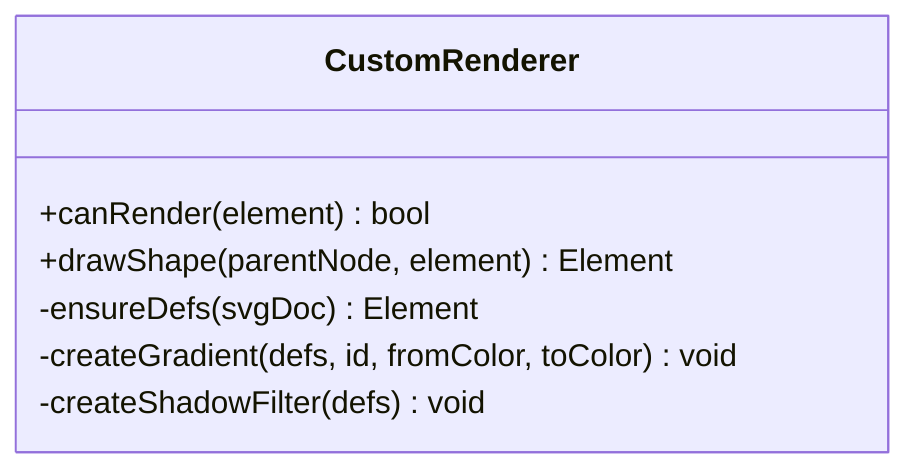
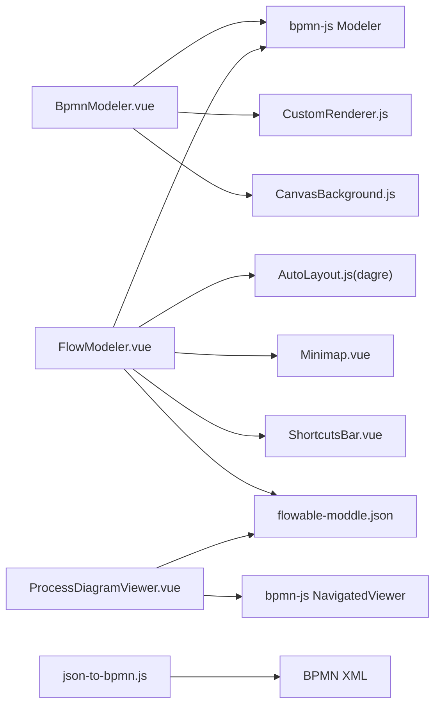

# BPMN流程组件

<cite>
**本文引用的文件**
- [BpmnModeler.vue](file://forge-admin-ui/src/components/bpmn/BpmnModeler.vue)
- [FlowModeler.vue](file://forge-admin-ui/src/components/bpmn/FlowModeler.vue)
- [ProcessDiagramViewer.vue](file://forge-admin-ui/src/components/bpmn/ProcessDiagramViewer.vue)
- [CustomRenderer.js](file://forge-admin-ui/src/components/bpmn/CustomRenderer.js)
- [AutoLayout.js](file://forge-admin-ui/src/components/bpmn/AutoLayout.js)
- [CanvasBackground.js](file://forge-admin-ui/src/components/bpmn/CanvasBackground.js)
- [Minimap.vue](file://forge-admin-ui/src/components/bpmn/Minimap.vue)
- [ShortcutsBar.vue](file://forge-admin-ui/src/components/bpmn/ShortcutsBar.vue)
- [NodePropertiesPanel.vue](file://forge-admin-ui/src/components/bpmn/NodePropertiesPanel.vue)
- [flowable-moddle.json](file://forge-admin-ui/src/components/bpmn/flowable-moddle.json)
- [json-to-bpmn.js](file://forge-admin-ui/src/components/flow-designer/converter/json-to-bpmn.js)
- [design.vue](file://forge-admin-ui/src/views/flow/design.vue)
</cite>

## 目录
1. [简介](#简介)
2. [项目结构](#项目结构)
3. [核心组件](#核心组件)
4. [架构总览](#架构总览)
5. [详细组件分析](#详细组件分析)
6. [依赖关系分析](#依赖关系分析)
7. [性能考量](#性能考量)
8. [故障排查指南](#故障排查指南)
9. [结论](#结论)
10. [附录](#附录)

## 简介
本技术文档聚焦 Forge Admin 的 BPMN 流程组件，系统梳理并深入解析 BpmnModeler、FlowModeler、ProcessDiagramViewer 等核心组件的设计模式与实现细节。文档覆盖流程建模、节点编辑、连线配置、属性面板、Canvas 背景、自动布局、小地图、快捷键、Flowable 模型集成、自定义渲染器、交互增强与性能优化策略，并提供开发指南、调试方法与最佳实践，帮助读者快速掌握并扩展该能力。

## 项目结构
前端 BPMN 相关能力集中在 forge-admin-ui 的 bpmn 与 flow-designer 目录下：
- 设计器与查看器：BpmnModeler.vue、FlowModeler.vue、ProcessDiagramViewer.vue
- 渲染与画布增强：CustomRenderer.js、CanvasBackground.js、Minimap.vue、ShortcutsBar.vue
- 属性面板与配置：NodePropertiesPanel.vue
- Flowable 扩展：flowable-moddle.json
- 转换与视图：json-to-bpmn.js、design.vue（含 XML 校验与图形重建）

图表来源
- [BpmnModeler.vue:147-152](file://forge-admin-ui/src/components/bpmn/BpmnModeler.vue#L147-L152)
- [FlowModeler.vue:220-229](file://forge-admin-ui/src/components/bpmn/FlowModeler.vue#L220-L229)
- [ProcessDiagramViewer.vue:138-155](file://forge-admin-ui/src/components/bpmn/ProcessDiagramViewer.vue#L138-L155)
- [CustomRenderer.js:1-6](file://forge-admin-ui/src/components/bpmn/CustomRenderer.js#L1-L6)
- [CanvasBackground.js:1-5](file://forge-admin-ui/src/components/bpmn/CanvasBackground.js#L1-L5)
- [Minimap.vue:41-56](file://forge-admin-ui/src/components/bpmn/Minimap.vue#L41-L56)
- [ShortcutsBar.vue:40-47](file://forge-admin-ui/src/components/bpmn/ShortcutsBar.vue#L40-L47)
- [flowable-moddle.json:1-10](file://forge-admin-ui/src/components/bpmn/flowable-moddle.json#L1-L10)
- [json-to-bpmn.js:250-292](file://forge-admin-ui/src/components/flow-designer/converter/json-to-bpmn.js#L250-L292)
- [design.vue:3262-3300](file://forge-admin-ui/src/views/flow/design.vue#L3262-L3300)

章节来源
- [BpmnModeler.vue:147-152](file://forge-admin-ui/src/components/bpmn/BpmnModeler.vue#L147-L152)
- [FlowModeler.vue:220-229](file://forge-admin-ui/src/components/bpmn/FlowModeler.vue#L220-L229)
- [ProcessDiagramViewer.vue:138-155](file://forge-admin-ui/src/components/bpmn/ProcessDiagramViewer.vue#L138-L155)

## 核心组件
- BpmnModeler.vue：基于 bpmn-js Modeler 的轻量设计器封装，提供工具栏、撤销重做、缩放、导出、属性面板与基础事件绑定。
- FlowModeler.vue：功能更丰富的设计器，集成自动布局、导入弹窗、XML 预览、验证、暗色模式、连接线完整性清理、小地图与快捷键提示。
- ProcessDiagramViewer.vue：基于 NavigatedViewer 的流程运行态查看器，支持状态着色、处理人叠加、悬浮详情、点击回调。
- CustomRenderer.js：自定义 SVG 渲染器，为各类节点绘制渐变、阴影与图标，提升可视化表现。
- CanvasBackground.js：在 SVG 层注入点阵网格与渐变背景，随视口变化自适应。
- Minimap.vue：小地图组件，实时同步主画布视口，支持拖拽平移。
- ShortcutsBar.vue：展示常用快捷键，辅助用户操作。
- NodePropertiesPanel.vue：按节点类型动态展示属性配置，包括审批设置、表单、网关、监听器等。
- flowable-moddle.json：定义 Flowable 扩展属性，使 bpmn-js 能识别并持久化业务字段。
- json-to-bpmn.js：将内部 JSON 流程模型转换为标准 BPMN XML，包含 BPMNDiagram 图形信息生成。
- design.vue：流程页面入口，包含 XML 合法性检查与图形信息重建逻辑。

章节来源
- [BpmnModeler.vue:147-152](file://forge-admin-ui/src/components/bpmn/BpmnModeler.vue#L147-L152)
- [FlowModeler.vue:220-229](file://forge-admin-ui/src/components/bpmn/FlowModeler.vue#L220-L229)
- [ProcessDiagramViewer.vue:138-155](file://forge-admin-ui/src/components/bpmn/ProcessDiagramViewer.vue#L138-L155)
- [CustomRenderer.js:126-141](file://forge-admin-ui/src/components/bpmn/CustomRenderer.js#L126-L141)
- [CanvasBackground.js:6-10](file://forge-admin-ui/src/components/bpmn/CanvasBackground.js#L6-L10)
- [Minimap.vue:41-56](file://forge-admin-ui/src/components/bpmn/Minimap.vue#L41-L56)
- [ShortcutsBar.vue:40-47](file://forge-admin-ui/src/components/bpmn/ShortcutsBar.vue#L40-L47)
- [NodePropertiesPanel.vue:1-10](file://forge-admin-ui/src/components/bpmn/NodePropertiesPanel.vue#L1-L10)
- [flowable-moddle.json:1-10](file://forge-admin-ui/src/components/bpmn/flowable-moddle.json#L1-L10)
- [json-to-bpmn.js:250-292](file://forge-admin-ui/src/components/flow-designer/converter/json-to-bpmn.js#L250-L292)
- [design.vue:3262-3300](file://forge-admin-ui/src/views/flow/design.vue#L3262-L3300)

## 架构总览
设计器与查看器围绕 bpmn-js 构建，通过 Vue 组件封装交互与状态管理；自定义渲染器与背景插件增强视觉体验；Flowable 扩展通过 moddle 声明业务属性；自动布局借助 dagre 算法；小地图与快捷键提升可用性。

图表来源
- [FlowModeler.vue:333-342](file://forge-admin-ui/src/components/bpmn/FlowModeler.vue#L333-L342)
- [BpmnModeler.vue:241-247](file://forge-admin-ui/src/components/bpmn/BpmnModeler.vue#L241-L247)
- [ProcessDiagramViewer.vue:239-258](file://forge-admin-ui/src/components/bpmn/ProcessDiagramViewer.vue#L239-L258)
- [AutoLayout.js:7-11](file://forge-admin-ui/src/components/bpmn/AutoLayout.js#L7-L11)
- [Minimap.vue:198-219](file://forge-admin-ui/src/components/bpmn/Minimap.vue#L198-L219)

## 详细组件分析

### BpmnModeler.vue 设计器
- 职责：封装 bpmn-js Modeler，提供工具栏（撤销/重做、缩放、导出）、右侧属性面板、选择与变更事件、XML 导入导出。
- 关键实现要点：
  - 使用 bpmn-js/lib/Modeler 初始化，绑定键盘事件到 document。
  - 监听 selection.changed、element.changed、commandStack.changed 以驱动 UI 状态与变更事件。
  - 默认模板包含 BPMNDiagram 图形信息，确保可渲染。
  - 属性面板根据选中元素类型动态显示（UserTask、ServiceTask、SequenceFlow）。
  - 暴露 getXML/getSVG/importXML 方法供父组件调用。

图表来源
- [BpmnModeler.vue:147-152](file://forge-admin-ui/src/components/bpmn/BpmnModeler.vue#L147-L152)
- [BpmnModeler.vue:241-247](file://forge-admin-ui/src/components/bpmn/BpmnModeler.vue#L241-L247)
- [BpmnModeler.vue:316-340](file://forge-admin-ui/src/components/bpmn/BpmnModeler.vue#L316-L340)
- [BpmnModeler.vue:344-436](file://forge-admin-ui/src/components/bpmn/BpmnModeler.vue#L344-L436)

章节来源
- [BpmnModeler.vue:147-152](file://forge-admin-ui/src/components/bpmn/BpmnModeler.vue#L147-L152)
- [BpmnModeler.vue:204-226](file://forge-admin-ui/src/components/bpmn/BpmnModeler.vue#L204-L226)
- [BpmnModeler.vue:241-306](file://forge-admin-ui/src/components/bpmn/BpmnModeler.vue#L241-L306)
- [BpmnModeler.vue:316-436](file://forge-admin-ui/src/components/bpmn/BpmnModeler.vue#L316-L436)
- [BpmnModeler.vue:468-529](file://forge-admin-ui/src/components/bpmn/BpmnModeler.vue#L468-L529)

### FlowModeler.vue 高级设计器
- 职责：在基础设计器之上增加自动布局、导入弹窗、XML 预览、流程验证、连接线完整性清理、小地图、快捷键提示、暗色模式。
- 关键实现要点：
  - 初始化时注入 Flowable moddle 扩展，启用业务属性读写。
  - 监听连接创建/更新/删除事件，及时清理不完整连线。
  - 提供 validateDiagram 校验开始/结束节点与连线完整性。
  - 自动布局调用 AutoLayout.js，基于 dagre 计算节点位置并批量移动。
  - 小地图订阅 canvas.viewbox.changed 与 commandStack.changed，保持视口同步。
  - 导出前执行验证，避免导出无效流程。

图表来源
- [FlowModeler.vue:296-306](file://forge-admin-ui/src/components/bpmn/FlowModeler.vue#L296-L306)
- [FlowModeler.vue:435-465](file://forge-admin-ui/src/components/bpmn/FlowModeler.vue#L435-L465)
- [FlowModeler.vue:692-750](file://forge-admin-ui/src/components/bpmn/FlowModeler.vue#L692-L750)
- [FlowModeler.vue:752-800](file://forge-admin-ui/src/components/bpmn/FlowModeler.vue#L752-L800)

章节来源
- [FlowModeler.vue:220-229](file://forge-admin-ui/src/components/bpmn/FlowModeler.vue#L220-L229)
- [FlowModeler.vue:333-342](file://forge-admin-ui/src/components/bpmn/FlowModeler.vue#L333-L342)
- [FlowModeler.vue:374-415](file://forge-admin-ui/src/components/bpmn/FlowModeler.vue#L374-L415)
- [FlowModeler.vue:527-581](file://forge-admin-ui/src/components/bpmn/FlowModeler.vue#L527-L581)
- [FlowModeler.vue:583-650](file://forge-admin-ui/src/components/bpmn/FlowModeler.vue#L583-L650)
- [FlowModeler.vue:666-677](file://forge-admin-ui/src/components/bpmn/FlowModeler.vue#L666-L677)
- [FlowModeler.vue:692-800](file://forge-admin-ui/src/components/bpmn/FlowModeler.vue#L692-L800)

### ProcessDiagramViewer.vue 运行态查看器
- 职责：加载流程实例的 BPMN XML 与节点状态，渲染运行轨迹、处理人标记、悬浮详情与点击回调。
- 关键实现要点：
  - 使用 NavigatedViewer 进行只读渲染，适配视口。
  - 根据后端返回的 nodes 构建状态映射，为节点添加状态样式与处理人叠加。
  - 监听 element.hover/out/click，展示节点详情并向上抛出 nodeClick 事件。
  - 支持图片降级（当无 XML 时显示 Base64 图）。

图表来源
- [ProcessDiagramViewer.vue:211-237](file://forge-admin-ui/src/components/bpmn/ProcessDiagramViewer.vue#L211-L237)
- [ProcessDiagramViewer.vue:239-324](file://forge-admin-ui/src/components/bpmn/ProcessDiagramViewer.vue#L239-L324)

章节来源
- [ProcessDiagramViewer.vue:138-155](file://forge-admin-ui/src/components/bpmn/ProcessDiagramViewer.vue#L138-L155)
- [ProcessDiagramViewer.vue:211-324](file://forge-admin-ui/src/components/bpmn/ProcessDiagramViewer.vue#L211-L324)
- [ProcessDiagramViewer.vue:326-445](file://forge-admin-ui/src/components/bpmn/ProcessDiagramViewer.vue#L326-L445)

### CustomRenderer.js 自定义渲染器
- 职责：为节点绘制带渐变与阴影的 SVG，统一视觉风格，提升可读性。
- 关键实现要点：
  - 继承 diagram-js 的 BaseRenderer，设置高优先级。
  - 针对 StartEvent、EndEvent、UserTask、ServiceTask、ScriptTask、CallActivity、SubProcess、Gateway 等类型分别绘制。
  - 使用 tiny-svg 创建 SVG 元素，维护 defs 中的渐变与滤镜缓存。

图表来源
- [CustomRenderer.js:126-141](file://forge-admin-ui/src/components/bpmn/CustomRenderer.js#L126-L141)
- [CustomRenderer.js:33-72](file://forge-admin-ui/src/components/bpmn/CustomRenderer.js#L33-L72)
- [CustomRenderer.js:143-303](file://forge-admin-ui/src/components/bpmn/CustomRenderer.js#L143-L303)

章节来源
- [CustomRenderer.js:1-6](file://forge-admin-ui/src/components/bpmn/CustomRenderer.js#L1-L6)
- [CustomRenderer.js:126-141](file://forge-admin-ui/src/components/bpmn/CustomRenderer.js#L126-L141)
- [CustomRenderer.js:143-303](file://forge-admin-ui/src/components/bpmn/CustomRenderer.js#L143-L303)

### CanvasBackground.js 画布背景
- 职责：在 SVG 根节点插入背景层，绘制点阵网格与渐变矩形，随视口变化重绘。
- 关键实现要点：
  - 监听 canvas.init/viewbox.changed/destroy，保证生命周期安全。
  - 动态计算可见区域，按需绘制主次点阵，减少 DOM 开销。

章节来源
- [CanvasBackground.js:6-10](file://forge-admin-ui/src/components/bpmn/CanvasBackground.js#L6-L10)
- [CanvasBackground.js:71-140](file://forge-admin-ui/src/components/bpmn/CanvasBackground.js#L71-L140)
- [CanvasBackground.js:142-180](file://forge-admin-ui/src/components/bpmn/CanvasBackground.js#L142-L180)

### Minimap.vue 小地图
- 职责：展示整体流程图缩略图，并同步当前视口区域，支持拖拽平移。
- 关键实现要点：
  - 通过 modeler.saveSVG() 获取缩略图内容。
  - 计算全局边界与当前 viewbox，映射为百分比定位可视窗口。
  - 监听 canvas.viewbox.changed 与命令栈变化，延迟更新以提升性能。

章节来源
- [Minimap.vue:41-56](file://forge-admin-ui/src/components/bpmn/Minimap.vue#L41-L56)
- [Minimap.vue:68-109](file://forge-admin-ui/src/components/bpmn/Minimap.vue#L68-L109)
- [Minimap.vue:111-152](file://forge-admin-ui/src/components/bpmn/Minimap.vue#L111-L152)
- [Minimap.vue:154-184](file://forge-admin-ui/src/components/bpmn/Minimap.vue#L154-L184)
- [Minimap.vue:186-239](file://forge-admin-ui/src/components/bpmn/Minimap.vue#L186-L239)

### ShortcutsBar.vue 快捷键提示
- 职责：展示常用快捷键，提升用户体验。
- 关键点：纯展示组件，配合设计器的键盘绑定使用。

章节来源
- [ShortcutsBar.vue:40-47](file://forge-admin-ui/src/components/bpmn/ShortcutsBar.vue#L40-L47)

### NodePropertiesPanel.vue 属性面板
- 职责：根据选中节点类型动态展示属性配置，包括基础属性、开始配置、审批设置、办理控制、会签、监听器、服务任务、网关等。
- 关键实现要点：
  - 使用 Tabs 组织不同配置项，支持在线表单设计与预览。
  - 支持用户/角色选择弹窗、SPEL 表达式模板与变量插入。
  - 对 UserTask 提供任务类型、候选人、表单、优先级、截止日期等丰富配置。

章节来源
- [NodePropertiesPanel.vue:1-10](file://forge-admin-ui/src/components/bpmn/NodePropertiesPanel.vue#L1-L10)
- [NodePropertiesPanel.vue:108-147](file://forge-admin-ui/src/components/bpmn/NodePropertiesPanel.vue#L108-L147)
- [NodePropertiesPanel.vue:149-471](file://forge-admin-ui/src/components/bpmn/NodePropertiesPanel.vue#L149-L471)
- [NodePropertiesPanel.vue:473-800](file://forge-admin-ui/src/components/bpmn/NodePropertiesPanel.vue#L473-L800)

### Flowable 模型集成
- 通过 flowable-moddle.json 声明 Flowable 扩展属性，使 bpmn-js 能够识别并读写如 assignee、candidateUsers、formKey、async、class/expression/delegateExpression 等业务字段。
- 在设计器中通过 modeling.updateProperties 写入这些扩展属性，并在查看器中结合运行时数据进行可视化。

章节来源
- [flowable-moddle.json:1-10](file://forge-admin-ui/src/components/bpmn/flowable-moddle.json#L1-L10)
- [flowable-moddle.json:17-173](file://forge-admin-ui/src/components/bpmn/flowable-moddle.json#L17-L173)
- [flowable-moddle.json:175-256](file://forge-admin-ui/src/components/bpmn/flowable-moddle.json#L175-L256)

### 自动布局
- 使用 dagre 算法计算节点层级与间距，批量移动节点位置，最后适应视口。
- 支持不同节点类型的尺寸估算，排除 Process 与 label。

章节来源
- [AutoLayout.js:7-11](file://forge-admin-ui/src/components/bpmn/AutoLayout.js#L7-L11)
- [AutoLayout.js:41-79](file://forge-admin-ui/src/components/bpmn/AutoLayout.js#L41-L79)
- [AutoLayout.js:81-115](file://forge-admin-ui/src/components/bpmn/AutoLayout.js#L81-L115)

### JSON 到 BPMN 转换
- 将内部 JSON 流程模型转换为标准 BPMN XML，包含 BPMNDiagram 图形信息（BPMNPlane、BPMNShape、BPMNEdge），确保可在 bpmn-js 中正确渲染。

章节来源
- [json-to-bpmn.js:250-292](file://forge-admin-ui/src/components/flow-designer/converter/json-to-bpmn.js#L250-L292)

### 流程页面 XML 校验与图形重建
- 校验 BPMN XML 语法与结构，确保存在 definitions/process/collaboration 与 BPMNPlane，否则给出明确错误提示。
- 在语义 XML 不可解析或缺少图形信息时，尝试重建或回退。

章节来源
- [design.vue:3262-3300](file://forge-admin-ui/src/views/flow/design.vue#L3262-L3300)

## 依赖关系分析
- 设计器与查看器均依赖 bpmn-js（Modeler/NavigatedViewer），并通过 Vue 组件封装交互。
- FlowModeler 依赖 AutoLayout（dagre）、Minimap、ShortcutsBar 等增强能力。
- CustomRenderer 与 CanvasBackground 作为 bpmn-js 插件注入，提升渲染与背景效果。
- Flowable 扩展通过 moddle 声明，贯穿设计器与查看器的属性读写与可视化。
- 转换模块 json-to-bpmn 负责 JSON 到 BPMN 的序列化，确保图形信息完整。

图表来源
- [BpmnModeler.vue:147-152](file://forge-admin-ui/src/components/bpmn/BpmnModeler.vue#L147-L152)
- [FlowModeler.vue:220-229](file://forge-admin-ui/src/components/bpmn/FlowModeler.vue#L220-L229)
- [ProcessDiagramViewer.vue:138-155](file://forge-admin-ui/src/components/bpmn/ProcessDiagramViewer.vue#L138-L155)
- [AutoLayout.js:1-2](file://forge-admin-ui/src/components/bpmn/AutoLayout.js#L1-L2)
- [Minimap.vue:41-56](file://forge-admin-ui/src/components/bpmn/Minimap.vue#L41-L56)
- [ShortcutsBar.vue:40-47](file://forge-admin-ui/src/components/bpmn/ShortcutsBar.vue#L40-L47)
- [CustomRenderer.js:1-6](file://forge-admin-ui/src/components/bpmn/CustomRenderer.js#L1-L6)
- [CanvasBackground.js:1-5](file://forge-admin-ui/src/components/bpmn/CanvasBackground.js#L1-L5)
- [flowable-moddle.json:1-10](file://forge-admin-ui/src/components/bpmn/flowable-moddle.json#L1-L10)
- [json-to-bpmn.js:250-292](file://forge-admin-ui/src/components/flow-designer/converter/json-to-bpmn.js#L250-L292)

章节来源
- [FlowModeler.vue:220-229](file://forge-admin-ui/src/components/bpmn/FlowModeler.vue#L220-L229)
- [ProcessDiagramViewer.vue:138-155](file://forge-admin-ui/src/components/bpmn/ProcessDiagramViewer.vue#L138-L155)
- [AutoLayout.js:1-2](file://forge-admin-ui/src/components/bpmn/AutoLayout.js#L1-L2)
- [flowable-moddle.json:1-10](file://forge-admin-ui/src/components/bpmn/flowable-moddle.json#L1-L10)

## 性能考量
- 小地图更新采用节流与延迟策略，避免频繁 saveSVG 与重绘。
- 自动布局批量移动节点，减少多次重排。
- 背景点阵仅绘制可见区域，降低 DOM 数量。
- 自定义渲染器缓存 defs（渐变与滤镜），避免重复创建。
- 查看器仅在必要时销毁并重建 viewer，防止内存泄漏。
- 导入 XML 前进行规范化与校验，失败快速回退，减少无效渲染。

[本节为通用性能建议，不直接分析具体文件]

## 故障排查指南
- 导入失败：检查 XML 是否包含 BPMNDiagram 图形信息；若无则回退到默认模板。
- 连接线残留：监听连接创建/更新/删除事件，清理不完整连线；导出前执行验证。
- 渲染失败：查看器捕获异常并标记 renderFailed，提供空状态与重试入口。
- 属性未生效：确认 Flowable moddle 已注入，且 modeling.updateProperties 写入正确的扩展属性键。
- 自动布局异常：检查节点类型与边引用是否存在，确保 dagre 图中有有效节点与边。
- 小地图不更新：确认已订阅 canvas.viewbox.changed 与 commandStack.changed，并正确计算全局边界。

章节来源
- [FlowModeler.vue:296-306](file://forge-admin-ui/src/components/bpmn/FlowModeler.vue#L296-L306)
- [FlowModeler.vue:374-415](file://forge-admin-ui/src/components/bpmn/FlowModeler.vue#L374-L415)
- [FlowModeler.vue:692-750](file://forge-admin-ui/src/components/bpmn/FlowModeler.vue#L692-L750)
- [ProcessDiagramViewer.vue:319-324](file://forge-admin-ui/src/components/bpmn/ProcessDiagramViewer.vue#L319-L324)
- [Minimap.vue:186-239](file://forge-admin-ui/src/components/bpmn/Minimap.vue#L186-L239)
- [design.vue:3262-3300](file://forge-admin-ui/src/views/flow/design.vue#L3262-L3300)

## 结论
Forge Admin 的 BPMN 流程组件以 bpmn-js 为核心，通过 Vue 组件封装与插件扩展，提供了从设计到查看的完整能力。自定义渲染器与背景增强了可视化体验，自动布局与小地图提升了效率，Flowable 扩展打通了业务属性与运行时数据。遵循本文档的最佳实践与调试方法，可高效开发与扩展流程组件。

[本节为总结性内容，不直接分析具体文件]

## 附录
- 开发指南
  - 新增节点类型：在 CustomRenderer.js 中添加绘制逻辑，并在属性面板中补充配置项。
  - 扩展属性：在 flowable-moddle.json 中声明新属性，并在设计器中读写。
  - 自动布局：调整 AutoLayout.js 中的节点尺寸估算与布局参数。
  - 查看器增强：在 ProcessDiagramViewer.vue 中扩展状态样式与悬浮详情。
- 调试方法
  - 使用浏览器控制台查看导入/渲染异常日志。
  - 通过 FlowModeler 的 XML 预览与验证功能定位问题。
  - 在小地图中观察视口变化，确认布局与缩放是否正确。
- 最佳实践
  - 始终确保 BPMN XML 包含 BPMNDiagram 图形信息。
  - 导出前执行流程验证，避免无效流程发布。
  - 合理使用自动布局与手动微调，平衡效率与美观。
  - 关注内存管理与事件监听清理，避免资源泄漏。

[本节为通用指导，不直接分析具体文件]