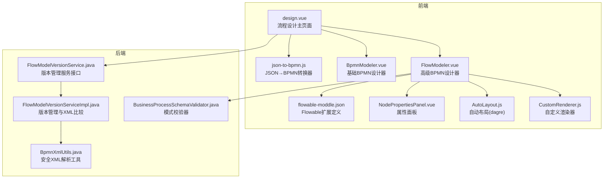
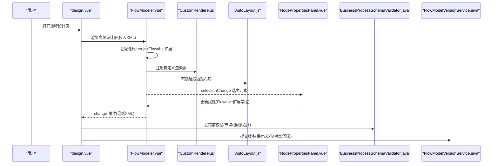
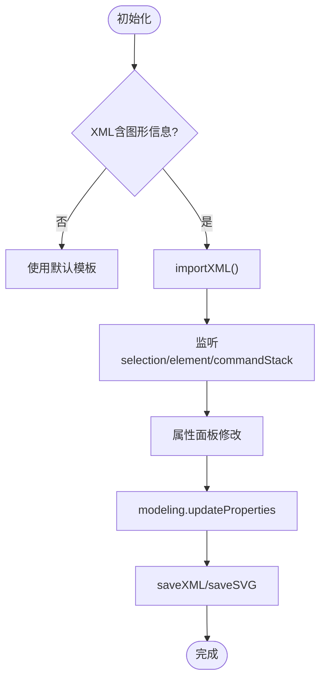
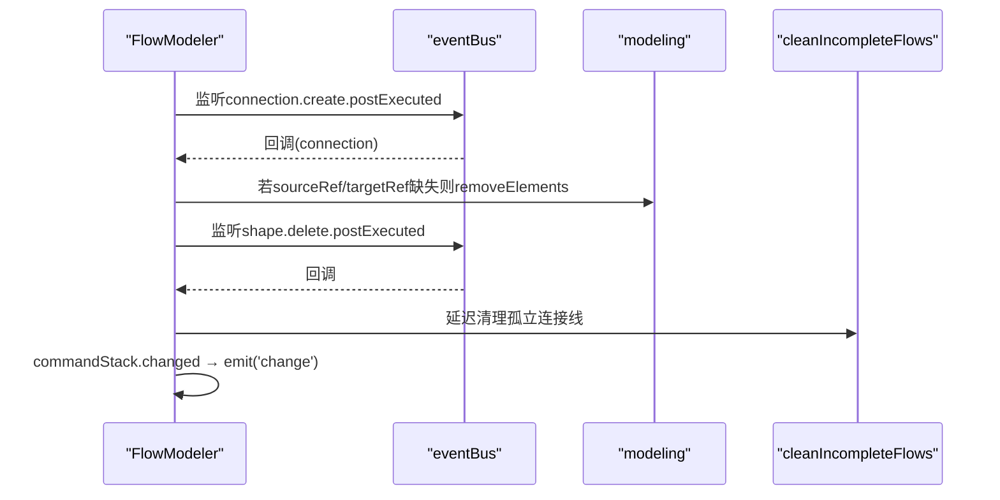
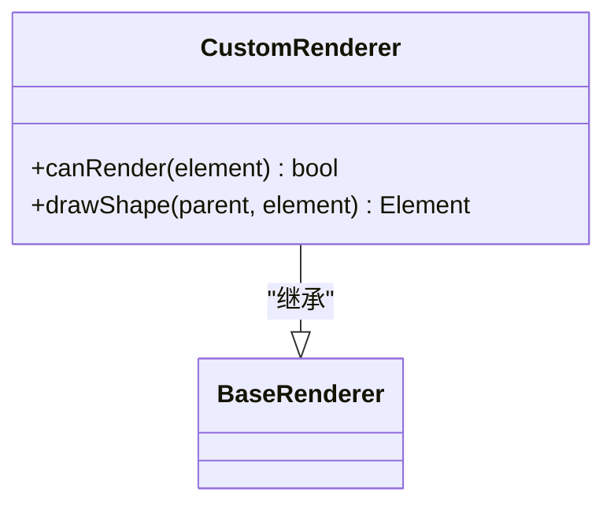
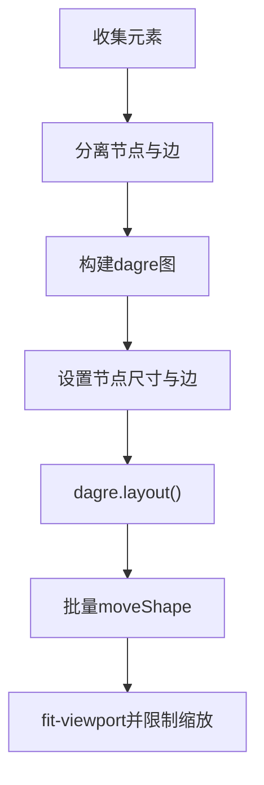
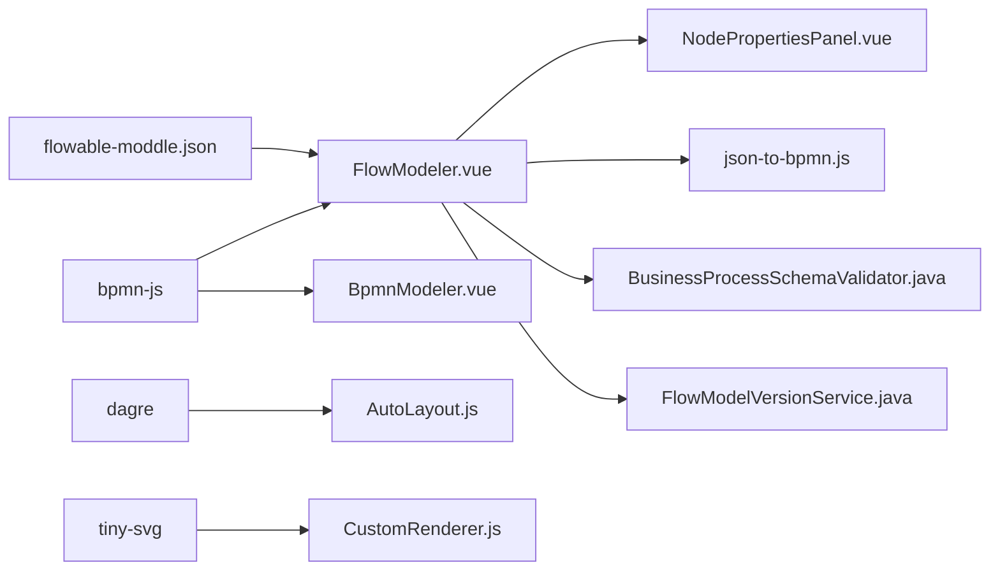

# BPMN流程设计器

<cite>
**本文引用的文件**
- [design.vue](file://forge-admin-ui/src/views/flow/design.vue)
- [BpmnModeler.vue](file://forge-admin-ui/src/components/bpmn/BpmnModeler.vue)
- [FlowModeler.vue](file://forge-admin-ui/src/components/bpmn/FlowModeler.vue)
- [CustomRenderer.js](file://forge-admin-ui/src/components/bpmn/CustomRenderer.js)
- [AutoLayout.js](file://forge-admin-ui/src/components/bpmn/AutoLayout.js)
- [NodePropertiesPanel.vue](file://forge-admin-ui/src/components/bpmn/NodePropertiesPanel.vue)
- [flowable-moddle.json](file://forge-admin-ui/src/components/bpmn/flowable-moddle.json)
- [json-to-bpmn.js](file://forge-admin-ui/src/components/flow-designer/converter/json-to-bpmn.js)
- [xml-utils.js](file://forge-admin-ui/src/components/flow-designer/converter/xml-utils.js)
- [BusinessProcessSchemaValidator.java](file://forge-server/forge-framework/forge-plugin-parent/forge-plugin-generator/src/main/java/com/mdframe/forge/plugin/generator/businessprocess/validation/BusinessProcessSchemaValidator.java)
- [FlowModelVersionService.java](file://forge-server/forge-framework/forge-plugin-parent/forge-plugin-flow/src/main/java/com/mdframe/forge/starter/flow/service/FlowModelVersionService.java)
- [FlowModelVersionServiceImpl.java](file://forge-server/forge-framework/forge-plugin-parent/forge-plugin-flow/src/main/java/com/mdframe/forge/starter/flow/service/impl/FlowModelVersionServiceImpl.java)
- [BpmnXmlUtils.java](file://forge-server/forge-framework/forge-plugin-parent/forge-plugin-flow/src/main/java/com/mdframe/forge/starter/flow/helper/BpmnXmlUtils.java)
</cite>

## 目录
1. [简介](#简介)
2. [项目结构](#项目结构)
3. [核心组件](#核心组件)
4. [架构总览](#架构总览)
5. [详细组件分析](#详细组件分析)
6. [依赖关系分析](#依赖关系分析)
7. [性能考虑](#性能考虑)
8. [故障排查指南](#故障排查指南)
9. [结论](#结论)
10. [附录](#附录)

## 简介
本技术文档围绕前端BPMN流程设计器的实现展开，重点解析 BpmnModeler 与 FlowModeler 两大核心组件，覆盖模型初始化、节点拖拽、连线配置、属性面板、Flowable 扩展集成、XML序列化与反序列化、节点类型支持、连接规则验证、版本管理策略，以及自定义渲染器开发、交互增强、性能优化与调试技巧。同时提供建模最佳实践与常见问题解决方案，帮助读者快速掌握并高效扩展该设计器。

## 项目结构
本项目采用前后端分离的模块化组织方式：
- 前端（forge-admin-ui）
  - bpmn 子目录：封装基于 bpmn-js 的设计器能力，包括基础 Modeler、高级 FlowModeler、自定义渲染器、自动布局、属性面板、小地图与快捷键等。
  - flow-designer/converter：负责业务 JSON 到 BPMN XML 的转换与图形信息生成。
  - views/flow/design.vue：流程设计主页面，组合不同设计器模式（审批型/通用BPMN）、属性面板、AI助手与发布保存流程。
- 后端（forge-server）
  - forge-plugin-flow：流程服务与版本管理，包含 XML 解析工具、版本对比与回滚接口。
  - forge-plugin-generator：业务过程模式校验器，对节点类型、连线端口、拓扑连通性等进行严格校验。

图表来源
- [design.vue:79-104](file://forge-admin-ui/src/views/flow/design.vue#L79-L104)
- [FlowModeler.vue:220-342](file://forge-admin-ui/src/components/bpmn/FlowModeler.vue#L220-L342)
- [BpmnModeler.vue:147-247](file://forge-admin-ui/src/components/bpmn/BpmnModeler.vue#L147-L247)
- [CustomRenderer.js:126-141](file://forge-admin-ui/src/components/bpmn/CustomRenderer.js#L126-L141)
- [AutoLayout.js:7-116](file://forge-admin-ui/src/components/bpmn/AutoLayout.js#L7-L116)
- [NodePropertiesPanel.vue:108-147](file://forge-admin-ui/src/components/bpmn/NodePropertiesPanel.vue#L108-L147)
- [flowable-moddle.json:1-260](file://forge-admin-ui/src/components/bpmn/flowable-moddle.json#L1-L260)
- [json-to-bpmn.js:35-61](file://forge-admin-ui/src/components/flow-designer/converter/json-to-bpmn.js#L35-L61)
- [BusinessProcessSchemaValidator.java:433-451](file://forge-server/forge-framework/forge-plugin-parent/forge-plugin-generator/src/main/java/com/mdframe/forge/plugin/generator/businessprocess/validation/BusinessProcessSchemaValidator.java#L433-L451)
- [FlowModelVersionService.java:14-29](file://forge-server/forge-framework/forge-plugin-parent/forge-plugin-flow/src/main/java/com/mdframe/forge/starter/flow/service/FlowModelVersionService.java#L14-L29)
- [FlowModelVersionServiceImpl.java:425-458](file://forge-server/forge-framework/forge-plugin-parent/forge-plugin-flow/src/main/java/com/mdframe/forge/starter/flow/service/impl/FlowModelVersionServiceImpl.java#L425-L458)
- [BpmnXmlUtils.java:361-376](file://forge-server/forge-framework/forge-plugin-parent/forge-plugin-flow/src/main/java/com/mdframe/forge/starter/flow/helper/BpmnXmlUtils.java#L361-L376)

章节来源
- [design.vue:79-104](file://forge-admin-ui/src/views/flow/design.vue#L79-L104)
- [FlowModeler.vue:220-342](file://forge-admin-ui/src/components/bpmn/FlowModeler.vue#L220-L342)
- [BpmnModeler.vue:147-247](file://forge-admin-ui/src/components/bpmn/BpmnModeler.vue#L147-L247)

## 核心组件
- BpmnModeler.vue
  - 基于 bpmn-js 的基础设计器封装，提供导入/导出、撤销重做、缩放、属性编辑、事件监听与变更同步。
  - 内置默认模板确保含 BPMNDiagram 图形信息，避免无图XML导致无法渲染。
- FlowModeler.vue
  - 在基础能力上增强：Flowable moddle 扩展、连接线完整性清理、自动布局、预览与验证、暗色模式、小地图与快捷键。
  - 通过 eventBus 监听命令栈与元素变化，保证 XML 实时同步与状态一致。
- CustomRenderer.js
  - 自定义 SVG 渲染器，为开始/结束事件、用户任务、服务任务、脚本任务、调用活动、子流程及各类网关绘制带渐变与阴影的图标化图形。
- AutoLayout.js
  - 使用 dagre 进行从左到右的自动布局，计算节点尺寸与层级间距，批量移动节点并适配视口。
- NodePropertiesPanel.vue
  - 针对 BPMN 元素的属性面板，支持基础属性、开始配置、审批设置、服务任务执行监听器等，结合 Flowable 扩展字段进行双向绑定。
- flowable-moddle.json
  - 声明 Flowable 命名空间下的扩展类型与属性，如 assignee、candidateUsers、class/expression/delegateExpression、ExecutionListener 等，使 bpmn-js 可识别并读写这些属性。
- json-to-bpmn.js / xml-utils.js
  - 将业务侧 JSON 转换为标准 BPMN XML，并生成 BPMNDiagram 图形信息；提供命名空间常量与解析工具，兼容多种前缀与属性读取路径。

章节来源
- [BpmnModeler.vue:147-306](file://forge-admin-ui/src/components/bpmn/BpmnModeler.vue#L147-L306)
- [FlowModeler.vue:220-465](file://forge-admin-ui/src/components/bpmn/FlowModeler.vue#L220-L465)
- [CustomRenderer.js:126-303](file://forge-admin-ui/src/components/bpmn/CustomRenderer.js#L126-L303)
- [AutoLayout.js:7-116](file://forge-admin-ui/src/components/bpmn/AutoLayout.js#L7-L116)
- [NodePropertiesPanel.vue:108-2159](file://forge-admin-ui/src/components/bpmn/NodePropertiesPanel.vue#L108-L2159)
- [flowable-moddle.json:1-260](file://forge-admin-ui/src/components/bpmn/flowable-moddle.json#L1-L260)
- [json-to-bpmn.js:35-61](file://forge-admin-ui/src/components/flow-designer/converter/json-to-bpmn.js#L35-L61)
- [xml-utils.js:1-27](file://forge-admin-ui/src/components/flow-designer/converter/xml-utils.js#L1-L27)

## 架构总览
设计器整体由“页面编排 + 设计器内核 + 渲染与布局 + 属性面板 + 转换与校验 + 后端版本管理”构成。页面根据场景选择审批型或通用BPMN设计器；FlowModeler 作为高级内核，集成 Flowable 扩展、自动布局与健壮性保障；属性面板驱动模型变更；转换器负责 JSON↔BPMN 互转；后端提供严格的模式校验与版本管理能力。

图表来源
- [design.vue:79-104](file://forge-admin-ui/src/views/flow/design.vue#L79-L104)
- [FlowModeler.vue:333-433](file://forge-admin-ui/src/components/bpmn/FlowModeler.vue#L333-L433)
- [CustomRenderer.js:126-141](file://forge-admin-ui/src/components/bpmn/CustomRenderer.js#L126-L141)
- [AutoLayout.js:7-116](file://forge-admin-ui/src/components/bpmn/AutoLayout.js#L7-L116)
- [NodePropertiesPanel.vue:108-2159](file://forge-admin-ui/src/components/bpmn/NodePropertiesPanel.vue#L108-L2159)
- [BusinessProcessSchemaValidator.java:433-451](file://forge-server/forge-framework/forge-plugin-parent/forge-plugin-generator/src/main/java/com/mdframe/forge/plugin/generator/businessprocess/validation/BusinessProcessSchemaValidator.java#L433-L451)
- [FlowModelVersionService.java:14-29](file://forge-server/forge-framework/forge-plugin-parent/forge-plugin-flow/src/main/java/com/mdframe/forge/starter/flow/service/FlowModelVersionService.java#L14-L29)

## 详细组件分析

### BpmnModeler.vue 基础设计器
- 初始化与导入
  - 创建 bpmn-js Modeler 实例，绑定键盘事件，监听 selection.changed、element.changed、commandStack.changed。
  - 导入时检查是否包含 BPMNDiagram，若无则回退到内置默认模板，确保可渲染。
- 属性编辑
  - 支持 ID、名称、用户任务的审批人/候选用户/候选组、服务任务的实现类型与值、序列流条件表达式。
  - 通过 modeling.updateProperties 写入 Flowable 扩展属性。
- 导出与预览
  - 提供 saveXML/saveSVG 导出，支持下载与预览弹窗。
- 撤销重做与缩放
  - 基于 commandStack 控制可用状态，canvas.zoom 控制缩放。

图表来源
- [BpmnModeler.vue:228-306](file://forge-admin-ui/src/components/bpmn/BpmnModeler.vue#L228-L306)
- [BpmnModeler.vue:315-436](file://forge-admin-ui/src/components/bpmn/BpmnModeler.vue#L315-L436)
- [BpmnModeler.vue:468-529](file://forge-admin-ui/src/components/bpmn/BpmnModeler.vue#L468-L529)

章节来源
- [BpmnModeler.vue:147-529](file://forge-admin-ui/src/components/bpmn/BpmnModeler.vue#L147-L529)

### FlowModeler.vue 高级设计器
- Flowable 扩展集成
  - 通过 moddleExtensions.flowable 注入扩展定义，使 bpmn-js 能识别并读写 Flowable 属性。
- 连接线健壮性
  - 监听 connection.create/update 与 shape.delete 事件，自动清理不完整或孤立连接线，防止脏数据残留。
- 自动布局与预览
  - 集成 AutoLayout 进行 dagre 布局；提供 XML 预览与复制下载。
- 验证与导出
  - 导出前进行本地验证（开始/结束节点、连线完整性），失败则阻止导出并提示修复。
- 状态同步
  - 通过 commandStack.changed 与 element.changed 触发 change 事件，保持父组件 XML 同步。

图表来源
- [FlowModeler.vue:347-433](file://forge-admin-ui/src/components/bpmn/FlowModeler.vue#L347-L433)
- [FlowModeler.vue:693-800](file://forge-admin-ui/src/components/bpmn/FlowModeler.vue#L693-L800)

章节来源
- [FlowModeler.vue:220-800](file://forge-admin-ui/src/components/bpmn/FlowModeler.vue#L220-L800)

### CustomRenderer.js 自定义渲染器
- 渲染策略
  - 继承 BaseRenderer，按元素类型绘制圆形/矩形/菱形等形状，叠加渐变与阴影滤镜。
  - 为常见节点类型（开始/结束、用户任务、服务任务、脚本任务、调用活动、子流程、排他/并行/包容网关）提供图标化视觉。
- 性能优化
  - 缓存 SVG defs，避免重复创建渐变与滤镜；统一标签样式与文本截断。

图表来源
- [CustomRenderer.js:126-141](file://forge-admin-ui/src/components/bpmn/CustomRenderer.js#L126-L141)
- [CustomRenderer.js:143-303](file://forge-admin-ui/src/components/bpmn/CustomRenderer.js#L143-L303)

章节来源
- [CustomRenderer.js:126-303](file://forge-admin-ui/src/components/bpmn/CustomRenderer.js#L126-L303)

### AutoLayout.js 自动布局
- 算法流程
  - 提取节点与边，构建 dagre 有向图，设置 rankdir=LR、节点间距与层级间距。
  - 根据节点类型估算尺寸，执行 layout 后批量 moveShape，最后 fit-viewport 并限制最大缩放。
- 适用场景
  - 复杂流程图初次渲染或重构后一键整理，提升可读性与一致性。

图表来源
- [AutoLayout.js:7-116](file://forge-admin-ui/src/components/bpmn/AutoLayout.js#L7-L116)

章节来源
- [AutoLayout.js:7-116](file://forge-admin-ui/src/components/bpmn/AutoLayout.js#L7-L116)

### NodePropertiesPanel.vue 属性面板
- 功能要点
  - 基础属性：ID、名称、描述。
  - 开始节点：发起人变量、表单Key。
  - 用户任务：任务类型、审批人、候选用户/组、SPEL 表达式模板、角色/用户选择弹窗。
  - 服务任务：执行监听器（ExecutionListener）读取与写入，支持 class/expression/delegateExpression、Flowable 类型与抄送配置。
- 与 Flowable 扩展联动
  - 通过 moddle 扩展直接读写 bo.class / bo.expression / bo.delegateExpression 等属性，保证 XML 输出正确。

章节来源
- [NodePropertiesPanel.vue:108-2159](file://forge-admin-ui/src/components/bpmn/NodePropertiesPanel.vue#L108-L2159)
- [flowable-moddle.json:1-260](file://forge-admin-ui/src/components/bpmn/flowable-moddle.json#L1-L260)

### JSON→BPMN 转换器
- 转换逻辑
  - 从业务 JSON 生成 processId/processName/config，计算布局，写出节点与连线 XML，并生成 BPMNDiagram 图形信息。
  - 写入 Flowable 扩展属性（如 allowSubmitterWithdraw、autoApprovalMode）。
- 兼容性
  - 使用 xml-utils 中的命名空间常量与解析工具，兼容不同前缀与属性读取路径。

章节来源
- [json-to-bpmn.js:35-61](file://forge-admin-ui/src/components/flow-designer/converter/json-to-bpmn.js#L35-L61)
- [json-to-bpmn.js:250-292](file://forge-admin-ui/src/components/flow-designer/converter/json-to-bpmn.js#L250-L292)
- [xml-utils.js:1-27](file://forge-admin-ui/src/components/flow-designer/converter/xml-utils.js#L1-L27)

### 后端校验与版本管理
- 模式校验（BusinessProcessSchemaValidator）
  - 节点类型校验：开始事件、手动开始、定时开始、条件、动作、审批、子流程、结束等。
  - 连线规则：来源/目标存在性、自环禁止、端口有效性、唯一性约束。
  - 拓扑校验：可达性、是否存在未达终点的分支、孤立节点检测。
- 版本管理（FlowModelVersionService/Impl）
  - 提供版本分页、详情、对比、回滚、标签更新、删除与发布时插入版本。
  - XML 解析与安全：禁用 DOCTYPE 与外部实体，防御 XXE；忽略无关标签（definitions/process/extensionElements/documentation/sequenceFlow/incoming/outgoing/BPMNDiagram/BPMNShape/BPMNEdge）以聚焦业务差异。

章节来源
- [BusinessProcessSchemaValidator.java:433-451](file://forge-server/forge-framework/forge-plugin-parent/forge-plugin-generator/src/main/java/com/mdframe/forge/plugin/generator/businessprocess/validation/BusinessProcessSchemaValidator.java#L433-L451)
- [BusinessProcessSchemaValidator.java:770-790](file://forge-server/forge-framework/forge-plugin-parent/forge-plugin-generator/src/main/java/com/mdframe/forge/plugin/generator/businessprocess/validation/BusinessProcessSchemaValidator.java#L770-L790)
- [FlowModelVersionService.java:14-29](file://forge-server/forge-framework/forge-plugin-parent/forge-plugin-flow/src/main/java/com/mdframe/forge/starter/flow/service/FlowModelVersionService.java#L14-L29)
- [FlowModelVersionServiceImpl.java:425-458](file://forge-server/forge-framework/forge-plugin-parent/forge-plugin-flow/src/main/java/com/mdframe/forge/starter/flow/service/impl/FlowModelVersionServiceImpl.java#L425-L458)
- [BpmnXmlUtils.java:361-376](file://forge-server/forge-framework/forge-plugin-parent/forge-plugin-flow/src/main/java/com/mdframe/forge/starter/flow/helper/BpmnXmlUtils.java#L361-L376)

## 依赖关系分析
- 前端依赖
  - bpmn-js：提供建模、渲染、命令栈、事件总线等核心能力。
  - dagre：用于自动布局算法。
  - tiny-svg/diagram-js：用于 SVG 操作与基础渲染器扩展。
  - Flowable moddle：扩展 bpmn-js 对 Flowable 属性的识别与序列化。
- 后端依赖
  - Flowable 运行时：部署与执行 BPMN 流程。
  - JAXP/XML 解析：安全解析 XML，防止 XXE。
  - 校验器：对业务过程模式进行强约束，确保流程可执行且符合规范。

图表来源
- [FlowModeler.vue:220-342](file://forge-admin-ui/src/components/bpmn/FlowModeler.vue#L220-L342)
- [BpmnModeler.vue:147-247](file://forge-admin-ui/src/components/bpmn/BpmnModeler.vue#L147-L247)
- [AutoLayout.js:7-116](file://forge-admin-ui/src/components/bpmn/AutoLayout.js#L7-L116)
- [CustomRenderer.js:126-141](file://forge-admin-ui/src/components/bpmn/CustomRenderer.js#L126-L141)
- [flowable-moddle.json:1-260](file://forge-admin-ui/src/components/bpmn/flowable-moddle.json#L1-L260)
- [json-to-bpmn.js:35-61](file://forge-admin-ui/src/components/flow-designer/converter/json-to-bpmn.js#L35-L61)
- [BusinessProcessSchemaValidator.java:433-451](file://forge-server/forge-framework/forge-plugin-parent/forge-plugin-generator/src/main/java/com/mdframe/forge/plugin/generator/businessprocess/validation/BusinessProcessSchemaValidator.java#L433-L451)
- [FlowModelVersionService.java:14-29](file://forge-server/forge-framework/forge-plugin-parent/forge-plugin-flow/src/main/java/com/mdframe/forge/starter/flow/service/FlowModelVersionService.java#L14-L29)

## 性能考虑
- 渲染性能
  - 自定义渲染器复用 SVG defs，减少渐变与滤镜重复创建。
  - 文本标签截断避免过长导致的布局抖动。
- 布局性能
  - 自动布局批量移动节点，仅在必要时触发，避免频繁重绘。
- 事件与状态
  - 使用 shallowRef 与防抖策略减少不必要的响应式更新。
  - 命令栈变化与元素变化合并处理，降低 XML 导出频率。
- 内存管理
  - 组件卸载时销毁 modeler 实例，释放资源。
  - 清理不完整连接线，防止 DOM 与模型不一致导致的内存泄漏。

[本节为通用性能建议，不直接分析具体文件]

## 故障排查指南
- 导入失败或缺少图形信息
  - 现象：无法渲染或报错。
  - 原因：XML 不含 BPMNDiagram。
  - 解决：使用默认模板或补全图形信息；参考导入逻辑与默认模板。
- 连接线不完整或孤立
  - 现象：出现悬空线或删除节点后残留连线。
  - 原因：连接未完成或目标节点被删除。
  - 解决：启用监听并自动清理；导出前进行验证并提示修复。
- 属性面板未生效
  - 现象：修改属性后 XML 未更新。
  - 原因：未正确写入 Flowable 扩展属性或未触发 change。
  - 解决：确认 modeling.updateProperties 调用与 eventBus 监听。
- 自动布局异常
  - 现象：节点重叠或布局错乱。
  - 原因：节点尺寸估计不准确或边关系缺失。
  - 解决：检查节点类型与边关系，调整间距参数。
- 版本对比/回滚问题
  - 现象：对比结果异常或回滚失败。
  - 原因：XML 解析不安全或忽略标签不当。
  - 解决：使用安全解析工具，核对 shouldSkipTag 列表。

章节来源
- [FlowModeler.vue:436-465](file://forge-admin-ui/src/components/bpmn/FlowModeler.vue#L436-L465)
- [FlowModeler.vue:693-800](file://forge-admin-ui/src/components/bpmn/FlowModeler.vue#L693-L800)
- [BpmnModeler.vue:284-306](file://forge-admin-ui/src/components/bpmn/BpmnModeler.vue#L284-L306)
- [FlowModelVersionServiceImpl.java:425-458](file://forge-server/forge-framework/forge-plugin-parent/forge-plugin-flow/src/main/java/com/mdframe/forge/starter/flow/service/impl/FlowModelVersionServiceImpl.java#L425-L458)
- [BpmnXmlUtils.java:361-376](file://forge-server/forge-framework/forge-plugin-parent/forge-plugin-flow/src/main/java/com/mdframe/forge/starter/flow/helper/BpmnXmlUtils.java#L361-L376)

## 结论
本设计器以 bpmn-js 为核心，通过 FlowModeler 与 BpmnModeler 提供从基础到高级的流程建模能力；借助 Flowable 扩展与自定义渲染器，满足企业级可视化与语义表达需求；配合自动布局、属性面板与转换器，形成完整的建模闭环；后端校验与版本管理确保流程的可执行性与可追溯性。遵循本文的最佳实践与故障排查方法，可显著提升建模效率与系统稳定性。

[本节为总结性内容，不直接分析具体文件]

## 附录
- 建模最佳实践
  - 始终包含 BPMNDiagram 图形信息，避免导入渲染失败。
  - 使用属性面板集中配置 Flowable 扩展属性，保持 XML 一致性。
  - 发布前运行验证，及时修复不完整连线与拓扑问题。
  - 合理使用自动布局，保持流程图清晰易读。
  - 利用版本管理进行变更对比与回滚，保障生产安全。
- 常见问题速查
  - 无开始/结束节点：添加必要节点并通过验证。
  - 连线端口无效：检查来源节点注册的端口集合。
  - 条件分支默认分支缺失：确保仅一个默认分支且有效。
  - 未知节点类型：使用注册表支持的节点类型。
  - XML 解析安全：启用禁用 DOCTYPE 与外部实体的解析配置。

[本节为补充说明，不直接分析具体文件]