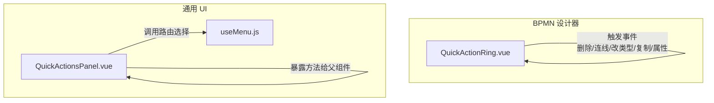
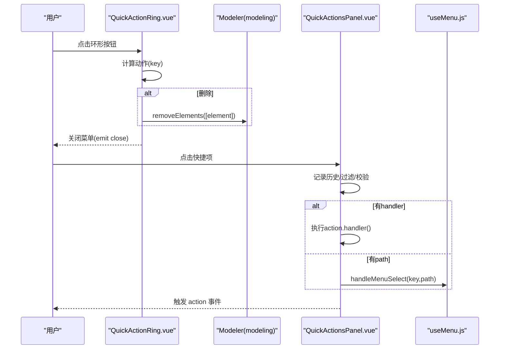
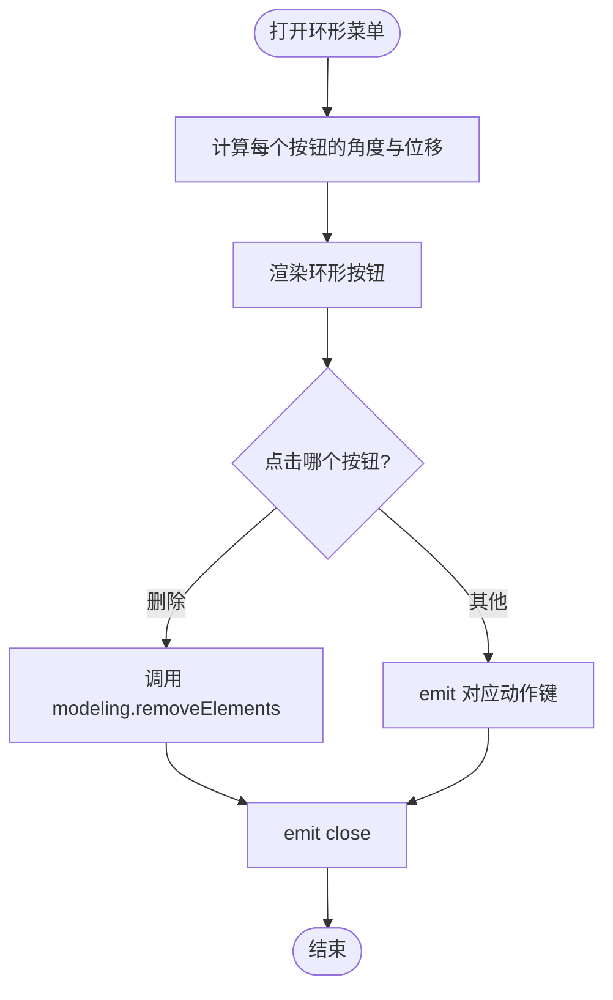
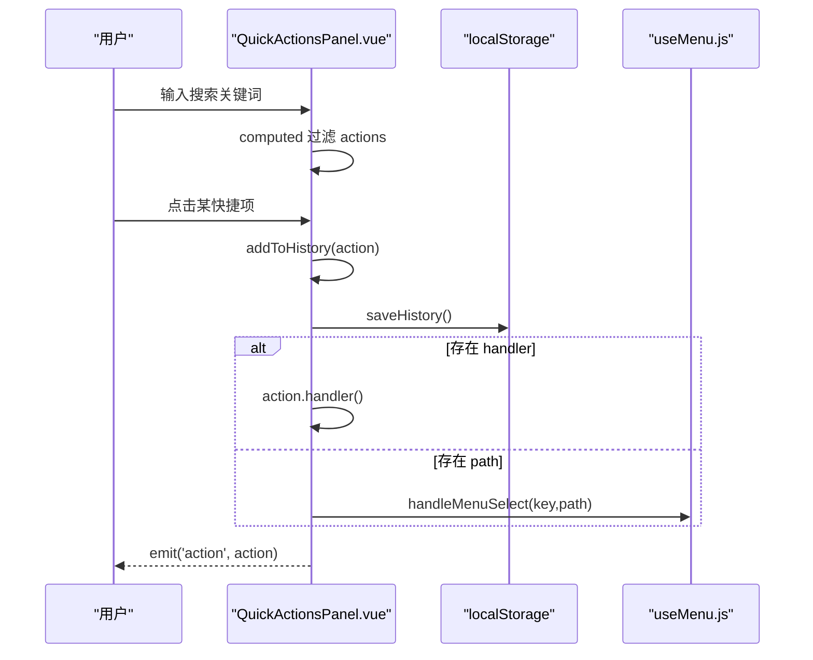
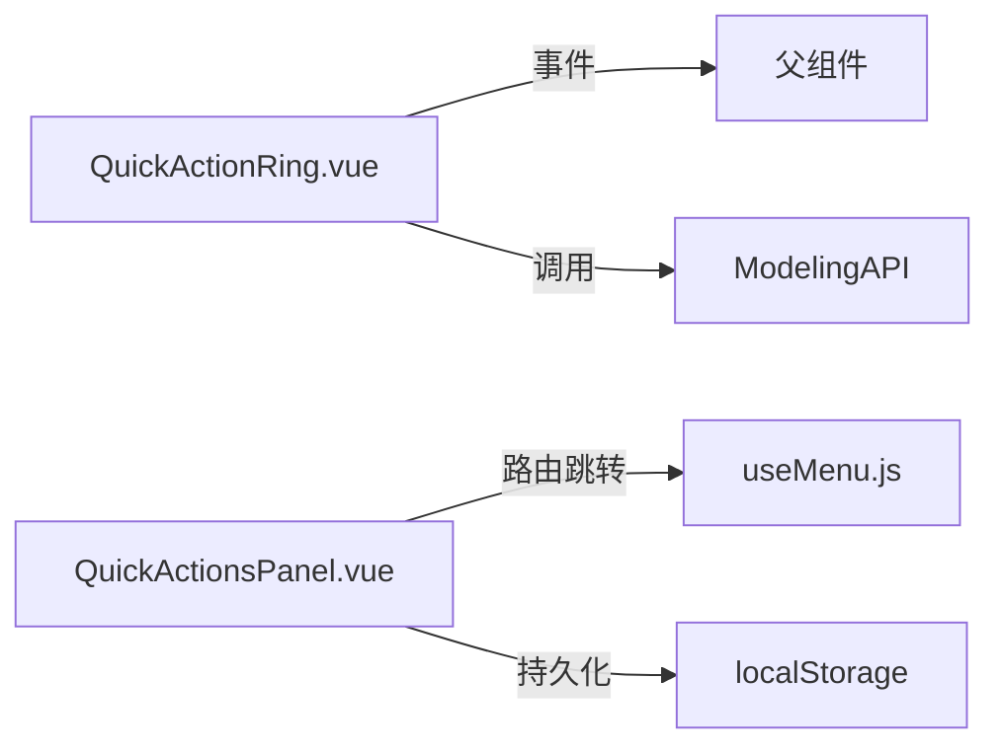

# 快捷操作组件

<cite>
**本文引用的文件**
- [QuickActionRing.vue](file://forge-admin-ui/src/components/bpmn/QuickActionRing.vue)
- [QuickActionsPanel.vue](file://forge-admin-ui/src/components/common/QuickActionsPanel.vue)
- [useMenu.js](file://forge-admin-ui/src/composables/useMenu.js)
</cite>

## 目录
1. [简介](#简介)
2. [项目结构](#项目结构)
3. [核心组件](#核心组件)
4. [架构总览](#架构总览)
5. [详细组件分析](#详细组件分析)
6. [依赖关系分析](#依赖关系分析)
7. [性能考量](#性能考量)
8. [故障排查指南](#故障排查指南)
9. [结论](#结论)
10. [附录：开发指南与最佳实践](#附录开发指南与最佳实践)

## 简介
本技术文档聚焦于“快捷操作”能力，围绕两个关键组件展开：
- QuickActionRing（环形菜单）：用于在画布或特定上下文快速弹出环形排列的快捷操作按钮，支持动态菜单生成、位置计算、动画效果以及与底层模型器的交互。
- QuickActionsPanel（快捷面板）：提供可搜索、带历史记录的通用快捷入口面板，支持键盘快捷键、本地持久化、路由跳转与自定义处理器。

文档将深入解析其实现机制、事件处理、状态管理、响应式布局、无障碍访问支持，并给出扩展、主题定制与性能优化策略，以及面向开发的实践建议。

## 项目结构
快捷操作相关代码位于前端工程 forge-admin-ui 中：
- bpmn 子目录包含 QuickActionRing.vue，服务于流程建模场景的环形菜单。
- common 子目录包含 QuickActionsPanel.vue，作为通用快捷入口面板。
- composables/useMenu.js 提供菜单选择逻辑，被面板复用以实现统一的路由导航行为。

图表来源
- [QuickActionRing.vue:1-151](file://forge-admin-ui/src/components/bpmn/QuickActionRing.vue#L1-L151)
- [QuickActionsPanel.vue:1-505](file://forge-admin-ui/src/components/common/QuickActionsPanel.vue#L1-L505)
- [useMenu.js:309-320](file://forge-admin-ui/src/composables/useMenu.js#L309-L320)

章节来源
- [QuickActionRing.vue:1-151](file://forge-admin-ui/src/components/bpmn/QuickActionRing.vue#L1-L151)
- [QuickActionsPanel.vue:1-505](file://forge-admin-ui/src/components/common/QuickActionsPanel.vue#L1-L505)
- [useMenu.js:309-320](file://forge-admin-ui/src/composables/useMenu.js#L309-L320)

## 核心组件
- QuickActionRing
  - 功能：以环形布局展示一组快捷操作；根据传入坐标定位；点击后执行对应动作（如删除元素、连线等），并通过事件向父级通知。
  - 关键点：Teleport 到 body 渲染；固定定位覆盖层；环形半径与角度计算；入场动画；工具提示；与 modeler/modeling API 集成。
- QuickActionsPanel
  - 功能：列表式快捷入口；支持搜索过滤、最近操作历史、快捷键提示；支持 handler/path 两种执行模式；通过 useMenu 进行路由跳转。
  - 关键点：computed 过滤；localStorage 持久化；键盘监听；defineExpose 暴露控制方法；样式使用 CSS 变量适配主题。

章节来源
- [QuickActionRing.vue:30-70](file://forge-admin-ui/src/components/bpmn/QuickActionRing.vue#L30-L70)
- [QuickActionsPanel.vue:92-171](file://forge-admin-ui/src/components/common/QuickActionsPanel.vue#L92-L171)

## 架构总览
快捷操作采用“视图 + 事件 + 外部能力”的组合方式：
- QuickActionRing 负责可视化与交互，通过 emit 向上抛出业务事件，并在必要时直接调用 modeler 的 modeling API 完成图形编辑。
- QuickActionsPanel 负责聚合、筛选、记忆与导航，结合 useMenu 统一处理路由跳转，同时允许通过 handler 注入任意业务逻辑。

图表来源
- [QuickActionRing.vue:61-70](file://forge-admin-ui/src/components/bpmn/QuickActionRing.vue#L61-L70)
- [QuickActionsPanel.vue:154-171](file://forge-admin-ui/src/components/common/QuickActionsPanel.vue#L154-L171)
- [useMenu.js:309-320](file://forge-admin-ui/src/composables/useMenu.js#L309-L320)

## 详细组件分析

### QuickActionRing（环形菜单）
- 动态菜单生成
  - 内部维护 actions 数组，每个条目包含 key、label、icon、colorClass。
  - 通过 v-for 渲染为圆形按钮，按索引计算角度与偏移，形成环形布局。
- 位置计算
  - 接收 position 对象（x,y），通过绝对定位将环形中心置于目标点。
  - 每个按钮通过 transform translate 沿圆周分布，半径常量 RING_RADIUS 控制间距。
- 动画效果
  - 使用 CSS 动画 ring-pop 实现弹出缩放与淡入，配合 animationDelay 实现依次出现。
- 事件处理
  - 点击按钮时，若为删除则调用 modeler.get('modeling').removeElements 删除当前元素。
  - 随后 emit 对应动作键与 close，交由父组件处理后续逻辑。
- 无障碍与可访问性
  - 使用 n-tooltip 提供悬停文本说明。
  - 支持 Escape 键关闭，提升键盘可达性。
- 样式与主题
  - 按钮颜色类 color-* 便于主题扩展；阴影与圆角提升视觉层次。

图表来源
- [QuickActionRing.vue:42-59](file://forge-admin-ui/src/components/bpmn/QuickActionRing.vue#L42-L59)
- [QuickActionRing.vue:61-70](file://forge-admin-ui/src/components/bpmn/QuickActionRing.vue#L61-L70)

章节来源
- [QuickActionRing.vue:1-151](file://forge-admin-ui/src/components/bpmn/QuickActionRing.vue#L1-L151)

### QuickActionsPanel（快捷面板）
- 数据与过滤
  - 接收 actions 数组，使用 computed 基于 searchKeyword 进行标题与描述过滤。
- 历史记录
  - 每次点击有效操作会写入 history，限制最多 10 条，并持久化到 localStorage。
  - 提供清空历史与时间格式化显示。
- 执行策略
  - 优先执行 action.handler；若无 handler 但有 path，则通过 useMenu 的 handleMenuSelect 进行路由跳转。
  - 始终 emit action 事件供上层监听。
- 键盘快捷键
  - Ctrl+K 聚焦搜索框；Ctrl+/ 切换面板显示（通过 toggle 事件）。
- 暴露 API
  - defineExpose 暴露 addAction、removeAction、clearHistory、focusSearch，便于父组件动态控制。
- 响应式与主题
  - 大量使用 CSS 变量（如 --bg-primary、--text-secondary）实现明暗主题自适应。
  - 布局采用 Flexbox，具备良好响应式表现。

图表来源
- [QuickActionsPanel.vue:142-171](file://forge-admin-ui/src/components/common/QuickActionsPanel.vue#L142-L171)
- [QuickActionsPanel.vue:180-226](file://forge-admin-ui/src/components/common/QuickActionsPanel.vue#L180-L226)
- [useMenu.js:309-320](file://forge-admin-ui/src/composables/useMenu.js#L309-L320)

章节来源
- [QuickActionsPanel.vue:1-505](file://forge-admin-ui/src/components/common/QuickActionsPanel.vue#L1-L505)
- [useMenu.js:309-320](file://forge-admin-ui/src/composables/useMenu.js#L309-L320)

## 依赖关系分析
- QuickActionRing
  - 依赖 Vue 的 Teleport、v-model、事件系统。
  - 依赖第三方 Tooltip 组件（n-tooltip）提供辅助信息。
  - 依赖 Modeler 的 modeling API 完成图形删除。
- QuickActionsPanel
  - 依赖 useMenu 提供的路由选择能力。
  - 依赖浏览器 localStorage 存储历史。
  - 依赖 N 系列组件（n-input、n-badge、n-button）构建界面。

图表来源
- [QuickActionRing.vue:61-70](file://forge-admin-ui/src/components/bpmn/QuickActionRing.vue#L61-L70)
- [QuickActionsPanel.vue:154-171](file://forge-admin-ui/src/components/common/QuickActionsPanel.vue#L154-L171)
- [QuickActionsPanel.vue:223-239](file://forge-admin-ui/src/components/common/QuickActionsPanel.vue#L223-L239)

章节来源
- [QuickActionRing.vue:61-70](file://forge-admin-ui/src/components/bpmn/QuickActionRing.vue#L61-L70)
- [QuickActionsPanel.vue:154-171](file://forge-admin-ui/src/components/common/QuickActionsPanel.vue#L154-L171)
- [QuickActionsPanel.vue:223-239](file://forge-admin-ui/src/components/common/QuickActionsPanel.vue#L223-L239)

## 性能考量
- 渲染与更新
  - QuickActionRing 使用固定数量的按钮，计算开销极低；环形布局通过 transform 避免重排。
  - QuickActionsPanel 使用 computed 过滤，仅在搜索词变化时重新计算，减少不必要的渲染。
- 动画与过渡
  - 使用 CSS 动画与 transition，GPU 加速友好；通过 animationDelay 错开入场，提升观感且不阻塞主线程。
- 存储与 I/O
  - 历史记录仅保存最近 10 条，降低 localStorage 体积；读写频率低，不影响主流程。
- 可扩展性
  - 环形菜单与面板均通过 props/events 解耦，新增操作无需修改核心逻辑，只需扩展配置或注册 handler。

[本节为通用性能指导，不直接分析具体文件]

## 故障排查指南
- 环形菜单不显示
  - 检查 visible 是否为 true；确认 position.x/position.y 是否合理；确保 Teleport 挂载成功。
  - 参考路径：[QuickActionRing.vue:2-7](file://forge-admin-ui/src/components/bpmn/QuickActionRing.vue#L2-L7)
- 删除无效
  - 确认传入的 modeler 与 element 是否存在；检查 modeling API 是否可用。
  - 参考路径：[QuickActionRing.vue:61-67](file://forge-admin-ui/src/components/bpmn/QuickActionRing.vue#L61-L67)
- 面板搜索无结果
  - 检查 actions 数据结构是否包含 title/description；确认 searchKeyword 是否正确绑定。
  - 参考路径：[QuickActionsPanel.vue:142-152](file://forge-admin-ui/src/components/common/QuickActionsPanel.vue#L142-L152)
- 历史记录未持久化
  - 检查 localStorage 是否被禁用；确认 saveHistory/loadHistory 是否被调用。
  - 参考路径：[QuickActionsPanel.vue:223-239](file://forge-admin-ui/src/components/common/QuickActionsPanel.vue#L223-L239)
- 快捷键冲突
  - 确认全局是否拦截了 Ctrl+K/Ctrl+/；必要时在父级阻止默认行为或调整组合键。
  - 参考路径：[QuickActionsPanel.vue:241-257](file://forge-admin-ui/src/components/common/QuickActionsPanel.vue#L241-L257)

章节来源
- [QuickActionRing.vue:2-7](file://forge-admin-ui/src/components/bpmn/QuickActionRing.vue#L2-L7)
- [QuickActionRing.vue:61-67](file://forge-admin-ui/src/components/bpmn/QuickActionRing.vue#L61-L67)
- [QuickActionsPanel.vue:142-152](file://forge-admin-ui/src/components/common/QuickActionsPanel.vue#L142-L152)
- [QuickActionsPanel.vue:223-239](file://forge-admin-ui/src/components/common/QuickActionsPanel.vue#L223-L239)
- [QuickActionsPanel.vue:241-257](file://forge-admin-ui/src/components/common/QuickActionsPanel.vue#L241-L257)

## 结论
QuickActionRing 与 QuickActionsPanel 分别覆盖了“上下文驱动的环形快捷”和“全局可搜索的快捷入口”两类高频场景。前者强调空间效率与即时反馈，后者强调可发现性与易用性。两者共同实现了：
- 动态菜单与事件驱动的执行模型
- 位置计算与动画体验
- 历史记录与持久化
- 键盘可达与主题适配
- 可扩展的注册与执行机制

在实际项目中，可通过扩展 actions 配置、注入 handler、对接路由与业务服务，灵活定制不同上下文下的快捷操作。

[本节为总结性内容，不直接分析具体文件]

## 附录：开发指南与最佳实践
- 扩展环形菜单
  - 在 actions 中添加新条目（key、label、icon、colorClass），即可自动参与环形布局与动画。
  - 如需新增业务逻辑，可在 handleAction 中增加分支，或通过 emit 交由父组件处理。
  - 参考路径：[QuickActionRing.vue:42-48](file://forge-admin-ui/src/components/bpmn/QuickActionRing.vue#L42-L48)、[QuickActionRing.vue:61-70](file://forge-admin-ui/src/components/bpmn/QuickActionRing.vue#L61-L70)
- 注册面板快捷项
  - 通过 props.actions 传入 [{ key, title, icon, color, shortcut?, badge?, disabled?, handler?, path? }]。
  - 优先使用 handler 执行任意逻辑；需要路由跳转时使用 path，并由 useMenu 统一处理。
  - 参考路径：[QuickActionsPanel.vue:96-117](file://forge-admin-ui/src/components/common/QuickActionsPanel.vue#L96-L117)、[QuickActionsPanel.vue:154-171](file://forge-admin-ui/src/components/common/QuickActionsPanel.vue#L154-L171)
- 主题定制
  - 使用 CSS 变量（背景、文字、边框等）实现明暗主题；为按钮添加 color-* 类以匹配主题色板。
  - 参考路径：[QuickActionsPanel.vue:294-505](file://forge-admin-ui/src/components/common/QuickActionsPanel.vue#L294-L505)、[QuickActionRing.vue:106-151](file://forge-admin-ui/src/components/bpmn/QuickActionRing.vue#L106-L151)
- 无障碍访问
  - 为交互元素提供语义化标签与提示（如 tooltip）；支持键盘操作（Escape 关闭、Ctrl+K 聚焦搜索）。
  - 参考路径：[QuickActionRing.vue:16-23](file://forge-admin-ui/src/components/bpmn/QuickActionRing.vue#L16-L23)、[QuickActionsPanel.vue:241-257](file://forge-admin-ui/src/components/common/QuickActionsPanel.vue#L241-L257)
- 性能优化
  - 保持 actions 数量适中；避免在 handler 中进行昂贵同步计算；合理使用 computed 与防抖。
  - 使用 CSS 动画与 GPU 加速；避免频繁 DOM 操作。
- 调试技巧
  - 在 handleAction/handleActionClick 中打印日志，确认事件流；检查 localStorage 中的历史记录格式。
  - 参考路径：[QuickActionRing.vue:61-70](file://forge-admin-ui/src/components/bpmn/QuickActionRing.vue#L61-L70)、[QuickActionsPanel.vue:180-226](file://forge-admin-ui/src/components/common/QuickActionsPanel.vue#L180-L226)

章节来源
- [QuickActionRing.vue:42-48](file://forge-admin-ui/src/components/bpmn/QuickActionRing.vue#L42-L48)
- [QuickActionRing.vue:61-70](file://forge-admin-ui/src/components/bpmn/QuickActionRing.vue#L61-L70)
- [QuickActionsPanel.vue:96-117](file://forge-admin-ui/src/components/common/QuickActionsPanel.vue#L96-L117)
- [QuickActionsPanel.vue:154-171](file://forge-admin-ui/src/components/common/QuickActionsPanel.vue#L154-L171)
- [QuickActionsPanel.vue:241-257](file://forge-admin-ui/src/components/common/QuickActionsPanel.vue#L241-L257)
- [QuickActionsPanel.vue:294-505](file://forge-admin-ui/src/components/common/QuickActionsPanel.vue#L294-L505)
- [QuickActionRing.vue:106-151](file://forge-admin-ui/src/components/bpmn/QuickActionRing.vue#L106-L151)
- [QuickActionsPanel.vue:180-226](file://forge-admin-ui/src/components/common/QuickActionsPanel.vue#L180-L226)