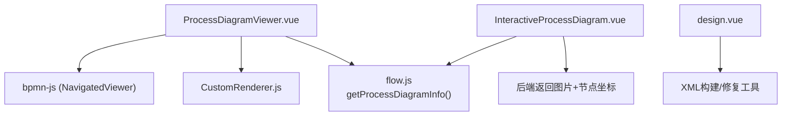
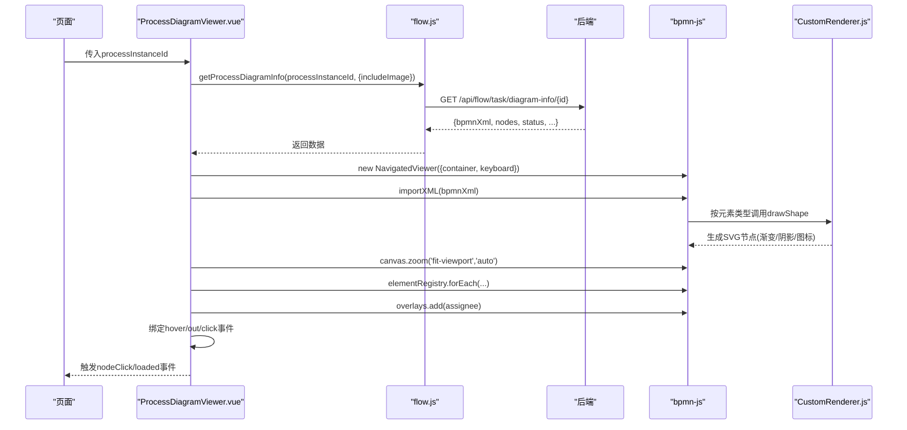
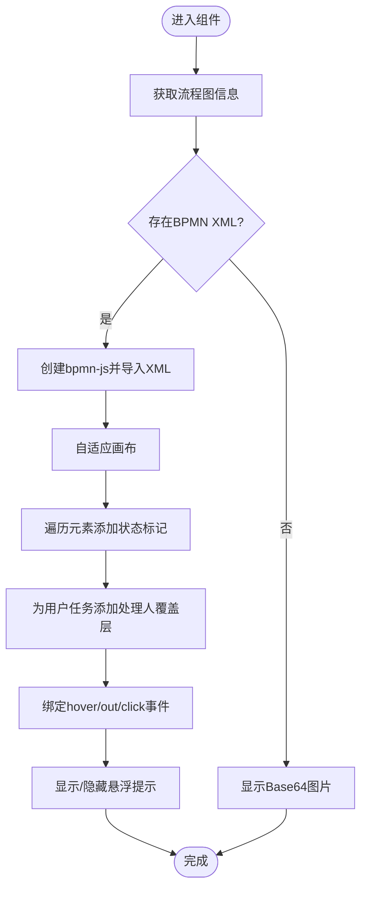
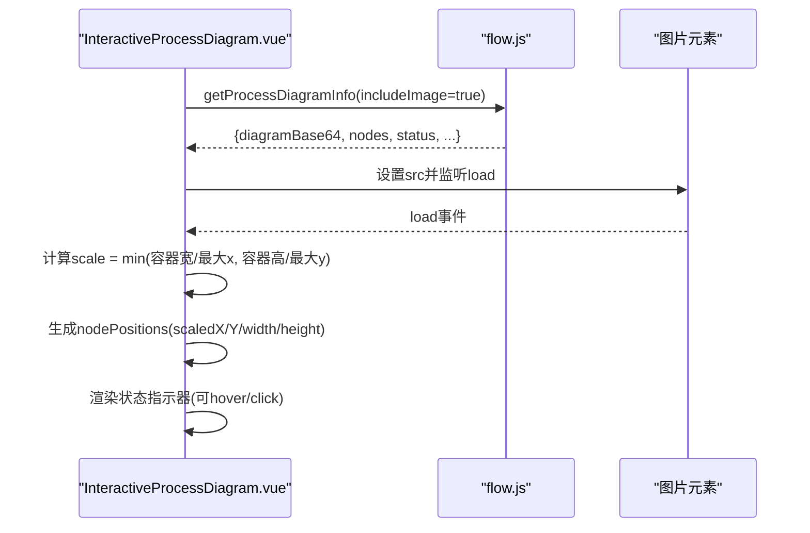
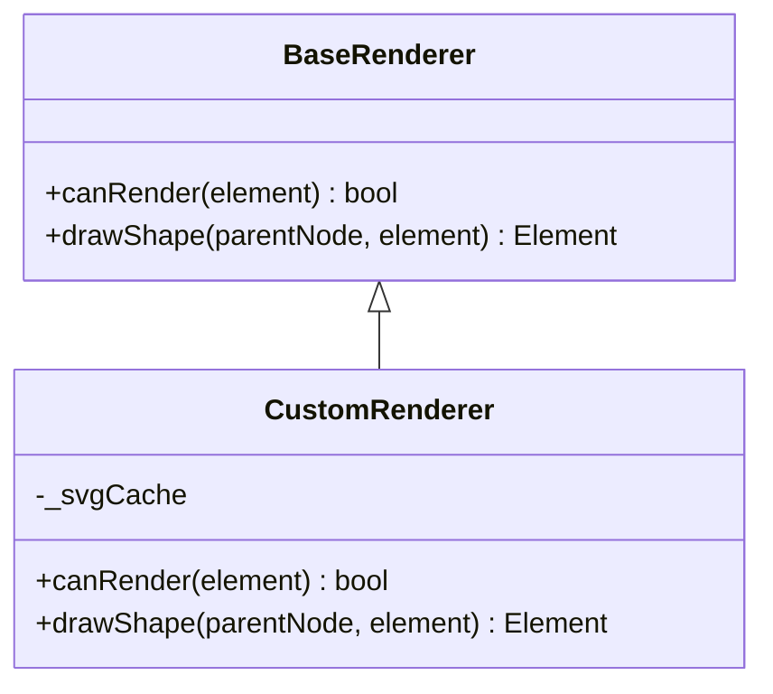
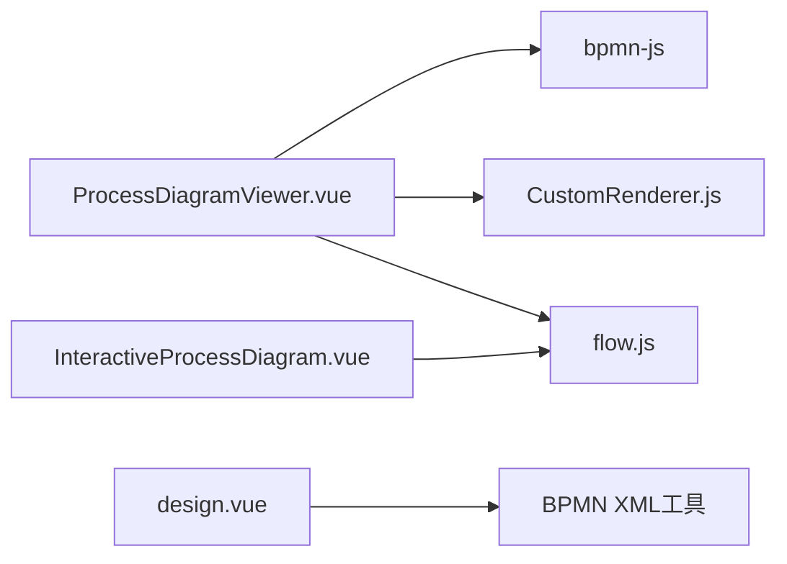

# 流程图查看器

<cite>
**本文引用的文件**
- [ProcessDiagramViewer.vue](file://forge-admin-ui/src/components/bpmn/ProcessDiagramViewer.vue)
- [InteractiveProcessDiagram.vue](file://forge-admin-ui/src/components/bpmn/InteractiveProcessDiagram.vue)
- [CustomRenderer.js](file://forge-admin-ui/src/components/bpmn/CustomRenderer.js)
- [flow.js](file://forge-admin-ui/src/api/flow.js)
- [design.vue](file://forge-admin-ui/src/views/flow/design.vue)
</cite>

## 目录
1. [简介](#简介)
2. [项目结构](#项目结构)
3. [核心组件](#核心组件)
4. [架构总览](#架构总览)
5. [详细组件分析](#详细组件分析)
6. [依赖关系分析](#依赖关系分析)
7. [性能与大数据量优化](#性能与大数据量优化)
8. [移动端适配方案](#移动端适配方案)
9. [故障排查指南](#故障排查指南)
10. [结论](#结论)
11. [附录：定制开发与集成示例](#附录定制开发与集成示例)

## 简介
本技术文档围绕流程图查看器的两个核心组件展开：ProcessDiagramViewer（基于BPMN-js的交互式SVG渲染）与 InteractiveProcessDiagram（基于图片叠加的状态指示器）。文档深入解析BPMN图形渲染、节点高亮、流程追踪、动画效果、缩放平移、点击交互，以及流程状态可视化、执行路径标记、审批记录展示等业务流程相关能力，并提供性能优化策略、大数据量处理、移动端适配方案与定制开发指南。

## 项目结构
流程图查看器位于前端工程 forge-admin-ui 的 bpmn 组件目录下，主要包含：
- ProcessDiagramViewer.vue：基于bpmn-js的BPMN XML渲染、节点状态标记、悬浮提示、事件绑定
- InteractiveProcessDiagram.vue：基于后端返回的图片进行叠加显示，计算节点位置并展示状态指示器
- CustomRenderer.js：自定义BPMN节点SVG绘制器，提供渐变、阴影、图标等视觉增强
- flow.js：流程API封装，提供获取流程图信息、历史、表单等接口
- design.vue：流程设计器中用于构建/修复BPMN XML及图形信息的工具函数

图表来源
- [ProcessDiagramViewer.vue:239-324](file://forge-admin-ui/src/components/bpmn/ProcessDiagramViewer.vue#L239-L324)
- [InteractiveProcessDiagram.vue:241-282](file://forge-admin-ui/src/components/bpmn/InteractiveProcessDiagram.vue#L241-L282)
- [CustomRenderer.js:126-303](file://forge-admin-ui/src/components/bpmn/CustomRenderer.js#L126-L303)
- [flow.js:88-95](file://forge-admin-ui/src/api/flow.js#L88-L95)
- [design.vue:3262-3464](file://forge-admin-ui/src/views/flow/design.vue#L3262-L3464)

章节来源
- [ProcessDiagramViewer.vue:1-755](file://forge-admin-ui/src/components/bpmn/ProcessDiagramViewer.vue#L1-L755)
- [InteractiveProcessDiagram.vue:1-667](file://forge-admin-ui/src/components/bpmn/InteractiveProcessDiagram.vue#L1-L667)
- [CustomRenderer.js:1-312](file://forge-admin-ui/src/components/bpmn/CustomRenderer.js#L1-L312)
- [flow.js:1-600](file://forge-admin-ui/src/api/flow.js#L1-L600)
- [design.vue:3262-3464](file://forge-admin-ui/src/views/flow/design.vue#L3262-L3464)

## 核心组件
- ProcessDiagramViewer
  - 使用bpmn-js的NavigatedViewer加载BPMN XML，支持键盘导航、缩放、平移
  - 通过canvas.addMarker为节点添加状态样式（已完成/进行中/待处理）
  - 为用户任务添加处理人覆盖层（overlays），显示处理人标签
  - 监听element.hover/out/click事件，实现悬浮提示与点击回调
  - 支持紧凑模式与图片回退（当无BPMN XML时显示Base64图片）
- InteractiveProcessDiagram
  - 接收后端返回的流程图图片与节点坐标，动态计算缩放比例以对齐节点
  - 在图片上方叠加状态指示器（圆形图标），支持hover与click
  - 提供图例与状态标签，展示流程状态、发起人、发起时间
- CustomRenderer
  - 继承diagram-js的BaseRenderer，重写drawShape，为各类BPMN元素绘制带渐变和阴影的SVG
  - 内置多种节点类型（开始/结束/用户任务/服务任务/脚本任务/网关/子流程）的视觉样式
  - 通过defs缓存渐变与滤镜，避免重复创建，提升渲染性能

章节来源
- [ProcessDiagramViewer.vue:239-324](file://forge-admin-ui/src/components/bpmn/ProcessDiagramViewer.vue#L239-L324)
- [InteractiveProcessDiagram.vue:218-297](file://forge-admin-ui/src/components/bpmn/InteractiveProcessDiagram.vue#L218-L297)
- [CustomRenderer.js:126-303](file://forge-admin-ui/src/components/bpmn/CustomRenderer.js#L126-L303)

## 架构总览
流程图查看器采用“数据驱动 + 渲染引擎”的分层架构：
- 数据层：通过flow.js调用后端接口获取流程图信息与节点状态
- 视图层：ProcessDiagramViewer与InteractiveProcessDiagram分别负责BPMN SVG渲染与图片叠加渲染
- 渲染引擎：bpmn-js + 自定义CustomRenderer，提供高性能SVG绘制与交互
- 业务层：节点状态映射、执行路径标记、审批记录展示、流程状态可视化

图表来源
- [ProcessDiagramViewer.vue:211-324](file://forge-admin-ui/src/components/bpmn/ProcessDiagramViewer.vue#L211-L324)
- [CustomRenderer.js:126-303](file://forge-admin-ui/src/components/bpmn/CustomRenderer.js#L126-L303)
- [flow.js:88-95](file://forge-admin-ui/src/api/flow.js#L88-L95)

## 详细组件分析

### ProcessDiagramViewer 组件
- 功能要点
  - 加载流程图信息：调用flowApi.getProcessDiagramInfo，支持includeImage参数
  - BPMN渲染：创建bpmn-js实例，导入XML，自适应画布
  - 节点状态高亮：根据nodes构建Map，遍历elementRegistry添加status标记
  - 处理人标记：对用户任务添加overlays显示处理人列表
  - 交互：element.hover/out/click事件，悬浮提示与点击回调
  - 回退：若无BPMN XML则显示Base64图片
- 关键流程
  - fetchDiagramInfo -> renderBpmn -> 构建节点状态映射 -> 添加标记与覆盖层 -> 绑定事件
  - 鼠标移动更新tooltip位置，组件卸载时销毁viewer并移除事件

图表来源
- [ProcessDiagramViewer.vue:211-324](file://forge-admin-ui/src/components/bpmn/ProcessDiagramViewer.vue#L211-L324)
- [ProcessDiagramViewer.vue:326-339](file://forge-admin-ui/src/components/bpmn/ProcessDiagramViewer.vue#L326-L339)

章节来源
- [ProcessDiagramViewer.vue:211-324](file://forge-admin-ui/src/components/bpmn/ProcessDiagramViewer.vue#L211-L324)
- [ProcessDiagramViewer.vue:326-339](file://forge-admin-ui/src/components/bpmn/ProcessDiagramViewer.vue#L326-L339)
- [ProcessDiagramViewer.vue:431-445](file://forge-admin-ui/src/components/bpmn/ProcessDiagramViewer.vue#L431-L445)

### InteractiveProcessDiagram 组件
- 功能要点
  - 图片加载后计算缩放比例，使节点坐标与图片像素对齐
  - 在图片上方叠加状态指示器，支持hover与click
  - 提供图例与状态标签，展示流程状态、发起人、发起时间
- 关键流程
  - onImageLoad：计算scale，确保节点位置正确
  - nodePositions：根据scale计算scaledX/Y/width/height
  - showNodeTooltip/hideNodeTooltip：控制悬浮提示显示与位置
  - handleNodeClick：触发nodeClick事件

图表来源
- [InteractiveProcessDiagram.vue:241-282](file://forge-admin-ui/src/components/bpmn/InteractiveProcessDiagram.vue#L241-L282)
- [InteractiveProcessDiagram.vue:218-233](file://forge-admin-ui/src/components/bpmn/InteractiveProcessDiagram.vue#L218-L233)

章节来源
- [InteractiveProcessDiagram.vue:241-282](file://forge-admin-ui/src/components/bpmn/InteractiveProcessDiagram.vue#L241-L282)
- [InteractiveProcessDiagram.vue:218-233](file://forge-admin-ui/src/components/bpmn/InteractiveProcessDiagram.vue#L218-L233)
- [InteractiveProcessDiagram.vue:299-318](file://forge-admin-ui/src/components/bpmn/InteractiveProcessDiagram.vue#L299-L318)

### CustomRenderer 自定义渲染器
- 功能要点
  - 继承BaseRenderer，重写canRender与drawShape
  - 为不同BPMN元素绘制带渐变与阴影的SVG，提升视觉效果
  - 使用defs缓存渐变与滤镜，避免重复创建，提高性能
- 关键流程
  - ensureDefs/createGradient/createShadowFilter：初始化SVG定义
  - drawShape：根据元素类型绘制形状、图标、文本
  - 支持子流程折叠/展开的视觉表现

图表来源
- [CustomRenderer.js:126-141](file://forge-admin-ui/src/components/bpmn/CustomRenderer.js#L126-L141)
- [CustomRenderer.js:143-303](file://forge-admin-ui/src/components/bpmn/CustomRenderer.js#L143-L303)

章节来源
- [CustomRenderer.js:126-303](file://forge-admin-ui/src/components/bpmn/CustomRenderer.js#L126-L303)

## 依赖关系分析
- ProcessDiagramViewer依赖bpmn-js与CustomRenderer，通过flow.js获取数据
- InteractiveProcessDiagram依赖flow.js与后端图片资源
- design.vue提供BPMN XML构建与修复工具，辅助流程设计与导出

图表来源
- [ProcessDiagramViewer.vue:239-324](file://forge-admin-ui/src/components/bpmn/ProcessDiagramViewer.vue#L239-L324)
- [InteractiveProcessDiagram.vue:241-282](file://forge-admin-ui/src/components/bpmn/InteractiveProcessDiagram.vue#L241-L282)
- [CustomRenderer.js:126-303](file://forge-admin-ui/src/components/bpmn/CustomRenderer.js#L126-L303)
- [flow.js:88-95](file://forge-admin-ui/src/api/flow.js#L88-L95)
- [design.vue:3262-3464](file://forge-admin-ui/src/views/flow/design.vue#L3262-L3464)

章节来源
- [ProcessDiagramViewer.vue:239-324](file://forge-admin-ui/src/components/bpmn/ProcessDiagramViewer.vue#L239-L324)
- [InteractiveProcessDiagram.vue:241-282](file://forge-admin-ui/src/components/bpmn/InteractiveProcessDiagram.vue#L241-L282)
- [CustomRenderer.js:126-303](file://forge-admin-ui/src/components/bpmn/CustomRenderer.js#L126-L303)
- [flow.js:88-95](file://forge-admin-ui/src/api/flow.js#L88-L95)
- [design.vue:3262-3464](file://forge-admin-ui/src/views/flow/design.vue#L3262-L3464)

## 性能与大数据量优化
- 渲染性能
  - 使用bpmn-js的NavigatedViewer，支持虚拟滚动与按需渲染
  - CustomRenderer通过defs缓存渐变与滤镜，避免重复创建
  - 使用canvas.addMarker批量添加状态样式，减少DOM操作
- 大数据量处理
  - 对节点数量较多的流程，建议启用懒加载或分页渲染
  - 使用IntersectionObserver仅渲染可视区域节点
  - 将复杂节点拆分为子流程，降低单次渲染压力
- 动画与交互
  - 使用CSS动画（如pulse）表示运行中节点，避免JS重绘
  - 限制tooltip更新频率，使用requestAnimationFrame优化鼠标移动事件
- 内存管理
  - 组件卸载时销毁bpmn-js实例，移除事件监听，防止内存泄漏
  - 及时释放图片对象与缓存数据

章节来源
- [ProcessDiagramViewer.vue:431-445](file://forge-admin-ui/src/components/bpmn/ProcessDiagramViewer.vue#L431-L445)
- [CustomRenderer.js:33-72](file://forge-admin-ui/src/components/bpmn/CustomRenderer.js#L33-L72)
- [InteractiveProcessDiagram.vue:522-542](file://forge-admin-ui/src/components/bpmn/InteractiveProcessDiagram.vue#L522-L542)

## 移动端适配方案
- 响应式布局
  - 使用flex布局与百分比宽度，适配不同屏幕尺寸
  - 紧凑模式下调整高度，减少垂直空间占用
- 触摸交互
  - 利用bpmn-js内置的触摸支持，实现缩放与平移
  - 为状态指示器增加触摸反馈，提升用户体验
- 性能优化
  - 移动端禁用复杂动画，减少GPU压力
  - 使用图片回退模式，避免SVG渲染开销

章节来源
- [ProcessDiagramViewer.vue:454-525](file://forge-admin-ui/src/components/bpmn/ProcessDiagramViewer.vue#L454-L525)
- [InteractiveProcessDiagram.vue:452-467](file://forge-admin-ui/src/components/bpmn/InteractiveProcessDiagram.vue#L452-L467)

## 故障排查指南
- 常见问题
  - BPMN XML解析失败：检查XML格式与命名空间
  - 节点状态未显示：确认nodes数据与elementRegistry匹配
  - 图片无法加载：检查Base64格式与跨域策略
- 调试方法
  - 使用浏览器开发者工具检查网络请求与DOM结构
  - 在renderBpmn中添加日志，跟踪渲染流程
  - 验证CustomRenderer的canRender与drawShape逻辑
- 错误处理
  - 捕获importXML异常，设置renderFailed状态
  - 提供空状态与错误提示，提升用户体验

章节来源
- [ProcessDiagramViewer.vue:320-324](file://forge-admin-ui/src/components/bpmn/ProcessDiagramViewer.vue#L320-L324)
- [design.vue:3262-3283](file://forge-admin-ui/src/views/flow/design.vue#L3262-L3283)

## 结论
流程图查看器通过ProcessDiagramViewer与InteractiveProcessDiagram两种渲染方式，结合bpmn-js与自定义CustomRenderer，实现了高性能、可扩展的BPMN图形展示。组件支持节点高亮、流程追踪、审批记录展示等核心功能，并提供完善的性能优化与移动端适配方案。通过合理的架构设计与模块化实现，便于后续扩展与定制开发。

## 附录：定制开发与集成示例
- 集成步骤
  - 引入ProcessDiagramViewer或InteractiveProcessDiagram组件
  - 传入processInstanceId与可选参数（如compact、includeImage）
  - 监听nodeClick与loaded事件，实现业务逻辑
- 定制样式
  - 通过CSS变量或主题配置修改节点颜色与动画
  - 扩展CustomRenderer以支持新的节点类型与图标
- 性能调优
  - 针对大数据量流程，启用懒加载与分页渲染
  - 使用Web Worker处理复杂计算，避免主线程阻塞
- 示例代码路径
  - 组件使用示例：[ProcessDiagramViewer.vue:137-158](file://forge-admin-ui/src/components/bpmn/ProcessDiagramViewer.vue#L137-L158)
  - API调用示例：[flow.js:88-95](file://forge-admin-ui/src/api/flow.js#L88-L95)
  - 自定义渲染器：[CustomRenderer.js:126-303](file://forge-admin-ui/src/components/bpmn/CustomRenderer.js#L126-L303)

章节来源
- [ProcessDiagramViewer.vue:137-158](file://forge-admin-ui/src/components/bpmn/ProcessDiagramViewer.vue#L137-L158)
- [flow.js:88-95](file://forge-admin-ui/src/api/flow.js#L88-L95)
- [CustomRenderer.js:126-303](file://forge-admin-ui/src/components/bpmn/CustomRenderer.js#L126-L303)