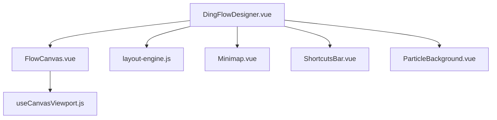
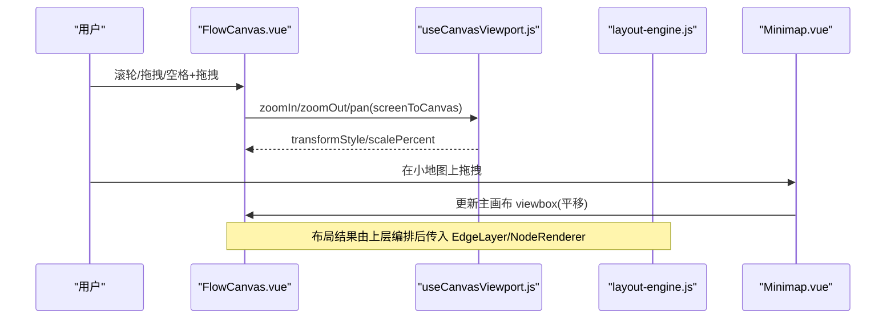
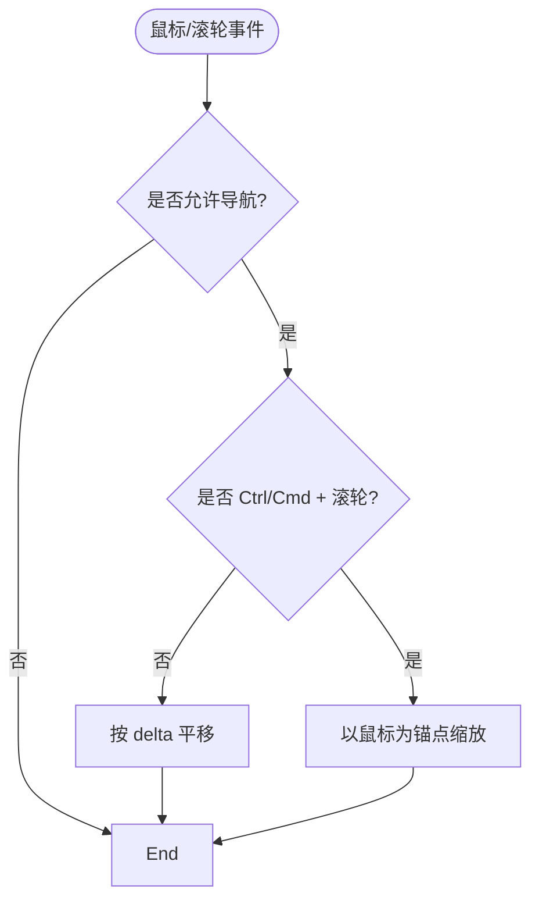
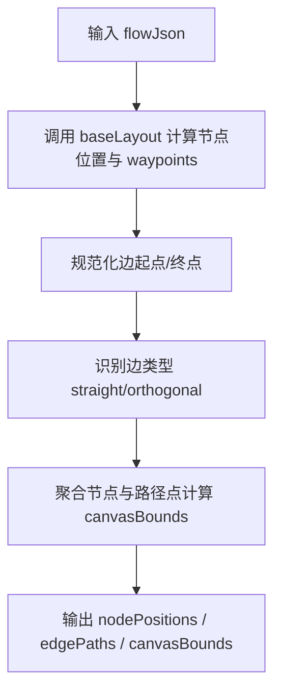
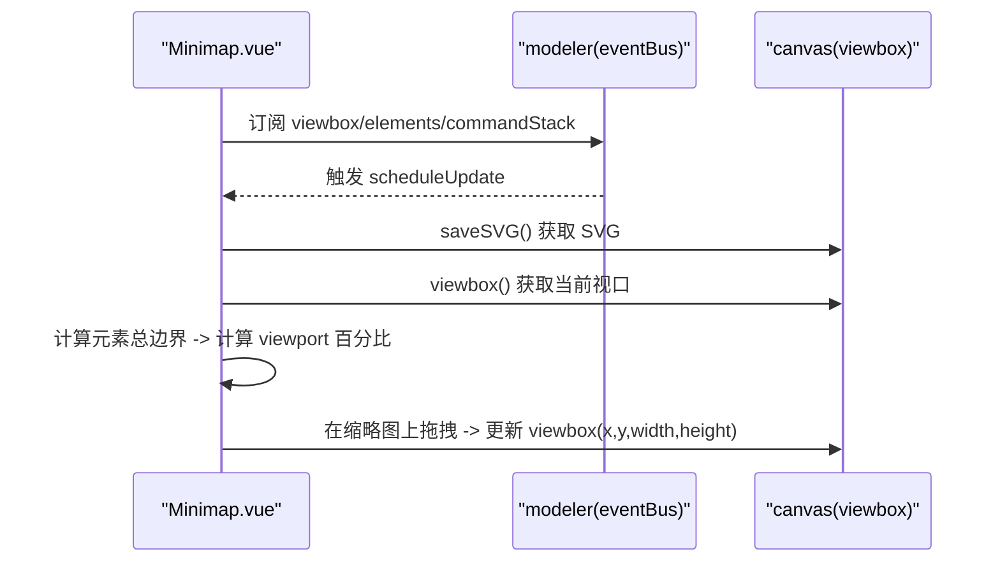
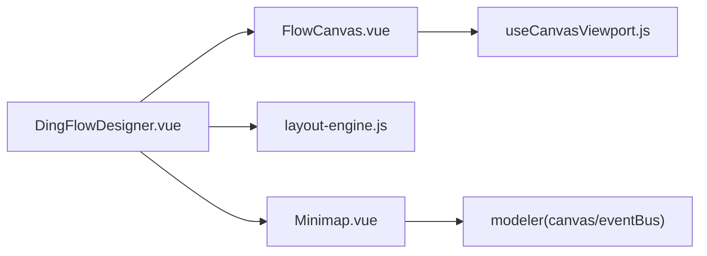

# 画布增强功能

<cite>
**本文引用的文件**
- [FlowCanvas.vue](file://forge-admin-ui/src/components/flow-designer/canvas/FlowCanvas.vue)
- [useCanvasViewport.js](file://forge-admin-ui/src/components/flow-designer/composables/useCanvasViewport.js)
- [layout-engine.js](file://forge-admin-ui/src/components/flow-designer/canvas/layout-engine.js)
- [BusinessProcessLayout.js](file://forge-admin-ui/src/components/business-process-designer/business-process-layout.js)
- [Minimap.vue](file://forge-admin-ui/src/components/bpmn/Minimap.vue)
- [ShortcutsBar.vue](file://forge-admin-ui/src/components/bpmn/ShortcutsBar.vue)
- [ParticleBackground.vue](file://forge-admin-ui/src/components/common/ParticleBackground.vue)
- [DingFlowDesigner.vue](file://forge-admin-ui/src/components/flow-designer/DingFlowDesigner.vue)
</cite>

## 目录
1. [简介](#简介)
2. [项目结构](#项目结构)
3. [核心组件](#核心组件)
4. [架构总览](#架构总览)
5. [详细组件分析](#详细组件分析)
6. [依赖关系分析](#依赖关系分析)
7. [性能考量](#性能考量)
8. [故障排查指南](#故障排查指南)
9. [结论](#结论)
10. [附录](#附录)

## 简介
本技术文档围绕画布增强能力展开，系统解析以下能力的实现原理与交互设计：
- CanvasBackground 背景系统：网格背景、对齐辅助线、智能连线、批量操作等编辑辅助。
- AutoLayout 自动布局算法：节点间距计算、层级排布、路径类型识别与优化。
- Minimap 小地图导航：SVG 缩略图、视口矩形、拖拽平移主画布。
- ShortcutsBar 快捷键系统：常用快捷键提示与行为映射（撤销/重做/复制粘贴/删除/全选/缩放/平移）。
同时覆盖键盘快捷键映射、鼠标手势操作、触摸设备适配建议，并提供画布扩展开发指南与性能调优建议。

## 项目结构
画布增强功能主要分布在流程设计器与通用画布容器中，关键位置如下：
- 画布容器与交互：FlowCanvas.vue 提供缩放、平移、滚轮、空格+拖拽等基础交互；配合 useCanvasViewport.js 管理视图变换。
- 自动布局：layout-engine.js 负责渲染层布局（节点位置、边路径、画布边界），复用 converter 的几何计算；business-process-layout.js 提供 BPMN 场景下的布局策略与回退定位。
- 小地图：Minimap.vue 通过 modeler.saveSVG() 获取 SVG 内容并绘制可视区域矩形，支持拖拽平移主画布。
- 快捷键提示：ShortcutsBar.vue 展示常用快捷键组合。
- 背景装饰：ParticleBackground.vue 提供粒子背景效果（可选装饰）。
- 集成入口：DingFlowDesigner.vue 将 FlowCanvas、EdgeLayer、NodeRenderer 等组合为完整设计器界面。

图表来源
- [DingFlowDesigner.vue:668-760](file://forge-admin-ui/src/components/flow-designer/DingFlowDesigner.vue#L668-L760)
- [FlowCanvas.vue:1-262](file://forge-admin-ui/src/components/flow-designer/canvas/FlowCanvas.vue#L1-L262)
- [useCanvasViewport.js](file://forge-admin-ui/src/components/flow-designer/composables/useCanvasViewport.js)
- [layout-engine.js:1-132](file://forge-admin-ui/src/components/flow-designer/canvas/layout-engine.js#L1-L132)
- [Minimap.vue:1-353](file://forge-admin-ui/src/components/bpmn/Minimap.vue#L1-L353)
- [ShortcutsBar.vue:1-95](file://forge-admin-ui/src/components/bpmn/ShortcutsBar.vue#L1-L95)
- [ParticleBackground.vue:1-272](file://forge-admin-ui/src/components/common/ParticleBackground.vue#L1-L272)

章节来源
- [FlowCanvas.vue:1-262](file://forge-admin-ui/src/components/flow-designer/canvas/FlowCanvas.vue#L1-L262)
- [layout-engine.js:1-132](file://forge-admin-ui/src/components/flow-designer/canvas/layout-engine.js#L1-L132)
- [Minimap.vue:1-353](file://forge-admin-ui/src/components/bpmn/Minimap.vue#L1-L353)
- [ShortcutsBar.vue:1-95](file://forge-admin-ui/src/components/bpmn/ShortcutsBar.vue#L1-L95)
- [ParticleBackground.vue:1-272](file://forge-admin-ui/src/components/common/ParticleBackground.vue#L1-L272)
- [DingFlowDesigner.vue:668-760](file://forge-admin-ui/src/components/flow-designer/DingFlowDesigner.vue#L668-L760)

## 核心组件
- FlowCanvas 画布容器
  - 职责：提供 transform 缩放/平移容器；处理滚轮缩放（Ctrl/Cmd + 滚轮）、普通滚轮平移、空格+拖拽平移、中键拖拽平移；暴露 resetView/fitToScreen/zoomIn/zoomOut/setScale/screenToCanvas/canvasToScreen 等方法。
  - 背景：使用 CSS 径向渐变+线性渐变模拟点阵网格背景，便于对齐与视觉参考。
  - 工具栏：内置放大/缩小/适应画布按钮，支持自定义 toolbar slot。
- useCanvasViewport 视图变换
  - 职责：封装缩放、平移、坐标转换、视口状态；被 FlowCanvas 调用以驱动 transformStyle。
- layout-engine 渲染层布局引擎
  - 职责：基于 converter 的 calculateLayout 输出节点位置 Map 与原始 waypoints；识别边类型（直线或正交）；计算 canvasBounds 用于 fitToScreen。
- BusinessProcessLayout 业务布局
  - 职责：BPMN 场景下的节点定位、回退定位、画布边界计算；支持 margin/rankGap/nodeWidth/nodeHeight 等配置。
- Minimap 小地图
  - 职责：订阅 modeler 事件，保存 SVG 作为缩略图；计算元素边界；绘制当前视口矩形；支持在缩略图上拖拽平移主画布。
- ShortcutsBar 快捷键提示
  - 职责：展示常用快捷键组合（撤销/重做/复制/粘贴/删除/全选/缩放/平移），不直接绑定逻辑，仅提示。
- ParticleBackground 粒子背景
  - 职责：Canvas 粒子动画，支持连线、鼠标交互、透明度、数量、速度等参数；可用作装饰背景。

章节来源
- [FlowCanvas.vue:1-262](file://forge-admin-ui/src/components/flow-designer/canvas/FlowCanvas.vue#L1-L262)
- [useCanvasViewport.js](file://forge-admin-ui/src/components/flow-designer/composables/useCanvasViewport.js)
- [layout-engine.js:1-132](file://forge-admin-ui/src/components/flow-designer/canvas/layout-engine.js#L1-L132)
- [BusinessProcessLayout.js:167-497](file://forge-admin-ui/src/components/business-process-designer/business-process-layout.js#L167-L497)
- [Minimap.vue:1-353](file://forge-admin-ui/src/components/bpmn/Minimap.vue#L1-L353)
- [ShortcutsBar.vue:1-95](file://forge-admin-ui/src/components/bpmn/ShortcutsBar.vue#L1-L95)
- [ParticleBackground.vue:1-272](file://forge-admin-ui/src/components/common/ParticleBackground.vue#L1-L272)

## 架构总览
画布增强由“容器交互 + 布局引擎 + 导航辅助 + 快捷键提示”构成。FlowCanvas 负责输入与视图变换；layout-engine 与 business-process-layout 负责布局计算；Minimap 提供全局导航；ShortcutsBar 提供用户引导；DingFlowDesigner 将这些能力组合为完整工作区。

图表来源
- [FlowCanvas.vue:61-116](file://forge-admin-ui/src/components/flow-designer/canvas/FlowCanvas.vue#L61-L116)
- [useCanvasViewport.js](file://forge-admin-ui/src/components/flow-designer/composables/useCanvasViewport.js)
- [Minimap.vue:154-184](file://forge-admin-ui/src/components/bpmn/Minimap.vue#L154-L184)
- [layout-engine.js:34-111](file://forge-admin-ui/src/components/flow-designer/canvas/layout-engine.js#L34-L111)

## 详细组件分析

### FlowCanvas 画布容器与交互
- 缩放与平移
  - Ctrl/Cmd + 滚轮：以鼠标位置为锚点进行缩放。
  - 普通滚轮：按 deltaX/deltaY 进行平移。
  - 空格+左键拖拽/中键拖拽：进入平移模式，光标变为 grab/grabbing。
- 双击空白：触发 canvasDblclick 事件，可由父组件实现“适应屏幕”等行为。
- 暴露 API：resetView、fitToScreen、zoomIn、zoomOut、setScale、screenToCanvas、canvasToScreen、viewport。
- 背景网格：CSS 径向渐变+线性渐变生成点阵网格，尺寸 20px 间距，便于对齐。

图表来源
- [FlowCanvas.vue:61-116](file://forge-admin-ui/src/components/flow-designer/canvas/FlowCanvas.vue#L61-L116)

章节来源
- [FlowCanvas.vue:1-262](file://forge-admin-ui/src/components/flow-designer/canvas/FlowCanvas.vue#L1-L262)

### AutoLayout 自动布局算法
- 渲染层布局（layout-engine.js）
  - 复用 converter 的 calculateLayout 计算节点位置与原始 waypoints。
  - 边类型识别：同 x 方向为 straight，否则 orthogonal。
  - 规范化边起点/终点：根据源/目标节点中心与上下关系确定连接点。
  - 计算 canvasBounds：聚合所有节点与 waypoint 坐标，供 fitToScreen 使用。
- 业务布局（business-process-layout.js）
  - positionDagreNodes：从 DAG 布局结果映射到画布坐标，考虑 marginX/Y、nodeWidth/Height、rankGap。
  - fallbackPosition：当无布局结果时，按 index 垂直排列。
  - calculateBounds：汇总节点与边路径点，计算带 padding 的画布边界。

图表来源
- [layout-engine.js:34-111](file://forge-admin-ui/src/components/flow-designer/canvas/layout-engine.js#L34-L111)
- [BusinessProcessLayout.js:167-214](file://forge-admin-ui/src/components/business-process-designer/business-process-layout.js#L167-L214)
- [BusinessProcessLayout.js:476-497](file://forge-admin-ui/src/components/business-process-designer/business-process-layout.js#L476-L497)

章节来源
- [layout-engine.js:1-132](file://forge-admin-ui/src/components/flow-designer/canvas/layout-engine.js#L1-L132)
- [BusinessProcessLayout.js:167-497](file://forge-admin-ui/src/components/business-process-designer/business-process-layout.js#L167-L497)

### Minimap 小地图导航
- 数据源：通过 modeler.saveSVG() 获取 SVG 内容，作为缩略图显示。
- 视口矩形：读取 canvas.viewbox() 与元素总边界，计算百分比位置与宽高，叠加 viewport 矩形。
- 拖拽平移：在缩略图上 mousedown/mousemove/mouseup 事件中，将相对坐标映射到主画布坐标系，更新 viewbox。
- 事件订阅：监听 canvas.viewbox.changed、commandStack.changed、elements.changed，延迟更新以避免频繁重绘。

图表来源
- [Minimap.vue:68-109](file://forge-admin-ui/src/components/bpmn/Minimap.vue#L68-L109)
- [Minimap.vue:111-152](file://forge-admin-ui/src/components/bpmn/Minimap.vue#L111-L152)
- [Minimap.vue:154-184](file://forge-admin-ui/src/components/bpmn/Minimap.vue#L154-L184)
- [Minimap.vue:198-233](file://forge-admin-ui/src/components/bpmn/Minimap.vue#L198-L233)

章节来源
- [Minimap.vue:1-353](file://forge-admin-ui/src/components/bpmn/Minimap.vue#L1-L353)

### ShortcutsBar 快捷键系统
- 作用：展示常用快捷键组合，帮助用户快速上手。
- 常见映射（仅提示，实际行为由上层实现）：
  - Ctrl+Z：撤销
  - Ctrl+Y：重做
  - Ctrl+C / Ctrl+V：复制/粘贴
  - Delete：删除
  - Ctrl+A：全选
  - Ctrl+滚轮：缩放
  - Space+拖拽：平移

章节来源
- [ShortcutsBar.vue:1-95](file://forge-admin-ui/src/components/bpmn/ShortcutsBar.vue#L1-L95)

### 背景系统与编辑辅助
- 网格背景：FlowCanvas 使用 CSS 渐变绘制点阵网格，提供视觉对齐参考。
- 对齐辅助线：可在节点拖拽过程中结合 snap-to-grid 与边缘吸附逻辑（由上层 NodeRenderer/EdgeLayer 实现），此处以网格为基础。
- 智能连线：layout-engine 根据节点相对位置与类型选择 straight 或 orthogonal 路径，提升可读性。
- 批量操作：可通过命令栈（commandStack）与批量更新接口（如批量移动/删除）结合 undo/redo 机制实现，Minimap 会响应 elements.changed 事件。

章节来源
- [FlowCanvas.vue:198-211](file://forge-admin-ui/src/components/flow-designer/canvas/FlowCanvas.vue#L198-L211)
- [layout-engine.js:113-132](file://forge-admin-ui/src/components/flow-designer/canvas/layout-engine.js#L113-L132)
- [Minimap.vue:198-233](file://forge-admin-ui/src/components/bpmn/Minimap.vue#L198-L233)

### 键盘快捷键映射与鼠标手势
- 键盘
  - Space：切换平移模式（FlowCanvas 内部维护 isSpaceDown）。
  - Ctrl/Cmd + 滚轮：缩放（FlowCanvas 内部处理）。
  - 其他快捷键（撤销/重做/复制/粘贴/删除/全选）：由 ShortcutsBar 提示，具体绑定由上层统一处理。
- 鼠标
  - 中键拖拽：平移。
  - 空格+左键拖拽：平移。
  - 左键点击空白：平移（当未命中子元素时）。
- 触摸设备适配建议
  - 使用 touchstart/touchmove/touchend 模拟拖拽平移。
  - 双指捏合缩放：计算两指距离变化映射为 scale。
  - 避免与浏览器默认滚动冲突：preventDefault 并在必要时设置 overscroll-behavior。

章节来源
- [FlowCanvas.vue:83-139](file://forge-admin-ui/src/components/flow-designer/canvas/FlowCanvas.vue#L83-L139)
- [ShortcutsBar.vue:1-95](file://forge-admin-ui/src/components/bpmn/ShortcutsBar.vue#L1-L95)

### 画布扩展开发指南
- 新增背景样式
  - 在 FlowCanvas 的样式中扩展 background-image/background-size，或使用 ParticleBackground 作为装饰层。
- 接入新布局策略
  - 在 layout-engine 中扩展 opts 配置项（如 NODE_WIDTH、H_GAP、V_GAP），或在 business-process-layout 中调整 rankGap、marginX/Y。
- 增强连线算法
  - 在 normalizeEdgePoints 中增加分支条件（如弯折次数限制、避让规则）。
- 扩展小地图
  - 在 Minimap 中增加更多交互（如右键菜单、缩放联动），注意节流与防抖。
- 集成快捷键
  - 在顶层注册全局快捷键处理器，与 ShortcutsBar 保持一致的提示文案。

章节来源
- [FlowCanvas.vue:1-262](file://forge-admin-ui/src/components/flow-designer/canvas/FlowCanvas.vue#L1-L262)
- [layout-engine.js:22-35](file://forge-admin-ui/src/components/flow-designer/canvas/layout-engine.js#L22-L35)
- [BusinessProcessLayout.js:167-214](file://forge-admin-ui/src/components/business-process-designer/business-process-layout.js#L167-L214)
- [Minimap.vue:198-233](file://forge-admin-ui/src/components/bpmn/Minimap.vue#L198-L233)

## 依赖关系分析
- FlowCanvas 依赖 useCanvasViewport 提供视图变换能力。
- 布局引擎依赖 converter 的几何计算，输出渲染所需的位置与路径。
- Minimap 依赖 modeler 的 canvas 与 eventBus，以及 saveSVG 能力。
- DingFlowDesigner 组合 FlowCanvas、EdgeLayer、NodeRenderer 等，形成完整设计器。

图表来源
- [FlowCanvas.vue:23-59](file://forge-admin-ui/src/components/flow-designer/canvas/FlowCanvas.vue#L23-L59)
- [DingFlowDesigner.vue:668-760](file://forge-admin-ui/src/components/flow-designer/DingFlowDesigner.vue#L668-L760)
- [Minimap.vue:198-233](file://forge-admin-ui/src/components/bpmn/Minimap.vue#L198-L233)

章节来源
- [FlowCanvas.vue:1-262](file://forge-admin-ui/src/components/flow-designer/canvas/FlowCanvas.vue#L1-L262)
- [DingFlowDesigner.vue:668-760](file://forge-admin-ui/src/components/flow-designer/DingFlowDesigner.vue#L668-L760)
- [Minimap.vue:198-233](file://forge-admin-ui/src/components/bpmn/Minimap.vue#L198-L233)

## 性能考量
- 小地图更新节流
  - Minimap 使用定时器延迟更新（scheduleUpdate），减少 commandStack/elements 变更时的频繁重绘。
- 布局计算复杂度
  - layout-engine 遍历节点与边路径计算 canvasBounds，时间复杂度 O(N+M)，适合中等规模流程图。
- 背景渲染
  - FlowCanvas 使用 CSS 渐变绘制网格，开销低；若启用 ParticleBackground，需控制 particleCount、connectionDistance、speed 等参数，避免高帧率下 CPU/GPU 压力。
- 视图变换
  - 使用 transform 进行缩放/平移，避免重排重绘；尽量批量更新属性后再触发渲染。
- 事件监听
  - 确保在 onUnmounted 中清理事件监听与定时器，防止内存泄漏。

[本节为通用性能建议，无需特定文件引用]

## 故障排查指南
- 小地图不更新
  - 检查 modeler 是否已注入 canvas 与 eventBus；确认事件订阅是否生效；查看 saveSVG 是否抛出异常。
- 视口矩形偏移
  - 核对 getTotalBounds 计算的 minX/minY/maxX/maxY 是否正确；检查 viewbox 坐标与 bounds 的比例换算。
- 平移/缩放无效
  - 确认 navigationEnabled 是否为真；检查 handleWheel/handleMouseDown 的事件拦截与 preventDefault 逻辑。
- 布局结果异常
  - 检查 baseLayout 返回值；确认节点 width/height 与 H_GAP/V_GAP 配置；验证 edge 的 source/target 是否存在。
- 粒子背景卡顿
  - 降低 particleCount、connectionDistance、speed；关闭 showConnections；减少 opacity。

章节来源
- [Minimap.vue:68-109](file://forge-admin-ui/src/components/bpmn/Minimap.vue#L68-L109)
- [Minimap.vue:111-152](file://forge-admin-ui/src/components/bpmn/Minimap.vue#L111-L152)
- [FlowCanvas.vue:61-116](file://forge-admin-ui/src/components/flow-designer/canvas/FlowCanvas.vue#L61-L116)
- [layout-engine.js:79-111](file://forge-admin-ui/src/components/flow-designer/canvas/layout-engine.js#L79-L111)
- [ParticleBackground.vue:145-187](file://forge-admin-ui/src/components/common/ParticleBackground.vue#L145-L187)

## 结论
本方案以 FlowCanvas 为核心交互容器，结合 useCanvasViewport 提供稳定的视图变换能力；通过 layout-engine 与 business-process-layout 实现灵活的自动布局；Minimap 提供高效的全局导航；ShortcutsBar 提升易用性；ParticleBackground 提供可选的背景装饰。整体架构清晰、可扩展性强，适用于复杂流程图设计与可视化编辑场景。

[本节为总结性内容，无需特定文件引用]

## 附录
- 常用配置项
  - FlowCanvas：minScale、maxScale、initialScale、readonly、allowNavigation。
  - layout-engine：NODE_WIDTH、NODE_HEIGHT、GATEWAY_SIZE、V_GAP、H_GAP、MARGIN_TOP、MARGIN_LEFT。
  - business-process-layout：marginX、marginY、nodeWidth、nodeHeight、rankGap。
  - Minimap：visible、modeler。
  - ParticleBackground：particleCount、minSize、maxSize、color、connectionDistance、speed、showConnections、mouseInteraction、mouseRadius、opacity。

[本节为配置说明，无需特定文件引用]