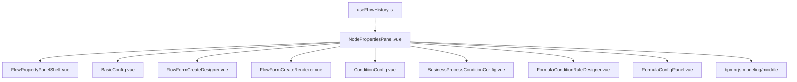
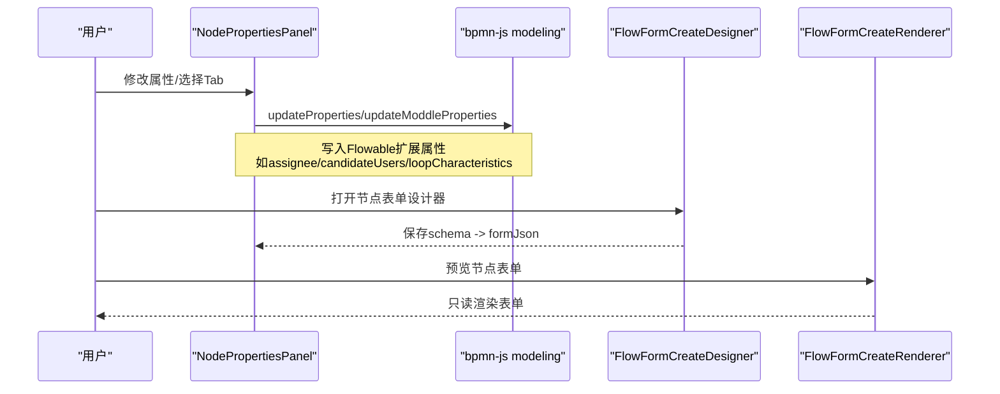
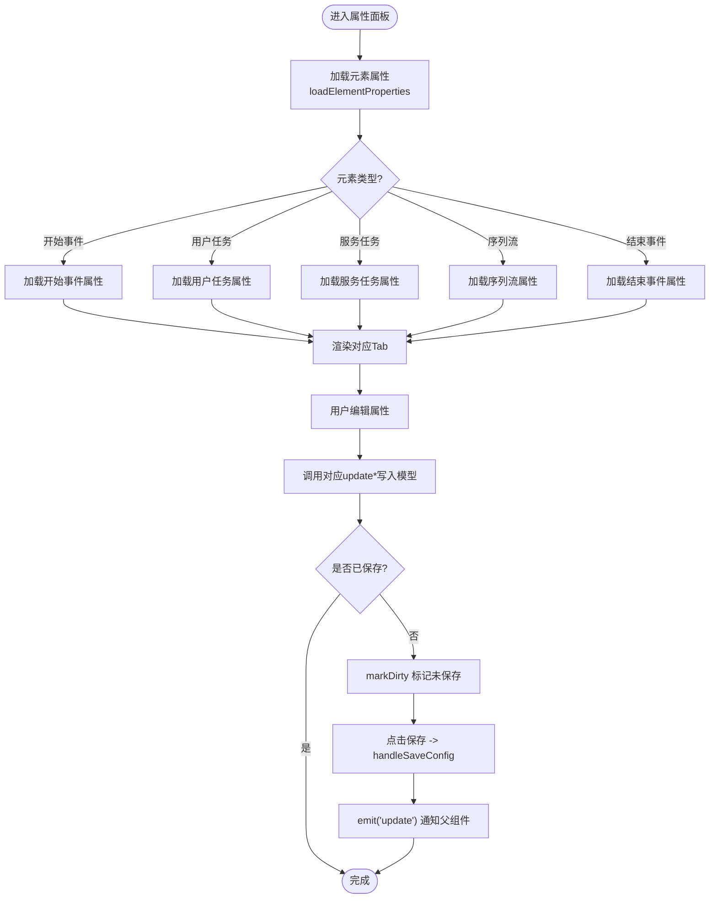
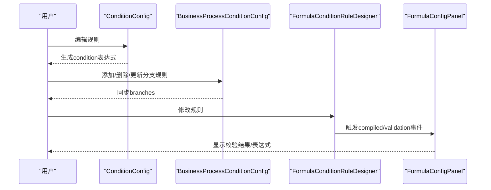
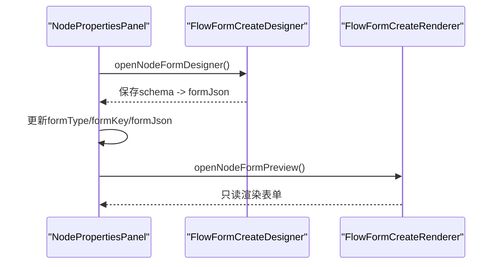
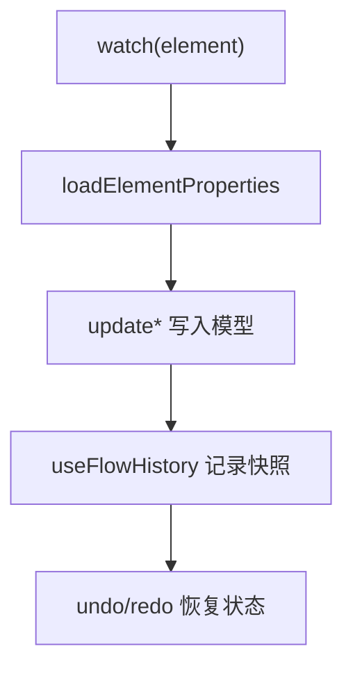
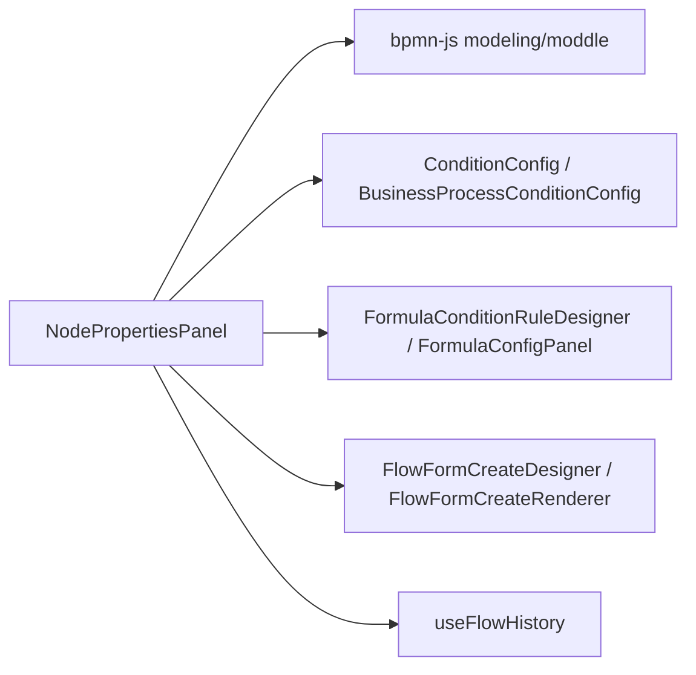

# 节点属性面板

<cite>
**本文引用的文件**
- [NodePropertiesPanel.vue](file://forge-admin-ui/src/components/bpmn/NodePropertiesPanel.vue)
- [FlowPropertyPanelShell.vue](file://forge-admin-ui/src/components/flow/FlowPropertyPanelShell.vue)
- [BasicConfig.vue](file://forge-admin-ui/src/components/flow-designer/panel/BasicConfig.vue)
- [ConditionConfig.vue](file://forge-admin-ui/src/components/flow-designer/panel/ConditionConfig.vue)
- [BusinessProcessConditionConfig.vue](file://forge-admin-ui/src/components/business-process-designer/BusinessProcessConditionConfig.vue)
- [FormulaConditionRuleDesigner.vue](file://forge-admin-ui/src/views/app-center/components/designer/formula/FormulaConditionRuleDesigner.vue)
- [FormulaConfigPanel.vue](file://forge-admin-ui/src/views/app-center/components/designer/formula/FormulaConfigPanel.vue)
- [FlowFormCreateDesigner.vue](file://forge-admin-ui/src/components/form-create/FlowFormCreateDesigner.vue)
- [FlowFormCreateRenderer.vue](file://forge-admin-ui/src/components/form-create/FlowFormCreateRenderer.vue)
- [useFlowHistory.js](file://forge-admin-ui/src/components/flow-designer/composables/useFlowHistory.js)
- [BusinessObjectDesignerService.java](file://forge-server/forge-framework/forge-plugin-parent/forge-plugin-generator/src/main/java/com/mdframe/forge/plugin/generator/service/businessapp/BusinessObjectDesignerService.java)
</cite>

## 目录
1. [简介](#简介)
2. [项目结构](#项目结构)
3. [核心组件](#核心组件)
4. [架构总览](#架构总览)
5. [详细组件分析](#详细组件分析)
6. [依赖关系分析](#依赖关系分析)
7. [性能考量](#性能考量)
8. [故障排查指南](#故障排查指南)
9. [结论](#结论)
10. [附录](#附录)

## 简介
本技术文档围绕“节点属性面板”展开，聚焦 NodePropertiesPanel 组件的动态表单生成机制、节点属性绑定、表单验证、实时预览、条件表达式编辑器与脚本编辑器等高级能力。同时说明属性变更监听、数据同步、撤销重做机制，以及自定义属性字段扩展、表单组件集成与国际化支持，并提供定制开发与性能优化建议。

## 项目结构
- 属性面板主体：位于 BPMN 设计器侧边栏的 NodePropertiesPanel，负责按节点类型动态渲染配置项，并通过 bpmn-js 的 modeling/moddle API 将属性写回模型。
- 通用外壳：FlowPropertyPanelShell 提供统一的标题、描述、关闭按钮与滚动区域。
- 基础配置：BasicConfig 用于节点名称与描述的基础编辑。
- 条件配置：ConditionConfig 与 BusinessProcessConditionConfig 提供可视化规则到表达式的转换与双向回显。
- 公式与校验：FormulaConditionRuleDesigner 与 FormulaConfigPanel 提供本地与后端联合编译、实时校验与预览。
- 动态表单：FlowFormCreateDesigner 与 FlowFormCreateRenderer 提供节点级表单在线设计与预览。
- 历史与撤销重做：useFlowHistory 提供流程 JSON 快照栈与快捷键绑定。

图表来源
- [NodePropertiesPanel.vue:1-989](file://forge-admin-ui/src/components/bpmn/NodePropertiesPanel.vue#L1-L989)
- [FlowPropertyPanelShell.vue:1-38](file://forge-admin-ui/src/components/flow/FlowPropertyPanelShell.vue#L1-L38)
- [BasicConfig.vue:1-50](file://forge-admin-ui/src/components/flow-designer/panel/BasicConfig.vue#L1-L50)
- [FlowFormCreateDesigner.vue:1-38](file://forge-admin-ui/src/components/form-create/FlowFormCreateDesigner.vue#L1-L38)
- [FlowFormCreateRenderer.vue:109-161](file://forge-admin-ui/src/components/form-create/FlowFormCreateRenderer.vue#L109-L161)
- [ConditionConfig.vue:269-319](file://forge-admin-ui/src/components/flow-designer/panel/ConditionConfig.vue#L269-L319)
- [BusinessProcessConditionConfig.vue:81-112](file://forge-admin-ui/src/components/business-process-designer/BusinessProcessConditionConfig.vue#L81-L112)
- [FormulaConditionRuleDesigner.vue:52-159](file://forge-admin-ui/src/views/app-center/components/designer/formula/FormulaConditionRuleDesigner.vue#L52-L159)
- [FormulaConfigPanel.vue:289-356](file://forge-admin-ui/src/views/app-center/components/designer/formula/FormulaConfigPanel.vue#L289-L356)
- [useFlowHistory.js:45-116](file://forge-admin-ui/src/components/flow-designer/composables/useFlowHistory.js#L45-L116)

章节来源
- [NodePropertiesPanel.vue:1-989](file://forge-admin-ui/src/components/bpmn/NodePropertiesPanel.vue#L1-L989)
- [FlowPropertyPanelShell.vue:1-38](file://forge-admin-ui/src/components/flow/FlowPropertyPanelShell.vue#L1-L38)
- [BasicConfig.vue:1-50](file://forge-admin-ui/src/components/flow-designer/panel/BasicConfig.vue#L1-L50)

## 核心组件
- NodePropertiesPanel：根据当前选中元素类型（开始事件、用户任务、服务任务、序列流、结束事件）动态显示对应 Tab；维护 properties 响应式对象，承载所有可编辑属性；通过 update* 方法将变更写入 bpmn-js 模型；提供保存、脏标记、SPEL 模板加载、表单定义加载、节点表单在线设计与预览等功能。
- FlowPropertyPanelShell：统一属性面板外壳，包含标题、描述、关闭按钮与内容区滚动控制。
- BasicConfig：以 v-model 方式双向绑定节点 name 与 documentation，触发父级更新。
- ConditionConfig / BusinessProcessConditionConfig：将可视化规则转换为表达式，并支持高级模式与高级表达式回显。
- FormulaConditionRuleDesigner / FormulaConfigPanel：提供本地与后端条件规则编译、校验反馈、预览与调试入口。
- FlowFormCreateDesigner / FlowFormCreateRenderer：节点级动态表单的设计器与只读预览，支持权限应用与字段联动。
- useFlowHistory：基于 flowJson 快照栈的撤销/重做，支持键盘快捷键。

章节来源
- [NodePropertiesPanel.vue:991-1599](file://forge-admin-ui/src/components/bpmn/NodePropertiesPanel.vue#L991-L1599)
- [FlowPropertyPanelShell.vue:1-38](file://forge-admin-ui/src/components/flow/FlowPropertyPanelShell.vue#L1-L38)
- [BasicConfig.vue:1-50](file://forge-admin-ui/src/components/flow-designer/panel/BasicConfig.vue#L1-L50)
- [ConditionConfig.vue:269-319](file://forge-admin-ui/src/components/flow-designer/panel/ConditionConfig.vue#L269-L319)
- [BusinessProcessConditionConfig.vue:81-112](file://forge-admin-ui/src/components/business-process-designer/BusinessProcessConditionConfig.vue#L81-L112)
- [FormulaConditionRuleDesigner.vue:52-159](file://forge-admin-ui/src/views/app-center/components/designer/formula/FormulaConditionRuleDesigner.vue#L52-L159)
- [FormulaConfigPanel.vue:289-356](file://forge-admin-ui/src/views/app-center/components/designer/formula/FormulaConfigPanel.vue#L289-L356)
- [FlowFormCreateDesigner.vue:1-38](file://forge-admin-ui/src/components/form-create/FlowFormCreateDesigner.vue#L1-L38)
- [FlowFormCreateRenderer.vue:109-161](file://forge-admin-ui/src/components/form-create/FlowFormCreateRenderer.vue#L109-L161)
- [useFlowHistory.js:45-116](file://forge-admin-ui/src/components/flow-designer/composables/useFlowHistory.js#L45-L116)

## 架构总览
NodePropertiesPanel 作为编排中心，将 UI 输入映射为 bpmn-js 模型属性更新，并通过子组件完成复杂场景（条件、脚本、动态表单）。

图表来源
- [NodePropertiesPanel.vue:2233-2244](file://forge-admin-ui/src/components/bpmn/NodePropertiesPanel.vue#L2233-L2244)
- [NodePropertiesPanel.vue:2542-2591](file://forge-admin-ui/src/components/bpmn/NodePropertiesPanel.vue#L2542-L2591)
- [NodePropertiesPanel.vue:2307-2333](file://forge-admin-ui/src/components/bpmn/NodePropertiesPanel.vue#L2307-L2333)
- [FlowFormCreateDesigner.vue:1-38](file://forge-admin-ui/src/components/form-create/FlowFormCreateDesigner.vue#L1-L38)
- [FlowFormCreateRenderer.vue:109-161](file://forge-admin-ui/src/components/form-create/FlowFormCreateRenderer.vue#L109-L161)

## 详细组件分析

### NodePropertiesPanel：动态表单生成与属性绑定
- 动态 Tab 渲染：根据 elementType 计算 visibleTabs，仅展示相关配置页签。
- 属性对象 properties：集中管理 id/name/documentation、审批设置、多实例、监听器、服务任务实现、流转条件等。
- 数据加载：watch element 变化后调用 loadElementProperties，按类型分发到具体加载函数，兼容新旧属性命名与 $attrs。
- 数据写入：updateExtensionProperty、updateUserTaskAssignee、updateCandidateUsers、updateMultiInstance、updateServiceImplementation、updateCondition 等方法通过 modeling.updateProperties/updateModdleProperties 写入 bpmn 模型。
- 表单集成：openNodeFormDesigner/openNodeFormPreview 使用 FlowFormCreateDesigner/FlowFormCreateRenderer；handleSaveNodeFormSchema 将 schema 转为 formJson 并持久化。
- 条件与脚本：支持表达式与脚本两种模式，支持默认路径切换；内置条件构建器快速生成表达式。
- 脏标记与保存：markDirty 标记未保存状态，handleSaveConfig 汇总执行各类 update* 并 emit('update') 通知父组件。

图表来源
- [NodePropertiesPanel.vue:1607-1623](file://forge-admin-ui/src/components/bpmn/NodePropertiesPanel.vue#L1607-L1623)
- [NodePropertiesPanel.vue:1938-2222](file://forge-admin-ui/src/components/bpmn/NodePropertiesPanel.vue#L1938-L2222)
- [NodePropertiesPanel.vue:2233-2244](file://forge-admin-ui/src/components/bpmn/NodePropertiesPanel.vue#L2233-L2244)
- [NodePropertiesPanel.vue:2416-2591](file://forge-admin-ui/src/components/bpmn/NodePropertiesPanel.vue#L2416-L2591)
- [NodePropertiesPanel.vue:2790-2812](file://forge-admin-ui/src/components/bpmn/NodePropertiesPanel.vue#L2790-L2812)
- [NodePropertiesPanel.vue:1467-1520](file://forge-admin-ui/src/components/bpmn/NodePropertiesPanel.vue#L1467-L1520)

章节来源
- [NodePropertiesPanel.vue:1017-1086](file://forge-admin-ui/src/components/bpmn/NodePropertiesPanel.vue#L1017-L1086)
- [NodePropertiesPanel.vue:1088-1144](file://forge-admin-ui/src/components/bpmn/NodePropertiesPanel.vue#L1088-L1144)
- [NodePropertiesPanel.vue:1467-1520](file://forge-admin-ui/src/components/bpmn/NodePropertiesPanel.vue#L1467-L1520)
- [NodePropertiesPanel.vue:1938-2222](file://forge-admin-ui/src/components/bpmn/NodePropertiesPanel.vue#L1938-L2222)
- [NodePropertiesPanel.vue:2233-2244](file://forge-admin-ui/src/components/bpmn/NodePropertiesPanel.vue#L2233-L2244)
- [NodePropertiesPanel.vue:2416-2591](file://forge-admin-ui/src/components/bpmn/NodePropertiesPanel.vue#L2416-L2591)
- [NodePropertiesPanel.vue:2790-2812](file://forge-admin-ui/src/components/bpmn/NodePropertiesPanel.vue#L2790-L2812)

### 条件表达式编辑器与脚本编辑器
- 可视化规则转表达式：ConditionConfig 将规则数组与逻辑组合生成 condition 表达式，并支持高级模式回显 advancedCondition。
- 业务过程分支条件：BusinessProcessConditionConfig 对分支进行规则增删改，并同步到 branches 列表。
- 公式与校验：FormulaConditionRuleDesigner 提供本地编译与延迟后端编译，输出 expression 与 errors；FormulaConfigPanel 暴露 compiled/validation/preview/debug 等事件供上层集成。
- 节点流转条件：NodePropertiesPanel 支持表达式与脚本两种模式，并可设置默认路径。

图表来源
- [ConditionConfig.vue:269-319](file://forge-admin-ui/src/components/flow-designer/panel/ConditionConfig.vue#L269-L319)
- [BusinessProcessConditionConfig.vue:81-112](file://forge-admin-ui/src/components/business-process-designer/BusinessProcessConditionConfig.vue#L81-L112)
- [FormulaConditionRuleDesigner.vue:52-159](file://forge-admin-ui/src/views/app-center/components/designer/formula/FormulaConditionRuleDesigner.vue#L52-L159)
- [FormulaConfigPanel.vue:289-356](file://forge-admin-ui/src/views/app-center/components/designer/formula/FormulaConfigPanel.vue#L289-L356)

章节来源
- [NodePropertiesPanel.vue:806-922](file://forge-admin-ui/src/components/bpmn/NodePropertiesPanel.vue#L806-L922)
- [NodePropertiesPanel.vue:2770-2812](file://forge-admin-ui/src/components/bpmn/NodePropertiesPanel.vue#L2770-L2812)
- [ConditionConfig.vue:269-319](file://forge-admin-ui/src/components/flow-designer/panel/ConditionConfig.vue#L269-L319)
- [BusinessProcessConditionConfig.vue:81-112](file://forge-admin-ui/src/components/business-process-designer/BusinessProcessConditionConfig.vue#L81-L112)
- [FormulaConditionRuleDesigner.vue:52-159](file://forge-admin-ui/src/views/app-center/components/designer/formula/FormulaConditionRuleDesigner.vue#L52-L159)
- [FormulaConfigPanel.vue:289-356](file://forge-admin-ui/src/views/app-center/components/designer/formula/FormulaConfigPanel.vue#L289-L356)

### 节点表单在线设计与预览
- 在线设计：openNodeFormDesigner 打开 FlowFormCreateDesigner，保存时通过 handleSaveNodeFormSchema 将 schema 转为 formJson 并写入节点属性。
- 预览：openNodeFormPreview 使用 FlowFormCreateRenderer 以只读模式渲染表单，便于确认布局与校验。
- 权限与字段：FlowFormCreateRenderer 在渲染时应用字段权限，禁用不可写字段或隐藏不可读字段。

图表来源
- [NodePropertiesPanel.vue:2307-2333](file://forge-admin-ui/src/components/bpmn/NodePropertiesPanel.vue#L2307-L2333)
- [FlowFormCreateDesigner.vue:1-38](file://forge-admin-ui/src/components/form-create/FlowFormCreateDesigner.vue#L1-L38)
- [FlowFormCreateRenderer.vue:109-161](file://forge-admin-ui/src/components/form-create/FlowFormCreateRenderer.vue#L109-L161)

章节来源
- [NodePropertiesPanel.vue:2307-2333](file://forge-admin-ui/src/components/bpmn/NodePropertiesPanel.vue#L2307-L2333)
- [FlowFormCreateRenderer.vue:109-161](file://forge-admin-ui/src/components/form-create/FlowFormCreateRenderer.vue#L109-L161)

### 属性变更监听、数据同步与撤销重做
- 变更监听：watch(element) 自动加载属性；watch(assigneeExpr) 防抖更新；watch(activeTab) 滚动定位。
- 数据同步：所有 update* 方法通过 modeling.updateProperties/updateModdleProperties 直接写回 bpmn 模型，确保画布与属性面板一致。
- 撤销重做：useFlowHistory 提供 undo/redo 与键盘绑定，作用于 flowJson 快照栈，避免重复操作导致的状态不一致。

图表来源
- [NodePropertiesPanel.vue:1607-1623](file://forge-admin-ui/src/components/bpmn/NodePropertiesPanel.vue#L1607-L1623)
- [NodePropertiesPanel.vue:2233-2244](file://forge-admin-ui/src/components/bpmn/NodePropertiesPanel.vue#L2233-L2244)
- [useFlowHistory.js:45-116](file://forge-admin-ui/src/components/flow-designer/composables/useFlowHistory.js#L45-L116)

章节来源
- [NodePropertiesPanel.vue:1607-1623](file://forge-admin-ui/src/components/bpmn/NodePropertiesPanel.vue#L1607-L1623)
- [useFlowHistory.js:45-116](file://forge-admin-ui/src/components/flow-designer/composables/useFlowHistory.js#L45-L116)

### 不同节点类型的属性配置界面
- 开始事件：发起人变量、表单Key。
- 用户任务：任务类型（指定审批人/候选用户/候选组）、SPEL 表达式、表单类型（动态/外部/无）、优先级、截止日期、办理控制、会签配置、任务监听器。
- 服务任务：抄送节点开关、接收者来源（用户/角色/表达式）、实现方式（类/表达式/委托表达式）、异步执行。
- 序列流：流转条件（表达式/脚本）、默认路径。
- 结束事件：结束类型（终止/正常）。

章节来源
- [NodePropertiesPanel.vue:129-147](file://forge-admin-ui/src/components/bpmn/NodePropertiesPanel.vue#L129-L147)
- [NodePropertiesPanel.vue:149-471](file://forge-admin-ui/src/components/bpmn/NodePropertiesPanel.vue#L149-L471)
- [NodePropertiesPanel.vue:641-780](file://forge-admin-ui/src/components/bpmn/NodePropertiesPanel.vue#L641-L780)
- [NodePropertiesPanel.vue:782-922](file://forge-admin-ui/src/components/bpmn/NodePropertiesPanel.vue#L782-L922)
- [NodePropertiesPanel.vue:924-938](file://forge-admin-ui/src/components/bpmn/NodePropertiesPanel.vue#L924-L938)

### 表单验证与实时预览
- 条件规则校验：FormulaConditionRuleDesigner 提供本地与后端编译，返回 valid/errors/expression，并触发 validation 事件。
- 表单字段权限：FlowFormCreateRenderer 在渲染时应用可读/可写/必填权限，保证运行时行为与设计期一致。
- 后端迁移与校验：BusinessObjectDesignerService 中 buildMigratedRuleValidation 将旧版 validate/$required 迁移为统一 validation 结构，确保必填提示与规则一致性。

章节来源
- [FormulaConditionRuleDesigner.vue:52-159](file://forge-admin-ui/src/views/app-center/components/designer/formula/FormulaConditionRuleDesigner.vue#L52-L159)
- [FlowFormCreateRenderer.vue:109-161](file://forge-admin-ui/src/components/form-create/FlowFormCreateRenderer.vue#L109-L161)
- [BusinessObjectDesignerService.java:2052-2078](file://forge-server/forge-framework/forge-plugin-parent/forge-plugin-generator/src/main/java/com/mdframe/forge/plugin/generator/service/businessapp/BusinessObjectDesignerService.java#L2052-L2078)

### 自定义属性字段扩展、表单组件集成与国际化支持
- 自定义属性字段扩展：通过 properties 对象新增字段，并在 update* 方法中写入对应的 flowable:* 扩展属性；可在 Tab 中增加新表单项，复用现有 updateExtensionProperty 模式。
- 表单组件集成：使用 FlowFormCreateDesigner/FlowFormCreateRenderer 进行节点级表单设计与预览；可通过 formKey 引用已有表单，或通过 formJson 内联定义。
- 国际化支持：全局全球化设置页面提供语言与时区配置；属性面板文案目前硬编码，如需国际化可将静态文案抽离至 i18n 资源并按需注入。

章节来源
- [NodePropertiesPanel.vue:2233-2244](file://forge-admin-ui/src/components/bpmn/NodePropertiesPanel.vue#L2233-L2244)
- [NodePropertiesPanel.vue:2307-2333](file://forge-admin-ui/src/components/bpmn/NodePropertiesPanel.vue#L2307-L2333)
- [AppSettingsGlobalization.vue:1-60](file://forge-admin-ui/src/views/app-center/components/settings/AppSettingsGlobalization.vue#L1-L60)

## 依赖关系分析
- NodePropertiesPanel 依赖 bpmn-js 的 modeling 与 moddle 进行模型读写。
- 条件与公式模块依赖前端规则引擎与后端编译接口，形成前后端协同校验。
- 动态表单模块依赖 FormCreate 生态，提供可视化设计与运行时渲染。
- 历史模块依赖 flowJson 快照，与属性面板保存流程解耦但互补。

图表来源
- [NodePropertiesPanel.vue:2233-2244](file://forge-admin-ui/src/components/bpmn/NodePropertiesPanel.vue#L2233-L2244)
- [ConditionConfig.vue:269-319](file://forge-admin-ui/src/components/flow-designer/panel/ConditionConfig.vue#L269-L319)
- [BusinessProcessConditionConfig.vue:81-112](file://forge-admin-ui/src/components/business-process-designer/BusinessProcessConditionConfig.vue#L81-L112)
- [FormulaConditionRuleDesigner.vue:52-159](file://forge-admin-ui/src/views/app-center/components/designer/formula/FormulaConditionRuleDesigner.vue#L52-L159)
- [FlowFormCreateDesigner.vue:1-38](file://forge-admin-ui/src/components/form-create/FlowFormCreateDesigner.vue#L1-L38)
- [FlowFormCreateRenderer.vue:109-161](file://forge-admin-ui/src/components/form-create/FlowFormCreateRenderer.vue#L109-L161)
- [useFlowHistory.js:45-116](file://forge-admin-ui/src/components/flow-designer/composables/useFlowHistory.js#L45-L116)

章节来源
- [NodePropertiesPanel.vue:2233-2244](file://forge-admin-ui/src/components/bpmn/NodePropertiesPanel.vue#L2233-L2244)
- [useFlowHistory.js:45-116](file://forge-admin-ui/src/components/flow-designer/composables/useFlowHistory.js#L45-L116)

## 性能考量
- 防抖与节流：SPEL 表达式输入使用 setTimeout 防抖更新，减少频繁模型写入。
- 懒加载与缓存：表单定义列表与角色列表按需加载，避免首屏阻塞。
- 最小化 DOM 更新：通过 computed 派生选项与状态，减少不必要的重渲染。
- 历史快照限制：撤销栈长度有限制，防止内存增长。
- 表单预览优化：只读模式下禁用交互，降低渲染开销。

[本节为通用指导，不直接分析具体文件]

## 故障排查指南
- 条件表达式无效：检查条件构建器生成的表达式是否正确，必要时切换到高级模式查看 advancedCondition；使用 FormulaConditionRuleDesigner 的校验反馈定位错误。
- 表单预览为空：确认 formKey 或 formJson 已正确设置；若引用表单加载失败，检查后端接口与 Key 有效性。
- 属性未生效：确认已点击“保存配置”，或触发了相应 update* 方法；检查 bpmn-js 模型属性是否被覆盖。
- 撤销重做异常：确认 useFlowHistory 的快照记录时机与最大长度设置；避免在外部直接修改 flowJson 导致状态不一致。

章节来源
- [NodePropertiesPanel.vue:2790-2812](file://forge-admin-ui/src/components/bpmn/NodePropertiesPanel.vue#L2790-L2812)
- [NodePropertiesPanel.vue:2342-2363](file://forge-admin-ui/src/components/bpmn/NodePropertiesPanel.vue#L2342-L2363)
- [FormulaConditionRuleDesigner.vue:52-159](file://forge-admin-ui/src/views/app-center/components/designer/formula/FormulaConditionRuleDesigner.vue#L52-L159)
- [useFlowHistory.js:45-116](file://forge-admin-ui/src/components/flow-designer/composables/useFlowHistory.js#L45-L116)

## 结论
NodePropertiesPanel 通过动态 Tab 与响应式属性对象，实现了多类型节点的灵活配置；结合条件/公式编辑器与动态表单设计器，提供了从可视化到代码级的完整能力链。通过 bpmn-js 的建模 API 与前后端协作校验，确保了配置的正确性与可执行性。配合撤销重做与性能优化策略，形成了稳定高效的属性面板体系。

[本节为总结，不直接分析具体文件]

## 附录
- 定制开发建议：
  - 新增属性：在 properties 中添加字段，编写 update* 方法写入 flowable:* 属性，并在对应 Tab 中增加表单项。
  - 表单组件集成：优先使用 FlowFormCreateDesigner/FlowFormCreateRenderer，必要时扩展权限与校验逻辑。
  - 国际化：将静态文案迁移至 i18n 资源，按需注入到面板中。
- 性能优化建议：
  - 使用 computed 派生选项，避免重复计算。
  - 对高频输入使用防抖/节流。
  - 合理设置历史快照上限，避免内存占用过高。

[本节为补充信息，不直接分析具体文件]