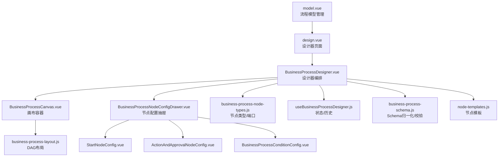
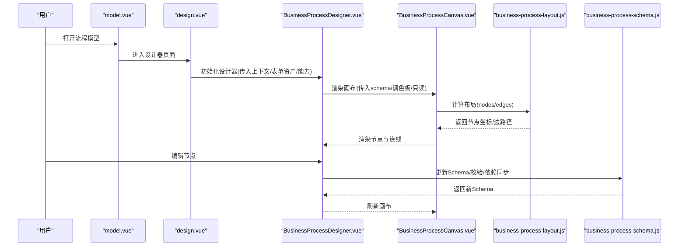
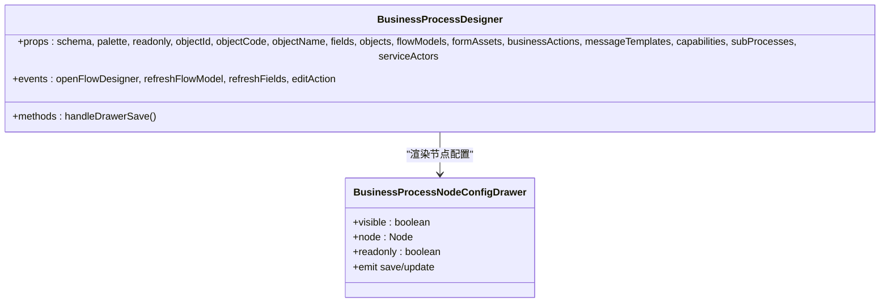
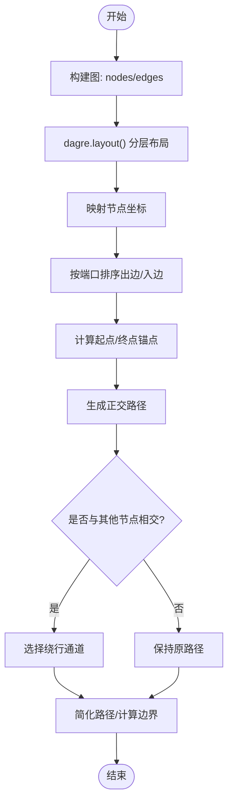
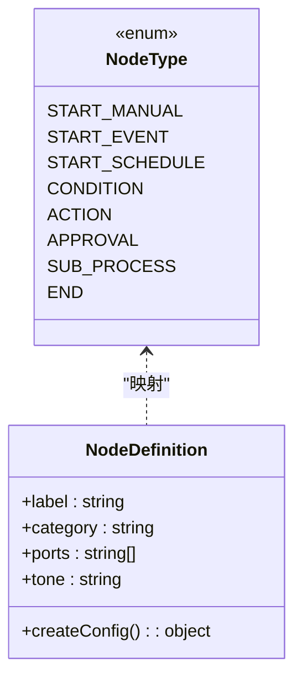
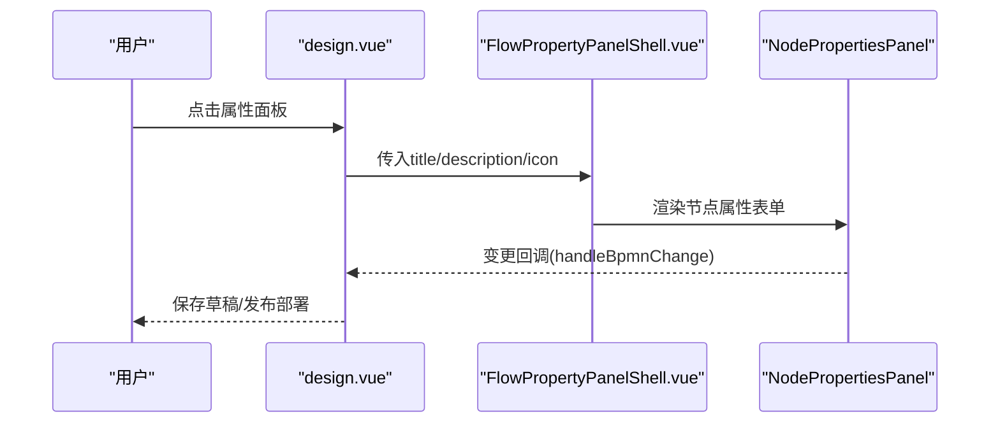
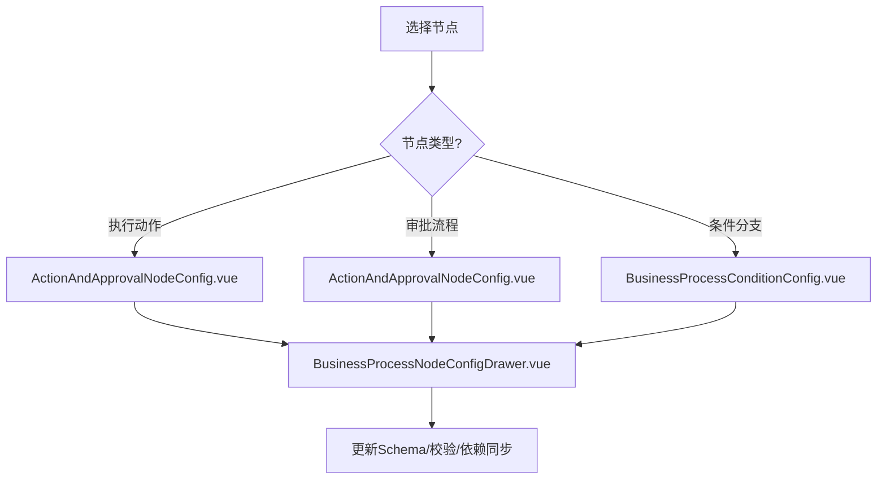
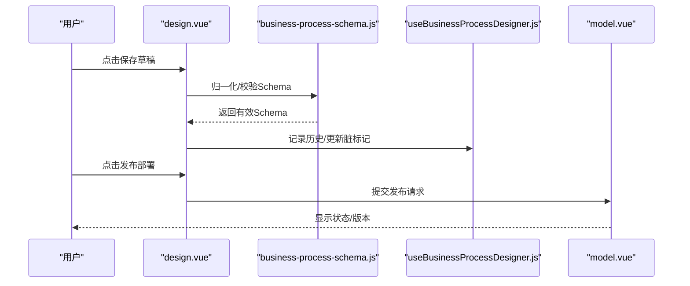
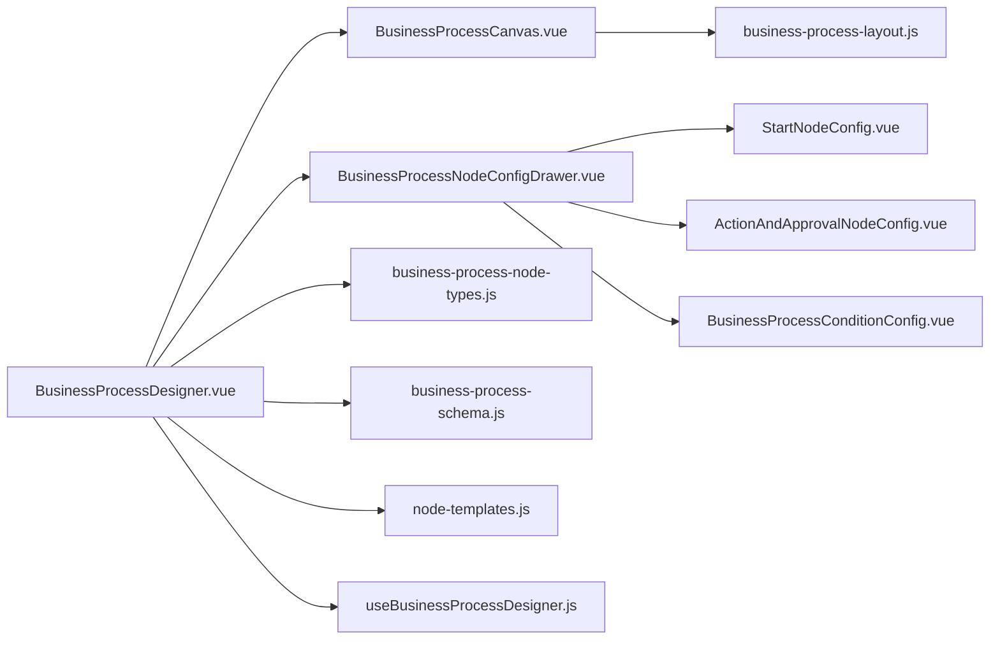

# 业务流程设计器

<cite>
**本文引用的文件**
- [design.vue](file://forge-admin-ui/src/views/flow/design.vue)
- [model.vue](file://forge-admin-ui/src/views/flow/model.vue)
- [FlowPropertyPanelShell.vue](file://forge-admin-ui/src/components/flow/FlowPropertyPanelShell.vue)
- [BusinessProcessDesigner.vue](file://forge-admin-ui/src/components/business-process-designer/BusinessProcessDesigner.vue)
- [BusinessProcessCanvas.vue](file://forge-admin-ui/src/components/business-process-designer/BusinessProcessCanvas.vue)
- [business-process-node-types.js](file://forge-admin-ui/src/components/business-process-designer/business-process-node-types.js)
- [business-process-layout.js](file://forge-admin-ui/src/components/business-process-designer/business-process-layout.js)
- [useBusinessProcessDesigner.js](file://forge-admin-ui/src/components/business-process-designer/useBusinessProcessDesigner.js)
- [business-process-schema.js](file://forge-admin-ui/src/components/business-process-designer/business-process-schema.js)
- [node-templates.js](file://forge-admin-ui/src/components/business-process-designer/node-templates.js)
- [ActionAndApprovalNodeConfig.vue](file://forge-admin-ui/src/components/business-process-designer/ActionAndApprovalNodeConfig.vue)
- [BusinessProcessConditionConfig.vue](file://forge-admin-ui/src/components/business-process-designer/BusinessProcessConditionConfig.vue)
- [StartNodeConfig.vue](file://forge-admin-ui/src/components/business-process-designer/StartNodeConfig.vue)
- [BusinessProcessNodeConfigDrawer.vue](file://forge-admin-ui/src/components/business-process-designer/BusinessProcessNodeConfigDrawer.vue)
</cite>

## 目录
1. [简介](#简介)
2. [项目结构](#项目结构)
3. [核心组件](#核心组件)
4. [架构总览](#架构总览)
5. [详细组件分析](#详细组件分析)
6. [依赖关系分析](#依赖关系分析)
7. [性能与可用性](#性能与可用性)
8. [故障排查指南](#故障排查指南)
9. [结论](#结论)
10. [附录：扩展与自定义指南](#附录：扩展与自定义指南)

## 简介
本技术文档围绕 Forge Admin 的业务流程设计器，系统性解析可视化业务流程建模、节点配置、条件分支、审批设置、业务动作配置、流程验证与发布管理等关键能力。重点覆盖 BusinessProcessDesigner、BusinessProcessCanvas 等核心组件的设计模式与实现机制，并给出布局算法、节点模板系统、属性配置面板、扩展与调试实践建议。

## 项目结构
业务流程设计器由“页面级视图”和“可复用设计器组件”两部分组成：
- 页面级视图
  - 模型管理页 model.vue：流程模型的增删改查、状态管理、版本历史、测试发起、进入设计器入口。
  - 设计器页 design.vue：集成 BPMN/审批双模式设计器、AI 生成、全局表单与通知配置、属性面板挂载点。
- 可复用设计器组件（business-process-designer）
  - BusinessProcessDesigner.vue：编排画布、工具栏、抽屉式节点配置、事件总线。
  - BusinessProcessCanvas.vue：基于 FlowCanvas 的画布容器，负责拖拽插入、连线层、布局结果渲染。
  - business-process-node-types.js：节点类型定义、端口标签、默认配置工厂。
  - business-process-layout.js：DAG 布局、端口排序、路径避障、边界计算。
  - useBusinessProcessDesigner.js：设计器状态、撤销重做、选中节点、边查询等组合式 API。
  - node-templates.js / business-process-schema.js：节点模板与 Schema 归一化、校验、依赖同步。
  - 各类 NodeConfig 组件：StartNodeConfig、ActionAndApprovalNodeConfig、BusinessProcessConditionConfig 等，提供节点级配置 UI。
  - BusinessProcessNodeConfigDrawer.vue：统一抽屉容器，承载具体节点配置。

**图表来源**
- [model.vue:1-200](file://forge-admin-ui/src/views/flow/model.vue#L1-L200)
- [design.vue:1-120](file://forge-admin-ui/src/views/flow/design.vue#L1-L120)
- [BusinessProcessDesigner.vue:600-670](file://forge-admin-ui/src/components/business-process-designer/BusinessProcessDesigner.vue#L600-L670)
- [BusinessProcessCanvas.vue:1-185](file://forge-admin-ui/src/components/business-process-designer/BusinessProcessCanvas.vue#L1-L185)
- [business-process-layout.js:1-133](file://forge-admin-ui/src/components/business-process-designer/business-process-layout.js#L1-L133)
- [business-process-node-types.js:1-161](file://forge-admin-ui/src/components/business-process-designer/business-process-node-types.js#L1-L161)
- [useBusinessProcessDesigner.js:1-43](file://forge-admin-ui/src/components/business-process-designer/useBusinessProcessDesigner.js#L1-L43)
- [business-process-schema.js:1-200](file://forge-admin-ui/src/components/business-process-designer/business-process-schema.js#L1-L200)
- [node-templates.js:1-200](file://forge-admin-ui/src/components/business-process-designer/node-templates.js#L1-L200)

**章节来源**
- [model.vue:1-200](file://forge-admin-ui/src/views/flow/model.vue#L1-L200)
- [design.vue:1-120](file://forge-admin-ui/src/views/flow/design.vue#L1-L120)

## 核心组件
- BusinessProcessDesigner.vue
  - 职责：聚合画布、工具栏、节点配置抽屉；暴露 openFlowDesigner、refreshFlowModel、editAction 等事件，用于与外部工作区交互。
  - 关键点：通过 props 注入对象信息、字段、表单资产、业务能力、子流程、服务执行者等上下文；将选中的节点与配置抽屉联动。
- BusinessProcessCanvas.vue
  - 职责：封装 FlowCanvas，提供拖拽插入节点、连线目标高亮、布局结果渲染；维护插入目标列表与拖拽态。
  - 关键点：使用 layoutBusinessProcess 计算节点位置与边路径；默认调色板包含条件、动作、审批、子流程四类节点。
- business-process-node-types.js
  - 职责：集中定义节点类型、端口标签、默认配置工厂；提供创建节点模板、判断开始节点类型、获取端口标签等工具。
  - 关键点：支持手动开始、事件触发、定时触发、条件分支、执行动作、审批流程、调用子流程、结束等节点类型。
- business-process-layout.js
  - 职责：基于 dagre 的 DAG 布局，结合端口顺序、多入边/多出边、自环、避障等策略，输出节点坐标与边路径。
  - 关键点：rankdir=TB、network-simplex 分层；按端口索引排序出边/入边；自动选择绕行通道；计算画布边界。
- useBusinessProcessDesigner.js
  - 职责：提供 schema、选中节点、历史栈、脏标记、边查询等组合式 API；与业务 Schema 归一化/校验/依赖同步配合。
- business-process-schema.js / node-templates.js
  - 职责：Schema 归一化、哈希输入、克隆、依赖同步；节点模板注册与实例化。
- 节点配置组件
  - StartNodeConfig.vue：开始节点配置（手动/事件/定时）。
  - ActionAndApprovalNodeConfig.vue：执行动作与审批流程的统一配置入口。
  - BusinessProcessConditionConfig.vue：条件分支规则编辑器（表达式、运算符、规则树）。
  - BusinessProcessNodeConfigDrawer.vue：统一抽屉容器，承载上述配置组件。

**章节来源**
- [BusinessProcessDesigner.vue:600-670](file://forge-admin-ui/src/components/business-process-designer/BusinessProcessDesigner.vue#L600-L670)
- [BusinessProcessCanvas.vue:1-185](file://forge-admin-ui/src/components/business-process-designer/BusinessProcessCanvas.vue#L1-L185)
- [business-process-node-types.js:1-161](file://forge-admin-ui/src/components/business-process-designer/business-process-node-types.js#L1-L161)
- [business-process-layout.js:1-133](file://forge-admin-ui/src/components/business-process-designer/business-process-layout.js#L1-L133)
- [useBusinessProcessDesigner.js:1-43](file://forge-admin-ui/src/components/business-process-designer/useBusinessProcessDesigner.js#L1-L43)
- [business-process-schema.js:1-200](file://forge-admin-ui/src/components/business-process-designer/business-process-schema.js#L1-L200)
- [node-templates.js:1-200](file://forge-admin-ui/src/components/business-process-designer/node-templates.js#L1-L200)
- [ActionAndApprovalNodeConfig.vue:1-200](file://forge-admin-ui/src/components/business-process-designer/ActionAndApprovalNodeConfig.vue#L1-L200)
- [BusinessProcessConditionConfig.vue:1-200](file://forge-admin-ui/src/components/business-process-designer/BusinessProcessConditionConfig.vue#L1-L200)
- [StartNodeConfig.vue:1-200](file://forge-admin-ui/src/components/business-process-designer/StartNodeConfig.vue#L1-L200)
- [BusinessProcessNodeConfigDrawer.vue:1-200](file://forge-admin-ui/src/components/business-process-designer/BusinessProcessNodeConfigDrawer.vue#L1-L200)

## 架构总览
业务流程设计器采用“页面编排 + 组件化设计器”的分层架构：
- 页面层：model.vue 负责模型生命周期管理；design.vue 负责设计器嵌入、全局配置（表单、通知、待办跳转）、AI 辅助生成。
- 设计器层：BusinessProcessDesigner.vue 作为编排中心，协调画布、配置抽屉、事件与数据流。
- 画布层：BusinessProcessCanvas.vue 基于 FlowCanvas 提供交互与渲染，layoutBusinessProcess 负责布局计算。
- 数据层：business-process-schema.js 保证 Schema 一致性；node-templates.js 提供节点模板；business-process-node-types.js 定义节点元数据。
- 配置层：各 NodeConfig 组件提供节点级配置 UI，统一通过 BusinessProcessNodeConfigDrawer.vue 展示。

**图表来源**
- [model.vue:400-420](file://forge-admin-ui/src/views/flow/model.vue#L400-L420)
- [design.vue:70-110](file://forge-admin-ui/src/views/flow/design.vue#L70-L110)
- [BusinessProcessDesigner.vue:600-670](file://forge-admin-ui/src/components/business-process-designer/BusinessProcessDesigner.vue#L600-L670)
- [BusinessProcessCanvas.vue:1-185](file://forge-admin-ui/src/components/business-process-designer/BusinessProcessCanvas.vue#L1-L185)
- [business-process-layout.js:1-133](file://forge-admin-ui/src/components/business-process-designer/business-process-layout.js#L1-L133)
- [business-process-schema.js:1-200](file://forge-admin-ui/src/components/business-process-designer/business-process-schema.js#L1-L200)

## 详细组件分析

### BusinessProcessDesigner 组件
- 设计模式
  - 编排器模式：聚合画布、抽屉、工具栏，对外暴露事件以解耦上层工作区。
  - 组合式 API：通过 useBusinessProcessDesigner 管理状态与历史。
- 关键能力
  - 节点配置抽屉：根据选中节点动态加载对应配置组件。
  - 上下文注入：对象、字段、表单资产、业务能力、消息模板、子流程、服务执行者等。
  - 事件桥接：openFlowDesigner、refreshFlowModel、refreshFields、editAction。
- 复杂度与性能
  - 抽屉按需渲染，避免全量加载。
  - 通过 props 传递大对象时注意引用稳定性，必要时 memoize。

**图表来源**
- [BusinessProcessDesigner.vue:600-670](file://forge-admin-ui/src/components/business-process-designer/BusinessProcessDesigner.vue#L600-L670)
- [BusinessProcessNodeConfigDrawer.vue:1-200](file://forge-admin-ui/src/components/business-process-designer/BusinessProcessNodeConfigDrawer.vue#L1-L200)

**章节来源**
- [BusinessProcessDesigner.vue:600-670](file://forge-admin-ui/src/components/business-process-designer/BusinessProcessDesigner.vue#L600-L670)

### BusinessProcessCanvas 与布局算法
- 画布职责
  - 提供拖拽插入节点、连线目标高亮、插入按钮定位。
  - 接收 layoutBusinessProcess 的结果进行渲染。
- 布局算法要点
  - 使用 dagre 进行分层布局，固定节点尺寸，确保卡片式节点视觉一致。
  - 端口顺序影响连线锚点与排序，避免多条结果线重叠或串到错误卡片。
  - 自动选择绕行通道，避免路径穿过其他节点。
  - 计算画布边界，便于缩放与居中。
- 复杂度
  - 节点数 N、边数 E：dagre 分层 O(N+E)，排序与路径计算近似 O(E log E)。
  - 避障与绕行在局部范围内计算，整体性能可控。

**图表来源**
- [business-process-layout.js:1-133](file://forge-admin-ui/src/components/business-process-designer/business-process-layout.js#L1-L133)
- [business-process-layout.js:135-165](file://forge-admin-ui/src/components/business-process-designer/business-process-layout.js#L135-L165)
- [business-process-layout.js:245-326](file://forge-admin-ui/src/components/business-process-designer/business-process-layout.js#L245-L326)
- [business-process-layout.js:328-432](file://forge-admin-ui/src/components/business-process-designer/business-process-layout.js#L328-L432)
- [business-process-layout.js:434-498](file://forge-admin-ui/src/components/business-process-designer/business-process-layout.js#L434-L498)

**章节来源**
- [BusinessProcessCanvas.vue:1-185](file://forge-admin-ui/src/components/business-process-designer/BusinessProcessCanvas.vue#L1-L185)
- [business-process-layout.js:1-498](file://forge-admin-ui/src/components/business-process-designer/business-process-layout.js#L1-L498)

### 节点类型与模板系统
- 节点类型
  - 开始：手动开始、事件触发、定时触发。
  - 控制：条件分支（匹配/其他情况）。
  - 执行：执行动作、审批流程、调用子流程。
  - 结果：结束。
- 模板系统
  - createBusinessProcessNodeTemplate(type) 根据类型生成默认配置。
  - 条件/审批节点持久化声明端口，其他节点不持久化端口。
- 端口标签
  - getBusinessProcessPortLabel(node, port, index) 根据节点类型与分支配置生成可读标签。

**图表来源**
- [business-process-node-types.js:1-161](file://forge-admin-ui/src/components/business-process-designer/business-process-node-types.js#L1-L161)

**章节来源**
- [business-process-node-types.js:1-161](file://forge-admin-ui/src/components/business-process-designer/business-process-node-types.js#L1-L161)

### 属性配置面板与全局设置
- 属性面板外壳
  - FlowPropertyPanelShell.vue 提供统一的标题、描述、关闭、滚动区域与底部插槽。
- 设计器页全局设置
  - design.vue 提供流程属性、表单配置、审批与待办、通知与推送、说明等设置项。
  - 支持外置表单、应用表单资产选择、待办跳转模板、自动审批策略、通知矩阵与模板预览。

**图表来源**
- [FlowPropertyPanelShell.vue:1-289](file://forge-admin-ui/src/components/flow/FlowPropertyPanelShell.vue#L1-L289)
- [design.vue:140-165](file://forge-admin-ui/src/views/flow/design.vue#L140-L165)
- [design.vue:165-573](file://forge-admin-ui/src/views/flow/design.vue#L165-L573)

**章节来源**
- [FlowPropertyPanelShell.vue:1-289](file://forge-admin-ui/src/components/flow/FlowPropertyPanelShell.vue#L1-L289)
- [design.vue:140-573](file://forge-admin-ui/src/views/flow/design.vue#L140-L573)

### 业务动作配置与审批规则
- 业务动作
  - ActionAndApprovalNodeConfig.vue 提供动作类型选择与参数配置。
  - 通过 BusinessProcessNodeConfigDrawer.vue 统一接入。
- 审批规则
  - 支持审批通过/驳回/取消/失败等多端口流转。
  - 与 design.vue 的全局自动审批策略、退回策略协同。
- 条件分支
  - BusinessProcessConditionConfig.vue 提供规则树编辑器，支持 AND/OR 与表达式。

**图表来源**
- [ActionAndApprovalNodeConfig.vue:1-200](file://forge-admin-ui/src/components/business-process-designer/ActionAndApprovalNodeConfig.vue#L1-L200)
- [BusinessProcessConditionConfig.vue:1-200](file://forge-admin-ui/src/components/business-process-designer/BusinessProcessConditionConfig.vue#L1-L200)
- [BusinessProcessNodeConfigDrawer.vue:1-200](file://forge-admin-ui/src/components/business-process-designer/BusinessProcessNodeConfigDrawer.vue#L1-L200)

**章节来源**
- [ActionAndApprovalNodeConfig.vue:1-200](file://forge-admin-ui/src/components/business-process-designer/ActionAndApprovalNodeConfig.vue#L1-L200)
- [BusinessProcessConditionConfig.vue:1-200](file://forge-admin-ui/src/components/business-process-designer/BusinessProcessConditionConfig.vue#L1-L200)
- [BusinessProcessNodeConfigDrawer.vue:1-200](file://forge-admin-ui/src/components/business-process-designer/BusinessProcessNodeConfigDrawer.vue#L1-L200)

### 流程验证与发布管理
- 验证
  - business-process-schema.js 提供 Schema 归一化、校验、依赖同步，确保节点与边的一致性。
  - useBusinessProcessDesigner.js 提供脏标记与历史栈，支持撤销重做。
- 发布
  - design.vue 提供保存草稿与发布部署按钮，结合模型状态与权限控制。
  - model.vue 提供模型列表的状态切换（发布/挂起/激活/删除）与版本历史查看。

**图表来源**
- [business-process-schema.js:1-200](file://forge-admin-ui/src/components/business-process-designer/business-process-schema.js#L1-L200)
- [useBusinessProcessDesigner.js:1-43](file://forge-admin-ui/src/components/business-process-designer/useBusinessProcessDesigner.js#L1-L43)
- [design.vue:40-60](file://forge-admin-ui/src/views/flow/design.vue#L40-L60)
- [model.vue:120-175](file://forge-admin-ui/src/views/flow/model.vue#L120-L175)

**章节来源**
- [business-process-schema.js:1-200](file://forge-admin-ui/src/components/business-process-designer/business-process-schema.js#L1-L200)
- [useBusinessProcessDesigner.js:1-43](file://forge-admin-ui/src/components/business-process-designer/useBusinessProcessDesigner.js#L1-L43)
- [design.vue:40-60](file://forge-admin-ui/src/views/flow/design.vue#L40-L60)
- [model.vue:120-175](file://forge-admin-ui/src/views/flow/model.vue#L120-L175)

## 依赖关系分析
- 组件耦合
  - BusinessProcessDesigner 与 BusinessProcessCanvas 松耦合，通过 props/events 通信。
  - 布局算法独立于 UI，仅依赖 schema.nodes/schema.edges。
  - 节点类型与模板系统为纯函数式模块，易于扩展。
- 外部依赖
  - dagre：用于 DAG 分层布局。
  - FlowCanvas：基础画布能力（拖拽、连线、缩放）。
- 潜在循环依赖
  - 当前模块划分清晰，未见循环导入；如需新增节点类型，仅需扩展 business-process-node-types.js 与对应配置组件。

**图表来源**
- [BusinessProcessDesigner.vue:600-670](file://forge-admin-ui/src/components/business-process-designer/BusinessProcessDesigner.vue#L600-L670)
- [BusinessProcessCanvas.vue:1-185](file://forge-admin-ui/src/components/business-process-designer/BusinessProcessCanvas.vue#L1-L185)
- [business-process-layout.js:1-133](file://forge-admin-ui/src/components/business-process-designer/business-process-layout.js#L1-L133)
- [business-process-node-types.js:1-161](file://forge-admin-ui/src/components/business-process-designer/business-process-node-types.js#L1-L161)
- [business-process-schema.js:1-200](file://forge-admin-ui/src/components/business-process-designer/business-process-schema.js#L1-L200)
- [node-templates.js:1-200](file://forge-admin-ui/src/components/business-process-designer/node-templates.js#L1-L200)
- [useBusinessProcessDesigner.js:1-43](file://forge-admin-ui/src/components/business-process-designer/useBusinessProcessDesigner.js#L1-L43)

**章节来源**
- [BusinessProcessDesigner.vue:600-670](file://forge-admin-ui/src/components/business-process-designer/BusinessProcessDesigner.vue#L600-L670)
- [BusinessProcessCanvas.vue:1-185](file://forge-admin-ui/src/components/business-process-designer/BusinessProcessCanvas.vue#L1-L185)
- [business-process-layout.js:1-133](file://forge-admin-ui/src/components/business-process-designer/business-process-layout.js#L1-L133)
- [business-process-node-types.js:1-161](file://forge-admin-ui/src/components/business-process-designer/business-process-node-types.js#L1-L161)
- [business-process-schema.js:1-200](file://forge-admin-ui/src/components/business-process-designer/business-process-schema.js#L1-L200)
- [node-templates.js:1-200](file://forge-admin-ui/src/components/business-process-designer/node-templates.js#L1-L200)
- [useBusinessProcessDesigner.js:1-43](file://forge-admin-ui/src/components/business-process-designer/useBusinessProcessDesigner.js#L1-L43)

## 性能与可用性
- 布局性能
  - 使用 dagre 的 network-simplex 分层，适合中等规模流程图；大规模时可考虑分页或虚拟渲染。
  - 路径避障与绕行仅在必要时触发，减少计算开销。
- 渲染优化
  - 画布组件按需渲染插入目标与高亮状态。
  - 抽屉式配置避免首屏加载全部节点配置。
- 交互体验
  - 属性面板外壳支持滚动与响应式样式。
  - 设计器页提供 AI 生成进度与阶段提示，提升等待感知。

[本节为通用指导，无需特定文件来源]

## 故障排查指南
- 布局异常
  - 检查节点 id 唯一性与 edges 的 source/target 是否存在于 nodes。
  - 若 dagre.layout 抛出异常，将回退为线性排列。
- 连线错乱
  - 确认节点 ports 顺序与 edge.sourcePort/targetPort 一致。
  - 检查 sortOutgoingEdges/sortIncomingEdges 的端口索引是否正确。
- 配置未生效
  - 确认 business-process-schema.js 的归一化与校验逻辑已运行。
  - 使用 useBusinessProcessDesigner.js 的历史栈回溯变更。
- 发布失败
  - 检查 design.vue 的保存/发布接口返回码与错误提示。
  - 核对 model.vue 中模型状态与权限。

**章节来源**
- [business-process-layout.js:64-71](file://forge-admin-ui/src/components/business-process-designer/business-process-layout.js#L64-L71)
- [business-process-schema.js:1-200](file://forge-admin-ui/src/components/business-process-designer/business-process-schema.js#L1-L200)
- [useBusinessProcessDesigner.js:1-43](file://forge-admin-ui/src/components/business-process-designer/useBusinessProcessDesigner.js#L1-L43)
- [design.vue:40-60](file://forge-admin-ui/src/views/flow/design.vue#L40-L60)
- [model.vue:120-175](file://forge-admin-ui/src/views/flow/model.vue#L120-L175)

## 结论
Forge Admin 业务流程设计器通过清晰的组件分层、强大的布局算法与灵活的节点模板系统，实现了可视化业务流程建模的核心能力。BusinessProcessDesigner 与 BusinessProcessCanvas 的组合提供了可扩展的画布体验；business-process-layout.js 保证了复杂分支与连线的可读性；节点配置抽屉与全局设置完善了审批、动作与通知等场景。结合 Schema 校验与发布管理，形成了从设计到发布的完整闭环。

[本节为总结性内容，无需特定文件来源]

## 附录：扩展与自定义指南
- 扩展节点类型
  - 在 business-process-node-types.js 中新增类型与定义，包括 label、category、ports、tone、createConfig。
  - 新增对应的 NodeConfig 组件，并在 BusinessProcessNodeConfigDrawer.vue 中注册。
- 自定义布局
  - 调整 business-process-layout.js 的默认选项（节点宽高、间距、边距、路由间隙等）。
  - 如需改变端口行为，修改端口排序与锚点计算逻辑。
- 自定义节点模板
  - 在 node-templates.js 中注册模板，或在 business-process-node-types.js 的 createConfig 中提供默认配置。
- 调试技巧
  - 使用 useBusinessProcessDesigner.js 的历史栈与脏标记定位问题。
  - 在 BusinessProcessCanvas.vue 中打印 layoutResult 以验证布局。
  - 在 design.vue 中观察 AI 生成阶段与错误提示。

**章节来源**
- [business-process-node-types.js:1-161](file://forge-admin-ui/src/components/business-process-designer/business-process-node-types.js#L1-L161)
- [business-process-layout.js:1-133](file://forge-admin-ui/src/components/business-process-designer/business-process-layout.js#L1-L133)
- [node-templates.js:1-200](file://forge-admin-ui/src/components/business-process-designer/node-templates.js#L1-L200)
- [BusinessProcessNodeConfigDrawer.vue:1-200](file://forge-admin-ui/src/components/business-process-designer/BusinessProcessNodeConfigDrawer.vue#L1-L200)
- [useBusinessProcessDesigner.js:1-43](file://forge-admin-ui/src/components/business-process-designer/useBusinessProcessDesigner.js#L1-L43)
- [BusinessProcessCanvas.vue:1-185](file://forge-admin-ui/src/components/business-process-designer/BusinessProcessCanvas.vue#L1-L185)
- [design.vue:110-145](file://forge-admin-ui/src/views/flow/design.vue#L110-L145)