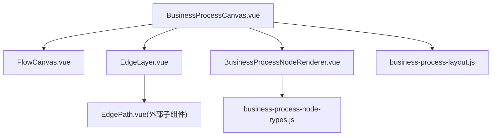
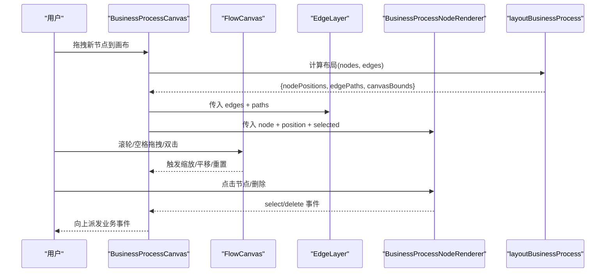
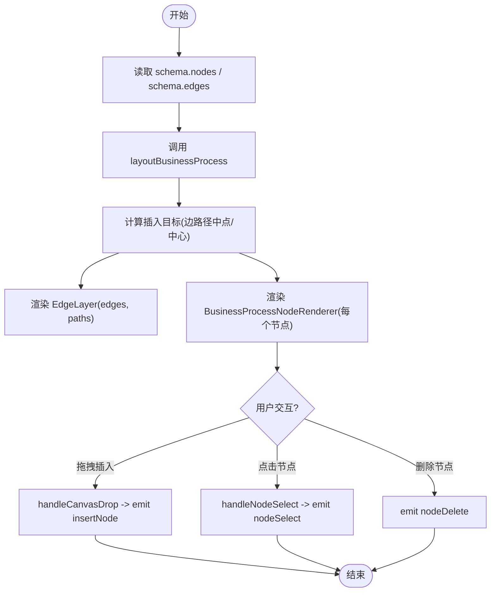
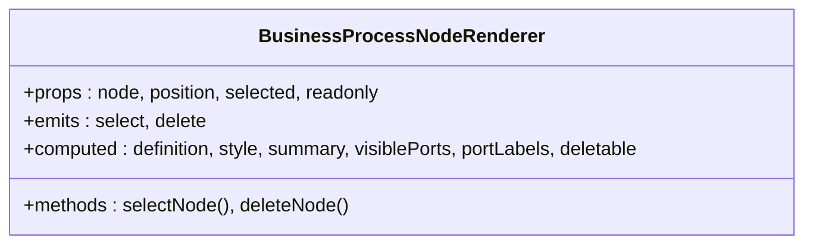
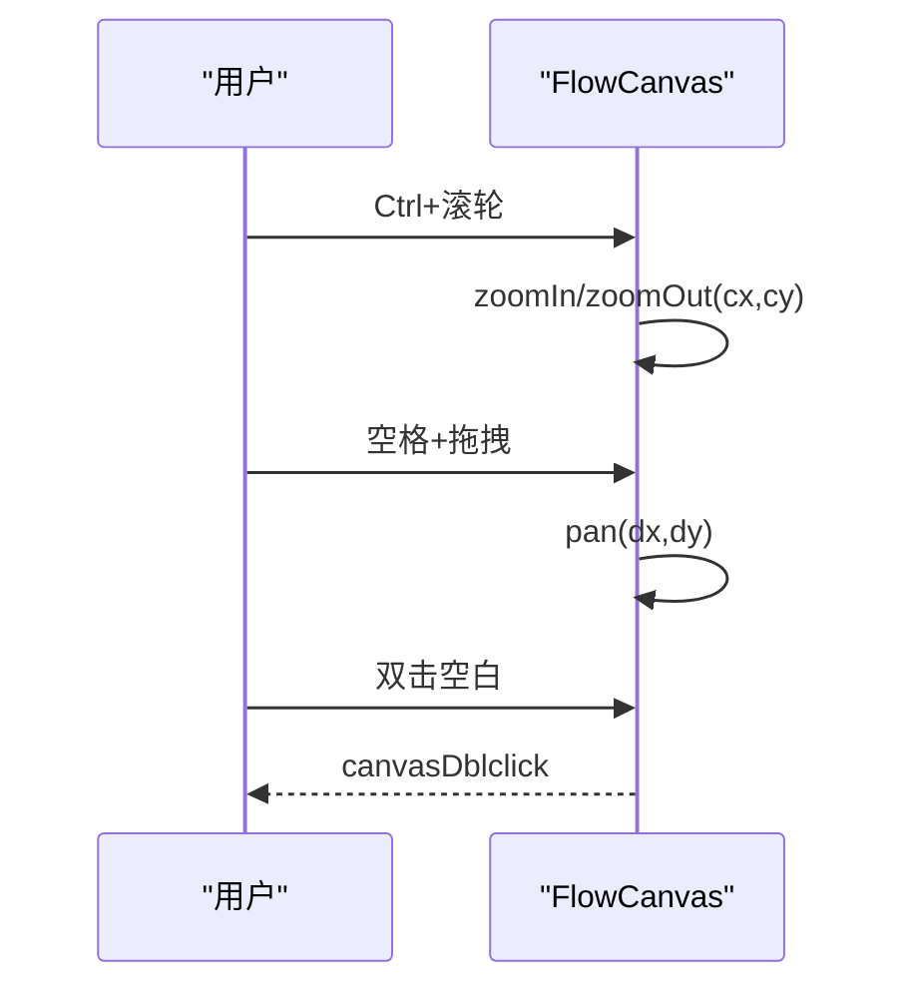
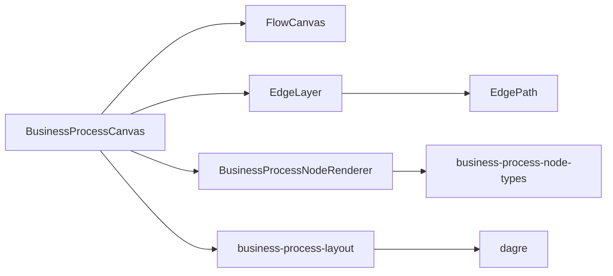

# 画布渲染引擎

<cite>
**本文引用的文件**
- [BusinessProcessCanvas.vue](file://forge-admin-ui/src/components/business-process-designer/BusinessProcessCanvas.vue)
- [BusinessProcessNodeRenderer.vue](file://forge-admin-ui/src/components/business-process-designer/BusinessProcessNodeRenderer.vue)
- [business-process-layout.js](file://forge-admin-ui/src/components/business-process-designer/business-process-layout.js)
- [FlowCanvas.vue](file://forge-admin-ui/src/components/flow-designer/canvas/FlowCanvas.vue)
- [EdgeLayer.vue](file://forge-admin-ui/src/components/flow-designer/canvas/EdgeLayer.vue)
- [business-process-node-types.js](file://forge-admin-ui/src/components/business-process-designer/business-process-node-types.js)
</cite>

## 目录
1. [简介](#简介)
2. [项目结构](#项目结构)
3. [核心组件](#核心组件)
4. [架构总览](#架构总览)
5. [详细组件分析](#详细组件分析)
6. [依赖关系分析](#依赖关系分析)
7. [性能考量](#性能考量)
8. [故障排查指南](#故障排查指南)
9. [结论](#结论)
10. [附录：扩展指南](#附录扩展指南)

## 简介
本技术文档聚焦业务流程设计器的画布渲染引擎，系统性解析 BusinessProcessCanvas 画布组件的渲染机制（含 SVG/HTML 节点绘制、连线计算）、BusinessProcessNodeRenderer 节点渲染器（模板系统、动态渲染、交互响应），以及 business-process-layout 布局算法的核心原理（自动布局、分支对齐、手动调整与网格对齐）。同时覆盖画布的缩放、平移、选择框等交互实现，并提供自定义节点渲染器与布局算法的扩展方法。

## 项目结构
业务流程画布由“画布容器 + 连线层 + 节点层 + 布局算法”构成：
- 画布容器 FlowCanvas：提供缩放、平移、工具栏、视口变换能力。
- 连线层 EdgeLayer：基于 SVG 渲染边路径与箭头标记。
- 节点层 BusinessProcessNodeRenderer：以 HTML 卡片形式渲染业务节点，支持端口标签与删除按钮。
- 布局算法 business-process-layout：使用 dagre 进行分层布局，并计算边路径、避让与边界。
- 节点类型定义 business-process-node-types：声明节点类型、端口、默认配置与标签映射。
- 编排组件 BusinessProcessCanvas：组合上述能力，负责拖拽插入、选择、删除等交互事件转发。



图表来源
- [BusinessProcessCanvas.vue:1-186](file://forge-admin-ui/src/components/business-process-designer/BusinessProcessCanvas.vue#L1-L186)
- [FlowCanvas.vue:1-262](file://forge-admin-ui/src/components/flow-designer/canvas/FlowCanvas.vue#L1-L262)
- [EdgeLayer.vue:1-75](file://forge-admin-ui/src/components/flow-designer/canvas/EdgeLayer.vue#L1-L75)
- [BusinessProcessNodeRenderer.vue:1-301](file://forge-admin-ui/src/components/business-process-designer/BusinessProcessNodeRenderer.vue#L1-L301)
- [business-process-layout.js:1-498](file://forge-admin-ui/src/components/business-process-designer/business-process-layout.js#L1-L498)
- [business-process-node-types.js:1-161](file://forge-admin-ui/src/components/business-process-designer/business-process-node-types.js#L1-L161)

章节来源
- [BusinessProcessCanvas.vue:1-186](file://forge-admin-ui/src/components/business-process-designer/BusinessProcessCanvas.vue#L1-L186)
- [FlowCanvas.vue:1-262](file://forge-admin-ui/src/components/flow-designer/canvas/FlowCanvas.vue#L1-L262)
- [EdgeLayer.vue:1-75](file://forge-admin-ui/src/components/flow-designer/canvas/EdgeLayer.vue#L1-L75)
- [BusinessProcessNodeRenderer.vue:1-301](file://forge-admin-ui/src/components/business-process-designer/BusinessProcessNodeRenderer.vue#L1-L301)
- [business-process-layout.js:1-498](file://forge-admin-ui/src/components/business-process-designer/business-process-layout.js#L1-L498)
- [business-process-node-types.js:1-161](file://forge-admin-ui/src/components/business-process-designer/business-process-node-types.js#L1-L161)

## 核心组件
- BusinessProcessCanvas：聚合画布容器、连线层、节点层；计算插入目标位置；处理拖拽插入、节点选择与删除事件。
- FlowCanvas：封装缩放/平移/视口变换；提供屏幕坐标与画布坐标转换；暴露工具栏控制。
- EdgeLayer：根据 layout 输出的边路径 Map 渲染 SVG path，统一箭头标记与状态色。
- BusinessProcessNodeRenderer：按节点类型渲染卡片样式、标题、摘要、端口标签；处理选中与删除交互。
- business-process-layout：基于 dagre 的分层布局，计算节点位置、边路径、避让与画布边界；对条件/审批分支做端口顺序对齐。
- business-process-node-types：集中管理节点类型、端口、默认配置与标签映射，提供创建模板的能力。

章节来源
- [BusinessProcessCanvas.vue:1-186](file://forge-admin-ui/src/components/business-process-designer/BusinessProcessCanvas.vue#L1-L186)
- [FlowCanvas.vue:1-262](file://forge-admin-ui/src/components/flow-designer/canvas/FlowCanvas.vue#L1-L262)
- [EdgeLayer.vue:1-75](file://forge-admin-ui/src/components/flow-designer/canvas/EdgeLayer.vue#L1-L75)
- [BusinessProcessNodeRenderer.vue:1-301](file://forge-admin-ui/src/components/business-process-designer/BusinessProcessNodeRenderer.vue#L1-L301)
- [business-process-layout.js:1-498](file://forge-admin-ui/src/components/business-process-designer/business-process-layout.js#L1-L498)
- [business-process-node-types.js:1-161](file://forge-admin-ui/src/components/business-process-designer/business-process-node-types.js#L1-L161)

## 架构总览
业务流程画布采用“数据驱动 + 布局解耦”的架构：
- 输入 schema（nodes/edges）经 layoutBusinessProcess 得到 nodePositions、edgePaths、canvasBounds。
- FlowCanvas 提供 transform 容器与视口 API，EdgeLayer 用 SVG 渲染边，BusinessProcessNodeRenderer 以绝对定位渲染节点。
- 交互（缩放、平移、拖拽插入、选择、删除）通过事件冒泡与回调在 BusinessProcessCanvas 中汇聚并向上抛出。



图表来源
- [BusinessProcessCanvas.vue:1-186](file://forge-admin-ui/src/components/business-process-designer/BusinessProcessCanvas.vue#L1-L186)
- [FlowCanvas.vue:1-262](file://forge-admin-ui/src/components/flow-designer/canvas/FlowCanvas.vue#L1-L262)
- [EdgeLayer.vue:1-75](file://forge-admin-ui/src/components/flow-designer/canvas/EdgeLayer.vue#L1-L75)
- [BusinessProcessNodeRenderer.vue:1-301](file://forge-admin-ui/src/components/business-process-designer/BusinessProcessNodeRenderer.vue#L1-L301)
- [business-process-layout.js:1-498](file://forge-admin-ui/src/components/business-process-designer/business-process-layout.js#L1-L498)

## 详细组件分析

### BusinessProcessCanvas 画布组件
- 职责
  - 接收 schema（nodes/edges），调用 layoutBusinessProcess 生成布局结果。
  - 计算插入目标点（沿最长边段中点或源/目标中心平均），用于拖拽插入时高亮最近边。
  - 将 edges 与 paths 传给 EdgeLayer，将每个节点的 position 传给 BusinessProcessNodeRenderer。
  - 处理拖拽进入/离开/放置，识别拖拽节点类型，向父级 emit insertNode。
  - 处理节点选择与删除事件，透传到上层。
- 关键流程
  - 布局输入：从 props.schema 提取 nodes/edges。
  - 插入目标：遍历 edges，取每条边的路径点，计算最长线段中点作为插入候选。
  - 拖拽判定：dragover 时计算鼠标在画布坐标下的位置，选择最近的插入目标并高亮。
  - drop：读取 dataTransfer 中的节点 MIME，校验是否在 palette 中，emit insertNode。
- 交互要点
  - readonly 模式下禁用拖拽与删除。
  - 暴露 canvasRef、layoutResult 给外部调用。



图表来源
- [BusinessProcessCanvas.vue:1-186](file://forge-admin-ui/src/components/business-process-designer/BusinessProcessCanvas.vue#L1-L186)
- [business-process-layout.js:1-498](file://forge-admin-ui/src/components/business-process-designer/business-process-layout.js#L1-L498)

章节来源
- [BusinessProcessCanvas.vue:1-186](file://forge-admin-ui/src/components/business-process-designer/BusinessProcessCanvas.vue#L1-L186)

### BusinessProcessNodeRenderer 节点渲染器
- 模板系统
  - 通过 getBusinessProcessNodeDefinition 获取节点类型元信息（label、tone、ports、createConfig）。
  - 不同节点类型显示不同的 summary：审批显示流程名，动作显示动作类型，条件显示分支数量，子流程显示 processCode。
- 动态渲染
  - 根据 position 设置 left/top/width/minHeight，确保与布局结果一致。
  - 条件/审批节点显示端口标签，使用 getBusinessProcessPortLabel 生成可读文本。
- 交互响应
  - 非只读模式可点击选中，键盘 Enter/Space 也可选中。
  - 非起始/结束节点且非只读时显示删除按钮，点击后 emit delete。
- 无障碍与样式
  - role/button、tabindex、aria-pressed、aria-disabled 提升可访问性。
  - 选中态、悬停态、删除按钮显隐均有过渡动画。



图表来源
- [BusinessProcessNodeRenderer.vue:1-301](file://forge-admin-ui/src/components/business-process-designer/BusinessProcessNodeRenderer.vue#L1-L301)
- [business-process-node-types.js:1-161](file://forge-admin-ui/src/components/business-process-designer/business-process-node-types.js#L1-L161)

章节来源
- [BusinessProcessNodeRenderer.vue:1-301](file://forge-admin-ui/src/components/business-process-designer/BusinessProcessNodeRenderer.vue#L1-L301)
- [business-process-node-types.js:1-161](file://forge-admin-ui/src/components/business-process-designer/business-process-node-types.js#L1-L161)

### business-process-layout 布局算法
- 自动布局
  - 使用 dagre 构建有向图，设置 rankdir=TB、ranker=network-simplex、acyclicer=greedy。
  - 固定节点尺寸（nodeWidth/nodeHeight），应用节点间距与行距，计算初始位置并加上 marginX/marginY 偏移。
  - 若 dagre 失败则回退为垂直线性排列。
- 分支对齐
  - 对同一父节点的多条出边，若目标在同一行且仅有一条入边，则按水平槽位排序，保证“条件1→条件2→默认”的视觉顺序稳定。
- 连线计算
  - 对每条边确定起点锚点（底部）与终点锚点（顶部），考虑端口索引分布。
  - 根据源/目标出边/入边数量与配对关系决定路由通道（lane），计算正交或直连路径。
  - 检测路径是否与中间节点相交，若相交则绕行（左右侧通道选择与偏移）。
  - 自环边走右侧独立环路，避免重叠。
- 手动调整与网格对齐
  - 当前布局输出固定尺寸的节点位置；如需手动调整，可在上层维护“手动偏移”并在渲染时叠加到 position。
  - 网格对齐可通过在拖拽/移动结束时将 x/y 对齐到 grid 步长实现（例如 snapToGrid 函数在上层调用）。
- 画布边界
  - 综合所有节点与路径点计算 minX/minY/maxX/maxY，并加上 boundsPadding 作为画布可视范围。

```mermaid
flowchart TD
S(["输入 nodes/edges"]) --> BuildGraph["构建 dagre 图<br/>设置节点尺寸/间距"]
BuildGraph --> TryLayout["尝试 dagre.layout"]
TryLayout --> |成功| PosDagre["positionDagreNodes + alignBranchTargets"]
TryLayout --> |失败| Fallback["positionFallbackNodes 垂直排列"]
PosDagre --> EdgesLoop["遍历 edges 计算路径"]
Fallback --> EdgesLoop
EdgesLoop --> Anchor["计算起点/终点锚点"]
Anchor --> Lane["resolveRouteLane 选择通道"]
Lane --> Route["routePoints/detourPoints 生成路径"]
Route --> Avoid{"是否穿模?"}
Avoid --> |是| Detour["routeAroundNodes 绕行"]
Avoid --> |否| Keep["保持原路径"]
Detour --> Bounds["calculateBounds 计算画布边界"]
Keep --> Bounds
Bounds --> Out({输出 nodePositions/edgePaths/canvasBounds})
```

图表来源
- [business-process-layout.js:1-498](file://forge-admin-ui/src/components/business-process-designer/business-process-layout.js#L1-L498)

章节来源
- [business-process-layout.js:1-498](file://forge-admin-ui/src/components/business-process-designer/business-process-layout.js#L1-L498)

### FlowCanvas 画布容器与交互
- 缩放
  - Ctrl/Cmd + 滚轮以鼠标位置为中心缩放；提供 zoomIn/zoomOut/setScale/resetView/fitToScreen。
- 平移
  - 空格+左键拖拽、中键拖拽、普通滚轮均可平移；内部维护 isPanning/isSpaceDown 状态。
- 视口变换
  - 通过 useCanvasViewport 返回 transformStyle、screenToCanvas、canvasToScreen 等能力，供上层进行坐标换算。
- 工具栏
  - 内置缩放百分比显示、放大/缩小、适应画布按钮，支持插槽扩展。



图表来源
- [FlowCanvas.vue:1-262](file://forge-admin-ui/src/components/flow-designer/canvas/FlowCanvas.vue#L1-L262)

章节来源
- [FlowCanvas.vue:1-262](file://forge-admin-ui/src/components/flow-designer/canvas/FlowCanvas.vue#L1-L262)

### EdgeLayer 连线层
- 基于 SVG 渲染，尺寸由 canvasBounds 决定，保证 viewBox 覆盖全部元素。
- 使用 <defs> 注册多种箭头 marker，颜色来自 EDGE_COLORS。
- 对每条边渲染 EdgePath，支持 pathType 覆盖与可选标签显示。

章节来源
- [EdgeLayer.vue:1-75](file://forge-admin-ui/src/components/flow-designer/canvas/EdgeLayer.vue#L1-L75)

### 节点类型与模板
- 节点类型：START_MANUAL、START_EVENT、START_SCHEDULE、CONDITION、ACTION、APPROVAL、SUB_PROCESS、END。
- 端口标签：NEXT、APPROVED、REJECTED、CANCELED、FAILED、MATCHED、OTHERWISE。
- 模板创建：createBusinessProcessNodeTemplate 根据类型生成默认 name、ports、config。
- 条件/审批节点持久化端口，其他节点不持久化端口。

章节来源
- [business-process-node-types.js:1-161](file://forge-admin-ui/src/components/business-process-designer/business-process-node-types.js#L1-L161)

## 依赖关系分析
- BusinessProcessCanvas 依赖：
  - FlowCanvas（缩放/平移/视口）
  - EdgeLayer（SVG 连线）
  - BusinessProcessNodeRenderer（节点卡片）
  - business-process-layout（布局计算）
  - business-process-node-types（节点定义）
- FlowCanvas 依赖：
  - useCanvasViewport（视口状态与变换）
- EdgeLayer 依赖：
  - EdgePath（路径渲染）
  - EDGE_COLORS（颜色常量）
- 布局算法依赖：
  - dagre（分层布局）
  - 内部几何计算（锚点、通道、避让、边界）



图表来源
- [BusinessProcessCanvas.vue:1-186](file://forge-admin-ui/src/components/business-process-designer/BusinessProcessCanvas.vue#L1-L186)
- [FlowCanvas.vue:1-262](file://forge-admin-ui/src/components/flow-designer/canvas/FlowCanvas.vue#L1-L262)
- [EdgeLayer.vue:1-75](file://forge-admin-ui/src/components/flow-designer/canvas/EdgeLayer.vue#L1-L75)
- [BusinessProcessNodeRenderer.vue:1-301](file://forge-admin-ui/src/components/business-process-designer/BusinessProcessNodeRenderer.vue#L1-L301)
- [business-process-layout.js:1-498](file://forge-admin-ui/src/components/business-process-designer/business-process-layout.js#L1-L498)
- [business-process-node-types.js:1-161](file://forge-admin-ui/src/components/business-process-designer/business-process-node-types.js#L1-L161)

章节来源
- [BusinessProcessCanvas.vue:1-186](file://forge-admin-ui/src/components/business-process-designer/BusinessProcessCanvas.vue#L1-L186)
- [FlowCanvas.vue:1-262](file://forge-admin-ui/src/components/flow-designer/canvas/FlowCanvas.vue#L1-L262)
- [EdgeLayer.vue:1-75](file://forge-admin-ui/src/components/flow-designer/canvas/EdgeLayer.vue#L1-L75)
- [BusinessProcessNodeRenderer.vue:1-301](file://forge-admin-ui/src/components/business-process-designer/BusinessProcessNodeRenderer.vue#L1-L301)
- [business-process-layout.js:1-498](file://forge-admin-ui/src/components/business-process-designer/business-process-layout.js#L1-L498)
- [business-process-node-types.js:1-161](file://forge-admin-ui/src/components/business-process-designer/business-process-node-types.js#L1-L161)

## 性能考量
- 布局计算复杂度
  - dagre 分层布局时间复杂度近似 O(n log n)，适合中等规模流程图。
  - 边路径计算为 O(e)，其中 e 为边数；碰撞检测与绕行在局部范围内进行，整体开销可控。
- 渲染优化
  - 节点使用绝对定位与 CSS 过渡，减少重排；选中/悬停态通过类名切换。
  - EdgeLayer 使用单一 SVG 与复用 marker，降低 DOM 节点数量。
- 交互流畅度
  - 缩放/平移集中在 FlowCanvas 内，使用 transform 提升性能。
  - 拖拽插入仅在 dragover 时计算最近目标，避免频繁重绘。
- 建议
  - 大量节点时启用虚拟滚动或分页加载（需在上层实现）。
  - 复杂连线场景可缓存路径计算结果，仅在变更时重算。
  - 开启 prefers-reduced-motion 时关闭过渡以提升低端设备体验。

[本节为通用性能指导，无需特定文件引用]

## 故障排查指南
- 节点未显示
  - 检查 layout 是否返回有效 position；确认 BusinessProcessNodeRenderer 的 style 是否正确设置 left/top/width。
  - 参考：[BusinessProcessNodeRenderer.vue:24-33](file://forge-admin-ui/src/components/business-process-designer/BusinessProcessNodeRenderer.vue#L24-L33)
- 连线重叠或串接错误
  - 检查端口顺序与 sortOutgoingEdges/sortIncomingEdges 的排序逻辑；确认 alignBranchTargets 是否生效。
  - 参考：[business-process-layout.js:245-276](file://forge-admin-ui/src/components/business-process-designer/business-process-layout.js#L245-L276)、[business-process-layout.js:139-165](file://forge-admin-ui/src/components/business-process-designer/business-process-layout.js#L139-L165)
- 连线穿模
  - 查看 pathIntersectsNodes 与 routeAroundNodes 是否被触发；必要时调整 routeLaneGap/routeStub。
  - 参考：[business-process-layout.js:362-432](file://forge-admin-ui/src/components/business-process-designer/business-process-layout.js#L362-L432)
- 缩放/平移无效
  - 确认 readonly 与 allowNavigation 配置；检查 handleWheel/handleMouseDown 是否被拦截。
  - 参考：[FlowCanvas.vue:61-116](file://forge-admin-ui/src/components/flow-designer/canvas/FlowCanvas.vue#L61-L116)
- 拖拽插入不生效
  - 检查 draggingNodeType 与 effectivePalette；确认 activeDropEdgeId 与 nearestInsertionTarget 逻辑。
  - 参考：[BusinessProcessCanvas.vue:74-121](file://forge-admin-ui/src/components/business-process-designer/BusinessProcessCanvas.vue#L74-L121)

章节来源
- [BusinessProcessNodeRenderer.vue:24-33](file://forge-admin-ui/src/components/business-process-designer/BusinessProcessNodeRenderer.vue#L24-L33)
- [business-process-layout.js:139-165](file://forge-admin-ui/src/components/business-process-designer/business-process-layout.js#L139-L165)
- [business-process-layout.js:245-276](file://forge-admin-ui/src/components/business-process-designer/business-process-layout.js#L245-L276)
- [business-process-layout.js:362-432](file://forge-admin-ui/src/components/business-process-designer/business-process-layout.js#L362-L432)
- [FlowCanvas.vue:61-116](file://forge-admin-ui/src/components/flow-designer/canvas/FlowCanvas.vue#L61-L116)
- [BusinessProcessCanvas.vue:74-121](file://forge-admin-ui/src/components/business-process-designer/BusinessProcessCanvas.vue#L74-L121)

## 结论
该画布渲染引擎以“布局解耦 + 组件化”为核心，结合 dagre 分层与自定义边路径算法，实现了稳定的自动布局与清晰的连线表达；FlowCanvas 提供健壮的缩放/平移能力；BusinessProcessNodeRenderer 以模板化的方式支持多类型节点渲染与交互。整体架构清晰、可扩展性强，便于后续引入自定义节点与布局策略。

[本节为总结性内容，无需特定文件引用]

## 附录：扩展指南

### 自定义节点渲染器
- 步骤
  - 在 business-process-node-types.js 中新增节点类型定义（label、category、ports、tone、createConfig）。
  - 在 BusinessProcessNodeRenderer 中根据 type 渲染差异化 UI（或通过插槽/外部组件替换）。
  - 在 BusinessProcessCanvas 中将该类型加入 palette，以便拖拽插入。
- 注意事项
  - 条件/审批节点需持久化 ports；其他节点通常不持久化端口。
  - 端口标签通过 getBusinessProcessPortLabel 生成，可按需扩展。

章节来源
- [business-process-node-types.js:1-161](file://forge-admin-ui/src/components/business-process-designer/business-process-node-types.js#L1-L161)
- [BusinessProcessNodeRenderer.vue:1-301](file://forge-admin-ui/src/components/business-process-designer/BusinessProcessNodeRenderer.vue#L1-L301)
- [BusinessProcessCanvas.vue:1-186](file://forge-admin-ui/src/components/business-process-designer/BusinessProcessCanvas.vue#L1-L186)

### 自定义布局算法
- 思路
  - 保留 input/output 接口：输入 nodes/edges，输出 nodePositions、edgePaths、canvasBounds。
  - 可选择替换 dagre 为其他布局库，或在其基础上增加约束（如固定列、分组）。
  - 保持边路径计算与避让逻辑，确保连线不与节点相交。
- 集成方式
  - 在 BusinessProcessCanvas 中替换 layoutBusinessProcess 调用为自定义函数。
  - 若需网格对齐，在上层对 position.x/position.y 进行 snapToGrid 处理。

章节来源
- [business-process-layout.js:1-498](file://forge-admin-ui/src/components/business-process-designer/business-process-layout.js#L1-L498)
- [BusinessProcessCanvas.vue:1-186](file://forge-admin-ui/src/components/business-process-designer/BusinessProcessCanvas.vue#L1-L186)

### 画布交互增强
- 选择框
  - 可在 FlowCanvas 的 transform 容器内监听 mousedown/mousemove/mouseup，绘制矩形选区，计算与节点包围盒的交集，批量选中。
- 快捷键
  - 可结合 useCanvasViewport 提供的 screenToCanvas，将键盘事件转换为画布操作（如 Ctrl+A 全选、Delete 删除）。
- 撤销/重做
  - 在上层维护命令栈，对 nodes/edges 的增删改进行记录与回放。

[本节为概念性扩展建议，无需特定文件引用]