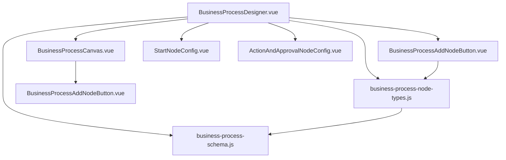
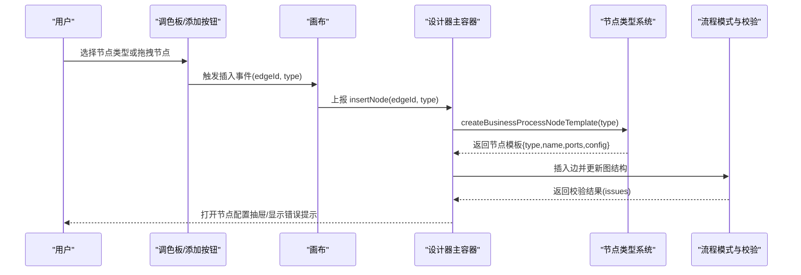
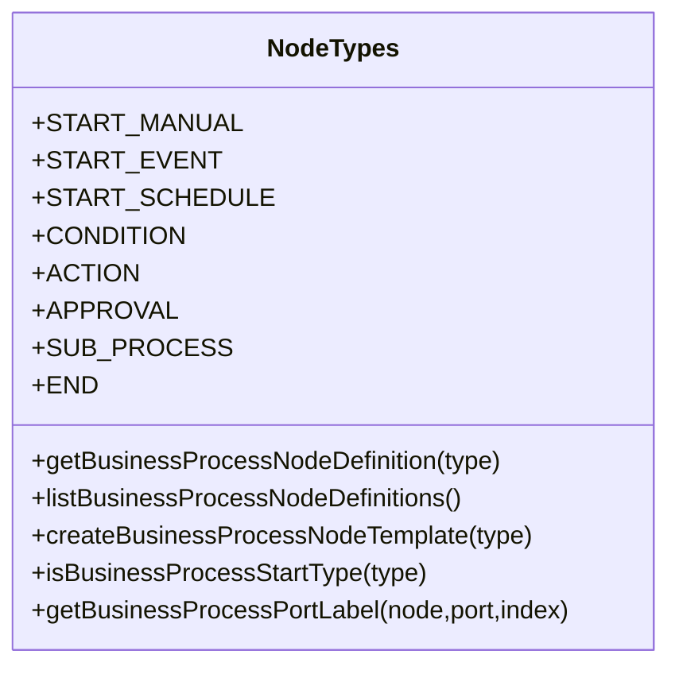
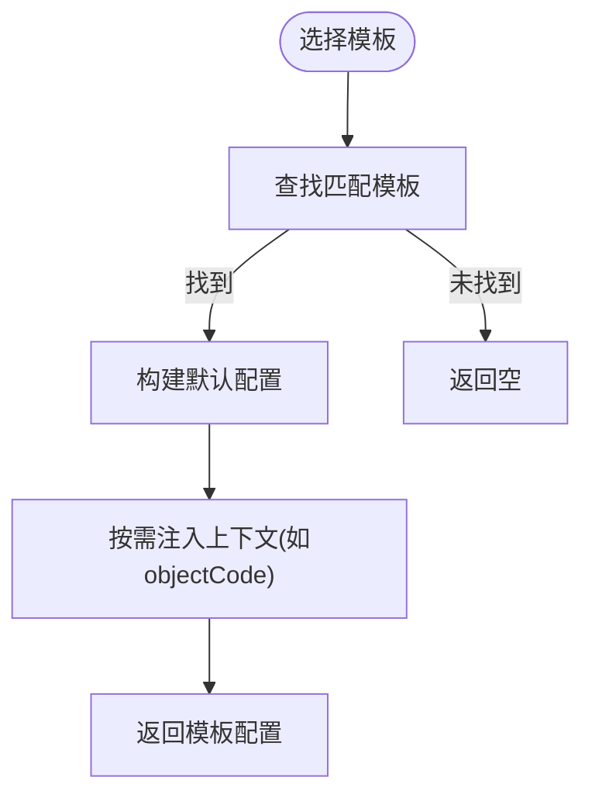
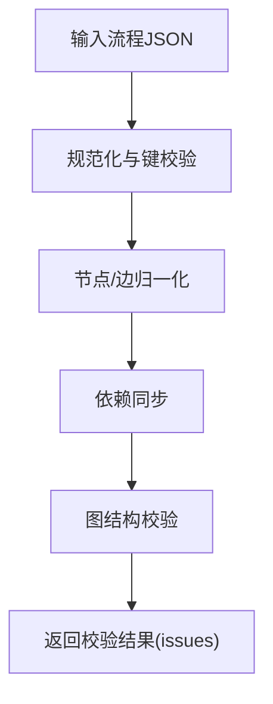
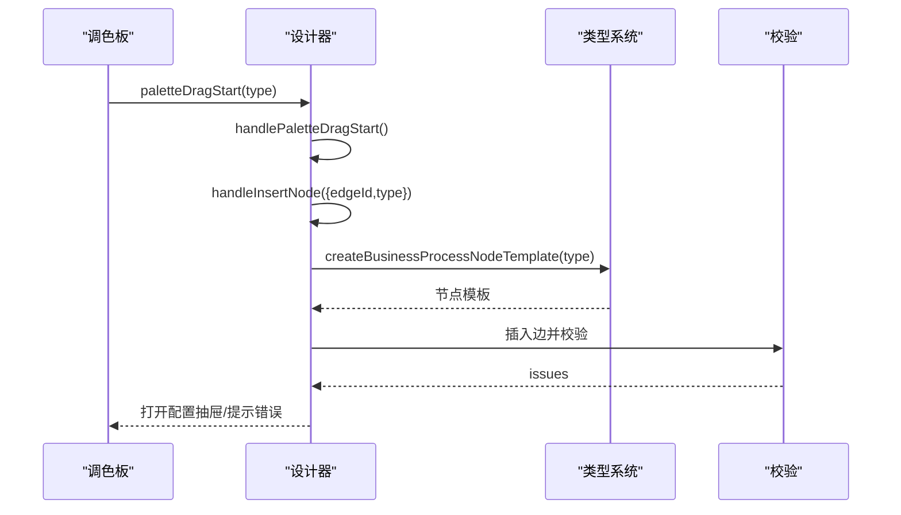
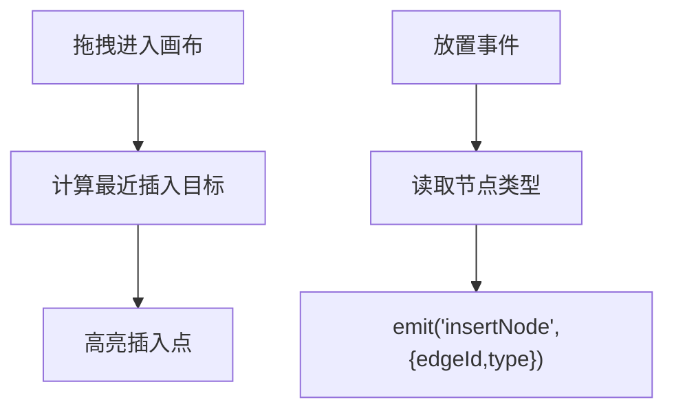
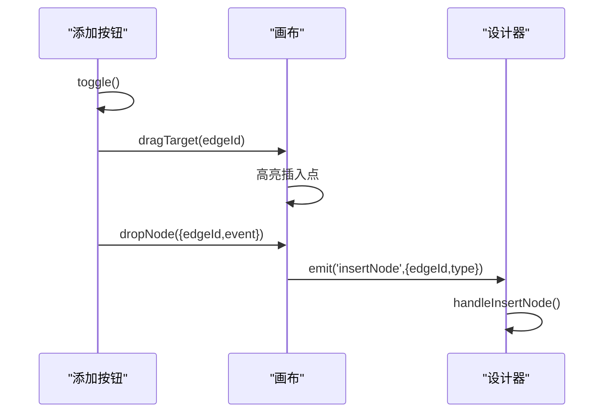
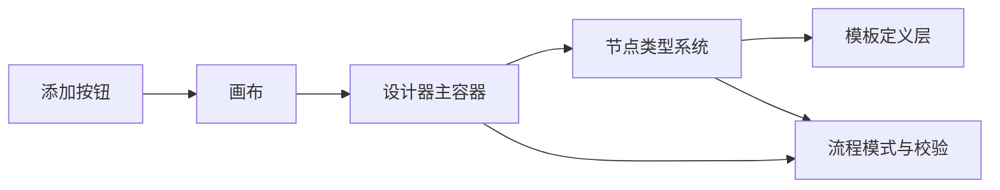

# 节点模板系统

<cite>
**本文引用的文件**
- [business-process-node-types.js](file://forge-admin-ui/src/components/business-process-designer/business-process-node-types.js)
- [node-templates.js](file://forge-admin-ui/src/components/business-process-designer/node-templates.js)
- [business-process-schema.js](file://forge-admin-ui/src/components/business-process-designer/business-process-schema.js)
- [BusinessProcessDesigner.vue](file://forge-admin-ui/src/components/business-process-designer/BusinessProcessDesigner.vue)
- [BusinessProcessCanvas.vue](file://forge-admin-ui/src/components/business-process-designer/BusinessProcessCanvas.vue)
- [BusinessProcessAddNodeButton.vue](file://forge-admin-ui/src/components/business-process-designer/BusinessProcessAddNodeButton.vue)
- [StartNodeConfig.vue](file://forge-admin-ui/src/components/business-process-designer/StartNodeConfig.vue)
- [ActionAndApprovalNodeConfig.vue](file://forge-admin-ui/src/components/business-process-designer/ActionAndApprovalNodeConfig.vue)
</cite>

## 目录
1. [简介](#简介)
2. [项目结构](#项目结构)
3. [核心组件](#核心组件)
4. [架构总览](#架构总览)
5. [详细组件分析](#详细组件分析)
6. [依赖关系分析](#依赖关系分析)
7. [性能考量](#性能考量)
8. [故障排查指南](#故障排查指南)
9. [结论](#结论)
10. [附录](#附录)

## 简介
本技术文档围绕业务流程设计器的“节点模板系统”展开，重点解析：
- node-templates 模板定义文件的结构与规范（节点元数据、默认属性、样式配置等）
- business-process-node-types 节点类型注册机制（内置节点类型、扩展点接口、类型检查与验证）
- BusinessProcessAddNodeButton 添加按钮组件的实现逻辑（节点选择面板、拖拽插入、批量添加）
- 自定义节点模板开发指南、模板版本管理、模板市场集成思路
- 节点模板设计规范与质量检查工具使用建议

## 项目结构
业务流程设计器相关代码集中在前端 UI 模块的 designer 子目录中，采用“按功能域组织”的结构：
- 节点类型与模板定义：business-process-node-types.js、node-templates.js
- 流程模型与校验：business-process-schema.js
- 设计器主容器与交互：BusinessProcessDesigner.vue、BusinessProcessCanvas.vue
- 添加节点入口：BusinessProcessAddNodeButton.vue
- 节点配置面板：StartNodeConfig.vue、ActionAndApprovalNodeConfig.vue

图表来源
- [BusinessProcessDesigner.vue:1-200](file://forge-admin-ui/src/components/business-process-designer/BusinessProcessDesigner.vue#L1-L200)
- [BusinessProcessCanvas.vue:74-185](file://forge-admin-ui/src/components/business-process-designer/BusinessProcessCanvas.vue#L74-L185)
- [BusinessProcessAddNodeButton.vue:1-247](file://forge-admin-ui/src/components/business-process-designer/BusinessProcessAddNodeButton.vue#L1-L247)
- [business-process-node-types.js:1-161](file://forge-admin-ui/src/components/business-process-designer/business-process-node-types.js#L1-L161)
- [business-process-schema.js:1-200](file://forge-admin-ui/src/components/business-process-designer/business-process-schema.js#L1-L200)

章节来源
- [BusinessProcessDesigner.vue:1-200](file://forge-admin-ui/src/components/business-process-designer/BusinessProcessDesigner.vue#L1-L200)
- [BusinessProcessCanvas.vue:74-185](file://forge-admin-ui/src/components/business-process-designer/BusinessProcessCanvas.vue#L74-L185)
- [business-process-node-types.js:1-161](file://forge-admin-ui/src/components/business-process-designer/business-process-node-types.js#L1-L161)
- [business-process-schema.js:1-200](file://forge-admin-ui/src/components/business-process-designer/business-process-schema.js#L1-L200)

## 核心组件
- 节点类型注册中心：集中声明所有内置节点类型、端口标签、默认配置生成函数，提供查询、列表、创建模板等能力。
- 模板定义层：为开始节点与动作节点提供可复用的模板集合，支持快速生成默认配置。
- 流程模式与校验：定义流程 JSON Schema 的版本、根键、节点/边键集、依赖同步、图结构校验等。
- 设计器主容器：编排画布、调色板、拖拽、插入、自动保存、客户端与服务端校验合并。
- 画布与插入点：计算插入目标位置、处理拖拽进入与放置、渲染各节点与插入按钮。
- 添加按钮组件：弹出节点选择面板、支持拖拽目标高亮、点击或拖放插入节点。

章节来源
- [business-process-node-types.js:1-161](file://forge-admin-ui/src/components/business-process-designer/business-process-node-types.js#L1-L161)
- [node-templates.js:1-73](file://forge-admin-ui/src/components/business-process-designer/node-templates.js#L1-L73)
- [business-process-schema.js:1-200](file://forge-admin-ui/src/components/business-process-designer/business-process-schema.js#L1-L200)
- [BusinessProcessDesigner.vue:1-200](file://forge-admin-ui/src/components/business-process-designer/BusinessProcessDesigner.vue#L1-L200)
- [BusinessProcessCanvas.vue:74-185](file://forge-admin-ui/src/components/business-process-designer/BusinessProcessCanvas.vue#L74-L185)
- [BusinessProcessAddNodeButton.vue:1-247](file://forge-admin-ui/src/components/business-process-designer/BusinessProcessAddNodeButton.vue#L1-L247)

## 架构总览
下图展示了从用户操作到节点插入的核心调用链，以及模板与类型系统的协作方式。

图表来源
- [BusinessProcessDesigner.vue:121-195](file://forge-admin-ui/src/components/business-process-designer/BusinessProcessDesigner.vue#L121-L195)
- [BusinessProcessCanvas.vue:74-121](file://forge-admin-ui/src/components/business-process-designer/BusinessProcessCanvas.vue#L74-L121)
- [BusinessProcessAddNodeButton.vue:17-43](file://forge-admin-ui/src/components/business-process-designer/BusinessProcessAddNodeButton.vue#L17-L43)
- [business-process-node-types.js:116-133](file://forge-admin-ui/src/components/business-process-designer/business-process-node-types.js#L116-L133)
- [business-process-schema.js:192-200](file://forge-admin-ui/src/components/business-process-designer/business-process-schema.js#L192-L200)

## 详细组件分析

### 节点类型注册机制（business-process-node-types.js）
- 内置节点类型枚举：包含手动开始、事件触发、定时触发、条件分支、执行动作、审批流程、子流程、结束等。
- 端口标签映射：为不同节点类型的出口提供可读标签（如继续、审批通过、条件满足等）。
- 节点定义表：每个类型声明 label、category、ports、tone、createConfig 工厂方法，用于生成默认配置。
- 公共 API：
  - getBusinessProcessNodeDefinition：按类型获取定义
  - listBusinessProcessNodeDefinitions：列出全部类型
  - createBusinessProcessNodeTemplate：根据类型创建节点模板对象
  - isBusinessProcessStartType：判断是否为开始节点类型
  - getBusinessProcessPortLabel：按节点与端口计算显示标签

图表来源
- [business-process-node-types.js:1-161](file://forge-admin-ui/src/components/business-process-designer/business-process-node-types.js#L1-L161)

章节来源
- [business-process-node-types.js:1-161](file://forge-admin-ui/src/components/business-process-designer/business-process-node-types.js#L1-L161)

### 模板定义层（node-templates.js）
- 开始节点模板：提供“手动点击按钮”“记录创建后”“状态变更后”“定时扫描”等常用场景的默认配置。
- 动作节点模板：提供“更新状态”“调整数量”“创建记录”“发送消息”等预置动作及步骤。
- 模板构造器：
  - createStartTemplateConfig：根据模板值生成开始节点的初始配置
  - createActionTemplateConfig：根据模板值生成动作节点配置，并在需要时注入 objectCode

图表来源
- [node-templates.js:1-73](file://forge-admin-ui/src/components/business-process-designer/node-templates.js#L1-L73)

章节来源
- [node-templates.js:1-73](file://forge-admin-ui/src/components/business-process-designer/node-templates.js#L1-L73)

### 流程模式与校验（business-process-schema.js）
- 版本与根键约束：schemaVersion、processCode、subject、nodes、edges、policies、dependencies、metadata。
- 节点与边键集：严格限定节点与边的字段集合，避免非法键污染。
- 依赖同步：根据节点配置自动收集 objects、flowModels、formAssets、businessActions、messageTemplates、capabilities、subProcesses 等依赖。
- 图结构校验：
  - 连线 ID 唯一性、来源/目标存在性、自环检测
  - 端口合法性、同一端口单连限制
  - 条件节点分支数量、默认分支唯一性、端口一致性
- 哈希输入：对标准化后的流程进行稳定序列化，用于变更检测与缓存。

图表来源
- [business-process-schema.js:1-200](file://forge-admin-ui/src/components/business-process-designer/business-process-schema.js#L1-L200)
- [business-process-schema.js:257-311](file://forge-admin-ui/src/components/business-process-designer/business-process-schema.js#L257-L311)
- [business-process-schema.js:572-611](file://forge-admin-ui/src/components/business-process-designer/business-process-schema.js#L572-L611)

章节来源
- [business-process-schema.js:1-200](file://forge-admin-ui/src/components/business-process-designer/business-process-schema.js#L1-L200)
- [business-process-schema.js:257-311](file://forge-admin-ui/src/components/business-process-designer/business-process-schema.js#L257-L311)
- [business-process-schema.js:572-611](file://forge-admin-ui/src/components/business-process-designer/business-process-schema.js#L572-L611)

### 设计器主容器（BusinessProcessDesigner.vue）
- 调色板构建：基于节点类型系统动态生成可用节点项。
- 插入逻辑：
  - handleInsertNode：在指定边上插入节点，应用 buildInsertOverrides 注入上下文（如 ACTION 的 objectCode、APPROVAL 的表单资产信息）
  - 自动选中新节点并打开配置抽屉
- 拖拽协议：设置 dataTransfer MIME 类型以支持跨组件拖拽识别。
- 校验合并：客户端校验与服务端校验统一汇总，展示问题列表。

图表来源
- [BusinessProcessDesigner.vue:121-195](file://forge-admin-ui/src/components/business-process-designer/BusinessProcessDesigner.vue#L121-L195)
- [business-process-node-types.js:116-133](file://forge-admin-ui/src/components/business-process-designer/business-process-node-types.js#L116-L133)

章节来源
- [BusinessProcessDesigner.vue:1-200](file://forge-admin-ui/src/components/business-process-designer/BusinessProcessDesigner.vue#L1-L200)

### 画布与插入点（BusinessProcessCanvas.vue）
- 拖拽进入：计算鼠标位置对应的最近插入目标边，高亮 activeDropEdgeId。
- 放置处理：读取拖拽数据中的节点类型，触发 emitInsertion(edgeId, type)。
- 渲染插入按钮：为每条边渲染 BusinessProcessAddNodeButton，传入 items（调色板项）、readonly、dragging、active 等状态。

图表来源
- [BusinessProcessCanvas.vue:74-121](file://forge-admin-ui/src/components/business-process-designer/BusinessProcessCanvas.vue#L74-L121)
- [BusinessProcessCanvas.vue:129-175](file://forge-admin-ui/src/components/business-process-designer/BusinessProcessCanvas.vue#L129-L175)

章节来源
- [BusinessProcessCanvas.vue:74-185](file://forge-admin-ui/src/components/business-process-designer/BusinessProcessCanvas.vue#L74-L185)

### 添加按钮组件（BusinessProcessAddNodeButton.vue）
- 弹出面板：点击按钮切换 popoverVisible，展示节点选项网格。
- 拖拽目标：监听 dragover/drop，向父级上报 dragTarget 与 dropNode。
- 选择插入：点击选项后 emit select({ edgeId, type })，由上层完成插入。
- 样式反馈：根据 dragging/active 状态切换边框、背景、阴影与缩放效果。

图表来源
- [BusinessProcessAddNodeButton.vue:17-43](file://forge-admin-ui/src/components/business-process-designer/BusinessProcessAddNodeButton.vue#L17-L43)
- [BusinessProcessCanvas.vue:98-108](file://forge-admin-ui/src/components/business-process-designer/BusinessProcessCanvas.vue#L98-L108)
- [BusinessProcessDesigner.vue:135-147](file://forge-admin-ui/src/components/business-process-designer/BusinessProcessDesigner.vue#L135-L147)

章节来源
- [BusinessProcessAddNodeButton.vue:1-247](file://forge-admin-ui/src/components/business-process-designer/BusinessProcessAddNodeButton.vue#L1-L247)

### 节点配置面板（StartNodeConfig.vue、ActionAndApprovalNodeConfig.vue）
- 开始节点配置：结合 START_NODE_TEMPLATES 与字段列表，渲染可见条件、服务角色等配置项。
- 动作/审批节点配置：提供模板卡片选择、字段映射、版本策略等可视化配置界面。

章节来源
- [StartNodeConfig.vue:1-34](file://forge-admin-ui/src/components/business-process-designer/StartNodeConfig.vue#L1-L34)
- [ActionAndApprovalNodeConfig.vue:709-791](file://forge-admin-ui/src/components/business-process-designer/ActionAndApprovalNodeConfig.vue#L709-L791)

## 依赖关系分析
- 低耦合：节点类型与模板定义独立于 UI 组件，便于复用与测试。
- 明确契约：business-process-schema.js 定义了流程 JSON 的强约束，确保上下游数据一致。
- 可扩展性：通过新增节点类型与模板即可扩展能力；校验规则可按需增强。

图表来源
- [business-process-node-types.js:1-161](file://forge-admin-ui/src/components/business-process-designer/business-process-node-types.js#L1-L161)
- [node-templates.js:1-73](file://forge-admin-ui/src/components/business-process-designer/node-templates.js#L1-L73)
- [business-process-schema.js:1-200](file://forge-admin-ui/src/components/business-process-designer/business-process-schema.js#L1-L200)
- [BusinessProcessDesigner.vue:1-200](file://forge-admin-ui/src/components/business-process-designer/BusinessProcessDesigner.vue#L1-L200)
- [BusinessProcessCanvas.vue:74-185](file://forge-admin-ui/src/components/business-process-designer/BusinessProcessCanvas.vue#L74-L185)
- [BusinessProcessAddNodeButton.vue:1-247](file://forge-admin-ui/src/components/business-process-designer/BusinessProcessAddNodeButton.vue#L1-L247)

章节来源
- [business-process-node-types.js:1-161](file://forge-admin-ui/src/components/business-process-designer/business-process-node-types.js#L1-L161)
- [business-process-schema.js:1-200](file://forge-admin-ui/src/components/business-process-designer/business-process-schema.js#L1-L200)
- [BusinessProcessDesigner.vue:1-200](file://forge-admin-ui/src/components/business-process-designer/BusinessProcessDesigner.vue#L1-L200)

## 性能考量
- 拖拽命中计算：画布侧使用最近目标算法，避免全量遍历带来的性能损耗。
- 校验时机：仅在 schema 变化时执行客户端校验，并与服务端校验结果合并，减少重复计算。
- 依赖同步：仅扫描必要节点类型（ACTION/APPROVAL/SUB_PROCESS），降低依赖收集开销。
- 样式与动画：添加按钮使用 CSS transition，配合 prefers-reduced-motion 降级，提升可访问性与性能。

[本节为通用指导，不直接分析具体文件]

## 故障排查指南
- 插入失败
  - 现象：抛出“不支持的业务流程节点类型”或“当前节点有多个结果出口”
  - 排查：确认类型是否在内置类型表中；确保插入边唯一且合法
  - 参考路径
    - [business-process-node-types.js:116-133](file://forge-admin-ui/src/components/business-process-designer/business-process-node-types.js#L116-L133)
    - [BusinessProcessDesigner.vue:121-147](file://forge-admin-ui/src/components/business-process-designer/BusinessProcessDesigner.vue#L121-L147)
- 条件节点校验失败
  - 现象：分支数量不足、默认分支缺失、端口不一致
  - 排查：检查 config.branches 与 ports 的一致性，确保至少一个默认分支
  - 参考路径
    - [business-process-schema.js:572-611](file://forge-admin-ui/src/components/business-process-designer/business-process-schema.js#L572-L611)
- 连线校验失败
  - 现象：连线 ID 重复、来源/目标不存在、自环、端口无效
  - 排查：核对 edges 数组与 nodes 关联关系，修正 sourcePort
  - 参考路径
    - [business-process-schema.js:257-311](file://forge-admin-ui/src/components/business-process-designer/business-process-schema.js#L257-L311)

章节来源
- [business-process-node-types.js:116-133](file://forge-admin-ui/src/components/business-process-designer/business-process-node-types.js#L116-L133)
- [BusinessProcessDesigner.vue:121-147](file://forge-admin-ui/src/components/business-process-designer/BusinessProcessDesigner.vue#L121-L147)
- [business-process-schema.js:257-311](file://forge-admin-ui/src/components/business-process-designer/business-process-schema.js#L257-L311)
- [business-process-schema.js:572-611](file://forge-admin-ui/src/components/business-process-designer/business-process-schema.js#L572-L611)

## 结论
该节点模板系统通过“类型注册 + 模板定义 + 模式校验”的分层设计，实现了：
- 清晰的扩展点与稳定的数据结构
- 丰富的可视化配置与便捷的模板复用
- 严格的图结构校验与依赖同步
- 良好的用户体验（拖拽插入、即时反馈、错误定位）

建议在后续迭代中：
- 持续完善节点类型与模板库，覆盖更多业务场景
- 强化校验规则与错误提示，提升建模效率
- 探索模板市场与版本管理机制，促进模板共享与治理

[本节为总结性内容，不直接分析具体文件]

## 附录

### 自定义节点模板开发指南
- 新增节点类型
  - 在节点类型系统中声明类型常量、端口标签、默认配置工厂
  - 提供 createConfig 工厂，确保默认配置完整
- 新增模板
  - 在模板定义层增加模板条目，提供 label、value、description、nodeType、config
  - 如需上下文注入（如 objectCode），在构造器中处理
- 接入设计器
  - 将新类型加入调色板或过滤条件
  - 在插入逻辑中允许新类型，必要时补充 buildInsertOverrides
- 校验与兼容
  - 若引入新字段，需在 schema 中扩展键集与校验逻辑
  - 保持向后兼容，避免破坏已有流程

章节来源
- [business-process-node-types.js:1-161](file://forge-admin-ui/src/components/business-process-designer/business-process-node-types.js#L1-L161)
- [node-templates.js:1-73](file://forge-admin-ui/src/components/business-process-designer/node-templates.js#L1-L73)
- [business-process-schema.js:1-200](file://forge-admin-ui/src/components/business-process-designer/business-process-schema.js#L1-L200)
- [BusinessProcessDesigner.vue:121-195](file://forge-admin-ui/src/components/business-process-designer/BusinessProcessDesigner.vue#L121-L195)

### 模板版本管理与市场集成思路
- 版本管理
  - 使用 schemaVersion 标识流程模型版本
  - 在审批节点中通过 versionPolicy 控制表单资产版本策略
- 市场集成
  - 将模板作为可发布资源，提供预览、安装、升级能力
  - 建立模板元数据（名称、描述、适用对象、依赖）与分类检索
  - 与现有应用市场面板风格保持一致，提供一键导入工作流

章节来源
- [business-process-schema.js:1-200](file://forge-admin-ui/src/components/business-process-designer/business-process-schema.js#L1-L200)
- [BusinessProcessDesigner.vue:149-178](file://forge-admin-ui/src/components/business-process-designer/BusinessProcessDesigner.vue#L149-L178)

### 节点模板设计规范与质量检查
- 设计规范
  - 节点命名清晰、端口语义明确、默认配置完备
  - 模板描述准确，便于用户理解适用场景
- 质量检查
  - 使用内置校验器检查图结构、端口、依赖完整性
  - 在 CI 中加入流程 JSON 的静态校验脚本，拦截不合格提交
  - 对条件节点、审批节点进行专项检查（分支、默认分支、表单绑定）

章节来源
- [business-process-schema.js:192-200](file://forge-admin-ui/src/components/business-process-designer/business-process-schema.js#L192-L200)
- [business-process-schema.js:257-311](file://forge-admin-ui/src/components/business-process-designer/business-process-schema.js#L257-L311)
- [business-process-schema.js:572-611](file://forge-admin-ui/src/components/business-process-designer/business-process-schema.js#L572-L611)