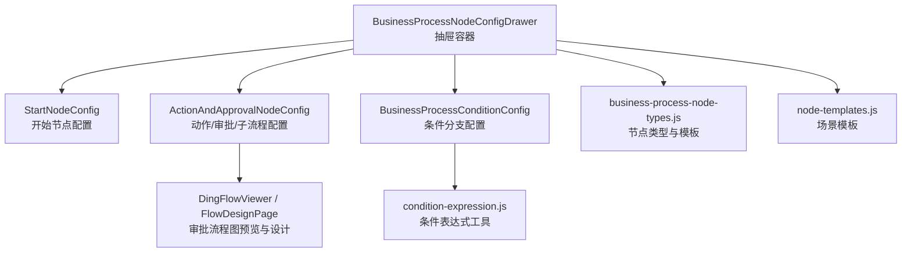
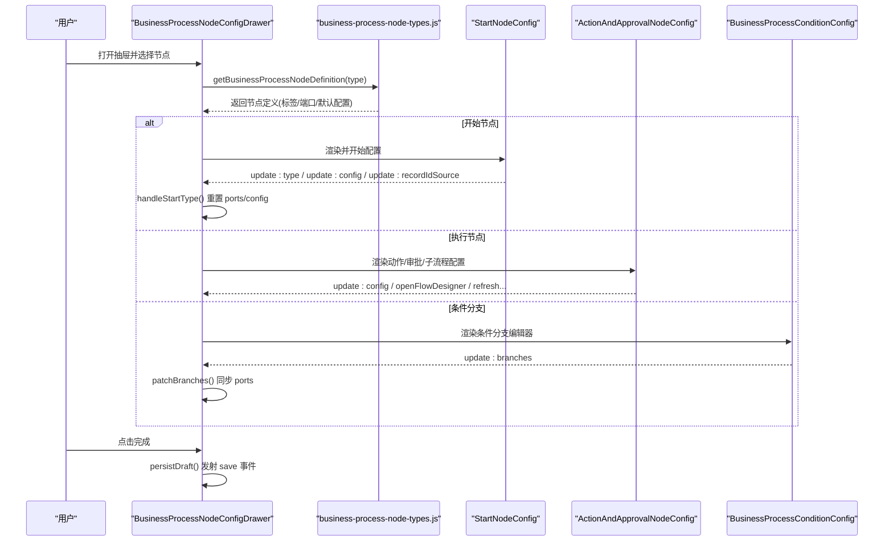
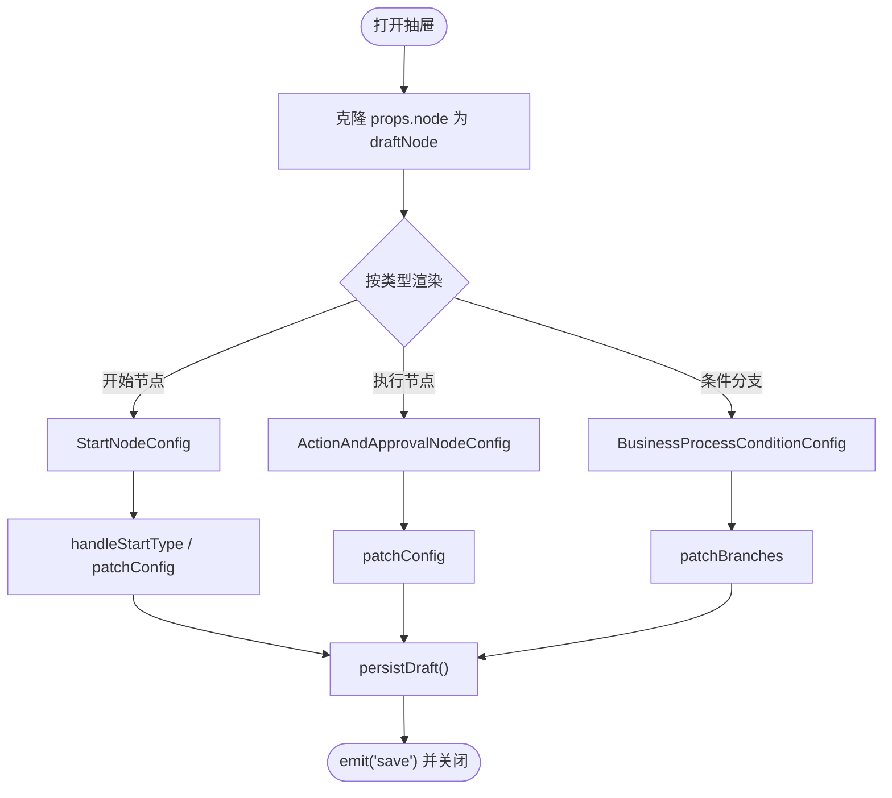
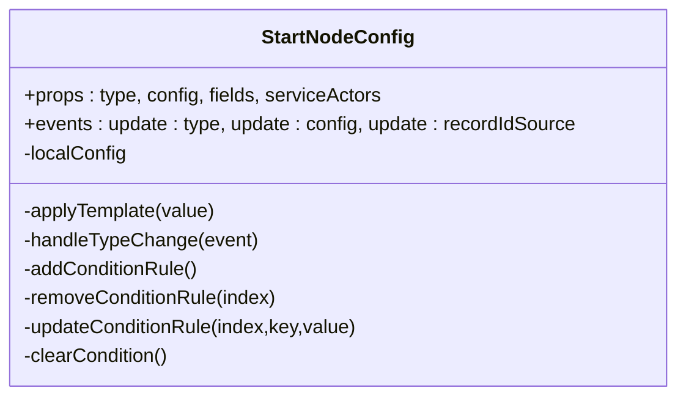
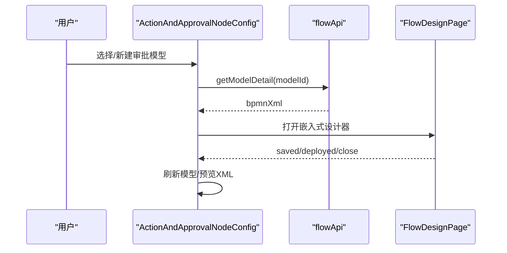
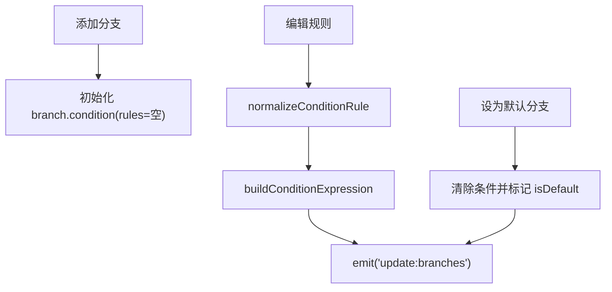
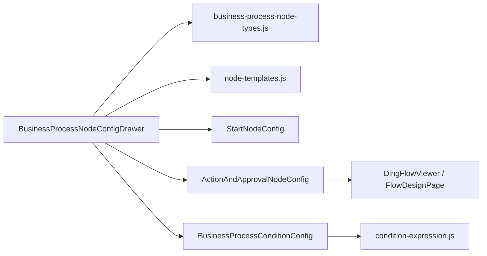

# 节点配置系统

<cite>
**本文引用的文件**
- [BusinessProcessNodeConfigDrawer.vue](file://forge-admin-ui/src/components/business-process-designer/BusinessProcessNodeConfigDrawer.vue)
- [ActionAndApprovalNodeConfig.vue](file://forge-admin-ui/src/components/business-process-designer/ActionAndApprovalNodeConfig.vue)
- [StartNodeConfig.vue](file://forge-admin-ui/src/components/business-process-designer/StartNodeConfig.vue)
- [BusinessProcessConditionConfig.vue](file://forge-admin-ui/src/components/business-process-designer/BusinessProcessConditionConfig.vue)
- [business-process-node-types.js](file://forge-admin-ui/src/components/business-process-designer/business-process-node-types.js)
- [node-templates.js](file://forge-admin-ui/src/components/business-process-designer/node-templates.js)
- [config-renderer-map.js](file://forge-admin-ui/src/components/flow-designer/panel/config-renderer-map.js)
- [condition-expression.js](file://forge-admin-ui/src/components/flow-designer/panel/condition-expression.js)
- [BusinessProcessSchemaValidator.java](file://forge-server/forge-framework/forge-plugin-parent/forge-plugin-generator/src/main/java/com/mdframe/forge/plugin/generator/businessprocess/validation/BusinessProcessSchemaValidator.java)
</cite>

## 目录
1. [简介](#简介)
2. [项目结构](#项目结构)
3. [核心组件](#核心组件)
4. [架构总览](#架构总览)
5. [详细组件分析](#详细组件分析)
6. [依赖关系分析](#依赖关系分析)
7. [性能与可维护性](#性能与可维护性)
8. [故障排查指南](#故障排查指南)
9. [结论](#结论)
10. [附录：自定义节点配置开发指南](#附录自定义节点配置开发指南)

## 简介
本技术文档聚焦业务流程设计器中的“节点配置系统”，围绕以下目标展开：
- 深入解析三类关键节点配置组件：动作审批节点配置（ActionAndApprovalNodeConfig）、开始节点配置（StartNodeConfig）、条件分支配置（BusinessProcessConditionConfig）。
- 说明 BusinessProcessNodeConfigDrawer 抽屉面板的交互逻辑、数据绑定机制与保存流程。
- 解释节点属性表单的动态生成、验证规则、数据同步策略。
- 梳理节点类型注册、配置模板系统与属性继承机制。
- 提供自定义节点配置组件的开发指南与最佳实践。

该系统的核心价值在于：以声明式模板驱动节点配置，通过统一的抽屉面板聚合不同节点类型的专属配置，并以前后端一致的校验规则保障流程模型的正确性与可执行性。

## 项目结构
业务流程节点配置系统主要位于前端业务流设计器模块中，采用“容器 + 专用配置”的分层组织方式：
- 容器组件：BusinessProcessNodeConfigDrawer 负责打开/关闭抽屉、选择并渲染对应节点的配置组件、统一保存与事件派发。
- 专用配置组件：
  - StartNodeConfig：开始节点（手动触发、事件触发、定时触发）的配置。
  - ActionAndApprovalNodeConfig：执行类节点（动作、审批、子流程）的配置。
  - BusinessProcessConditionConfig：条件分支的配置与表达式构建。
- 类型与模板：
  - business-process-node-types.js：定义节点类型、端口、默认配置与创建模板。
  - node-templates.js：提供开始节点与动作节点的常用场景模板。
- 协同能力：
  - flow-designer/panel/config-renderer-map.js：钉钉风格流程设计器的配置渲染映射表（用于对比与扩展参考）。
  - condition-expression.js：条件表达式的解析、构建与工具函数。
- 后端校验：
  - BusinessProcessSchemaValidator.java：服务端对条件分支等配置的强校验，确保流程模型可部署、可执行。

图表来源
- [BusinessProcessNodeConfigDrawer.vue:1-182](file://forge-admin-ui/src/components/business-process-designer/BusinessProcessNodeConfigDrawer.vue#L1-L182)
- [business-process-node-types.js:30-137](file://forge-admin-ui/src/components/business-process-designer/business-process-node-types.js#L30-L137)
- [node-templates.js:1-73](file://forge-admin-ui/src/components/business-process-designer/node-templates.js#L1-L73)
- [BusinessProcessConditionConfig.vue:1-205](file://forge-admin-ui/src/components/business-process-designer/BusinessProcessConditionConfig.vue#L1-L205)
- [ActionAndApprovalNodeConfig.vue:1-120](file://forge-admin-ui/src/components/business-process-designer/ActionAndApprovalNodeConfig.vue#L1-L120)

章节来源
- [BusinessProcessNodeConfigDrawer.vue:1-182](file://forge-admin-ui/src/components/business-process-designer/BusinessProcessNodeConfigDrawer.vue#L1-L182)
- [business-process-node-types.js:1-161](file://forge-admin-ui/src/components/business-process-designer/business-process-node-types.js#L1-L161)
- [node-templates.js:1-73](file://forge-admin-ui/src/components/business-process-designer/node-templates.js#L1-L73)

## 核心组件
- BusinessProcessNodeConfigDrawer：抽屉容器，负责：
  - 监听 visible 与 node 变化，克隆当前节点为草稿 draftNode。
  - 根据节点类型动态渲染 StartNodeConfig、ActionAndApprovalNodeConfig 或 BusinessProcessConditionConfig。
  - 统一管理 name、config、branches、ports 等字段变更，并通过 emit('save') 将草稿持久化。
  - 处理开始节点类型切换时，基于 createBusinessProcessNodeTemplate 重置 ports 与 config。
- StartNodeConfig：开始节点配置，支持：
  - 场景模板一键应用（手动点击、记录事件、状态变更、定时扫描）。
  - 触发方式切换（START_MANUAL / START_EVENT / START_SCHEDULE），自动重置配置。
  - 显示位置、按钮文案、确认文案、事件类型、日期字段、提前/回看天数、服务账号等。
  - 条件规则编辑（AND/OR 逻辑、增删改查规则），并计算 recordIdSource。
- ActionAndApprovalNodeConfig：执行类节点配置，支持：
  - 动作节点：场景模板（更新状态、调整数量、创建记录、发送消息），字段映射管理。
  - 审批节点：选择/新建审批模型、标题模板、任务表单绑定、独立流程状态字段管理、流程图预览与在线设计。
  - 子流程节点：选择已发布子流程。
- BusinessProcessConditionConfig：条件分支配置，支持：
  - 分支增删、默认分支设置、分支名称编辑。
  - 每条分支的规则编辑（字段、操作符、值/区间），支持 AND/OR 逻辑。
  - 将规则规范化并构建表达式，同步到 branches[].condition.expression。

章节来源
- [BusinessProcessNodeConfigDrawer.vue:40-182](file://forge-admin-ui/src/components/business-process-designer/BusinessProcessNodeConfigDrawer.vue#L40-L182)
- [StartNodeConfig.vue:1-126](file://forge-admin-ui/src/components/business-process-designer/StartNodeConfig.vue#L1-L126)
- [ActionAndApprovalNodeConfig.vue:1-120](file://forge-admin-ui/src/components/business-process-designer/ActionAndApprovalNodeConfig.vue#L1-L120)
- [BusinessProcessConditionConfig.vue:1-205](file://forge-admin-ui/src/components/business-process-designer/BusinessProcessConditionConfig.vue#L1-L205)

## 架构总览
下图展示了抽屉容器的交互与数据流向，以及各配置组件如何与类型/模板系统协作。

图表来源
- [BusinessProcessNodeConfigDrawer.vue:47-97](file://forge-admin-ui/src/components/business-process-designer/BusinessProcessNodeConfigDrawer.vue#L47-L97)
- [business-process-node-types.js:107-137](file://forge-admin-ui/src/components/business-process-designer/business-process-node-types.js#L107-L137)
- [StartNodeConfig.vue:36-55](file://forge-admin-ui/src/components/business-process-designer/StartNodeConfig.vue#L36-L55)
- [BusinessProcessConditionConfig.vue:127-191](file://forge-admin-ui/src/components/business-process-designer/BusinessProcessConditionConfig.vue#L127-L191)

## 详细组件分析

### BusinessProcessNodeConfigDrawer 抽屉面板
- 职责
  - 作为统一入口，根据节点类型分发到具体配置组件。
  - 维护本地草稿 draftNode，避免直接修改父级数据。
  - 统一保存：persistDraft 将草稿深拷贝后通过 emit('save', node, { recordIdSource }) 提交。
- 数据绑定
  - 名称输入双向绑定至 draftNode.name。
  - 开始节点通过 StartNodeConfig 的 update:type/update:config/update:recordIdSource 同步。
  - 执行节点通过 ActionAndApprovalNodeConfig 的 update:config 同步。
  - 条件分支通过 BusinessProcessConditionConfig 的 update:branches 同步，并据此重建 ports。
- 交互逻辑
  - 打开抽屉时克隆 props.node 为 draftNode。
  - 切换开始节点类型时，调用 createBusinessProcessNodeTemplate 重置 ports 与 config。
  - 保存时仅当 readonly=false 才触发持久化。

图表来源
- [BusinessProcessNodeConfigDrawer.vue:47-97](file://forge-admin-ui/src/components/business-process-designer/BusinessProcessNodeConfigDrawer.vue#L47-L97)
- [BusinessProcessNodeConfigDrawer.vue:116-182](file://forge-admin-ui/src/components/business-process-designer/BusinessProcessNodeConfigDrawer.vue#L116-L182)

章节来源
- [BusinessProcessNodeConfigDrawer.vue:1-182](file://forge-admin-ui/src/components/business-process-designer/BusinessProcessNodeConfigDrawer.vue#L1-L182)

### StartNodeConfig 开始节点配置
- 功能要点
  - 场景模板：一键应用预置配置（如手动点击、记录创建后、状态变更后、定时扫描）。
  - 触发方式：切换类型时基于 createBusinessProcessNodeTemplate 重置配置与 recordIdSource。
  - 条件规则：支持 AND/OR 组合、增删改规则、清除条件；非定时触发时显示条件卡片。
- 数据同步
  - 通过 emit('update:type'/'update:config'/'update:recordIdSource') 向父组件同步。
  - 内部使用 localConfig 副本，避免直接修改 props。
- 复杂度与边界
  - 条件规则数组为空时自动初始化一条基础规则。
  - 删除最后一条规则时清空条件。

图表来源
- [StartNodeConfig.vue:1-126](file://forge-admin-ui/src/components/business-process-designer/StartNodeConfig.vue#L1-L126)
- [StartNodeConfig.vue:128-339](file://forge-admin-ui/src/components/business-process-designer/StartNodeConfig.vue#L128-L339)

章节来源
- [StartNodeConfig.vue:1-339](file://forge-admin-ui/src/components/business-process-designer/StartNodeConfig.vue#L1-L339)

### ActionAndApprovalNodeConfig 动作/审批/子流程配置
- 功能要点
  - 动作节点：场景模板（更新状态、调整数量、创建记录、发送消息），字段映射列表增删改。
  - 审批节点：选择/新建审批模型、标题模板、任务表单绑定、独立流程状态字段一键添加、流程图预览与在线设计。
  - 子流程节点：选择已发布子流程。
- 数据同步
  - 通过 emit('update:config' 等) 向父组件同步。
  - 内部维护 localConfig，并在 watch(node/formAssets/fields) 时做默认绑定补全。
- 集成点
  - 打开审批流程图设计器（FlowDesignPage），并在关闭/保存/部署后刷新模型。
  - 调用 ensureBusinessFlowStatusField 为对象添加独立流程状态字段。

图表来源
- [ActionAndApprovalNodeConfig.vue:95-110](file://forge-admin-ui/src/components/business-process-designer/ActionAndApprovalNodeConfig.vue#L95-L110)
- [ActionAndApprovalNodeConfig.vue:160-235](file://forge-admin-ui/src/components/business-process-designer/ActionAndApprovalNodeConfig.vue#L160-L235)

章节来源
- [ActionAndApprovalNodeConfig.vue:1-707](file://forge-admin-ui/src/components/business-process-designer/ActionAndApprovalNodeConfig.vue#L1-L707)

### BusinessProcessConditionConfig 条件分支配置
- 功能要点
  - 分支管理：添加/删除分支、设置默认分支、编辑分支名称。
  - 规则编辑：字段、操作符、值/区间，支持 AND/OR 逻辑。
  - 表达式构建：将规则规范化并构建 expression，同时保持 operator/logic/rules 一致。
- 数据同步
  - 通过 emit('update:branches') 向父组件同步，父组件据此更新 ports。
- 与后端校验对齐
  - 前端构建的 rules/operator/expression 需满足后端 BusinessProcessSchemaValidator 的校验要求（非默认分支至少一条规则、operator 合法、必要字段与值存在等）。

图表来源
- [BusinessProcessConditionConfig.vue:127-191](file://forge-admin-ui/src/components/business-process-designer/BusinessProcessConditionConfig.vue#L127-L191)
- [BusinessProcessConditionConfig.vue:207-347](file://forge-admin-ui/src/components/business-process-designer/BusinessProcessConditionConfig.vue#L207-L347)

章节来源
- [BusinessProcessConditionConfig.vue:1-347](file://forge-admin-ui/src/components/business-process-designer/BusinessProcessConditionConfig.vue#L1-L347)

## 依赖关系分析
- 组件耦合
  - BusinessProcessNodeConfigDrawer 与三个配置组件松耦合，通过 props/events 通信。
  - 配置组件依赖 business-process-node-types.js 与 node-templates.js 获取类型定义与模板。
  - 条件分支组件依赖 condition-expression.js 进行表达式解析与构建。
- 外部依赖
  - Naive UI 组件（NButton/NSelect/NTag/NEmpty 等）。
  - 审批流程图预览/设计：DingFlowViewer、FlowDesignPage。
  - 后端校验：BusinessProcessSchemaValidator 对条件分支进行强校验。
- 潜在循环依赖
  - 当前未见循环导入；配置组件均单向依赖类型/模板与表达式工具。

图表来源
- [BusinessProcessNodeConfigDrawer.vue:1-12](file://forge-admin-ui/src/components/business-process-designer/BusinessProcessNodeConfigDrawer.vue#L1-L12)
- [business-process-node-types.js:107-137](file://forge-admin-ui/src/components/business-process-designer/business-process-node-types.js#L107-L137)
- [node-templates.js:42-60](file://forge-admin-ui/src/components/business-process-designer/node-templates.js#L42-L60)
- [BusinessProcessConditionConfig.vue:1-11](file://forge-admin-ui/src/components/business-process-designer/BusinessProcessConditionConfig.vue#L1-L11)

章节来源
- [business-process-node-types.js:107-137](file://forge-admin-ui/src/components/business-process-designer/business-process-node-types.js#L107-L137)
- [node-templates.js:42-60](file://forge-admin-ui/src/components/business-process-designer/node-templates.js#L42-L60)
- [BusinessProcessConditionConfig.vue:1-11](file://forge-admin-ui/src/components/business-process-designer/BusinessProcessConditionConfig.vue#L1-L11)

## 性能与可维护性
- 性能考虑
  - 条件分支最多允许 20 条，避免过多分支导致渲染与校验压力。
  - 审批流程图预览按需加载 XML，减少初始开销。
  - 使用深拷贝避免意外共享引用，保证局部状态稳定。
- 可维护性
  - 类型与模板集中管理，新增节点类型只需在 business-process-node-types.js 与 node-templates.js 扩展。
  - 条件表达式工具集中封装，前后端校验规则保持一致。
  - 抽屉容器职责单一，便于测试与复用。

[本节为通用建议，不直接分析具体文件]

## 故障排查指南
- 条件分支校验失败
  - 现象：保存或部署时报错提示缺少规则、操作符无效或缺少值。
  - 定位：检查 BusinessProcessConditionConfig 生成的 rules/operator/expression 是否完整。
  - 依据：后端 BusinessProcessSchemaValidator 对非默认分支至少一条规则、operator 合法、value/endValue 必填等进行校验。
- 审批流程图未显示
  - 现象：选择审批模型后预览空白。
  - 定位：检查 flowApi.getModelDetail 是否成功返回 bpmnXml，以及 selectedFlowModelId 是否正确。
- 开始节点类型切换丢失配置
  - 现象：切换触发方式后配置被重置。
  - 定位：这是预期行为，由 createBusinessProcessNodeTemplate 重置 config/ports；如需保留请在上层做合并策略。
- 字段选项为空
  - 现象：条件分支无法选择字段。
  - 定位：确认传入 fields 是否有效，且包含 fieldCode/value 等标识。

章节来源
- [BusinessProcessSchemaValidator.java:559-604](file://forge-server/forge-framework/forge-plugin-parent/forge-plugin-generator/src/main/java/com/mdframe/forge/plugin/generator/businessprocess/validation/BusinessProcessSchemaValidator.java#L559-L604)
- [ActionAndApprovalNodeConfig.vue:95-110](file://forge-admin-ui/src/components/business-process-designer/ActionAndApprovalNodeConfig.vue#L95-L110)
- [StartNodeConfig.vue:47-55](file://forge-admin-ui/src/components/business-process-designer/StartNodeConfig.vue#L47-L55)
- [BusinessProcessConditionConfig.vue:21-38](file://forge-admin-ui/src/components/business-process-designer/BusinessProcessConditionConfig.vue#L21-L38)

## 结论
业务流程节点配置系统通过“容器 + 专用配置 + 类型/模板 + 表达式工具”的分层架构，实现了高内聚、低耦合的可扩展设计。抽屉面板统一了交互与数据流，配合前后端一致的校验规则，确保了流程模型的正确性与可执行性。对于新增节点类型或复杂场景，推荐遵循现有模式：在类型定义与模板中声明默认配置，在专用配置组件中实现交互与数据同步，并通过条件表达式工具保证规则一致性。

[本节为总结，不直接分析具体文件]

## 附录：自定义节点配置开发指南
- 新增节点类型
  - 在 business-process-node-types.js 中添加类型常量与 NODE_DEFINITIONS，定义 label/category/ports/tone/createConfig。
  - 如需支持开始节点类型，将其加入 BUSINESS_PROCESS_START_TYPES。
- 新增场景模板
  - 在 node-templates.js 中定义模板项（label/value/description/nodeType/config/steps），并提供工厂方法生成配置。
- 实现专用配置组件
  - 接收 props（type/config/fields 等），维护 localConfig 副本。
  - 通过 emit('update:config' 等) 向父组件同步，必要时 emit('update:type'/'update:recordIdSource')。
  - 若涉及条件规则，复用 condition-expression.js 的工具函数进行解析与构建。
- 接入抽屉面板
  - 在 BusinessProcessNodeConfigDrawer 中按节点类型条件渲染新组件，并处理 update:* 事件。
  - 若需要更新 ports，参照 patchBranches 的模式在父组件中同步。
- 验证与测试
  - 前端：覆盖模板应用、类型切换、规则增删改、默认分支设置等用例。
  - 后端：确保生成的 rules/operator/expression 满足 BusinessProcessSchemaValidator 的校验。

章节来源
- [business-process-node-types.js:30-137](file://forge-admin-ui/src/components/business-process-designer/business-process-node-types.js#L30-L137)
- [node-templates.js:1-73](file://forge-admin-ui/src/components/business-process-designer/node-templates.js#L1-L73)
- [BusinessProcessNodeConfigDrawer.vue:116-182](file://forge-admin-ui/src/components/business-process-designer/BusinessProcessNodeConfigDrawer.vue#L116-L182)
- [BusinessProcessConditionConfig.vue:127-191](file://forge-admin-ui/src/components/business-process-designer/BusinessProcessConditionConfig.vue#L127-L191)
- [BusinessProcessSchemaValidator.java:559-604](file://forge-server/forge-framework/forge-plugin-parent/forge-plugin-generator/src/main/java/com/mdframe/forge/plugin/generator/businessprocess/validation/BusinessProcessSchemaValidator.java#L559-L604)