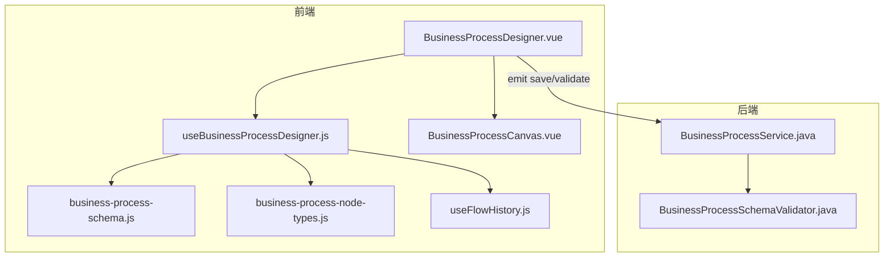
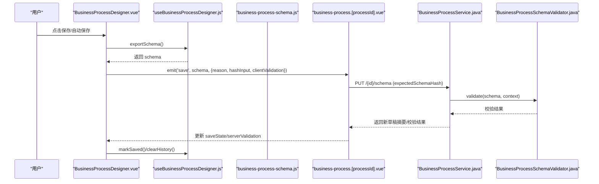
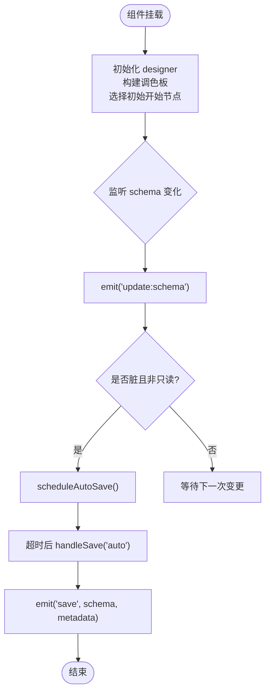
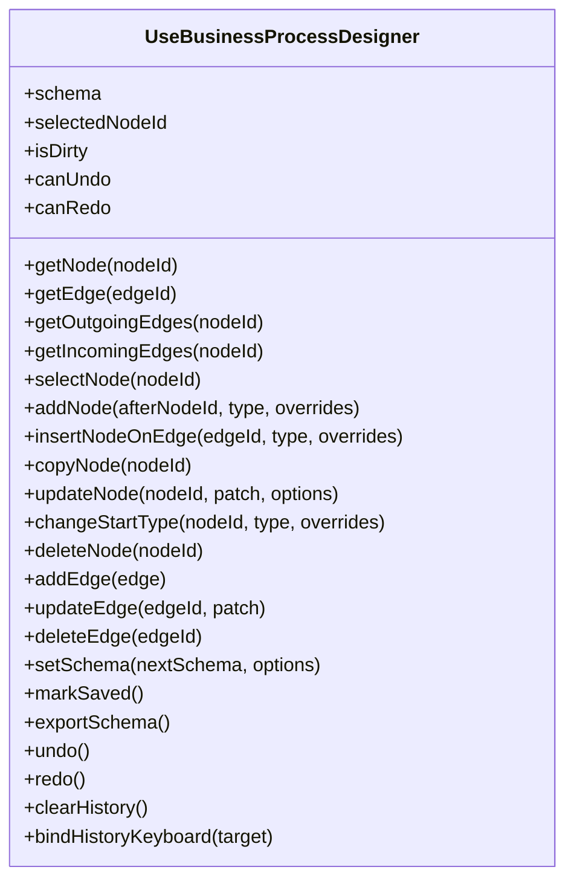
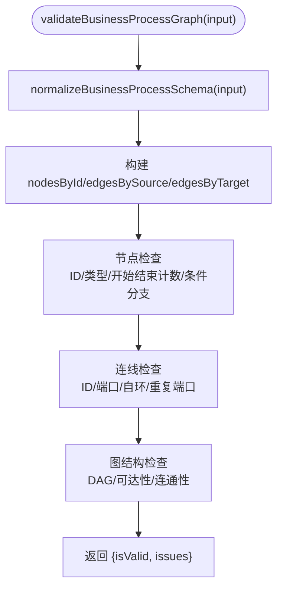
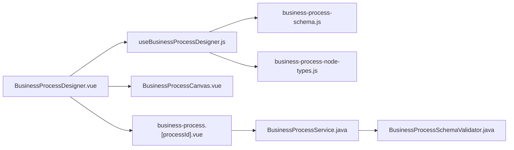

# 设计器核心架构

<cite>
**本文引用的文件**
- [BusinessProcessDesigner.vue](file://forge-admin-ui/src/components/business-process-designer/BusinessProcessDesigner.vue)
- [useBusinessProcessDesigner.js](file://forge-admin-ui/src/components/business-process-designer/useBusinessProcessDesigner.js)
- [business-process-schema.js](file://forge-admin-ui/src/components/business-process-designer/business-process-schema.js)
- [business-process-node-types.js](file://forge-admin-ui/src/components/business-process-designer/business-process-node-types.js)
- [BusinessProcessCanvas.vue](file://forge-admin-ui/src/components/business-process-designer/BusinessProcessCanvas.vue)
- [useFlowHistory.js](file://forge-admin-ui/src/components/flow-designer/composables/useFlowHistory.js)
- [BusinessProcessSchemaValidator.java](file://forge-server/forge-framework/forge-plugin-parent/forge-plugin-generator/src/main/java/com/mdframe/forge/plugin/generator/businessprocess/validation/BusinessProcessSchemaValidator.java)
- [BusinessProcessService.java](file://forge-server/forge-framework/forge-plugin-parent/forge-plugin-generator/src/main/java/com/mdframe/forge/plugin/generator/service/businessprocess/BusinessProcessService.java)
- [business-process.[processId].vue](file://forge-admin-ui/src/views/app-center/business-process.[processId].vue)
</cite>

## 目录
1. [简介](#简介)
2. [项目结构](#项目结构)
3. [核心组件](#核心组件)
4. [架构总览](#架构总览)
5. [详细组件分析](#详细组件分析)
6. [依赖关系分析](#依赖关系分析)
7. [性能考量](#性能考量)
8. [故障排查指南](#故障排查指南)
9. [结论](#结论)
10. [附录：API参考与使用示例](#附录api参考与使用示例)

## 简介
本技术文档聚焦业务流程设计器的核心架构，围绕 BusinessProcessDesigner 主组件、useBusinessProcessDesigner 组合式函数、业务过程 Schema 定义与验证规则、状态管理与生命周期钩子、事件处理系统、数据持久化与冲突解决、扩展点机制与插件系统集成进行系统化解析。文档同时提供可视化架构图、时序图与流程图，帮助读者快速理解从前端交互到后端校验保存的完整链路。

## 项目结构
业务流程设计器位于前端工程 forge-admin-ui 中，采用“组合式函数 + 组件”的分层组织方式：
- 组合式函数 useBusinessProcessDesigner 负责流程模型的状态管理、节点/连线操作、撤销重做、脏标记与依赖同步。
- 组件 BusinessProcessDesigner.vue 作为容器，编排画布、调色板、配置抽屉、问题面板、自动保存与校验。
- business-process-schema.js 定义并规范化业务过程 JSON Schema，提供创建、克隆、哈希、依赖同步与客户端图校验能力。
- business-process-node-types.js 集中声明节点类型、端口、默认配置与标签映射。
- BusinessProcessCanvas.vue 复用通用 FlowCanvas 与 EdgeLayer，实现拖拽插入、布局计算与渲染。
- 后端通过 BusinessProcessSchemaValidator 与 BusinessProcessService 完成服务端校验与草稿保存。

**图表来源**
- [BusinessProcessDesigner.vue:1-120](file://forge-admin-ui/src/components/business-process-designer/BusinessProcessDesigner.vue#L1-L120)
- [useBusinessProcessDesigner.js:16-405](file://forge-admin-ui/src/components/business-process-designer/useBusinessProcessDesigner.js#L16-L405)
- [business-process-schema.js:1-190](file://forge-admin-ui/src/components/business-process-designer/business-process-schema.js#L1-L190)
- [business-process-node-types.js:1-161](file://forge-admin-ui/src/components/business-process-designer/business-process-node-types.js#L1-L161)
- [BusinessProcessCanvas.vue:1-127](file://forge-admin-ui/src/components/business-process-designer/BusinessProcessCanvas.vue#L1-L127)
- [useFlowHistory.js:25-112](file://forge-admin-ui/src/components/flow-designer/composables/useFlowHistory.js#L25-L112)
- [BusinessProcessSchemaValidator.java:132-229](file://forge-server/forge-framework/forge-plugin-parent/forge-plugin-generator/src/main/java/com/mdframe/forge/plugin/generator/businessprocess/validation/BusinessProcessSchemaValidator.java#L132-L229)
- [BusinessProcessService.java:424-446](file://forge-server/forge-framework/forge-plugin-parent/forge-plugin-generator/src/main/java/com/mdframe/forge/plugin/generator/service/businessprocess/BusinessProcessService.java#L424-L446)

**章节来源**
- [BusinessProcessDesigner.vue:1-120](file://forge-admin-ui/src/components/business-process-designer/BusinessProcessDesigner.vue#L1-L120)
- [useBusinessProcessDesigner.js:16-405](file://forge-admin-ui/src/components/business-process-designer/useBusinessProcessDesigner.js#L16-L405)
- [business-process-schema.js:1-190](file://forge-admin-ui/src/components/business-process-designer/business-process-schema.js#L1-L190)
- [business-process-node-types.js:1-161](file://forge-admin-ui/src/components/business-process-designer/business-process-node-types.js#L1-L161)
- [BusinessProcessCanvas.vue:1-127](file://forge-admin-ui/src/components/business-process-designer/BusinessProcessCanvas.vue#L1-L127)
- [useFlowHistory.js:25-112](file://forge-admin-ui/src/components/flow-designer/composables/useFlowHistory.js#L25-L112)
- [BusinessProcessSchemaValidator.java:132-229](file://forge-server/forge-framework/forge-plugin-parent/forge-plugin-generator/src/main/java/com/mdframe/forge/plugin/generator/businessprocess/validation/BusinessProcessSchemaValidator.java#L132-L229)
- [BusinessProcessService.java:424-446](file://forge-server/forge-framework/forge-plugin-parent/forge-plugin-generator/src/main/java/com/mdframe/forge/plugin/generator/service/businessprocess/BusinessProcessService.java#L424-L446)

## 核心组件
- BusinessProcessDesigner.vue：设计器容器，负责工具栏、调色板、画布、配置抽屉、问题面板、自动保存、校验与事件派发。
- useBusinessProcessDesigner.js：设计器状态机与命令集，封装节点/连线 CRUD、条件分支同步、依赖同步、撤销重做、脏标记导出等。
- business-process-schema.js：Schema 规范、归一化、哈希、依赖同步与客户端图校验（DAG、可达性、端口一致性等）。
- business-process-node-types.js：节点类型注册表、端口定义、默认配置与标签映射。
- BusinessProcessCanvas.vue：基于通用 FlowCanvas 的业务节点渲染、拖拽插入、布局计算与插入目标定位。
- useFlowHistory.js：基于快照栈的撤销/重做能力，支持键盘快捷键绑定。

**章节来源**
- [BusinessProcessDesigner.vue:17-120](file://forge-admin-ui/src/components/business-process-designer/BusinessProcessDesigner.vue#L17-L120)
- [useBusinessProcessDesigner.js:16-405](file://forge-admin-ui/src/components/business-process-designer/useBusinessProcessDesigner.js#L16-L405)
- [business-process-schema.js:114-190](file://forge-admin-ui/src/components/business-process-designer/business-process-schema.js#L114-L190)
- [business-process-node-types.js:30-161](file://forge-admin-ui/src/components/business-process-designer/business-process-node-types.js#L30-L161)
- [BusinessProcessCanvas.vue:13-127](file://forge-admin-ui/src/components/business-process-designer/BusinessProcessCanvas.vue#L13-L127)
- [useFlowHistory.js:25-112](file://forge-admin-ui/src/components/flow-designer/composables/useFlowHistory.js#L25-L112)

## 架构总览
设计器采用“视图-状态-模型-校验-持久化”的分层架构：
- 视图层：BusinessProcessDesigner.vue 聚合 UI 子组件，暴露 save/validate/dirtyChange 等事件。
- 状态层：useBusinessProcessDesigner.js 维护 schema、selectedNodeId、isDirty、撤销栈等。
- 模型层：business-process-schema.js 定义 Schema 结构与约束，提供 create/normalize/synchronize/hash/validate 等能力。
- 校验层：客户端 validateBusinessProcessGraph 与后端 BusinessProcessSchemaValidator 共同保障图结构与依赖完整性。
- 持久化层：页面级控制器 business-process.[processId].vue 调用后端 API 保存草稿，处理冲突与并发基线。

**图表来源**
- [BusinessProcessDesigner.vue:360-388](file://forge-admin-ui/src/components/business-process-designer/BusinessProcessDesigner.vue#L360-L388)
- [useBusinessProcessDesigner.js:239-272](file://forge-admin-ui/src/components/business-process-designer/useBusinessProcessDesigner.js#L239-L272)
- [business-process-schema.js:188-190](file://forge-admin-ui/src/components/business-process-designer/business-process-schema.js#L188-L190)
- [business-process.[processId].vue:316-349](file://forge-admin-ui/src/views/app-center/business-process.[processId].vue#L316-L349)
- [BusinessProcessService.java:424-446](file://forge-server/forge-framework/forge-plugin-parent/forge-plugin-generator/src/main/java/com/mdframe/forge/plugin/generator/service/businessprocess/BusinessProcessService.java#L424-L446)
- [BusinessProcessSchemaValidator.java:132-229](file://forge-server/forge-framework/forge-plugin-parent/forge-plugin-generator/src/main/java/com/mdframe/forge/plugin/generator/businessprocess/validation/BusinessProcessSchemaValidator.java#L132-L229)

## 详细组件分析

### BusinessProcessDesigner.vue：容器与生命周期
- 职责
  - 接收 props：schema、processName、readonly、autoSaveDelay、saveState、serverValidation、对象/字段/表单资产/能力/子流程/服务角色等。
  - 初始化 designer 实例，构建调色板，计算当前选中节点与客户端校验结果。
  - 监听 schema 变更，触发 update:schema 与自动保存调度；监听 isDirty 变化派发 dirtyChange。
  - 监听外部 schema 变化，合并差异并清空历史；监听 formAssets 变化为审批节点补齐默认表单引用。
  - 保存时携带 clientValidation 与 hashInput；冲突时提示刷新；离开前阻止未保存关闭。
- 关键生命周期与钩子
  - onMounted/onBeforeUnmount：注册 beforeunload 与清理定时器。
  - watch(schema)、watch(isDirty)、watch(props.schema)、watch(formAssets)、watch(saveState)。
- 事件与暴露
  - emits：update:schema、save、validate、openFlowDesigner、refreshFlowModel、refreshFields、editAction、dirtyChange、locateIssue、reload。
  - defineExpose：designer、markSaved、exportSchema、hasUnsavedChanges。

**图表来源**
- [BusinessProcessDesigner.vue:51-120](file://forge-admin-ui/src/components/business-process-designer/BusinessProcessDesigner.vue#L51-L120)
- [BusinessProcessDesigner.vue:360-388](file://forge-admin-ui/src/components/business-process-designer/BusinessProcessDesigner.vue#L360-L388)
- [BusinessProcessDesigner.vue:442-473](file://forge-admin-ui/src/components/business-process-designer/BusinessProcessDesigner.vue#L442-L473)

**章节来源**
- [BusinessProcessDesigner.vue:17-120](file://forge-admin-ui/src/components/business-process-designer/BusinessProcessDesigner.vue#L17-L120)
- [BusinessProcessDesigner.vue:333-388](file://forge-admin-ui/src/components/business-process-designer/BusinessProcessDesigner.vue#L333-L388)
- [BusinessProcessDesigner.vue:442-473](file://forge-admin-ui/src/components/business-process-designer/BusinessProcessDesigner.vue#L442-L473)

### useBusinessProcessDesigner.js：状态机与命令集
- 状态
  - schema：规范化后的流程模型。
  - selectedNodeId：当前选中节点 ID。
  - savedHashInput：用于 isDirty 比较的基准哈希。
  - history：撤销/重做栈。
- 核心方法
  - 查询：getNode/getEdge/getOutgoingEdges/getIncomingEdges/selectNode。
  - 节点操作：addNode/insertNodeOnEdge/copyNode/updateNode/changeStartType/deleteNode。
  - 连线操作：addEdge/updateEdge/deleteEdge。
  - 模式切换：setSchema/markSaved/exportSchema。
  - 历史：undo/redo/clearHistory/bindHistoryKeyboard。
  - 内部：replaceSchema 在替换前执行依赖同步 synchronizeBusinessProcessDependencies。
- 约束与健壮性
  - 开始/结束节点保护：禁止重复插入、删除或复制。
  - 唯一后继约束：插入/复制需确保唯一出边。
  - 条件分支同步：更新 branches 时同步 ports 与 edges，保证端口一致性与默认分支存在。
  - ID 生成：nextGraphId 避免冲突；requireNewNodeId/requireNewEdgeId 强制字符串与非空。
  - 深拷贝策略：deepClone 避免共享引用导致副作用。

**图表来源**
- [useBusinessProcessDesigner.js:16-405](file://forge-admin-ui/src/components/business-process-designer/useBusinessProcessDesigner.js#L16-L405)

**章节来源**
- [useBusinessProcessDesigner.js:16-405](file://forge-admin-ui/src/components/business-process-designer/useBusinessProcessDesigner.js#L16-L405)

### business-process-schema.js：Schema 定义与验证
- 版本与根键
  - schemaVersion 固定为 1.0；根键限定为 schemaVersion/processCode/subject/nodes/edges/policies/dependencies/metadata。
- 主体 subject
  - objectId/objectCode/objectVersionId/recordIdSource；不同开始类型对应不同 recordIdSource。
- 节点与连线
  - nodes：id/type/name/ports/config；edges：id/source/target/sourcePort/condition/isDefault。
- 依赖 dependencies
  - objects/flowModels/formAssets/businessActions/messageTemplates/capabilities/subProcesses。
  - 通过 synchronizeBusinessProcessDependencies 扫描节点配置，自动推导依赖集合。
- 客户端图校验 validateBusinessProcessGraph
  - 节点：ID 必填/唯一、类型合法、开始/结束数量限制、条件分支合法性。
  - 连线：ID 必填/唯一、source/target 存在、无自环、端口合法且唯一、条件分支与连线一致。
  - 连通性：DAG 检测、从开始可达所有节点、所有节点可到达结束。
- 哈希与克隆
  - businessProcessHashInput 对规范化后的 schema 稳定序列化，用于冲突检测与脏标记。
  - cloneBusinessProcessSchema 安全克隆。

**图表来源**
- [business-process-schema.js:192-356](file://forge-admin-ui/src/components/business-process-designer/business-process-schema.js#L192-L356)

**章节来源**
- [business-process-schema.js:1-190](file://forge-admin-ui/src/components/business-process-designer/business-process-schema.js#L1-L190)
- [business-process-schema.js:192-356](file://forge-admin-ui/src/components/business-process-designer/business-process-schema.js#L192-L356)
- [business-process-schema.js:358-458](file://forge-admin-ui/src/components/business-process-designer/business-process-schema.js#L358-L458)

### business-process-node-types.js：节点类型与端口
- 节点类型：START_MANUAL/START_EVENT/START_SCHEDULE/CONDITION/ACTION/APPROVAL/SUB_PROCESS/END。
- 端口定义：NEXT/APPROVED/REJECTED/CANCELED/FAILED/MATCHED/OTHERWISE。
- 默认配置：各类型节点的 createConfig 模板，如 ACTION 默认 UPDATE_RECORD，APPROVAL 默认版本策略等。
- 工具方法：getBusinessProcessNodeDefinition/listBusinessProcessNodeDefinitions/createBusinessProcessNodeTemplate/isBusinessProcessStartType/getBusinessProcessPortLabel。

**章节来源**
- [business-process-node-types.js:1-161](file://forge-admin-ui/src/components/business-process-designer/business-process-node-types.js#L1-L161)

### BusinessProcessCanvas.vue：画布与拖拽插入
- 复用 FlowCanvas 与 EdgeLayer，注入业务节点渲染与插入按钮。
- 计算 layoutResult（节点位置、边路径、画布边界），根据边路径计算插入目标点。
- 拖拽支持：dragover/drop 识别最近插入目标，emit insertNode({edgeId, type})。
- 只读模式禁用拖拽与插入。

**章节来源**
- [BusinessProcessCanvas.vue:13-127](file://forge-admin-ui/src/components/business-process-designer/BusinessProcessCanvas.vue#L13-L127)

### 撤销/重做：useFlowHistory.js
- 基于 JSON 快照的命令栈，支持 maxStack 容量控制。
- snapshot/undo/redo/clear 与键盘快捷键绑定（Ctrl/Cmd+Z/Y）。
- 由 useBusinessProcessDesigner 在每次变更前后调用 snapshot，保证撤销粒度。

**章节来源**
- [useFlowHistory.js:25-112](file://forge-admin-ui/src/components/flow-designer/composables/useFlowHistory.js#L25-L112)

## 依赖关系分析
- 组件耦合
  - BusinessProcessDesigner.vue 强依赖 useBusinessProcessDesigner.js 提供的状态与命令。
  - useBusinessProcessDesigner.js 依赖 business-process-schema.js 与 business-process-node-types.js。
  - BusinessProcessCanvas.vue 依赖通用 FlowCanvas 与业务节点渲染器。
- 外部依赖
  - 后端校验：BusinessProcessSchemaValidator 在服务端执行更严格的依赖与权限校验。
  - 后端保存：BusinessProcessService 负责并发基线 expectedSchemaHash 与草稿落库。
- 潜在循环
  - 前端模块间单向依赖，未发现循环导入；后端通过 Service -> Validator 分层清晰。

**图表来源**
- [BusinessProcessDesigner.vue:1-120](file://forge-admin-ui/src/components/business-process-designer/BusinessProcessDesigner.vue#L1-L120)
- [useBusinessProcessDesigner.js:16-405](file://forge-admin-ui/src/components/business-process-designer/useBusinessProcessDesigner.js#L16-L405)
- [business-process-schema.js:1-190](file://forge-admin-ui/src/components/business-process-designer/business-process-schema.js#L1-L190)
- [business-process-node-types.js:1-161](file://forge-admin-ui/src/components/business-process-designer/business-process-node-types.js#L1-L161)
- [BusinessProcessCanvas.vue:1-127](file://forge-admin-ui/src/components/business-process-designer/BusinessProcessCanvas.vue#L1-L127)
- [business-process.[processId].vue:316-349](file://forge-admin-ui/src/views/app-center/business-process.[processId].vue#L316-L349)
- [BusinessProcessService.java:424-446](file://forge-server/forge-framework/forge-plugin-parent/forge-plugin-generator/src/main/java/com/mdframe/forge/plugin/generator/service/businessprocess/BusinessProcessService.java#L424-L446)
- [BusinessProcessSchemaValidator.java:132-229](file://forge-server/forge-framework/forge-plugin-parent/forge-plugin-generator/src/main/java/com/mdframe/forge/plugin/generator/businessprocess/validation/BusinessProcessSchemaValidator.java#L132-L229)

**章节来源**
- [BusinessProcessDesigner.vue:1-120](file://forge-admin-ui/src/components/business-process-designer/BusinessProcessDesigner.vue#L1-L120)
- [useBusinessProcessDesigner.js:16-405](file://forge-admin-ui/src/components/business-process-designer/useBusinessProcessDesigner.js#L16-L405)
- [business-process-schema.js:1-190](file://forge-admin-ui/src/components/business-process-designer/business-process-schema.js#L1-L190)
- [business-process-node-types.js:1-161](file://forge-admin-ui/src/components/business-process-designer/business-process-node-types.js#L1-L161)
- [BusinessProcessCanvas.vue:1-127](file://forge-admin-ui/src/components/business-process-designer/BusinessProcessCanvas.vue#L1-L127)
- [business-process.[processId].vue:316-349](file://forge-admin-ui/src/views/app-center/business-process.[processId].vue#L316-L349)
- [BusinessProcessService.java:424-446](file://forge-server/forge-framework/forge-plugin-parent/forge-plugin-generator/src/main/java/com/mdframe/forge/plugin/generator/service/businessprocess/BusinessProcessService.java#L424-L446)
- [BusinessProcessSchemaValidator.java:132-229](file://forge-server/forge-framework/forge-plugin-parent/forge-plugin-generator/src/main/java/com/mdframe/forge/plugin/generator/businessprocess/validation/BusinessProcessSchemaValidator.java#L132-L229)

## 性能考量
- 快照成本：撤销/重做使用深拷贝快照，maxStack 默认 50，避免无限增长；建议在大图场景下合理设置 maxHistory。
- 校验开销：validateBusinessProcessGraph 包含图遍历与可达性计算，建议在批量变更后统一校验而非频繁触发。
- 依赖同步：synchronizeBusinessProcessDependencies 每次 replaceSchema 都会扫描节点配置，尽量减少不必要的更新。
- 渲染优化：BusinessProcessCanvas 复用 EdgeLayer 与 FlowCanvas，仅按需计算插入目标点与布局。

[本节为通用指导，不直接分析具体文件]

## 故障排查指南
- 常见错误与修复建议
  - 找不到插入位置对应的业务流程节点/连线：确认 afterNodeId/edgeId 有效，且处于唯一后继连线上。
  - 每个业务流程只能保留一个开始节点：避免重复插入开始节点。
  - 流程结束节点由系统维护：禁止插入第二个结束节点。
  - 条件分支标识重复：调整分支 port 或撤销后重试。
  - 该分支已有独立下游节点，请先删除分支线上的节点再删除分支：先处理下游节点再删除分支。
  - 业务画布必须是有向无环图：移除环路或调整连接方向。
  - 节点无法从开始节点到达/没有通向结束节点的路径：补全连接或修正分支汇合。
- 保存冲突
  - HTTP 409 表示草稿冲突：提示刷新到最新版本后再编辑，避免覆盖他人修改。
- 校验失败
  - 客户端校验 issues 列表显示问题编码、位置与建议；结合服务端 serverValidation 综合定位。

**章节来源**
- [useBusinessProcessDesigner.js:45-95](file://forge-admin-ui/src/components/business-process-designer/useBusinessProcessDesigner.js#L45-L95)
- [useBusinessProcessDesigner.js:164-197](file://forge-admin-ui/src/components/business-process-designer/useBusinessProcessDesigner.js#L164-L197)
- [useBusinessProcessDesigner.js:296-362](file://forge-admin-ui/src/components/business-process-designer/useBusinessProcessDesigner.js#L296-L362)
- [business-process-schema.js:192-356](file://forge-admin-ui/src/components/business-process-designer/business-process-schema.js#L192-L356)
- [business-process.[processId].vue:316-349](file://forge-admin-ui/src/views/app-center/business-process.[processId].vue#L316-L349)

## 结论
业务流程设计器以清晰的层次划分与严格的 Schema 约束，实现了高内聚、低耦合的设计。useBusinessProcessDesigner 将复杂的状态与命令抽象为可测试的接口；business-process-schema.js 提供强大的客户端校验与依赖同步；BusinessProcessDesigner.vue 将交互、校验、持久化串联成流畅的用户体验。配合后端的严格校验与并发控制，整体方案兼顾了易用性与可靠性。

[本节为总结性内容，不直接分析具体文件]

## 附录：API参考与使用示例

### 组合式函数 API（useBusinessProcessDesigner）
- 输入
  - initialSchema：业务过程 JSON（会被 normalizeBusinessProcessSchema 规范化）。
  - options.maxHistory：撤销栈最大长度，默认 50。
- 返回值
  - 状态：schema、selectedNodeId、isDirty、canUndo、canRedo。
  - 查询：getNode/getEdge/getOutgoingEdges/getIncomingEdges/selectNode。
  - 节点：addNode/insertNodeOnEdge/copyNode/updateNode/changeStartType/deleteNode。
  - 连线：addEdge/updateEdge/deleteEdge。
  - 模式：setSchema/markSaved/exportSchema。
  - 历史：undo/redo/clearHistory/bindHistoryKeyboard。

**章节来源**
- [useBusinessProcessDesigner.js:16-405](file://forge-admin-ui/src/components/business-process-designer/useBusinessProcessDesigner.js#L16-L405)

### Schema 工具 API（business-process-schema.js）
- createBusinessProcessSchema：创建最小可用流程（含开始/结束节点与默认策略/依赖）。
- normalizeBusinessProcessSchema：规范化输入，校验根键与字段类型。
- cloneBusinessProcessSchema：安全克隆。
- synchronizeBusinessProcessDependencies：根据节点配置推导 dependencies。
- businessProcessHashInput：稳定哈希，用于冲突检测与脏标记。
- validateBusinessProcessGraph：客户端图校验，返回 {isValid, issues}。

**章节来源**
- [business-process-schema.js:50-190](file://forge-admin-ui/src/components/business-process-designer/business-process-schema.js#L50-L190)
- [business-process-schema.js:192-356](file://forge-admin-ui/src/components/business-process-designer/business-process-schema.js#L192-L356)

### 组件 Props/Events（BusinessProcessDesigner.vue）
- Props
  - schema、processName、readonly、autoSaveDelay、saveState、saveError、serverValidation、objectId、objectName、fields、objects、flowModels、formAssets、businessActions、messageTemplates、capabilities、subProcesses、serviceActors。
- Events
  - update:schema、save、validate、openFlowDesigner、refreshFlowModel、refreshFields、editAction、dirtyChange、locateIssue、reload。
- 暴露
  - designer、markSaved、exportSchema、hasUnsavedChanges。

**章节来源**
- [BusinessProcessDesigner.vue:17-50](file://forge-admin-ui/src/components/business-process-designer/BusinessProcessDesigner.vue#L17-L50)
- [BusinessProcessDesigner.vue:475-480](file://forge-admin-ui/src/components/business-process-designer/BusinessProcessDesigner.vue#L475-L480)

### 使用示例（概念说明）
- 初始化设计器
  - 传入初始 schema 与可选 maxHistory，获取 designer 实例。
- 添加节点
  - 在选中节点的唯一后继连线上插入新节点，随后打开配置抽屉。
- 更新节点
  - 通过 updateNode 合并配置；条件节点更新 branches 时自动同步端口与连线。
- 保存与校验
  - 调用 exportSchema 获取最新模型，emit('save') 提交；服务端返回冲突时提示刷新。
- 撤销/重做
  - 使用 undo/redo 或绑定键盘快捷键；每次变更前自动记录快照。

[本节为概念性示例，不直接展示代码片段]