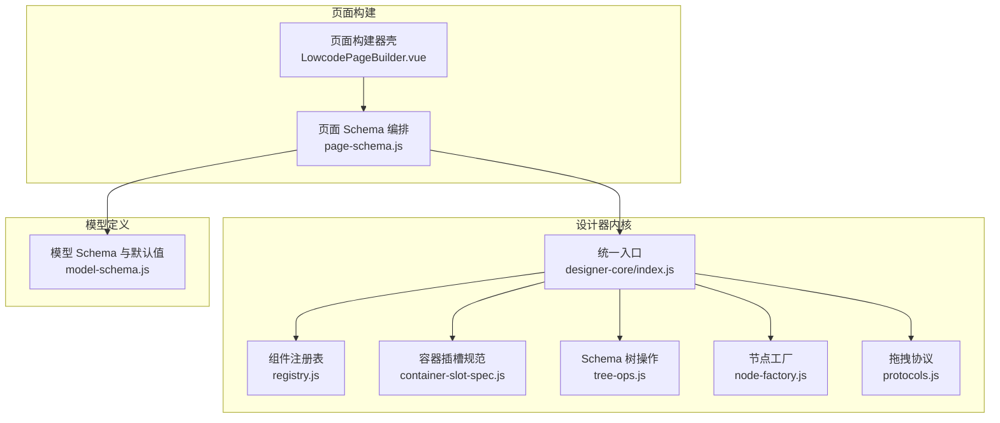
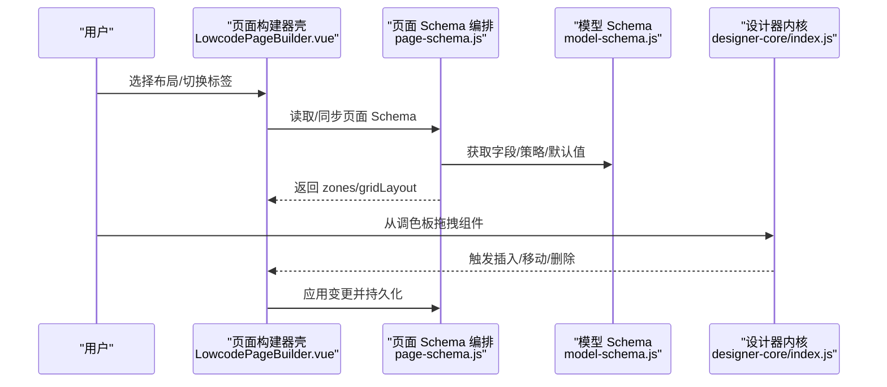
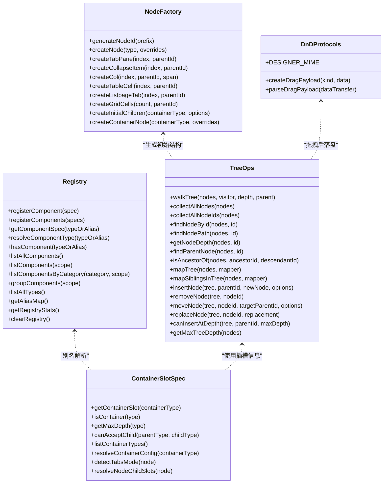
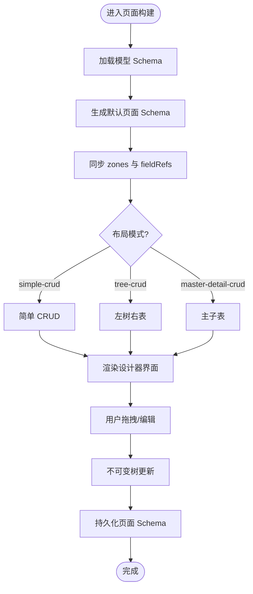
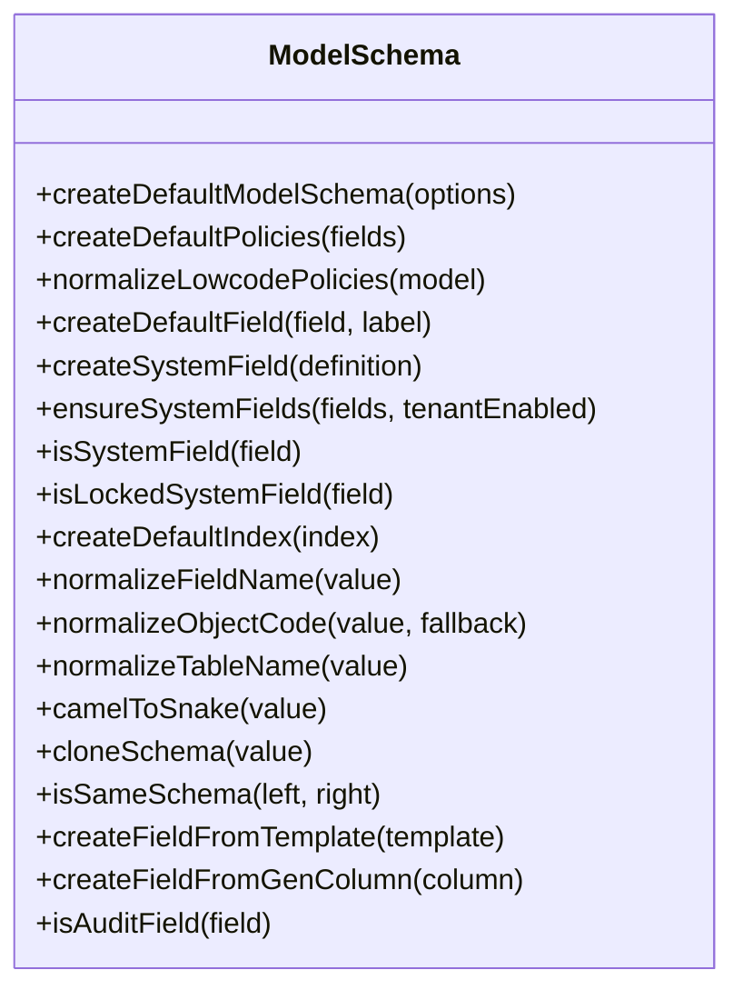
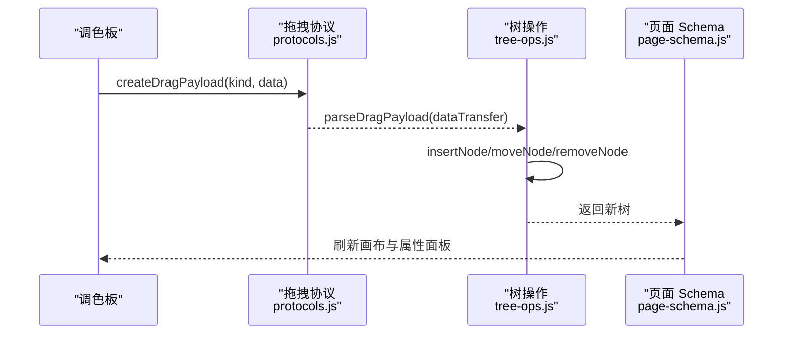
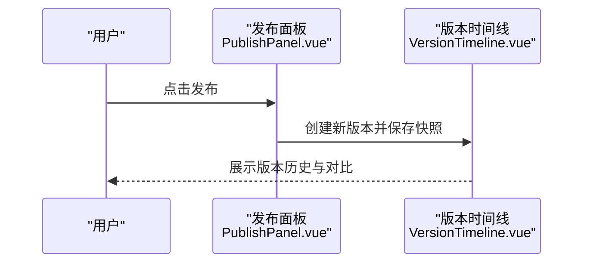
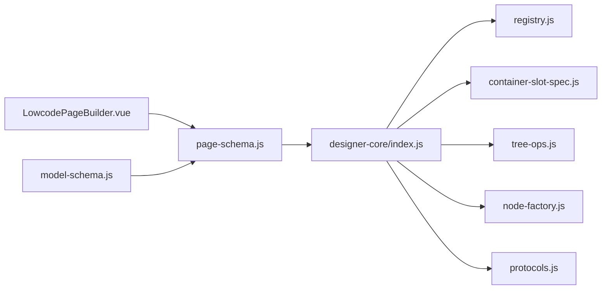

# 低代码构建器

<cite>
**本文引用的文件**
- [designer-core/index.js](file://forge-admin-ui/src/components/lowcode-builder/designer-core/index.js)
- [registry.js](file://forge-admin-ui/src/components/lowcode-builder/designer-core/spec/registry.js)
- [node-factory.js](file://forge-admin-ui/src/components/lowcode-builder/designer-core/spec/node-factory.js)
- [tree-ops.js](file://forge-admin-ui/src/components/lowcode-builder/designer-core/spec/tree-ops.js)
- [container-slot-spec.js](file://forge-admin-ui/src/components/lowcode-builder/designer-core/spec/container-slot-spec.js)
- [protocols.js](file://forge-admin-ui/src/components/lowcode-builder/designer-core/dnd/protocols.js)
- [LowcodePageBuilder.vue](file://forge-admin-ui/src/components/lowcode-builder/page/LowcodePageBuilder.vue)
- [page-schema.js](file://forge-admin-ui/src/components/lowcode-builder/page/page-schema.js)
- [model-schema.js](file://forge-admin-ui/src/components/lowcode-builder/model/model-schema.js)
- [PublishPanel.vue](file://forge-admin-ui/src/components/lowcode-builder/publish/PublishPanel.vue)
- [VersionTimeline.vue](file://forge-admin-ui/src/components/lowcode-builder/publish/VersionTimeline.vue)
</cite>

## 目录
1. [简介](#简介)
2. [项目结构](#项目结构)
3. [核心组件](#核心组件)
4. [架构总览](#架构总览)
5. [详细组件分析](#详细组件分析)
6. [依赖关系分析](#依赖关系分析)
7. [性能考虑](#性能考虑)
8. [故障排查指南](#故障排查指南)
9. [结论](#结论)
10. [附录](#附录)

## 简介
本技术文档面向 Forge Admin 低代码页面构建器，系统性解析其整体架构与核心机制。围绕 designer-core（设计器内核）、page（页面构建与编排）、model（数据模型与字段规范）三大模块，深入说明页面设计、组件拖拽、属性配置、代码生成等关键能力；并解释设计器内核、页面模型、组件注册、事件系统等技术要点。同时覆盖预览模式、发布管理、版本控制、团队协作等企业级特性，并提供扩展开发、自定义组件集成与性能优化实践建议。

## 项目结构
低代码构建器采用“内核 + 页面编排 + 模型定义”的分层组织：
- 设计器内核（designer-core）：提供统一的组件注册表、容器插槽规范、节点工厂、树操作工具、拖拽协议等基础能力。
- 页面构建（page）：负责页面 Schema 的创建、同步、区域（zone）编排、栅格布局与表单/列表设计器组合。
- 模型定义（model）：定义业务对象、字段、索引、策略等元数据，支撑页面与运行时数据绑定。

图表来源
- [designer-core/index.js:1-126](file://forge-admin-ui/src/components/lowcode-builder/designer-core/index.js#L1-L126)
- [registry.js:1-169](file://forge-admin-ui/src/components/lowcode-builder/designer-core/spec/registry.js#L1-L169)
- [container-slot-spec.js:1-438](file://forge-admin-ui/src/components/lowcode-builder/designer-core/spec/container-slot-spec.js#L1-L438)
- [tree-ops.js:1-477](file://forge-admin-ui/src/components/lowcode-builder/designer-core/spec/tree-ops.js#L1-L477)
- [node-factory.js:1-257](file://forge-admin-ui/src/components/lowcode-builder/designer-core/spec/node-factory.js#L1-L257)
- [protocols.js:1-81](file://forge-admin-ui/src/components/lowcode-builder/designer-core/dnd/protocols.js#L1-L81)
- [page-schema.js:1-800](file://forge-admin-ui/src/components/lowcode-builder/page/page-schema.js#L1-L800)
- [LowcodePageBuilder.vue:1-247](file://forge-admin-ui/src/components/lowcode-builder/page/LowcodePageBuilder.vue#L1-L247)
- [model-schema.js:1-592](file://forge-admin-ui/src/components/lowcode-builder/model/model-schema.js#L1-L592)

章节来源
- [designer-core/index.js:1-126](file://forge-admin-ui/src/components/lowcode-builder/designer-core/index.js#L1-L126)
- [page-schema.js:1-800](file://forge-admin-ui/src/components/lowcode-builder/page/page-schema.js#L1-L800)
- [model-schema.js:1-592](file://forge-admin-ui/src/components/lowcode-builder/model/model-schema.js#L1-L592)

## 核心组件
- 组件注册表（Registry）：集中管理所有组件的 ComponentSpec，支持类型与别名解析、分组与统计、按作用域过滤。
- 容器插槽规范（Container Slot Spec）：抽象不同容器的子节点存储路径（children、props.tabs[].children、props.cells[].children），提供统一访问与写入接口。
- Schema 树操作（Tree Ops）：对三种嵌套路径进行不可变遍历、查找、插入、删除、移动、替换与深度检查。
- 节点工厂（Node Factory）：为各类容器生成初始子节点结构，保证新增节点具备可用默认形态。
- 拖拽协议（DnD Protocols）：跨设计器面板的 MIME 类型与载荷序列化/解析，统一组件、实例、字段引用三类拖拽。
- 页面 Schema 编排（Page Schema）：根据模型自动生成默认页面结构，同步 zone、fieldRefs、栅格布局与表单/列表设计器状态。
- 页面构建器壳（LowcodePageBuilder）：组合列表页与表单/详情页设计器，维护本地 schema 与双向同步。
- 模型 Schema（Model Schema）：定义字段、索引、策略、默认值与转换规则，支撑页面渲染与后端生成。

章节来源
- [registry.js:1-169](file://forge-admin-ui/src/components/lowcode-builder/designer-core/spec/registry.js#L1-L169)
- [container-slot-spec.js:1-438](file://forge-admin-ui/src/components/lowcode-builder/designer-core/spec/container-slot-spec.js#L1-L438)
- [tree-ops.js:1-477](file://forge-admin-ui/src/components/lowcode-builder/designer-core/spec/tree-ops.js#L1-L477)
- [node-factory.js:1-257](file://forge-admin-ui/src/components/lowcode-builder/designer-core/spec/node-factory.js#L1-L257)
- [protocols.js:1-81](file://forge-admin-ui/src/components/lowcode-builder/designer-core/dnd/protocols.js#L1-L81)
- [page-schema.js:1-800](file://forge-admin-ui/src/components/lowcode-builder/page/page-schema.js#L1-L800)
- [LowcodePageBuilder.vue:1-247](file://forge-admin-ui/src/components/lowcode-builder/page/LowcodePageBuilder.vue#L1-L247)
- [model-schema.js:1-592](file://forge-admin-ui/src/components/lowcode-builder/model/model-schema.js#L1-L592)

## 架构总览
低代码构建器以“内核驱动 + 页面编排 + 模型约束”的方式工作：
- 内核通过注册表暴露统一组件能力，并通过插槽规范与树操作屏蔽容器差异。
- 页面编排基于模型生成默认页面结构，将字段映射到各区域（search/table/edit/detail）。
- 用户交互（拖拽、属性编辑）通过不可变树更新，最终产出可发布的页面 Schema。

图表来源
- [LowcodePageBuilder.vue:1-247](file://forge-admin-ui/src/components/lowcode-builder/page/LowcodePageBuilder.vue#L1-L247)
- [page-schema.js:1-800](file://forge-admin-ui/src/components/lowcode-builder/page/page-schema.js#L1-L800)
- [model-schema.js:1-592](file://forge-admin-ui/src/components/lowcode-builder/model/model-schema.js#L1-L592)
- [designer-core/index.js:1-126](file://forge-admin-ui/src/components/lowcode-builder/designer-core/index.js#L1-L126)

## 详细组件分析

### 设计器内核（designer-core）
- 统一导出与自动注册：入口在首次导入时聚合全部组件 spec 并批量注册，确保后续设计器消费同一份能力。
- 组件注册表：提供注册、查询、别名解析、分组、统计、清空等 API，保障多设计器共享一致能力。
- 容器插槽规范：抽象 card/box/space、tabs/collapse/table、grid/grid-layout、listpage-tabs 等容器的子节点存取方式，屏蔽差异。
- Schema 树操作：实现 walkTree/mapTree/mapSiblingsInTree/findNodeById/findNodePath/moveNode/insertNode/removeNode/replaceNode 等不可变操作，支持三种嵌套路径。
- 节点工厂：为不同容器生成初始 children 或 props 结构，减少样板配置。
- 拖拽协议：定义 MIME 类型与载荷结构，支持组件、实例、字段引用三类拖拽。

图表来源
- [registry.js:1-169](file://forge-admin-ui/src/components/lowcode-builder/designer-core/spec/registry.js#L1-L169)
- [container-slot-spec.js:1-438](file://forge-admin-ui/src/components/lowcode-builder/designer-core/spec/container-slot-spec.js#L1-L438)
- [tree-ops.js:1-477](file://forge-admin-ui/src/components/lowcode-builder/designer-core/spec/tree-ops.js#L1-L477)
- [node-factory.js:1-257](file://forge-admin-ui/src/components/lowcode-builder/designer-core/spec/node-factory.js#L1-L257)
- [protocols.js:1-81](file://forge-admin-ui/src/components/lowcode-builder/designer-core/dnd/protocols.js#L1-L81)

章节来源
- [designer-core/index.js:1-126](file://forge-admin-ui/src/components/lowcode-builder/designer-core/index.js#L1-L126)
- [registry.js:1-169](file://forge-admin-ui/src/components/lowcode-builder/designer-core/spec/registry.js#L1-L169)
- [container-slot-spec.js:1-438](file://forge-admin-ui/src/components/lowcode-builder/designer-core/spec/container-slot-spec.js#L1-L438)
- [tree-ops.js:1-477](file://forge-admin-ui/src/components/lowcode-builder/designer-core/spec/tree-ops.js#L1-L477)
- [node-factory.js:1-257](file://forge-admin-ui/src/components/lowcode-builder/designer-core/spec/node-factory.js#L1-L257)
- [protocols.js:1-81](file://forge-admin-ui/src/components/lowcode-builder/designer-core/dnd/protocols.js#L1-L81)

### 页面构建（page）
- 页面 Schema 编排：根据模型生成默认 zones（search/table/edit/detail），计算 fieldRefs，处理 tree/master-detail 布局，同步 listGridLayout 与 zones。
- 页面构建器壳：组合列表页与表单/详情页设计器，维护本地 schema，监听 modelValue 与 modelSchema 变化，双向同步。
- 画布组件目录：定义表单/列表可用的字段与区块，支持拖拽与属性配置。

图表来源
- [page-schema.js:1-800](file://forge-admin-ui/src/components/lowcode-builder/page/page-schema.js#L1-L800)
- [LowcodePageBuilder.vue:1-247](file://forge-admin-ui/src/components/lowcode-builder/page/LowcodePageBuilder.vue#L1-L247)

章节来源
- [page-schema.js:1-800](file://forge-admin-ui/src/components/lowcode-builder/page/page-schema.js#L1-L800)
- [LowcodePageBuilder.vue:1-247](file://forge-admin-ui/src/components/lowcode-builder/page/LowcodePageBuilder.vue#L1-L247)

### 模型定义（model）
- 字段与策略：定义数据类型、查询类型、敏感类型、审计字段、索引、主键策略、数据范围等。
- 默认值与转换：提供 createDefaultModelSchema、ensureSystemFields、normalize* 系列方法，保证模型一致性。
- 页面可见性：根据字段属性决定在 search/table/edit/detail 区域的显示与只读行为。

图表来源
- [model-schema.js:1-592](file://forge-admin-ui/src/components/lowcode-builder/model/model-schema.js#L1-L592)

章节来源
- [model-schema.js:1-592](file://forge-admin-ui/src/components/lowcode-builder/model/model-schema.js#L1-L592)

### 拖拽与属性配置流程
- 拖拽：从调色板拖入组件/实例/字段引用，通过 DnD 协议序列化载荷，内核识别类型并调用树操作插入到目标容器。
- 属性配置：选中节点后，右侧属性面板修改 props 或 layout，通过不可变 mapTree 更新树并回写页面 Schema。

图表来源
- [protocols.js:1-81](file://forge-admin-ui/src/components/lowcode-builder/designer-core/dnd/protocols.js#L1-L81)
- [tree-ops.js:1-477](file://forge-admin-ui/src/components/lowcode-builder/designer-core/spec/tree-ops.js#L1-L477)
- [page-schema.js:1-800](file://forge-admin-ui/src/components/lowcode-builder/page/page-schema.js#L1-L800)

章节来源
- [protocols.js:1-81](file://forge-admin-ui/src/components/lowcode-builder/designer-core/dnd/protocols.js#L1-L81)
- [tree-ops.js:1-477](file://forge-admin-ui/src/components/lowcode-builder/designer-core/spec/tree-ops.js#L1-L477)
- [page-schema.js:1-800](file://forge-admin-ui/src/components/lowcode-builder/page/page-schema.js#L1-L800)

### 预览模式与发布管理
- 预览模式：基于页面 Schema 渲染运行时代码，校验 zones、fieldRefs、栅格布局与组件属性，确保与设计态一致。
- 发布管理：提供发布面板与版本时间线，记录版本变更、回滚与协作评审。

图表来源
- [PublishPanel.vue](file://forge-admin-ui/src/components/lowcode-builder/publish/PublishPanel.vue)
- [VersionTimeline.vue](file://forge-admin-ui/src/components/lowcode-builder/publish/VersionTimeline.vue)

章节来源
- [PublishPanel.vue](file://forge-admin-ui/src/components/lowcode-builder/publish/PublishPanel.vue)
- [VersionTimeline.vue](file://forge-admin-ui/src/components/lowcode-builder/publish/VersionTimeline.vue)

## 依赖关系分析
- 内核模块间耦合：
  - 入口 index.js 聚合并注册全部组件 spec，依赖 registry、slot spec、tree ops、node factory、dnd protocols。
  - registry 提供类型与别名解析，被 slot spec 与 tree ops 复用。
  - container-slot-spec 抽象容器差异，被 tree ops 用于统一遍历与更新。
  - node factory 为 tree ops 提供初始结构，降低新增成本。
  - dnd protocols 为交互层提供统一载荷格式，落地到 tree ops。
- 页面与内核：
  - page-schema 依赖内核提供的 catalog 与工具函数，生成并同步 zones/gridLayout。
  - LowcodePageBuilder 组合多个设计器视图，维护本地 schema 并与内核能力联动。
- 模型与页面：
  - model-schema 提供字段与策略，page-schema 据此生成默认页面结构与可见性规则。

图表来源
- [designer-core/index.js:1-126](file://forge-admin-ui/src/components/lowcode-builder/designer-core/index.js#L1-L126)
- [registry.js:1-169](file://forge-admin-ui/src/components/lowcode-builder/designer-core/spec/registry.js#L1-L169)
- [container-slot-spec.js:1-438](file://forge-admin-ui/src/components/lowcode-builder/designer-core/spec/container-slot-spec.js#L1-L438)
- [tree-ops.js:1-477](file://forge-admin-ui/src/components/lowcode-builder/designer-core/spec/tree-ops.js#L1-L477)
- [node-factory.js:1-257](file://forge-admin-ui/src/components/lowcode-builder/designer-core/spec/node-factory.js#L1-L257)
- [protocols.js:1-81](file://forge-admin-ui/src/components/lowcode-builder/designer-core/dnd/protocols.js#L1-L81)
- [page-schema.js:1-800](file://forge-admin-ui/src/components/lowcode-builder/page/page-schema.js#L1-L800)
- [LowcodePageBuilder.vue:1-247](file://forge-admin-ui/src/components/lowcode-builder/page/LowcodePageBuilder.vue#L1-L247)
- [model-schema.js:1-592](file://forge-admin-ui/src/components/lowcode-builder/model/model-schema.js#L1-L592)

章节来源
- [designer-core/index.js:1-126](file://forge-admin-ui/src/components/lowcode-builder/designer-core/index.js#L1-L126)
- [page-schema.js:1-800](file://forge-admin-ui/src/components/lowcode-builder/page/page-schema.js#L1-L800)
- [model-schema.js:1-592](file://forge-admin-ui/src/components/lowcode-builder/model/model-schema.js#L1-L592)

## 性能考虑
- 不可变树更新：tree-ops 的所有操作返回新对象，避免副作用，便于撤销/重做与增量更新。
- 局部更新：mapTree/mapSiblingsInTree 仅遍历必要分支，减少全量拷贝开销。
- 容器插槽抽象：通过 resolveNodeChildSlots 统一三种存储路径，避免重复逻辑与错误分支。
- 组件注册表缓存：registry 使用 Map 存储，O(1) 查找；提供 group/list 接口按需渲染调色板。
- 默认结构预生成：node factory 为容器生成合理初始结构，减少用户操作次数与无效状态。
- 页面 Schema 同步：page-schema 仅在必要时合并/归一化 zones 与 gridLayout，避免频繁重建。

[本节为通用性能指导，不直接分析具体文件]

## 故障排查指南
- 拖拽失败：
  - 检查 MIME 类型是否匹配 DESIGNER_MIME，确认 createDragPayload/parseDragPayload 正确配对。
  - 验证目标容器是否接受该子类型（canAcceptChild）与最大深度限制（canInsertAtDepth）。
- 节点未插入/移动异常：
  - 确认父节点 ID 存在且非自身后代（防止循环引用）。
  - 检查容器类型对应的插槽路径（children/tabs/cells）是否正确。
- 字段未显示：
  - 检查 isPageFieldVisible 规则（隐藏/禁用/只读系统字段）。
  - 确认 fieldRefs 已同步到对应 zone。
- 发布问题：
  - 查看版本时间线，定位最近变更；对比前后版本差异，回滚至稳定版本。

章节来源
- [protocols.js:1-81](file://forge-admin-ui/src/components/lowcode-builder/designer-core/dnd/protocols.js#L1-L81)
- [container-slot-spec.js:1-438](file://forge-admin-ui/src/components/lowcode-builder/designer-core/spec/container-slot-spec.js#L1-L438)
- [tree-ops.js:1-477](file://forge-admin-ui/src/components/lowcode-builder/designer-core/spec/tree-ops.js#L1-L477)
- [page-schema.js:1-800](file://forge-admin-ui/src/components/lowcode-builder/page/page-schema.js#L1-L800)
- [PublishPanel.vue](file://forge-admin-ui/src/components/lowcode-builder/publish/PublishPanel.vue)
- [VersionTimeline.vue](file://forge-admin-ui/src/components/lowcode-builder/publish/VersionTimeline.vue)

## 结论
Forge Admin 低代码构建器通过“内核 + 页面编排 + 模型定义”的分层架构，实现了高内聚、低耦合的可扩展设计平台。设计器内核提供统一的组件注册、容器抽象与树操作能力；页面编排基于模型自动生成并同步页面结构；模型定义确保字段与策略的一致性。结合预览、发布与版本管理，形成完整的企业级低代码解决方案。

[本节为总结性内容，不直接分析具体文件]

## 附录
- 扩展开发建议：
  - 新增组件：在 spec 中定义 ComponentSpec，并在入口聚合注册；如需容器能力，设置 container/accept/maxDepth。
  - 自定义容器：在 container-slot-spec 中注册插槽定义，或在 tree-ops 中适配新的存储路径。
  - 字段扩展：在 model-schema 中补充数据类型、查询类型、组件映射与默认值。
- 自定义组件集成：
  - 通过 registry.registerComponent 动态注册；确保 type/aliases 唯一且可解析。
  - 在 page-schema 的 canvasComponentCatalog 中添加画布区块，支持拖拽与属性面板。
- 性能优化实践：
  - 使用 mapTree 进行局部更新，避免全量深拷贝。
  - 合理使用 groupComponents 与 listComponentsByCategory 控制调色板渲染规模。
  - 对大表格/长列表启用分页与虚拟滚动，减少 DOM 压力。

[本节为通用指导，不直接分析具体文件]