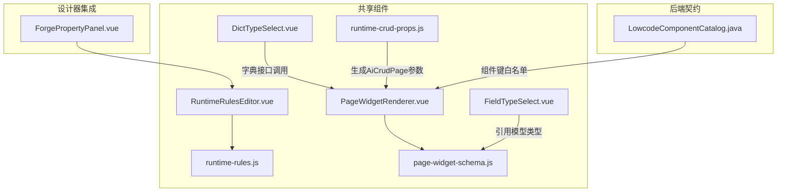
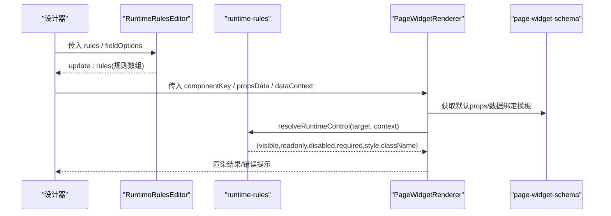
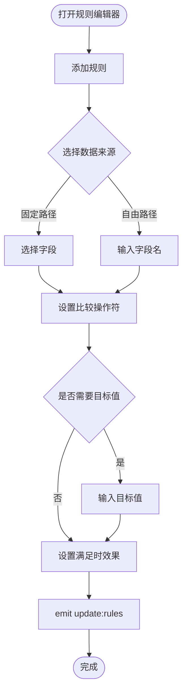
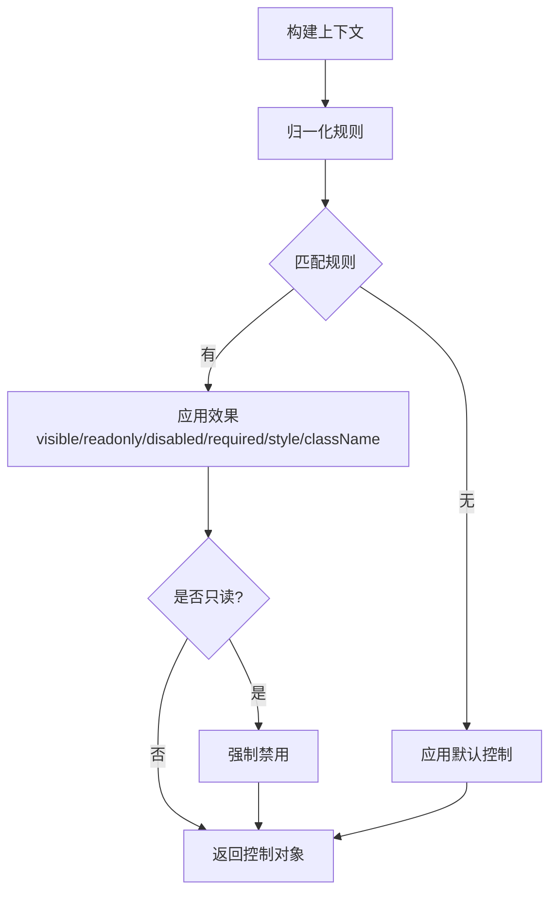
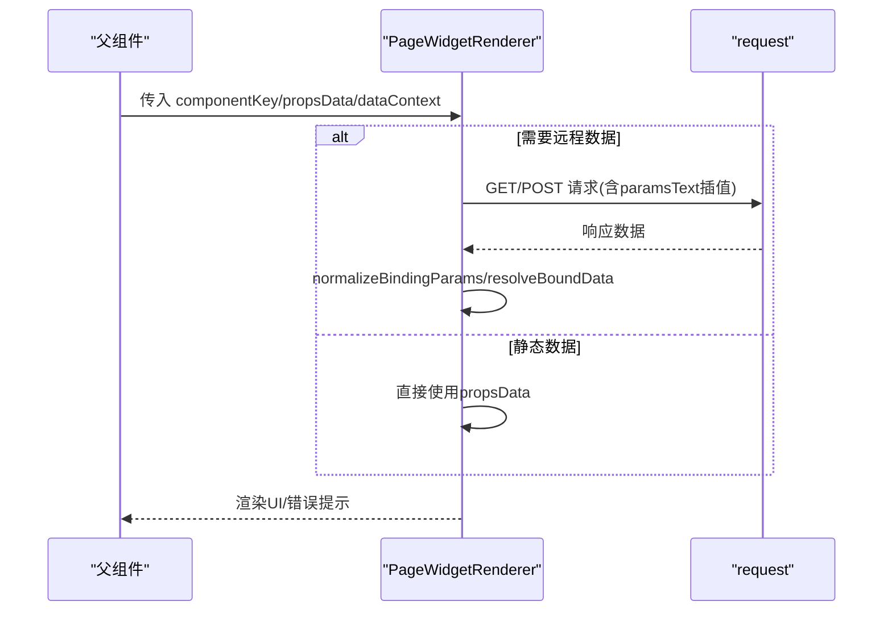
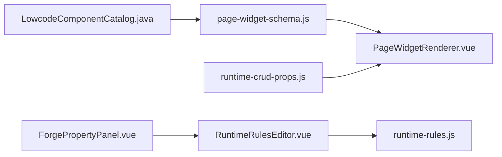

# 共享组件库

<cite>
**本文引用的文件**
- [RuntimeRulesEditor.vue](file://forge-admin-ui/src/components/lowcode-builder/shared/RuntimeRulesEditor.vue)
- [runtime-rules.js](file://forge-admin-ui/src/components/lowcode-builder/shared/runtime-rules.js)
- [PageWidgetRenderer.vue](file://forge-admin-ui/src/components/lowcode-builder/shared/PageWidgetRenderer.vue)
- [page-widget-schema.js](file://forge-admin-ui/src/components/lowcode-builder/shared/page-widget-schema.js)
- [FieldTypeSelect.vue](file://forge-admin-ui/src/components/lowcode-builder/shared/FieldTypeSelect.vue)
- [DictTypeSelect.vue](file://forge-admin-ui/src/components/lowcode-builder/shared/DictTypeSelect.vue)
- [runtime-crud-props.js](file://forge-admin-ui/src/components/lowcode-builder/shared/runtime-crud-props.js)
- [ForgePropertyPanel.vue](file://forge-admin-ui/src/views/app-center/components/designer/forge-form-designer/ForgePropertyPanel.vue)
- [LowcodeComponentCatalog.java](file://forge-server/forge-framework/forge-plugin-parent/forge-plugin-generator/src/main/java/com/mdframe/forge/plugin/generator/service/lowcode/LowcodeComponentCatalog.java)
</cite>

## 目录
1. [简介](#简介)
2. [项目结构](#项目结构)
3. [核心组件](#核心组件)
4. [架构总览](#架构总览)
5. [详细组件分析](#详细组件分析)
6. [依赖关系分析](#依赖关系分析)
7. [性能考虑](#性能考虑)
8. [故障排查指南](#故障排查指南)
9. [结论](#结论)
10. [附录：API与使用示例](#附录api与使用示例)

## 简介
本技术文档面向低代码构建器共享组件库，聚焦以下能力：
- 运行时规则编辑器 RuntimeRulesEditor：可视化配置“数据来源 + 条件 + 效果”，驱动字段显示、只读、禁用、必填和样式。
- 页面组件渲染器 PageWidgetRenderer：统一渲染多种页面挂件（富文本、二维码、日历、列表等），支持远程数据绑定与选项加载。
- 字段类型选择器 FieldTypeSelect：封装模型字段类型下拉，保证设计器与运行期一致。
- 字典类型选择器 DictTypeSelect：在线选择或新增系统字典，提供字典项编辑与保存。
- runtime-rules 规则引擎：解析并匹配运行时规则，输出统一的控制对象。
- runtime-crud-props CRUD属性配置：将已发布配置转换为 AiCrudPage 的运行参数，统一接口、表单、列与行为。
- 组件复用策略、样式统一方案、国际化支持与主题定制能力说明。
- 集成最佳实践与性能优化建议。

## 项目结构
共享组件位于 lowcode-builder/shared 目录，围绕“运行时规则”“页面挂件”“CRUD 属性桥接”三大主题组织：
- 运行时规则：RuntimeRulesEditor.vue、runtime-rules.js
- 页面挂件：PageWidgetRenderer.vue、page-widget-schema.js
- 通用选择器：FieldTypeSelect.vue、DictTypeSelect.vue
- CRUD 属性桥接：runtime-crud-props.js
- 设计器集成点：ForgePropertyPanel.vue（在属性面板中嵌入规则编辑器）
- 后端组件契约：LowcodeComponentCatalog.java（定义前端可使用的组件键集合）

图表来源
- [RuntimeRulesEditor.vue:1-330](file://forge-admin-ui/src/components/lowcode-builder/shared/RuntimeRulesEditor.vue#L1-L330)
- [runtime-rules.js:1-300](file://forge-admin-ui/src/components/lowcode-builder/shared/runtime-rules.js#L1-L300)
- [PageWidgetRenderer.vue:1-800](file://forge-admin-ui/src/components/lowcode-builder/shared/PageWidgetRenderer.vue#L1-L800)
- [page-widget-schema.js:1-369](file://forge-admin-ui/src/components/lowcode-builder/shared/page-widget-schema.js#L1-L369)
- [runtime-crud-props.js:1-335](file://forge-admin-ui/src/components/lowcode-builder/shared/runtime-crud-props.js#L1-L335)
- [ForgePropertyPanel.vue:2470-2484](file://forge-admin-ui/src/views/app-center/components/designer/forge-form-designer/ForgePropertyPanel.vue#L2470-L2484)
- [LowcodeComponentCatalog.java:14-22](file://forge-server/forge-framework/forge-plugin-parent/forge-plugin-generator/src/main/java/com/mdframe/forge/plugin/generator/service/lowcode/LowcodeComponentCatalog.java#L14-L22)

章节来源
- [RuntimeRulesEditor.vue:1-330](file://forge-admin-ui/src/components/lowcode-builder/shared/RuntimeRulesEditor.vue#L1-L330)
- [runtime-rules.js:1-300](file://forge-admin-ui/src/components/lowcode-builder/shared/runtime-rules.js#L1-L300)
- [PageWidgetRenderer.vue:1-800](file://forge-admin-ui/src/components/lowcode-builder/shared/PageWidgetRenderer.vue#L1-L800)
- [page-widget-schema.js:1-369](file://forge-admin-ui/src/components/lowcode-builder/shared/page-widget-schema.js#L1-L369)
- [runtime-crud-props.js:1-335](file://forge-admin-ui/src/components/lowcode-builder/shared/runtime-crud-props.js#L1-L335)
- [ForgePropertyPanel.vue:2470-2484](file://forge-admin-ui/src/views/app-center/components/designer/forge-form-designer/ForgePropertyPanel.vue#L2470-L2484)
- [LowcodeComponentCatalog.java:14-22](file://forge-server/forge-framework/forge-plugin-parent/forge-plugin-generator/src/main/java/com/mdframe/forge/plugin/generator/service/lowcode/LowcodeComponentCatalog.java#L14-L22)

## 核心组件
- RuntimeRulesEditor：以卡片形式维护多条规则，每条规则包含“数据来源、字段路径、比较操作符、目标值”以及“满足时的效果（显示/隐藏/只读/禁用/必填/样式）”。通过 update:rules 事件向父级回写规则数组。
- runtime-rules：规则引擎核心，负责构建上下文、归一化规则、匹配条件、计算控制对象（visible/readonly/disabled/required/style/className/matchedRules）。
- PageWidgetRenderer：根据 componentKey 动态渲染不同挂件，支持静态/远程数据绑定、远程选项加载、安全 HTML 渲染、条形码/二维码绘制等。
- page-widget-schema：页面挂件元数据、默认 props、数据绑定模板、安全工具函数（safeHtml、interpolateTemplate）。
- FieldTypeSelect：基于模型 schema 的字段类型选择器，用于设计器中统一字段类型输入。
- DictTypeSelect：在线选择/新增字典，支持字典项批量创建与缓存清理。
- runtime-crud-props：将已发布 CRUD 配置转换为 AiCrudPage 所需运行参数，统一接口、表单、列、行为与预览模式。

章节来源
- [RuntimeRulesEditor.vue:1-330](file://forge-admin-ui/src/components/lowcode-builder/shared/RuntimeRulesEditor.vue#L1-L330)
- [runtime-rules.js:1-300](file://forge-admin-ui/src/components/lowcode-builder/shared/runtime-rules.js#L1-L300)
- [PageWidgetRenderer.vue:1-800](file://forge-admin-ui/src/components/lowcode-builder/shared/PageWidgetRenderer.vue#L1-L800)
- [page-widget-schema.js:1-369](file://forge-admin-ui/src/components/lowcode-builder/shared/page-widget-schema.js#L1-L369)
- [FieldTypeSelect.vue:1-22](file://forge-admin-ui/src/components/lowcode-builder/shared/FieldTypeSelect.vue#L1-L22)
- [DictTypeSelect.vue:1-357](file://forge-admin-ui/src/components/lowcode-builder/shared/DictTypeSelect.vue#L1-L357)
- [runtime-crud-props.js:1-335](file://forge-admin-ui/src/components/lowcode-builder/shared/runtime-crud-props.js#L1-L335)

## 架构总览
运行时规则与页面渲染解耦：
- 设计器通过 RuntimeRulesEditor 收集规则，持久化到组件 schema 的 runtimeRules 等字段。
- 运行期由 runtime-rules 读取 target.runtimeRules 与上下文（record/row/formData/route/user），计算最终控制对象。
- PageWidgetRenderer 作为页面挂件容器，按 componentKey 渲染具体 UI，并通过 dataBinding/optionSource 拉取数据。
- runtime-crud-props 为 AiCrudPage 提供统一运行参数，屏蔽底层差异。

图表来源
- [RuntimeRulesEditor.vue:1-330](file://forge-admin-ui/src/components/lowcode-builder/shared/RuntimeRulesEditor.vue#L1-L330)
- [runtime-rules.js:1-300](file://forge-admin-ui/src/components/lowcode-builder/shared/runtime-rules.js#L1-L300)
- [PageWidgetRenderer.vue:1-800](file://forge-admin-ui/src/components/lowcode-builder/shared/PageWidgetRenderer.vue#L1-L800)
- [page-widget-schema.js:1-369](file://forge-admin-ui/src/components/lowcode-builder/shared/page-widget-schema.js#L1-L369)

## 详细组件分析

### 运行时规则编辑器 RuntimeRulesEditor
- 功能要点
  - 支持多规则管理：添加、删除、启用/禁用、编辑第一条条件、编辑效果。
  - 数据来源：当前记录/详情、当前行数据、当前表单数据、URL 查询参数、URL 路由参数、当前用户。
  - 条件操作符：等于、不等于、大于、大于等于、小于、小于等于、包含、属于列表、为空、不为空。
  - 效果：显示/隐藏、只读、禁用、必填、文字颜色、附加类名。
  - 通过 update:rules 事件向上层提交规则数组。
- 数据结构
  - 单条规则：enabled、mode、conditions[]、effect{}。
  - 条件：source、field/path/key、operator、value/expected。
- 交互流程
  - 选择数据来源后，切换字段输入控件（受控于 isFreePathSource）。
  - 修改 effect 时合并 effect 对象，过滤 undefined/空字符串。
  - 首次条件不存在时自动初始化默认值。

图表来源
- [RuntimeRulesEditor.vue:1-330](file://forge-admin-ui/src/components/lowcode-builder/shared/RuntimeRulesEditor.vue#L1-L330)

章节来源
- [RuntimeRulesEditor.vue:1-330](file://forge-admin-ui/src/components/lowcode-builder/shared/RuntimeRulesEditor.vue#L1-L330)

### 运行时规则引擎 runtime-rules
- 核心职责
  - buildRuntimeRuleContext：聚合 record/row/formData/data/route/user。
  - normalizeRuntimeRules：兼容多种规则存放位置（target.runtimeRules、props.runtimeRules、rules.runtime、visibilityRules、behaviorRules、displayRules）。
  - matchRuntimeRule/Group/Condition：支持 groups 分组 with any/all 模式，表达式 mode（expression）。
  - compareRuntimeValues：统一数值/字符串/空值/包含/列表比较。
  - resolveRuntimeControl：计算 visible/readonly/disabled/required/style/className/matchedRules。
  - applyRuntimeControl：将控制对象应用到目标节点，处理 readonly→disabled 的联动。
- 复杂度与边界
  - 嵌套取值 getNestedRuntimeValue 使用 reduce，时间复杂度 O(n)。
  - 比较逻辑对数字/字符串/空值进行健壮处理，避免 NaN/undefined 导致误判。
  - whenUnmatched 语义：当存在“满足时显示”的规则且未匹配时，默认隐藏；旧规则保持原可见性。

图表来源
- [runtime-rules.js:1-300](file://forge-admin-ui/src/components/lowcode-builder/shared/runtime-rules.js#L1-L300)

章节来源
- [runtime-rules.js:1-300](file://forge-admin-ui/src/components/lowcode-builder/shared/runtime-rules.js#L1-L300)

### 页面组件渲染器 PageWidgetRenderer
- 功能要点
  - 按 componentKey 渲染多种挂件：富文本、穿梭框、水印、Markdown、条形码、二维码、日历、代码、倒计时、描述、公告、列表、日志、数值动画、面包屑、菜单、分页、分割面板、HTML标签、Vue组件等。
  - 数据绑定：dataBinding.enabled/sourceType/api/method/paramsText/dataPath/contextPath/各字段映射。
  - 远程选项：transfer 组件支持 optionSource 远程加载，带 loading/error 状态。
  - 安全渲染：safeHtml 过滤 script/on* 事件，sanitize 属性白名单。
  - 懒加载：WangEditor、Markdown、QRCode、JsBarcode 按需 import。
- 关键流程
  - 监听 dataBinding 变化，调用 loadBindingData 拉取数据，normalizeBindingParams 插值。
  - 根据 dataBinding 配置解析 boundData，再映射到 value/content/items 等展示字段。
  - 条形码渲染在 nextTick 后执行，失败时清空 SVG 并标记无效。

图表来源
- [PageWidgetRenderer.vue:1-800](file://forge-admin-ui/src/components/lowcode-builder/shared/PageWidgetRenderer.vue#L1-L800)
- [page-widget-schema.js:1-369](file://forge-admin-ui/src/components/lowcode-builder/shared/page-widget-schema.js#L1-L369)

章节来源
- [PageWidgetRenderer.vue:1-800](file://forge-admin-ui/src/components/lowcode-builder/shared/PageWidgetRenderer.vue#L1-L800)
- [page-widget-schema.js:1-369](file://forge-admin-ui/src/components/lowcode-builder/shared/page-widget-schema.js#L1-L369)

### 字段类型选择器 FieldTypeSelect
- 作用：封装模型字段类型下拉，便于在设计器中统一选择字段类型。
- 依赖：从 model-schema 获取 dataTypeOptions。
- 接口：v-model:value，内部触发 update:value 事件。

章节来源
- [FieldTypeSelect.vue:1-22](file://forge-admin-ui/src/components/lowcode-builder/shared/FieldTypeSelect.vue#L1-L22)

### 字典类型选择器 DictTypeSelect
- 作用：在线选择系统字典或输入自定义字典编码，支持新增字典及字典项。
- 能力：
  - 加载系统字典类型列表（/system/dict/type/list）。
  - 组合 fields 中的 dictType，去重生成 options。
  - 新增字典：调用 /system/dict/type/add 与 /system/dict/data/add，成功后清理字典缓存并刷新列表。
  - 过滤：支持 label/value/dictName/dictType 模糊匹配。
- 样式：紧凑布局，按钮高亮，网格排列字典项。

章节来源
- [DictTypeSelect.vue:1-357](file://forge-admin-ui/src/components/lowcode-builder/shared/DictTypeSelect.vue#L1-L357)

### CRUD 属性配置 runtime-crud-props
- 作用：将已发布的 CRUD 配置转换为 AiCrudPage 的运行参数，确保列表设计器预览与应用页使用同一 configKey 同源数据。
- 主要输出：
  - searchSchema/columns/editSchema/fieldCatalog/childrenConfig/expandConfig/detailPanels
  - apiConfig/configKey/options/formOpenMode/modalType/modalWidth/editGridCols/...
  - toolbarActions/detailActions/formActions/runtimeActions
  - publicParams/publicQuery/formDefaultValues/submitDefaultParams
- 辅助能力：
  - appendDesignPreviewToApiValue/appendDesignPreviewToApiConfig：为预览追加 designPreview=1。
  - filterCrudItemsByFieldRefs/includeManagedRuntimeFieldRefs：过滤查询字段并保留平台托管字段。
  - resolveCrudSearchFieldCatalog/buildCrudSearchTypeRequestParams：构造查询字段目录与搜索类型参数。
  - resolveCrudPreviewReloadKey：稳定预览请求身份，避免重复加载。

章节来源
- [runtime-crud-props.js:1-335](file://forge-admin-ui/src/components/lowcode-builder/shared/runtime-crud-props.js#L1-L335)

## 依赖关系分析
- 组件键一致性：后端 LowcodeComponentCatalog 定义了 FIELD_COMPONENT_KEYS，前端 PageWidgetRenderer 与 designer-core 生成的 pageWidgetComponentKeys 必须保持一致，否则可能出现未知组件被丢弃。
- 设计器集成：ForgePropertyPanel 在属性面板中嵌入 RuntimeRulesEditor，并将 selectedComponent.props.runtimeRules 双向绑定。
- 数据流：PageWidgetRenderer 依赖 page-widget-schema 提供的默认 props 与数据绑定模板；runtime-rules 提供运行时控制；runtime-crud-props 提供 CRUD 运行参数。

图表来源
- [LowcodeComponentCatalog.java:14-22](file://forge-server/forge-framework/forge-plugin-parent/forge-plugin-generator/src/main/java/com/mdframe/forge/plugin/generator/service/lowcode/LowcodeComponentCatalog.java#L14-L22)
- [page-widget-schema.js:1-369](file://forge-admin-ui/src/components/lowcode-builder/shared/page-widget-schema.js#L1-L369)
- [PageWidgetRenderer.vue:1-800](file://forge-admin-ui/src/components/lowcode-builder/shared/PageWidgetRenderer.vue#L1-L800)
- [ForgePropertyPanel.vue:2470-2484](file://forge-admin-ui/src/views/app-center/components/designer/forge-form-designer/ForgePropertyPanel.vue#L2470-L2484)
- [RuntimeRulesEditor.vue:1-330](file://forge-admin-ui/src/components/lowcode-builder/shared/RuntimeRulesEditor.vue#L1-L330)
- [runtime-rules.js:1-300](file://forge-admin-ui/src/components/lowcode-builder/shared/runtime-rules.js#L1-L300)
- [runtime-crud-props.js:1-335](file://forge-admin-ui/src/components/lowcode-builder/shared/runtime-crud-props.js#L1-L335)

章节来源
- [LowcodeComponentCatalog.java:14-22](file://forge-server/forge-framework/forge-plugin-parent/forge-plugin-generator/src/main/java/com/mdframe/forge/plugin/generator/service/lowcode/LowcodeComponentCatalog.java#L14-L22)
- [ForgePropertyPanel.vue:2470-2484](file://forge-admin-ui/src/views/app-center/components/designer/forge-form-designer/ForgePropertyPanel.vue#L2470-L2484)

## 性能考虑
- 懒加载与按需引入
  - PageWidgetRenderer 对富文本、Markdown、二维码、条形码等重型依赖采用 defineAsyncComponent 或动态 import，减少首屏体积。
- 数据绑定与请求节流
  - 远程选项与数据绑定仅在相关 props 变化时触发，避免频繁请求。
  - 使用 request 工具统一封装，needTip=false 抑制不必要的提示。
- 规则计算开销
  - runtime-rules 的匹配过程为线性遍历，建议在规则数量较大时使用分组（groups）与精简条件，减少匹配次数。
- 预览稳定性
  - runtime-crud-props 提供 resolveCrudPreviewReloadKey，避免预览状态变更引发无限重载。

[本节为通用性能建议，不直接分析具体文件]

## 故障排查指南
- 规则生效异常
  - 检查规则 enabled 是否为 false；确认 conditions.source/field/operator/value 是否正确。
  - 若使用“满足时显示”，注意 whenUnmatched 默认隐藏语义。
  - 参考：[runtime-rules.js:21-84](file://forge-admin-ui/src/components/lowcode-builder/shared/runtime-rules.js#L21-L84)
- 远程数据加载失败
  - 确认 dataBinding.api/optionSource.api 配置正确；检查 paramsText 插值；查看 bindingError/transferError。
  - 参考：[PageWidgetRenderer.vue:646-708](file://forge-admin-ui/src/components/lowcode-builder/shared/PageWidgetRenderer.vue#L646-L708)
- 条形码/二维码渲染失败
  - 条形码：nextTick 后渲染，失败会清空 SVG 并标记 invalid。
  - 二维码：qrcode-vue3 动态导入，检查 value 与尺寸。
  - 参考：[PageWidgetRenderer.vue:616-644](file://forge-admin-ui/src/components/lowcode-builder/shared/PageWidgetRenderer.vue#L616-L644)
- 字典新增失败
  - 检查必填字段（dictName、dictType、至少一个字典项）；查看消息提示与网络请求。
  - 参考：[DictTypeSelect.vue:236-285](file://forge-admin-ui/src/components/lowcode-builder/shared/DictTypeSelect.vue#L236-L285)
- CRUD 预览不刷新
  - 使用 resolveCrudPreviewReloadKey 作为稳定 key，避免预览状态影响请求身份。
  - 参考：[runtime-crud-props.js:251-266](file://forge-admin-ui/src/components/lowcode-builder/shared/runtime-crud-props.js#L251-L266)

章节来源
- [runtime-rules.js:21-84](file://forge-admin-ui/src/components/lowcode-builder/shared/runtime-rules.js#L21-L84)
- [PageWidgetRenderer.vue:616-708](file://forge-admin-ui/src/components/lowcode-builder/shared/PageWidgetRenderer.vue#L616-L708)
- [DictTypeSelect.vue:236-285](file://forge-admin-ui/src/components/lowcode-builder/shared/DictTypeSelect.vue#L236-L285)
- [runtime-crud-props.js:251-266](file://forge-admin-ui/src/components/lowcode-builder/shared/runtime-crud-props.js#L251-L266)

## 结论
该共享组件库围绕“运行时规则 + 页面挂件 + CRUD 属性桥接”形成完整闭环：
- 规则引擎提供声明式控制，编辑器降低配置门槛。
- 页面挂件统一渲染与数据绑定，支持远程与静态两种模式。
- CRUD 属性桥接屏蔽差异，使设计器预览与应用页行为一致。
- 通过组件键契约与设计器集成，保障前后端一致性。
- 结合懒加载、稳定预览 key、规则分组等策略，获得良好性能与可维护性。

[本节为总结性内容，不直接分析具体文件]

## 附录：API与使用示例

### RuntimeRulesEditor 使用示例
- 在属性面板中嵌入规则编辑器，绑定 rules 与 fieldOptions，监听 update:rules 更新组件 schema。
- 典型用法：根据状态字段隐藏按钮，或在支付完成后将金额字段设为只读。
- 参考路径：
  - [ForgePropertyPanel.vue:2470-2484](file://forge-admin-ui/src/views/app-center/components/designer/forge-form-designer/ForgePropertyPanel.vue#L2470-L2484)
  - [RuntimeRulesEditor.vue:1-330](file://forge-admin-ui/src/components/lowcode-builder/shared/RuntimeRulesEditor.vue#L1-L330)

### runtime-rules 核心 API
- buildRuntimeRuleContext(context)：构建运行时上下文。
- resolveRuntimeControl(target, context)：计算控制对象。
- applyRuntimeControl(target, context)：应用控制到目标节点。
- matchRuntimeRule(rule, context)：匹配规则。
- 参考路径：
  - [runtime-rules.js:8-117](file://forge-admin-ui/src/components/lowcode-builder/shared/runtime-rules.js#L8-L117)
  - [runtime-rules.js:119-154](file://forge-admin-ui/src/components/lowcode-builder/shared/runtime-rules.js#L119-L154)

### PageWidgetRenderer 使用示例
- 传入 componentKey、propsData、dataContext，组件将根据 componentKey 渲染对应 UI。
- 支持 dataBinding 远程数据绑定与 optionSource 远程选项加载。
- 参考路径：
  - [PageWidgetRenderer.vue:372-565](file://forge-admin-ui/src/components/lowcode-builder/shared/PageWidgetRenderer.vue#L372-L565)
  - [page-widget-schema.js:20-315](file://forge-admin-ui/src/components/lowcode-builder/shared/page-widget-schema.js#L20-L315)

### DictTypeSelect 使用示例
- 在属性面板中用于选择或新增字典类型，支持 tag 模式与过滤。
- 新增字典后自动清理缓存并刷新选项。
- 参考路径：
  - [DictTypeSelect.vue:89-180](file://forge-admin-ui/src/components/lowcode-builder/shared/DictTypeSelect.vue#L89-L180)
  - [DictTypeSelect.vue:236-285](file://forge-admin-ui/src/components/lowcode-builder/shared/DictTypeSelect.vue#L236-L285)

### runtime-crud-props 使用示例
- 将已发布配置转换为 AiCrudPage 运行参数，统一接口、表单、列与行为。
- 设计预览模式下自动追加 designPreview=1。
- 参考路径：
  - [runtime-crud-props.js:7-61](file://forge-admin-ui/src/components/lowcode-builder/shared/runtime-crud-props.js#L7-L61)
  - [runtime-crud-props.js:74-98](file://forge-admin-ui/src/components/lowcode-builder/shared/runtime-crud-props.js#L74-L98)

### 组件复用策略与扩展开发指南
- 复用策略
  - 通过 componentKey 分发渲染，新增组件只需在 page-widget-schema 中补充默认 props 与数据绑定模板，并在 PageWidgetRenderer 中添加分支。
  - 规则引擎支持多来源规则合并，扩展新规则存放位置时需同步 normalizeRuntimeRules。
- 样式统一
  - 组件内使用 scoped 样式，遵循统一间距与色彩规范；可通过 className/style 覆盖。
- 国际化支持
  - 组件文案建议使用 i18n 键值；当前实现多为硬编码中文，可在上层注入翻译。
- 主题定制
  - 通过 CSS 变量或主题色覆盖；PageWidgetRenderer 支持 backgroundColor/fontColor 等属性。
- 扩展步骤
  - 新增组件键需与后端 LowcodeComponentCatalog 保持一致。
  - 在 page-widget-schema 中补充 createPageWidgetDefaultProps 与 createWidgetDataBinding。
  - 在 PageWidgetRenderer 中增加渲染分支与数据绑定逻辑。
  - 在设计器属性面板中暴露相应配置项。

章节来源
- [PageWidgetRenderer.vue:1-800](file://forge-admin-ui/src/components/lowcode-builder/shared/PageWidgetRenderer.vue#L1-L800)
- [page-widget-schema.js:1-369](file://forge-admin-ui/src/components/lowcode-builder/shared/page-widget-schema.js#L1-L369)
- [LowcodeComponentCatalog.java:14-22](file://forge-server/forge-framework/forge-plugin-parent/forge-plugin-generator/src/main/java/com/mdframe/forge/plugin/generator/service/lowcode/LowcodeComponentCatalog.java#L14-L22)