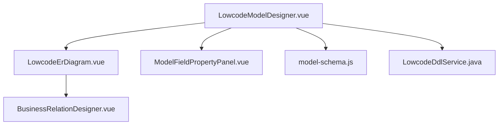
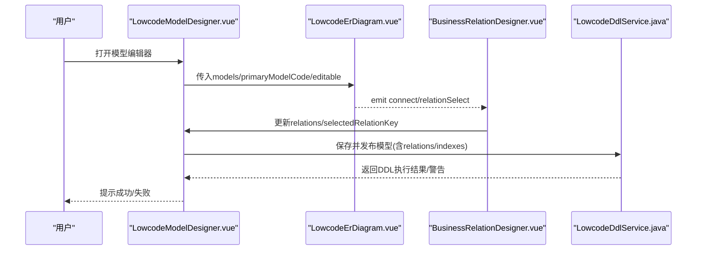
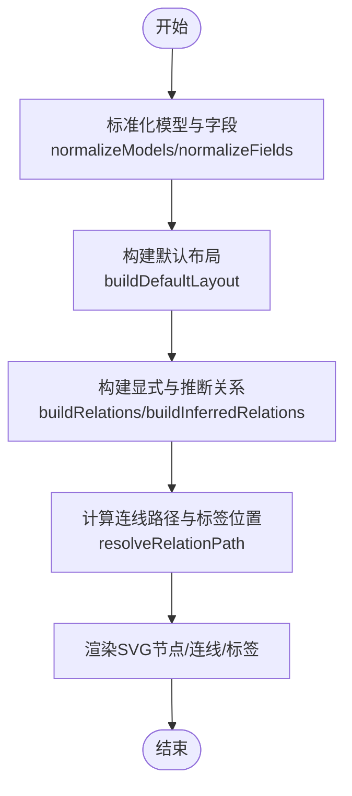
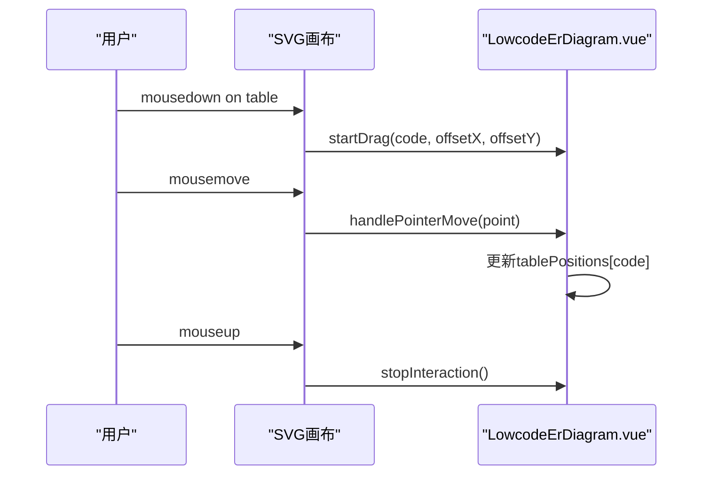
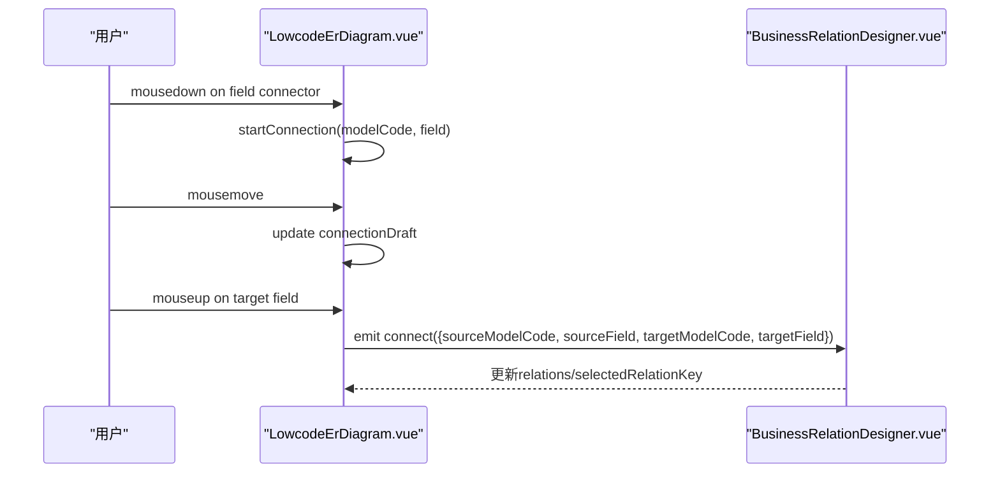
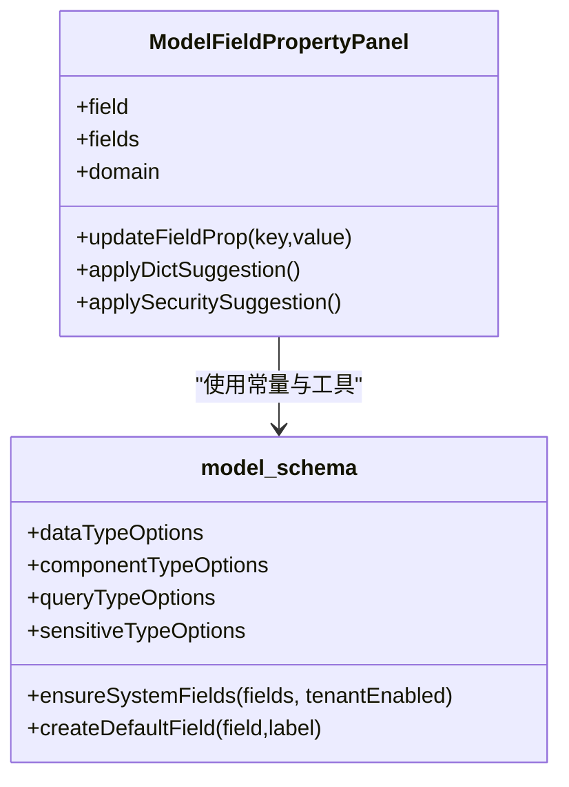
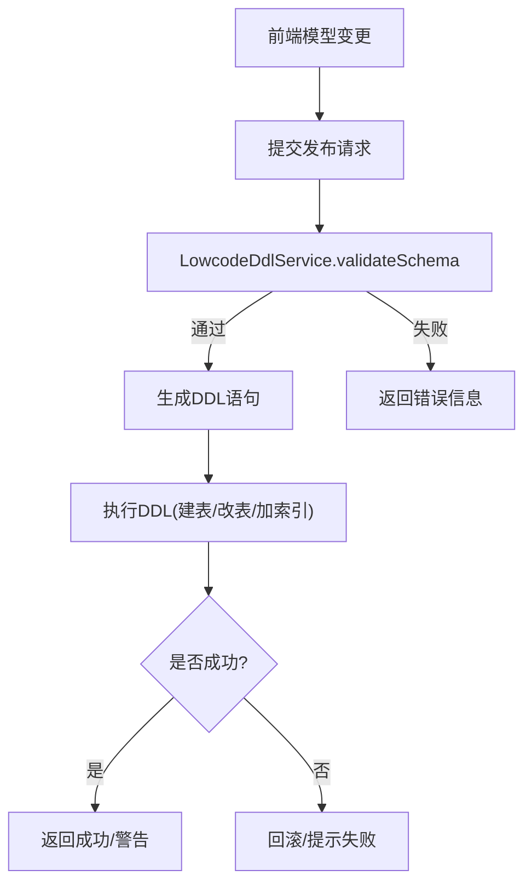
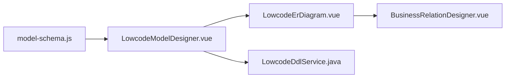

# ER图设计器

<cite>
**本文引用的文件**
- [LowcodeErDiagram.vue](file://forge-admin-ui/src/components/lowcode-builder/model/LowcodeErDiagram.vue)
- [LowcodeModelDesigner.vue](file://forge-admin-ui/src/components/lowcode-builder/model/LowcodeModelDesigner.vue)
- [ModelFieldPropertyPanel.vue](file://forge-admin-ui/src/components/lowcode-builder/model/ModelFieldPropertyPanel.vue)
- [model-schema.js](file://forge-admin-ui/src/components/lowcode-builder/model/model-schema.js)
- [BusinessRelationDesigner.vue](file://forge-admin-ui/src/views/app-center/components/designer/BusinessRelationDesigner.vue)
- [LowcodeDdlService.java](file://forge-server/forge-framework/forge-plugin-parent/forge-plugin-generator/src/main/java/com/mdframe/forge/plugin/generator/service/lowcode/LowcodeDdlService.java)
</cite>

## 目录
1. [简介](#简介)
2. [项目结构](#项目结构)
3. [核心组件](#核心组件)
4. [架构总览](#架构总览)
5. [详细组件分析](#详细组件分析)
6. [依赖关系分析](#依赖关系分析)
7. [性能考量](#性能考量)
8. [故障排查指南](#故障排查指南)
9. [结论](#结论)
10. [附录](#附录)

## 简介
本技术文档围绕低代码平台的ER图设计能力，重点解析 LowcodeModelDesigner 中的实体关系可视化设计功能。内容涵盖：
- ER图的渲染机制（SVG绘制、连线与标签）
- 实体节点拖拽操作与布局算法
- 关系连线绘制与选择交互
- 实体属性配置面板（字段类型映射、约束条件、验证规则）
- ER图与数据库表结构的同步机制（DDL生成、索引优化、外键关系维护）
- 最佳实践与大数据量场景下的优化策略

## 项目结构
ER图设计相关的前端实现集中在 lowcode-builder 模块中，核心由以下文件组成：
- LowcodeErDiagram.vue：ER图画布、节点渲染、拖拽、连线绘制、布局计算
- LowcodeModelDesigner.vue：模型编辑器主容器，包含字段设计、关联配置、索引配置等Tab
- ModelFieldPropertyPanel.vue：字段属性面板，提供数据库映射、字典与安全配置
- model-schema.js：字段类型映射、系统字段定义、默认策略与工具函数
- BusinessRelationDesigner.vue：业务对象关系设计入口，集成ER图组件
- LowcodeDdlService.java：后端DDL生成与索引管理，负责将模型变更落地为数据库结构

图表来源
- [LowcodeModelDesigner.vue:109-197](file://forge-admin-ui/src/components/lowcode-builder/model/LowcodeModelDesigner.vue#L109-L197)
- [LowcodeErDiagram.vue:254-347](file://forge-admin-ui/src/components/lowcode-builder/model/LowcodeErDiagram.vue#L254-L347)
- [BusinessRelationDesigner.vue:543-574](file://forge-admin-ui/src/views/app-center/components/designer/BusinessRelationDesigner.vue#L543-L574)
- [LowcodeDdlService.java:491-522](file://forge-server/forge-framework/forge-plugin-parent/forge-plugin-generator/src/main/java/com/mdframe/forge/plugin/generator/service/lowcode/LowcodeDdlService.java#L491-L522)

章节来源
- [LowcodeModelDesigner.vue:1-120](file://forge-admin-ui/src/components/lowcode-builder/model/LowcodeModelDesigner.vue#L1-L120)
- [LowcodeErDiagram.vue:1-120](file://forge-admin-ui/src/components/lowcode-builder/model/LowcodeErDiagram.vue#L1-L120)

## 核心组件
- LowcodeErDiagram.vue：基于SVG的ER图渲染引擎，支持多模型展示、自动布局、拖拽移动、连线绘制、关系选择与导出SVG。
- LowcodeModelDesigner.vue：模型编辑工作台，聚合字段设计、关联配置、校验规则与索引配置；通过Tab切换不同编辑视图。
- ModelFieldPropertyPanel.vue：字段属性面板，提供数据库列名、主键/系统字段开关、字典类型、敏感类型与加密算法配置。
- model-schema.js：统一的数据结构与工具集，包括数据类型选项、组件类型映射、查询类型、系统字段定义、默认策略与规范化方法。
- BusinessRelationDesigner.vue：业务对象关系设计页面，承载ER图组件并处理连接事件。
- LowcodeDdlService.java：后端DDL服务，负责根据模型生成表结构、索引与缺失索引补充，保障数据库结构与前端模型一致。

章节来源
- [LowcodeErDiagram.vue:254-347](file://forge-admin-ui/src/components/lowcode-builder/model/LowcodeErDiagram.vue#L254-L347)
- [LowcodeModelDesigner.vue:328-460](file://forge-admin-ui/src/components/lowcode-builder/model/LowcodeModelDesigner.vue#L328-L460)
- [ModelFieldPropertyPanel.vue:1-103](file://forge-admin-ui/src/components/lowcode-builder/model/ModelFieldPropertyPanel.vue#L1-L103)
- [model-schema.js:1-63](file://forge-admin-ui/src/components/lowcode-builder/model/model-schema.js#L1-L63)
- [BusinessRelationDesigner.vue:543-574](file://forge-admin-ui/src/views/app-center/components/designer/BusinessRelationDesigner.vue#L543-L574)
- [LowcodeDdlService.java:491-522](file://forge-server/forge-framework/forge-plugin-parent/forge-plugin-generator/src/main/java/com/mdframe/forge/plugin/generator/service/lowcode/LowcodeDdlService.java#L491-L522)

## 架构总览
ER图设计器采用“前端可视化 + 后端DDL”的双向协同架构：
- 前端：LowcodeErDiagram负责渲染与交互，LowcodeModelDesigner负责数据建模与配置，ModelFieldPropertyPanel提供细粒度字段属性编辑。
- 后端：LowcodeDdlService接收模型变更，生成或更新DDL语句，确保数据库表结构、索引与外键关系与模型一致。

图表来源
- [LowcodeModelDesigner.vue:109-197](file://forge-admin-ui/src/components/lowcode-builder/model/LowcodeModelDesigner.vue#L109-L197)
- [LowcodeErDiagram.vue:295-347](file://forge-admin-ui/src/components/lowcode-builder/model/LowcodeErDiagram.vue#L295-L347)
- [BusinessRelationDesigner.vue:543-574](file://forge-admin-ui/src/views/app-center/components/designer/BusinessRelationDesigner.vue#L543-L574)
- [LowcodeDdlService.java:491-522](file://forge-server/forge-framework/forge-plugin-parent/forge-plugin-generator/src/main/java/com/mdframe/forge/plugin/generator/service/lowcode/LowcodeDdlService.java#L491-L522)

## 详细组件分析

### ER图渲染机制与布局算法
- 渲染方式：使用SVG绘制表格卡片、字段行、关系连线与标签。每个模型作为一张“表”，字段按固定行高排列，标题栏高度固定。
- 布局算法：buildDefaultLayout根据模型数量决定列数，逐行放置模型卡片，计算每行最大高度以对齐Y坐标，保证不重叠且紧凑。
- 连线计算：resolveRelationPath根据两端字段Y坐标与表中心X坐标，选择左右起点，用三次贝塞尔曲线绘制平滑连线，并在中点显示关系标签。
- 推断关系：buildInferredRelations扫描字段名模式（如xxx_id/xxx_code/xxx_no），匹配目标模型名称片段，自动生成1:N推断关系，并以虚线绿色箭头表示。
- 视觉标识：PK/FK/SYS徽章用于区分主键、外键与系统字段；颜色与透明度区分配置关系与推断关系。

图表来源
- [LowcodeErDiagram.vue:382-481](file://forge-admin-ui/src/components/lowcode-builder/model/LowcodeErDiagram.vue#L382-L481)
- [LowcodeErDiagram.vue:483-572](file://forge-admin-ui/src/components/lowcode-builder/model/LowcodeErDiagram.vue#L483-L572)
- [LowcodeErDiagram.vue:634-665](file://forge-admin-ui/src/components/lowcode-builder/model/LowcodeErDiagram.vue#L634-L665)

章节来源
- [LowcodeErDiagram.vue:254-347](file://forge-admin-ui/src/components/lowcode-builder/model/LowcodeErDiagram.vue#L254-L347)
- [LowcodeErDiagram.vue:382-481](file://forge-admin-ui/src/components/lowcode-builder/model/LowcodeErDiagram.vue#L382-L481)
- [LowcodeErDiagram.vue:483-572](file://forge-admin-ui/src/components/lowcode-builder/model/LowcodeErDiagram.vue#L483-L572)
- [LowcodeErDiagram.vue:634-665](file://forge-admin-ui/src/components/lowcode-builder/model/LowcodeErDiagram.vue#L634-L665)

### 实体节点拖拽操作
- 拖拽触发：mousedown在表卡片上记录偏移量，mousemove实时更新tablePositions，mouseup停止交互。
- 边界限制：x/y最小值限制避免移出画布可视区域。
- 状态隔离：当处于连线草稿状态时，优先处理连线而非拖拽。

图表来源
- [LowcodeErDiagram.vue:675-715](file://forge-admin-ui/src/components/lowcode-builder/model/LowcodeErDiagram.vue#L675-L715)

章节来源
- [LowcodeErDiagram.vue:675-715](file://forge-admin-ui/src/components/lowcode-builder/model/LowcodeErDiagram.vue#L675-L715)

### 关系连线绘制与选择
- 连线草稿：startConnection从字段右侧连接点出发，mousemove更新currentX/currentY，实时绘制预览曲线。
- 完成连线：finishConnection检测目标字段，emit connect事件携带源/目标模型与字段信息。
- 关系选择：点击连线或标签时，若存在relationKey则emit relationSelect，供父组件选中并高亮。

图表来源
- [LowcodeErDiagram.vue:717-747](file://forge-admin-ui/src/components/lowcode-builder/model/LowcodeErDiagram.vue#L717-L747)
- [BusinessRelationDesigner.vue:543-574](file://forge-admin-ui/src/views/app-center/components/designer/BusinessRelationDesigner.vue#L543-L574)

章节来源
- [LowcodeErDiagram.vue:717-747](file://forge-admin-ui/src/components/lowcode-builder/model/LowcodeErDiagram.vue#L717-L747)
- [BusinessRelationDesigner.vue:543-574](file://forge-admin-ui/src/views/app-center/components/designer/BusinessRelationDesigner.vue#L543-L574)

### 实体属性配置面板
- 数据库映射：可设置列名、主键开关、系统字段开关；系统字段只读保护。
- 字典与安全：支持字典类型选择、敏感类型（手机号/身份证/邮箱等）、加密算法（SM4/AES）。
- 推荐应用：根据领域schema的dictRecommendations/securityPolicies，智能推荐并一键应用。

图表来源
- [ModelFieldPropertyPanel.vue:1-103](file://forge-admin-ui/src/components/lowcode-builder/model/ModelFieldPropertyPanel.vue#L1-L103)
- [model-schema.js:11-63](file://forge-admin-ui/src/components/lowcode-builder/model/model-schema.js#L11-L63)
- [model-schema.js:319-377](file://forge-admin-ui/src/components/lowcode-builder/model/model-schema.js#L319-L377)

章节来源
- [ModelFieldPropertyPanel.vue:1-103](file://forge-admin-ui/src/components/lowcode-builder/model/ModelFieldPropertyPanel.vue#L1-L103)
- [model-schema.js:11-63](file://forge-admin-ui/src/components/lowcode-builder/model/model-schema.js#L11-L63)
- [model-schema.js:319-377](file://forge-admin-ui/src/components/lowcode-builder/model/model-schema.js#L319-L377)

### 字段类型映射与约束验证
- 类型映射：model-schema.js提供数据类型选项（varchar/int/bigint/decimal/date/datetime/time/tinyint）与组件类型映射（input/textarea/select/radio/checkbox/dictSelect/treeSelect等）。
- 查询类型：支持eq/like/ge/le/between/in等查询操作符。
- 系统字段：id/tenantId/createBy/createTime/createDept/updateBy/updateTime/delFlag等系统字段由平台维护，不可修改。
- 安全策略：敏感类型与加密算法可选，结合领域推荐策略提升一致性。

章节来源
- [model-schema.js:11-63](file://forge-admin-ui/src/components/lowcode-builder/model/model-schema.js#L11-L63)
- [model-schema.js:64-193](file://forge-admin-ui/src/components/lowcode-builder/model/model-schema.js#L64-L193)
- [model-schema.js:319-377](file://forge-admin-ui/src/components/lowcode-builder/model/model-schema.js#L319-L377)

### ER图与数据库表结构同步机制
- 模型到DDL：后端LowcodeDdlService根据模型schema生成DDL，包括表结构、字段类型、长度、精度、主键策略、审计字段等。
- 索引优化：appendMissingIndexes遍历模型索引定义，去重后生成ADD INDEX语句，避免重复索引。
- 外键关系维护：前端relations配置（REFERENCE/ONE_TO_MANY/ONE_TO_ONE）经发布流程落地，后端依据关系类型与字段映射生成或维护外键约束。
- 校验与回滚：发布前进行schema校验，异常时提示失败；成功则返回执行结果与警告信息。

图表来源
- [LowcodeDdlService.java:491-522](file://forge-server/forge-framework/forge-plugin-parent/forge-plugin-generator/src/main/java/com/mdframe/forge/plugin/generator/service/lowcode/LowcodeDdlService.java#L491-L522)

章节来源
- [LowcodeDdlService.java:491-522](file://forge-server/forge-framework/forge-plugin-parent/forge-plugin-generator/src/main/java/com/mdframe/forge/plugin/generator/service/lowcode/LowcodeDdlService.java#L491-L522)

## 依赖关系分析
- LowcodeModelDesigner依赖model-schema提供的常量与工具函数，用于字段创建、系统字段注入、策略规范化。
- LowcodeErDiagram依赖BusinessRelationDesigner的事件回调，完成关系配置的闭环。
- 前后端通过发布流程耦合：前端relations/indexes/policies变更后，后端LowcodeDdlService负责DDL生成与执行。

图表来源
- [LowcodeModelDesigner.vue:328-460](file://forge-admin-ui/src/components/lowcode-builder/model/LowcodeModelDesigner.vue#L328-L460)
- [LowcodeErDiagram.vue:295-347](file://forge-admin-ui/src/components/lowcode-builder/model/LowcodeErDiagram.vue#L295-L347)
- [BusinessRelationDesigner.vue:543-574](file://forge-admin-ui/src/views/app-center/components/designer/BusinessRelationDesigner.vue#L543-L574)
- [LowcodeDdlService.java:491-522](file://forge-server/forge-framework/forge-plugin-parent/forge-plugin-generator/src/main/java/com/mdframe/forge/plugin/generator/service/lowcode/LowcodeDdlService.java#L491-L522)

章节来源
- [LowcodeModelDesigner.vue:328-460](file://forge-admin-ui/src/components/lowcode-builder/model/LowcodeModelDesigner.vue#L328-L460)
- [LowcodeErDiagram.vue:295-347](file://forge-admin-ui/src/components/lowcode-builder/model/LowcodeErDiagram.vue#L295-L347)
- [BusinessRelationDesigner.vue:543-574](file://forge-admin-ui/src/views/app-center/components/designer/BusinessRelationDesigner.vue#L543-L574)
- [LowcodeDdlService.java:491-522](file://forge-server/forge-framework/forge-plugin-parent/forge-plugin-generator/src/main/java/com/mdframe/forge/plugin/generator/service/lowcode/LowcodeDdlService.java#L491-L522)

## 性能考量
- 渲染性能：
  - 使用SVG原生path与marker减少DOM节点数量，提升大模型场景下的绘制效率。
  - 关系连线仅计算可见范围，避免不必要的重绘。
- 布局性能：
  - 默认布局按行列批量计算，时间复杂度近似O(n)，适合中等规模模型集合。
  - 拖拽过程中仅更新tablePositions，避免全量重算。
- 大数据量优化建议：
  - 分页加载模型：当模型数量较大时，按需加载参与画布的模型，减少初始渲染压力。
  - 虚拟滚动：对字段列表进行虚拟滚动，降低长列表渲染开销。
  - 关系推断阈值：限制推断关系的扫描范围，避免全量字段匹配带来的性能损耗。
  - 增量更新：仅在模型或关系变化时重新计算布局与连线，避免频繁全量刷新。

[本节为通用性能指导，不直接分析具体文件]

## 故障排查指南
- 连线无法创建：
  - 检查editable是否为true，以及startConnection/finishConnection是否正确绑定。
  - 确认connectionDraft状态未被其他交互覆盖。
- 拖拽失效：
  - 检查mousedown/mousemove/mouseup事件是否在SVG层正确捕获。
  - 确认dragState状态未与其他交互冲突。
- 关系未同步到数据库：
  - 检查relations配置是否完整（targetObjectCode/sourceField/targetField/displayField）。
  - 查看后端DDL执行日志与警告信息，确认索引与外键生成是否成功。
- 字段属性未生效：
  - 确认ModelFieldPropertyPanel的updateFieldProp已正确调用并emit更新。
  - 检查model-schema中的类型映射与系统字段保护逻辑。

章节来源
- [LowcodeErDiagram.vue:717-747](file://forge-admin-ui/src/components/lowcode-builder/model/LowcodeErDiagram.vue#L717-L747)
- [LowcodeErDiagram.vue:675-715](file://forge-admin-ui/src/components/lowcode-builder/model/LowcodeErDiagram.vue#L675-L715)
- [LowcodeDdlService.java:491-522](file://forge-server/forge-framework/forge-plugin-parent/forge-plugin-generator/src/main/java/com/mdframe/forge/plugin/generator/service/lowcode/LowcodeDdlService.java#L491-L522)
- [ModelFieldPropertyPanel.vue:140-172](file://forge-admin-ui/src/components/lowcode-builder/model/ModelFieldPropertyPanel.vue#L140-L172)

## 结论
ER图设计器通过LowcodeErDiagram实现了直观的实体关系可视化，结合LowcodeModelDesigner的模型编辑能力与ModelFieldPropertyPanel的字段属性配置，形成了完整的低代码建模体验。后端LowcodeDdlService确保模型变更可靠地转化为数据库结构，保障数据一致性与可维护性。建议在复杂关系与大数据量场景下，采用分页加载、虚拟滚动与增量更新等策略进一步优化性能。

[本节为总结性内容，不直接分析具体文件]

## 附录
- 最佳实践：
  - 明确关系类型：优先使用显式relations配置，避免过度依赖字段推断。
  - 规范命名：遵循snake_case列名与语义化字段名，便于推断与索引命名。
  - 索引设计：为高频查询字段添加普通或唯一索引，避免全表扫描。
  - 安全策略：为敏感字段启用脱敏与加密，结合领域推荐策略保持一致性。
- 常见问题：
  - 系统字段不可编辑：受平台保护，需通过领域模板或迁移脚本调整。
  - 关系冲突：检查是否存在循环引用或多重外键导致的关系歧义。

[本节为通用指导，不直接分析具体文件]