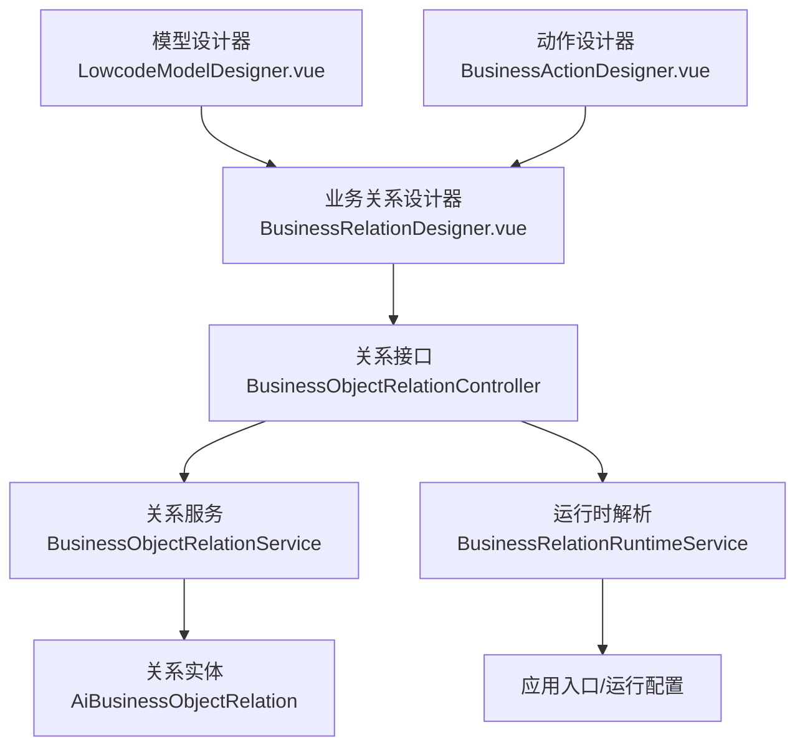
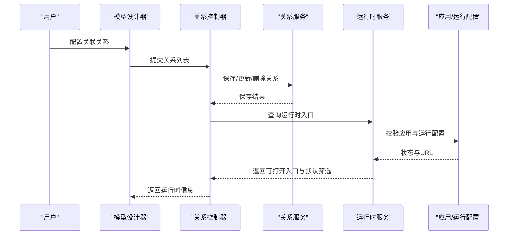
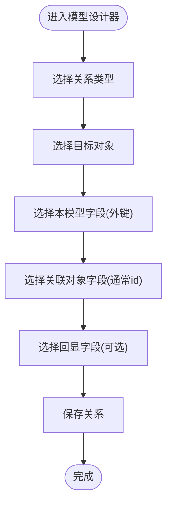
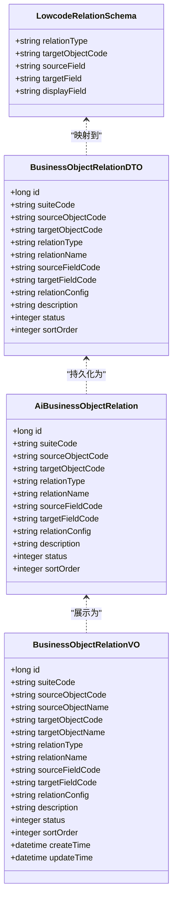
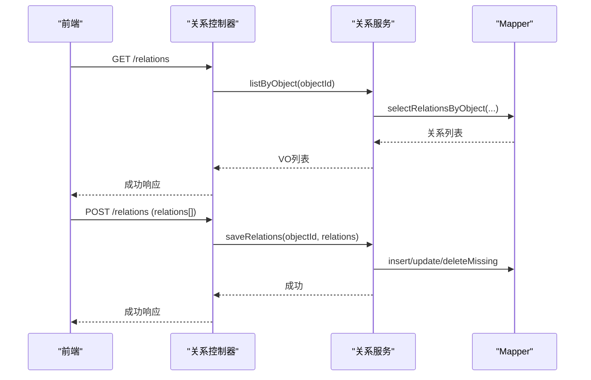
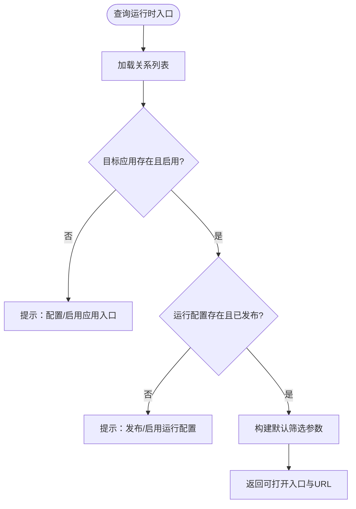
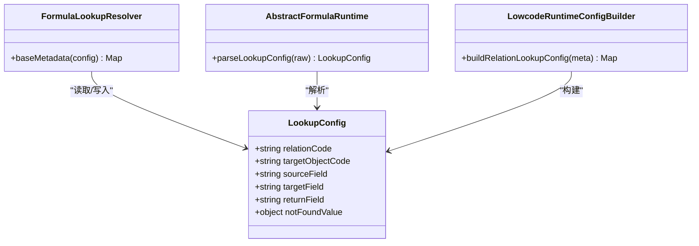
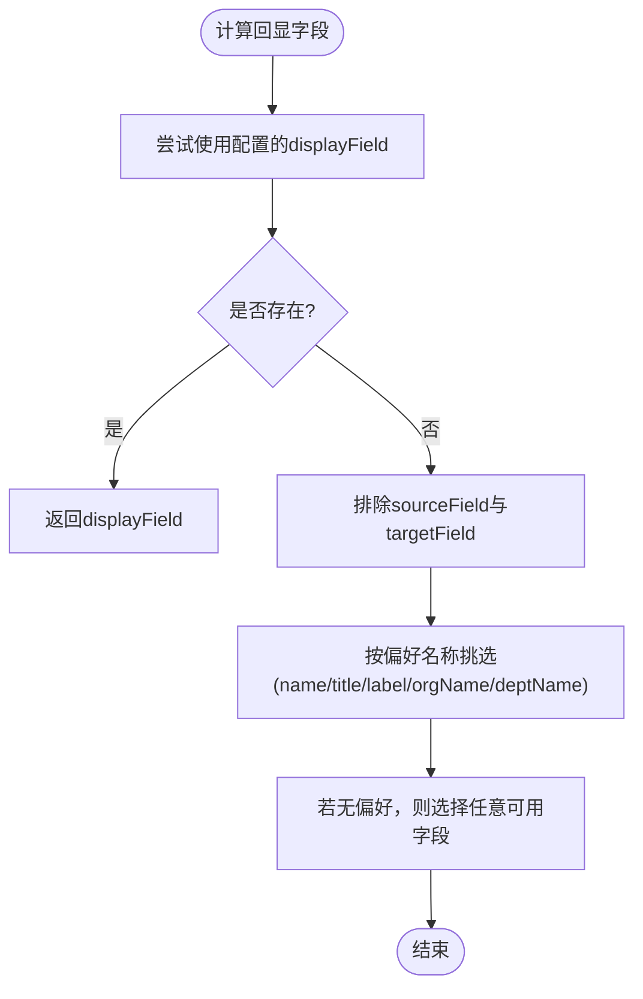
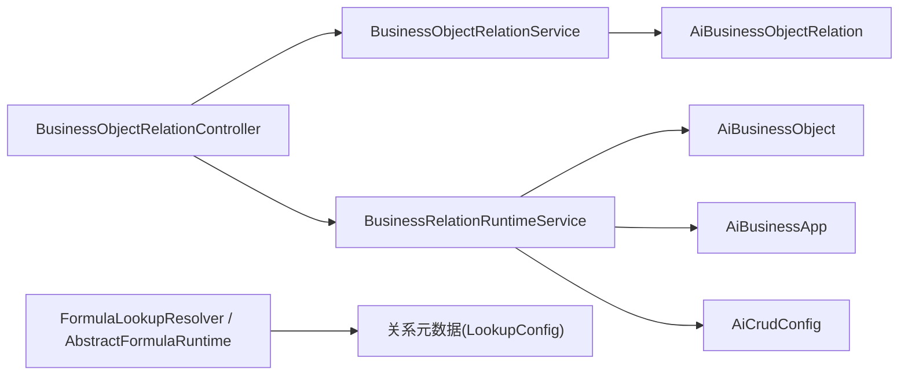

# 关联配置

<cite>
**本文引用的文件**
- [LowcodeModelDesigner.vue](file://forge-admin-ui/src/components/lowcode-builder/model/LowcodeModelDesigner.vue)
- [BusinessRelationDesigner.vue](file://forge-admin-ui/src/views/app-center/components/designer/BusinessRelationDesigner.vue)
- [BusinessActionDesigner.vue](file://forge-admin-ui/src/views/app-center/components/designer/BusinessActionDesigner.vue)
- [LowcodeRelationSchema.java](file://forge-server/forge-framework/forge-plugin-parent/forge-plugin-generator/src/main/java/com/mdframe/forge/plugin/generator/dto/lowcode/LowcodeRelationSchema.java)
- [AiBusinessObjectRelation.java](file://forge-server/forge-framework/forge-plugin-parent/forge-plugin-generator/src/main/java/com/mdframe/forge/plugin/generator/domain/entity/AiBusinessObjectRelation.java)
- [BusinessObjectRelationDTO.java](file://forge-server/forge-framework/forge-plugin-parent/forge-plugin-generator/src/main/java/com/mdframe/forge/plugin/generator/dto/businessapp/BusinessObjectRelationDTO.java)
- [BusinessObjectRelationVO.java](file://forge-server/forge-framework/forge-plugin-parent/forge-plugin-generator/src/main/java/com/mdframe/forge/plugin/generator/vo/businessapp/BusinessObjectRelationVO.java)
- [BusinessRelationRuntimeVO.java](file://forge-server/forge-framework/forge-plugin-parent/forge-plugin-generator/src/main/java/com/mdframe/forge/plugin/generator/vo/businessapp/BusinessRelationRuntimeVO.java)
- [BusinessObjectRelationController.java](file://forge-server/forge-framework/forge-plugin-parent/forge-plugin-generator/src/main/java/com/mdframe/forge/plugin/generator/controller/BusinessObjectRelationController.java)
- [BusinessObjectRelationService.java](file://forge-server/forge-framework/forge-plugin-parent/forge-plugin-generator/src/main/java/com/mdframe/forge/plugin/generator/service/businessapp/BusinessObjectRelationService.java)
- [BusinessRelationRuntimeService.java](file://forge-server/forge-framework/forge-plugin-parent/forge-plugin-generator/src/main/java/com/mdframe/forge/plugin/generator/service/businessapp/BusinessRelationRuntimeService.java)
- [LookupConfig.java](file://forge-server/forge-framework/forge-plugin-parent/forge-plugin-generator/src/main/java/com/mdframe/forge/plugin/generator/domain/formula/LookupConfig.java)
- [FormulaLookupResolver.java](file://forge-server/forge-framework/forge-plugin-parent/forge-plugin-generator/src/main/java/com/mdframe/forge/plugin/generator/service/formula/FormulaLookupResolver.java)
- [AbstractFormulaRuntime.java](file://forge-server/forge-framework/forge-plugin-parent/forge-plugin-generator/src/main/java/com/mdframe/forge/plugin/generator/service/formula/AbstractFormulaRuntime.java)
- [FormulaObjectDependencyAnalyzer.java](file://forge-server/forge-framework/forge-plugin-parent/forge-plugin-generator/src/main/java/com/mdframe/forge/plugin/generator/service/formula/FormulaObjectDependencyAnalyzer.java)
- [LowcodeRuntimeConfigBuilder.java](file://forge-server/forge-framework/forge-plugin-parent/forge-plugin-generator/src/main/java/com/mdframe/forge/plugin/generator/service/lowcode/LowcodeRuntimeConfigBuilder.java)
- [DynamicCrudService.java](file://forge-server/forge-framework/forge-plugin-parent/forge-plugin-generator/src/main/java/com/mdframe/forge/plugin/generator/service/DynamicCrudService.java)
</cite>

## 目录
1. [简介](#简介)
2. [项目结构](#项目结构)
3. [核心组件](#核心组件)
4. [架构总览](#架构总览)
5. [详细组件分析](#详细组件分析)
6. [依赖关系分析](#依赖关系分析)
7. [性能与运行时机制](#性能与运行时机制)
8. [故障排查指南](#故障排查指南)
9. [结论](#结论)
10. [附录](#附录)

## 简介
本技术文档围绕“关联配置”能力，系统阐述模型间关联关系的配置界面、元数据结构、验证机制以及运行期工作机制。重点覆盖：
- 引用关系（多对一）、一对多、一对一的配置方法与差异
- 源字段、目标字段、回显字段的配置逻辑与自动推断策略
- 字段类型匹配、数据完整性检查、循环依赖检测等校验规则
- 运行时的数据加载策略、缓存管理与性能优化建议
- 复杂业务场景下的多级关联、动态关联、条件关联设计模式与最佳实践

## 项目结构
关联配置涉及前端配置界面与后端服务层协同：
- 前端：低代码模型设计器与业务关系设计器负责可视化配置关联关系，并维护本地状态与展示映射
- 后端：提供对象关系持久化、运行时解析、公式与查询的关联元数据构建与校验

**图表来源**
- [LowcodeModelDesigner.vue:135-197](file://forge-admin-ui/src/components/lowcode-builder/model/LowcodeModelDesigner.vue#L135-L197)
- [BusinessRelationDesigner.vue:1706-1730](file://forge-admin-ui/src/views/app-center/components/designer/BusinessRelationDesigner.vue#L1706-L1730)
- [BusinessActionDesigner.vue:1600-1628](file://forge-admin-ui/src/views/app-center/components/designer/BusinessActionDesigner.vue#L1600-L1628)
- [BusinessObjectRelationController.java:36-67](file://forge-server/forge-framework/forge-plugin-parent/forge-plugin-generator/src/main/java/com/mdframe/forge/plugin/generator/controller/BusinessObjectRelationController.java#L36-L67)
- [BusinessObjectRelationService.java:31-59](file://forge-server/forge-framework/forge-plugin-parent/forge-plugin-generator/src/main/java/com/mdframe/forge/plugin/generator/service/businessapp/BusinessObjectRelationService.java#L31-L59)
- [AiBusinessObjectRelation.java:15-50](file://forge-server/forge-framework/forge-plugin-parent/forge-plugin-generator/src/main/java/com/mdframe/forge/plugin/generator/domain/entity/AiBusinessObjectRelation.java#L15-L50)
- [BusinessRelationRuntimeService.java:43-163](file://forge-server/forge-framework/forge-plugin-parent/forge-plugin-generator/src/main/java/com/mdframe/forge/plugin/generator/service/businessapp/BusinessRelationRuntimeService.java#L43-L163)

**章节来源**
- [LowcodeModelDesigner.vue:135-197](file://forge-admin-ui/src/components/lowcode-builder/model/LowcodeModelDesigner.vue#L135-L197)
- [BusinessRelationDesigner.vue:1706-1730](file://forge-admin-ui/src/views/app-center/components/designer/BusinessRelationDesigner.vue#L1706-L1730)
- [BusinessActionDesigner.vue:1600-1628](file://forge-admin-ui/src/views/app-center/components/designer/BusinessActionDesigner.vue#L1600-L1628)
- [BusinessObjectRelationController.java:36-67](file://forge-server/forge-framework/forge-plugin-parent/forge-plugin-generator/src/main/java/com/mdframe/forge/plugin/generator/controller/BusinessObjectRelationController.java#L36-L67)
- [BusinessObjectRelationService.java:31-59](file://forge-server/forge-framework/forge-plugin-parent/forge-plugin-generator/src/main/java/com/mdframe/forge/plugin/generator/service/businessapp/BusinessObjectRelationService.java#L31-L59)
- [AiBusinessObjectRelation.java:15-50](file://forge-server/forge-framework/forge-plugin-parent/forge-plugin-generator/src/main/java/com/mdframe/forge/plugin/generator/domain/entity/AiBusinessObjectRelation.java#L15-L50)
- [BusinessRelationRuntimeService.java:43-163](file://forge-server/forge-framework/forge-plugin-parent/forge-plugin-generator/src/main/java/com/mdframe/forge/plugin/generator/service/businessapp/BusinessRelationRuntimeService.java#L43-L163)

## 核心组件
- 低代码关系协议：定义领域内对象关系的轻量级结构，包含关系类型、目标对象、源/目标字段及回显字段
- 关系实体与存储：持久化保存对象关系，包括关系类型、名称、字段映射、配置JSON、状态与排序
- 关系服务：提供增删改查、范围校验、唯一性约束、状态归一化
- 运行时服务：解析关系为可打开的运行入口，生成默认筛选参数，校验应用与运行配置状态
- 公式与查询：基于关系元数据构建查找配置，支持返回字段与未找到值处理
- 前端设计器：可视化配置关联关系，维护选择器显示字段与映射行

**章节来源**
- [LowcodeRelationSchema.java:8-20](file://forge-server/forge-framework/forge-plugin-parent/forge-plugin-generator/src/main/java/com/mdframe/forge/plugin/generator/dto/lowcode/LowcodeRelationSchema.java#L8-L20)
- [AiBusinessObjectRelation.java:15-50](file://forge-server/forge-framework/forge-plugin-parent/forge-plugin-generator/src/main/java/com/mdframe/forge/plugin/generator/domain/entity/AiBusinessObjectRelation.java#L15-L50)
- [BusinessObjectRelationService.java:36-105](file://forge-server/forge-framework/forge-plugin-parent/forge-plugin-generator/src/main/java/com/mdframe/forge/plugin/generator/service/businessapp/BusinessObjectRelationService.java#L36-L105)
- [BusinessRelationRuntimeService.java:43-163](file://forge-server/forge-framework/forge-plugin-parent/forge-plugin-generator/src/main/java/com/mdframe/forge/plugin/generator/service/businessapp/BusinessRelationRuntimeService.java#L43-L163)
- [LookupConfig.java:29-51](file://forge-server/forge-framework/forge-plugin-parent/forge-plugin-generator/src/main/java/com/mdframe/forge/plugin/generator/domain/formula/LookupConfig.java#L29-L51)
- [FormulaLookupResolver.java:334-342](file://forge-server/forge-framework/forge-plugin-parent/forge-plugin-generator/src/main/java/com/mdframe/forge/plugin/generator/service/formula/FormulaLookupResolver.java#L334-L342)
- [AbstractFormulaRuntime.java:195-211](file://forge-server/forge-framework/forge-plugin-parent/forge-plugin-generator/src/main/java/com/mdframe/forge/plugin/generator/service/formula/AbstractFormulaRuntime.java#L195-L211)
- [LowcodeModelDesigner.vue:135-197](file://forge-admin-ui/src/components/lowcode-builder/model/LowcodeModelDesigner.vue#L135-L197)
- [BusinessRelationDesigner.vue:1706-1730](file://forge-admin-ui/src/views/app-center/components/designer/BusinessRelationDesigner.vue#L1706-L1730)

## 架构总览
关联配置的端到端流程如下：
- 用户在模型设计器中配置关联关系（类型、目标对象、源/目标字段、回显字段）
- 保存后通过控制器调用服务层持久化关系，并同步模型关系
- 运行时根据关系元数据解析目标应用与运行配置，生成可打开入口与默认筛选条件
- 公式与查询子系统使用关系元数据构建查找配置，实现跨对象取值

**图表来源**
- [BusinessObjectRelationController.java:36-67](file://forge-server/forge-framework/forge-plugin-parent/forge-plugin-generator/src/main/java/com/mdframe/forge/plugin/generator/controller/BusinessObjectRelationController.java#L36-L67)
- [BusinessObjectRelationService.java:36-59](file://forge-server/forge-framework/forge-plugin-parent/forge-plugin-generator/src/main/java/com/mdframe/forge/plugin/generator/service/businessapp/BusinessObjectRelationService.java#L36-L59)
- [BusinessRelationRuntimeService.java:43-163](file://forge-server/forge-framework/forge-plugin-parent/forge-plugin-generator/src/main/java/com/mdframe/forge/plugin/generator/service/businessapp/BusinessRelationRuntimeService.java#L43-L163)

## 详细组件分析

### 前端配置界面与交互
- 模型设计器提供关系类型选择、目标对象选择、本模型字段（外键）、关联对象字段（通常为id）、回显字段选择；支持删除与提示文案
- 业务关系设计器维护选择器显示字段与映射行，支持文本与编码两种形式，并在保存时规范化为字段映射
- 动作设计器将动作中的集合路径与关系进行匹配，合并字段并生成动作关系列表

**图表来源**
- [LowcodeModelDesigner.vue:135-197](file://forge-admin-ui/src/components/lowcode-builder/model/LowcodeModelDesigner.vue#L135-L197)
- [BusinessRelationDesigner.vue:1706-1730](file://forge-admin-ui/src/views/app-center/components/designer/BusinessRelationDesigner.vue#L1706-L1730)
- [BusinessActionDesigner.vue:1600-1628](file://forge-admin-ui/src/views/app-center/components/designer/BusinessActionDesigner.vue#L1600-L1628)

**章节来源**
- [LowcodeModelDesigner.vue:135-197](file://forge-admin-ui/src/components/lowcode-builder/model/LowcodeModelDesigner.vue#L135-L197)
- [BusinessRelationDesigner.vue:1706-1730](file://forge-admin-ui/src/views/app-center/components/designer/BusinessRelationDesigner.vue#L1706-L1730)
- [BusinessActionDesigner.vue:1600-1628](file://forge-admin-ui/src/views/app-center/components/designer/BusinessActionDesigner.vue#L1600-L1628)

### 后端关系实体与数据传输
- 关系协议（LowcodeRelationSchema）：轻量级结构，用于低代码领域内的关系描述
- 关系实体（AiBusinessObjectRelation）：持久化字段包含来源/目标对象、关系类型、名称、字段映射、配置JSON、状态与排序
- DTO/VO：保存参数与视图对象，便于接口传输与展示

**图表来源**
- [LowcodeRelationSchema.java:8-20](file://forge-server/forge-framework/forge-plugin-parent/forge-plugin-generator/src/main/java/com/mdframe/forge/plugin/generator/dto/lowcode/LowcodeRelationSchema.java#L8-L20)
- [AiBusinessObjectRelation.java:15-50](file://forge-server/forge-framework/forge-plugin-parent/forge-plugin-generator/src/main/java/com/mdframe/forge/plugin/generator/domain/entity/AiBusinessObjectRelation.java#L15-L50)
- [BusinessObjectRelationDTO.java:8-34](file://forge-server/forge-framework/forge-plugin-parent/forge-plugin-generator/src/main/java/com/mdframe/forge/plugin/generator/dto/businessapp/BusinessObjectRelationDTO.java#L8-L34)
- [BusinessObjectRelationVO.java:11-44](file://forge-server/forge-framework/forge-plugin-parent/forge-plugin-generator/src/main/java/com/mdframe/forge/plugin/generator/vo/businessapp/BusinessObjectRelationVO.java#L11-L44)

**章节来源**
- [LowcodeRelationSchema.java:8-20](file://forge-server/forge-framework/forge-plugin-parent/forge-plugin-generator/src/main/java/com/mdframe/forge/plugin/generator/dto/lowcode/LowcodeRelationSchema.java#L8-L20)
- [AiBusinessObjectRelation.java:15-50](file://forge-server/forge-framework/forge-plugin-parent/forge-plugin-generator/src/main/java/com/mdframe/forge/plugin/generator/domain/entity/AiBusinessObjectRelation.java#L15-L50)
- [BusinessObjectRelationDTO.java:8-34](file://forge-server/forge-framework/forge-plugin-parent/forge-plugin-generator/src/main/java/com/mdframe/forge/plugin/generator/dto/businessapp/BusinessObjectRelationDTO.java#L8-L34)
- [BusinessObjectRelationVO.java:11-44](file://forge-server/forge-framework/forge-plugin-parent/forge-plugin-generator/src/main/java/com/mdframe/forge/plugin/generator/vo/businessapp/BusinessObjectRelationVO.java#L11-L44)

### 关系服务与控制器
- 控制器暴露关系查询、保存、删除与运行时入口查询接口，具备权限控制与操作日志
- 服务层实现批量保存、缺失关系清理、范围校验、唯一性约束、状态归一化

**图表来源**
- [BusinessObjectRelationController.java:36-67](file://forge-server/forge-framework/forge-plugin-parent/forge-plugin-generator/src/main/java/com/mdframe/forge/plugin/generator/controller/BusinessObjectRelationController.java#L36-L67)
- [BusinessObjectRelationService.java:31-59](file://forge-server/forge-framework/forge-plugin-parent/forge-plugin-generator/src/main/java/com/mdframe/forge/plugin/generator/service/businessapp/BusinessObjectRelationService.java#L31-L59)

**章节来源**
- [BusinessObjectRelationController.java:36-67](file://forge-server/forge-framework/forge-plugin-parent/forge-plugin-generator/src/main/java/com/mdframe/forge/plugin/generator/controller/BusinessObjectRelationController.java#L36-L67)
- [BusinessObjectRelationService.java:31-59](file://forge-server/forge-framework/forge-plugin-parent/forge-plugin-generator/src/main/java/com/mdframe/forge/plugin/generator/service/businessapp/BusinessObjectRelationService.java#L31-L59)

### 运行时解析与跳转
- 运行时服务根据关系元数据解析目标对象、应用入口与运行配置，校验启用状态与发布状态
- 若可打开，则生成路由方式与目标URL，并构造默认筛选参数（以目标字段等于源字段值）

**图表来源**
- [BusinessRelationRuntimeService.java:43-163](file://forge-server/forge-framework/forge-plugin-parent/forge-plugin-generator/src/main/java/com/mdframe/forge/plugin/generator/service/businessapp/BusinessRelationRuntimeService.java#L43-L163)

**章节来源**
- [BusinessRelationRuntimeService.java:43-163](file://forge-server/forge-framework/forge-plugin-parent/forge-plugin-generator/src/main/java/com/mdframe/forge/plugin/generator/service/businessapp/BusinessRelationRuntimeService.java#L43-L163)

### 公式与查询的关联元数据
- LookupConfig定义关系查找配置，包含关系编码、目标对象、源/目标字段、返回字段与未找到值
- 公式解析器将原始配置转换为标准查找配置，并注入基础元数据
- 运行时配置构建器从关系中提取源字段、目标字段与回显字段，生成查找配置

**图表来源**
- [LookupConfig.java:29-51](file://forge-server/forge-framework/forge-plugin-parent/forge-plugin-generator/src/main/java/com/mdframe/forge/plugin/generator/domain/formula/LookupConfig.java#L29-L51)
- [FormulaLookupResolver.java:334-342](file://forge-server/forge-framework/forge-plugin-parent/forge-plugin-generator/src/main/java/com/mdframe/forge/plugin/generator/service/formula/FormulaLookupResolver.java#L334-L342)
- [AbstractFormulaRuntime.java:195-211](file://forge-server/forge-framework/forge-plugin-parent/forge-plugin-generator/src/main/java/com/mdframe/forge/plugin/generator/service/formula/AbstractFormulaRuntime.java#L195-L211)
- [LowcodeRuntimeConfigBuilder.java:1339-1370](file://forge-server/forge-framework/forge-plugin-parent/forge-plugin-generator/src/main/java/com/mdframe/forge/plugin/generator/service/lowcode/LowcodeRuntimeConfigBuilder.java#L1339-L1370)

**章节来源**
- [LookupConfig.java:29-51](file://forge-server/forge-framework/forge-plugin-parent/forge-plugin-generator/src/main/java/com/mdframe/forge/plugin/generator/domain/formula/LookupConfig.java#L29-L51)
- [FormulaLookupResolver.java:334-342](file://forge-server/forge-framework/forge-plugin-parent/forge-plugin-generator/src/main/java/com/mdframe/forge/plugin/generator/service/formula/FormulaLookupResolver.java#L334-L342)
- [AbstractFormulaRuntime.java:195-211](file://forge-server/forge-framework/forge-plugin-parent/forge-plugin-generator/src/main/java/com/mdframe/forge/plugin/generator/service/formula/AbstractFormulaRuntime.java#L195-L211)
- [LowcodeRuntimeConfigBuilder.java:1339-1370](file://forge-server/forge-framework/forge-plugin-parent/forge-plugin-generator/src/main/java/com/mdframe/forge/plugin/generator/service/lowcode/LowcodeRuntimeConfigBuilder.java#L1339-L1370)

### 回显字段选择与映射
- 动态CRUD服务在无法直接获取回显字段时，优先排除源/目标字段，再按偏好名称（如name/title/label等）挑选
- 前端设计器维护选择器显示字段与映射行，保存时统一为sourceField/targetField映射

**图表来源**
- [DynamicCrudService.java:4737-4775](file://forge-server/forge-framework/forge-plugin-parent/forge-plugin-generator/src/main/java/com/mdframe/forge/plugin/generator/service/DynamicCrudService.java#L4737-L4775)
- [BusinessRelationDesigner.vue:1706-1730](file://forge-admin-ui/src/views/app-center/components/designer/BusinessRelationDesigner.vue#L1706-L1730)

**章节来源**
- [DynamicCrudService.java:4737-4775](file://forge-server/forge-framework/forge-plugin-parent/forge-plugin-generator/src/main/java/com/mdframe/forge/plugin/generator/service/DynamicCrudService.java#L4737-L4775)
- [BusinessRelationDesigner.vue:1706-1730](file://forge-admin-ui/src/views/app-center/components/designer/BusinessRelationDesigner.vue#L1706-L1730)

## 依赖关系分析
- 控制器依赖服务层进行关系管理，并调用运行时服务提供跳转入口
- 服务层依赖对象服务与Mapper进行数据访问与范围校验
- 运行时服务依赖对象、应用与运行配置的数据源，生成可打开入口与默认筛选
- 公式与查询子系统依赖关系元数据，构建查找配置并参与表达式求值

**图表来源**
- [BusinessObjectRelationController.java:36-67](file://forge-server/forge-framework/forge-plugin-parent/forge-plugin-generator/src/main/java/com/mdframe/forge/plugin/generator/controller/BusinessObjectRelationController.java#L36-L67)
- [BusinessObjectRelationService.java:31-59](file://forge-server/forge-framework/forge-plugin-parent/forge-plugin-generator/src/main/java/com/mdframe/forge/plugin/generator/service/businessapp/BusinessObjectRelationService.java#L31-L59)
- [BusinessRelationRuntimeService.java:43-163](file://forge-server/forge-framework/forge-plugin-parent/forge-plugin-generator/src/main/java/com/mdframe/forge/plugin/generator/service/businessapp/BusinessRelationRuntimeService.java#L43-L163)
- [LookupConfig.java:29-51](file://forge-server/forge-framework/forge-plugin-parent/forge-plugin-generator/src/main/java/com/mdframe/forge/plugin/generator/domain/formula/LookupConfig.java#L29-L51)

**章节来源**
- [BusinessObjectRelationController.java:36-67](file://forge-server/forge-framework/forge-plugin-parent/forge-plugin-generator/src/main/java/com/mdframe/forge/plugin/generator/controller/BusinessObjectRelationController.java#L36-L67)
- [BusinessObjectRelationService.java:31-59](file://forge-server/forge-framework/forge-plugin-parent/forge-plugin-generator/src/main/java/com/mdframe/forge/plugin/generator/service/businessapp/BusinessObjectRelationService.java#L31-L59)
- [BusinessRelationRuntimeService.java:43-163](file://forge-server/forge-framework/forge-plugin-parent/forge-plugin-generator/src/main/java/com/mdframe/forge/plugin/generator/service/businessapp/BusinessRelationRuntimeService.java#L43-L163)
- [LookupConfig.java:29-51](file://forge-server/forge-framework/forge-plugin-parent/forge-plugin-generator/src/main/java/com/mdframe/forge/plugin/generator/domain/formula/LookupConfig.java#L29-L51)

## 性能与运行时机制
- 数据加载策略
  - 运行时入口查询一次性加载关系列表，避免多次往返
  - 默认筛选参数在服务器端构建，减少前端计算与网络开销
- 缓存管理
  - 建议在应用层对关系列表与运行时入口进行短期缓存（例如按对象ID维度），降低重复查询
  - 对于频繁访问的目标应用与运行配置，可增加本地缓存或分布式缓存
- 性能优化建议
  - 合理设置关系数量与层级，避免过深或多对多导致的N+1查询
  - 在公式与查询中使用最小必要字段，减少回显字段带来的额外负载
  - 对批量保存与删除使用事务与批量SQL，提升吞吐

[本节为通用性能指导，不直接分析具体文件]

## 故障排查指南
- 常见错误与定位
  - 源字段为空或不存在：检查关系配置中的源字段是否有效
  - 目标对象未找到：确认目标对象编码与应用入口配置是否正确
  - 应用入口停用或未发布：根据提示信息启用或发布运行配置
  - 循环依赖：当存在交叉对象引用形成环时，发布校验会阻止发布
- 排查步骤
  - 查看关系列表与运行时入口返回的message与nextAction
  - 核对源/目标字段映射与回显字段配置
  - 检查公式与查询中的关系元数据是否完整
  - 使用测试用例思路验证非法关系是否被阻断

**章节来源**
- [BusinessRelationRuntimeService.java:90-163](file://forge-server/forge-framework/forge-plugin-parent/forge-plugin-generator/src/main/java/com/mdframe/forge/plugin/generator/service/businessapp/BusinessRelationRuntimeService.java#L90-L163)
- [FormulaObjectDependencyAnalyzer.java:115-134](file://forge-server/forge-framework/forge-plugin-parent/forge-plugin-generator/src/main/java/com/mdframe/forge/plugin/generator/service/formula/FormulaObjectDependencyAnalyzer.java#L115-L134)

## 结论
关联配置通过前后端协同实现了可视化的关系建模与运行期跳转能力。其核心在于：
- 明确的关系元数据结构（源/目标字段、回显字段、关系类型）
- 严格的保存与运行时校验（字段存在性、应用与运行配置状态、循环依赖）
- 高效的运行时解析（生成默认筛选与路由）
- 可扩展的公式与查询集成（查找配置与返回字段）
在实际项目中，建议遵循最小必要字段、合理分层与缓存策略，确保性能与可维护性。

[本节为总结性内容，不直接分析具体文件]

## 附录
- 关系类型说明
  - 引用关系（REFERENCE）：多对一，常用于外键关联
  - 明细关系（DETAIL）：一对多，承载子记录
  - 子列表（CHILD_LIST）：用于子表展示
  - 多对多（MANY_TO_MANY）：复杂关联场景
- 最佳实践
  - 多级关联：通过中间对象拆分复杂关系，避免深层嵌套
  - 动态关联：基于上下文条件选择不同目标对象或字段
  - 条件关联：在运行时根据业务状态决定关联行为
  - 回显字段：优先选择语义明确的名称字段，提升可读性

[本节为概念性补充，不直接分析具体文件]