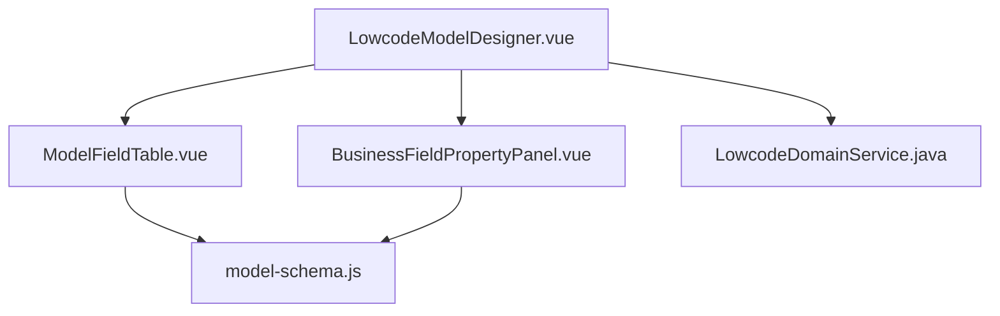
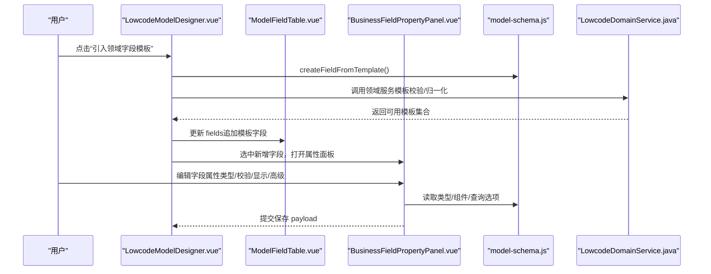
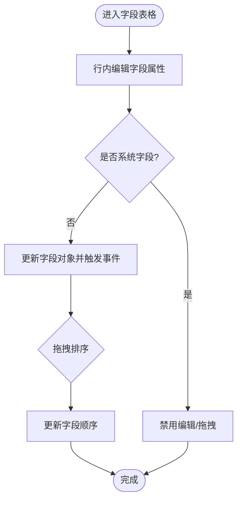
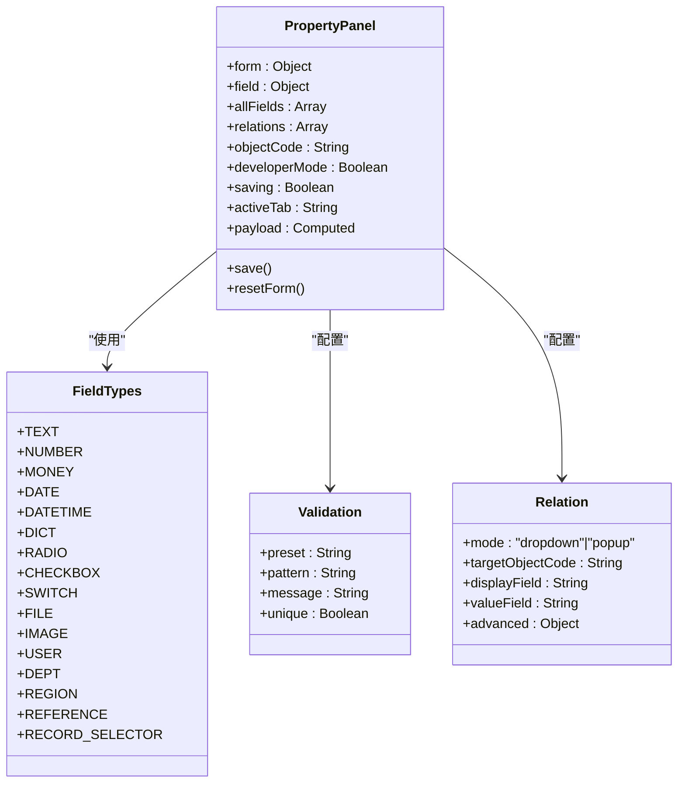
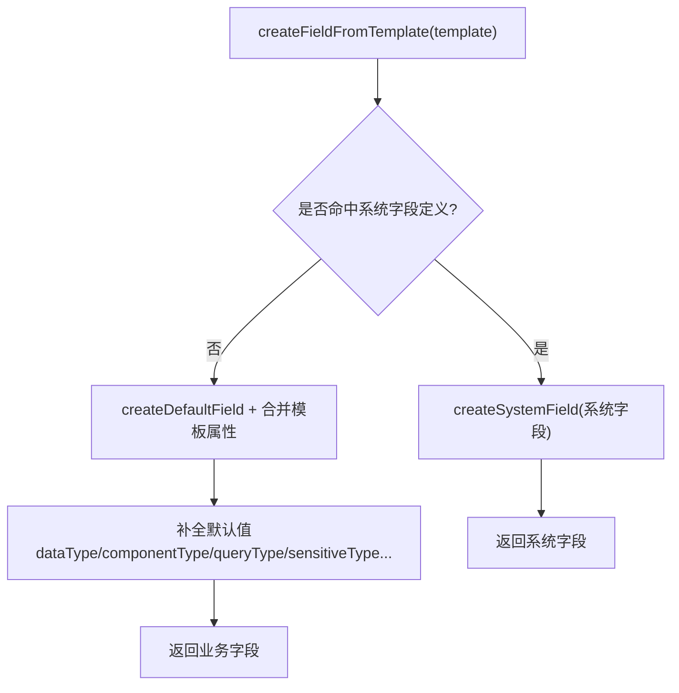
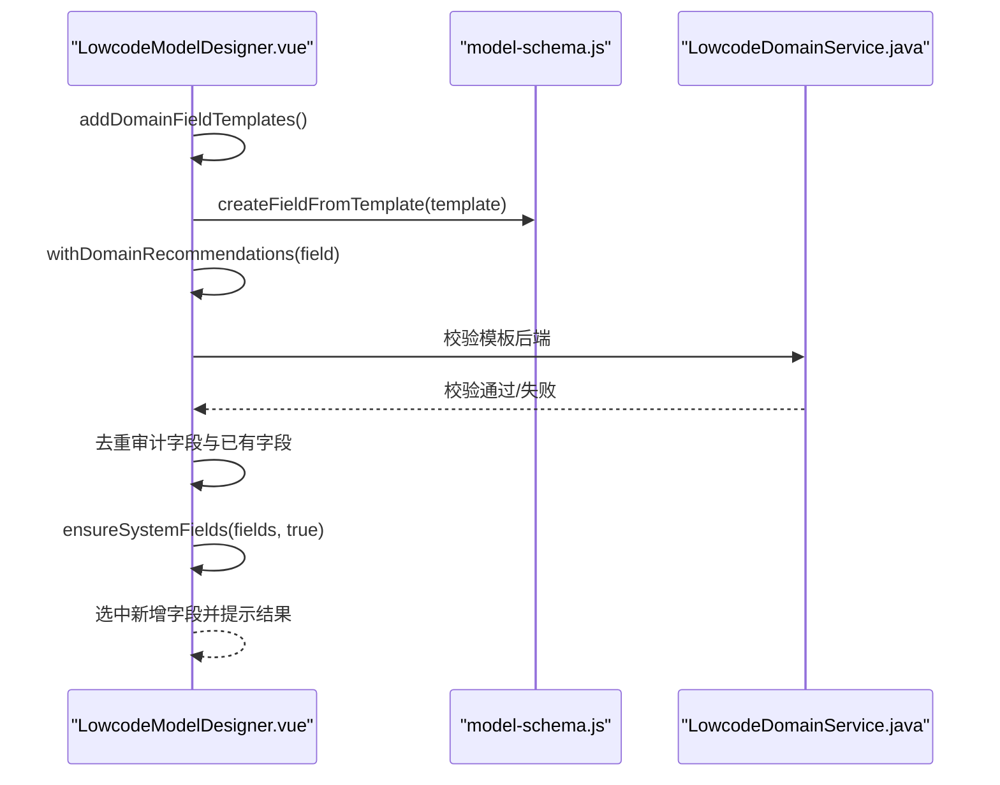
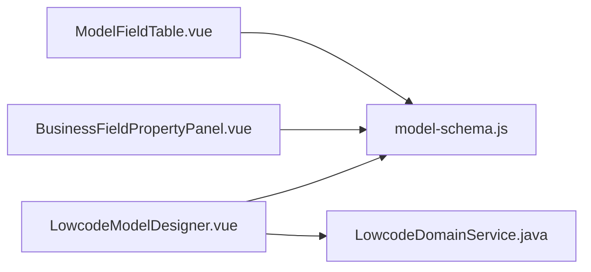

# 字段配置系统

<cite>
**本文引用的文件**
- [model-schema.js](file://forge-admin-ui/src/components/lowcode-builder/model/model-schema.js)
- [ModelFieldTable.vue](file://forge-admin-ui/src/components/lowcode-builder/model/ModelFieldTable.vue)
- [BusinessFieldPropertyPanel.vue](file://forge-admin-ui/src/views/app-center/components/designer/BusinessFieldPropertyPanel.vue)
- [LowcodeModelDesigner.vue](file://forge-admin-ui/src/components/lowcode-builder/model/LowcodeModelDesigner.vue)
- [LowcodeDomainService.java](file://forge-server/forge-framework/forge-plugin-parent/forge-plugin-generator/src/main/java/com/mdframe/forge/plugin/generator/service/lowcode/LowcodeDomainService.java)
</cite>

## 目录
1. [简介](#简介)
2. [项目结构](#项目结构)
3. [核心组件](#核心组件)
4. [架构总览](#架构总览)
5. [详细组件分析](#详细组件分析)
6. [依赖关系分析](#依赖关系分析)
7. [性能考虑](#性能考虑)
8. [故障排查指南](#故障排查指南)
9. [结论](#结论)
10. [附录](#附录)

## 简介
本技术文档围绕“字段配置系统”展开，重点解析以下能力：
- ModelFieldTable 字段表格组件：字段列表管理、拖拽排序、复制与删除、字段属性行内编辑。
- ModelFieldPropertyPanel 字段属性面板：字段类型选择器、验证规则配置、显示控制选项、高级属性设置（含公式、关联对象、脱敏加密等）。
- model-schema.js 数据模型定义：字段元数据结构、类型系统、默认值处理、系统字段与审计字段机制、命名规范化。
- 领域模板系统：字段模板引入、智能推荐（字典推荐）、冲突检测（重复字段、审计字段保护）。
- 扩展机制与自定义字段类型开发指南：如何注册新字段类型、组件映射、查询方式与校验预设。

## 项目结构
字段配置系统主要位于前端低代码建模模块中，核心文件分布如下：
- 数据模型与工具：model-schema.js
- 字段表格视图：ModelFieldTable.vue
- 字段属性面板：BusinessFieldPropertyPanel.vue
- 模型设计器入口：LowcodeModelDesigner.vue
- 后端领域服务（模板校验与归一化）：LowcodeDomainService.java

图表来源
- [LowcodeModelDesigner.vue:70-106](file://forge-admin-ui/src/components/lowcode-builder/model/LowcodeModelDesigner.vue#L70-L106)
- [ModelFieldTable.vue:133-188](file://forge-admin-ui/src/components/lowcode-builder/model/ModelFieldTable.vue#L133-L188)
- [BusinessFieldPropertyPanel.vue:76-457](file://forge-admin-ui/src/views/app-center/components/designer/BusinessFieldPropertyPanel.vue#L76-L457)
- [model-schema.js:200-377](file://forge-admin-ui/src/components/lowcode-builder/model/model-schema.js#L200-L377)
- [LowcodeDomainService.java:255-307](file://forge-server/forge-framework/forge-plugin-parent/forge-plugin-generator/src/main/java/com/mdframe/forge/plugin/generator/service/lowcode/LowcodeDomainService.java#L255-L307)

章节来源
- [LowcodeModelDesigner.vue:70-106](file://forge-admin-ui/src/components/lowcode-builder/model/LowcodeModelDesigner.vue#L70-L106)
- [model-schema.js:200-377](file://forge-admin-ui/src/components/lowcode-builder/model/model-schema.js#L200-L377)

## 核心组件
- ModelFieldTable：以网格布局展示字段行，支持行内编辑字段名、编码、备注、数据类型、组件类型、长度、精度、必填、默认值；提供复制、删除操作；通过拖拽调整顺序；锁定系统字段不可编辑。
- BusinessFieldPropertyPanel：分标签页维护字段业务定义、规则与安全、数据库与开发属性；支持常用校验预设、正则表达式、唯一性、导入导出开关、级联过滤、关联对象配置、脱敏与加密、公式计算与调试。
- model-schema.js：集中定义数据类型、组件类型、查询方式、敏感类型、系统字段定义、默认模型构建、字段创建与归一化工具函数。
- LowcodeModelDesigner：组合上述组件，提供添加字段、引入领域模板、校验模型等功能，并协调字段选择与属性面板联动。
- LowcodeDomainService：后端对领域模板进行归一化与校验，确保模板字段不覆盖审计字段、无重复字段，并补齐缺失结构。

章节来源
- [ModelFieldTable.vue:1-196](file://forge-admin-ui/src/components/lowcode-builder/model/ModelFieldTable.vue#L1-L196)
- [BusinessFieldPropertyPanel.vue:76-457](file://forge-admin-ui/src/views/app-center/components/designer/BusinessFieldPropertyPanel.vue#L76-L457)
- [model-schema.js:11-62](file://forge-admin-ui/src/components/lowcode-builder/model/model-schema.js#L11-L62)
- [LowcodeModelDesigner.vue:70-106](file://forge-admin-ui/src/components/lowcode-builder/model/LowcodeModelDesigner.vue#L70-L106)
- [LowcodeDomainService.java:255-307](file://forge-server/forge-framework/forge-plugin-parent/forge-plugin-generator/src/main/java/com/mdframe/forge/plugin/generator/service/lowcode/LowcodeDomainService.java#L255-L307)

## 架构总览
字段配置系统采用“视图-模型-工具”分层：
- 视图层：ModelFieldTable 与 BusinessFieldPropertyPanel 负责交互与展示。
- 模型层：model-schema.js 提供字段元数据、类型枚举、默认值策略、系统字段与审计字段识别。
- 编排层：LowcodeModelDesigner 组织字段表格与属性面板，驱动领域模板引入与模型校验。
- 服务端：LowcodeDomainService 对领域模板进行标准化与约束校验，保障模板质量与一致性。

图表来源
- [LowcodeModelDesigner.vue:494-526](file://forge-admin-ui/src/components/lowcode-builder/model/LowcodeModelDesigner.vue#L494-L526)
- [model-schema.js:458-487](file://forge-admin-ui/src/components/lowcode-builder/model/model-schema.js#L458-L487)
- [LowcodeDomainService.java:255-307](file://forge-server/forge-framework/forge-plugin-parent/forge-plugin-generator/src/main/java/com/mdframe/forge/plugin/generator/service/lowcode/LowcodeDomainService.java#L255-L307)

## 详细组件分析

### ModelFieldTable 字段表格组件
- 字段列表管理：通过 vuedraggable 实现拖拽排序，使用 fieldRowKey 基于索引稳定渲染；系统字段标记为只读，禁止移动与编辑。
- 行内编辑：字段名称、字段编码、备注、数据类型、组件类型、长度、小数位、必填、默认值均可在行内直接修改；字段编码输入时自动同步生成数据库列名（驼峰转下划线）。
- 批量操作：提供复制与删除按钮；删除前弹出确认提示，避免误删。
- 排序与过滤：当前版本未内置搜索与过滤，可通过上层容器或后续扩展增加。
- 关联信息展示：根据 dictType 或 relationLabel 显示关联上下文。

图表来源
- [ModelFieldTable.vue:151-188](file://forge-admin-ui/src/components/lowcode-builder/model/ModelFieldTable.vue#L151-L188)
- [model-schema.js:387-389](file://forge-admin-ui/src/components/lowcode-builder/model/model-schema.js#L387-L389)

章节来源
- [ModelFieldTable.vue:1-196](file://forge-admin-ui/src/components/lowcode-builder/model/ModelFieldTable.vue#L1-L196)
- [model-schema.js:387-389](file://forge-admin-ui/src/components/lowcode-builder/model/model-schema.js#L387-L389)

### ModelFieldPropertyPanel 字段属性面板
- 字段类型选择器：提供文本、数字、金额、日期、下拉、单选、多选、开关、附件、图片、人员、部门、地区、引用对象、记录选择器等类型。
- 验证规则配置：支持常用校验预设（如手机号、邮箱），可自动填充正则与提示；支持自定义正则表达式与校验提示；支持唯一性校验。
- 显示控制选项：支持导入/导出开关、级联过滤（上级字段、匹配方式、远程参数名）等。
- 高级属性设置：字段英文名、数据库列名、数据类型、小数位、默认控件、默认查询方式、字段状态、脱敏类型、加密算法；支持公式配置、预览、调试、执行日志与依赖图。
- 关联对象配置：统一封装“下拉选择”和“弹窗选择器”两种模式，支持目标对象、显示字段、值字段、套件编码、回显目标字段、弹窗展示字段、搜索字段、字段映射、过滤参数等。

图表来源
- [BusinessFieldPropertyPanel.vue:640-678](file://forge-admin-ui/src/views/app-center/components/designer/BusinessFieldPropertyPanel.vue#L640-L678)
- [BusinessFieldPropertyPanel.vue:157-204](file://forge-admin-ui/src/views/app-center/components/designer/BusinessFieldPropertyPanel.vue#L157-L204)
- [BusinessFieldPropertyPanel.vue:206-329](file://forge-admin-ui/src/views/app-center/components/designer/BusinessFieldPropertyPanel.vue#L206-L329)

章节来源
- [BusinessFieldPropertyPanel.vue:76-457](file://forge-admin-ui/src/views/app-center/components/designer/BusinessFieldPropertyPanel.vue#L76-L457)

### model-schema.js 数据模型定义
- 类型系统：
  - 数据类型：短文本、定长文本、长文本、整数、长整数、小数、日期、日期时间、时间、开关值。
  - 组件类型：单行输入、多行文本、数字输入、下拉选择、单选、多选、字典选择、树形选择、组织树选择、用户选择、区划树选择、级联选择、开关、日期、日期时间、时间、图片上传、文件上传。
  - 查询方式：等于、包含、大于等于、小于等于、区间、多值。
  - 敏感类型：不敏感、手机号、身份证、邮箱、银行卡、姓名、地址。
- 默认值处理：
  - createDefaultField 提供字段默认值（如 length=128、precision=2、required=false、listVisible=true、formVisible=true 等）。
  - ensureSystemFields 将系统字段（ID、租户、审计字段）插入到字段列表首尾，保证系统字段不被覆盖。
- 继承机制：
  - createFieldFromTemplate 从模板创建字段，若命中系统字段定义则转为系统字段；否则合并模板属性并补全默认值。
  - createFieldFromGenColumn 从数据库列生成字段，推断数据类型、长度、精度、组件类型、查询方式、是否主键、是否自增等。
- 命名规范：
  - normalizeFieldName 将输入清洗为合法驼峰字段名。
  - camelToSnake 将字段名转换为数据库列名。
  - normalizeObjectCode / normalizeTableName 用于生成对象编码与表名。
- 系统字段与审计字段：
  - systemFieldDefinitions 定义 ID、租户、创建人、创建时间、创建部门、更新人、更新时间、删除标志等系统字段。
  - isAuditField / isSystemField / isLockedSystemField 用于判断字段是否受保护。

图表来源
- [model-schema.js:458-487](file://forge-admin-ui/src/components/lowcode-builder/model/model-schema.js#L458-L487)
- [model-schema.js:319-345](file://forge-admin-ui/src/components/lowcode-builder/model/model-schema.js#L319-L345)
- [model-schema.js:86-193](file://forge-admin-ui/src/components/lowcode-builder/model/model-schema.js#L86-L193)

章节来源
- [model-schema.js:11-62](file://forge-admin-ui/src/components/lowcode-builder/model/model-schema.js#L11-L62)
- [model-schema.js:200-377](file://forge-admin-ui/src/components/lowcode-builder/model/model-schema.js#L200-L377)
- [model-schema.js:458-592](file://forge-admin-ui/src/components/lowcode-builder/model/model-schema.js#L458-L592)

### 领域模板系统
- 字段模板引入：
  - LowcodeModelDesigner 提供“引入领域字段模板”按钮，遍历 domainSchema.fieldTemplates，调用 createFieldFromTemplate 生成字段。
  - 跳过审计字段与已存在字段（按 field 或 columnName 去重），追加后重新注入系统字段，并选中最后一个新增字段。
- 智能推荐：
  - withDomainRecommendations 根据 dictRecommendations 为模板字段推荐字典类型，若字段未配置且存在推荐则自动填充。
- 冲突检测：
  - 前端：跳过审计字段与重复字段，避免覆盖与冲突。
  - 后端：LowcodeDomainService.validateFieldTemplates 校验模板字段不得覆盖审计字段，且字段名必须唯一，否则抛出异常。

图表来源
- [LowcodeModelDesigner.vue:494-526](file://forge-admin-ui/src/components/lowcode-builder/model/LowcodeModelDesigner.vue#L494-L526)
- [model-schema.js:458-487](file://forge-admin-ui/src/components/lowcode-builder/model/model-schema.js#L458-L487)
- [LowcodeDomainService.java:292-307](file://forge-server/forge-framework/forge-plugin-parent/forge-plugin-generator/src/main/java/com/mdframe/forge/plugin/generator/service/lowcode/LowcodeDomainService.java#L292-L307)

章节来源
- [LowcodeModelDesigner.vue:494-526](file://forge-admin-ui/src/components/lowcode-builder/model/LowcodeModelDesigner.vue#L494-L526)
- [LowcodeDomainService.java:255-307](file://forge-server/forge-framework/forge-plugin-parent/forge-plugin-generator/src/main/java/com/mdframe/forge/plugin/generator/service/lowcode/LowcodeDomainService.java#L255-L307)

## 依赖关系分析
- ModelFieldTable 依赖 model-schema.js 的类型枚举与工具函数（数据类型、组件类型、命名规范、系统字段判断）。
- BusinessFieldPropertyPanel 依赖 model-schema.js 的默认字段构造、系统字段判断、以及外部字典选择器与表单组件。
- LowcodeModelDesigner 组合 ModelFieldTable 与 BusinessFieldPropertyPanel，并调用 model-schema.js 的模板转换与系统字段注入逻辑。
- 后端 LowcodeDomainService 对领域模板进行归一化与校验，确保模板质量与一致性。

图表来源
- [ModelFieldTable.vue:133-188](file://forge-admin-ui/src/components/lowcode-builder/model/ModelFieldTable.vue#L133-L188)
- [BusinessFieldPropertyPanel.vue:76-457](file://forge-admin-ui/src/views/app-center/components/designer/BusinessFieldPropertyPanel.vue#L76-L457)
- [LowcodeModelDesigner.vue:70-106](file://forge-admin-ui/src/components/lowcode-builder/model/LowcodeModelDesigner.vue#L70-L106)
- [LowcodeDomainService.java:255-307](file://forge-server/forge-framework/forge-plugin-parent/forge-plugin-generator/src/main/java/com/mdframe/forge/plugin/generator/service/lowcode/LowcodeDomainService.java#L255-L307)

章节来源
- [ModelFieldTable.vue:133-188](file://forge-admin-ui/src/components/lowcode-builder/model/ModelFieldTable.vue#L133-L188)
- [BusinessFieldPropertyPanel.vue:76-457](file://forge-admin-ui/src/views/app-center/components/designer/BusinessFieldPropertyPanel.vue#L76-L457)
- [LowcodeModelDesigner.vue:70-106](file://forge-admin-ui/src/components/lowcode-builder/model/LowcodeModelDesigner.vue#L70-L106)
- [LowcodeDomainService.java:255-307](file://forge-server/forge-framework/forge-plugin-parent/forge-plugin-generator/src/main/java/com/mdframe/forge/plugin/generator/service/lowcode/LowcodeDomainService.java#L255-L307)

## 性能考虑
- 拖拽排序：vuedraggable 动画与 itemKey 基于索引，适合中等规模字段列表；当字段数量较大时可考虑虚拟滚动或分页加载。
- 行内编辑：每次变更仅更新当前行对象并触发父组件事件，避免全量重渲染；注意系统字段锁定减少不必要的计算。
- 属性面板：复杂表单（公式、关联对象）按需加载与懒渲染，减少初始渲染开销；公式预览与调试异步执行，避免阻塞主线程。
- 领域模板引入：批量追加字段后进行系统字段注入，建议在前端做去重与最小化更新，降低重绘成本。

[本节为通用性能建议，不直接分析具体文件]

## 故障排查指南
- 无法编辑系统字段：
  - 现象：字段行内编辑被禁用，拖拽手柄不可用。
  - 原因：isLockedSystemField 判定为系统或只读字段。
  - 解决：勿修改系统字段；如需调整，请在模型基础信息或后端策略中处理。
- 引入领域模板无效：
  - 现象：点击“引入领域字段模板”无变化。
  - 可能原因：领域无模板、模板字段与现有字段重复、审计字段被跳过。
  - 排查：检查 domainSchema.fieldTemplates 是否存在；查看控制台提示；确认字段去重逻辑。
- 字段编码不规范：
  - 现象：字段名包含非法字符或大小写混乱。
  - 解决：使用 normalizeFieldName 自动清洗；确保字段编码符合驼峰命名。
- 校验失败：
  - 现象：保存时报错或提示校验失败。
  - 可能原因：必填未填、正则不匹配、唯一性冲突、模板字段重复或覆盖审计字段。
  - 解决：根据提示修正；在后端校验失败时检查 LowcodeDomainService 抛出的异常信息。

章节来源
- [ModelFieldTable.vue:151-188](file://forge-admin-ui/src/components/lowcode-builder/model/ModelFieldTable.vue#L151-L188)
- [LowcodeModelDesigner.vue:494-526](file://forge-admin-ui/src/components/lowcode-builder/model/LowcodeModelDesigner.vue#L494-L526)
- [LowcodeDomainService.java:292-307](file://forge-server/forge-framework/forge-plugin-parent/forge-plugin-generator/src/main/java/com/mdframe/forge/plugin/generator/service/lowcode/LowcodeDomainService.java#L292-L307)

## 结论
字段配置系统通过清晰的组件分工与强大的数据模型定义，实现了字段列表管理、属性配置、领域模板引入与智能推荐、以及严格的冲突检测与保护机制。ModelFieldTable 提供高效的行内编辑与排序，BusinessFieldPropertyPanel 覆盖从基础到高级的全量配置场景，model-schema.js 提供统一的类型系统与默认值策略，LowcodeDomainService 在后端保障模板质量。整体架构具备良好的可扩展性，便于新增字段类型与高级功能。

[本节为总结性内容，不直接分析具体文件]

## 附录

### 扩展机制与自定义字段类型开发指南
- 新增字段类型：
  - 在 BusinessFieldPropertyPanel 的 fieldTypeOptions 中添加新类型（如 CUSTOM_TYPE）。
  - 在 componentOptions 中映射对应的 UI 组件（如 customComponent）。
  - 在 model-schema.js 的 dataTypeOptions 或 resolveDataType 中补充后端类型映射。
- 组件类型映射：
  - 在 model-schema.js 的 resolveComponentType 中增加 htmlType 或 dataType 到组件类型的映射。
- 查询方式扩展：
  - 在 queryTypeOptions 中新增查询方式，并在 resolveQueryType 中兼容旧值与新值。
- 校验预设扩展：
  - 在 COMMON_VALIDATION_PRESETS 中添加新的常用校验规则（正则与提示），供属性面板快速选择。
- 系统字段保护：
  - 新增系统字段需在 systemFieldDefinitions 中定义，并确保 isAuditField/isSystemField/isLockedSystemField 正确识别。
- 领域模板扩展：
  - 在领域 schema 中新增 fieldTemplates 条目，并在 withDomainRecommendations 中配置 dictRecommendations 以启用智能推荐。
  - 后端需确保 validateFieldTemplates 允许新模板字段且不覆盖审计字段。

章节来源
- [BusinessFieldPropertyPanel.vue:640-678](file://forge-admin-ui/src/views/app-center/components/designer/BusinessFieldPropertyPanel.vue#L640-L678)
- [model-schema.js:11-62](file://forge-admin-ui/src/components/lowcode-builder/model/model-schema.js#L11-L62)
- [model-schema.js:522-592](file://forge-admin-ui/src/components/lowcode-builder/model/model-schema.js#L522-L592)
- [LowcodeModelDesigner.vue:494-526](file://forge-admin-ui/src/components/lowcode-builder/model/LowcodeModelDesigner.vue#L494-L526)
- [LowcodeDomainService.java:292-307](file://forge-server/forge-framework/forge-plugin-parent/forge-plugin-generator/src/main/java/com/mdframe/forge/plugin/generator/service/lowcode/LowcodeDomainService.java#L292-L307)